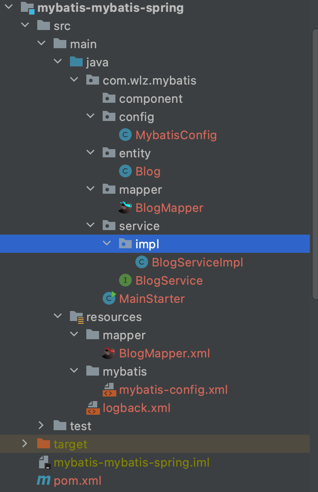
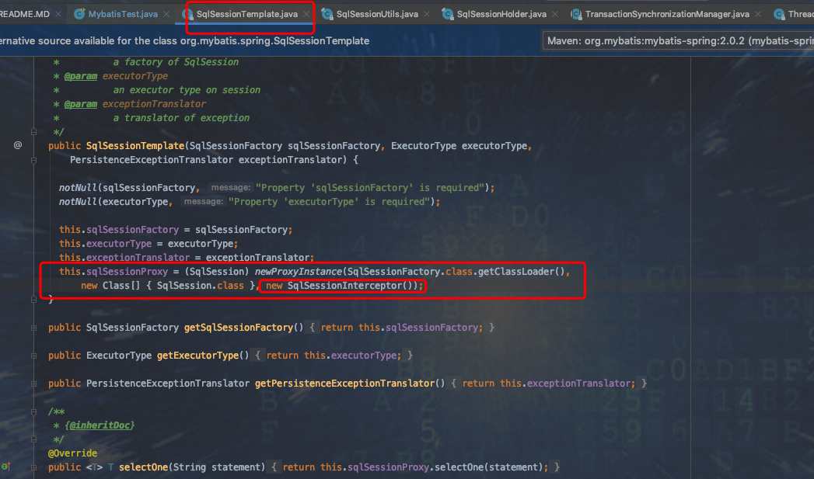
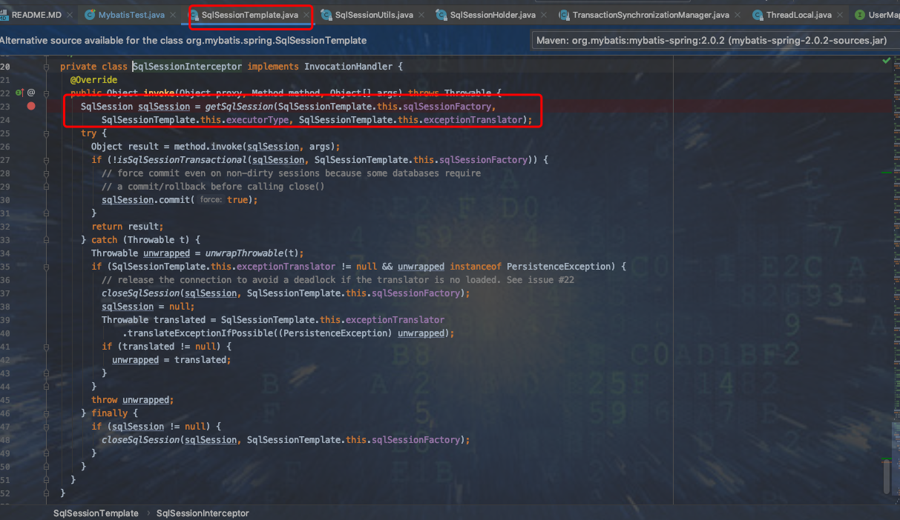
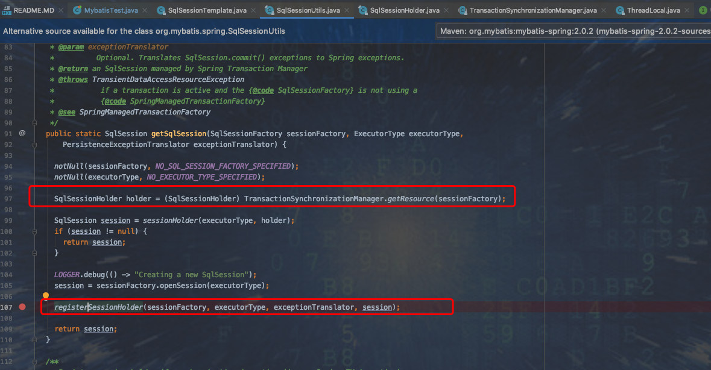
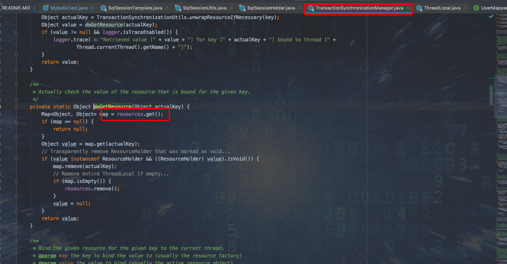
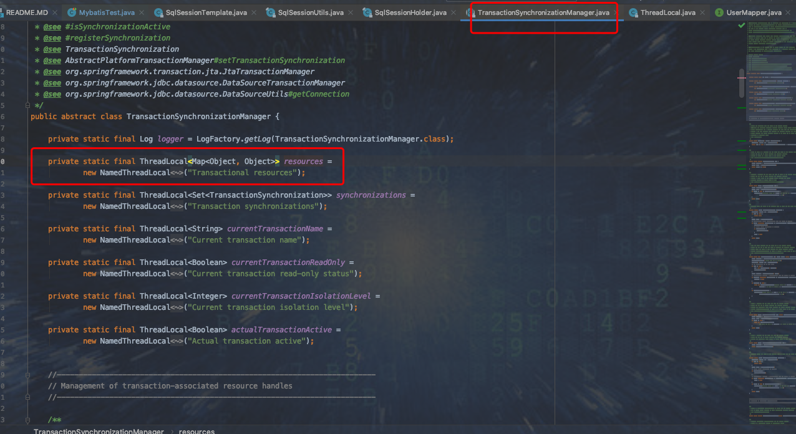
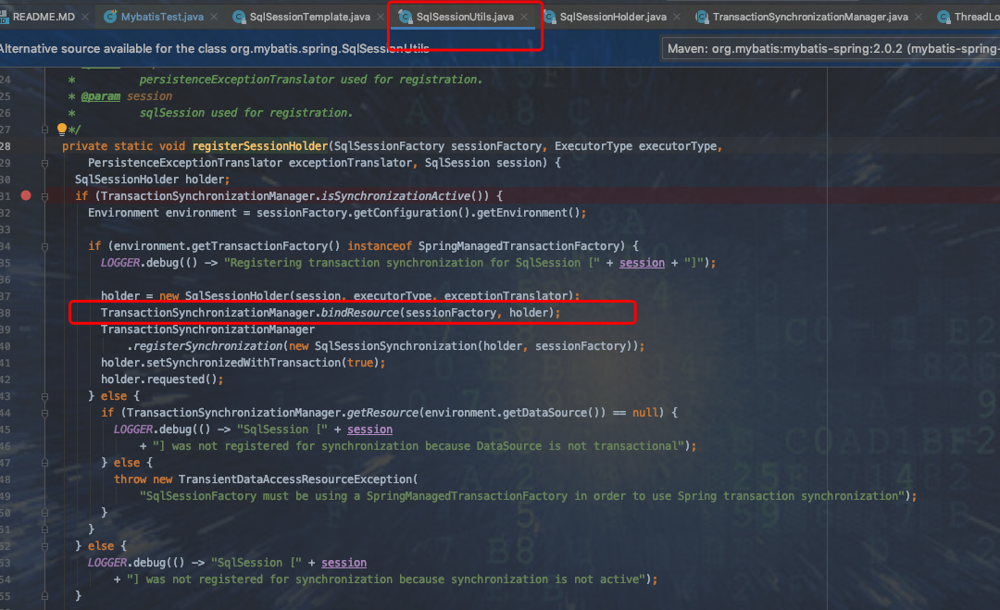
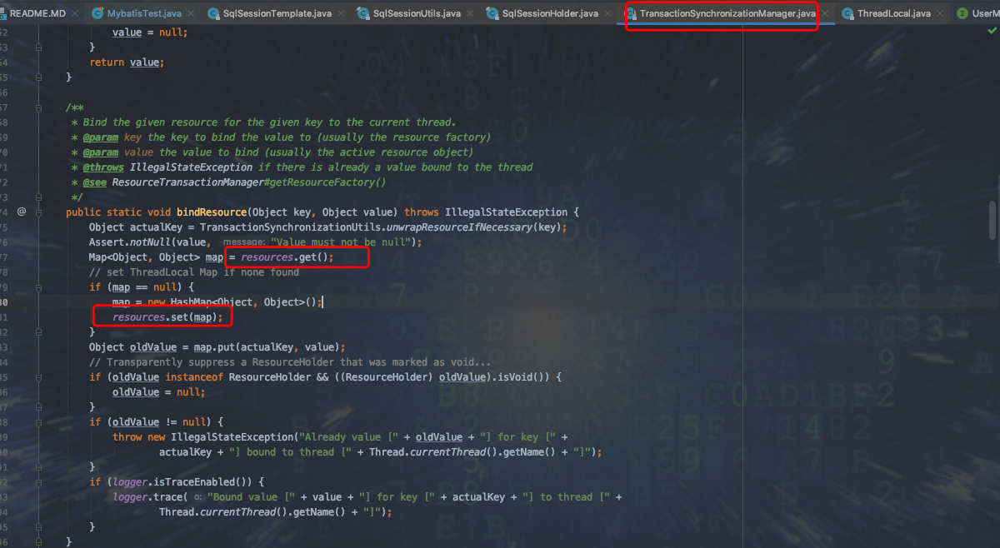
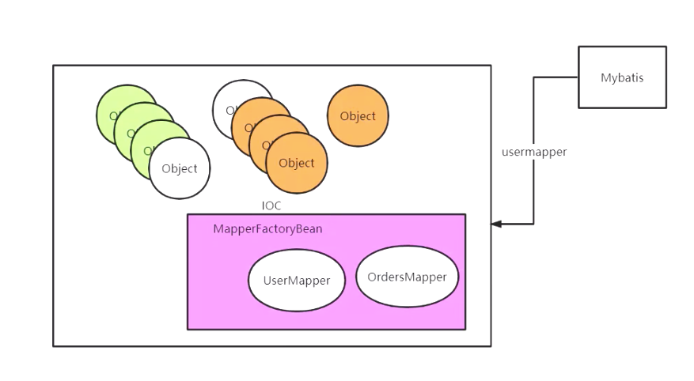

### 1. spring-mybatis 的使用

  主程序
 
```
@RunWith(SpringJUnit4ClassRunner.class)
@ContextConfiguration(locations = {"classpath*:/spring-mybatis.xml"})
@Slf4j
public class MybatisTest {

  @Resource(name = "sqlSession")
  SqlSessionTemplate sqlSessionTemplate;

  @Test
  public void testUserMapper2() {
   User user=sqlSessionTemplate.selectOne("com.wlz.mapper.UserMapper.selectUser",1);
   User user2=sqlSessionTemplate.selectOne("com.wlz.mapper.UserMapper.selectUser",1);
   log.info("user:{}",user);
   log.info("user2:{}",user2);
  }

  @Autowired
  private UserMapper userMapper;

  @Test
  public void testUserMapper() {
    User selectUser = userMapper.selectUser(1);
    User selectUser2 = userMapper.selectUser(1);
    log.error("user:{}",selectUser);
    log.error("user2:{}",selectUser2);

  }
}
```
  spring-mybatis.xml

```
<?xml version="1.0" encoding="UTF-8"?>
<beans xmlns="http://www.springframework.org/schema/beans"
       xmlns:xsi="http://www.w3.org/2001/XMLSchema-instance"
       xsi:schemaLocation="http://www.springframework.org/schema/beans http://www.springframework.org/schema/beans/spring-beans.xsd http://www.springframework.org/schema/context http://www.springframework.org/schema/context/spring-context.xsd">

    <bean id="sqlSessionFactory" class="org.mybatis.spring.SqlSessionFactoryBean">
        <property name="dataSource" ref="dataSource" />
        <property name="mapperLocations" value="classpath*:mybatis/UserMappers.xml" />
    </bean>

    <bean id="dataSource" class="com.alibaba.druid.pool.DruidDataSource"
          init-method="init" destroy-method="close">
        <property name="driverClassName" value="com.mysql.jdbc.Driver" />
        <property name="url" value="jdbc:mysql://localhost:3306/mybatis?useUnicode=true" />
        <property name="username" value="root" />
        <property name="password" value="root" />
        <property name="initialSize" value="1" />
        <property name="minIdle" value="1" />
        <property name="maxActive" value="10" />
        <property name="maxWait" value="60000" />
        <property name="timeBetweenEvictionRunsMillis" value="50000" />
        <property name="minEvictableIdleTimeMillis" value="300000" />
        <property name="validationQuery" value="SELECT 'x'" />
        <property name="testWhileIdle" value="true" />
        <property name="testOnBorrow" value="false" />
        <property name="testOnReturn" value="false" />
        <property name="poolPreparedStatements" value="true" />
        <property name="maxPoolPreparedStatementPerConnectionSize"
                  value="20" />
        <property name="filters" value="stat" />
    </bean>

   <bean class="org.mybatis.spring.mapper.MapperScannerConfigurer">
        <property name="basePackage" value="bat.ke.qq.mapper" />
    </bean>

    <bean id="sqlSession" class="org.mybatis.spring.SqlSessionTemplate">
        <constructor-arg index="0" ref="sqlSessionFactory" />

    </bean>

    <bean id="userMapper" class="org.mybatis.spring.mapper.MapperFactoryBean">
        <property name="mapperInterface" value="com.wlz.mapper.UserMapper" />
        <property name="sqlSessionFactory" ref="sqlSessionFactory" />
    </bean>

  <!--  <bean id="sqlSession" class="org.mybatis.spring.SqlSessionTemplate">
        <constructor-arg index="0" ref="sqlSessionFactory" />
    </bean>-->
</beans>
```
 mapper 
```
public interface UserMapper {

   //@Select("select * from user where id=#{id}")
   public User selectUser(Integer id);
}
```
 mapper.xml

```
<?xml version="1.0" encoding="UTF-8" ?>
<!DOCTYPE mapper
        PUBLIC "-//mybatis.org//DTD Mapper 3.0//EN"
        "http://mybatis.org/dtd/mybatis-3-mapper.dtd">
<mapper namespace="com.wlz.mapper.UserMapper">
    <select id="selectUser" parameterType="integer" resultType="com.wlz.pojo.User">
        select * from user where id = #{id}
    </select>
</mapper>
```

### 2. Mybatis集成Spring 

#### 2.1 在spring 源码中添加mybatis 集成测试模块 （由于在spring源码中添加mybatis 失败，故单独建了个maven项目） 



#### 2.2 添加 依赖

```xml
 <dependency>
            <groupId>mysql</groupId>
            <artifactId>mysql-connector-java</artifactId>
            <version>5.1.46</version>
        </dependency>
        <dependency>
            <groupId>com.alibaba</groupId>
            <artifactId>druid</artifactId>
            <version>1.1.8</version>
        </dependency>
        <dependency>
            <groupId>org.mybatis</groupId>
            <artifactId>mybatis-spring</artifactId>
            <version>2.0.6-wlz</version>
        </dependency>

        <dependency>
            <groupId>org.mybatis</groupId>
            <artifactId>mybatis</artifactId>
            <version>3.5.5-wlz</version>
        </dependency>

        <dependency>
            <groupId>org.projectlombok</groupId>
            <artifactId>lombok</artifactId>
            <version>1.16.18</version>
        </dependency>

        <dependency>
            <groupId>com.github.pagehelper</groupId>
            <artifactId>pagehelper</artifactId>
            <version>4.1.6</version>
        </dependency>

        <dependency>
            <groupId>org.springframework</groupId>
            <artifactId>spring-context</artifactId>
            <version>5.3.20</version>
        </dependency>

        <dependency>
            <groupId>org.springframework</groupId>
            <artifactId>spring-jdbc</artifactId>
            <version>5.3.20</version>
        </dependency>

        <dependency>
            <groupId>ch.qos.logback</groupId>
            <artifactId>logback-core</artifactId>
            <version>1.1.2</version>
        </dependency>

        <dependency>
            <groupId>ch.qos.logback</groupId>
            <artifactId>logback-classic</artifactId>
            <version>1.1.2</version>
        </dependency>

        <dependency>
            <groupId>org.slf4j</groupId>
            <artifactId>slf4j-api</artifactId>
            <version>1.7.7</version>
        </dependency>

        <dependency>
            <groupId>org.springframework</groupId>
            <artifactId>spring-aop</artifactId>
            <version>5.3.20</version>
        </dependency>

    <!--在使用maven工程将mybatis源码引入，方便代码调试与阅读源码。但是引入后使用懒加载报错 ,需要引入如下依赖-->
        <dependency>
            <groupId>ognl</groupId>
            <artifactId>ognl</artifactId>
            <version>3.2.14</version>
            <scope>compile</scope>
            <optional>true</optional>
        </dependency>
        <dependency>
            <groupId>org.javassist</groupId>
            <artifactId>javassist</artifactId>
            <version>3.27.0-GA</version>
            <scope>compile</scope>
            <optional>true</optional>
        </dependency>
    </dependencies>

```

#### 2.3 添加mybatis 测试代码 (只贴入核心类)

```java
@Configuration
@MapperScan("com.wlz.mybatis.mapper")
@ComponentScan("com.wlz.mybatis")
public class MybatisConfig {  // ==> spring.xml


    @Bean
    public DataSource dataSource() {
        DruidDataSource dataSource = new DruidDataSource();
        dataSource.setUsername("root");
        dataSource.setPassword("123456");
        dataSource.setDriverClassName("com.mysql.jdbc.Driver");
        dataSource.setUrl("jdbc:mysql://localhost:3306/mybatis?serverTimezone=UTC&useSSL=false");
        return dataSource;
    }

    @Bean
    public SqlSessionFactoryBean sqlSessionFactory() throws IOException {
        SqlSessionFactoryBean sessionFactoryBean = new SqlSessionFactoryBean();
        sessionFactoryBean.setDataSource(dataSource());
        sessionFactoryBean.setConfigLocation(new ClassPathResource("mybatis/mybatis-config.xml"));
        sessionFactoryBean.setMapperLocations(new PathMatchingResourcePatternResolver().getResources("classpath:mapper/*.xml"));
        sessionFactoryBean.setTypeAliasesPackage("com.wlz.mybatis.entity");
        // 控制哪些类的别名不支持
//        sessionFactoryBean.setTypeAliasesSuperType(Blog.class);
        return sessionFactoryBean;
    }
    
}
```

```java
@Slf4j
public class MainStarter {

    public static void main(String[] args) {
        AnnotationConfigApplicationContext context = new AnnotationConfigApplicationContext(MybatisConfig.class);
        for (String beanDefinitionName : context.getBeanDefinitionNames()) {
            log.info("beanName = " + beanDefinitionName);
        }
        BlogService blogService = context.getBean(BlogService.class);
        log.info("blogService = " +  blogService.getClass());

        Blog blog = blogService.selectBlog(1);

        log.info("blog = " + blog.toString());
    }
}
```

### 3. 核心源码分析 

#### 3.1 SqlSessionFactoryBean 类 

  SqlSessionFactoryBean  实现了FactoryBean接口，也实现了 bean 的生命周期回调接口 ，从而 会调用 getObject() 和 afterPropertiesSet() 

  从 getObject() 和 afterPropertiesSet() 两个方法调用过程可看 核心是 buildSqlSessionFactory(), 构建我们的sqlSessionFactory 的实例

```java
public class SqlSessionFactoryBean
        implements FactoryBean<SqlSessionFactory>, InitializingBean, ApplicationListener<ApplicationEvent> {
    @Override
    public void afterPropertiesSet() throws Exception {
        notNull(dataSource, "Property 'dataSource' is required");
        notNull(sqlSessionFactoryBuilder, "Property 'sqlSessionFactoryBuilder' is required");
        state((configuration == null && configLocation == null) || !(configuration != null && configLocation != null),
                "Property 'configuration' and 'configLocation' can not specified with together");

        // 通过 sqlSessionFactoryBuilder 来构建我们的sqlSessionFactory
        this.sqlSessionFactory = buildSqlSessionFactory();
    }

    protected SqlSessionFactory buildSqlSessionFactory() throws Exception {

        // 声明一个 Configuration 对象 用于保存mybatis 的所有配置信息
        final Configuration targetConfiguration;

        XMLConfigBuilder xmlConfigBuilder = null;

        /**
         * 初始化 configuration 对象 和设置其 variables 属性
         */
        // 判断当前的 SqlSessionFactoryBean 是否在配置@Bean 的时候 factoryBean.setConfiguration();
        if (this.configuration != null) {
            // 将配置的 SqlSessionFactoryBean 配置的 configuration 赋给 targetConfiguration
            targetConfiguration = this.configuration;
            if (targetConfiguration.getVariables() == null) {
                targetConfiguration.setVariables(this.configurationProperties);
            } else if (this.configurationProperties != null) {
                targetConfiguration.getVariables().putAll(this.configurationProperties);
            }
        }
        // 对 configLocation 进行非空判断， 由于我们配置了SqlSessionFactoryBean 的configLocation 属性设置
        // sessionFactoryBean.setConfigLocation(new ClassPathResource("mybatis/mybatis-config.xml"));
        else if (this.configLocation != null) {

            // 创建我们的xml配置构建器对象，对 mybatis/mybatis-config.xml 配置文件进行解析，在这里已经吧我们的 mybatis-config.xml 解析出要给 document 对象
            xmlConfigBuilder = new XMLConfigBuilder(this.configLocation.getInputStream(), null, this.configurationProperties);

            // 因为我们在创建XML 的时候已经把Configuration 对象创建出来了
            targetConfiguration = xmlConfigBuilder.getConfiguration();
        } else {
            LOGGER.debug(
                    () -> "Property 'configuration' or 'configLocation' not specified, using default MyBatis Configuration");
            targetConfiguration = new Configuration();

            // 判断 configurationProperties 不为空，那么就调用 targetConfiguration.set 方法，把 configurationProperties 注入到 configuration
            Optional.ofNullable(this.configurationProperties).ifPresent(targetConfiguration::setVariables);
        }

        // 判断 objectFactory 不为空，那么就调用 targetConfiguration.set 方法 把 objectFactory 注入到 configuration 对象中
        Optional.ofNullable(this.objectFactory).ifPresent(targetConfiguration::setObjectFactory);

        // 判断 objectWrapperFactory 不为空，那么就调用 targetConfiguration.set 方法，把 objectWrapperFactory 注入到 configuration 对象中
        Optional.ofNullable(this.objectWrapperFactory).ifPresent(targetConfiguration::setObjectWrapperFactory);

        // 判断 vfs 不为空 ，那么就调用 targetConfiguration.set 方法，把 vfs 注入到 configuration 对象中。
        Optional.ofNullable(this.vfs).ifPresent(targetConfiguration::setVfsImpl);

        /**
         *  typeAliasesPackage 配置分两种情况
         *   1. 在 mybatis-config.xml 中 配置
         *     <typeAliases>
         *      <package name="com.wlz.mybatis.entity"/>
         *     </typeAliases>
         *
         *   2. 在配置我们的 SqlSessionFactoryBean 的时候配置
         *     sessionFactoryBean.setTypeAliasesPackage("com.wlz.mybatis.entity");
         *  那么 在 Blog 就不需要 写错 com.wlz.mybatis.entity 了
         *     <select  id="selectBlog"   resultType="Blog">
         *        select * from blog where id = #{id}
         *     </select>
         *
         *  若我们在配置SqlSessionFactoryBean 接口的时候配置了 TypeAliasesPackage 那么 这里才不为空
         *  同理，我们可以通过 SqlSessionFactoryBean 的 typeAliasesSuperType 来控制哪些类的别名不支持
         */
        if (hasLength(this.typeAliasesPackage)) {
            // 第一步: 扫描我们 typeAliasesPackage 包路径下的所有的实体类的class 类型
            // 第二步: 进行过滤，然后注册到 Configuration 的别名映射器中
            scanClasses(this.typeAliasesPackage, this.typeAliasesSuperType).stream()
                    .filter(clazz -> !clazz.isAnonymousClass()).filter(clazz -> !clazz.isInterface())
                    .filter(clazz -> !clazz.isMemberClass()).forEach(targetConfiguration.getTypeAliasRegistry()::registerAlias);
        }

        // 判断我们SqlSessionFactory 是否配置 了 typeAliases(class类型) 一般 typeAliasesPackage  配置好了就没有必要配置 typeAliases
        // 注册到 Configuration 的别名映射器中
        if (!isEmpty(this.typeAliases)) {
            Stream.of(this.typeAliases).forEach(typeAlias -> {
                targetConfiguration.getTypeAliasRegistry().registerAlias(typeAlias);
                LOGGER.debug(() -> "Registered type alias: '" + typeAlias + "'");
            });
        }

        // 把我们自定义的插件注册到我们的mybatis 的配置类上，系统默认的插件 Executor(update,query,fushStatements,commit ,rollback,getTransaction)
        if (!isEmpty(this.plugins)) {
            Stream.of(this.plugins).forEach(plugin -> {
                targetConfiguration.addInterceptor(plugin);
                LOGGER.debug(() -> "Registered plugin: '" + plugin + "'");
            });
        }

        // 扫描我们自定义的类处理器(用来处理我们的java类型和数据库类型的转化)，并且注册到我们的 targetConfiguration(批量注册)
        if (hasLength(this.typeHandlersPackage)) {
            scanClasses(this.typeHandlersPackage, TypeHandler.class).stream().filter(clazz -> !clazz.isAnonymousClass())
                    .filter(clazz -> !clazz.isInterface()).filter(clazz -> !Modifier.isAbstract(clazz.getModifiers()))
                    .forEach(targetConfiguration.getTypeHandlerRegistry()::register);
        }

        // 通过配置 <TypeHandlers/> 的形式来注册我们的类型处理器对象
        if (!isEmpty(this.typeHandlers)) {
            Stream.of(this.typeHandlers).forEach(typeHandler -> {
                targetConfiguration.getTypeHandlerRegistry().register(typeHandler);
                LOGGER.debug(() -> "Registered type handler: '" + typeHandler + "'");
            });
        }

        targetConfiguration.setDefaultEnumTypeHandler(defaultEnumTypeHandler);

        // mybatis 从 3.2 开始支持可插拔的脚本语言， 因此你可以在插入一种语言的驱动(language driver) 之后来写基于这种语言的动态 SQL 查询
        if (!isEmpty(this.scriptingLanguageDrivers)) {
            Stream.of(this.scriptingLanguageDrivers).forEach(languageDriver -> {
                targetConfiguration.getLanguageRegistry().register(languageDriver);
                LOGGER.debug(() -> "Registered scripting language driver: '" + languageDriver + "'");
            });
        }
        Optional.ofNullable(this.defaultScriptingLanguageDriver)
                .ifPresent(targetConfiguration::setDefaultScriptingLanguage);

        // 设置数据库厂商
        if (this.databaseIdProvider != null) {// fix #64 set databaseId before parse mapper xmls
            try {
                targetConfiguration.setDatabaseId(this.databaseIdProvider.getDatabaseId(this.dataSource));
            } catch (SQLException e) {
                throw new NestedIOException("Failed getting a databaseId", e);
            }
        }

        // 肉二级缓存不为空，注册二级缓存
        Optional.ofNullable(this.cache).ifPresent(targetConfiguration::addCache);

        if (xmlConfigBuilder != null) {
            try {
                // 真正解析我们的配置（mybatis-config.xml）的document 对象
                xmlConfigBuilder.parse();
                LOGGER.debug(() -> "Parsed configuration file: '" + this.configLocation + "'");
            } catch (Exception ex) {
                throw new NestedIOException("Failed to parse config resource: " + this.configLocation, ex);
            } finally {
                ErrorContext.instance().reset();
            }
        }

        // 为我们的configuration 设置一个环境变量
        targetConfiguration.setEnvironment(new Environment(this.environment,
                this.transactionFactory == null ? new SpringManagedTransactionFactory() : this.transactionFactory,
                this.dataSource));

        // 循环我们的 mapper.xml 文件
        if (this.mapperLocations != null) {
            if (this.mapperLocations.length == 0) {
                LOGGER.warn(() -> "Property 'mapperLocations' was specified but matching resources are not found.");
            } else {
                for (Resource mapperLocation : this.mapperLocations) {
                    if (mapperLocation == null) {
                        continue;
                    }
                    try {
                        // 真正询价我们的 mapper.xml 文件
                        XMLMapperBuilder xmlMapperBuilder = new XMLMapperBuilder(mapperLocation.getInputStream(),
                                targetConfiguration, mapperLocation.toString(), targetConfiguration.getSqlFragments());
                        xmlMapperBuilder.parse();
                    } catch (Exception e) {
                        throw new NestedIOException("Failed to parse mapping resource: '" + mapperLocation + "'", e);
                    } finally {
                        ErrorContext.instance().reset();
                    }
                    LOGGER.debug(() -> "Parsed mapper file: '" + mapperLocation + "'");
                }
            }
        } else {
            LOGGER.debug(() -> "Property 'mapperLocations' was not specified.");
        }

        // 通过构建者模式构建我们的SqlSessionFactory 对象，默认的是 DefaultSqlSessionFactory
        return this.sqlSessionFactoryBuilder.build(targetConfiguration);
    }
    
}
```


   从 SqlSessionFactoryBean 类的 buildSqlSessionFactory() 方法可知，SqlSessionFactoryBean 主要通过对applicationContext.xml 解析完成时 Configuration 的实例化 已经完成对映射配置文件 *mapper.xml 的解析。 

   关键点： 

        1. XMLConfigBuilder: 在mybatis 中主要负责解析 mybatis-config.xml   
        2. XMLMapperBuilder: 负责解析映射配置文件 
        3. targetConfiguration.setEnvironment() 这里需要注意，事务工厂会使用一个新的new SpringManagedTransactionFactory() 而不是 Mybatis 之前 的 ManagedTransactionFactory ,这里的SpringManagedTransactionFactory 
            会使用Spring 事务中的 dataSource ，从而达到跟事务集成。

#### 3.2 Spring 是怎么管理Mapper 接口的动态代理的 

https://www.processon.com/diagraming/62ab295d0e3e747c5c49d283

spring和mybatis整合时，重点关注的就是代理对象。因为整合的目的就是: 把某个Mapper 的代理对象作为一个bean 放入Spring 容器中，使得能够像使用一个普通的bean 一样去使用这个代理对象，比如能够被@Autowired 自动注入。 

比如当spring和mybatis整合之后，就可以使用如下代码来使用mybatis中的代理对象了: 

```java
@Component
public class UserService {
    
    @Autowired 
    private UserMapper userMapper;
    
    public User getUserById() {
        return userMapper.selectById(id);
    }
}
```

  UserService中的userMapper属性就会被自动注入为Mybatis中的代理对象。基于一个已经完成整合的项目去调试即可发现， 
  userMapper的类型为:org.apache.ibatis.binding.MapperProxy@41a0aa7d。证明确实是Mybatis中的代理对象。

  ok，那么现在要解决的问题就是: 如何能够把Mybatis的代理对象作为一个bean 放入Spring 容器中 ？ 

  解决这个问题，需要对spring 的bean 生成过程有一个了解。 

##### 3.2.1 spring 中bean 的产生过程

  spring 启动过程中，大致会经过如下步骤生成bean: 

    1. 扫描指定包路径下的class文件
    2. 根据class信息生成对应的BeanDefinition 
    3. 在此处，程序员可以利用某些机制去修改BeanDefinition 
    4. 根据beanDefinition 生成bean 实例
    5. 把生成的bean实例放入Spring 容器中。

##### 3.2.2 解决问题

   我们现在想生成一个bean,那么得先生成一个BeanDefinition ,只要有了BeanDefinition ,通过在BeanDefinition 中设置bean 对象的类型，然后把beanDefinition 添加给spring,spring 就会根据BeanDefinition 
   自动帮我们生成一个类型对应的bean 对象。

   所以，需要解决两个问题: 

    1. Mybatis 的代理对象的类型是什么？ 因为要设置给BeanDefinition 
    2. 怎么把BeanDefinition 添加给spring 容器? 

  如果使用BeanFactory 后置处理器，它只能修改beanDefinition ,并不能增加一个BeanDefinition。我们应该使用Import 技术来添加一个BeanDefinition。 

  伪代码: 

```
BeanDefinition bd = new BeanDefinition();
bd.setBeanClassName(UserMapperProxy.class.getName());
SpringContainer.addBd(bd);
```

  但是，有一个严重的问题，上文的UserMapperProxy 是假设的，它表示一个代理类的类型，然而Mybatis 中的代理对象是利用的JDK的动态代理技术实现的，也就是代理对象类是动态生成的，我们还是无法确定代理对象的代理类型到底是什么. 

  所以还得回到上面的问题: Mybatis 的代理对象的类型是什么? 

  本来可以有两个答案: 

    1. 代理对象对应的代理类。
    2. 代理对象对应的接口。

  那么答案1 就相当于没有了， 因为代理类是动态生成的，再看答案2： 代理对象对应的接口 

  如果采用答案2， 那么思路就是: 

```
BeanDefinition bd = new BeanDefinition();
bd.setBeanClassName(UserMapper.class.getName());
SpringContainer.addBd(bd);
```

  但是，实际上给BeanDefinition 对应的类型设置为一个接口是行不通的，因为spring没有办法根据这个BeanDefinition 去new 出对应类型的实例，接口是没有办法直接new 出实例的。 

  那么问题来了,要解决的问题是: mybatis 的代理对象的类型是什么? 

  两个答案都被否定, 所以这个问题是无解的，故不能沿着这个思路去想， 只能回到最开始的问题: 如何把mybatis 的代理对象作为一个bean 放入spring 容器中？ 

  总结上面的推理: 我们想通过设置BeanDefinition 的class类型，然后由spring 自动的帮助去生成对应的bean,但是这个是行不通的

##### 3.2.3 终极解决方案

   那么还有没有其他办法，可以去生成bean 呢? 并且生成bean 的逻辑不能由spring 来帮我们做了，得由自己去做。 

###### 3.2.3.1 FactoryBean 

  有，那就是spring 中的FactoryBean. 可以利用FactoryBean 去自定义我们要生成的bean 对象，比如: 

```java
@Component
public class MyFactoryBean implements FactoryBean {
    @Override
    public Object getObject() throws Exception {
        Object proxyInstance = Proxy.newProxyInstance(MyFactoryBean.class.getClassLoader(), new Class[]{BlogMapper.class}, new InvocationHandler() {
            @Override
            public Object invoke(Object proxy, Method method, Object[] args) throws Throwable {
                if (Object.class.equals(method.getDeclaringClass())) {
                    return method.invoke(this,args);
                }else {
                    return null;
                }
            }
        });
        return proxyInstance;
    }

    @Override
    public Class<?> getObjectType() {
        return BlogMapper.class;
    }
}
```

  我们定义了一个MyFactoryBean， 它实现了FactoryBean ,getObject 方法就是用来自定义生成bean 对象逻辑的。

  执行如下代码: 

```java
@Slf4j
public class MainTest {

    public static void main(String[] args) {
        AnnotationConfigApplicationContext context = new AnnotationConfigApplicationContext(AppConfig.class);
        for (String beanDefinitionName : context.getBeanDefinitionNames()) {
            log.info("beanName = " + beanDefinitionName);
        }

        log.info("myFactoryBean: " + context.getBean("myFactoryBean"));
        log.info("&myFactoryBean: " + context.getBean("&myFactoryBean"));
        log.info("myFactoryBean-class: " + context.getBean("myFactoryBean").getClass());
    }
}

// 22:56:08.833 [main] INFO  com.wlz.example.MainTest - myFactoryBean: com.wlz.example.config.MyFactoryBean$1@7b2bbc3
// 22:56:08.833 [main] INFO  com.wlz.example.MainTest - &myFactoryBean: com.wlz.example.config.MyFactoryBean@a1153bc
// 22:56:08.833 [main] INFO  com.wlz.example.MainTest - myFactoryBean-class: class com.sun.proxy.$Proxy9
```

  从结果看，从spring 容器中拿 名字为 "myFactoryBean" 的bean 对象 就是我们自定义的jdk 动态代理所生成的代理对象。 

  所以，可以通过FactoryBean 来向spring 容器中添加一个自定义的bean 对象。上文所定义的MyFactoryBean 对应的就是UserMapper, 表示我们定义了一个MyFactoryBean，相当于把UserMapper 对应的代理对象作为bean 放入到了容器中。 

  但是我们不可能每定义一个Mapper，还得去定义一个MyFactoryBean，这是很麻烦的事情，改造一下MyFactoryBean， 使它变得通用，比如: 

```java
@Component
public class MyFactoryBean2 implements FactoryBean {

    private Class mapperInterface;

    public MyFactoryBean2(Class mapperInterface) {
        this.mapperInterface = mapperInterface;
    }
    @Override
    public Object getObject() throws Exception {
        Object proxyInstance = Proxy.newProxyInstance(MyFactoryBean2.class.getClassLoader(), new Class[]{mapperInterface}, new InvocationHandler() {
            @Override
            public Object invoke(Object proxy, Method method, Object[] args) throws Throwable {
                if (Object.class.equals(method.getDeclaringClass())) {
                    return method.invoke(this,args);
                }else {
                    return null;
                }
            }
        });
        return proxyInstance;
    }

    @Override
    public Class<?> getObjectType() {
        return mapperInterface;
    }
}
```


  改造MyFactoryBean之后，MyFactoryBean变得灵活了，可以在构造MyFactoryBean时，通过构造传入不同的Mapper接口。

  实际上MyFactoryBean也是一个Bean，我们也可以通过生成一个BeanDefinition来生成一个MyFactoryBean，并给构造方法的参数设置不同 的值，比如伪代码如下:

```
BeanDefinition bd = new BeanDefinition();
// 注意1： 设置的是MyFactoryBean 
bd.setBeanClassName(MyFactoryBean.class.getName());
// 注意2： 表示当前BeanDefinition 在生成bean 对象时，会通过调用MyFactoryBean 的构造方法来生成，并传入UserMapper 
bd.getConstructorArgumentValues().addGenericArgumentValue(UserMapper.class.getName());
SpringContainer.addBd(bd);
```

  注意二，表示表示当前BeanDefinition在生成bean对象时，会通过调用MyFactoryBean的构造方法来生成，并传入UserMapper 的Class对象。那么在生成MyFactoryBean时就会生成一个UserMapper接口对应的代理对象作为bean了。

  到此为止，其实就完成了我们要解决的问题:把Mybatis中的代理对象作为一个bean放入Spring容器中。只是我们这里是用简单的JDK代理对 象模拟的Mybatis中的代理对象.

###### 3.2.3.2 Import 
 
  到这里，我们还有一个事情没有做，就是怎么真正的定义一个BeanDefinition，并把它添加到Spring中，上文说到我们要利用Import技术，比 如可以这么实现:

```java
public class MyImportBeanDefinitionRegistrar implements ImportBeanDefinitionRegistrar {

    @Override
    public void registerBeanDefinitions(AnnotationMetadata importingClassMetadata, BeanDefinitionRegistry registry) {
        BeanDefinitionBuilder builder = BeanDefinitionBuilder.genericBeanDefinition();
        AbstractBeanDefinition beanDefinition = builder.getBeanDefinition();
        beanDefinition.setBeanClass(MyFactoryBean2.class);
        beanDefinition.getConstructorArgumentValues().addGenericArgumentValue(UserMapper.class);
        // 添加beanDefinition
        registry.registerBeanDefinition("my" + UserMapper.class.getSimpleName(), beanDefinition);
    }
}
```

```java
@Configuration
@ComponentScan("com.wlz.example")
@Import(MyImportBeanDefinitionRegistrar.class)
public class AppConfig {

}
``` 
 
   这样在启动Spring时就会新增一个BeanDefinition，该BeanDefinition会生成一个MyFactoryBean对象，并且在生成MyFactoryBean对象时 会传入UserMapper.class对象，
   通过MyFactoryBean内部的逻辑，相当于会自动生产一个UserMapper接口的代理对象作为一个bean。

###### 3.2.3.3 总结 

  通过分析，我们要整合spring和mybatis ,需要我们做的事情如下: 

    1. 定义一个MyFactoryBean
    2. 定义一个 MyImportBeanDefinitionRegistrar
    3. 在AppConfig 上添加注解 @Import(MyImportBeanDefinitionRegistrar.class) 

##### 3.2.4 优化 

  1. 单独定义一个@MyScan 注解，如下: 

```java
@Retention(RetentionPolicy.RUNTIME)
@Import(MyImportBeanDefinitionRegistrar.class)
public @interface MyScan {
    String  value() default "";
}
```

  这样在AppConfig 上可以直接使用@MyScan 即可 

  2. 在 MyImportBeanDefinitionRegistrar 中，, 可以去扫描Mapper, 在 MyImportBeanDefinitionRegistrar 我们可以通过 AnnotationMetadata 获取对应的@MyScan 注解，所以我们可以在@MyScan 上 
    设置一个value， 用来指定待扫描包路径，然后在 MyImportBeanDefinitionRegistrar 中获取所设置的包路径，然后扫描该路径下所有的Mapper, 生成BeanDefinition ,放入spring 容器中。
     
  所以, 再次总结: 
    
    1. 定义一个 MyFactoryBean, 用来将mybatis 代理对象生成一个bean 对象。    -- 对应 源码 中 MapperFactoryBean 
    2. 定义一个 MyImportBeanDefinitionRegistrar ,用来生成不同Mapper 对象的 MyFactoryBean.      -- 对应 源码 中 MapperScannerRegistrar  
    3. 定义一个@MyScan ,用来在启动spring 时执行 MyImportBeanDefinitionRegistrar 的逻辑，并指定包路径    -- 对应 源码 中 @MapperScan 

### 4. mybatis 的SqlSession  是线程不安全的而spring 整合 mybatis 的SqlSession 为什么是线程安全？
    
   底层是通过ThreadLocal 来保证线程安全的
   
   源码分析
   
   
   
   
   
   
   
   
   
   
   
   
   
   
   
   

### 5. spring 整合 mybatis 的 mapper ioc 是怎么管理的 ？

   spring 管理 **mapper 是通过ioc 中的（MapperFactoryBean）去管理的
    
   通过 getObject() 获取 MapperFactoryBean 中的  **mapper（代理对象）
   
   