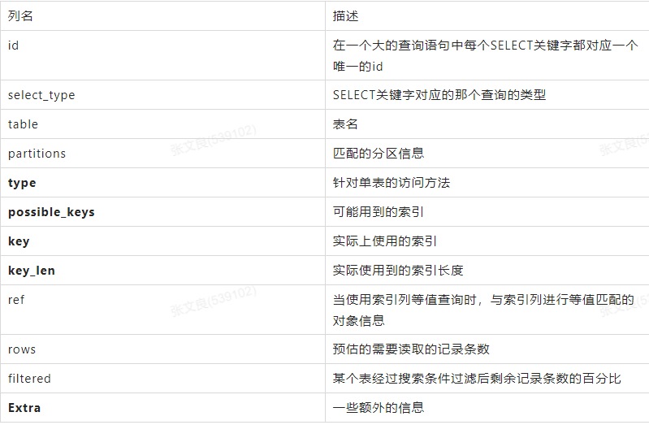

### Explain关键字解析
   
   

#### table
   
   表名
   
```
mysql> explain select * from t1 join t2;
+----+-------------+-------+------------+------+---------------+------+---------+------+------+----------+---------------------------------------+
| id | select_type | table | partitions | type | possible_keys | key  | key_len | ref  | rows | filtered | Extra                                 |
+----+-------------+-------+------------+------+---------------+------+---------+------+------+----------+---------------------------------------+
|  1 | SIMPLE      | t1    | NULL       | ALL  | NULL          | NULL | NULL    | NULL |    8 |   100.00 | NULL                                  |
|  1 | SIMPLE      | t2    | NULL       | ALL  | NULL          | NULL | NULL    | NULL |    8 |   100.00 | Using join buffer (Block Nested Loop) |
+----+-------------+-------+------------+------+---------------+------+---------+------+------+----------+---------------------------------------+
2 rows in set, 1 warning (0.00 sec)
```

#### id

   我们写的查询语句一般都以SELECT关键字开头，比较简单的查询语句里只有一个SELECT关键字，但是下边两种情况下在一条查询语句中会出现多个SELECT关键字：
    
    • 查询中包含子查询的情况
    • 查询中包含UNION语句的情况
   
   查询语句中每出现一个SELECT关键字，MySQL就会为它分配一个唯一的id值。这个id值就是EXPLAIN语句的第一个列。对于连接查询来说，一个SELECT关键字后边的FROM子句中可以跟随多个表，所以在连接查询的执行计划中，每个表都会对应一条记录，但是这些记录的id值都是相同的。
   
```
mysql> explain select * from t1 join t2;
+----+-------------+-------+------------+------+---------------+------+---------+------+------+----------+---------------------------------------+
| id | select_type | table | partitions | type | possible_keys | key  | key_len | ref  | rows | filtered | Extra                                 |
+----+-------------+-------+------------+------+---------------+------+---------+------+------+----------+---------------------------------------+
|  1 | SIMPLE      | t1    | NULL       | ALL  | NULL          | NULL | NULL    | NULL |    8 |   100.00 | NULL                                  |
|  1 | SIMPLE      | t2    | NULL       | ALL  | NULL          | NULL | NULL    | NULL |    8 |   100.00 | Using join buffer (Block Nested Loop) |
+----+-------------+-------+------------+------+---------------+------+---------+------+------+----------+---------------------------------------+
2 rows in set, 1 warning (0.00 sec)
```

   在连接查询的执行计划中，每个表都会对应一条记录，这些记录的id列的值是相同的，出现在前边的表是驱动表，出现在后边的表是被驱动表
   对于包含子查询的查询语句来说，就可能涉及多个SELECT关键字，所以在包含子查询的查询语句的执行计划中，每个SELECT关键字都会对应一个唯一的id值，比如这样：

```
mysql> explain select * from t1 where a in (select a from t2) or c = 'c';
+----+-------------+-------+------------+-------+---------------+---------+---------+------+------+----------+-------------+
| id | select_type | table | partitions | type  | possible_keys | key     | key_len | ref  | rows | filtered | Extra       |
+----+-------------+-------+------------+-------+---------------+---------+---------+------+------+----------+-------------+
|  1 | PRIMARY     | t1    | NULL       | ALL   | NULL          | NULL    | NULL    | NULL |    8 |   100.00 | Using where |
|  2 | SUBQUERY    | t2    | NULL       | index | PRIMARY       | PRIMARY | 4       | NULL |    8 |   100.00 | Using index |
+----+-------------+-------+------------+-------+---------------+---------+---------+------+------+----------+-------------+
2 rows in set, 1 warning (0.00 sec)
```

   但是这里大家需要特别注意，查询优化器可能对涉及子查询的查询语句进行重写，从而转换为连接查询。所以如果我们想知道查询优化器对某个包含子查询的语句是否进行了重写，直接查看执行计划就好了，比如说：
   
```
mysql> explain select * from t1 where a in (select a from t2);
+----+-------------+-------+------------+--------+---------------+---------+---------+------------+------+----------+-------------+
| id | select_type | table | partitions | type   | possible_keys | key     | key_len | ref        | rows | filtered | Extra       |
+----+-------------+-------+------------+--------+---------------+---------+---------+------------+------+----------+-------------+
|  1 | SIMPLE      | t1    | NULL       | ALL    | PRIMARY       | NULL    | NULL    | NULL       |    8 |   100.00 | NULL        |
|  1 | SIMPLE      | t2    | NULL       | eq_ref | PRIMARY       | PRIMARY | 4       | luban.t1.a |    1 |   100.00 | Using index |
+----+-------------+-------+------------+--------+---------------+---------+---------+------------+------+----------+-------------+
2 rows in set, 1 warning (0.00 sec)
```

   可以看到，虽然我们的查询语句是一个子查询，但是执行计划中t1和t2表对应的记录的id值全部是1，这就表明了查询优化器将子查询转换为了连接查询。
   
   对于包含UNION子句的查询语句来说，每个SELECT关键字对应一个id值也是没错的，不过还是有点儿特别的东西，比方说下边这个查询：

```
mysql> explain select * from t1 union select * from t2;
+----+--------------+------------+------------+------+---------------+------+---------+------+------+----------+-----------------+
| id | select_type  | table      | partitions | type | possible_keys | key  | key_len | ref  | rows | filtered | Extra           |
+----+--------------+------------+------------+------+---------------+------+---------+------+------+----------+-----------------+
|  1 | PRIMARY      | t1         | NULL       | ALL  | NULL          | NULL | NULL    | NULL |    8 |   100.00 | NULL            |
|  2 | UNION        | t2         | NULL       | ALL  | NULL          | NULL | NULL    | NULL |    8 |   100.00 | NULL            |
| NULL | UNION RESULT | <union1,2> | NULL       | ALL  | NULL          | NULL | NULL    | NULL | NULL |     NULL | Using temporary |
+----+--------------+------------+------------+------+---------------+------+---------+------+------+----------+-----------------+
3 rows in set, 1 warning (0.00 sec)
```
   
   这个语句的执行计划的第三条记录是什么？为什么id值是NULL？UNION会把多个查询的结果集合并起来并对结果集中的记录进行去重，怎么去重呢？MySQL使用的是内部的临时表。正如上边的查询计划中所示，UNION子句是为了把id为1的查询和id为2的查询的结果集合并起来并去重，所以在内部创建了一个名为<union1, 2>的临时表（就是执行计划第三条记录的table列的名称），id为NULL表明这个临时表是为了合并两个查询的结果集而创建的。
   跟UNION对比起来，UNION ALL就不需要为最终的结果集进行去重，它只是单纯的把多个查询的结果集中的记录合并成一个并返回给用户，所以也就不需要使用临时表。所以在包含UNION ALL子句的查询的执行计划中，就没有那个id为NULL的记录，如下所示：
   
```
mysql> explain select * from t1 union all select * from t2;
+----+-------------+-------+------------+------+---------------+------+---------+------+------+----------+-------+
| id | select_type | table | partitions | type | possible_keys | key  | key_len | ref  | rows | filtered | Extra |
+----+-------------+-------+------------+------+---------------+------+---------+------+------+----------+-------+
|  1 | PRIMARY     | t1    | NULL       | ALL  | NULL          | NULL | NULL    | NULL |    8 |   100.00 | NULL  |
|  2 | UNION       | t2    | NULL       | ALL  | NULL          | NULL | NULL    | NULL |    8 |   100.00 | NULL  |
+----+-------------+-------+------------+------+---------------+------+---------+------+------+----------+-------+
2 rows in set, 1 warning (0.00 sec)
```

#### select_type
   
   每一个SELECT关键字代表的小查询都定义了一个称之为select_type的属性，意思是我们只要知道了某个小查询的select_type属性，就知道了这个小查询在整个大查询中扮演了一个什么角色。

##### SIMPLE
   
   查询语句中不包含UNION或者子查询的查询都算作是SIMPLE类型。

```
mysql> explain select * from t1;
+----+-------------+-------+------------+------+---------------+------+---------+------+------+----------+-------+
| id | select_type | table | partitions | type | possible_keys | key  | key_len | ref  | rows | filtered | Extra |
+----+-------------+-------+------------+------+---------------+------+---------+------+------+----------+-------+
|  1 | SIMPLE      | t1    | NULL       | ALL  | NULL          | NULL | NULL    | NULL |    8 |   100.00 | NULL  |
+----+-------------+-------+------------+------+---------------+------+---------+------+------+----------+-------+
1 row in set, 1 warning (0.00 sec)
```

   连接查询也算是SIMPLE类型

```
mysql> explain select * from t1 join t2;
+----+-------------+-------+------------+------+---------------+------+---------+------+------+----------+---------------------------------------+
| id | select_type | table | partitions | type | possible_keys | key  | key_len | ref  | rows | filtered | Extra                                 |
+----+-------------+-------+------------+------+---------------+------+---------+------+------+----------+---------------------------------------+
|  1 | SIMPLE      | t1    | NULL       | ALL  | NULL          | NULL | NULL    | NULL |    8 |   100.00 | NULL                                  |
|  1 | SIMPLE      | t2    | NULL       | ALL  | NULL          | NULL | NULL    | NULL |    8 |   100.00 | Using join buffer (Block Nested Loop) |
+----+-------------+-------+------------+------+---------------+------+---------+------+------+----------+---------------------------------------+
2 rows in set, 1 warning (0.01 sec)
```

##### PRIMARY
   
   对于包含UNION、UNION ALL或者子查询的大查询来说，它是由几个小查询组成的，其中最左边的那个查询的select_type值就是PRIMARY，比方说：
   
```
mysql> explain select * from t1 where a in (select a from t2) or c = 'c';
+----+-------------+-------+------------+-------+---------------+---------+---------+------+------+----------+-------------+
| id | select_type | table | partitions | type  | possible_keys | key     | key_len | ref  | rows | filtered | Extra       |
+----+-------------+-------+------------+-------+---------------+---------+---------+------+------+----------+-------------+
|  1 | PRIMARY     | t1    | NULL       | ALL   | NULL          | NULL    | NULL    | NULL |    8 |   100.00 | Using where |
|  2 | SUBQUERY    | t2    | NULL       | index | PRIMARY       | PRIMARY | 4       | NULL |    8 |   100.00 | Using index |
+----+-------------+-------+------------+-------+---------------+---------+---------+------+------+----------+-------------+
2 rows in set, 1 warning (0.00 sec)
```

   从结果中可以看到，最左边的小查询select * from t1对应的是执行计划中的第一条记录，它的select_type值就是PRIMARY。

##### UNION
   
   对于包含UNION或者UNION ALL的大查询来说，它是由几个小查询组成的，其中除了最左边的那个小查询以外，其余的小查询的select_type值就是UNION。

```
mysql> explain select * from t1 union select * from t2;
+----+--------------+------------+------------+------+---------------+------+---------+------+------+----------+-----------------+
| id | select_type  | table      | partitions | type | possible_keys | key  | key_len | ref  | rows | filtered | Extra           |
+----+--------------+------------+------------+------+---------------+------+---------+------+------+----------+-----------------+
|  1 | PRIMARY      | t1         | NULL       | ALL  | NULL          | NULL | NULL    | NULL |    8 |   100.00 | NULL            |
|  2 | UNION        | t2         | NULL       | ALL  | NULL          | NULL | NULL    | NULL |    8 |   100.00 | NULL            |
| NULL | UNION RESULT | <union1,2> | NULL       | ALL  | NULL          | NULL | NULL    | NULL | NULL |     NULL | Using temporary |
+----+--------------+------------+------------+------+---------------+------+---------+------+------+----------+-----------------+
3 rows in set, 1 warning (0.00 sec)
```

##### UNION RESULT
   
   MySQL选择使用临时表来完成UNION查询的去重工作，针对该临时表的查询的select_type就是UNION RESULT，例子上边有。
   
##### SUBQUERY
   
   非相关子查询，由于select_type为SUBQUERY的子查询由于会被物化，所以只需要执行一遍。

```
mysql> explain select * from t1 where a in (select a from t2) or c = 'c';
+----+-------------+-------+------------+-------+---------------+---------+---------+------+------+----------+-------------+
| id | select_type | table | partitions | type  | possible_keys | key     | key_len | ref  | rows | filtered | Extra       |
+----+-------------+-------+------------+-------+---------------+---------+---------+------+------+----------+-------------+
|  1 | PRIMARY     | t1    | NULL       | ALL   | NULL          | NULL    | NULL    | NULL |    8 |   100.00 | Using where |
|  2 | SUBQUERY    | t2    | NULL       | index | PRIMARY       | PRIMARY | 4       | NULL |    8 |   100.00 | Using index |
+----+-------------+-------+------------+-------+---------------+---------+---------+------+------+----------+-------------+
2 rows in set, 1 warning (0.00 sec)
```

##### DEPENDENT SUBQUERY
   
   相关子查询，select_type为DEPENDENT SUBQUERY的查询可能会被执行多次

```
mysql> explain select * from t1 where a in (select a from t2 where t1.a = t2.a) or c = 'c';
+----+--------------------+-------+------------+--------+---------------+---------+---------+------------+------+----------+--------------------------+
| id | select_type        | table | partitions | type   | possible_keys | key     | key_len | ref        | rows | filtered | Extra                    |
+----+--------------------+-------+------------+--------+---------------+---------+---------+------------+------+----------+--------------------------+
|  1 | PRIMARY            | t1    | NULL       | ALL    | NULL          | NULL    | NULL    | NULL       |    8 |   100.00 | Using where              |
|  2 | DEPENDENT SUBQUERY | t2    | NULL       | eq_ref | PRIMARY       | PRIMARY | 4       | luban.t1.a |    1 |   100.00 | Using where; Using index |
+----+--------------------+-------+------------+--------+---------------+---------+---------+------------+------+----------+--------------------------+
2 rows in set, 2 warnings (0.00 sec)
```

##### DERIVED

```
mysql> explain select * from (select a, count(*) from t2 group by a ) as deliver1;
+----+-------------+------------+------------+-------+---------------+---------+---------+------+------+----------+-------------+
| id | select_type | table      | partitions | type  | possible_keys | key     | key_len | ref  | rows | filtered | Extra       |
+----+-------------+------------+------------+-------+---------------+---------+---------+------+------+----------+-------------+
|  1 | PRIMARY     | <derived2> | NULL       | ALL   | NULL          | NULL    | NULL    | NULL |    8 |   100.00 | NULL        |
|  2 | DERIVED     | t2         | NULL       | index | PRIMARY       | PRIMARY | 4       | NULL |    8 |   100.00 | Using index |
+----+-------------+------------+------------+-------+---------------+---------+---------+------+------+----------+-------------+
2 rows in set, 1 warning (0.00 sec)
```

   从执行计划中可以看出，id为2的记录就代表子查询的执行方式，它的select_type是DERIVED，说明该子查询是以物化的方式执行的。id为1的记录代表外层查询，大家注意看它的table列显示的是，表示该查询是针对将派生表物化之后的表进行查询的。

##### MATERIALIZED
   
   当查询优化器在执行包含子查询的语句时，选择将子查询物化之后与外层查询进行连接查询时，该子查询对应的select_type属性就是MATERIALIZED。

```
mysql> explain select * from t1 where a in (select c from t2 where e = 1);
+----+--------------+-------------+------------+--------+---------------+---------+---------+---------------+------+----------+-------------+
| id | select_type  | table       | partitions | type   | possible_keys | key     | key_len | ref           | rows | filtered | Extra       |
+----+--------------+-------------+------------+--------+---------------+---------+---------+---------------+------+----------+-------------+
|  1 | SIMPLE       | <subquery2> | NULL       | ALL    | NULL          | NULL    | NULL    | NULL          | NULL |   100.00 | Using where |
|  1 | SIMPLE       | t1          | NULL       | eq_ref | PRIMARY       | PRIMARY | 4       | <subquery2>.c |    1 |   100.00 | NULL        |
|  2 | MATERIALIZED | t2          | NULL       | ALL    | NULL          | NULL    | NULL    | NULL          |    8 |    12.50 | Using where |
+----+--------------+-------------+------------+--------+---------------+---------+---------+---------------+------+----------+-------------+
3 rows in set, 1 warning (0.00 sec)
```

#### type
   
   访问方法
   
##### system

   当表中只有一条记录并且该表使用的存储引擎的统计数据是精确的，比如MyISAM、Memory，那么对该表的访问方法就是system。比方说我们新建一个MyISAM表，并为其插入一条记录：

```
mysql> CREATE TABLE t(i int) Engine=MyISAM;
Query OK, 0 rows affected (0.05 sec)
mysql> INSERT INTO t VALUES(1);
Query OK, 1 row affected (0.01 sec)
```

```
mysql> explain select * from t;
+----+-------------+-------+------------+--------+---------------+------+---------+------+------+----------+-------+
| id | select_type | table | partitions | type   | possible_keys | key  | key_len | ref  | rows | filtered | Extra |
+----+-------------+-------+------------+--------+---------------+------+---------+------+------+----------+-------+
|  1 | SIMPLE      | t     | NULL       | system | NULL          | NULL | NULL    | NULL |    1 |   100.00 | NULL  |
+----+-------------+-------+------------+--------+---------------+------+---------+------+------+----------+-------+
1 row in set, 1 warning (0.00 sec)
mysql> alter table t ENGINE = InnoDB;
Query OK, 1 row affected (0.02 sec)
Records: 1  Duplicates: 0  Warnings: 0
mysql> explain select * from t;
+----+-------------+-------+------------+------+---------------+------+---------+------+------+----------+-------+
| id | select_type | table | partitions | type | possible_keys | key  | key_len | ref  | rows | filtered | Extra |
+----+-------------+-------+------------+------+---------------+------+---------+------+------+----------+-------+
|  1 | SIMPLE      | t     | NULL       | ALL  | NULL          | NULL | NULL    | NULL |    1 |   100.00 | NULL  |
+----+-------------+-------+------------+------+---------------+------+---------+------+------+----------+-------+
1 row in set, 1 warning (0.00 sec)
```

##### const
   
   当我们根据主键或者唯一二级索引列与常数进行等值匹配时，对单表的访问方法就是const。

```
mysql> explain select * from t1 where a = 1;
+----+-------------+-------+------------+-------+---------------+---------+---------+-------+------+----------+-------+
| id | select_type | table | partitions | type  | possible_keys | key     | key_len | ref   | rows | filtered | Extra |
+----+-------------+-------+------------+-------+---------------+---------+---------+-------+------+----------+-------+
|  1 | SIMPLE      | t1    | NULL       | const | PRIMARY       | PRIMARY | 4       | const |    1 |   100.00 | NULL  |
+----+-------------+-------+------------+-------+---------------+---------+---------+-------+------+----------+-------+
1 row in set, 1 warning (0.00 sec)
```

##### eq_ref
   
   在连接查询时，如果被驱动表是通过主键或者唯一二级索引列等值匹配的方式进行访问的（如果该主键或者唯一二级索引是联合索引的话，所有的索引列都必须进行等值比较），则对该被驱动表的访问方法就是eq_ref
   
```
mysql> explain select * from t1 join t2 on t1.a = t2.a;
+----+-------------+-------+------------+--------+---------------+---------+---------+------------+------+----------+-------+
| id | select_type | table | partitions | type   | possible_keys | key     | key_len | ref        | rows | filtered | Extra |
+----+-------------+-------+------------+--------+---------------+---------+---------+------------+------+----------+-------+
|  1 | SIMPLE      | t1    | NULL       | ALL    | PRIMARY       | NULL    | NULL    | NULL       |    8 |   100.00 | NULL  |
|  1 | SIMPLE      | t2    | NULL       | eq_ref | PRIMARY       | PRIMARY | 4       | luban.t1.a |    1 |   100.00 | NULL  |
+----+-------------+-------+------------+--------+---------------+---------+---------+------------+------+----------+-------+
2 rows in set, 1 warning (0.00 sec)
```

##### ref
   
   当通过普通的二级索引列与常量进行等值匹配时来查询某个表，那么对该表的访问方法就可能是ref。

```
mysql> explain select * from t1 where b = 1;
+----+-------------+-------+------------+------+---------------+------------+---------+-------+------+----------+-------+
| id | select_type | table | partitions | type | possible_keys | key        | key_len | ref   | rows | filtered | Extra |
+----+-------------+-------+------------+------+---------------+------------+---------+-------+------+----------+-------+
|  1 | SIMPLE      | t1    | NULL       | ref  | idx_t1_bcd    | idx_t1_bcd | 5       | const |    1 |   100.00 | NULL  |
+----+-------------+-------+------------+------+---------------+------------+---------+-------+------+----------+-------+
1 row in set, 1 warning (0.00 sec)
```

##### ref_or_null
   
   当对普通二级索引进行等值匹配查询，该索引列的值也可以是NULL值时，那么对该表的访问方法就可能是ref_or_null

```
mysql> explain select * from t1 where b = 1 or b is null;
+----+-------------+-------+------------+-------------+---------------+------------+---------+-------+------+----------+-----------------------+
| id | select_type | table | partitions | type        | possible_keys | key        | key_len | ref   | rows | filtered | Extra                 |
+----+-------------+-------+------------+-------------+---------------+------------+---------+-------+------+----------+-----------------------+
|  1 | SIMPLE      | t1    | NULL       | ref_or_null | idx_t1_bcd    | idx_t1_bcd | 5       | const |    2 |   100.00 | Using index condition |
+----+-------------+-------+------------+-------------+---------------+------------+---------+-------+------+----------+-----------------------+
1 row in set, 1 warning (0.00 sec)
```

##### index_merge
   
   索引合并

```
mysql> explain select * from t1 where a = 1 or b  = 1;
+----+-------------+-------+------------+-------------+--------------------+--------------------+---------+------+------+----------+---------------------------------------------------+
| id | select_type | table | partitions | type        | possible_keys      | key                | key_len | ref  | rows | filtered | Extra                                             |
+----+-------------+-------+------------+-------------+--------------------+--------------------+---------+------+------+----------+---------------------------------------------------+
|  1 | SIMPLE      | t1    | NULL       | index_merge | PRIMARY,idx_t1_bcd | idx_t1_bcd,PRIMARY | 5,4     | NULL |    2 |   100.00 | Using sort_union(idx_t1_bcd,PRIMARY); Using where |
+----+-------------+-------+------------+-------------+--------------------+--------------------+---------+------+------+----------+---------------------------------------------------+
1 row in set, 1 warning (0.01 sec)
```

##### unique_subquery
   
   如果查询优化器决定将IN子查询转换为EXISTS子查询，而且子查询可以使用到主键进行等值匹配的话，那么该子查询执行计划的type列的值就是unique_subquery。

```
mysql> explain select * from t1 where c in (select a from t2 where t1.e = t2.e) or a = 1;
+----+--------------------+-------+------------+-----------------+---------------+---------+---------+------+------+----------+-------------+
| id | select_type        | table | partitions | type            | possible_keys | key     | key_len | ref  | rows | filtered | Extra       |
+----+--------------------+-------+------------+-----------------+---------------+---------+---------+------+------+----------+-------------+
|  1 | PRIMARY            | t1    | NULL       | ALL             | PRIMARY       | NULL    | NULL    | NULL |    9 |   100.00 | Using where |
|  2 | DEPENDENT SUBQUERY | t2    | NULL       | unique_subquery | PRIMARY       | PRIMARY | 4       | func |    1 |    12.50 | Using where |
+----+--------------------+-------+------------+-----------------+---------------+---------+---------+------+------+----------+-------------+
2 rows in set, 2 warnings (0.00 sec)
```

##### index_subquery
   
   index_subquery与unique_subquery类似，只不过访问子查询中的表时使用的是普通的索引。

```
mysql> explain select * from t1 where c in (select b from t2 where t1.e = t2.e) or a = 1;
+----+--------------------+-------+------------+----------------+---------------+--------------+---------+------+------+----------+-------------+
| id | select_type        | table | partitions | type           | possible_keys | key          | key_len | ref  | rows | filtered | Extra       |
+----+--------------------+-------+------------+----------------+---------------+--------------+---------+------+------+----------+-------------+
|  1 | PRIMARY            | t1    | NULL       | ALL            | PRIMARY       | NULL         | NULL    | NULL |    9 |   100.00 | Using where |
|  2 | DEPENDENT SUBQUERY | t2    | NULL       | index_subquery | idx_t2_b_c_d  | idx_t2_b_c_d | 5       | func |    1 |    12.50 | Using where |
+----+--------------------+-------+------------+----------------+---------------+--------------+---------+------+------+----------+-------------+
2 rows in set, 2 warnings (0.00 sec)
```

##### range

```
mysql> explain select * from t1 where a > 1;
+----+-------------+-------+------------+-------+---------------+---------+---------+------+------+----------+-------------+
| id | select_type | table | partitions | type  | possible_keys | key     | key_len | ref  | rows | filtered | Extra       |
+----+-------------+-------+------------+-------+---------------+---------+---------+------+------+----------+-------------+
|  1 | SIMPLE      | t1    | NULL       | range | PRIMARY       | PRIMARY | 4       | NULL |    7 |   100.00 | Using where |
+----+-------------+-------+------------+-------+---------------+---------+---------+------+------+----------+-------------+
1 row in set, 1 warning (0.00 sec)
mysql> explain select * from t1 where a in (1,2,3);
+----+-------------+-------+------------+-------+---------------+---------+---------+------+------+----------+-------------+
| id | select_type | table | partitions | type  | possible_keys | key     | key_len | ref  | rows | filtered | Extra       |
+----+-------------+-------+------------+-------+---------------+---------+---------+------+------+----------+-------------+
|  1 | SIMPLE      | t1    | NULL       | range | PRIMARY       | PRIMARY | 4       | NULL |    3 |   100.00 | Using where |
+----+-------------+-------+------------+-------+---------------+---------+---------+------+------+----------+-------------+
1 row in set, 1 warning (0.00 sec)
```

##### index

  当我们可以使用覆盖索引，但需要扫描全部的索引记录时，该表的访问方法就是index。
  
```
mysql> explain select b from t1;
+----+-------------+-------+------------+-------+---------------+------------+---------+------+------+----------+-------------+
| id | select_type | table | partitions | type  | possible_keys | key        | key_len | ref  | rows | filtered | Extra       |
+----+-------------+-------+------------+-------+---------------+------------+---------+------+------+----------+-------------+
|  1 | SIMPLE      | t1    | NULL       | index | NULL          | idx_t1_bcd | 15      | NULL |    8 |   100.00 | Using index |
+----+-------------+-------+------------+-------+---------------+------------+---------+------+------+----------+-------------+
1 row in set, 1 warning (0.00 sec)
mysql> explain select b from t1 where c = 1;
+----+-------------+-------+------------+-------+---------------+------------+---------+------+------+----------+--------------------------+
| id | select_type | table | partitions | type  | possible_keys | key        | key_len | ref  | rows | filtered | Extra                    |
+----+-------------+-------+------------+-------+---------------+------------+---------+------+------+----------+--------------------------+
|  1 | SIMPLE      | t1    | NULL       | index | NULL          | idx_t1_bcd | 15      | NULL |    8 |    12.50 | Using where; Using index |
+----+-------------+-------+------------+-------+---------------+------------+---------+------+------+----------+--------------------------+
1 row in set, 1 warning (0.00 sec)
mysql> explain select b from t1 where b = 1;
+----+-------------+-------+------------+------+---------------+------------+---------+-------+------+----------+-------------+
| id | select_type | table | partitions | type | possible_keys | key        | key_len | ref   | rows | filtered | Extra       |
+----+-------------+-------+------------+------+---------------+------------+---------+-------+------+----------+-------------+
|  1 | SIMPLE      | t1    | NULL       | ref  | idx_t1_bcd    | idx_t1_bcd | 5       | const |    1 |   100.00 | Using index |
+----+-------------+-------+------------+------+---------------+------------+---------+-------+------+----------+-------------+
1 row in set, 1 warning (0.01 sec)
``` 

##### ALL
   
   全表扫描
   
#### possible_keys和key
   
   possible_keys列表示在某个查询语句中，对某个表执行单表查询时可能用到的索引有哪些，key列表示实际用到的索引有哪些。
   
   不过有一点比较特别，就是在使用index访问方法来查询某个表时，possible_keys列是空的，而key列展示的是实际使用到的索引
   
    possible_keys列中的值并不是越多越好，可能使用的索引越多，查询优化器计算查询成本时就得花费更长时间，所以如果可以的话，尽量删除那些用不到的索引
    
#### key_len
   
   key_len列表示当优化器决定使用某个索引执行查询时，该索引记录的最大长度，它是由这三个部分构成的：
   
   • 对于使用固定长度类型的索引列来说，它实际占用的存储空间的最大长度就是该固定值，对于指定字符集的变长类型的索引列来说，比如某个索引列的类型是VARCHAR(100)，使用的字符集是utf8，那么该列实际占用的最大存储空间就是100 × 3 = 300个字节。
   
   • 如果该索引列可以存储NULL值，则key_len比不可以存储NULL值时多1个字节。
   
   • 对于变长字段来说，都会有2个字节的空间来存储该变长列的实际长度。
   
#### ref
   
   当使用索引列等值匹配的条件去执行查询时，也就是在访问方法是const、eq_ref、ref、ref_or_null、unique_subquery、index_subquery其中之一时，ref列展示的就是与索引列作等值匹配的东西是什么，比如只是一个常数或者是某个列。
   
```
mysql> explain select b from t1 where b = 1;
+----+-------------+-------+------------+------+---------------+------------+---------+-------+------+----------+-------------+
| id | select_type | table | partitions | type | possible_keys | key        | key_len | ref   | rows | filtered | Extra       |
+----+-------------+-------+------------+------+---------------+------------+---------+-------+------+----------+-------------+
|  1 | SIMPLE      | t1    | NULL       | ref  | idx_t1_bcd    | idx_t1_bcd | 5       | const |    1 |   100.00 | Using index |
+----+-------------+-------+------------+------+---------------+------------+---------+-------+------+----------+-------------+
1 row in set, 1 warning (0.01 sec)
mysql> explain select * from t1 where a in (select a from t2);
+----+-------------+-------+------------+--------+---------------+--------------+---------+------------+------+----------+-------------+
| id | select_type | table | partitions | type   | possible_keys | key          | key_len | ref        | rows | filtered | Extra       |
+----+-------------+-------+------------+--------+---------------+--------------+---------+------------+------+----------+-------------+
|  1 | SIMPLE      | t2    | NULL       | index  | PRIMARY       | idx_t2_b_c_d | 15      | NULL       |    8 |   100.00 | Using index |
|  1 | SIMPLE      | t1    | NULL       | eq_ref | PRIMARY       | PRIMARY      | 4       | luban.t2.a |    1 |   100.00 | NULL        |
+----+-------------+-------+------------+--------+---------------+--------------+---------+------------+------+----------+-------------+
2 rows in set, 1 warning (0.00 sec)
```

#### rows
   
   如果查询优化器决定使用全表扫描的方式对某个表执行查询时，执行计划的rows列就代表预计需要扫描的行数，如果使用索引来执行查询时，执行计划的rows列就代表预计扫描的索引记录行数。

#### filtered
   
   代表查询优化器预测在这扫描的记录中，有多少条记录满足其余的搜索条件。

```
mysql> explain select * from t1 where a > 1 and e = 1;
+----+-------------+-------+------------+-------+---------------+---------+---------+------+------+----------+-------------+
| id | select_type | table | partitions | type  | possible_keys | key     | key_len | ref  | rows | filtered | Extra       |
+----+-------------+-------+------------+-------+---------------+---------+---------+------+------+----------+-------------+
|  1 | SIMPLE      | t1    | NULL       | range | PRIMARY       | PRIMARY | 4       | NULL |    8 |    11.11 | Using where |
+----+-------------+-------+------------+-------+---------------+---------+---------+------+------+----------+-------------+
1 row in set, 1 warning (0.00 sec)
```
   
   从执行计划的key列中可以看出来，该查询使用PRIMARY索引来执行查询，从rows列可以看出满足a > 1的记录有8条。执行计划的filtered列就代表查询优化器预测在这8条记录中，有多少条记录满足其余的搜索条件，也就是e = 1这个条件的百分比。此处filtered列的值是11.11，说明查询优化器预测在8条记录中有11.11%的记录满足e = 1这个条件。
   
   对于单表查询来说，这个filtered列的值没什么意义，我们更关注在连接查询中驱动表对应的执行计划记录的filtered值，比方说下边这个查询：
   
```
mysql> explain select * from t1 join t2 on t1.a = t2.a where t1.e = 1;
+----+-------------+-------+------------+--------+---------------+---------+---------+------------+------+----------+-------------+
| id | select_type | table | partitions | type   | possible_keys | key     | key_len | ref        | rows | filtered | Extra       |
+----+-------------+-------+------------+--------+---------------+---------+---------+------------+------+----------+-------------+
|  1 | SIMPLE      | t1    | NULL       | ALL    | PRIMARY       | NULL    | NULL    | NULL       |    9 |    11.11 | Using where |
|  1 | SIMPLE      | t2    | NULL       | eq_ref | PRIMARY       | PRIMARY | 4       | luban.t1.a |    1 |   100.00 | NULL        |
+----+-------------+-------+------------+--------+---------------+---------+---------+------------+------+----------+-------------+
2 rows in set, 1 warning (0.00 sec)
```

   从执行计划中可以看出来，查询优化器打算把t1当作驱动表，t2当作被驱动表。我们可以看到驱动表t1表的执行计划的rows列为9， filtered列为11.11，这意味着驱动表t1表经过条件过滤后有9 × 11.11% = 0.9999条记录，这说明还要对被驱动表执行大约1次查询。

#### Extra
   
   Extra列是用来说明一些额外信息的，我们可以通过这些额外信息来更准确的理解MySQL到底将如何执行给定的查询语句。

##### No tables used
   
   当查询语句的没有FROM子句时将会提示该额外信息。

```
mysql> explain select 1;
+----+-------------+-------+------------+------+---------------+------+---------+------+------+----------+----------------+
| id | select_type | table | partitions | type | possible_keys | key  | key_len | ref  | rows | filtered | Extra          |
+----+-------------+-------+------------+------+---------------+------+---------+------+------+----------+----------------+
|  1 | SIMPLE      | NULL  | NULL       | NULL | NULL          | NULL | NULL    | NULL | NULL |     NULL | No tables used |
+----+-------------+-------+------------+------+---------------+------+---------+------+------+----------+----------------+
1 row in set, 1 warning (0.00 sec)
```

##### Impossible WHERE
   
   查询语句的WHERE子句永远为FALSE时将会提示该额外信息。

```
mysql> explain select b from t1 where 1=0;
+----+-------------+-------+------------+------+---------------+------+---------+------+------+----------+------------------+
| id | select_type | table | partitions | type | possible_keys | key  | key_len | ref  | rows | filtered | Extra            |
+----+-------------+-------+------------+------+---------------+------+---------+------+------+----------+------------------+
|  1 | SIMPLE      | NULL  | NULL       | NULL | NULL          | NULL | NULL    | NULL | NULL |     NULL | Impossible WHERE |
+----+-------------+-------+------------+------+---------------+------+---------+------+------+----------+------------------+
1 row in set, 1 warning (0.00 sec)
```

##### No matching min/max row
   
   当查询列表处有MIN或者MAX聚集函数，但是并没有符合WHERE子句中的搜索条件的记录时，将会提示该额外信息。

```
mysql> explain select max(a) from t1 where a=100;
+----+-------------+-------+------------+------+---------------+------+---------+------+------+----------+-------------------------+
| id | select_type | table | partitions | type | possible_keys | key  | key_len | ref  | rows | filtered | Extra                   |
+----+-------------+-------+------------+------+---------------+------+---------+------+------+----------+-------------------------+
|  1 | SIMPLE      | NULL  | NULL       | NULL | NULL          | NULL | NULL    | NULL | NULL |     NULL | No matching min/max row |
+----+-------------+-------+------------+------+---------------+------+---------+------+------+----------+-------------------------+
1 row in set, 1 warning (0.01 sec)
```

##### Using index
   
   当我们的查询列表以及搜索条件中只包含属于某个索引的列，也就是在可以使用索引覆盖的情况下，在Extra列将会提示该额外信息。

```
mysql> explain select d from t1 where b =1;
+----+-------------+-------+------------+------+---------------+------------+---------+-------+------+----------+-------------+
| id | select_type | table | partitions | type | possible_keys | key        | key_len | ref   | rows | filtered | Extra       |
+----+-------------+-------+------------+------+---------------+------------+---------+-------+------+----------+-------------+
|  1 | SIMPLE      | t1    | NULL       | ref  | idx_t1_bcd    | idx_t1_bcd | 5       | const |    1 |   100.00 | Using index |
+----+-------------+-------+------------+------+---------------+------------+---------+-------+------+----------+-------------+
1 row in set, 1 warning (0.00 sec)
```

##### Using index condition
   
   有些搜索条件中虽然出现了索引列，但却不能使用到索引（在MySQL 5.6版本后加入的新特性）

```
mysql> explain select * from t1 where b =1 and b like '%1';
+----+-------------+-------+------------+------+---------------+------------+---------+-------+------+----------+-----------------------+
| id | select_type | table | partitions | type | possible_keys | key        | key_len | ref   | rows | filtered | Extra                 |
+----+-------------+-------+------------+------+---------------+------------+---------+-------+------+----------+-----------------------+
|  1 | SIMPLE      | t1    | NULL       | ref  | idx_t1_bcd    | idx_t1_bcd | 5       | const |    1 |   100.00 | Using index condition |
+----+-------------+-------+------------+------+---------------+------------+---------+-------+------+----------+-----------------------+
1 row in set, 1 warning (0.00 sec)
```

##### Using where
   
   当我们使用全表扫描来执行对某个表的查询，并且该语句的WHERE子句中有针对该表的搜索条件时，在Extra列中会提示上述额外信息。

```
mysql> explain select * from t1 where e = 1;
+----+-------------+-------+------------+------+---------------+------+---------+------+------+----------+-------------+
| id | select_type | table | partitions | type | possible_keys | key  | key_len | ref  | rows | filtered | Extra       |
+----+-------------+-------+------------+------+---------------+------+---------+------+------+----------+-------------+
|  1 | SIMPLE      | t1    | NULL       | ALL  | NULL          | NULL | NULL    | NULL |    8 |    12.50 | Using where |
+----+-------------+-------+------------+------+---------------+------+---------+------+------+----------+-------------+
1 row in set, 1 warning (0.00 sec)
```

##### Using join buffer (Block Nested Loop)

   在连接查询执行过程中，当被驱动表不能有效的利用索引加快访问速度，MySQL一般会为其分配一块名叫join buffer的内存块来加快查询速度。

```
mysql> explain select * from t1 join t2 on t1.e = t2.e;
+----+-------------+-------+------------+------+---------------+------+---------+------+------+----------+----------------------------------------------------+
| id | select_type | table | partitions | type | possible_keys | key  | key_len | ref  | rows | filtered | Extra                                              |
+----+-------------+-------+------------+------+---------------+------+---------+------+------+----------+----------------------------------------------------+
|  1 | SIMPLE      | t1    | NULL       | ALL  | NULL          | NULL | NULL    | NULL |    8 |   100.00 | NULL                                               |
|  1 | SIMPLE      | t2    | NULL       | ALL  | NULL          | NULL | NULL    | NULL |    8 |    12.50 | Using where; Using join buffer (Block Nested Loop) |
+----+-------------+-------+------------+------+---------------+------+---------+------+------+----------+----------------------------------------------------+
2 rows in set, 1 warning (0.00 sec)
```

   可以在对t2表的执行计划的Extra列显示了两个提示：
   
   Using join buffer (Block Nested Loop)：这是因为对表t2的访问不能有效利用索引，只好退而求其次，使用join buffer来减少对t2表的访问次数，从而提高性能。
   
   Using where：可以看到查询语句中有一个t1.e = t2.e条件，因为t1是驱动表，t2是被驱动表，所以在访问t2表时，t1.e的值已经确定下来了，所以实际上查询t2表的条件就是t2.e = 一个常数，所以提示了Using where额外信息。
   
##### Using filesort
   
   很多情况下排序操作无法使用到索引，只能在内存中（记录较少的时候）或者磁盘中（记录较多的时候）进行排序，这种在内存中或者磁盘上进行排序的方式统称为文件排序（英文名：filesort）。如果某个查询需要使用文件排序的方式执行查询，就会在执行计划的Extra列中显示Using filesort提示。
   
```
mysql> explain select * from t1 order by e;
+----+-------------+-------+------------+------+---------------+------+---------+------+------+----------+----------------+
| id | select_type | table | partitions | type | possible_keys | key  | key_len | ref  | rows | filtered | Extra          |
+----+-------------+-------+------------+------+---------------+------+---------+------+------+----------+----------------+
|  1 | SIMPLE      | t1    | NULL       | ALL  | NULL          | NULL | NULL    | NULL |    8 |   100.00 | Using filesort |
+----+-------------+-------+------------+------+---------------+------+---------+------+------+----------+----------------+
1 row in set, 1 warning (0.00 sec)
```

##### Using temporary
   
   在许多查询的执行过程中，MySQL可能会借助临时表来完成一些功能，比如去重、排序之类的，比如我们在执行许多包含DISTINCT、GROUP BY、UNION等子句的查询过程中，如果不能有效利用索引来完成查询，MySQL很有可能寻求通过建立内部的临时表来执行查询。如果查询中使用到了内部的临时表，在执行计划的Extra列将会显示Using temporary提示。
   
   能利用索引：
   
```
mysql> explain select distinct b from t1;
+----+-------------+-------+------------+-------+---------------+------------+---------+------+------+----------+-------------+
| id | select_type | table | partitions | type  | possible_keys | key        | key_len | ref  | rows | filtered | Extra       |
+----+-------------+-------+------------+-------+---------------+------------+---------+------+------+----------+-------------+
|  1 | SIMPLE      | t1    | NULL       | index | idx_t1_bcd    | idx_t1_bcd | 15      | NULL |    8 |   100.00 | Using index |
+----+-------------+-------+------------+-------+---------------+------------+---------+------+------+----------+-------------+
1 row in set, 1 warning (0.00 sec)
```

   不能利用索引
   
```
mysql> explain select distinct e from t1;
+----+-------------+-------+------------+------+---------------+------+---------+------+------+----------+-----------------+
| id | select_type | table | partitions | type | possible_keys | key  | key_len | ref  | rows | filtered | Extra           |
+----+-------------+-------+------------+------+---------------+------+---------+------+------+----------+-----------------+
|  1 | SIMPLE      | t1    | NULL       | ALL  | NULL          | NULL | NULL    | NULL |    8 |   100.00 | Using temporary |
+----+-------------+-------+------------+------+---------------+------+---------+------+------+----------+-----------------+
1 row in set, 1 warning (0.00 sec)
```

   即有Using temporary，又有Using filesort，因为group by默认会先排序
   
```
mysql> explain select e, count(1) from t1 group by e;
+----+-------------+-------+------------+------+---------------+------+---------+------+------+----------+---------------------------------+
| id | select_type | table | partitions | type | possible_keys | key  | key_len | ref  | rows | filtered | Extra                           |
+----+-------------+-------+------------+------+---------------+------+---------+------+------+----------+---------------------------------+
|  1 | SIMPLE      | t1    | NULL       | ALL  | NULL          | NULL | NULL    | NULL |    8 |   100.00 | Using temporary; Using filesort |
+----+-------------+-------+------------+------+---------------+------+---------+------+------+----------+---------------------------------+
1 row in set, 1 warning (0.00 sec)
```

   使用order by null禁用排序

```
mysql> explain select e, count(1) from t1 group by e order by null;
+----+-------------+-------+------------+------+---------------+------+---------+------+------+----------+-----------------+
| id | select_type | table | partitions | type | possible_keys | key  | key_len | ref  | rows | filtered | Extra           |
+----+-------------+-------+------------+------+---------------+------+---------+------+------+----------+-----------------+
|  1 | SIMPLE      | t1    | NULL       | ALL  | NULL          | NULL | NULL    | NULL |    8 |   100.00 | Using temporary |
+----+-------------+-------+------------+------+---------------+------+---------+------+------+----------+-----------------+
1 row in set, 1 warning (0.00 sec)
```

##### Start temporary、End temporary
   
   查询优化器会优先尝试将IN子查询转换成semi-join，而semi-join又有好多种执行策略，当执行策略为DuplicateWeedout时，也就是通过建立临时表来实现为外层查询中的记录进行去重操作时，驱动表查询执行计划的Extra列将显示Start temporary提示，被驱动表查询执行计划的Extra列将显示End temporary提示
   
```
mysql> explain select * from t1 where a in (select e from t2 where e = 1);
+----+-------------+-------+------------+--------+---------------+---------+---------+------------+------+----------+------------------------------+
| id | select_type | table | partitions | type   | possible_keys | key     | key_len | ref        | rows | filtered | Extra                        |
+----+-------------+-------+------------+--------+---------------+---------+---------+------------+------+----------+------------------------------+
|  1 | SIMPLE      | t2    | NULL       | ALL    | NULL          | NULL    | NULL    | NULL       |    8 |    12.50 | Using where; Start temporary |
|  1 | SIMPLE      | t1    | NULL       | eq_ref | PRIMARY       | PRIMARY | 4       | luban.t2.e |    1 |   100.00 | Using where; End temporary   |
+----+-------------+-------+------------+--------+---------------+---------+---------+------------+------+----------+------------------------------+
2 rows in set, 1 warning (0.00 sec)
```

##### FirstMatch(表名)
   
   在将In子查询转为semi-join时，如果采用的是FirstMatch执行策略，则在被驱动表执行计划的Extra列就是显示FirstMatch(tbl_name)提示。
   
```
mysql> explain select * from t1 where a in (select c from t2 where c = 1);
+----+-------------+-------+------------+-------+---------------+---------+---------+-------+------+----------+-----------------------------+
| id | select_type | table | partitions | type  | possible_keys | key     | key_len | ref   | rows | filtered | Extra                       |
+----+-------------+-------+------------+-------+---------------+---------+---------+-------+------+----------+-----------------------------+
|  1 | SIMPLE      | t1    | NULL       | const | PRIMARY       | PRIMARY | 4       | const |    1 |   100.00 | NULL                        |
|  1 | SIMPLE      | t2    | NULL       | ALL   | NULL          | NULL    | NULL    | NULL  |    8 |    12.50 | Using where; FirstMatch(t1) |
+----+-------------+-------+------------+-------+---------------+---------+---------+-------+------+----------+-----------------------------+
2 rows in set, 1 warning (0.00 sec)
```

### 总结

#### 性能按type排序
   
   system > const > eq_ref > ref > ref_or_null > index_merge > unique_subquery > index_subquery > range > index > ALL

#### 性能按Extra排序
   
   Using index：用了覆盖索引
   
   Using index condition：用了条件索引（索引下推）
   
   Using where：从索引查出来数据后继续用where条件过滤
   
   Using join buffer (Block Nested Loop)：join的时候利用了join buffer（优化策略：去除外连接、增大join buffer大小）
   
   Using filesort：用了文件排序，排序的时候没有用到索引
   
   Using temporary：用了临时表（优化策略：增加条件以减少结果集、增加索引，思路就是要么减少待排序的数量，要么就提前排好序）
   
   Start temporary, End temporary：子查询的时候，可以优化成半连接，但是使用的是通过临时表来去重
   
   FirstMatch(tbl_name)：子查询的时候，可以优化成半连接，但是使用的是直接进行数据比较来去重
   
#### 常见的优化手段
   
   1.SQL语句中IN包含的值不应过多，不能超过200个，200个以内查询优化器计算成本时比较精准，超过200个是估算的成本，另外建议能用between就不要用in，这样就可以使用range索引了。
   
   2.SELECT语句务必指明字段名称：SELECT * 增加很多不必要的消耗（cpu、io、内存、网络带宽）；增加了使用覆盖索引的可能性；当表结构发生改变时，前断也需要更新。所以要求直接在select后面接上字段名。
   
   3.当只需要一条数据的时候，使用limit 1
   
   4.排序时注意是否能用到索引
   
   5.使用or时如果没有用到索引，可以改为union all 或者union
   
   6.如果in不能用到索引，可以改成exists看是否能用到索引
   
   7.使用合理的分页方式以提高分页的效率
   
   8.不建议使用%前缀模糊查询
   
   9.避免在where子句中对字段进行表达式操作
   
   10.避免隐式类型转换
   
   11.对于联合索引来说，要遵守最左前缀法则
   
   12.必要时可以使用force index来强制查询走某个索引
   
   13.对于联合索引来说，如果存在范围查询，比如between,>,<等条件时，会造成后面的索引字段失效。
   
   14.尽量使用inner join，避免left join，让查询优化器来自动选择小表作为驱动表
   
   15.必要时刻可以使用straight_join来指定驱动表，前提条件是本身是inner join
   
