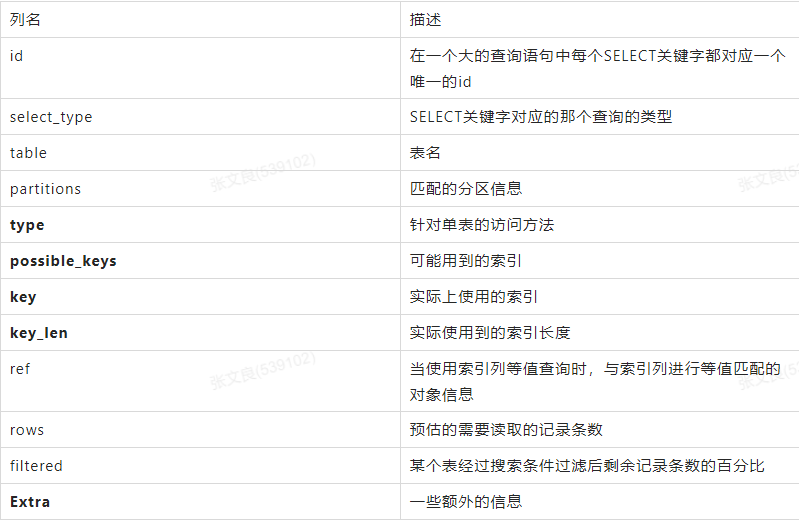
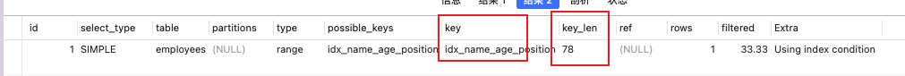

## Explain 工具 （以mysql 5.7 为例）

      使用EXPLAIN关键字可以模拟优化器执行SQL语句，分析你的查询语句或是结构的性能瓶颈
      在 select 语句之前增加 explain 关键字，MySQL 会在查询上设置一个标记，执行查询会返回执行计划的信息，而不是 执行这条SQL
   
      注意:如果 from 中包含子查询，仍会执行该子查询，将结果放入临时表中

mysql Explain 官网地址: https://dev.mysql.com/doc/refman/5.7/en/explain-output.html

### explain 两个变种

      1. explain extended (5.7 之后不需要，只需explain):会在 explain 的基础上额外提供一些查询优化的信息。紧随其后通过 show warnings 命令可
      以得到优化后的查询语句，从而看出优化器优化了什么。额外还有 filtered 列，是一个半分比的值，rows * filtered/100 可以估算出将要和 
      explain 中前一个表进行连接的行数(前一个表指 explain 中的id值比当前表id值小的 表)。

      2. explain partitions (5.7 之后不需要，只需explain):相比 explain 多了个 partitions 字段，如果查询是基于分区表的话，会显示查询将访问的分区。

### Explain 关键字解析



#### 1. 示例表

```
DROP TABLE IF EXISTS `actor`;
  CREATE TABLE `actor` (
   `id` int(11) NOT NULL,
   `name` varchar(45) DEFAULT NULL,
   `update_time` datetime DEFAULT NULL,
   PRIMARY KEY (`id`)
  ) ENGINE=InnoDB DEFAULT CHARSET=utf8;

 INSERT INTO `actor` (`id`, `name`, `update_time`) VALUES (1,'a','2017‐12‐22
15:27:18'), (2,'b','2017‐12‐22 15:27:18'), (3,'c','2017‐12‐22 15:27:18');

DROP TABLE IF EXISTS `film`;
 CREATE TABLE `film` (
 `id` int(11) NOT NULL AUTO_INCREMENT,
 `name` varchar(10) DEFAULT NULL,
  PRIMARY KEY (`id`),
 KEY `idx_name` (`name`)
 ) ENGINE=InnoDB DEFAULT CHARSET=utf8;

INSERT INTO `film` (`id`, `name`) VALUES (3,'film0'),(1,'film1'),(2,'film2'); 

DROP TABLE IF EXISTS `film_actor`;
 CREATE TABLE `film_actor` (
 `id` int(11) NOT NULL,
 `film_id` int(11) NOT NULL,
 `actor_id` int(11) NOT NULL,
 `remark` varchar(255) DEFAULT NULL,
 PRIMARY KEY (`id`),
 KEY `idx_film_actor_id` (`film_id`,`actor_id`)
 ) ENGINE=InnoDB DEFAULT CHARSET=utf8;
 
 INSERT INTO `film_actor` (`id`, `film_id`, `actor_id`) VALUES (1,1,1),(2,1,2),(3,2,1);
 
 
```

#### 2. explain 

```
explain select * from actor;
```


    在查询中的每个表会输出一行，如果有两个表通过 join 连接查询，那么会输出两行

### explain 中的列 解析

#### 1. id
 
    id列的编号是 select 的序列号，有几个 select 就有几个id，并且id的顺序是按 select 出现的顺序增长的。 id列越大执行优先级越高，
    id相同则从上往下执行，id为NULL最后执行。

我们写的查询语句一般都以SELECT关键字开头，比较简单的查询语句里只有一个SELECT关键字，但是下边两种情况下在一条查询语句中会出现多个SELECT关键字：

    • 查询中包含子查询的情况
    • 查询中包含UNION语句的情况

查询语句中每出现一个SELECT关键字，MySQL就会为它分配一个唯一的id值。这个id值就是EXPLAIN语句的第一个列。对于连接查询来说，一个SELECT关键字后边的FROM子句中可以跟随多个表，所以在连接查询的执行计划中，每个表都会对应一条记录，但是这些记录的id值都是相同的。

```
mysql> explain select * from t1 join t2;
+----+-------------+-------+------------+------+---------------+------+---------+------+------+----------+---------------------------------------+
| id | select_type | table | partitions | type | possible_keys | key  | key_len | ref  | rows | filtered | Extra                                 |
+----+-------------+-------+------------+------+---------------+------+---------+------+------+----------+---------------------------------------+
|  1 | SIMPLE      | t1    | NULL       | ALL  | NULL          | NULL | NULL    | NULL |    8 |   100.00 | NULL                                  |
|  1 | SIMPLE      | t2    | NULL       | ALL  | NULL          | NULL | NULL    | NULL |    8 |   100.00 | Using join buffer (Block Nested Loop) |
+----+-------------+-------+------------+------+---------------+------+---------+------+------+----------+---------------------------------------+
2 rows in set, 1 warning (0.00 sec)
```

在连接查询的执行计划中，每个表都会对应一条记录，这些记录的id列的值是相同的，出现在前边的表是驱动表，出现在后边的表是被驱动表
对于包含子查询的查询语句来说，就可能涉及多个SELECT关键字，所以在包含子查询的查询语句的执行计划中，每个SELECT关键字都会对应一个唯一的id值，比如这样：

```
mysql> explain select * from t1 where a in (select a from t2) or c = 'c';
+----+-------------+-------+------------+-------+---------------+---------+---------+------+------+----------+-------------+
| id | select_type | table | partitions | type  | possible_keys | key     | key_len | ref  | rows | filtered | Extra       |
+----+-------------+-------+------------+-------+---------------+---------+---------+------+------+----------+-------------+
|  1 | PRIMARY     | t1    | NULL       | ALL   | NULL          | NULL    | NULL    | NULL |    8 |   100.00 | Using where |
|  2 | SUBQUERY    | t2    | NULL       | index | PRIMARY       | PRIMARY | 4       | NULL |    8 |   100.00 | Using index |
+----+-------------+-------+------------+-------+---------------+---------+---------+------+------+----------+-------------+
2 rows in set, 1 warning (0.00 sec)
```

但是这里大家需要特别注意，查询优化器可能对涉及子查询的查询语句进行重写，从而转换为连接查询。所以如果我们想知道查询优化器对某个包含子查询的语句是否进行了重写，直接查看执行计划就好了，比如说：

```
mysql> explain select * from t1 where a in (select a from t2);
+----+-------------+-------+------------+--------+---------------+---------+---------+------------+------+----------+-------------+
| id | select_type | table | partitions | type   | possible_keys | key     | key_len | ref        | rows | filtered | Extra       |
+----+-------------+-------+------------+--------+---------------+---------+---------+------------+------+----------+-------------+
|  1 | SIMPLE      | t1    | NULL       | ALL    | PRIMARY       | NULL    | NULL    | NULL       |    8 |   100.00 | NULL        |
|  1 | SIMPLE      | t2    | NULL       | eq_ref | PRIMARY       | PRIMARY | 4       | luban.t1.a |    1 |   100.00 | Using index |
+----+-------------+-------+------------+--------+---------------+---------+---------+------------+------+----------+-------------+
2 rows in set, 1 warning (0.00 sec)
```

可以看到，虽然我们的查询语句是一个子查询，但是执行计划中t1和t2表对应的记录的id值全部是1，这就表明了查询优化器将子查询转换为了连接查询。

对于包含UNION子句的查询语句来说，每个SELECT关键字对应一个id值也是没错的，不过还是有点儿特别的东西，比方说下边这个查询：

```
mysql> explain select * from t1 union select * from t2;
+----+--------------+------------+------------+------+---------------+------+---------+------+------+----------+-----------------+
| id | select_type  | table      | partitions | type | possible_keys | key  | key_len | ref  | rows | filtered | Extra           |
+----+--------------+------------+------------+------+---------------+------+---------+------+------+----------+-----------------+
|  1 | PRIMARY      | t1         | NULL       | ALL  | NULL          | NULL | NULL    | NULL |    8 |   100.00 | NULL            |
|  2 | UNION        | t2         | NULL       | ALL  | NULL          | NULL | NULL    | NULL |    8 |   100.00 | NULL            |
| NULL | UNION RESULT | <union1,2> | NULL       | ALL  | NULL          | NULL | NULL    | NULL | NULL |     NULL | Using temporary |
+----+--------------+------------+------------+------+---------------+------+---------+------+------+----------+-----------------+
3 rows in set, 1 warning (0.00 sec)
```

这个语句的执行计划的第三条记录是什么？为什么id值是NULL？UNION会把多个查询的结果集合并起来并对结果集中的记录进行去重，怎么去重呢？MySQL使用的是内部的临时表。正如上边的查询计划中所示，UNION子句是为了把id为1的查询和id为2的查询的结果集合并起来并去重，所以在内部创建了一个名为<
union1, 2>的临时表（就是执行计划第三条记录的table列的名称），id为NULL表明这个临时表是为了合并两个查询的结果集而创建的。 跟UNION对比起来，UNION
ALL就不需要为最终的结果集进行去重，它只是单纯的把多个查询的结果集中的记录合并成一个并返回给用户，所以也就不需要使用临时表。所以在包含UNION ALL子句的查询的执行计划中，就没有那个id为NULL的记录，如下所示：

```
mysql> explain select * from t1 union all select * from t2;
+----+-------------+-------+------------+------+---------------+------+---------+------+------+----------+-------+
| id | select_type | table | partitions | type | possible_keys | key  | key_len | ref  | rows | filtered | Extra |
+----+-------------+-------+------------+------+---------------+------+---------+------+------+----------+-------+
|  1 | PRIMARY     | t1    | NULL       | ALL  | NULL          | NULL | NULL    | NULL |    8 |   100.00 | NULL  |
|  2 | UNION       | t2    | NULL       | ALL  | NULL          | NULL | NULL    | NULL |    8 |   100.00 | NULL  |
+----+-------------+-------+------------+------+---------------+------+---------+------+------+----------+-------+
2 rows in set, 1 warning (0.00 sec)
```

#### 2. select_type

每一个SELECT关键字代表的小查询都定义了一个称之为select_type的属性，
意思是我们只要知道了某个小查询的select_type属性，就知道了这个小查询在整个大查询中扮演了一个什么角色。

    select_type 表示对应行是简单还是复杂的查询。 
      1) simple:简单查询。查询不包含子查询和union
      2) primary:复杂查询中最外层的 select
      3) subquery:包含在 select 中的子查询(不在 from 子句中)
      4) derived:包含在 from 子句中的子查询。MySQL会将结果存放在一个临时表中，也称为派生表(derived的英文含 义)
      5） union:在 union 中的第二个和随后的 select

##### 2.1 SIMPLE

查询语句中不包含UNION或者子查询的查询都算作是SIMPLE类型。

```
mysql> explain select * from t1;
+----+-------------+-------+------------+------+---------------+------+---------+------+------+----------+-------+
| id | select_type | table | partitions | type | possible_keys | key  | key_len | ref  | rows | filtered | Extra |
+----+-------------+-------+------------+------+---------------+------+---------+------+------+----------+-------+
|  1 | SIMPLE      | t1    | NULL       | ALL  | NULL          | NULL | NULL    | NULL |    8 |   100.00 | NULL  |
+----+-------------+-------+------------+------+---------------+------+---------+------+------+----------+-------+
1 row in set, 1 warning (0.00 sec)
```

连接查询也算是SIMPLE类型

```
mysql> explain select * from t1 join t2;
+----+-------------+-------+------------+------+---------------+------+---------+------+------+----------+---------------------------------------+
| id | select_type | table | partitions | type | possible_keys | key  | key_len | ref  | rows | filtered | Extra                                 |
+----+-------------+-------+------------+------+---------------+------+---------+------+------+----------+---------------------------------------+
|  1 | SIMPLE      | t1    | NULL       | ALL  | NULL          | NULL | NULL    | NULL |    8 |   100.00 | NULL                                  |
|  1 | SIMPLE      | t2    | NULL       | ALL  | NULL          | NULL | NULL    | NULL |    8 |   100.00 | Using join buffer (Block Nested Loop) |
+----+-------------+-------+------------+------+---------------+------+---------+------+------+----------+---------------------------------------+
2 rows in set, 1 warning (0.01 sec)
```

##### 2.2 PRIMARY

对于包含UNION、UNION ALL或者子查询的大查询来说，它是由几个小查询组成的，其中最左边的那个查询的select_type值就是PRIMARY，比方说：

```
mysql> explain select * from t1 where a in (select a from t2) or c = 'c';
+----+-------------+-------+------------+-------+---------------+---------+---------+------+------+----------+-------------+
| id | select_type | table | partitions | type  | possible_keys | key     | key_len | ref  | rows | filtered | Extra       |
+----+-------------+-------+------------+-------+---------------+---------+---------+------+------+----------+-------------+
|  1 | PRIMARY     | t1    | NULL       | ALL   | NULL          | NULL    | NULL    | NULL |    8 |   100.00 | Using where |
|  2 | SUBQUERY    | t2    | NULL       | index | PRIMARY       | PRIMARY | 4       | NULL |    8 |   100.00 | Using index |
+----+-------------+-------+------------+-------+---------------+---------+---------+------+------+----------+-------------+
2 rows in set, 1 warning (0.00 sec)
```

从结果中可以看到，最左边的小查询select * from t1对应的是执行计划中的第一条记录，它的select_type值就是PRIMARY。

##### 2.3 UNION

对于包含UNION或者UNION ALL的大查询来说，它是由几个小查询组成的，其中除了最左边的那个小查询以外，其余的小查询的select_type值就是UNION。

```
mysql> explain select * from t1 union select * from t2;
+----+--------------+------------+------------+------+---------------+------+---------+------+------+----------+-----------------+
| id | select_type  | table      | partitions | type | possible_keys | key  | key_len | ref  | rows | filtered | Extra           |
+----+--------------+------------+------------+------+---------------+------+---------+------+------+----------+-----------------+
|  1 | PRIMARY      | t1         | NULL       | ALL  | NULL          | NULL | NULL    | NULL |    8 |   100.00 | NULL            |
|  2 | UNION        | t2         | NULL       | ALL  | NULL          | NULL | NULL    | NULL |    8 |   100.00 | NULL            |
| NULL | UNION RESULT | <union1,2> | NULL       | ALL  | NULL          | NULL | NULL    | NULL | NULL |     NULL | Using temporary |
+----+--------------+------------+------------+------+---------------+------+---------+------+------+----------+-----------------+
3 rows in set, 1 warning (0.00 sec)
```

##### 2.4 UNION RESULT

MySQL选择使用临时表来完成UNION查询的去重工作，针对该临时表的查询的select_type就是UNION RESULT，例子上边有。

##### 2.5 SUBQUERY

非相关子查询，由于select_type为SUBQUERY的子查询由于会被物化，所以只需要执行一遍。

```
mysql> explain select * from t1 where a in (select a from t2) or c = 'c';
+----+-------------+-------+------------+-------+---------------+---------+---------+------+------+----------+-------------+
| id | select_type | table | partitions | type  | possible_keys | key     | key_len | ref  | rows | filtered | Extra       |
+----+-------------+-------+------------+-------+---------------+---------+---------+------+------+----------+-------------+
|  1 | PRIMARY     | t1    | NULL       | ALL   | NULL          | NULL    | NULL    | NULL |    8 |   100.00 | Using where |
|  2 | SUBQUERY    | t2    | NULL       | index | PRIMARY       | PRIMARY | 4       | NULL |    8 |   100.00 | Using index |
+----+-------------+-------+------------+-------+---------------+---------+---------+------+------+----------+-------------+
2 rows in set, 1 warning (0.00 sec)
```

##### 2.6 DEPENDENT SUBQUERY

相关子查询，select_type为DEPENDENT SUBQUERY的查询可能会被执行多次

```
mysql> explain select * from t1 where a in (select a from t2 where t1.a = t2.a) or c = 'c';
+----+--------------------+-------+------------+--------+---------------+---------+---------+------------+------+----------+--------------------------+
| id | select_type        | table | partitions | type   | possible_keys | key     | key_len | ref        | rows | filtered | Extra                    |
+----+--------------------+-------+------------+--------+---------------+---------+---------+------------+------+----------+--------------------------+
|  1 | PRIMARY            | t1    | NULL       | ALL    | NULL          | NULL    | NULL    | NULL       |    8 |   100.00 | Using where              |
|  2 | DEPENDENT SUBQUERY | t2    | NULL       | eq_ref | PRIMARY       | PRIMARY | 4       | luban.t1.a |    1 |   100.00 | Using where; Using index |
+----+--------------------+-------+------------+--------+---------------+---------+---------+------------+------+----------+--------------------------+
2 rows in set, 2 warnings (0.00 sec)
```

##### 2.7 DERIVED

```
mysql> set session optimizer_switch='derived_merge=off'; #关闭mysql5.7新特性对衍生表的合 并优化
mysql> explain select * from (select a, count(*) from t2 group by a ) as deliver1;
+----+-------------+------------+------------+-------+---------------+---------+---------+------+------+----------+-------------+
| id | select_type | table      | partitions | type  | possible_keys | key     | key_len | ref  | rows | filtered | Extra       |
+----+-------------+------------+------------+-------+---------------+---------+---------+------+------+----------+-------------+
|  1 | PRIMARY     | <derived2> | NULL       | ALL   | NULL          | NULL    | NULL    | NULL |    8 |   100.00 | NULL        |
|  2 | DERIVED     | t2         | NULL       | index | PRIMARY       | PRIMARY | 4       | NULL |    8 |   100.00 | Using index |
+----+-------------+------------+------------+-------+---------------+---------+---------+------+------+----------+-------------+
2 rows in set, 1 warning (0.00 sec)

mysql> set session optimizer_switch='derived_merge=on'; #还原默认配置
```

从执行计划中可以看出，id为2的记录就代表子查询的执行方式，它的select_type是DERIVED，说明该子查询是以物化的方式执行的。id为1的记录代表外层查询，大家注意看它的table列显示的是，表示该查询是针对将派生表物化之后的表进行查询的。

##### 2.8 MATERIALIZED

当查询优化器在执行包含子查询的语句时，选择将子查询物化之后与外层查询进行连接查询时，该子查询对应的select_type属性就是MATERIALIZED。

```
mysql> explain select * from t1 where a in (select c from t2 where e = 1);
+----+--------------+-------------+------------+--------+---------------+---------+---------+---------------+------+----------+-------------+
| id | select_type  | table       | partitions | type   | possible_keys | key     | key_len | ref           | rows | filtered | Extra       |
+----+--------------+-------------+------------+--------+---------------+---------+---------+---------------+------+----------+-------------+
|  1 | SIMPLE       | <subquery2> | NULL       | ALL    | NULL          | NULL    | NULL    | NULL          | NULL |   100.00 | Using where |
|  1 | SIMPLE       | t1          | NULL       | eq_ref | PRIMARY       | PRIMARY | 4       | <subquery2>.c |    1 |   100.00 | NULL        |
|  2 | MATERIALIZED | t2          | NULL       | ALL    | NULL          | NULL    | NULL    | NULL          |    8 |    12.50 | Using where |
+----+--------------+-------------+------------+--------+---------------+---------+---------+---------------+------+----------+-------------+
3 rows in set, 1 warning (0.00 sec)
```

#### 3. table 
   
    这一列表示 explain 的一行正在访问哪个表。
    当 from 子句中有子查询时，table列是 <derivenN> 格式，表示当前查询依赖 id=N 的查询，于是先执行 id=N 的查 询。
    当有 union 时，UNION RESULT 的 table 列的值为<union1,2>，1和2表示参与 union 的 select 行id。

```
mysql> explain select * from t1 join t2;
+----+-------------+-------+------------+------+---------------+------+---------+------+------+----------+---------------------------------------+
| id | select_type | table | partitions | type | possible_keys | key  | key_len | ref  | rows | filtered | Extra                                 |
+----+-------------+-------+------------+------+---------------+------+---------+------+------+----------+---------------------------------------+
|  1 | SIMPLE      | t1    | NULL       | ALL  | NULL          | NULL | NULL    | NULL |    8 |   100.00 | NULL                                  |
|  1 | SIMPLE      | t2    | NULL       | ALL  | NULL          | NULL | NULL    | NULL |    8 |   100.00 | Using join buffer (Block Nested Loop) |
+----+-------------+-------+------------+------+---------------+------+---------+------+------+----------+---------------------------------------+
2 rows in set, 1 warning (0.00 sec)
```

#### 4. type

    这一列表示关联类型或访问类型，即MySQL决定如何查找表中的行，查找数据行记录的大概范围。 
    依次从最优到最差分别为:system > const > eq_ref > ref > range > index > ALL 
    一般来说，得保证查询达到range级别，最好达到ref。

    1. NULL:mysql能够在优化阶段分解查询语句，在执行阶段用不着再访问表或索引。例如:在索引列中选取最小值，可 以单独查找索引来完成，不需要在执行时访问表
         explain select min(id) from film;       

    2. const, system:mysql能对查询的某部分进行优化并将其转化成一个常量(可以看show warnings 的结果)。
    用于 primary key 或 unique key 的所有列与常数比较时，所以表最多有一个匹配行，读取1次，速度比较快。
    system是 const的特例，表里只有一条元组匹配时为system
      explain extended select * from (select * from film where id = 1) tmp;
    
    3. eq_ref:primary key 或 unique key 索引的所有部分被连接使用 ，最多只会返回一条符合条件的记录。
    这可能是在 const 之外最好的联接类型了，简单的 select 查询不会出现这种 type。
      explain select * from film_actor left join film on film_actor.film_id = film.id;

    4. ref:相比 eq_ref，不使用唯一索引，而是使用普通索引或者唯一性索引的部分前缀，索引要和某个值相比较，可能会 找到多个符合条件的行。
         explain select * from film where name = 'film1';
         explain select film_id from film left join film_actor on film.id = film_actor.film_id;

    5. range:范围扫描通常出现在 in(), between ,> ,<, >= 等操作中。使用一个索引来检索给定范围的行。
         explain select * from actor where id > 1;

    6. index:扫描全索引就能拿到结果，一般是扫描某个二级索引，这种扫描不会从索引树根节点开始快速查找，而是直接 对二级索引的叶子节点遍历和扫描，速度还是比较慢的，这种查询一般为使用覆盖索引，
    二级索引一般比较小，所以这 种通常比ALL快一些。
         explain select * from film;
   
    7. ALL:即全表扫描，扫描你的聚簇索引的所有叶子节点。通常情况下这需要增加索引来进行优化了。
         explain select * from actor;


##### 4.1 system

当表中只有一条记录并且该表使用的存储引擎的统计数据是精确的，比如MyISAM、Memory，那么对该表的访问方法就是system。
比方说我们新建一个MyISAM表，并为其插入一条记录：

```
mysql> CREATE TABLE t(i int) Engine=MyISAM;
Query OK, 0 rows affected (0.05 sec)
mysql> INSERT INTO t VALUES(1);
Query OK, 1 row affected (0.01 sec)
```

```
mysql> explain select * from t;
+----+-------------+-------+------------+--------+---------------+------+---------+------+------+----------+-------+
| id | select_type | table | partitions | type   | possible_keys | key  | key_len | ref  | rows | filtered | Extra |
+----+-------------+-------+------------+--------+---------------+------+---------+------+------+----------+-------+
|  1 | SIMPLE      | t     | NULL       | system | NULL          | NULL | NULL    | NULL |    1 |   100.00 | NULL  |
+----+-------------+-------+------------+--------+---------------+------+---------+------+------+----------+-------+
1 row in set, 1 warning (0.00 sec)
mysql> alter table t ENGINE = InnoDB;
Query OK, 1 row affected (0.02 sec)
Records: 1  Duplicates: 0  Warnings: 0
mysql> explain select * from t;
+----+-------------+-------+------------+------+---------------+------+---------+------+------+----------+-------+
| id | select_type | table | partitions | type | possible_keys | key  | key_len | ref  | rows | filtered | Extra |
+----+-------------+-------+------------+------+---------------+------+---------+------+------+----------+-------+
|  1 | SIMPLE      | t     | NULL       | ALL  | NULL          | NULL | NULL    | NULL |    1 |   100.00 | NULL  |
+----+-------------+-------+------------+------+---------------+------+---------+------+------+----------+-------+
1 row in set, 1 warning (0.00 sec)
```

##### 4.2 const

当我们根据主键或者唯一二级索引列与常数进行等值匹配时，对单表的访问方法就是const。

```
mysql> explain select * from t1 where a = 1;
+----+-------------+-------+------------+-------+---------------+---------+---------+-------+------+----------+-------+
| id | select_type | table | partitions | type  | possible_keys | key     | key_len | ref   | rows | filtered | Extra |
+----+-------------+-------+------------+-------+---------------+---------+---------+-------+------+----------+-------+
|  1 | SIMPLE      | t1    | NULL       | const | PRIMARY       | PRIMARY | 4       | const |    1 |   100.00 | NULL  |
+----+-------------+-------+------------+-------+---------------+---------+---------+-------+------+----------+-------+
1 row in set, 1 warning (0.00 sec)
```

##### 4.3 eq_ref

在连接查询时，如果被驱动表是通过主键或者唯一二级索引列等值匹配的方式进行访问的（如果该主键或者唯一二级索引是联合索引的话，所有的索引列都必须进行等值比较），则对该被驱动表的访问方法就是eq_ref

```
mysql> explain select * from t1 join t2 on t1.a = t2.a;
+----+-------------+-------+------------+--------+---------------+---------+---------+------------+------+----------+-------+
| id | select_type | table | partitions | type   | possible_keys | key     | key_len | ref        | rows | filtered | Extra |
+----+-------------+-------+------------+--------+---------------+---------+---------+------------+------+----------+-------+
|  1 | SIMPLE      | t1    | NULL       | ALL    | PRIMARY       | NULL    | NULL    | NULL       |    8 |   100.00 | NULL  |
|  1 | SIMPLE      | t2    | NULL       | eq_ref | PRIMARY       | PRIMARY | 4       | luban.t1.a |    1 |   100.00 | NULL  |
+----+-------------+-------+------------+--------+---------------+---------+---------+------------+------+----------+-------+
2 rows in set, 1 warning (0.00 sec)
```

##### 4.4 ref

当通过普通的二级索引列与常量进行等值匹配时来查询某个表，那么对该表的访问方法就可能是ref。

```
mysql> explain select * from t1 where b = 1;
+----+-------------+-------+------------+------+---------------+------------+---------+-------+------+----------+-------+
| id | select_type | table | partitions | type | possible_keys | key        | key_len | ref   | rows | filtered | Extra |
+----+-------------+-------+------------+------+---------------+------------+---------+-------+------+----------+-------+
|  1 | SIMPLE      | t1    | NULL       | ref  | idx_t1_bcd    | idx_t1_bcd | 5       | const |    1 |   100.00 | NULL  |
+----+-------------+-------+------------+------+---------------+------------+---------+-------+------+----------+-------+
1 row in set, 1 warning (0.00 sec)
```

##### 4.5 ref_or_null

当对普通二级索引进行等值匹配查询，该索引列的值也可以是NULL值时，那么对该表的访问方法就可能是ref_or_null

```
mysql> explain select * from t1 where b = 1 or b is null;
+----+-------------+-------+------------+-------------+---------------+------------+---------+-------+------+----------+-----------------------+
| id | select_type | table | partitions | type        | possible_keys | key        | key_len | ref   | rows | filtered | Extra                 |
+----+-------------+-------+------------+-------------+---------------+------------+---------+-------+------+----------+-----------------------+
|  1 | SIMPLE      | t1    | NULL       | ref_or_null | idx_t1_bcd    | idx_t1_bcd | 5       | const |    2 |   100.00 | Using index condition |
+----+-------------+-------+------------+-------------+---------------+------------+---------+-------+------+----------+-----------------------+
1 row in set, 1 warning (0.00 sec)
```

##### 4.6 index_merge

索引合并

```
mysql> explain select * from t1 where a = 1 or b  = 1;
+----+-------------+-------+------------+-------------+--------------------+--------------------+---------+------+------+----------+---------------------------------------------------+
| id | select_type | table | partitions | type        | possible_keys      | key                | key_len | ref  | rows | filtered | Extra                                             |
+----+-------------+-------+------------+-------------+--------------------+--------------------+---------+------+------+----------+---------------------------------------------------+
|  1 | SIMPLE      | t1    | NULL       | index_merge | PRIMARY,idx_t1_bcd | idx_t1_bcd,PRIMARY | 5,4     | NULL |    2 |   100.00 | Using sort_union(idx_t1_bcd,PRIMARY); Using where |
+----+-------------+-------+------------+-------------+--------------------+--------------------+---------+------+------+----------+---------------------------------------------------+
1 row in set, 1 warning (0.01 sec)
```

##### 4.7 unique_subquery

如果查询优化器决定将IN子查询转换为EXISTS子查询，而且子查询可以使用到主键进行等值匹配的话，那么该子查询执行计划的type列的值就是unique_subquery。

```
mysql> explain select * from t1 where c in (select a from t2 where t1.e = t2.e) or a = 1;
+----+--------------------+-------+------------+-----------------+---------------+---------+---------+------+------+----------+-------------+
| id | select_type        | table | partitions | type            | possible_keys | key     | key_len | ref  | rows | filtered | Extra       |
+----+--------------------+-------+------------+-----------------+---------------+---------+---------+------+------+----------+-------------+
|  1 | PRIMARY            | t1    | NULL       | ALL             | PRIMARY       | NULL    | NULL    | NULL |    9 |   100.00 | Using where |
|  2 | DEPENDENT SUBQUERY | t2    | NULL       | unique_subquery | PRIMARY       | PRIMARY | 4       | func |    1 |    12.50 | Using where |
+----+--------------------+-------+------------+-----------------+---------------+---------+---------+------+------+----------+-------------+
2 rows in set, 2 warnings (0.00 sec)
```

##### 4.8 index_subquery

index_subquery与unique_subquery类似，只不过访问子查询中的表时使用的是普通的索引。

```
mysql> explain select * from t1 where c in (select b from t2 where t1.e = t2.e) or a = 1;
+----+--------------------+-------+------------+----------------+---------------+--------------+---------+------+------+----------+-------------+
| id | select_type        | table | partitions | type           | possible_keys | key          | key_len | ref  | rows | filtered | Extra       |
+----+--------------------+-------+------------+----------------+---------------+--------------+---------+------+------+----------+-------------+
|  1 | PRIMARY            | t1    | NULL       | ALL            | PRIMARY       | NULL         | NULL    | NULL |    9 |   100.00 | Using where |
|  2 | DEPENDENT SUBQUERY | t2    | NULL       | index_subquery | idx_t2_b_c_d  | idx_t2_b_c_d | 5       | func |    1 |    12.50 | Using where |
+----+--------------------+-------+------------+----------------+---------------+--------------+---------+------+------+----------+-------------+
2 rows in set, 2 warnings (0.00 sec)
```

##### 4.9 range

```
mysql> explain select * from t1 where a > 1;
+----+-------------+-------+------------+-------+---------------+---------+---------+------+------+----------+-------------+
| id | select_type | table | partitions | type  | possible_keys | key     | key_len | ref  | rows | filtered | Extra       |
+----+-------------+-------+------------+-------+---------------+---------+---------+------+------+----------+-------------+
|  1 | SIMPLE      | t1    | NULL       | range | PRIMARY       | PRIMARY | 4       | NULL |    7 |   100.00 | Using where |
+----+-------------+-------+------------+-------+---------------+---------+---------+------+------+----------+-------------+
1 row in set, 1 warning (0.00 sec)
mysql> explain select * from t1 where a in (1,2,3);
+----+-------------+-------+------------+-------+---------------+---------+---------+------+------+----------+-------------+
| id | select_type | table | partitions | type  | possible_keys | key     | key_len | ref  | rows | filtered | Extra       |
+----+-------------+-------+------------+-------+---------------+---------+---------+------+------+----------+-------------+
|  1 | SIMPLE      | t1    | NULL       | range | PRIMARY       | PRIMARY | 4       | NULL |    3 |   100.00 | Using where |
+----+-------------+-------+------------+-------+---------------+---------+---------+------+------+----------+-------------+
1 row in set, 1 warning (0.00 sec)
```

##### 4.10 index

当我们可以使用覆盖索引，但需要扫描全部的索引记录时，该表的访问方法就是index。

```
mysql> explain select b from t1;
+----+-------------+-------+------------+-------+---------------+------------+---------+------+------+----------+-------------+
| id | select_type | table | partitions | type  | possible_keys | key        | key_len | ref  | rows | filtered | Extra       |
+----+-------------+-------+------------+-------+---------------+------------+---------+------+------+----------+-------------+
|  1 | SIMPLE      | t1    | NULL       | index | NULL          | idx_t1_bcd | 15      | NULL |    8 |   100.00 | Using index |
+----+-------------+-------+------------+-------+---------------+------------+---------+------+------+----------+-------------+
1 row in set, 1 warning (0.00 sec)
mysql> explain select b from t1 where c = 1;
+----+-------------+-------+------------+-------+---------------+------------+---------+------+------+----------+--------------------------+
| id | select_type | table | partitions | type  | possible_keys | key        | key_len | ref  | rows | filtered | Extra                    |
+----+-------------+-------+------------+-------+---------------+------------+---------+------+------+----------+--------------------------+
|  1 | SIMPLE      | t1    | NULL       | index | NULL          | idx_t1_bcd | 15      | NULL |    8 |    12.50 | Using where; Using index |
+----+-------------+-------+------------+-------+---------------+------------+---------+------+------+----------+--------------------------+
1 row in set, 1 warning (0.00 sec)
mysql> explain select b from t1 where b = 1;
+----+-------------+-------+------------+------+---------------+------------+---------+-------+------+----------+-------------+
| id | select_type | table | partitions | type | possible_keys | key        | key_len | ref   | rows | filtered | Extra       |
+----+-------------+-------+------------+------+---------------+------------+---------+-------+------+----------+-------------+
|  1 | SIMPLE      | t1    | NULL       | ref  | idx_t1_bcd    | idx_t1_bcd | 5       | const |    1 |   100.00 | Using index |
+----+-------------+-------+------------+------+---------------+------------+---------+-------+------+----------+-------------+
1 row in set, 1 warning (0.01 sec)
``` 

##### 4.11 ALL

全表扫描

#### 5. possible_keys和key

possible_keys列表示在某个查询语句中，对某个表执行单表查询时可能用到的索引有哪些，key列表示实际用到的索引有哪些。

不过有一点比较特别，就是在使用index访问方法来查询某个表时，possible_keys列是空的，而key列展示的是实际使用到的索引

    possible_keys列中的值并不是越多越好，可能使用的索引越多，查询优化器计算查询成本时就得花费更长时间，所以如果可以的话，尽量删除那些用不到的索引
   

#### 6. key_len

key_len列表示当优化器决定使用某个索引执行查询时，该索引记录的最大长度，它是由这三个部分构成的：

• 对于使用固定长度类型的索引列来说，它实际占用的存储空间的最大长度就是该固定值，对于指定字符集的变长类型的索引列来说，比如某个索引列的类型是VARCHAR(100)，使用的字符集是utf8，那么该列实际占用的最大存储空间就是100 × 3
= 300个字节。

• 如果该索引列可以存储NULL值，则key_len比不可以存储NULL值时多1个字节。

• 对于变长字段来说，都会有2个字节的空间来存储该变长列的实际长度。

      key_len计算规则如下: 
      1) 字符串，char(n)和varchar(n)，5.0.3以后版本中，n均代表字符数，而不是字节数，如果是utf-8，一个数字
      或字母占1个字节，一个汉字占3个字节 
         1> char(n):如果存汉字长度就是 3n 字节
         2> varchar(n):如果存汉字则长度是 3n + 2 字节，加的2字节用来存储字符串长度，因为 varchar是变长字符串
      2) 数值类型 
         tinyint:1字节
         smallint:2字节 
         int:4字节 
         bigint:8字节  
      3) 时间类型  
         date:3字节
         timestamp:4字节
         datetime:8字节
      如果字段允许为 NULL，需要1字节记录是否为 NULL
      索引最大长度是768字节，当字符串过长时，mysql会做一个类似左前缀索引的处理，将前半部分的字符提取出来做索引。

#### 7. ref

当使用索引列等值匹配的条件去执行查询时，也就是在访问方法是const、eq_ref、ref、ref_or_null、unique_subquery、index_subquery其中之一时，ref列展示的就是与索引列作等值匹配的东西是什么，比如只是一个常数或者是某个列。

```
mysql> explain select b from t1 where b = 1;
+----+-------------+-------+------------+------+---------------+------------+---------+-------+------+----------+-------------+
| id | select_type | table | partitions | type | possible_keys | key        | key_len | ref   | rows | filtered | Extra       |
+----+-------------+-------+------------+------+---------------+------------+---------+-------+------+----------+-------------+
|  1 | SIMPLE      | t1    | NULL       | ref  | idx_t1_bcd    | idx_t1_bcd | 5       | const |    1 |   100.00 | Using index |
+----+-------------+-------+------------+------+---------------+------------+---------+-------+------+----------+-------------+
1 row in set, 1 warning (0.01 sec)
mysql> explain select * from t1 where a in (select a from t2);
+----+-------------+-------+------------+--------+---------------+--------------+---------+------------+------+----------+-------------+
| id | select_type | table | partitions | type   | possible_keys | key          | key_len | ref        | rows | filtered | Extra       |
+----+-------------+-------+------------+--------+---------------+--------------+---------+------------+------+----------+-------------+
|  1 | SIMPLE      | t2    | NULL       | index  | PRIMARY       | idx_t2_b_c_d | 15      | NULL       |    8 |   100.00 | Using index |
|  1 | SIMPLE      | t1    | NULL       | eq_ref | PRIMARY       | PRIMARY      | 4       | luban.t2.a |    1 |   100.00 | NULL        |
+----+-------------+-------+------------+--------+---------------+--------------+---------+------------+------+----------+-------------+
2 rows in set, 1 warning (0.00 sec)
```

#### 8. rows

如果查询优化器决定使用全表扫描的方式对某个表执行查询时，执行计划的rows列就代表预计需要扫描的行数，如果使用索引来执行查询时，执行计划的rows列就代表预计扫描的索引记录行数。

#### 9. filtered

代表查询优化器预测在这扫描的记录中，有多少条记录满足其余的搜索条件。

```
mysql> explain select * from t1 where a > 1 and e = 1;
+----+-------------+-------+------------+-------+---------------+---------+---------+------+------+----------+-------------+
| id | select_type | table | partitions | type  | possible_keys | key     | key_len | ref  | rows | filtered | Extra       |
+----+-------------+-------+------------+-------+---------------+---------+---------+------+------+----------+-------------+
|  1 | SIMPLE      | t1    | NULL       | range | PRIMARY       | PRIMARY | 4       | NULL |    8 |    11.11 | Using where |
+----+-------------+-------+------------+-------+---------------+---------+---------+------+------+----------+-------------+
1 row in set, 1 warning (0.00 sec)
```

从执行计划的key列中可以看出来，该查询使用PRIMARY索引来执行查询，从rows列可以看出满足a > 1的记录有8条。执行计划的filtered列就代表查询优化器预测在这8条记录中，有多少条记录满足其余的搜索条件，也就是e =
1这个条件的百分比。此处filtered列的值是11.11，说明查询优化器预测在8条记录中有11.11%的记录满足e = 1这个条件。

对于单表查询来说，这个filtered列的值没什么意义，我们更关注在连接查询中驱动表对应的执行计划记录的filtered值，比方说下边这个查询：

```
mysql> explain select * from t1 join t2 on t1.a = t2.a where t1.e = 1;
+----+-------------+-------+------------+--------+---------------+---------+---------+------------+------+----------+-------------+
| id | select_type | table | partitions | type   | possible_keys | key     | key_len | ref        | rows | filtered | Extra       |
+----+-------------+-------+------------+--------+---------------+---------+---------+------------+------+----------+-------------+
|  1 | SIMPLE      | t1    | NULL       | ALL    | PRIMARY       | NULL    | NULL    | NULL       |    9 |    11.11 | Using where |
|  1 | SIMPLE      | t2    | NULL       | eq_ref | PRIMARY       | PRIMARY | 4       | luban.t1.a |    1 |   100.00 | NULL        |
+----+-------------+-------+------------+--------+---------------+---------+---------+------------+------+----------+-------------+
2 rows in set, 1 warning (0.00 sec)
```

从执行计划中可以看出来，查询优化器打算把t1当作驱动表，t2当作被驱动表。我们可以看到驱动表t1表的执行计划的rows列为9， filtered列为11.11，这意味着驱动表t1表经过条件过滤后有9 × 11.11% =
0.9999条记录，这说明还要对被驱动表执行大约1次查询。

#### 10. Extra

Extra列是用来说明一些额外信息的，我们可以通过这些额外信息来更准确的理解MySQL到底将如何执行给定的查询语句。

##### 10.1 Using index (使用覆盖索引)

    覆盖索引定义:
      mysql执行计划explain结果里的key有使用索引，如果select后面查询的字段都可以从这个索引的树中 获取，这种情况一般可以说是用到了覆盖索引，
      extra里一般都有using index;覆盖索引一般针对的是辅助索引，整个 查询结果只通过辅助索引就能拿到结果，不需要通过辅助索引树找到主键，
      再通过主键去主键索引树里获取其它字段值

当我们的查询列表以及搜索条件中只包含属于某个索引的列，也就是在可以使用索引覆盖的情况下，在Extra列将会提示该额外信息。

```
mysql> explain select d from t1 where b =1;
+----+-------------+-------+------------+------+---------------+------------+---------+-------+------+----------+-------------+
| id | select_type | table | partitions | type | possible_keys | key        | key_len | ref   | rows | filtered | Extra       |
+----+-------------+-------+------------+------+---------------+------------+---------+-------+------+----------+-------------+
|  1 | SIMPLE      | t1    | NULL       | ref  | idx_t1_bcd    | idx_t1_bcd | 5       | const |    1 |   100.00 | Using index |
+----+-------------+-------+------------+------+---------------+------------+---------+-------+------+----------+-------------+
1 row in set, 1 warning (0.00 sec)
```

##### 10.2 Using where (使用 where 语句来处理结果，并且查询的列未被索引覆盖)

当我们使用全表扫描来执行对某个表的查询，并且该语句的WHERE子句中有针对该表的搜索条件时，在Extra列中会提示上述额外信息。

```
mysql> explain select * from t1 where e = 1;
+----+-------------+-------+------------+------+---------------+------+---------+------+------+----------+-------------+
| id | select_type | table | partitions | type | possible_keys | key  | key_len | ref  | rows | filtered | Extra       |
+----+-------------+-------+------------+------+---------------+------+---------+------+------+----------+-------------+
|  1 | SIMPLE      | t1    | NULL       | ALL  | NULL          | NULL | NULL    | NULL |    8 |    12.50 | Using where |
+----+-------------+-------+------------+------+---------------+------+---------+------+------+----------+-------------+
1 row in set, 1 warning (0.00 sec)
```

##### 10.3 Using index condition (查询的列不完全被索引覆盖，where条件中是一个前导列的范围)

有些搜索条件中虽然出现了索引列，但却不能使用到索引（在MySQL 5.6版本后加入的新特性）

```
mysql> explain select * from t1 where b =1 and b like '%1';
+----+-------------+-------+------------+------+---------------+------------+---------+-------+------+----------+-----------------------+
| id | select_type | table | partitions | type | possible_keys | key        | key_len | ref   | rows | filtered | Extra                 |
+----+-------------+-------+------------+------+---------------+------------+---------+-------+------+----------+-----------------------+
|  1 | SIMPLE      | t1    | NULL       | ref  | idx_t1_bcd    | idx_t1_bcd | 5       | const |    1 |   100.00 | Using index condition |
+----+-------------+-------+------------+------+---------------+------------+---------+-------+------+----------+-----------------------+
1 row in set, 1 warning (0.00 sec)
```

##### 10.4 Using temporary (mysql需要创建一张临时表来处理查询。出现这种情况一般是要进行优化的，首先是想到用索 引来优化。)

在许多查询的执行过程中，MySQL可能会借助临时表来完成一些功能，比如去重、排序之类的，比如我们在执行许多包含DISTINCT、GROUP
BY、UNION等子句的查询过程中，如果不能有效利用索引来完成查询，MySQL很有可能寻求通过建立内部的临时表来执行查询。如果查询中使用到了内部的临时表，在执行计划的Extra列将会显示Using temporary提示。

能利用索引：

```
mysql> explain select distinct b from t1;
+----+-------------+-------+------------+-------+---------------+------------+---------+------+------+----------+-------------+
| id | select_type | table | partitions | type  | possible_keys | key        | key_len | ref  | rows | filtered | Extra       |
+----+-------------+-------+------------+-------+---------------+------------+---------+------+------+----------+-------------+
|  1 | SIMPLE      | t1    | NULL       | index | idx_t1_bcd    | idx_t1_bcd | 15      | NULL |    8 |   100.00 | Using index |
+----+-------------+-------+------------+-------+---------------+------------+---------+------+------+----------+-------------+
1 row in set, 1 warning (0.00 sec)
```

不能利用索引

```
mysql> explain select distinct e from t1;
+----+-------------+-------+------------+------+---------------+------+---------+------+------+----------+-----------------+
| id | select_type | table | partitions | type | possible_keys | key  | key_len | ref  | rows | filtered | Extra           |
+----+-------------+-------+------------+------+---------------+------+---------+------+------+----------+-----------------+
|  1 | SIMPLE      | t1    | NULL       | ALL  | NULL          | NULL | NULL    | NULL |    8 |   100.00 | Using temporary |
+----+-------------+-------+------------+------+---------------+------+---------+------+------+----------+-----------------+
1 row in set, 1 warning (0.00 sec)
```

即有Using temporary，又有Using filesort，因为group by默认会先排序

```
mysql> explain select e, count(1) from t1 group by e;
+----+-------------+-------+------------+------+---------------+------+---------+------+------+----------+---------------------------------+
| id | select_type | table | partitions | type | possible_keys | key  | key_len | ref  | rows | filtered | Extra                           |
+----+-------------+-------+------------+------+---------------+------+---------+------+------+----------+---------------------------------+
|  1 | SIMPLE      | t1    | NULL       | ALL  | NULL          | NULL | NULL    | NULL |    8 |   100.00 | Using temporary; Using filesort |
+----+-------------+-------+------------+------+---------------+------+---------+------+------+----------+---------------------------------+
1 row in set, 1 warning (0.00 sec)
```

使用order by null禁用排序

```
mysql> explain select e, count(1) from t1 group by e order by null;
+----+-------------+-------+------------+------+---------------+------+---------+------+------+----------+-----------------+
| id | select_type | table | partitions | type | possible_keys | key  | key_len | ref  | rows | filtered | Extra           |
+----+-------------+-------+------------+------+---------------+------+---------+------+------+----------+-----------------+
|  1 | SIMPLE      | t1    | NULL       | ALL  | NULL          | NULL | NULL    | NULL |    8 |   100.00 | Using temporary |
+----+-------------+-------+------------+------+---------------+------+---------+------+------+----------+-----------------+
1 row in set, 1 warning (0.00 sec)
```

##### 10.5 Using filesort

很多情况下排序操作无法使用到索引，只能在内存中（记录较少的时候）或者磁盘中（记录较多的时候）进行排序，这种在内存中或者磁盘上进行排序的方式统称为文件排序（英文名：filesort）。如果某个查询需要使用文件排序的方式执行查询，就会在执行计划的Extra列中显示Using
filesort提示。

```
mysql> explain select * from t1 order by e;
+----+-------------+-------+------------+------+---------------+------+---------+------+------+----------+----------------+
| id | select_type | table | partitions | type | possible_keys | key  | key_len | ref  | rows | filtered | Extra          |
+----+-------------+-------+------------+------+---------------+------+---------+------+------+----------+----------------+
|  1 | SIMPLE      | t1    | NULL       | ALL  | NULL          | NULL | NULL    | NULL |    8 |   100.00 | Using filesort |
+----+-------------+-------+------------+------+---------------+------+---------+------+------+----------+----------------+
1 row in set, 1 warning (0.00 sec)
```

##### 10.6 Select tables optimized away:使用某些聚合函数(比如 max、min)来访问存在索引的某个字段

```
 explain select min(id) from film;
```


##### 10.7 No tables used

当查询语句的没有FROM子句时将会提示该额外信息。

```
mysql> explain select 1;
+----+-------------+-------+------------+------+---------------+------+---------+------+------+----------+----------------+
| id | select_type | table | partitions | type | possible_keys | key  | key_len | ref  | rows | filtered | Extra          |
+----+-------------+-------+------------+------+---------------+------+---------+------+------+----------+----------------+
|  1 | SIMPLE      | NULL  | NULL       | NULL | NULL          | NULL | NULL    | NULL | NULL |     NULL | No tables used |
+----+-------------+-------+------------+------+---------------+------+---------+------+------+----------+----------------+
1 row in set, 1 warning (0.00 sec)
```

##### 10.8 Impossible WHERE

查询语句的WHERE子句永远为FALSE时将会提示该额外信息。

```
mysql> explain select b from t1 where 1=0;
+----+-------------+-------+------------+------+---------------+------+---------+------+------+----------+------------------+
| id | select_type | table | partitions | type | possible_keys | key  | key_len | ref  | rows | filtered | Extra            |
+----+-------------+-------+------------+------+---------------+------+---------+------+------+----------+------------------+
|  1 | SIMPLE      | NULL  | NULL       | NULL | NULL          | NULL | NULL    | NULL | NULL |     NULL | Impossible WHERE |
+----+-------------+-------+------------+------+---------------+------+---------+------+------+----------+------------------+
1 row in set, 1 warning (0.00 sec)
```

##### 10.9 No matching min/max row

当查询列表处有MIN或者MAX聚集函数，但是并没有符合WHERE子句中的搜索条件的记录时，将会提示该额外信息。

```
mysql> explain select max(a) from t1 where a=100;
+----+-------------+-------+------------+------+---------------+------+---------+------+------+----------+-------------------------+
| id | select_type | table | partitions | type | possible_keys | key  | key_len | ref  | rows | filtered | Extra                   |
+----+-------------+-------+------------+------+---------------+------+---------+------+------+----------+-------------------------+
|  1 | SIMPLE      | NULL  | NULL       | NULL | NULL          | NULL | NULL    | NULL | NULL |     NULL | No matching min/max row |
+----+-------------+-------+------------+------+---------------+------+---------+------+------+----------+-------------------------+
1 row in set, 1 warning (0.01 sec)
```

##### 10.10 Using join buffer (Block Nested Loop)

在连接查询执行过程中，当被驱动表不能有效的利用索引加快访问速度，MySQL一般会为其分配一块名叫join buffer的内存块来加快查询速度。

```
mysql> explain select * from t1 join t2 on t1.e = t2.e;
+----+-------------+-------+------------+------+---------------+------+---------+------+------+----------+----------------------------------------------------+
| id | select_type | table | partitions | type | possible_keys | key  | key_len | ref  | rows | filtered | Extra                                              |
+----+-------------+-------+------------+------+---------------+------+---------+------+------+----------+----------------------------------------------------+
|  1 | SIMPLE      | t1    | NULL       | ALL  | NULL          | NULL | NULL    | NULL |    8 |   100.00 | NULL                                               |
|  1 | SIMPLE      | t2    | NULL       | ALL  | NULL          | NULL | NULL    | NULL |    8 |    12.50 | Using where; Using join buffer (Block Nested Loop) |
+----+-------------+-------+------------+------+---------------+------+---------+------+------+----------+----------------------------------------------------+
2 rows in set, 1 warning (0.00 sec)
```

可以在对t2表的执行计划的Extra列显示了两个提示：

Using join buffer (Block Nested Loop)：这是因为对表t2的访问不能有效利用索引，只好退而求其次，使用join buffer来减少对t2表的访问次数，从而提高性能。

Using where：可以看到查询语句中有一个t1.e = t2.e条件，因为t1是驱动表，t2是被驱动表，所以在访问t2表时，t1.e的值已经确定下来了，所以实际上查询t2表的条件就是t2.e = 一个常数，所以提示了Using
where额外信息。

##### 10.11 Start temporary、End temporary

查询优化器会优先尝试将IN子查询转换成semi-join，而semi-join又有好多种执行策略，当执行策略为DuplicateWeedout时，也就是通过建立临时表来实现为外层查询中的记录进行去重操作时，驱动表查询执行计划的Extra列将显示Start
temporary提示，被驱动表查询执行计划的Extra列将显示End temporary提示

```
mysql> explain select * from t1 where a in (select e from t2 where e = 1);
+----+-------------+-------+------------+--------+---------------+---------+---------+------------+------+----------+------------------------------+
| id | select_type | table | partitions | type   | possible_keys | key     | key_len | ref        | rows | filtered | Extra                        |
+----+-------------+-------+------------+--------+---------------+---------+---------+------------+------+----------+------------------------------+
|  1 | SIMPLE      | t2    | NULL       | ALL    | NULL          | NULL    | NULL    | NULL       |    8 |    12.50 | Using where; Start temporary |
|  1 | SIMPLE      | t1    | NULL       | eq_ref | PRIMARY       | PRIMARY | 4       | luban.t2.e |    1 |   100.00 | Using where; End temporary   |
+----+-------------+-------+------------+--------+---------------+---------+---------+------------+------+----------+------------------------------+
2 rows in set, 1 warning (0.00 sec)
```

##### 10.12 FirstMatch(表名)

在将In子查询转为semi-join时，如果采用的是FirstMatch执行策略，则在被驱动表执行计划的Extra列就是显示FirstMatch(tbl_name)提示。

```
mysql> explain select * from t1 where a in (select c from t2 where c = 1);
+----+-------------+-------+------------+-------+---------------+---------+---------+-------+------+----------+-----------------------------+
| id | select_type | table | partitions | type  | possible_keys | key     | key_len | ref   | rows | filtered | Extra                       |
+----+-------------+-------+------------+-------+---------------+---------+---------+-------+------+----------+-----------------------------+
|  1 | SIMPLE      | t1    | NULL       | const | PRIMARY       | PRIMARY | 4       | const |    1 |   100.00 | NULL                        |
|  1 | SIMPLE      | t2    | NULL       | ALL   | NULL          | NULL    | NULL    | NULL  |    8 |    12.50 | Using where; FirstMatch(t1) |
+----+-------------+-------+------------+-------+---------------+---------+---------+-------+------+----------+-----------------------------+
2 rows in set, 1 warning (0.00 sec)
```

### 总结

#### 性能按type排序

system > const > eq_ref > ref > ref_or_null > index_merge > unique_subquery > index_subquery > range > index > ALL

#### 性能按Extra排序

Using index：用了覆盖索引

Using index condition：用了条件索引（索引下推）

Using where：从索引查出来数据后继续用where条件过滤

Using join buffer (Block Nested Loop)：join的时候利用了join buffer（优化策略：去除外连接、增大join buffer大小）

Using filesort：用了文件排序，排序的时候没有用到索引

Using temporary：用了临时表（优化策略：增加条件以减少结果集、增加索引，思路就是要么减少待排序的数量，要么就提前排好序）

Start temporary, End temporary：子查询的时候，可以优化成半连接，但是使用的是通过临时表来去重

FirstMatch(tbl_name)：子查询的时候，可以优化成半连接，但是使用的是直接进行数据比较来去重

#### 常见的优化手段

1.SQL语句中IN包含的值不应过多，不能超过200个，200个以内查询优化器计算成本时比较精准，超过200个是估算的成本，另外建议能用between就不要用in，这样就可以使用range索引了。

2.SELECT语句务必指明字段名称：SELECT * 增加很多不必要的消耗（cpu、io、内存、网络带宽）；增加了使用覆盖索引的可能性；当表结构发生改变时，前断也需要更新。所以要求直接在select后面接上字段名。

3.当只需要一条数据的时候，使用limit 1

4.排序时注意是否能用到索引

5.使用or时如果没有用到索引，可以改为union all 或者union

6.如果in不能用到索引，可以改成exists看是否能用到索引

7.使用合理的分页方式以提高分页的效率

8.不建议使用%前缀模糊查询

9.避免在where子句中对字段进行表达式操作

10.避免隐式类型转换

11.对于联合索引来说，要遵守最左前缀法则

12.必要时可以使用force index来强制查询走某个索引

13.对于联合索引来说，如果存在范围查询，比如between,>,<等条件时，会造成后面的索引字段失效。

14.尽量使用inner join，避免left join，让查询优化器来自动选择小表作为驱动表

15.必要时刻可以使用straight_join来指定驱动表，前提条件是本身是inner join
   
### 索引 实践 

```mysql
 -- 示例表:
 CREATE TABLE `employees` (
 `id` int(11) NOT NULL AUTO_INCREMENT,
 `name` varchar(24) NOT NULL DEFAULT '' COMMENT '姓名',
 `age` int(11) NOT NULL DEFAULT '0' COMMENT '年龄',
 `position` varchar(20) NOT NULL DEFAULT '' COMMENT '职位',
 `hire_time` timestamp NOT NULL DEFAULT CURRENT_TIMESTAMP COMMENT '入职时间',
 PRIMARY KEY (`id`),
 KEY `idx_name_age_position` (`name`,`age`,`position`) USING BTREE
 ) ENGINE=InnoDB AUTO_INCREMENT=4 DEFAULT CHARSET=utf8 COMMENT='员工记录表';

 INSERT INTO employees(name,age,position,hire_time) VALUES('LiLei',22,'manager',NOW());
 INSERT INTO employees(name,age,position,hire_time) VALUES('HanMeimei', 23,'dev',NOW());
 INSERT INTO employees(name,age,position,hire_time) VALUES('Lucy',23,'dev',NOW());
```

#### 1. 全值匹配

```mysql
EXPLAIN SELECT * FROM employees WHERE name= 'LiLei';
EXPLAIN SELECT * FROM employees WHERE name= 'LiLei' AND age = 22;
EXPLAIN SELECT * FROM employees WHERE name= 'LiLei' AND age = 22 AND position ='manage r';
```


#### 2. 最左前缀原理

如果索引了多列，要遵守最左前缀法则。指的是查询从索引的最左前列开始并且不跳过索引中的列。

```mysql
EXPLAIN SELECT * FROM employees WHERE name = 'Bill' and age = 31;  -- 走索引
EXPLAIN SELECT * FROM employees WHERE age = 30 AND position = 'dev';  -- 不走索引
EXPLAIN SELECT * FROM employees WHERE position = 'manager';    -- 不走索引
```


#### 3. 不在索引列上做任何操作(计算、函数、(自动or手动)类型转换)，会导致索引失效而转向全表扫描 

```mysql
EXPLAIN SELECT * FROM employees WHERE name = 'LiLei';   -- 走索引
EXPLAIN SELECT * FROM employees WHERE left(name,3) = 'LiLei';  -- 不走索引
```


##### 优化:
   
   给hire_time增加一个普通索引:

````mysql
ALTER TABLE `employees` ADD INDEX `idx_hire_time` (`hire_time`) USING BTREE ;
EXPLAIN select * from employees where date(hire_time) ='2018‐09‐30';  -- 不走索引
````


   转化为日期范围查询，有可能会走索引:

```mysql
EXPLAIN select * from employees where hire_time >='2018‐09‐30 00:00:00' and hire_time ='2018‐09‐30 23:59:59';
```


 删除索引
 
```mysql
ALTER TABLE `employees` DROP INDEX `idx_hire_time`;
```

#### 4. 存储引擎不能使用索引中范围条件右边的列

```mysql
EXPLAIN SELECT * FROM employees WHERE name= 'LiLei' AND age = 22 AND position ='manager';
EXPLAIN SELECT * FROM employees WHERE name= 'LiLei' AND age > 22 AND position ='manager';
```




#### 5. 尽量使用覆盖索引(只访问索引的查询(索引列包含查询列))，减少 select * 语句

```mysql
EXPLAIN SELECT name,age FROM employees WHERE name= 'LiLei' AND age = 23 AND position ='manager';
```


#### 6. mysql在使用不等于(!=或者<>)，not in ，not exists 的时候无法使用索引会导致全表扫描 < 小于、 > 大于、 <=、>= 这些，mysql内部优化器会根据检索比例、表大小等多个因素整体评估是否使用索引

```mysql
EXPLAIN SELECT * FROM employees WHERE name != 'LiLei'; -- 没走索引
```


#### 7. is null,is not null 一般情况下也无法使用索引

```mysql
EXPLAIN SELECT * FROM employees WHERE name is null
```


#### 8. like以通配符开头('$abc...')mysql索引失效会变成全表扫描操作

```mysql
EXPLAIN SELECT * FROM employees WHERE name like '%Lei';  -- 不走索引
EXPLAIN SELECT * FROM employees WHERE name like 'Lei%';  -- 走索引
```


##### 问题:解决like'%字符串%'索引不被使用的方法?

1. 使用覆盖索引，查询字段必须是建立覆盖索引字段

```mysql
EXPLAIN SELECT name,age,position FROM employees WHERE name like '%Lei%';
```


2. 如果不能使用覆盖索引则可能需要借助搜索引擎 (es、solr 等)

#### 9. 字符串不加单引号索引失效

```mysql
EXPLAIN SELECT * FROM employees WHERE name = '1000';
EXPLAIN SELECT * FROM employees WHERE name = 1000;
```


#### 10. 少用or或in，用它查询时，mysql不一定使用索引，mysql内部优化器会根据检索比例、表大小等多个因素整体评 估是否使用索引，详见范围查询优化

```mysql
EXPLAIN SELECT * FROM employees WHERE name = 'LiLei' or name = 'HanMeimei';
```


#### 11. 范围查询优化

1. 给年龄添加单值索引

```mysql
ALTER TABLE `employees` ADD INDEX `idx_age` (`age`) USING BTREE ;
explain select * from employees where age >=1 and age <=2000;  -- 不走索引
```


   没走索引原因:mysql内部优化器会根据检索比例、表大小等多个因素整体评估是否使用索引。
   比如这个例子，可能是 由于单次数据量查询过大导致优化器最终选择不走索引

优化方法:可以将大的范围拆分成多个小范围

```mysql
explain select * from employees where age >=1 and age <=1000;   -- 不走索引
explain select * from employees where age >=1001 and age <=2000;  -- 走索引
```


 删除索引 
 
```mysql
ALTER TABLE `employees` DROP INDEX `idx_age`;
```