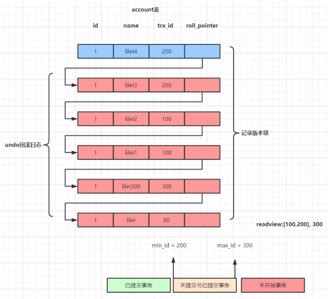

### MySQL 锁介绍
   
   按照锁的粒度来说，MySQL主要包含三种类型（级别）的锁定机制:
   
```
 - 全局锁：锁的是整个database。由MySQL的SQL layer层实现的
 - 表级锁：锁的是某个table。由MySQL的SQL layer层实现的
 - ⾏级锁：锁的是某⾏数据，也可能锁定⾏之间的间隙。由某些存储引擎实现，⽐如InnoDB。
```

   按照锁的功能来说分为：共享读锁和排他写锁。
   
   按照锁的实现⽅式分为：悲观锁和乐观锁（使⽤某⼀版本列或者唯⼀列进⾏逻辑控制）
   
   从对数据库的类型分： 分为读锁和写锁（都属于悲观锁）
   
   读锁：（共享锁，S锁（Shared））： 针对同一份数据，多个读操作可以同时进行而不会互相影响。
   
   写锁： （排它锁，X锁（eXclusive））: 当前写操作没有完成前，它会阻断其他写锁和读锁
   
   表级锁和⾏级锁的区别：
   
```
表级锁：开销⼩，加锁快；不会出现死锁；锁定粒度⼤，发⽣锁冲突的概率最⾼，并发度最低；
⾏级锁：开销⼤，加锁慢；会出现死锁；锁定粒度最⼩，发⽣锁冲突的概率最低，并发度也最⾼； 
```
   
### MySQL表级锁
   
   由MySQL SQL layer层实现
   
   1.MySQL的表级锁有两种：
   
    ⼀种是表锁。
    ⼀种是元数据锁（meta data lock，MDL)。
    
   2.MySQL 实现的表级锁定的争⽤状态变量
   
```
 show status like 'table%';
```
   
   
   
    - table_locks_immediate：产⽣表级锁定的次数；
    - table_locks_waited：出现表级锁定争⽤⽽发⽣等待的次数；

#### 表锁介绍
   
   *表锁有两种表现形式：*
   
   表共享读锁（Table Read Lock）
   
   表独占写锁（Table Write Lock）
   
   *⼿动增加表锁*
   
```
lock table 表名称 read(write),表名称2 read(write)，其他;
```
   
   *查看表锁情况*

```
show open tables;
```
   
   *删除表锁*

```
unlock tables;
```

### MySQL 行级锁

#### ⾏级锁介绍
   
   MySQL的⾏级锁，是由存储引擎来实现的，利⽤存储引擎锁住索引项来实现的。这⾥我们主要讲解
   InnoDB的⾏级锁。
   
   *InnoDB的⾏级锁，按照锁定范围来说，分为三种：*
   
      - 记录锁（Record Locks）:锁定索引中⼀条记录。 id=1
      - 间隙锁（Gap Locks）:要么锁住索引记录中间的值，要么锁住第⼀个索引记录前⾯的值或者最后⼀个索
      引记录后⾯的值。
      - Next-Key Locks:是索引记录上的记录锁和在索引记录之前的间隙锁的组合。
      
   *InnoDB的⾏级锁，按照功能来说，分为两种： RR*
   
       - 共享锁（S）：允许⼀个事务去读⼀⾏，阻⽌其他事务获得相同数据集的排他锁。
       - 排他锁（X）：允许获得排他锁的事务更新数据，阻⽌其他事务取得相同数据集的共享读锁（不是读）
      和排他写锁。
      
   对于UPDATE、DELETE和INSERT语句，InnoDB会⾃动给涉及数据集加排他锁（X)；
   
   对于普通SELECT语句，InnoDB不会加任何锁，事务可以通过以下语句显示给记录集加共享锁或排他
   锁。 
   
   *⼿动添加共享锁（S）：*

```
SELECT * FROM table_name WHERE ... LOCK IN SHARE MODE
```
   
   *⼿动添加排他锁（x）：*

```
SELECT * FROM table_name WHERE ... FOR UPDATE
```
   
   *InnoDB也实现了表级锁，也就是意向锁，意向锁是mysql内部使⽤的，不需要⽤户⼲预。*
   
       - 意向共享锁（IS）：事务打算给数据⾏加⾏共享锁，事务在给⼀个数据⾏加共享锁前必须先取得该表的
      IS锁。
       - 意向排他锁（IX）：事务打算给数据⾏加⾏排他锁，事务在给⼀个数据⾏加排他锁前必须先取得该表的
      IX锁。
      
   意向锁和⾏锁可以共存，意向锁的主要作⽤是为了【全表更新数据】时的性能提升。否则在全表更
   新数据时，需要先检索该表是否某些记录上⾯有⾏锁。
   
   InnoDB⾏锁是通过给索引上的索引项加锁来实现的，因此InnoDB这种⾏锁实现特点意味着：只
   有通过索引条件检索的数据，InnoDB才使⽤⾏级锁，否则，InnoDB将使⽤表锁！
   
   *Innodb所使⽤的⾏级锁定争⽤状态查看：*
   
```
 show status like 'innodb_row_lock%';
```
   
   *两阶段锁*
   
   传统RDBMS加锁的⼀个原则，就是2PL (Two-Phase Locking，⼆阶段锁)。相对⽽⾔，2PL⽐较容易理
   解，说的是锁操作分为两个阶段：加锁阶段与解锁阶段，并且保证加锁阶段与解锁阶段不相交。下⾯，
   仍旧以MySQL为例，来简单看看2PL在MySQL中的实现。
   
### MVCC 多版本并发控制机制

   Mysql在可重复读隔离级别下如何保证事务较高的隔离性，同样的sql查询语句在一个事务 里多次执行查询结果相同，就算其它事务对数据有修改也不会影响当前事务sql语句的查询结果。 
   这个隔离性就是靠MVCC(Multi-Version Concurrency Control)机制来保证的，对一行数据的读和写两个操作默认 是不会通过加锁互斥来保证隔离性，避免了频繁加锁互斥，
   而在串行化隔离级别为了保证较高的隔离性是通过将所有操 作加锁互斥来实现的。 Mysql在读已提交和可重复读隔离级别下都实现了MVCC机制。

#### undo日志版本链与read view机制详解
   
   undo日志版本链是指一行数据被多个事务依次修改过后，在每个事务修改完后，Mysql会保留修改前的数据undo回滚 日志，并且用两个隐藏字段trx_id和roll_pointer把这些undo日志串联起来形成一个历史记录版本链(见下图)
   
   
   
   *在可重复读隔离级别*，当事务开启，执行任何查询sql时会生成当前事务的一致性视图read-view，该视图在事务结束 之前都不会变化(如果是读已提交隔离级别在每次执行查询sql时都会重新生成)，
   这个视图由执行查询时所有未提交事 务id数组（数组里最小的id为min_id）和已创建的最大事务id（max_id）组成，
   事务里的任何sql查询结果需要从对应 版本链里的最新数据开始逐条跟read-view做比对从而得到最终的快照结果。 
   
   版本链比对规则： 
    
    1. 如果 row 的 trx_id 落在绿色部分( trx_id<min_id )，表示这个版本是已提交的事务生成的，这个数据是可见的； 
    
    2. 如果 row 的 trx_id 落在红色部分( trx_id>max_id )，表示这个版本是由将来启动的事务生成的，是不可见的(若 row 的 trx_id 就是当前自己的事务是可见的）；
   
    3. 如果 row 的 trx_id 落在黄色部分(min_id <=trx_id<= max_id)，那就包括两种情况 
       
       a. 若 row 的 trx_id 在视图数组中，表示这个版本是由还没提交的事务生成的，不可见(若 row 的 trx_id 就是当前自 己的事务是可见的)； 
       
       b. 若 row 的 trx_id 不在视图数组中，表示这个版本是已经提交了的事务生成的，可见。
   
   对于删除的情况可以认为是update的特殊情况，会将版本链上最新的数据复制一份，然后将trx_id修改成删除操作的 trx_id，同时在该条记录的头信息（record header）里的（deleted_flag）标记位写上true，
   来表示当前记录已经被 删除，在查询时按照上面的规则查到对应的记录如果delete_flag标记位为true，意味着记录已被删除，则不返回数 据。
    
   *注意*：begin/start transaction 命令并不是一个事务的起点，在执行到它们之后的第一个修改操作InnoDB表的语句， 事务才真正启动，才会向mysql申请事务id，mysql内部是严格按照事务的启动顺序来分配事务id的。
    
   *总结*： MVCC机制的实现就是通过read-view机制与undo版本链比对机制，使得不同的事务会根据数据版本链对比规则读取 同一条数据在版本链上的不同版本数据
   
### BufferPool缓存机制

   

   为什么Mysql不能直接更新磁盘上的数据而且设置这么一套复杂的机制来执行SQL了？ 因为来一个请求就直接对磁盘文件进行随机读写，然后更新磁盘文件里的数据性能可能相当差
   
   因为磁盘随机读写的性能是非常差的，所以直接更新磁盘文件是不能让数据库抗住很高并发的。 
   
   Mysql这套机制看起来复杂，但它可以保证每个更新请求都是更新内存BufferPool，然后顺序写日志文件，同时还能 保证各种异常情况下的数据一致性。
   
   更新内存的性能是极高的，然后顺序写磁盘上的日志文件的性能也是非常高的，要远高于随机读写磁盘文件。 
   
   正是通过这套机制，才能让我们的MySQL数据库在较高配置的机器上每秒可以抗下几干的读写请求
   
   