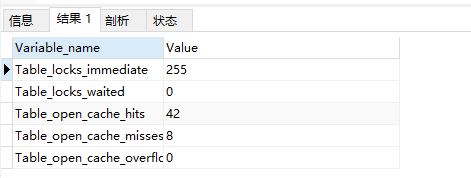

### MySQL 锁介绍
   
   按照锁的粒度来说，MySQL主要包含三种类型（级别）的锁定机制:
   
```
 - 全局锁：锁的是整个database。由MySQL的SQL layer层实现的
 - 表级锁：锁的是某个table。由MySQL的SQL layer层实现的
 - ⾏级锁：锁的是某⾏数据，也可能锁定⾏之间的间隙。由某些存储引擎实现，⽐如InnoDB。
```

   按照锁的功能来说分为：共享读锁和排他写锁。
   
   按照锁的实现⽅式分为：悲观锁和乐观锁（使⽤某⼀版本列或者唯⼀列进⾏逻辑控制）
   
   表级锁和⾏级锁的区别：
   
```
表级锁：开销⼩，加锁快；不会出现死锁；锁定粒度⼤，发⽣锁冲突的概率最⾼，并发度最低；
⾏级锁：开销⼤，加锁慢；会出现死锁；锁定粒度最⼩，发⽣锁冲突的概率最低，并发度也最⾼； 
```
   
### MySQL表级锁
   
   由MySQL SQL layer层实现
   
   1.MySQL的表级锁有两种：
   
    ⼀种是表锁。
    ⼀种是元数据锁（meta data lock，MDL)。
    
   2.MySQL 实现的表级锁定的争⽤状态变量
   
```
 show status like 'table%';
```
   
   
   
    - table_locks_immediate：产⽣表级锁定的次数；
    - table_locks_waited：出现表级锁定争⽤⽽发⽣等待的次数；

#### 表锁介绍
   
   *表锁有两种表现形式：*
   
   表共享读锁（Table Read Lock）
   
   表独占写锁（Table Write Lock）
   
   *⼿动增加表锁*
   
```
lock table 表名称 read(write),表名称2 read(write)，其他;
```
   
   *查看表锁情况*

```
show open tables;
```
   
   *删除表锁*

```
unlock tables;
```

#### 表锁演示
   
   