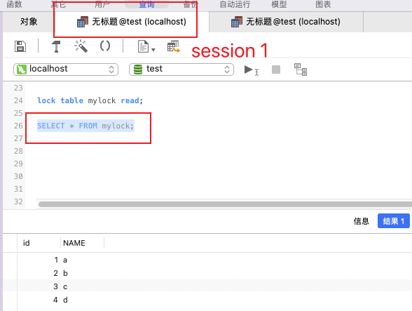
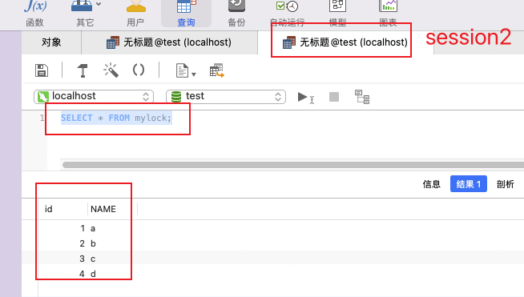
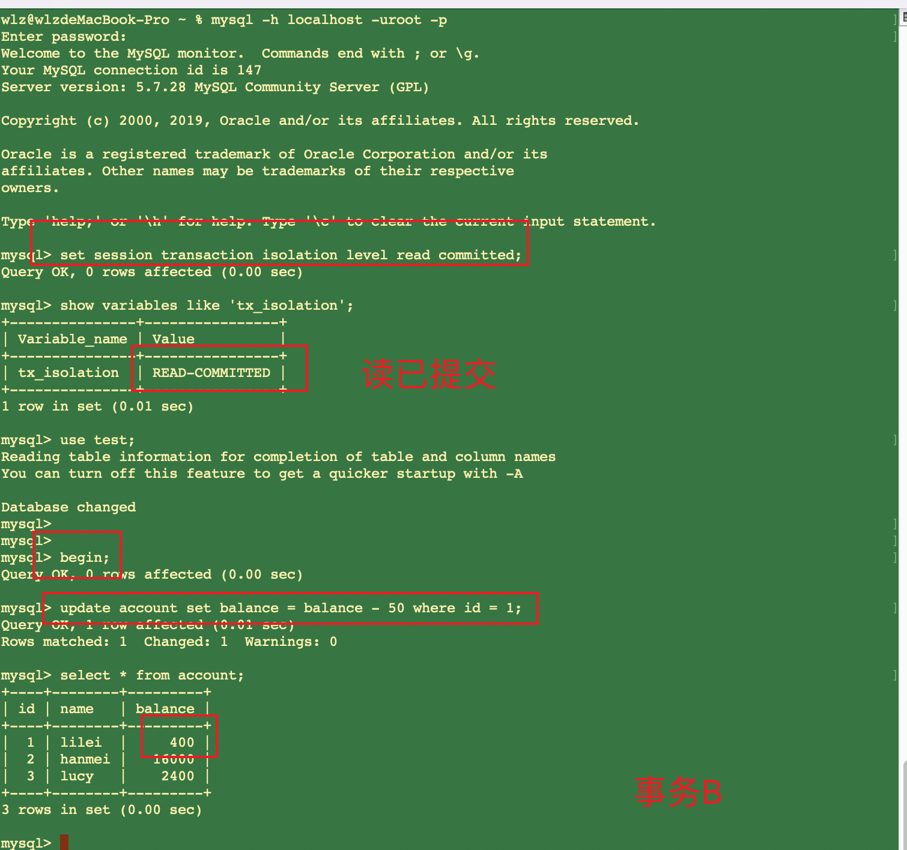
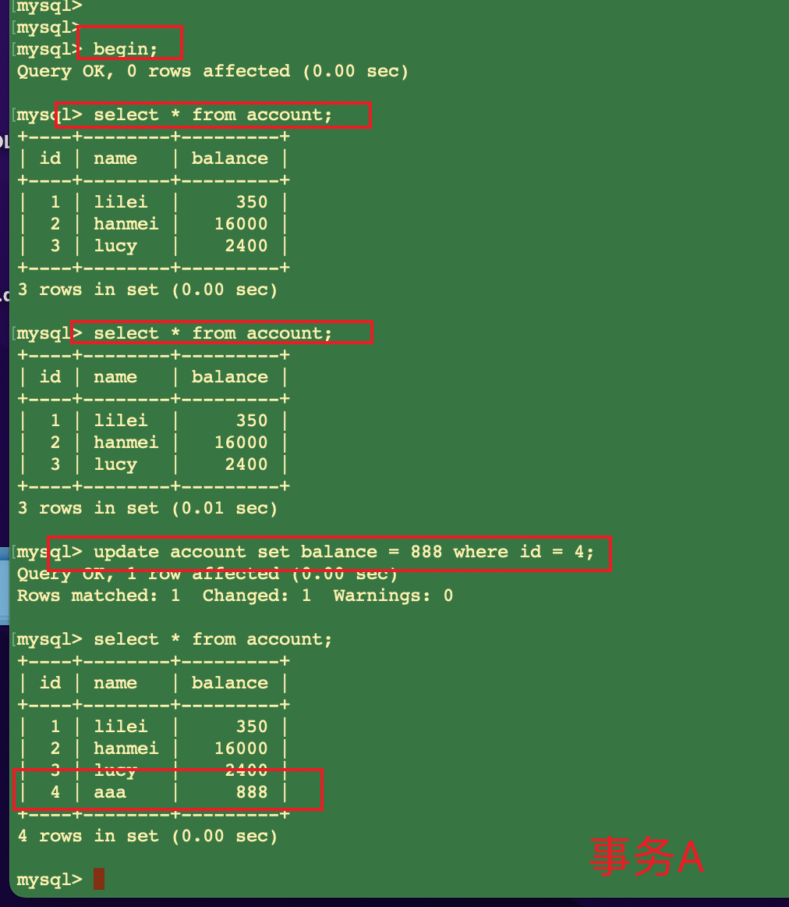
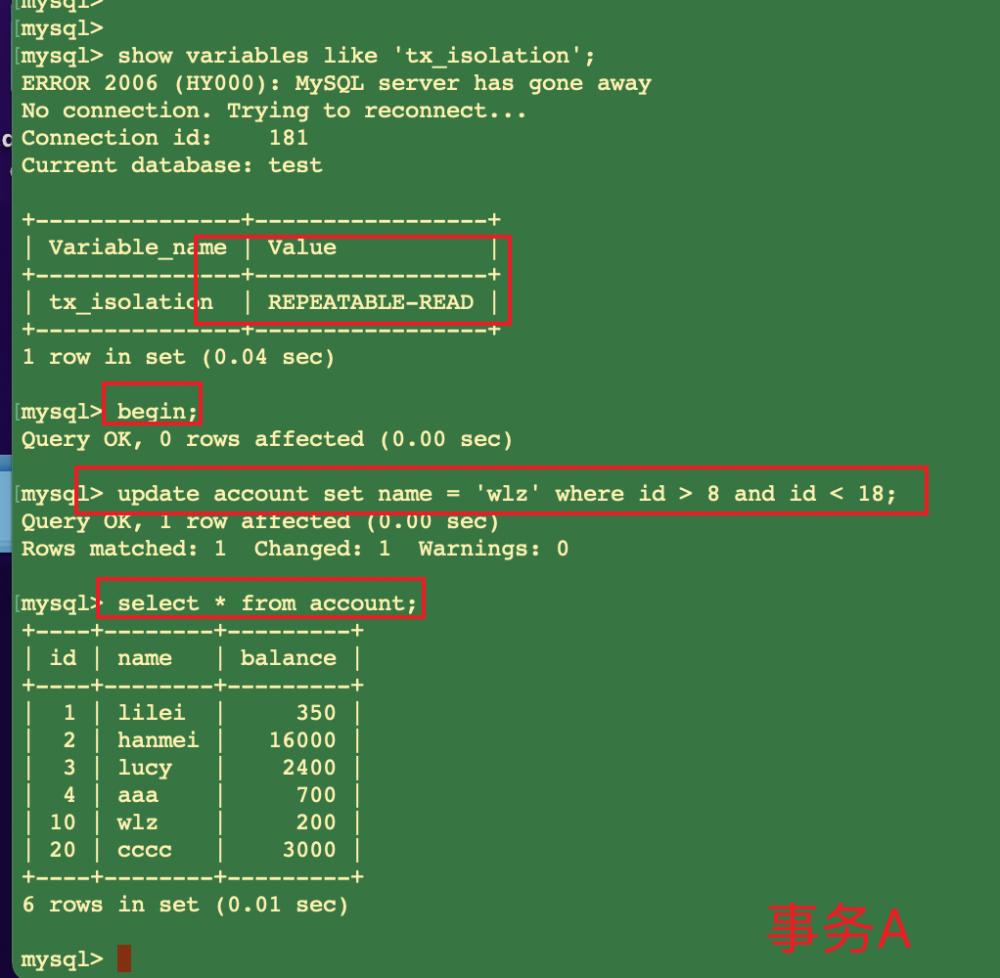
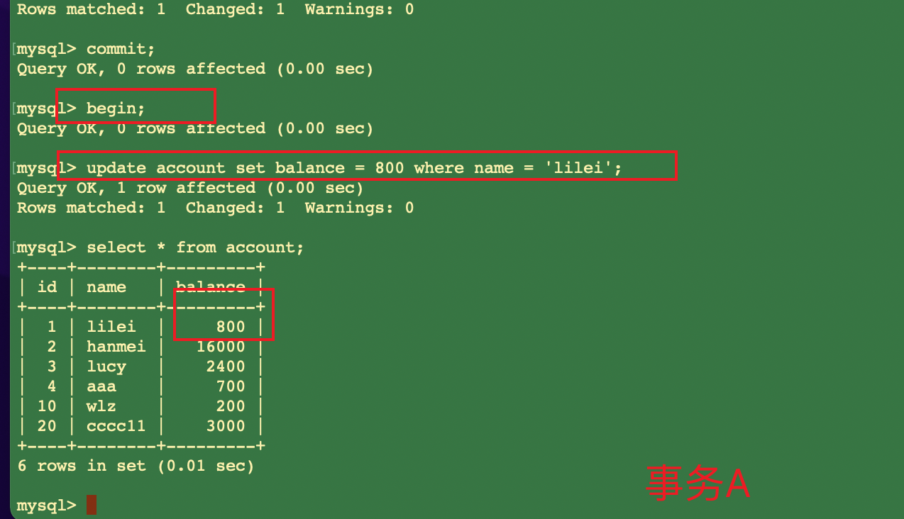
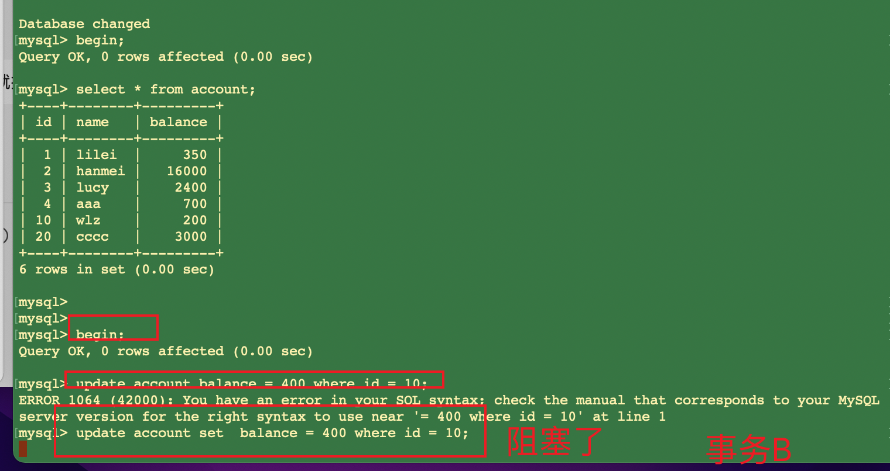
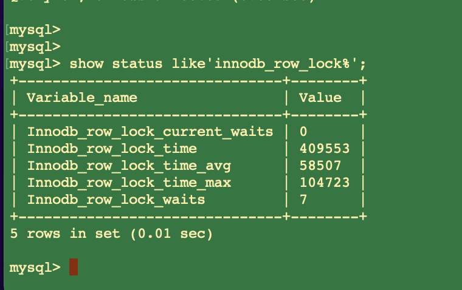

## 1.事务

### 1.1 事务及ACID 属性

   事务是由一组SQL语句组成的逻辑处理单元,事务具有以下4个属性,通常简称为事务的ACID属性。
   
    1. 原子性(Atomicity) :事务是一个原子操作单元,其对数据的修改,要么全都执行,要么全都不执行。 
    2. 一致性(Consistent) :在事务开始和完成时,数据都必须保持一致状态。这意味着所有相关的数据规则都必须应用于事务的修改,以保持数据的完整性。
    3. 隔离性(Isolation) :数据库系统提供一定的隔离机制,保证事务在不受外部并发操作影响的“独立”环境执行。这意味着事务处理过程中的中间状态对外部是不可见的,反之亦然。
    4. 持久性(Durable) :事务完成之后,它对于数据的修改是永久性的,即使出现系统故障也能够保持。

### 1.2 并发事务处理导致的问题 

#### 1.2.1 更新丢失(Lost Update)或脏写
    
    当两个或多个事务选择同一行，然后基于最初选定的值更新该行时，由于每个事务都不知道其他事务的存在，就会发生丢失更新问题–最后的更新覆盖了由其他事务所做的更新。

#### 1.2.2 脏读(Dirty Reads)
    
    一个事务正在对一条记录做修改，在这个事务完成并提交前，这条记录的数据就处于不一致的状态;这时，另一个事务也来读取同一条记录，
    如果不加控制，第二个事务读取了这些“脏”数据，并据此作进一步的 处理就会产生未提交的数据依赖关系。这种现象被形象的叫做“脏读”。   
    
    一句话:事务A读取到了事务B已经修改但尚未提交的数据，还在这个数据基础上做了操作。此时，如果B 事务回滚，A读取的数据无效，不符合一致性要求。

#### 1.2.3 不可重读(Non-Repeatable Reads)
    
    一个事务在读取某些数据后的某个时间，再次读取以前读过的数据，却发现其读出的数据已经发生了改变、或某些记录已经被删除了!这种现象就叫做“不可重复读”。   
    
    一句话:事务A内部的相同查询语句在不同时刻读出的结果不一致，不符合隔离性

#### 1.2.4 幻读(Phantom Reads)

    一个事务按相同的查询条件重新读取以前检索过的数据，却发现其他事务插入了满足其查询条件的新数 据，这种现象就称为“幻读”。
    
    一句话:事务A读取到了事务B提交的新增数据，不符合隔离性

### 1.3. 事务隔离级别

   “脏读”、“不可重复读”和“幻读”,其实都是数据库读一致性问题,必须由数据库提供一定的事务隔离机制 来解决。


  数据库的事务隔离越严格,并发副作用越小,但付出的代价也就越大,因为事务隔离实质上就是使事务在一定程度 上“串行化”进行,这显然与“并发”是矛盾的。 同时,不同的应用对读一致性和事务隔离程度的要求也是不同的,比如许多应用对“不可重复读"和“幻读”并不 敏感,可能更关心数据并发访问的能力。

  查看当前数据库的事务隔离级别: show variables like 'tx_isolation';

  设置事务隔离级别:set tx_isolation='REPEATABLE-READ'; Mysql默认的事务隔离级别是可重复读，用Spring开发程序时，
  如果不设置隔离级别默认用Mysql设置的隔 离级别，如果Spring设置了就用已经设置的隔离级别
  
## 2. 锁机制

### 2.1 锁介绍

  锁是计算机协调多个进程或线程并发访问某一资源的机制。 在数据库中，除了传统的计算资源(如CPU、RAM、I/O等)的争用以外，数据也是一种供需要用户共享的资源。
  如何保证数据并发访问的一致性、有效性是所有数据库必须解决的一个问题，锁冲突也是影响数据库并发 访问性能的一个重要因素。

### 2.2 锁分类

   1. 从性能上分为乐观锁(用版本对比来实现)和悲观锁 
   
   2. 从对数据库操作的类型分，分为读锁和写锁(都属于悲观锁)
        
        1. 读锁(共享锁，S锁(Shared)):针对同一份数据，多个读操作可以同时进行而不会互相影响 
        
        2. 写锁(排它锁，X锁(eXclusive)):当前写操作没有完成前，它会阻断其他写锁和读锁

   3. 从对数据操作的粒度分为 表锁和行锁

```
 - 全局锁：锁的是整个database。由MySQL的SQL layer层实现的
 - 表级锁：锁的是某个table。由MySQL的SQL layer层实现的
 - ⾏级锁：锁的是某⾏数据，也可能锁定⾏之间的间隙。由某些存储引擎实现，⽐如InnoDB。
```

  表级锁和⾏级锁的区别：

```
表级锁：开销⼩，加锁快；不会出现死锁；锁定粒度⼤，发⽣锁冲突的概率最⾼，并发度最低；
⾏级锁：开销⼤，加锁慢；会出现死锁；锁定粒度最⼩，发⽣锁冲突的概率最低，并发度也最⾼； 
```

### 2.3 表锁

   每次操作锁住整张表。开销小，加锁快;不会出现死锁;锁定粒度大，发生锁冲突的概率最高，并发度最低; 一般用在整表数据迁移的场景。

#### 2.3.1 基本操作

##### 2.3.1.1 建表 

```mysql
‐‐ 建表SQL 
CREATE TABLE`mylock`(
 `id` INT (11) NOT NULL AUTO_INCREMENT,
 `NAME` VARCHAR (20) DEFAULT NULL,
 PRIMARY KEY (`id`)
)ENGINE = MyISAM DEFAULT CHARSET=utf8;

‐‐ 插入数据 
INSERT INTO`test`.`mylock`(`id`,`NAME`)VALUES('1','a');
INSERT INTO`test`.`mylock`(`id`,`NAME`)VALUES('2','b');
INSERT INTO`test`.`mylock`(`id`,`NAME`)VALUES('3','c'); 
INSERT INTO`test`.`mylock`(`id`,`NAME`)VALUES('4','d');
```

##### 2.3.1.2. 手动增加表锁

```mysql
-- 加锁  读锁 或 写锁 
lock table 表名称 read(write), 表名称2 read(write);
-- 查看表上加过的锁 
show open tables;
-- 删除表锁 
unlock tables;
```

##### 2.3.1.3 分析 

 加读锁: 当前session和其他session都可以读该表 当前session中插入或者更新锁定的表都会报错，其他session插入或更新则会等待

```mysql
lock table mylock read;
```






   加写锁: 当前session对该表的增删改查都没有问题，其他session对该表的所有操作被阻塞

```mysql
lock table mylock write;
```

  1、对MyISAM表的读操作(加读锁) ,不会阻寒其他进程对同一表的读请求,但会阻赛对同一表的写请求。只有当 读锁释放后,才会执行其它进程的写操作。
  
  2、对MylSAM表的写操作(加写锁) ,会阻塞其他进程对同一表的读和写操作,只有当写锁释放后,才会执行其它进 程的读写操作

### 2.4 行锁

  每次操作锁住一行数据。开销大，加锁慢;会出现死锁;锁定粒度最小，发生锁冲突的概率最低，并发度最 高。
    
    InnoDB与MYISAM的最大不同有两点:
    InnoDB支持事务(TRANSACTION) InnoDB支持行级锁

#### 2.4.1 行锁演示 
    
   一个session开启事务更新不提交，另一个session更新同一条记录会阻塞，更新不同记录不会阻塞。 

#### 2.4.2 总结:

    MyISAM在执行查询语句SELECT前，会自动给涉及的所有表加读锁,在执行update、insert、delete操作会自动给涉及的表加写锁。 
    InnoDB在执行查询语句SELECT时(非串行隔离级别)，不会加锁。但是update、insert、delete操作会加行锁。
    
    简而言之，就是读锁会阻塞写，但是不会阻塞读。而写锁则会把读和写都阻塞。

#### 2.4.3 行锁与事务隔离级别案例分析

```mysql
CREATE TABLE`account`(
`id` int(11) NOT NULL AUTO_INCREMENT,
 `name` varchar(255) DEFAULT NULL, 
 `balance` int(11) DEFAULT NULL, PRIMARY KEY (`id`)
)ENGINE=InnoDB DEFAULT CHARSET=utf8; 

INSERT INTO`test`.`account`(`name`,`balance`)VALUES('lilei','450');
INSERT INTO`test`.`account`(`name`,`balance`)VALUES('hanmei','16000'); 
INSERT INTO`test`.`account`(`name`,`balance`)VALUES('lucy','2400');
```

##### 2.4.3.1 读未提交 

  (1)打开一个客户端A，并设置当前事务模式为read uncommitted(未提交读)，查询表account的初始值:

    set tx_isolation='read-uncommitted';  (set session transaction isolation level read uncommitted; -- 前面命令有时不生效，故使用后面)
 
  注意:  start transaction 与 begin 是 一个意思。 


  (2) 在客户端A的事务提交之前，打开另一个客户端B，更新表account:


  (3) 这时，虽然客户端B的事务还没提交，但是客户端A就可以查询到B已经更新的数据:


  (4) 一旦客户端B的事务因为某种原因回滚，所有的操作都将会被撤销，那客户端A查询到的数据其实就是脏 数据:


  (5) 在客户端A执行更新语句update account set balance = balance - 50 where id =1，lilei的balance没 有变成350，居然是400，
      是不是很奇怪，数据不一致啊，如果你这么想就太天真 了，在应用程序中，我们会 用400-50=350，并不知道其他会话回滚了，
      要想解决这个问题可以采用读已提交的隔离级别


##### 2.4.3.2 读已提交 

  (1)打开一个客户端A，并设置当前事务模式为read committed(读已提交)，查询表account的所有记 录:

    set tx_isolation='read-committed'; (set session transaction isolation level read committed; -- 前面命令有时不生效，故使用后面)


  (2)在客户端A的事务提交之前，打开另一个客户端B，更新表account:



  (3)这时，客户端B的事务还没提交，客户端A不能查询到B已经更新的数据，解决了脏读问题:


  (4)客户端B的事务提交


  (5)客户端A执行与上一步相同的查询，结果 与上一步不一致，即产生了不可重复读的问题


##### 2.4.3.3 可重复读

  (1)打开一个客户端A，并设置当前事务模式为repeatable read，查询表account的所有记录 

     set tx_isolation='repeatable-read'; (set session transaction isolation level  repeatable read; -- 前面命令有时不生效，故使用后面)


  (2)在客户端A的事务提交之前，打开另一个客户端B，更新表account并提交


  (3)在客户端A查询表account的所有记录，与步骤(1)查询结果一致，没有出现不可重复读的问题


  (4)在客户端A，接着执行update account set balance = balance - 50 where id = 1，balance没有变成 400-50=350，
  lilei的balance值用的是步骤2中的350来算的，所以是300，数据的一致性倒是没有被破坏。
  可重复读的隔离级别下使用了MVCC(multi-version concurrency control)机制，select操作不会更新版本号， 是快照读(历史版本);
  insert、update和delete会更新版本号，是当前读(当前版本)。


  (5)重新打开客户端B，插入一条新数据后提交


  (6)在客户端A查询表account的所有记录，没有查出新增数据，所以没有出现幻读


  (7)验证幻读
 
   在客户端A执行update account set balance=888 where id = 4;能更新成功，再次查询能查到客户端B新增 的数据



##### 2.4.3.4 串行化 

   (1)打开一个客户端A，并设置当前事务模式为serializable，查询表account的初始值: 

    set tx_isolation='serializable'; （set session transaction isolation level  serializable; -- 前面命令有时不生效，故使用后面 ）


   (2)打开一个客户端B，并设置当前事务模式为serializable，更新相同的id为1的记录会被阻塞等待，更新id 为2的记录可以成功，
   说明在串行模式下innodb的查询也会被加上行锁。 如果客户端A执行的是一个范围查询，
   那么该范围内的所有行包括每行记录所在的间隙区间范围(就算该行数据 还未被插入也会加锁，这种是间隙锁)都会被加锁。
   此时如果客户端B在该范围内插入数据都会被阻塞，所以就 避免了幻读。

    这种隔离级别并发性极低，开发中很少会用到。


### 2.5 间隙锁

   间隙锁，锁的就是两个值之间的空隙。Mysql默认级别是repeatable-read，有办法解决幻读问题吗?间隙锁 在某些情况下可以解决幻读问题。
   
   假设account表里数据如下:



   那么间隙就有 id 为 (4,10)，(10,20)，(20,正无穷) 这三个区间；

   在Session_1下面执行 update account set name = 'zhuge' where id > 8 and id <18;，
   则其他Session没法在这个范围所包含的所有行记录(包括间隙行记录)以及行记录所在的间隙里插入或修改任何数据，
   即id在 (3,20]区间都无法修改数据，注意最后那个20也是包含在内的。
   
   间隙锁是在可重复读隔离级别下才会生效。


### 2.6 临键锁 

   Next-Key Locks是行锁与间隙锁的组合。像上面那个例子里的这个(3,20]的整个区间可以叫做临键锁。
   

### 2.7 无索引行锁会升级为表锁 

   锁主要是加在索引上，如果对非索引字段更新，行锁可能会变表锁
   
   session1 执行:update account set balance = 800 where name = 'lilei';



   session2 对该表任一行操作都会阻塞住 InnoDB的行锁是针对索引加的锁，不是针对记录加的锁。并且该索引不能失效，否则都会从行锁升级为表锁。



    锁定某一行还可以用lock in share mode(共享锁) 和for update(排它锁)，例如:select * from test_innodb_lock where a = 2 for update;
  
    这样其他session只能读这行数据，修改则会被阻塞，直到锁定行的session提交

### 2.8 结论 

   Innodb存储引擎由于实现了行级锁定，虽然在锁定机制的实现方面所带来的性能损耗可能比表级锁定会要更高一下，
   但是在整体并发处理能力方面要远远优于MYISAM的表级锁定的。当系统并发量高的时候，Innodb 的整体性能和MYISAM相比就会有比较明显的优势了。
   
   但是，Innodb的行级锁定同样也有其脆弱的一面，当我们使用不当的时候，可能会让Innodb的整体性能表现 不仅不能比MYISAM高，甚至可能会更差。
   

### 2.9 行锁分析 

   通过检查InnoDB_row_lock状态变量来分析系统上的行锁的争夺情况
   
```mysql
show status like'innodb_row_lock%';
```



   对各个状态量的说明如下:
    
    Innodb_row_lock_current_waits: 当前正在等待锁定的数量 
    Innodb_row_lock_time: 从系统启动到现在锁定总时间长度 
    Innodb_row_lock_time_avg: 每次等待所花平均时间 
    Innodb_row_lock_time_max:从系统启动到现在等待最长的一次所花时间
    Innodb_row_lock_waits:系统启动后到现在总共等待的次数

   对于这5个状态变量，比较重要的主要是:

    Innodb_row_lock_time_avg (等待平均时长) 
    Innodb_row_lock_waits (等待总次数)
    Innodb_row_lock_time(等待总时长)

   尤其是当等待次数很高，而且每次等待时长也不小的时候，我们就需要分析系统中为什么会有如此多的等待，然后根据分析结果着手制定优化计划。

#### 2.9.1 查看INFORMATION_SCHEMA系统库锁相关数据表

```mysql
‐‐ 查看事务
select * from INFORMATION_SCHEMA.INNODB_TRX;
‐‐ 查看锁
select * from INFORMATION_SCHEMA.INNODB_LOCKS;
‐‐ 查看锁等待
select * from INFORMATION_SCHEMA.INNODB_LOCK_WAITS;
‐‐ 释放锁，trx_mysql_thread_id可以从INNODB_TRX表里查看到
kill trx_mysql_thread_id

‐‐ 查看锁等待详细信息
show engine innodb status\G;
```

### 2..10 死锁

```mysql
set tx_isolation='repeatable-read';
-- Session_1执行:
select * from account where id=1 for update;
-- Session_2执行:
select * from account where id=2 for update;
-- Session_1执行:
select * from account where id=2 for update;
-- Session_2执行:
select * from account where id=1 for update;
```

   查看近期死锁日志信息:show engine innodb status\G; 
  
   大多数情况mysql可以自动检测死锁并回滚产生死锁的那个事务，但是有些情况mysql没法自动检测死锁

### 2.11 锁优化建议 

    尽可能让所有数据检索都通过索引来完成，避免无索引行锁升级为表锁 
   
    合理设计索引，尽量缩小锁的范围

    尽可能减少检索条件范围，避免间隙锁 
   
    尽量控制事务大小，减少锁定资源量和时间长度，涉及事务加锁的sql尽量放在事务最后执行 
   
    尽可能低级别事务隔离

   
