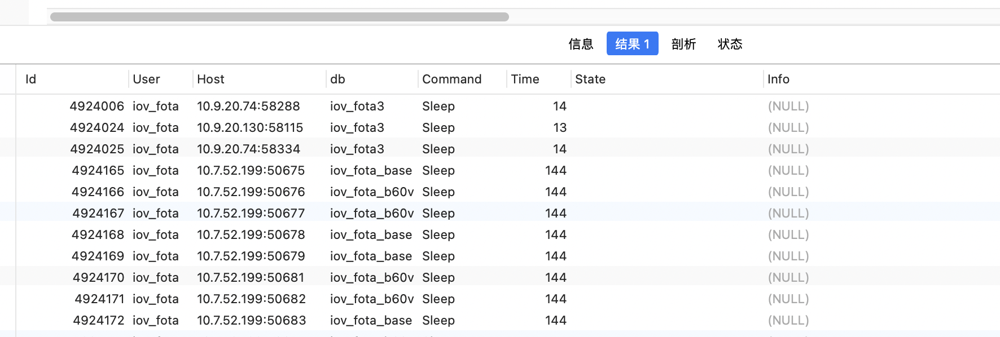

### 1. mysql MySQL表锁了如何解锁

SHOW PROCESSLIST;  -- 运行这个条命令，会出现下面截图所示内容，找到 字段 state  值中有waiting的记录，看看是不是自己需要解锁的表

字段 info信息中会有对应表名

找到自己需要解锁的记录id，重复操作导致卡主，可能会有多条记录，解锁表的都删除

然后运行 kill id（刚找到的id）

```sql
SHOW PROCESSLIST;

kill id 
```



引用: https://blog.csdn.net/chao430/article/details/114738414
