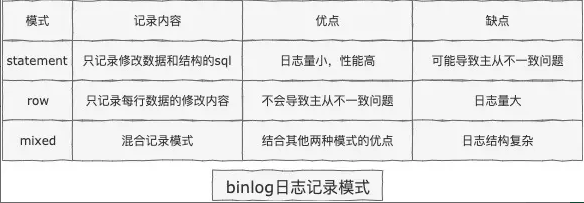
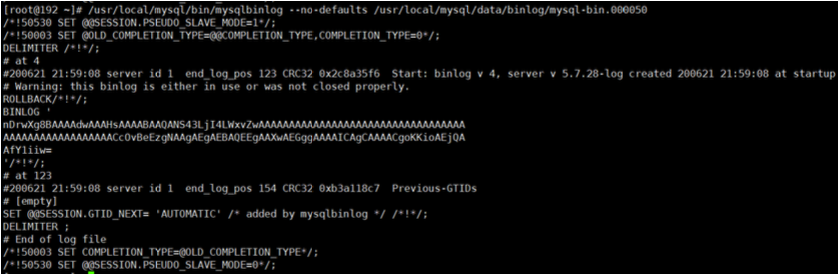

### Mysql 日志 

#### 1. binlog 日志
   
   binlog日志有三种记录模式并各有优缺点：
   
   
   
   MySQL默认的binlog记录模式为row。

   删库是不需要跑路的，因为我们的SQL执行时，会将sql语句的执行逻辑记录在我们的bin-log当中，什么是bin-log呢?
   binlog是Server层实现的二进制日志,他会记录我们的cud (增删改)操作。Binlog有以下几个特点:
      
      1、Binlog在MySQL的Server层实现(引擎共用) 
      2、Binlog为逻辑日志,记录的是一条语句的原始逻辑 
      3、Binlog不限大小,追加写入,不会覆盖以前的日志
   
   如果，我们误删了数据库,可以使用binlog进行归档!要使用binlog归档，首先我们得记录binlog，因此需要先开启MySQL的 binlog功能。

##### 1.1 配置my.cnf 

```
配置开启binlog
log‐bin=/usr/local/mysql/data/binlog/mysql‐bin
注意5.7以及更高版本需要配置本项:server‐id=123454(自定义,保证唯一性);
#binlog格式，有3种statement,row,mixed
binlog‐format=ROW
#表示每1次执行写入就与硬盘同步，会影响性能，为0时表示，事务提交时mysql不做刷盘操作，由系统决定
sync‐binlog=1
```

##### 1.2 binlog 命令 

```mysql
show variables like '%log_bin%';  -- 查看bin‐log是否开启
flush logs;   -- 会多一个最新的bin‐log日志
show master status;  -- 查看最后一个bin‐log日志的相关信息 
reset master;  -- 清空所有的bin‐log日志
```

##### 1.3 查看 binlog 内容

```
/usr/local/mysql/bin/mysqlbinlog ‐‐no‐defaults /usr/local/mysql/data/binlog/mysql‐bin.000001  -- 查看binlog内容
```

binlog里的内容不具备可读性，所以需要我们自己去判断恢复的逻辑点位，怎么观察呢?看重点信息，比如begin,commit这种 关键词信息，
只要在binlog当中看到了，你就可以理解为begin-commit之间的信息是一个完整的事务逻辑,然后再根据位置 position判断恢复即可。binlog内容如下:



##### 1.4 数据归档操作 

```
从bin‐log恢复数据
恢复全部数据
   /usr/local/mysql/bin/mysqlbinlog ‐‐no‐defaults /usr/local/mysql/data/binlog/mysql‐bin.000001 |mysql ‐uroot ‐p tuling(数据库名)
恢复指定位置数据
   /usr/local/mysql/bin/mysqlbinlog ‐‐no‐defaults ‐‐start‐position="408" ‐‐stop‐position="731"
   /usr/local/mysql/data/binlog/mysql‐bin.000001 |mysql ‐uroot ‐p tuling(数据库)
恢复指定时间段数据
   /usr/local/mysql/bin/mysqlbinlog ‐‐no‐defaults /usr/local/mysql/data/binlog/mysql‐bin.000001 ‐‐stop‐date= "2018‐03‐02 12:00:00" ‐‐start‐date= "2019‐03‐02 11:55:00"|mysql ‐uroot ‐p test(数 据库)
```

##### 1.5 归档测试 

1、定义一个存储过程，写入数据

```mysql
drop procedure if exists tproc;
delimiter $$
create procedure tproc(i int)
begin
    declare s int default 1;
    declare c char(50) default repeat('a',50);
    while s<=i do
        start transaction;
        insert into test values(null,c);
commit;
         set s=s+1;
     end while;
 end$$
 delimiter ;
```

2. 删除数据

```mysql
truncate test;
```

3. 利用binlog归档 

```
/usr/local/mysql/bin/mysqlbinlog ‐‐no‐defaults /usr/local/mysql/data/binlog/mysql‐ bin.000001 |mysql ‐uroot ‐p tuling(数据库名)
```

#### 2. redo log 日志   （重做日志）   
   
   MySQL 在更新数据时，为了减少磁盘的随机 IO，因此并不会直接更新磁盘上的数据，而是先更新 Buffer Pool 中缓存页的数据，等到合适的时间点，再将这个缓存页持久化到磁盘。
   而 Buffer Pool 中所有缓存页都是处于内存当中的，当 MySQL 宕机或者机器断电，内存中的数据就会丢失，因此 MySQL 为了防止缓存页中的数据在更新后出现数据丢失的现象，引入了 redo log 机制。
   
   当进行增删改操作时，MySQL 会在更新 Buffer Pool 中的缓存页数据时，会记录一条对应操作的 redo log 日志，这样如果出现 MySQL 宕机或者断电时，如果有缓存页的数据还没来得及刷入磁盘，
   那么当 MySQL 重新启动时，可以根据 redo log 日志文件，进行数据重做，将数据恢复到宕机或者断电前的状态，保证了更新的数据不丢失，因此 redo log 又叫做重做日志。它的本质是保证事务提交后，更新的数据不丢失。
   
   与 binlog 不同的是，redo log 中记录的是*物理日志*，是 InnoDB 引擎记录的，而 binlog 记录的是*逻辑日志*，是 MySQL 的 Server 层记录的。
   什么意思呢？binlog 中记录的是 SQL 语句（实际上并不一定为 SQL 语句，这与 binlog 的格式有关，如果指定的是 STATEMENT 格式，那么 binlog 中记录的就是 SQL 语句），也就是逻辑日志；
   而 redo log 中则记录的是对磁盘上的某个表空间的某个数据页的某一行数据的某个字段做了修改，修改后的值为多少，它记录的是对物理磁盘上数据的修改，因此称之为物理日志。
   
#####  3. redo log buffer
   
   当一条 SQL 更新完 Buffer Pool 中的缓存页后，就会记录一条 redo log 日志，前面提到了 redo log 日志是存储在磁盘上的，那么此时是不是立马就将 redo log 日志写入磁盘呢？显然不是的，而是先写入一个叫做 redo log buffer 的缓存中，redo log buffer 是一块不同于 buffer pool 的内存缓存区，在 MySQL 启动的时候，向内存中申请的一块内存区域，它是 redo log 日志缓冲区，默认大小是 16MB，由参数 innodb_log_buffer_size 控制（前面的截图中可以看到）。
   
   redo log buffer 内部又可以划分为许多 redo log block，每个 redo log block 大小为 512 字节。我们写入的 redo log 日志，最终实际上是先写入在 redo log buffer 的 redo log block 中，然后在某一个合适的时间点，将这条 redo log 所在的 redo log block 刷入到磁盘中。
   