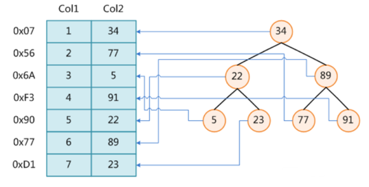
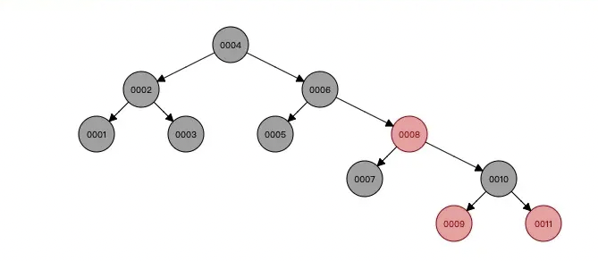
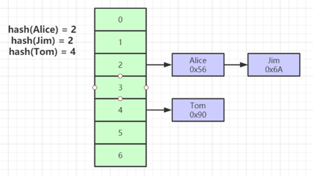
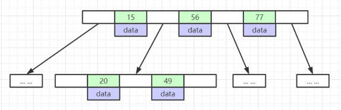
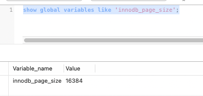
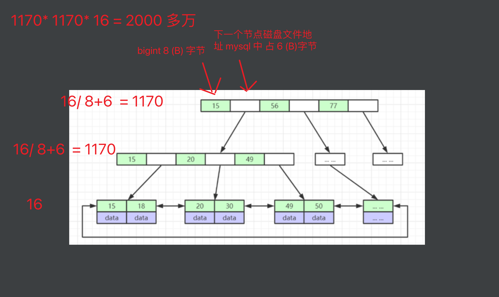
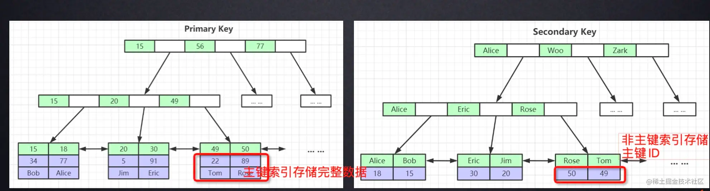
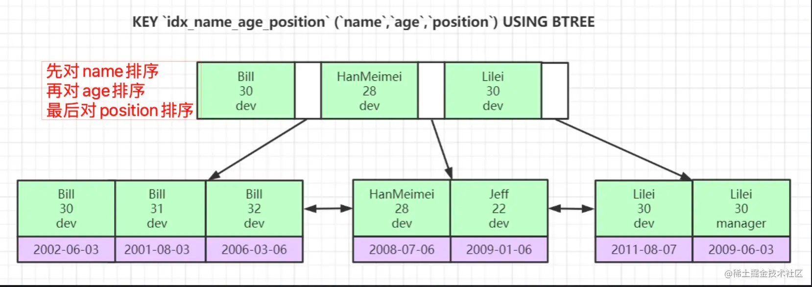
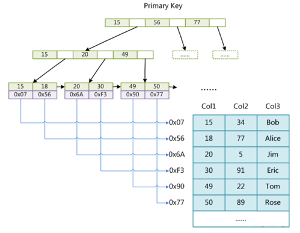

### 1.索引是什么？ 
    索引是帮助MySQL高效获取数据的"排好序的数据结构"

### 2.数据结构

    数据结构网站: https://www.cs.usfca.edu/~galles/visualization/Algorithms.html

#### 2.1 二叉树
    
    二叉树的特点: 右边的元素大于父元素，左边的元素小于父元素。
   
   
    
##### 为什么msql不是使用二叉树: 
    
    当利用 索引查询的时候，不可能把 整个索引树都加载到内存，只能逐一加载每个磁盘页，磁盘页对应索引树的节点。
    mysql 衡量查询效率的标准就是磁盘IO的次数。
    为了减少磁盘IO的次数，就得尽量减少树的高度。而且在很极端的情况下，N条数据需要查询N次才可以找到该条数据(二叉树蜕变为链表的情况), 因此二叉树不适合作为mysql的索引。

#### 2.2 红黑树
    
    红黑树 也是平衡二叉树 

   

##### 为什么msql不是使用红黑树:
    
    可以看到，虽然红黑树 对数据进行了平衡处理，不会导致像二叉树一样单边增长，但是当数据量很大的时候，红黑树的深度还是会很深，这样查询数据的时候还是会进行多次IO,
    一样会很耗时。

#### 2.3 Hash表  (MySQL也支持hash数据结构的索引。因为在=查询的时候，大部分情况下效率要优于B+树。)
    
   对索引的key 进行一次hash计算就可以定位出数据存储的位置
    1. 很多时候hash 索引 要比 B+Tree 索引更高效
    2. 仅能满足 "="、 "IN", 不支持范围查询
    3. hash 冲突问题 

   

#### 2.4 B-Tree 
    
   特点: 
    
        1. 叶子节点具有相同的深度，叶节点的指针为空
        2. 所有索引元素不重复
        3. 节点的数据索引从左到右递增排列。

   

##### 为什么msql不是使用B-Tree:
    
    可以从 B-Tree 看到，其扩大了横向的深度，减少了纵向深度，因此提高查询速度而不影响存储数据容量。
    但是 java 程序拿数据的过程是: java程序 -> cpu -> 内存 -> 硬盘
    而内存与硬盘的交互 是有大小限制的，innidb 页的大小 为16KB.
    B-Tree 的所有节点都存储了数据(实际数据或磁盘文件地址)，所以一次IO查询出来的数据量就不会很多，因此查询效率就不高。

  查询msql 页的大小:

```
show global variables like 'innodb_page_size';
```

   

#### 2.5 B+Tree (msql innidb 使用的是B+Tree)
    
   特点:
     
        1. 非叶子节点不存储data, 只存储索引，可以放更多的索引。
        2. 叶子节点包含所有索引字段。
        3. 叶子节点用指针连接， 提高区间访问的性能。

   

   

   

    联合索引会从左往右依次对索引字段进行排序，因此通过联合索引进行查询时遵从最左前缀原则。

##### 为什么msql使用B+Tree:
    
    B+Tree 通过把data 不放在 非叶子节点来增加度(小节点)， 从而一次IO可以查询出更多的索引数据，减少查询次数.
    并且，叶子节点直接会有指针，数据又是递增的，使得范围查找可以通过指针连接查找，而不用从上面节点往下一个一个找。
    从上可以看到B+Tree 即减少了查询次数，又提供了很好的范围查找，对比 二叉树、红黑树、B-Tree 都更适合作为msql 的索引数据结构.
    
### 3. mysql 存储引擎 

#### 3.1 MyISAM  存储引擎 
    
    MyISAM 索引文件和数据文件是分离的(非聚集)
    
   

   MyISAM索引文件和数据文件是分离的，数据.MYD+结构.frm+索引.MYI三个文件。
   非主键索引和主键索引叶子节点都存储的文件指针地址。

#### 3.2 InnoDB 存储引擎 

   InnoDB 索引实现(聚集) 
    
    1. 表数据文件本身就是按照B+Tree 组织的一个索引结构文件
    2. 聚集索引-叶子节点包含了完整的数据结构
    
##### 为什么？
 
###### 3.3.1. 为什么建议InnoDB 表必须（建议）建主键，并且推荐使用整型的自增主键？ 
        
    1. mysql的数据存储中idb 文件中，要使用一颗聚簇索引来维护一个B+Tree保存数据，那么在组织索引的时候，会依赖唯一id,有以下几种情况
        1. 如果有一个主键，可以使用主键建索引
        2. 如果没有主键，会从第一列开始选择一列所有值都不相同的列，作为索引列。
        3. 如果没有选到唯一值，mysql 会帮忙建一个隐藏列，维护一个唯一id,以此来组织索引。
    所以为了避免mysql 选择索引和建立隐藏列的性能损耗，建议手动建立一个主键。
   
###### 3.2.2. 为什么非主键索引结构叶子节点存储的是主键值？ （一致性和节省空间）
    
    1. 使用 整形作为主键相比字符型可以节省数据页的空间 。
    2. 构建 索引 B+Tree 时，为了保证 索引的有序性，使用整型可以避免页分裂
    3. 在索引中查找数据时，减少比较的性能。

###### 3.2.3.主键为什么要自增？ 
    
    索引结构B+Tree ,具有有序的特性，如果主键不是自增，在进行增删数据时，会判断数据应该存放的位置，进行插入和删除，为了保持平衡，
    会对数据页进行分裂等操作移动数据，严重的影响性能，所以主键需要是自增的，插入时，插入在索引数据页的最后。