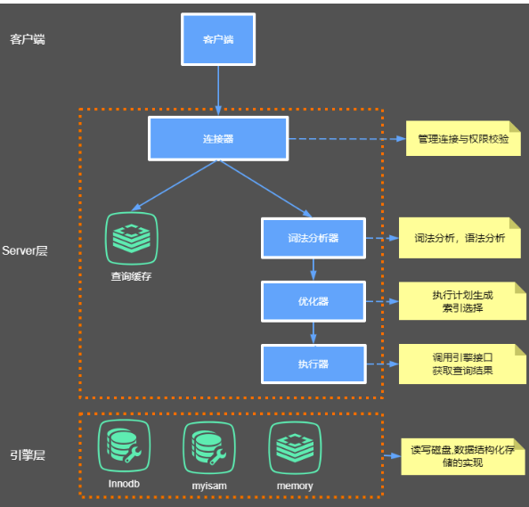
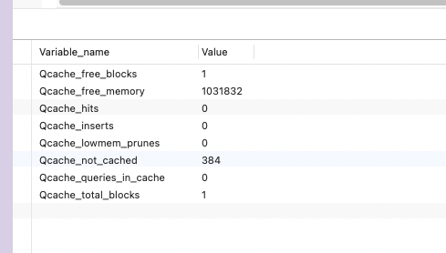
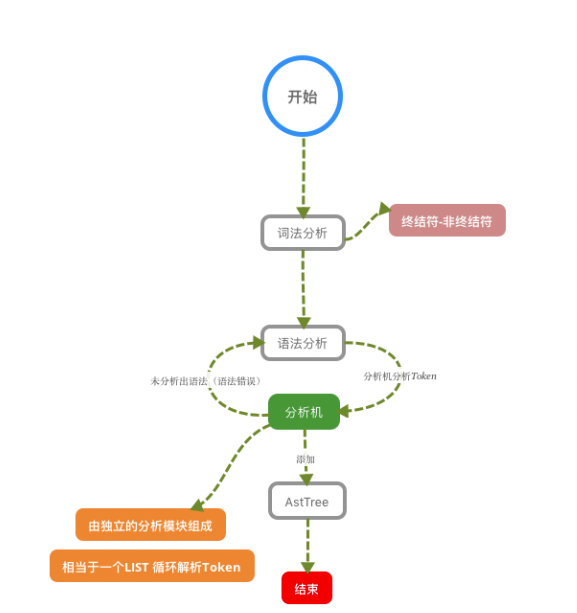
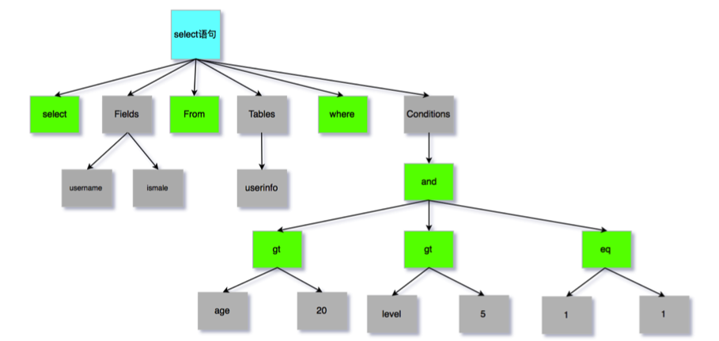

## SQL 内部组件结构



  MYSQL 可以 分为 客户端、server层、存储引擎层 三部分。
  
### 1. server 层 
    
    主要包括连接器、查询缓存(高版本的去除了这个)、分析器、优化器、执行器等，涵盖 MySQL 的大多数核心服务功能，以及所有的内置函数 (如日期、时间、数学和加密函数等)，
    所有跨存储引擎的功能都在这一层实现，比如存储过程、触发器、视图等。

### 2. store (存储引擎)层
    
    存储引擎层负责数据的存储和提取。其架构模式是插件式的，支持 InnoDB、MyISAM、Memory 等多个存储引擎。
    现在最常用的存储引擎是 InnoDB，它从 MySQL 5.5.5 版本开始成为了默认存储引擎。也就是说如果我们在create table时不指定 表的存储引擎类型,
    默认会给你设置存储引擎为InnoDB。

### 3. server 层各组件介绍 

#### 3.1 连接器

   mysql 是开源数据库，有很多的客户端：navicat、msql、front、jdbc、sqlyog 等等。这些客户端要向mysql 发起通信都必须跟server 端建立连接，
    建立连接就是由连接器来完成的。
    
  1. 先连接上数据库，接待的客户端连接的就是 连接器， 连接器复杂跟客户端建立连接、获取权限、维持和管理连接，
        连接命令: mysql ‐h host[数据库地址] ‐u root[用户] ‐p root[密码] ‐P 3306
    
    连接命令中的 mysql 是客户端工具，用来跟服务端建立连接。在完成经典的 TCP 握手后，连接器就要开始认证你的身份，
    这个时候用的就是你输入的用户名和密码。
        1、如果用户名或密码不对，你就会收到一个"Access denied for user"的错误，然后客户端程序结束执行。 
        2、如果用户名密码认证通过，连接器会到权限表里面查出你拥有的权限。之后，这个连接里面的权限判断逻辑，都将依赖于此时读到的权限。
        这就意味着，一个用户成功建立连接后，即使你用管理员账号对这个用户的权限做了修改，也不会影响已经存在连接的权 限。修改完成后，只有再新建的连接才会使用新的权限设置。用户的权限表在系统表空间的mysql的user表中。
    
  2. 修改 用户密码
```mysql
use mysql; --  1. 切换至mysql的数据库
select user,host from user; --  2. 查看 user 表 
GRANT ALL PRIVILEGES ON *.* TO 'user_test'@'%' IDENTIFIED BY  'User_test@123' WITH GRANT OPTION; -- 创建新用户 赋权限,%表示所有(host)
flush privileges; -- 刷新数据库
set password for 'user_test'@'%'=password('test@123'); -- (设置用户名密码) 
FLUSH PRIVILEGES;
show grants for root@'localhost';  -- 查看当前用户的权限 
```
    
  3. 连接完成
        
    连接完成后, 如果你没有后续的动作，这个连接就处于空闲状态，你可以在 show processlist 命令中看到它。文本中这个图是 show processlist 的结果，
    其中的 Command 列显示为“Sleep”的这一行，就表示现在系统里面有一个空闲连接。

  4.  连接交互时间

   客户端如果长时间不发送command到Server端，连接器就会自动将它断开。这个时间是由参数 wait_timeout 控制的，默认值 是 8 小时。
    
   查看wait_timeout
```mysql
show global variables like 'wait_timeout';
set global wait_timeout=28800;  -- 设置全局服务器关闭非交互连接之前等待活动的秒数 
```
    如果在连接被断开之后，客户端再次发送请求的话，就会收到一个错误提醒: Lost connection to MySQL server during query。
    这时候如果你要继续，就需要重连，然后再执行请求了。

   数据库里面，长连接是指连接成功后，如果客户端持续有请求，则一直使用同一个连接。短连接则是指每次执行完很少的几次 查询就断开连接，下次查询再重新建立一个。
    
   开发当中我们大多数时候用的都是长连接,把连接放在Pool内进行管理，但是长连接有些时候会导致 MySQL 占用内存涨得特别快，
   这是因为 MySQL 在执行过程中临时使用的内存是管理在连接对象里面的。这些资源会在连接断开的时候才释放。所以如 果长连接累积下来，
   可能导致内存占用太大，被系统强行杀掉(OOM)，从现象看就是 MySQL 异常重启了。
    
    怎么解决这类问题呢?
        
        1、定期断开长连接。使用一段时间，或者程序里面判断执行过一个占用内存的大查询后，断开连接，之后要查询再重连。 
        2、如果你用的是 MySQL 5.7 或更新版本，可以在每次执行一个比较大的操作后，通过执行 mysql_reset_connection 来重新初始化连接资 源。
        这个过程不需要重连和重新做权限验证，但是会将连接恢复到刚刚创建完时的状态。

#### 3.2 查询缓存 （mysql8.0已经移除了查询缓存功能）
    
```mysql
show databases; -- 显示所有数据库
use dbname; -- 打开数据库:
show tables; -- 显示数据库mysql中所有的表;
describe user; -- 显示表mysql数据库中user表的列信息);
```

    连接建立完成后，你就可以执行 select 语句了。执行逻辑就会来到第二步:查询缓存。
    MySQL 拿到一个查询请求后，会先到查询缓存看看，之前是不是执行过这条语句。之前执行过的语句及其结果可能会以 key-value 对的形式，被直接缓存在内存中。key 是查询的语句，value 是查询的结果。如果你的查询能够直接在这个缓存中找 到 key，那么这个 value 就会被直接返回给客户端。
    如果语句不在查询缓存中，就会继续后面的执行阶段。执行完成后，执行结果会被存入查询缓存中。你可以看到，如果查 询命中缓存，MySQL 不需要执行后面的复杂操作，就可以直接返回结果，这个效率会很高。

    大多数情况查询缓存就是个鸡肋，为什么呢?
    因为查询缓存往往弊大于利。查询缓存的失效非常频繁，只要有对一个表的更新，这个表上所有的查询缓存都会被清空。
    因此很可能你费劲地把结果存起来，还没使用呢，就被一个更新全清空了。对于更新压力大的数据库来说，查询缓存的命中率会非常低。
    一般建议大家在静态表里使用查询缓存，什么叫静态表呢?就是一般我们极少更新的表。比如，一个系统配置表、字典 表，那这张表上的查询才适合使用查询缓存。好在 MySQL 也提供了这种“按需使用”的方式。你可以将my.cnf参数 query_cache_type 设置成 DEMAND。

```my.cnf
#query_cache_type 有3个值 0代表关闭查询缓存OFF，1代表开启ON，2(DEMAND)代表当sql语句中有SQL_CACHE关键词时才缓存
query_cache_type=2
```

    这样对于默认的 SQL 语句都不使用查询缓存。而对于你确定要使用查询缓存的语句，可以用 SQL_CACHE 显式指定，像下 面这个语句一样:

```mysql
select SQL_CACHE * from test where ID=5;
```

    查看当前mysql实例是否开启缓存机制

```mysql
show global variables like '%query_cache_type%';
```

    监控查询缓存的命中率:

```mysql
show status like '%Qcache%';
```



    1. Qcache_free_blocks:表示查询缓存中目前还有多少剩余的blocks，如果该值显示较大，则说明查询缓存中的内存碎片 过多了，可能在一定的时间进行整理。
    2. Qcache_free_memory:查询缓存的内存大小，通过这个参数可以很清晰的知道当前系统的查询内存是否够用，是多 了，还是不够用，DBA可以根据实际情况做出调整。
    3. Qcache_hits:表示有多少次命中缓存。我们主要可以通过该值来验证我们的查询缓存的效果。数字越大，缓存效果越 理想。
    4. Qcache_inserts: 表示多少次未命中然后插入，意思是新来的SQL请求在缓存中未找到，不得不执行查询处理，执行 查询处理后把结果insert到查询缓存中。这样的情况的次数，次数越多，表示查询缓存应用到的比较少，效果也就不理 想。当然系统刚启动后，查询缓存是空的，这很正常。
    5. Qcache_lowmem_prunes:该参数记录有多少条查询因为内存不足而被移除出查询缓存。通过这个值，用户可以适当的 调整缓存大小。
    6. Qcache_not_cached: 表示因为query_cache_type的设置而没有被缓存的查询数量。 Qcache_queries_in_cache:当前缓存中缓存的查询数量。 Qcache_total_blocks:当前缓存的block数量。


#### 3.3 分析器
    
    如果没有命中查询缓存，就要开始真正执行语句了。首先，MySQL 需要知道你要做什么，因此需要对 SQL 语句做解析。 分析器先会做“词法分析”。你输入的是由多个字符串和空格组成的一条 SQL 语句，MySQL 需要识别出里面的字符串分别是 什么，代表什么。
    MySQL 从你输入的"select"这个关键字识别出来，这是一个查询语句。它也要把字符串“T”识别成“表名 T”，把字符 串“ID”识别成“列 ID”。 做完了这些识别以后，就要做“语法分析”。根据词法分析的结果，语法分析器会根据语法规则，判断你输入的这个 SQL 语句 是否满足 MySQL 语法。
    如果你的语句不对，就会收到“You have an error in your SQL syntax”的错误提醒。

##### 3.3.1 词法分析器原理
    
    词法分析器分成6个主要步骤完成对sql语句的分析
        1、词法分析 
        2、语法分析 
        3、语义分析 
        4、构造执行树 
        5、生成执行计划
        6、计划的执行

   下图是SQL词法分析的过程步骤:



    SQL语句的分析分为词法分析与语法分析，mysql的词法分析由MySQLLex[MySQL自己实现的]完成，语法分析由Bison生 成。
    关于语法树大家如果想要深入研究可以参考这篇wiki文章:https://en.wikipedia.org/wiki/LR_parser。那么除了Bison 外，
    Java当中也有开源的词法结构分析工具例如Antlr4，ANTLR从语法生成一个解析器，可以构建和遍历解析树，
    可以在IDEA 工具当中安装插件:antlr v4 grammar plugin。
    
   经过bison语法分析之后，会生成一个这样的语法树



#### 3.4 优化器

经过了分析器，MySQL 就知道你要做什么了。在开始执行之前，还要先经过优化器的处理。
优化器是在表里面有多个索引的时候，决定使用哪个索引;或者在一个语句有多表关联(join)的时候，决定各个表的连接 顺序。比如你执行下面这样的语句，这个语句是执行两个表的 join:

```mysql
select * from test1 join test2 using(ID) where test1.name=yangguo and test2.name=xiaolongnv; 
```

    既可以先从表 test1 里面取出 name=yangguo的记录的 ID 值，再根据 ID 值关联到表 test2，再判断 test2 里面 name的 值是否等于 yangguo。
    也可以先从表 test2 里面取出 name=xiaolongnv 的记录的 ID 值，再根据 ID 值关联到 test1，再判断 test1 里面 name 的值是否等于 yangguo。 

    这两种执行方法的逻辑结果是一样的，但是执行的效率会有不同，而优化器的作用就是决定选择使用哪一个方案。优化器阶段 完成后，这个语句的执行方案就确定下来了，然后进入执行器阶段。

#### 3.5 执行器 

   开始执行的时候，要先判断一下你对这个表 T 有没有执行查询的权限，如果没有，就会返回没有权限的错误，
   
   如下所示 (在 工程实现上，如果命中查询缓存，会在查询缓存返回结果的时候，做权限验证。查询也会在优化器之前调用 precheck 验证权 限)。
   
```mysql
select * from test where id=1;
```

    如果有权限，就打开表继续执行。打开表的时候，执行器就会根据表的引擎定义，去使用这个引擎提供的接口。 
    比如我们这个例子中的表 test 中，ID 字段没有索引，那么执行器的执行流程是这样的:
        1. 调用 InnoDB 引擎接口取这个表的第一行，判断 ID 值是不是 10，如果不是则跳过，如果是则将这行存在结果集中; 
        2. 调用引擎接口取“下一行”，重复相同的判断逻辑，直到取到这个表的最后一行。
        3. 执行器将上述遍历过程中所有满足条件的行组成的记录集作为结果集返回给客户端。

至此，这个语句就执行完成了。对于有索引的表，执行的逻辑也差不多。第一次调用的是“取满足条件的第一行”这个接 口，之后循环取“满足条件的下一行”这个接口，
这些接口都是引擎中已经定义好的。你会在数据库的慢查询日志中看到一个 rows_examined 的字段，表示这个语句执行过程中扫描了多少行。
这个值就是在执行器每次调用引擎获取数据行的时候累加 的。在有些场景下，执行器调用一次，在引擎内部则扫描了多行，
因此引擎扫描行数跟 rows_examined 并不是完全相同的。

