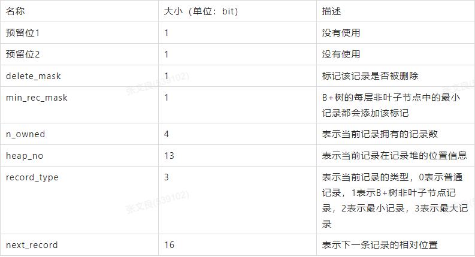

### InnoDb行格式、数据页结构以及索引底层原理分析

#### 局部性原理
   
   在InnoDB中，数据会存储到磁盘上，在真正处理数据时需要先将数据加载到内存，表中读取某些记录时，InnoDB存储引擎不需要一条一条的把记录从磁盘上读出来，InnoDB采取的方式是：将数据划分为若干个页，以页作为磁盘和内存之间交互的基本单位，InnoDB中页的大小一般为 16 KB，也就是说，当需要从磁盘中读数据时每一次最少将从磁盘中读取16KB的内容到内存中，每一次最少也会把内存中的16KB内容写到磁盘中。
   
#### InnoDB数据页结构
   
   页是InnoDB管理存储空间的基本单位，一个页的大小默认是16KB。
   
   SHOW GLOBAL STATUS like 'Innodb_page_size';
   
   页结构：
   
   
   
   
   
#### InnoDB行格式
   
   一行记录可以以不同的格式存在InnoDB中，行格式分别是Compact、Redundant、Dynamic和Compressed行格式。
   
   我们可以在创建或修改表的语句中指定行格式：
   
```
CREATE TABLE 表名 (列的信息) ROW_FORMAT=行格式名称
ALTER TABLE 表名 ROW_FORMAT=行格式名称
```

##### COMPACT行格式
   
   
   
   **记录的额外信息**
   
   这部分信息是服务器为了描述这条记录而不得不额外添加的一些信息，这些额外信息分为3类，分别是：
   
    • 变长字段长度列表
   
    • NULL值列表
   
    • 记录头信息

  **变长字段长度列表**
  
  MySQL支持一些变长的数据类型，比如VARCHAR(M)、VARBINARY(M)、TEXT类型，BLOB类型，这些数据类型修饰列称为变长字段，变长字段中存储多少字节的数据不是固定的，所以我们在存储真实数据的时候需要顺便把这些数据占用的字节数也存起来。在Compact行格式中，把所有变长字段的真实数据占用的字节长度都存放在记录的开头部位，从而形成一个变长字段长度列表。
  
    CHAR是一种固定长度的类型，VARCHAR则是一种可变长度的类型。
    VARCHAR(M)，M代表最大能存多少个字符。( MySQL5.0.3以前是字节，以后就是字符)
  
  **NULL值列表**
  
  Compact行格式会把可以为NULL的列统一管理起来，存一个标记为在NULL值列表中，如果表中没有允许存储 NULL 的列，则 NULL值列表也不存在了。
  
    二进制位的值为1时，代表该列的值为NULL。
    二进制位的值为0时，代表该列的值不为NULL。
  
  **记录头信息**
  
  除了变长字段长度列表、NULL值列表之外，还有一个用于描述记录的记录头信息，它是由固定的5个字节组成。5个字节也就是40个二进制位，不同的位代表不同的意思，如图：
  
  
  
  **记录的真实数据**
  
  记录的真实数据除了我们自己定义的列的数据以外，还会有三个隐藏列：
  
  
  
    实际上这几个列的真正名称其实是：DB_ROW_ID、DB_TRX_ID、DB_ROLL_PTR。
    一个表没有手动定义主键，则会选取一个Unique键作为主键，如果连Unique键都没有定义的话，则会为表默认添加一个名为row_id的隐藏列作为主键。所以row_id是在没有自定义主键以及Unique键的情况下才会存在的。
    
  **行溢出数据**
  
  VARCHAR(M)类型的列最多可以占用65535个字节。其中的M代表该类型最多存储的字符数量，如果我们使用ascii字符集的话，一个字符就代表一个字节，我们看看VARCHAR(65535)是否可用：
```
mysql> CREATE TABLE varchar_size_demo(
    ->     c VARCHAR(65535)
    -> ) CHARSET=ascii ROW_FORMAT=Compact;
ERROR 1118 (42000): Row size too large. The maximum row size for the used table type, not counting BLOBs, is 65535. This includes storage overhead, check the manual. You have to change some columns to TEXT or BLOBs
mysql>
```

   报错信息表达的意思是：MySQL对一条记录占用的最大存储空间是有限制的，除BLOB或者TEXT类型的列之外，其他所有的列（不包括隐藏列和记录头信息）占用的字节长度加起来不能超过65535个字节。这个65535个字节除了列本身的数据之外，还包括一些其他的数据，比如说我们为了存储一个VARCHAR(M)类型的列，其实需要占用3部分存储空间：
    
    1. 真实数据
    2. 变长字段真实数据的长度
    3. NULL值标识
  
   如果该VARCHAR类型的列没有NOT NULL属性，那最多只能存储65532个字节的数据，因为变长字段的长度占用2个字节，NULL值标识需要占用1个字节。
   
```
mysql> CREATE TABLE varchar_size_demo(
    ->      c VARCHAR(65532)
    -> ) CHARSET=ascii ROW_FORMAT=Compact;
Query OK, 0 rows affected (0.02 sec)
```

```
CREATE TABLE varchar_size_demo(
    c VARCHAR(65533) not null
) CHARSET=ascii ROW_FORMAT=Compact;
Query OK, 0 rows affected (0.02 sec)
```

  **记录中的数据太多产生的溢出**
  
  一个页的大小一般是16KB，也就是16384字节，而一个VARCHAR(M)类型的列就最多可以存储65533个字节，这样就可能出现一个页存放不了一条记录。
  
  在Compact和Reduntant行格式中，对于占用存储空间非常大的列，在记录的真实数据处只会存储该列的一部分数据，把剩余的数据分散存储在几个其他的页中，然后记录的真实数据处用20个字节存储指向这些页的地址（当然这20个字节中还包括这些分散在其他页面中的数据的占用的字节数），从而可以找到剩余数据所在的页。

##### Dynamic和Compressed行格式
   
   这两种行格式类似于COMPACT行格式，只不过在处理行溢出数据时有点儿分歧，它们不会在记录的真实数据处存储一部分数据，而是把所有的数据都存储到其他页面中，只在记录的真实数据处存储其他页面的地址。另外，Compressed行格式会采用压缩算法对页面进行压缩。
   
#### 索引
   
##### 聚簇索引
   
   聚簇索引的特点：
   
   1. 按主键值的大小进行记录和页的排序：
   
    • 数据页(叶子节点)里的记录是按照主键值从小到大排序的一个单向链表。
    • 数据页(叶子节点)之间也是是按照主键值从小到大排序的一个双向链表。
    • B+树中同一个层的页目录也是按照主键值从小到大排序的一个双向链表。
   
   2. B+树的叶子节点存储的是完整的用户记录，就是指这个记录中存储了所有列的值（包括隐藏列）。
   
   具有这两种特性的B+树称为聚簇索引，所有完整的用户记录都存放在这个聚簇索引的叶子节点处。这种聚簇索引并不需要我们在MySQL语句中显式的使用INDEX语句去创建。InnoDB存储引擎会自动的为我们创建聚簇索引。在InnoDB存储引擎中，聚簇索引就是数据的存储方式（所有的用户记录都存储在了叶子节点），也就是所谓的索引即数据，数据即索引。
   
##### 二级索引（复制索引）
   
   聚簇索引只能在搜索条件是主键值时才能发挥作用，因为B+树中的数据都是按照主键进行排序的。当我们想以别的列作为搜索条件时我们可以多建几棵B+树，不同的B+树中的数据采用不同的排序规则。
   
   二级索引与聚簇索引有几处不同：
   
   1.按指定的索引列的值来进行排序
   
   2.叶子节点存储的不是完整的用户记录，而只是索引列+主键。
   
   3.目录项记录中不是主键+页号，变成了索引列+页号。
   
   4.在对二级索引进行查找数据时，需要根据主键值去聚簇索引中再查找一遍完整的用户记录，这个过程叫做回表
   
##### 联合索引
   
   以多个列的大小为排序规则建立的B+树称为联合索引，本质上也是一个二级索引。

##### 目录项记录的唯一性
   
   我们需要保证在B+树的同一层内节点的目录项记录除页号这个字段以外是唯一的。所以对于二级索引的内节点的目录项记录的内容实际上是由三个部分构成的：

    索引列的值
    主键值
    页号

##### B+树索引总结
   
   1. 每个索引都对应一棵B+树。用户记录都存储在B+树的叶子节点，所有目录记录都存储在非叶子节点。
   
   2. InnoDB存储引擎会自动为主键（如果没有它会自动帮我们添加）建立聚簇索引，聚簇索引的叶子节点包含完整的用户记录。
   
   3. 可以为指定的列建立二级索引，二级索引的叶子节点包含的用户记录由索引列 + 主键组成，所以如果想通过二级索引来查找完整的用户记录的话，需要通过回表操作，也就是在通过二级索引找到主键值之后再到聚簇索引中查找完整的用户记录。
   
   4. B+树中每层节点都是按照索引列值从小到大的顺序排序而组成了双向链表，而且每个页内的记录（不论是用户记录还是目录项记录）都是按照索引列的值从小到大的顺序而形成了一个单链表。如果是联合索引的话，则页面和记录先按照联合索引前边的列排序，如果该列值相同，再按照联合索引后边的列排序。
   
   5. 通过索引查找记录是从B+树的根节点开始，一层一层向下搜索。由于每个页面都按照索引列的值建立了页目录，所以在这些页面中的查找非常快。
   
#####
   
   事务是什么？
   
   事务隔离级别是什么？有哪些隔离级别？每种隔离级别分别会出现什么现象？
   
   锁是什么，mysql中有哪些锁，有什么用？