### 索引的优势和劣势

  优势：
    
    可以提⾼数据检索的效率，降低数据库的IO成本，类似于书的⽬录。 -- 检索
    通过索引列对数据进⾏排序，降低数据排序的成本，降低了CPU的消耗。 --排序
        被索引的列会⾃动进⾏排序，包括【单列索引】和【组合索引】，只是组合索引的排序要复
        杂⼀些。
        如果按照索引列的顺序进⾏排序，对应order by语句来说，效率就会提⾼很多。
        where 索引列 在存储引擎层 处理
        覆盖索引，不需要回表查询
  劣势:
    
     索引会占据磁盘空间
     索引虽然会提⾼查询效率，但是会降低更新表的效率。⽐如每次对表进⾏增删改操作，MySQL不
     仅要保存数据，还有保存或者更新对应的索引⽂件。

### 索引的分类

#### 单列索引
   
   普通索引：MySQL中基本索引类型，没有什么限制，允许在定义索引的列中插⼊重复值和空值，
   纯粹为了查询数据更快⼀点。 add index
   
   唯⼀索引：索引列中的值必须是唯⼀的，但是允许为空值. add unique index
   
   主键索引：是⼀种特殊的唯⼀索引，不允许有空值。 pk

#### 组合索引
   
   在表中的多个字段组合上创建的索引 add index(col1,col2..)
   
   组合索引的使⽤，需要遵循最左前缀原则（最左匹配原则，后⾯⾼级篇讲解）。
   
   ⼀般情况下，建议使⽤组合索引代替单列索引（主键索引除外，具体原因后⾯知识点讲解）。

#### 全⽂索引
   
   只有在MyISAM引擎、InnoDB（5.6以后）上才能使⽤，⽽且只能在CHAR,VARCHAR,TEXT类型字段上
   使⽤全⽂索引。 fulltext
   
   优先级最⾼ 先执⾏ 不会执⾏其他索引
   
   存储引擎 决定执⾏⼀个索引
   
#### 空间索引
   
### 索引的使用

#### 创建索引

  索引的创建可以在 CREATE TABLE 语句中进行，也可以单独用 CREATE INDEX 或 ALTER TABLE 来给表增加索引。
   
   1.单列索引之普通索引
   
```
CREATE INDEX index_name ON table(column(length)) ;
ALTER TABLE table_name ADD INDEX index_name (column(length)) ;
```
   
   2.单列索引之唯⼀索引
   
```
1. CREATE UNIQUE INDEX index_name ON table(column(length)) ;

2. alter table table_name add unique index index_name(column);
```
   
   3.单列索引之全⽂索引

```
CREATE FULLTEXT INDEX index_name ON table(column(length)) ;
alter table table_name add fulltext index_name(column)
```
   
   4.组合索引

```
ALTER TABLE table_name ADD INDEX index_title_time (title(50),time(10)) ;
```
   
#### 删除索引
   
   1.DROP INDEX index_name ON table_name
   
   2.alter table table_name drop index index_name;
   
   3.alter table table_name drop primary key ;
   
#### 查看索引
   
   SHOW INDEX FROM table_name
   
### 索引原理分析
   
#### 索引的存储结构

##### 索引存储结构
   
   索引是在存储引擎中实现的，也就是说不同的存储引擎，会使⽤不同的索引
   
   MyISAM和InnoDB存储引擎：只⽀持B+ TREE索引， 也就是说默认使⽤B+ TREE，不能够更换
   
   MEMORY/HEAP存储引擎：⽀持HASH和BTREE索引
   
   *B树和B+树的区别*
   
   B树和B+树的最⼤区别在于⾮叶⼦节点是否存储数据的问题。
   
     - B树是⾮叶⼦节点和叶⼦节点都会存储数据。
     - B+树只有叶⼦节点才会存储数据，⽽且存储的数据都是在⼀⾏上，⽽且这些数据都是有指针指向的，也
     就是有顺序的。 索引列 order by
     
##### ⾮聚集索引（MyISAM）
   
   B+树叶⼦节点只会存储数据⾏（数据⽂件）的指针，简单来说*数据和索引不在⼀起*，就是⾮聚集
   索引。
   
   ⾮聚集索引包含主键索引和辅助索引都会存储指针的值
   
   *主键索引*
   
   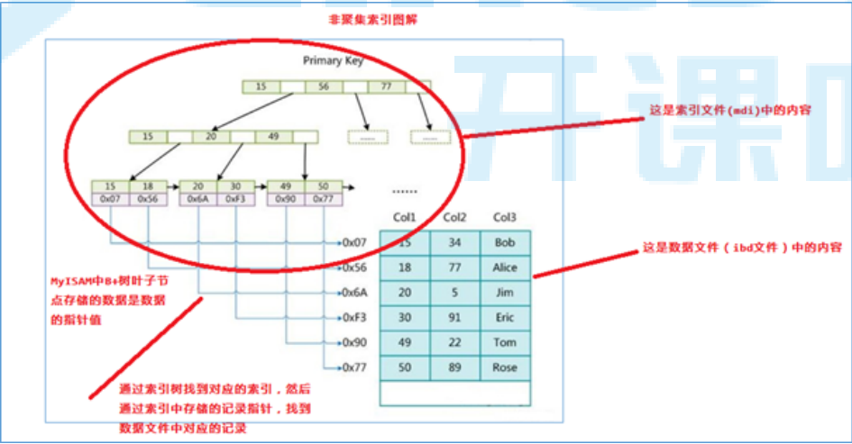
   
   *辅助索引（次要索引）*
      
   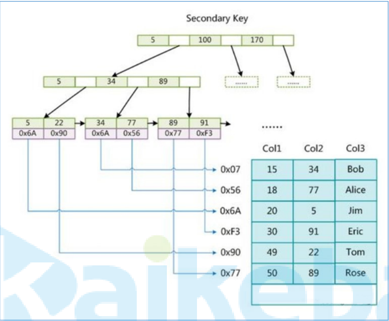
      
      在 MyISAM 中,主索引和辅助索引(Secondary key)在结构上没有任何区别,只是主索引要求 key 是唯⼀的,
      ⽽辅助索引的 key 可以重复。如果我们在 Col2 上建⽴⼀个辅助索引,则此索引的结构如下图所示
      
   
##### 聚集索引（InnoDB）
   
   主键索引（聚集索引）的叶⼦节点会存储数据⾏，也就是说*数据和索引是在⼀起*，这就是聚集索
   引。
   
   辅助索引只会存储主键值
   
   如果没有没有主键，则使⽤唯⼀索引建⽴聚集索引；如果没有唯⼀索引，MySQL会按照⼀定规则
   创建聚集索引。
   
   *主键索引*
       
       1.InnoDB 要求表必须有主键(MyISAM 可以没有),如果没有显式指定,则 MySQL系统会⾃动选择⼀个可以
       唯⼀标识数据记录的列作为主键,如果不存在这种列,则MySQL ⾃动为 InnoDB 表⽣成⼀个隐含字段作为
       主键,类型为⻓整形。
       
   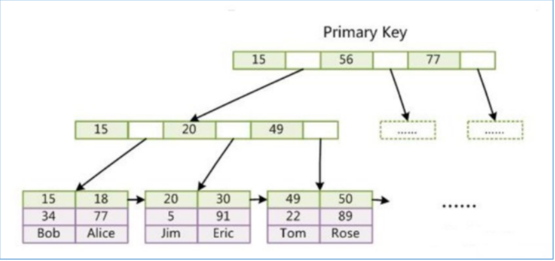
   
        上图是 InnoDB 主索引(同时也是数据⽂件)的示意图,可以看到叶节点包含了完整的数据记录。这种索引
        叫做聚集索引。因为 InnoDB 的数据⽂件本身要按主键聚集,
   
   *辅助索引（次要索引）*
   
    2.第⼆个与 MyISAM 索引的不同是 InnoDB 的辅助索引 data 域存储相应记录主键的值⽽不是地址。换
    句话说,InnoDB 的所有辅助索引都引⽤主键作为 data 域。
   
   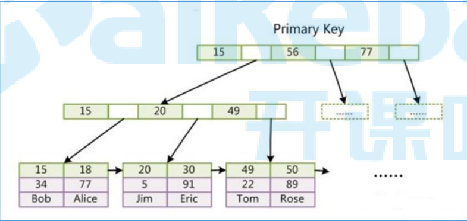
   
    聚集索引这种实现⽅式使得按主键的搜索⼗分⾼效,但是辅助索引搜索需要检索两遍索引:⾸先检索辅助
    索引获得主键,然后⽤主键到主索引中检索获得记录。
    select * from user where name='Alice' 回表查询 检索两次 ⾮主键索引 --- pk---索引--->数据
    select id,name from user where name='Alice' 不需要回表 在辅助索引树上就可以查询到了 覆盖索引
    (多⽤组合索引)
    
   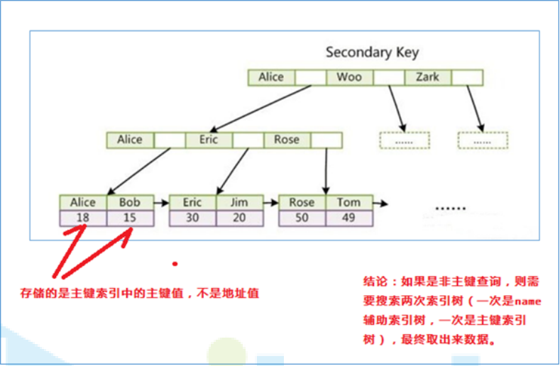
   
    引申:为什么不建议使⽤过⻓的字段作为主键?
    因为所有辅助索引都引⽤主索引,过⻓的主索引会令辅助索引变得过⼤。
    同时,请尽量在 InnoDB 上采⽤⾃增字段做表的主键。
    
    
##### MyISAM 和 InnoDB的存储结构图示
   
   为了更形象说明这两种索引的区别, 我们假想⼀个表如下图存储了 4 ⾏数据。 其中Id 作为主索引,
   Name 作为辅助索引。 图示清晰的显示了聚簇索引和⾮聚簇索引的差异：
    
   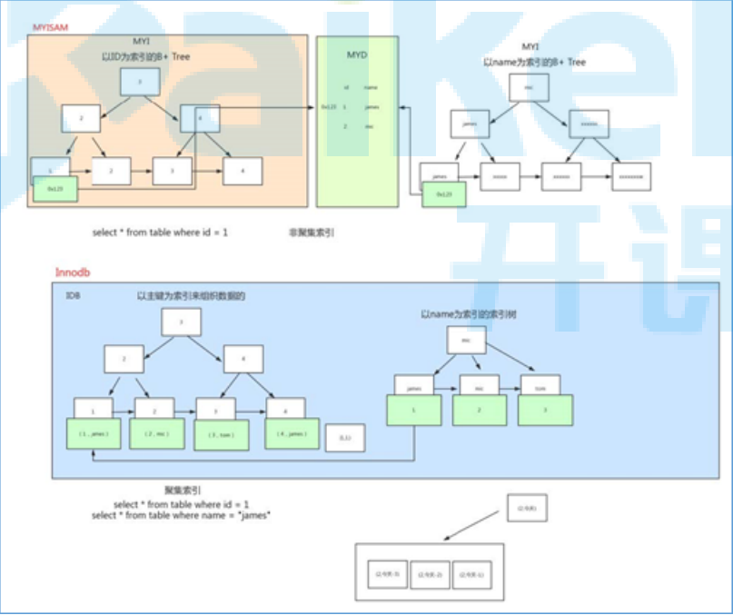

### Mysql组合索引、索引失效分析、表级锁介绍

#### 哪些情况需要创建索引
   
   1. 主键⾃动建⽴唯⼀索引
   
   2. 频繁作为查询条件的字段应该创建索引
   
   3. 多表关联查询中，关联字段应该创建索引 on 两边都要创建索引
   
   4. 查询中排序的字段，应该创建索引
   
   5. 频繁查找字段 覆盖索引
   
   6. 查询中统计或者分组字段，应该创建索引 group by
   
#### 哪些情况不需要创建索引
   
   1. 表记录太少
   
   2. 经常进⾏增删改操作的表
   
   3. 频繁更新的字段
   
   4. where条件⾥使⽤频率不⾼的字段

#### 为什么使⽤组合索引
   
   mysql创建组合索引的规则是⾸先会对组合索引的最左边的，也就是第⼀个name字段的数据进⾏排
   序，在第⼀个字段的排序基础上，然后再对后⾯第⼆个的cid字段进⾏排序。其实就相当于实现了类似
   order by name cid这样⼀种排序规则。
   
   *为了节省mysql索引存储空间以及提升搜索性能，可建⽴组合索引（能使⽤组合索引就不使⽤单列索引）*
   
   *例如：*
    
    创建组合索引（相当于建⽴了col1,col1 col2,col1 col2 col3三个索引）：
    
```
ALTER TABLE 'table_name' ADD INDEX index_name('col1','col2','col3'）
```
  
  ⼀颗索引树上创建3个索引 ： 省空间
  
  三颗索引树上分别创建1个索引
  
  更容易实现覆盖索引
  
  使⽤ 遵循最左前缀原则
  
        1、前缀索引 like a%
        2、从左向右匹配直到遇到范围查询 > < between like
  
  建⽴组合索引 (a,b,c,d)
  
    where a=1 and b=1 and c>3 and d=1
  
  到c>3停⽌了 所以d ⽤不到索引了
  
  怎么办？
    
    （a,b,d,c） 
  
  *案例:*
   
```
mysql> create table t1 (id int primary key ,a int ,b int,c int,d int);
mysql> alter table t1 add index idx_com(a,b,c,d);
mysql> drop index idx_com on t1;
mysql> create index idx_com on t1(a,b,d,c);
```

#### 索引失效
   
##### 查看执⾏计划    
   
   MySQL 提供了⼀个 EXPLAIN 命令, 它可以对 SELECT 语句的执⾏计划进⾏分析, 并输出 SELECT 执⾏的
   详细信息, 以供开发⼈员针对性优化.
  
   使⽤explain这个命令来查看⼀个这些SQL语句的执⾏计划，查看该SQL语句有没有使⽤上了索引，有没
   有做全表扫描，这都可以通过explain命令来查看。
   
   可以通过explain命令深⼊了解MySQL的基于开销的优化器，还可以获得很多可能被优化器考虑到的访
   问策略的细节，以及当运⾏SQL语句时哪种策略预计会被优化器采⽤。
   
   EXPLAIN 命令⽤法⼗分简单, 在 SELECT 语句前加上 explain 就可以了, 例如:
  
  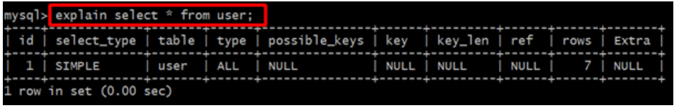
  
  *参数说明*
   
   expain出来的信息有10列，分别是
   
```
id、select_type、table、type、possible_keys、key、key_len、ref、rows、Extra
```

```
-- 用户户表
create table tuser(
id int primary key,
loginname varchar(100), 
name varchar(100),
age int,
sex char(1),
dep int, 
address varchar(100)
);

-- 部门表
create table tdep(
id int primary key,
name varchar(100)
);
-- 地址表
create table taddr(
id int primary key,
addr varchar(100)
);

--  创建普通索引

alter table tuser add INDEX idx_dep(dep);

-- 创建唯一索引
alter table tuser add UNIQUE index idx_loginname(loginname)

-- 创建组合索引
alter table tuser add index idx_name_age_sex(name,age,sex) 

--  创建全文索引
alter table taddr  add fulltext ft_addr(addr)
```
  
###### id
   
   每个 SELECT语句都会⾃动分配的⼀个唯⼀标识符.
   
   表示查询中操作表的顺序，有三种情况：
    
    id相同：执⾏顺序由上到下
    id不同：如果是⼦查询，id号会⾃增，id越⼤，优先级越⾼。
    id相同的不同的同时存在
   
   id列为null的就表示这是⼀个结果集，不需要使⽤它来进⾏查询。
   
###### select_type（重要）
   
   查询类型，主要⽤于区别普通查询、联合查询(union、union all)、⼦查询等复杂查询。
   
   *simple*
   
    表示不需要union操作或者不包含⼦查询的简单select查询。有连接查询时，外层的查询为simple，且
    只有⼀个
    
    explain select * from tuser;
   
   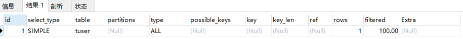
   
   *primary*
   
    ⼀个需要union操作或者含有⼦查询的select，位于最外层的单位查询的select_type即为primary。且只
    有⼀个
   
    explain select (select name from tuser) from tuser ;
   
   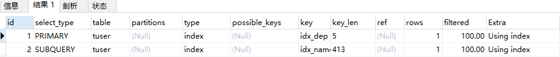 
   
   *subquery*
   
     除了from字句中包含的⼦查询外，其他地⽅出现的⼦查询都可能是subquery
   
    explain select * from tuser where id = (select max(id) from tuser);
    
   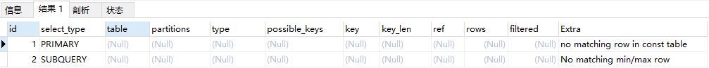
   
   *dependent subquery*
   
    与dependent union类似，表示这个subquery的查询要受到外部表查询的影响
   
     explain select id,name,(select name from tdep a where a.id=b.dep) from tuser b;
   
   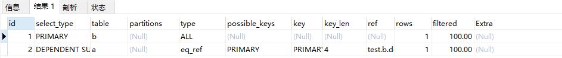

###### table
   
   显示的查询表名，如果查询使⽤了别名，那么这⾥显示的是别名
   
   如果不涉及对数据表的操作，那么这显示为null
   
   如果显示为尖括号括起来的就表示这个是临时表，后边的N就是执⾏计划中的id，表示结果来⾃于
   这个查询产⽣。
   
   如果是尖括号括起来的<union M,N>，与类似，也是⼀个临时表，表示这个结果来⾃于union查询
   的id为M,N的结果集。
   
###### type（重要）
   
   依次从好到差：
   
```
system，const，eq_ref，ref，fulltext，ref_or_null，unique_subquery，
index_subquery，range，index_merge，index，ALL
```
   
   *除了all之外，其他的type都可以使⽤到索引，除了index_merge之外，其他的type只可以⽤到⼀个索
   引*
   
   *最少要索引使⽤到range级别*
   
   *const（重要）*
    
    使⽤唯⼀索引或者主键，返回记录⼀定是1⾏记录的等值where条件时，通常type是const。其他数据库
    也叫做唯⼀索引扫描
    
     explain select * from tuser where id=1;
     
  *eq_ref（重要）*
  
      关键字:连接字段主键或者唯⼀性索引。
      
      此类型通常出现在多表的 join 查询, 表示对于前表的每⼀个结果, 都只能匹配到后表的⼀⾏结果. 并且查
      询的⽐较操作通常是 '=', 查询效率较⾼
   
###### possible_keys
   
   此次查询中可能选⽤的索引，⼀个或多个
   
###### key
   
   查询真正使⽤到的索引，select_type为index_merge时，这⾥可能出现两个以上的索引，其他的
   select_type这⾥只会出现⼀个。
   
###### key_len
   
   ⽤于处理查询的索引⻓度，如果是单列索引，那就整个索引⻓度算进去，如果是多列索引，那么查
   询不⼀定都能使⽤到所有的列，具体使⽤到了多少个列的索引，这⾥就会计算进去，没有使⽤到的
   列，这⾥不会计算进去。
   
   留意下这个列的值，算⼀下你的多列索引总⻓度就知道有没有使⽤到所有的列了。
   
   另外，key_len只计算where条件⽤到的索引⻓度，⽽排序和分组就算⽤到了索引，也不会计算到
   key_len中。
   
###### ref
   
   如果是使⽤的常数等值查询，这⾥会显示const
   
   如果是连接查询，被驱动表的执⾏计划这⾥会显示驱动表的关联字段
   
   如果是条件使⽤了表达式或者函数，或者条件列发⽣了内部隐式转换，这⾥可能显示为func
   
###### rows
   
   这⾥是执⾏计划中估算的扫描⾏数，不是精确值（InnoDB不是精确的值，MyISAM是精确的值，主要原
   因是InnoDB⾥⾯使⽤了MVCC并发机制）
   
###### extra（重要）
   
   这个列包含不适合在其他列中显示单⼗分重要的额外的信息，这个列可以显示的信息⾮常多，有⼏⼗
   种，常⽤的有

###### 参考网站

   https://segmentfault.com/a/1190000008131735
   
   https://blog.csdn.net/rewiner120/article/details/70598797
   
   
   