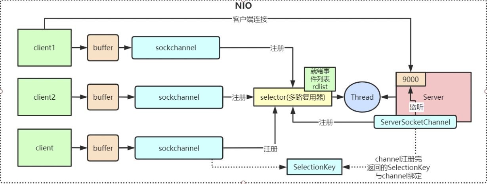
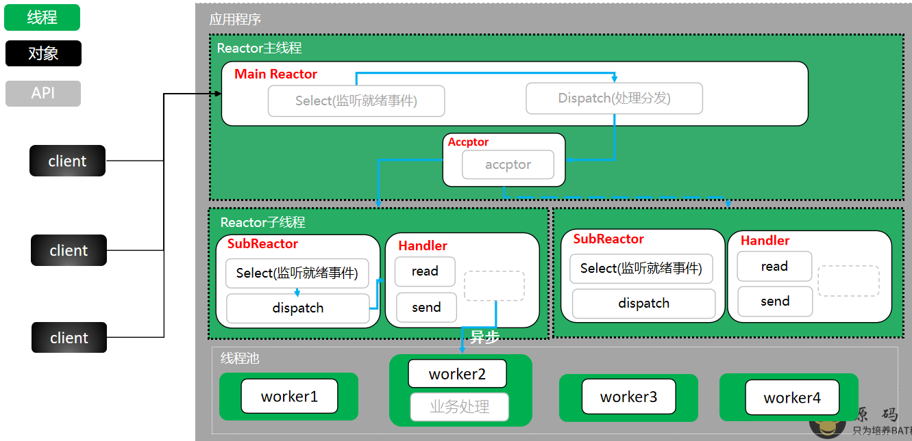

### 1. JAVA BIO\NIO\AIO 

   IO模型就是说用什么样的通道进行数据的发送和接收，Java共支持3种网络编程IO模式：BIO，NIO，AIO

#### 1.1 BIO 阻塞IO (Blocking IO)

   同步阻塞模型，一个客户端连接对应一个处理线程


  对应linux io模型的阻塞IO

##### 1.1.1 重要组件

   ServerSocket：负责绑定IP地址，启动监听端

   Socket：负责发起连接操作。连接成功后，双方通过输入和输出流进行同步阻塞式通信。

   ServerSocket两个阻塞点accept、read

   服务端：ServerSocket 、InputStream 、OutpurtStream

   客户端：Socket 、InputStream 、OutpurtStream

   一对一应答模型，如果一个客户端没有断开，当前线程会阻塞在读操作,为了解决该问题可以引入多线程，实现伪异步IO，但是因为处理线程和客户端是1:1的关系，
   随着客户端请求增大，线程数随着上升，会极大的消耗cpu资源，引起服务器异常。为了保障服务器资源可以实现线程池，如果发生读取数据较慢时，大量并发的情况下，
   其他接入的客户都安，只能一直等待。所以BIO的特点是缺乏弹性伸缩能力。

BIO常用于客户端开发和连接数少、数据量大的服务端开发

##### 1.1.2 代码示例 

```java
public class SocketServer {

    public static void main(String[] args) throws Exception{

        ServerSocket serverSocket = new ServerSocket(9000);

        while (true) {
            log.info(" 等待连接 。。。。");
            Socket socket = serverSocket.accept(); // 如果有两个客户端，另一个客户端会阻塞在这里，直到前一个客户端执行完成
            log.info("有客户端连接进来.....");
//            handler(socket);

            new Thread(new Runnable() {
                @Override
                public void run() {
                    try {
                        handler(socket);
                    } catch (Exception e) {
                        log.error("thread error: {}", e);
                    }
                }
            }).start();
        }

    }

    private static void handler(Socket socket) throws Exception{

        byte[] bytes = new byte[1024];

        log.info(" 准备 read .... ");

        // 接收客户端的数据，阻塞方法，没有数据可读时就阻塞
        int read = socket.getInputStream().read(bytes);

        if (read != -1) {
            log.info("接收到客户端的数据： {} ", new String(bytes, 0, read));
            socket.getOutputStream().write("helloClient".getBytes());
        }
//        socket.getOutputStream().flush();
    }
}
```

#### 1.2 NIO 非阻塞IO (Non Blocking IO)

  同步非阻塞，服务器实现模式为一个线程可以处理多个请求(连接)，客户端发送的连接请求都会注册到多路复用器selector上，多路复用器轮询到连接有IO请求就进行处理，JDK1.4开始引入。
  
   对应linux IO 模型的IO多路复用

   应用场景：

      NIO方式适用于连接数目多且连接比较短（轻操作） 的架构， 比如聊天服务器， 弹幕系统， 服务器间通讯，编程比较复杂。

   I/O多路复用底层主要用的Linux 内核·函数（select，poll，epoll）来实现，windows不支持epoll实现，windows底层是基于winsock2的select函数实现的(不开源)


##### 1.2.1 NIO 三大组件  Channel(通道)， Buffer(缓冲区)，Selector(多路复用器)

   channel 类似于流，每个 channel 对应一个 buffer缓冲区，buffer 底层就是个数组

   channel 会注册到 selector 上，由 selector 根据 channel 读写事件的发生将其交由某个空闲的线程处理

   NIO 的 Buffer 和 channel 都是既可以读也可以写



###### Selector (多路复用器)

Selector的英文含义是“选择器”，也可以称为为“轮询代理器”、“事件订阅器”、“channel容器管理机”都行。

事件订阅和Channel管理： 

应用程序将向Selector对象注册需要它关注的Channel，以及具体的某一个Channel会对哪些IO事件感兴趣。Selector中也会维护一个“已经注册的Channel”的容器。

###### Channel(通道)

通道表示打开到 IO 设备(例如：文件、套接字)的连接。若需要使用 NIO 系统，需要获取用于连接 IO 设备的通道以及用于容纳数据的缓冲区。然后操作缓冲区，对数据进行处理。 

Channel相比IO中的Stream更加高效，但是必须和Buffer一起使用。也可以通过通道向操作系统写数据。

- 所有被Selector（选择器）注册的通道，只能是继承了SelectableChannel类的子类。
- ServerSocketChannel：应用服务器程序的监听通道。只有通过这个通道，应用程序才能向操作系统注册支持“多路复用IO”的端口监听。同时支持UDP协议和TCP协议。
- ScoketChannel：TCP Socket套接字的监听通道，一个Socket套接字对应了一个客户端IP：端口 到 服务器IP：端口的通信连接。
- DatagramChannel：UDP 数据报文的监听通道。

通道中的数据总是要先读到一个Buffer，或者总是要从一个Buffer中写入。

###### Buffer（缓冲区）

Channel操作读写的组件，内部实现还是定义了一个数据，在NIO里有不同数据类型的BUFFER实现


但是在我们网络传输中都是使用byte数据类型，所以这块的设计其实略显鸡肋。

Buffer的重要属性：

Position： 当前缓冲区（Buffer）的位置，将从该位置往后读或写数据。--位置

Limit：缓冲区的实际容量大小。-- 上限

Capacity：缓冲区的总容量上限。

写模式下Position为写入多少数据的位数标识，Limit等于Capacity

读模式下从Position读到limit。


**flip()****方法**

flip方法将Buffer从写模式切换到读模式。调用flip()方法会将position设回0，并将limit设置成之前position的值。

 比如客户端需要往服务端发送一个请求报文，客户端首选将自己需要发送的数据写入buffer对象中。此时buffer的索引属性会移动，此时还是写索引。若想要服务端按照索引读取数据，需要将索引类型切换成读索引，则通过flip实现。

##### 1.2.2 NIO非阻塞 简单示例 

  自己维护 连接请求 

   如果连接数太多的话，会有大量的无效遍历，假如有10000个连接，其中只有1000个连接有写数据，但是由于其他9000个连接并没有断开，我们还是要每次轮询遍历一万次，其中有十分之九的遍历都是无效的，
   这显然不是一个让人很满意的状态。

```java
public class MyNioServer {

    static List<SocketChannel> channels = new ArrayList<>();

    public static void main(String[] args) throws Exception{

        // 创建 nio serverSocketChannel， 与 bio serverSocket 类似
        ServerSocketChannel serverSocket =ServerSocketChannel.open();
        // 绑定端口
        serverSocket.socket().bind(new InetSocketAddress(9000));

        // 设置 ServerSocketChannel 为 非阻塞
        serverSocket.configureBlocking(false);

        log.info("服务端启动成功......");

        while (true) {
            // 非阻塞 模式 accept 方法不会阻塞，否则会阻塞
            // nio 的非阻塞 是由 底层操作系统内部实现的，底层调用了linux 内核的 accept 函数
            SocketChannel socketChannel = serverSocket.accept();
            if (null != socketChannel) {
                log.info(" 连接成功 。。。。");
                // 设置 SocketChannel 为非阻塞
                socketChannel.configureBlocking(false);
                // 保存客户端连接在list 中
                channels.add(socketChannel);
            }

            Iterator<SocketChannel> iterator = channels.iterator();
            while (iterator.hasNext()) {
                SocketChannel sc = iterator.next();
                ByteBuffer byteBuffer = ByteBuffer.allocate(128);

                // 非阻塞 模式 read 方法不会阻塞，否则会阻塞
                int len = sc.read(byteBuffer);
                if (len > 0) {
                    log.info("接收到消息: {}", new String(byteBuffer.array()));
                }else if (len == -1 ) { // 如果客户端断开，把socket 从集合中去除
                    iterator.remove();
                    log.info("客户端断开连接 。。。。。");
                }
            }

        }

    }
}
```

##### 1.2.3 NIO 非阻塞多路复用器 示例 

```java
public class MyNioSelectorServer {

    public static void main(String[] args) throws Exception{

        // 创建 nio ServerSocketChannel
        ServerSocketChannel serverSocket = ServerSocketChannel.open();

        serverSocket.socket().bind(new InetSocketAddress(9000));

        // 设置 ServerSocketChannel 为非阻塞
        serverSocket.configureBlocking(false);

        // 打开 Selector 处理 channel ,即 创建  epoll
        Selector selector = Selector.open();

        // 把 ServerSocketChannel 注册 到 Selector 上， 并且 selector 对客户端accept 连接操作感兴趣
        serverSocket.register(selector, SelectionKey.OP_ACCEPT);

        log.info("服务端启动成功 。。。。。");


        while (true) {

            // 阻塞 等待 需要处理的事件 发生
            selector.select();

            // 获取 selector 中注册 的全部 事件的 SelectionKey 实例
            Set<SelectionKey> selectionKeys = selector.selectedKeys();

            // 遍历 SelectionKey 对事件进行处理
            Iterator<SelectionKey> iterator = selectionKeys.iterator();

            while (iterator.hasNext()) {

                SelectionKey key = iterator.next();

                // 如果 是 OP_ACCEPT 事件，则进行 连接获取 和事件注册
                if (key.isAcceptable()) {
                    ServerSocketChannel  server = (ServerSocketChannel) key.channel();
                    SocketChannel socketChannel = server.accept();
                    socketChannel.configureBlocking(false);
                    socketChannel.register(selector, SelectionKey.OP_READ);
                    log.info("客户端 连接成功 。。。。。");
                }
                // 如果是 OP_READ 事件， 则进行读取和打印
                else if (key.isReadable()) {
                    SocketChannel socketChannel  = (SocketChannel) key.channel();
                    ByteBuffer allocate = ByteBuffer.allocate(128);
                    int len = socketChannel.read(allocate);
                    if (len > 0) {
                        log.info("接收到的消息: {}", new String(allocate.array()));
                    }else if (len == -1) { // 如果客户端断开连接，关闭 socket
                        log.info("客户端断开连接 。。。。");
                        socketChannel.close();
                    }
                }
                // 从事件 集合里删除 本次处理的key， 防止下次 select 重复处理
                iterator.remove();
            }

        }

    }
}
```

##### 1.2.4 NIO底层 实现 

   NIO底层在JDK1.4版本是用linux的内核函数select()或poll()来实现，跟上面的 MyNioServer 代码类似，selector每次都会轮询所有的sockchannel看下哪个channel有读写事件，
   有的话就处理，没有就继续遍历，JDK1.5开始引入了epoll基于事件响应机制来优化NIO。

   MyNioSelectorServer 代码里如下几个方法非常重要，我们从Hotspot与Linux内核函数级别来理解下

```
Selector.open()  //创建多路复用器
socketChannel.register(selector, SelectionKey.OP_READ)  //将channel注册到多路复用器上
selector.select()  //阻塞等待需要处理的事件发生
```


   NIO整个调用流程就是Java调用了操作系统的内核函数来创建Socket，获取到Socket的文件描述符，再创建一个Selector对象，对应操作系统的Epoll描述符，
   将获取到的Socket连接的文件描述符的事件绑定到Selector对应的Epoll文件描述符上，进行事件的异步通知，这样就实现了使用一条线程，并且不需要太多的无效的遍历，
   将事件处理交给了操作系统内核(操作系统中断程序实现)，大大提高了效率。

##### 1.2.5 Redis线程模型

   Redis就是典型的基于epoll的NIO线程模型(nginx也是)，epoll实例收集所有事件(连接与读写事件)，由一个服务端线程连续处理所有事件命令。

#### 1.3 AIO(异步IO)

   异步非阻塞， 由操作系统完成后回调通知服务端程序启动线程去处理， 一般适用于连接数较多且连接时间较长的应用

   应用场景：

      AIO方式适用于连接数目多且连接比较长(重操作)的架构，JDK7 开始支持

在window下是真正的异步通道实现，但是linux的AIO实现内核支持并没有真正实现异步通道。

java从jdk1.7开始支持AIO核心类有AsynchronousSocketChannel 、AsynchronousServerSocketChannel。

java AIO为TCP通信提供的异步Channel AsynchronousServerSocketChannel创建成功后，类似于ServerSocket，也是调用accept()方法来接受来自客户端的连接，由于异步IO实际的IO操作是交给操作系统来做的，用户进程只负责通知操作系统进行IO和接受操作系统IO完成的通知。所以异步的ServerChannel调用accept()方法后，当前线程不会阻塞，程序也不知道accept()方法什么时候能够接收到客户端请求并且操作系统完成网络IO，为解决这个问题，AIO中accept方法是这样的：

<A> void accept(A attachment ,CompletionHandler<AsynchronousSocketChannel,? super A> handler)：开始接受来自客户端请求，连接成功或失败都会触发CompletionHandler对象的相应方法。

其中AsynchronousSocketChannel就代表该CompletionHandler处理器在处理连接成功时的result，就是一个AsynchronousSocketChannel的实例。? super A代表这个io操作上附加的数据的类型。

而CompletionHandler接口中定义了两个方法，

　completed(V result , A attachment)：当IO完成时触发该方法，该方法的第一个参数代表IO操作返回的对象，第二个参数代表发起IO操作时传入的附加参数。

　faild(Throwable exc, A attachment)：当IO失败时触发该方法，第一个参数代表IO操作失败引发的异常或错误。

AsynchronousSocketChannel的的用法与Socket类似，有三个方法：

　connect():用于连接到指定端口，指定IP地址的服务器

　read()、write():完成读写。

##### 1.3.1 AIO 示例 

```java
@Slf4j
public class MyAIOServer {

    public static void main(String[] args) throws Exception{
        AsynchronousServerSocketChannel serverSocketChannel = AsynchronousServerSocketChannel.open();

        serverSocketChannel.bind(new InetSocketAddress(9000));

        serverSocketChannel.accept(null, new CompletionHandler<AsynchronousSocketChannel, Object>() {

            @SneakyThrows
            @Override
            public void completed(AsynchronousSocketChannel socketChannel, Object attachment) {
                log.info("2-- {}",Thread.currentThread().getName());

                serverSocketChannel.accept(attachment, this);
                log.info(" RemoteAddress: {} ", socketChannel.getRemoteAddress());
                ByteBuffer byteBuffer = ByteBuffer.allocate(1024);

                socketChannel.read(byteBuffer, byteBuffer, new CompletionHandler<Integer, ByteBuffer>() {
                    @Override
                    public void completed(Integer result, ByteBuffer attachment) {
                        log.info("3-- {}", Thread.currentThread().getName());
                        byteBuffer.flip();
                        log.info("接收到的消息: {}", new String(byteBuffer.array(), 0, result));
                        socketChannel.write(ByteBuffer.wrap("helloClient".getBytes(StandardCharsets.UTF_8)));
                    }
                    @Override
                    public void failed(Throwable exc, ByteBuffer attachment) {
                        log.error("failed : {}", exc);
                    }
                });
            }

            @Override
            public void failed(Throwable exc, Object attachment) {
                log.error("failed : {}", exc);
            }
        });

        log.info("1-- {}", Thread.currentThread().getName());
        Thread.sleep(Integer.MAX_VALUE);
    }
}
```

### 2. Reactor设计模式

   
   
   Reactor设计模式是event-driven architecture的一种实现方式。
   
   Reactor会解耦并发请求的服务并分发给对应的事件处理器来处理。
   
   目前，许多流行的开源框架都用到了Reactor模式。如：netty、node.js等，包括java的nio。
   
 Reactor设计模式的三种模型：
 
   单Reactor 单线程模型
   单Reactor 多线程模型
   Reactor 主从模型 (多反应堆） -- 多Reactor多线程模型

#### 单Reactor 单线程模型
    
   这是最基本的单Reactor单线程模型。其中Reactor线程，负责多路分离套接字，有新连接到来触发connect 事件之后，交由Acceptor进行处理，有IO读写事件之后交给hanlder 处理。
    
   Acceptor主要任务就是构建handler ，在获取到和client相关的SocketChannel之后 ，绑定到相应的hanlder上，
   
   对应的SocketChannel有读写事件之后，基于racotor 分发,hanlder就可以处理了（所有的IO事件都绑定到selector上，有Reactor分发）。
   
   该模型 适用于处理器链中业务处理组件能快速完成的场景。不过，这种单线程模型不能充分利用多核资源，所以实际使用的不多。

   

#### 单 Reactor 多线程模型
     
   相对于第一种单线程的模式来说，在处理业务逻辑，也就是获取到IO的读写事件之后，交由线程池来处理，这样可以减小主reactor的性能开销，
   从而更专注的做事件分发工作了，从而提升整个应用的吞吐。
   
   

#### Reactor主从模型 (多Reactor多线程模型)
   
   1.mainReactor负责监听server socket，用来处理新连接的建立，将建立的socketChannel指定注册给subReactor。
   
   2.subReactor维护自己的selector, 基于mainReactor 注册的socketChannel多路分离IO读写事件，读写网 络数据，对业务处理的功能，另其扔给worker线程池来完成。
   
     

 

 