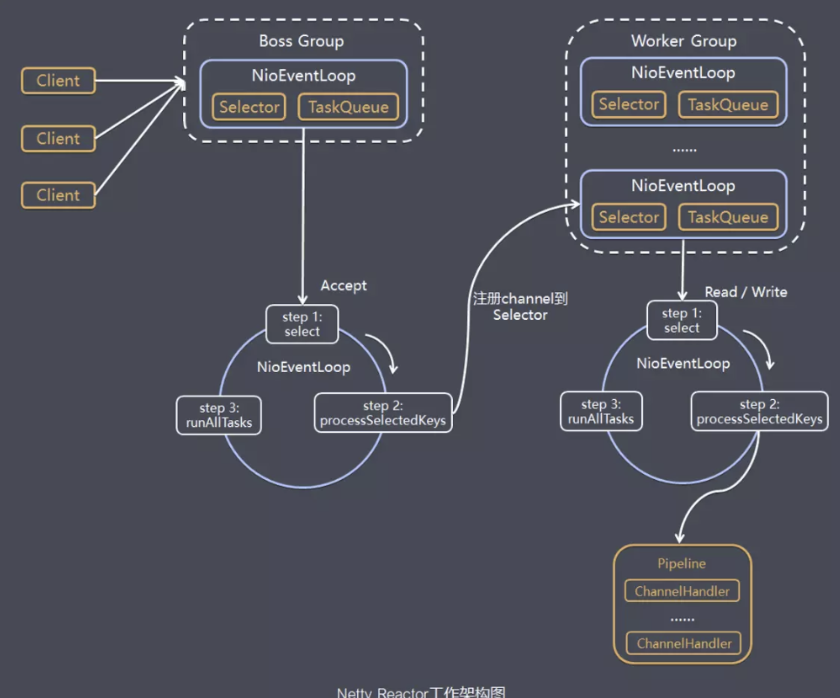
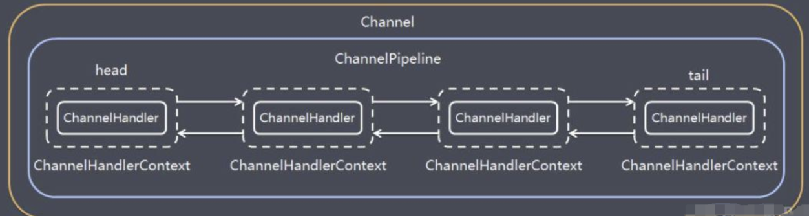
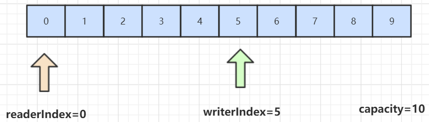

### 1. Netty初探

   NIO 的类库和 API 繁杂， 使用麻烦： 需要熟练掌握Selector、 ServerSocketChannel、 SocketChannel、 ByteBuffer等。

   开发工作量和难度都非常大： 例如客户端面临断线重连、 网络闪断、心跳处理、半包读写、 网络拥塞和异常流的处理等等。

   Netty 对 JDK 自带的 NIO 的 API 进行了良好的封装，解决了上述问题。且Netty拥有高性能、 吞吐量更高，延迟更低，减少资源消耗，最小化不必要的内存复制等优点。

   Netty 现在都在用的是4.x，5.x版本已经废弃，Netty 4.x 需要JDK 6以上版本支持
   
### 2. Netty的使用场景

   1. 互联网行业：在分布式系统中，各个节点之间需要远程服务调用，高性能的 RPC 框架必不可少，Netty 作为异步高性能的通信框架，往往作为基础通信组件被这些 RPC 框架使用。典型的应用有：阿里分布式服务框架 Dubbo 的 RPC 框架使用 Dubbo 协议进行节点间通信，Dubbo 协议默认使用 Netty 作为基础通信组件，用于实现。各进程节点之间的内部通信。Rocketmq底层也是用的Netty作为基础通信组件。

   2. 游戏行业：无论是手游服务端还是大型的网络游戏，Java 语言得到了越来越广泛的应用。Netty 作为高性能的基础通信组件，它本身提供了 TCP/UDP 和 HTTP 协议栈。

   3. 大数据领域：经典的 Hadoop 的高性能通信和序列化组件 Avro 的 RPC 框架，默认采用 Netty 进行跨界点通信，它的 Netty Service 基于 Netty 框架二次封装实现。

   netty相关开源项目：https://netty.io/wiki/related-projects.html

### 3. Netty通讯示例

#### 3.1 引入依赖 

```
<dependency>
    <groupId>io.netty</groupId>
    <artifactId>netty-all</artifactId>
    <version>4.1.35.Final</version>
</dependency>
```

#### 3.2 服务端代码

```java
public class MyNettyServer {

    public static void main(String[] args) {

        // 创建两个线程组 bossGroup 和 workerGroup，含有的子线程 NioEventLoopGroup 的个数默认为cpu 核数的两倍
        // bossGroup 只是处理连接请求， workerGroup 负责 和客户端业务处理
        EventLoopGroup bossGroup = new NioEventLoopGroup(1);
        EventLoopGroup workerGroup = new NioEventLoopGroup();

        try {
            // 创建 服务器端 的启动对象
            ServerBootstrap bootstrap = new ServerBootstrap();

            bootstrap.group(bossGroup,workerGroup)// 设置两个线程组
                    .channel(NioServerSocketChannel.class) // 使用 NioServerSocketChannel 作为服务器的通道实现
                    // 初始化服务器连接队列大小，服务端处理客户端连接请求是顺序处理的，所以同一时间只能处理一个客户端连接.
                    // 多个客户端同时过来的时候，服务端将不能处理的客户端连接请求放到队列中等待处理
                    .option(ChannelOption.SO_BACKLOG, 1024)
                    .childHandler(new ChannelInitializer<SocketChannel>() { //  创建通道初始化对象，设置初始参数

                        @Override
                        protected void initChannel(SocketChannel socketChannel) throws Exception {
                            // 对 workerGroup 的 SocketChannel 设置 处理器
                            socketChannel.pipeline().addLast(new MyNettyServerHandler());
                        }
                    });

            log.info("netty server start ....");

            // 绑定一个端口 并且同步，生成了一个 ChannelFuture 异步对象，通过 isDone() 等方法可以判断异步事件的执行情况
            // 启动服务器(并绑定端口)， bind 是异步操作，sync 方法是 等待异步操作执行完毕
            ChannelFuture cf = bootstrap.bind(9000).sync();

            // 给 cf 注册监听器，监听关心的事件
          /*  cf.addListener(new ChannelFutureListener() {
                @Override
                public void operationComplete(ChannelFuture channelFuture) throws Exception {
                    if (cf.isSuccess()) {
                        log.info("监听端口9000成功");
                    }else {
                        log.info("监听端口9000失败");
                    }
                }
            });*/

            // 对通道关闭进行监听，closeFuture 是异步操作，监听通道关闭
            // 通过 sync 方法 同步等待 通道关闭 处理完毕，这里会阻塞等待 通道关闭完成
            cf.channel().closeFuture().sync();


        } catch (Exception e) {
            log.error("error: {}",e);
        }finally {
            bossGroup.shutdownGracefully();
            workerGroup.shutdownGracefully();
        }


    }
}

public class MyNettyServerHandler extends ChannelInboundHandlerAdapter {

    /**
     *  读取客户端发送的数据
     * @param ctx  上下文对象, 含有通道channel，管道pipeline
     * @param msg 就是客户端发送的数据
     * @throws Exception
     */
    @Override
    public void channelRead(ChannelHandlerContext ctx, Object msg) throws Exception {
        log.info("服务器读取线程: {}", Thread.currentThread().getName());
        ByteBuf buf = (ByteBuf) msg;
        log.info("客户端发送的消息: {}", buf.toString(CharsetUtil.UTF_8));
    }

    /**
     *  数据读取完毕处理方法
     * @param ctx
     * @throws Exception
     */
    @Override
    public void channelReadComplete(ChannelHandlerContext ctx) throws Exception {
        ByteBuf buf = Unpooled.copiedBuffer("helloClient...", CharsetUtil.UTF_8);
        ctx.writeAndFlush(buf);
    }

    /**
     * 处理异常, 一般是需要关闭通道
     * @param ctx
     * @param cause
     * @throws Exception
     */
    @Override
    public void exceptionCaught(ChannelHandlerContext ctx, Throwable cause) throws Exception {
        ctx.close();
    }
}
```

#### 3.3 客户端代码 

```java
public class MyNettyClient {

    public static void main(String[] args) {

        EventLoopGroup group = new NioEventLoopGroup();

        try {
            // 创建客户端启动对象
            // 注意客户端使用的是 Bootstrap ，而不是 ServerBootstrap
            Bootstrap bootstrap = new Bootstrap();

            // 设置相关参数
            bootstrap.group(group) // 设置线程组
                    .channel(NioSocketChannel.class) // 使用 NioSocketChannel 作为客户端的通道实现
                    .handler(new ChannelInitializer<SocketChannel>() {

                        @Override
                        protected void initChannel(SocketChannel socketChannel) throws Exception {
                            // 加入 处理器
                            socketChannel.pipeline().addLast(new MyNettyClientHandler());
                        }
                    });

            log.info(" netty client start ....");

            // 启动客户端去连接服务器端
            ChannelFuture channelFuture = bootstrap.connect("localhost", 9000).sync();

            // 对关闭 通道进行 监听
            channelFuture.channel().closeFuture().sync();

        } catch (Exception e) {
            log.info("error : {}", e);
        }finally {
            group.shutdownGracefully();
        }
    }
}


public class MyNettyClientHandler extends ChannelInboundHandlerAdapter {

    /**
     *  当客户端连接服务器完成就会触发该方法
     * @param ctx
     * @throws Exception
     */
    @Override
    public void channelActive(ChannelHandlerContext ctx) throws Exception {
        ByteBuf buf = Unpooled.copiedBuffer("helloserver ....".getBytes(StandardCharsets.UTF_8));
        ctx.writeAndFlush(buf);
    }

    /**
     * 当通道有读取事件时会触发，即服务端发送数据给客户端
     * @param ctx
     * @param msg
     * @throws Exception
     */
    @Override
    public void channelRead(ChannelHandlerContext ctx, Object msg) throws Exception {
        ByteBuf buf = (ByteBuf) msg;
        log.info("收到服务端的消息: {}", buf.toString(CharsetUtil.UTF_8));
        log.info("服务端的地址是: {}", ctx.channel().remoteAddress());
    }

    /**
     *  处理异常, 一般是需要关闭通道
     * @param ctx
     * @param cause
     * @throws Exception
     */
    @Override
    public void exceptionCaught(ChannelHandlerContext ctx, Throwable cause) throws Exception {
        log.error("error: {}", cause);
        ctx.close();
    }
}
```

### 4. Netty线程模型

netty 的线程模型: 



#### 4.1 模型解释：

   1. Netty 抽象出两组线程池 BossGroup 和 WorkerGroup ，BosstGroup 专门负责 接收客户端的连接，WorkerGroup 专门负责网络的读写

   2. BossGroup 和 WorkerGroup 类型都是 NioEventLoopGroup

   3. NioEventLoopGroup 相当于 一个事件循环线程组，这个组中含有多个事件循环线程，每一个事件循环线程是 NioEventLoop 

   4. 每个 NioEventLoop 都有一个 Selector ,用于监听注册在其上的 socketChannel 的网络通讯 

   5. 每个 Boss NioEventLoop 线程 内部循环执行的步骤有 3步 

    1. 处理 accept 事件，与client 建立连接，生成 NioSocketChannel 
    2. 将 NioSocketChannel 注册到 某个 Worker NioEventLoop 上的 Selector 
    3. 处理队列的任务，即 runAllTasks 

   6. 每个 worker NioEventLoop 线程循环 执行的步骤 

    1. 轮询注册到自己 Selector 上所有 NioSocketChannel 的 read,write 事件 
    2. 处理 I/O 事件，即 read、write 事件，在对应 NioSocketChannel 处理业务 
    3. runAllTasks 处理任务队列 TaskQueue 的任务，一些消耗的业务处理一般可以放到 TaskQueue 中慢慢处理，这样不影响 数据在 pipeline 中的流动处理

   7. 每个 worker NioEventLoop 处理 NioSocketChannel 业务时，会使用 pipeline(管道)， 管道维护了很多 handler 处理器 用来处理 channl 中的数据 

### 5. Netty 模块组件 

#### 5.1 BootStrap 、ServerBootStrap 

   BootStrap 意思是引导，一个Netty 应用通常由一个 BootStrap 开始，主要作用是配置整个 Netty 程序，串联各个组件，Netty 中 BootStrap 类是客户端程序启动引导类，ServerBootStrap 
   是服务端启动引导类 

#### 5.2 Future、ChannelFuture

   在Netty 中所有的IO 操作都是异步的，不能立即得知消息是否被正确处理。 

   但是可以过一会儿等它执行万或者直接注册一个监听，具体实现就是通过 Future 和 ChannelFuture，他们可以注册一个监听，当操作执行成功或失败时监听会自动触发注册的监听事件。 

#### 5.3 Channel

  Netty 网络通信的组件，能够用于执行网络 I/O 操作。Channel 为用户提供：
 
    1. 当前网络连接的通道的状态 (例如是否打开、是否已连接)
    
    2. 网络连接的配置参数 (例如接收缓冲区大小)

    3. 提供异步的网络 I/O 操作 (如建立连接，读写、绑定端口)， 异步调用意味着任何 I/O 调用都将立即返回，并且不保证在调用结束时所请求的 I/O 操作已完成。

    4. 调用立即返回 一个 ChannelFuture 实例，通过注册监听器到 ChannelFuture 上，可以 I/O 操作成功、失败或 取消时 回调通知调用方

    5. 支持关联 I/O 操作 与之对应的处理程序。 

  不同协议、不同的阻塞类型的连接都有不同的 Channel 类型与之对应。 

  常用的 Channel 类型: 

```
NioSocketChannel，异步的客户端 TCP Socket 连接。
NioServerSocketChannel，异步的服务器端 TCP Socket 连接。
NioDatagramChannel，异步的 UDP 连接。
NioSctpChannel，异步的客户端 Sctp 连接。
NioSctpServerChannel，异步的 Sctp 服务器端连接。
这些通道涵盖了 UDP 和 TCP 网络 IO 以及文件 IO。
```

#### 5.4 Selector 

  Netty 基于 Selector 对象实现 I/O 多路复用，通过 Selector 一个线程可以监听多个连接的 Channel 事件。

  当向一个 Selector 中注册 Channel 后，Selector 内部的机制就可以自动不断地查询(Select) 这些注册的 Channel 是否有已就绪的 I/O 事件（例如可读，可写，网络连接完成等），
  这样程序就可以很简单地使用一个线程高效地管理多个 Channel 。

#### 5.5 NioEventLoop 

  NioEventLoop 中维护了一个线程和任务队列，支持异步提交执行任务，线程启动时会调用 NioEventLoop 的 run 方法，执行 I/O 任务和非 I/O 任务：

    I/O 任务，即 selectionKey 中 ready 的事件，如 accept、connect、read、write 等，由 processSelectedKeys 方法触发。

    非 IO 任务，添加到 taskQueue 中的任务，如 register0、bind0 等任务，由 runAllTasks 方法触发。

#### 5.6 NioEventLoopGroup

   NioEventLoopGroup，主要管理 eventLoop 的生命周期，可以理解为一个线程池，内部维护了一组线程，每个线程(NioEventLoop)负责处理多个 Channel 上的事件，而一个 Channel 只对应于一个线程。
   
#### 5.7 ChannelHandler

  ChannelHandler 是一个接口，处理 I/O 事件或拦截 I/O 操作，并将其转发到其 ChannelPipeline(业务处理链)中的下一个处理程序。

  ChannelHandler 本身并没有提供很多方法，因为这个接口有许多的方法需要实现，方便使用期间，可以继承它的子类：
  
```
ChannelInboundHandler 用于处理入站 I/O 事件。
ChannelOutboundHandler 用于处理出站 I/O 操作。
```

或者使用以下适配器类：

```
ChannelInboundHandlerAdapter 用于处理入站 I/O 事件。
ChannelOutboundHandlerAdapter 用于处理出站 I/O 操作。
```

#### 5.8 ChannelHandlerContext

  保存 Channel 相关的所有上下文信息，同时关联一个 ChannelHandler 对象。

#### 5.9  ChannelPipline

   保存 ChannelHandler 的 List，用于处理或拦截 Channel 的入站事件和出站操作。

   ChannelPipeline 实现了一种高级形式的拦截过滤器模式，使用户可以完全控制事件的处理方式，以及 Channel 中各个的 ChannelHandler 如何相互交互。

   在 Netty 中每个 Channel 都有且仅有一个 ChannelPipeline 与之对应，它们的组成关系如下：



   一个 Channel 包含了一个 ChannelPipeline，而 ChannelPipeline 中又维护了一个由 ChannelHandlerContext 组成的双向链表，并且每个 ChannelHandlerContext 中又关联着一个 ChannelHandler。

   read事件(入站事件)和write事件(出站事件)在一个双向链表中，入站事件会从链表 head 往后传递到最后一个入站的 handler，出站事件会从链表 tail 往前传递到最前一个出站的 handler，两种类型的 handler 互不干扰。
   
### 6. ByteBuf 详解

   从结构上来说，ByteBuf 由一串字节数组构成。数组中每个字节用来存放信息。

   ByteBuf 提供了两个索引，一个用于读取数据，一个用于写入数据。这两个索引通过在字节数组中移动，来定位需要读或者写信息的位置。

   当从 ByteBuf 读取时，它的 readerIndex（读索引）将会根据读取的字节数递增。

   同样，当写 ByteBuf 时，它的 writerIndex 也会根据写入的字节数进行递增。



  需要注意的是极限的情况是 readerIndex 刚好读到了 writerIndex 写入的地方。

  如果 readerIndex 超过了 writerIndex 的时候，Netty 会抛出 IndexOutOf-BoundsException 异常。

#### 6.1 byteBuf 示例 

```java
@Slf4j
public class MyNettyByteBuf {

    public static void main(String[] args) {

        // 创建byteBuf对象，该对象内部包含一个字节数组byte[10]
        // 通过readerindex和writerIndex和capacity，将buffer分成三个区域
        // 已经读取的区域：[0,readerindex)
        // 可读取的区域：[readerindex,writerIndex)
        // 可写的区域: [writerIndex,capacity)
        ByteBuf byteBuf = Unpooled.buffer(10);

        log.info("byteBuf = {}", byteBuf);

        for (int i = 0; i < 8; i++) {
            byteBuf.writeByte(i);
        }

        log.info("byteBuf = {}", byteBuf);

        for (int i = 0; i < 5; i++) {
            log.info("value = {}", byteBuf.getByte(i));
        }

        log.info("byteBuf = {}", byteBuf);

        for (int i = 0; i < 5; i++) {
            log.info("value = {}", byteBuf.readByte());
        }

        log.info("byteBuf = {}", byteBuf);

        //用Unpooled工具类创建ByteBuf
        ByteBuf byteBuf2 = Unpooled.copiedBuffer("hello,wlz!", CharsetUtil.UTF_8);
        // 使用 相关的方法
        if (byteBuf2.hasArray()) {
            byte[] content = byteBuf2.array();

            //将 content 转成字符串
            log.info("content = {}", new String(content,CharsetUtil.UTF_8));
            log.info("byteBuf2 = {}", byteBuf2);

            log.info("byteBuf2 = {}", byteBuf2.getByte(0));// 获取数组0这个位置的字符h的ascii码，h=104

            int len = byteBuf2.readableBytes();//可读的字节数  12
            log.info("len = {} ", len);

            //使用for取出各个字节
            for (int i = 0; i < len; i++) {
                log.info("char = {}", (char)byteBuf2.getByte(i));
            }

            //范围读取
            log.info("范围读取: {}", byteBuf2.getCharSequence(0,6, CharsetUtil.UTF_8));
            log.info("范围读取: {}", byteBuf2.getCharSequence(6,6, CharsetUtil.UTF_8));

        }

    }
}
```

### 7. 聊天室示例 

#### 7.1 服务端 

```java
@Slf4j
public class ChatNettyServer {

    public static void main(String[] args) {

        EventLoopGroup bossGroup = new NioEventLoopGroup(1);
        EventLoopGroup workerGroup = new NioEventLoopGroup();

        try {
            ServerBootstrap bootstrap = new ServerBootstrap();

            bootstrap.group(bossGroup,workerGroup)
                    .channel(NioServerSocketChannel.class)
                    .option(ChannelOption.SO_BACKLOG, 1024)
                    .childHandler(new ChannelInitializer<SocketChannel>() {
                        @Override
                        protected void initChannel(SocketChannel socketChannel) throws Exception {
                            socketChannel.pipeline().addLast("decoder",new StringDecoder());
                            socketChannel.pipeline().addLast("encoder",new StringEncoder());
                            socketChannel.pipeline().addLast(new ChatServerHandler());
                        }
                    });

            log.info("聊天 服务端启动 。。。。。。。");

            ChannelFuture cf = bootstrap.bind(9000).sync();

            cf.channel().closeFuture().sync();

        } catch (Exception e) {
            log.error("ChatNettyServer error : {}", e);
        }finally {
            bossGroup.shutdownGracefully();
            workerGroup.shutdownGracefully();
        }


    }
}

@Slf4j
public class ChatServerHandler extends SimpleChannelInboundHandler<String> {


    private static ChannelGroup channels = new DefaultChannelGroup(GlobalEventExecutor.INSTANCE);

    SimpleDateFormat sdf = new SimpleDateFormat("yyyy-MM-dd HH:mm:ss");

    @Override
    public void channelActive(ChannelHandlerContext ctx) throws Exception {
        Channel channel = ctx.channel();

        String msg = "【客户端】 " + channel.remoteAddress() + " 上线了 " + sdf.format(new Date());
        channels.writeAndFlush(msg);

        channels.add(channel);

        String serverMsg = channel.remoteAddress() + "上线了。。。";
        log.info(serverMsg);
    }

    @Override
    public void channelInactive(ChannelHandlerContext ctx) throws Exception {
        Channel channel = ctx.channel();

        String msg = "【客户端】 " + channel.remoteAddress() + " 下线了 " + sdf.format(new Date());
        channels.writeAndFlush(msg);

        String serverMsg = channel.remoteAddress() + "下线了。。。";
        log.info(serverMsg);
        log.info(" channels size : {}", channels.size());

    }

    @Override
    protected void channelRead0(ChannelHandlerContext ctx, String msg) throws Exception {
        Channel channel = ctx.channel();
        channels.forEach(ch -> {
            if (ch != channel) {
                ch.writeAndFlush("【客户端】 " + channel.remoteAddress() + " 发送了消息  " + msg);
            }else {
                ch.writeAndFlush("【自己 】  发送了消息  " + msg);
            }
        });
    }


    @Override
    public void exceptionCaught(ChannelHandlerContext ctx, Throwable cause) throws Exception {
        // 关闭通道
        ctx.close();
    }
}

```

#### 7.2 客户端 

```java
@Slf4j
public class ChatNettyClient {

    public static void main(String[] args) {

        EventLoopGroup group = new NioEventLoopGroup();

        try {
            Bootstrap bootstrap = new Bootstrap();

            bootstrap.group(group)
                    .channel(NioSocketChannel.class)
                    .handler(new ChannelInitializer<SocketChannel>() {
                        @Override
                        protected void initChannel(SocketChannel socketChannel) throws Exception {
                            socketChannel.pipeline().addLast("decoder", new StringDecoder());
                            socketChannel.pipeline().addLast("encoder", new StringEncoder());
                            socketChannel.pipeline().addLast(new ChatClientHandler());
                        }
                    });

            ChannelFuture cf = bootstrap.connect("127.0.0.1", 9000).sync();

            Channel channel = cf.channel();

            log.info("==========  {}  ==========", channel.localAddress());

            Scanner sc  = new Scanner(System.in);
            while (sc.hasNextLine()) {
                String s = sc.nextLine();
                channel.writeAndFlush(s);
            }


        } catch (Exception e) {
            log.error("ChatNettyClient error: {}", e);
        }finally {
            group.shutdownGracefully();
        }


    }
}

@Slf4j
public class ChatClientHandler extends SimpleChannelInboundHandler<String> {


    @Override
    protected void channelRead0(ChannelHandlerContext channelHandlerContext, String msg) throws Exception {
        log.info("收到的消息是： {}", msg);
    }

    @Override
    public void exceptionCaught(ChannelHandlerContext ctx, Throwable cause) throws Exception {
        ctx.close();
    }
}
```