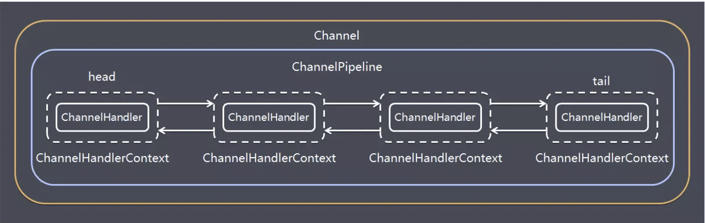
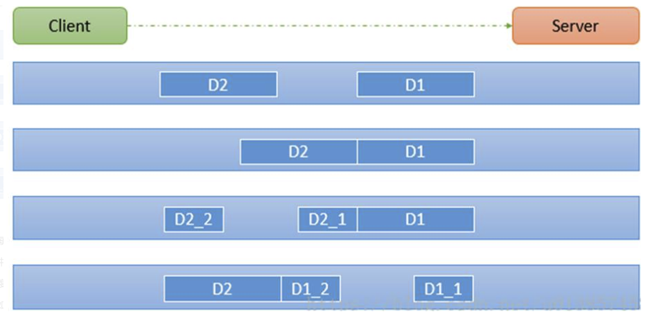

### 1. Netty 编解码 

   Netty涉及到编解码的组件有 Channel、ChannelHandler、ChannelPipe等。 
   
#### 1.1 ChannelHandler 

   ChannelHandler充当了处理入站和出站数据的应用程序逻辑容器。例如，实现ChannelInboundHandler接口（或ChannelInboundHandlerAdapter），
   你就可以接收入站事件和数据，这些数据随后会被你的应用程序的业务逻辑处理。当你要给连接的客户端发送响应时，也可以从ChannelInboundHandler冲刷数据。
   你的业务逻辑通常写在一个或者多个ChannelInboundHandler中。ChannelOutboundHandler原理一样，只不过它是用来处理出站数据的。

#### 1.2 ChannelPipeline

   ChannelPipeline提供了ChannelHandler链的容器。以客户端应用程序为例，如果事件的运动方向是从客户端到服务端的，那么我们称这些事件为出站的，
   即客户端发送给服务端的数据会通过pipeline中的一系列ChannelOutboundHandler(ChannelOutboundHandler调用是从tail到head方向逐个调用每个handler的逻辑)，
   并被这些Handler处理，反之则称为入站的，入站只调用pipeline里的ChannelInboundHandler逻辑(ChannelInboundHandler调用是从head到tail方向逐个调用每个handler的逻辑)。



#### 1.3 编码解码器

   当你通过Netty发送或者接受一个消息的时候，就将会发生一次数据转换。入站消息会被解码：从字节转换为另一种格式（比如java对象）；如果是出站消息，它会被编码成字节。

   Netty提供了一系列实用的编码解码器，他们都实现了ChannelInboundHadnler或者ChannelOutboundHandler接口。在这些类中，channelRead方法已经被重写了。
   以入站为例，对于每个从入站Channel读取的消息，这个方法会被调用。随后，它将调用由已知解码器所提供的decode()方法进行解码，并将已经解码的字节转发给ChannelPipeline中的下一个ChannelInboundHandler。

   Netty提供了很多编解码器，比如编解码字符串的StringEncoder和StringDecoder，编解码对象的ObjectEncoder和ObjectDecoder等。

   如果要实现高效的编解码可以用protobuf，但是protobuf需要维护大量的proto文件比较麻烦，现在一般可以使用protostuff。

   protostuff是一个基于protobuf实现的序列化方法，它较于protobuf最明显的好处是，在几乎不损耗性能的情况下做到了不用我们写.proto文件来实现序列化。使用它也非常简单，代码如下：

##### 1.3.1 protostuff

###### 引入依赖:

```xml
<dependency>
    <groupId>com.dyuproject.protostuff</groupId>
    <artifactId>protostuff-api</artifactId>
    <version>1.0.10</version>
</dependency>
<dependency>
    <groupId>com.dyuproject.protostuff</groupId>
    <artifactId>protostuff-core</artifactId>
    <version>1.0.10</version>
</dependency>
<dependency>
    <groupId>com.dyuproject.protostuff</groupId>
    <artifactId>protostuff-runtime</artifactId>
    <version>1.0.10</version>
</dependency>
```

###### protostuff使用示例：

```java
package com.wlz.codec;

import com.dyuproject.protostuff.LinkedBuffer;
import com.dyuproject.protostuff.ProtostuffIOUtil;
import com.dyuproject.protostuff.Schema;
import com.dyuproject.protostuff.runtime.RuntimeSchema;

import java.util.Map;
import java.util.concurrent.ConcurrentHashMap;

/**
 *  protostuff 序列化工具类，基于protobuf封装
 * @author wlz
 * @date 2022-07-09  12:06 上午
 */
public class MyProtostuffUtil {

    private static Map<Class<?>, Schema<?>> classSchema = new ConcurrentHashMap<Class<?>, Schema<?>>();


    private static <T> Schema<T> getSchema(Class<T> clazz) {

        @SuppressWarnings("unchecked")
        Schema<T> schema = (Schema<T>) classSchema.get(clazz);
        if (schema == null) {
            schema = RuntimeSchema.getSchema(clazz);
            if (schema != null) {
                classSchema.put(clazz, schema);
            }
        }
        return schema;
    }

    /**
     *  序列化
     * @param obj
     * @param <T>
     * @return
     */
    public static <T> byte[] serializer(T obj) {
        @SuppressWarnings("unchecked")
        Class<T> clazz = (Class<T>) obj.getClass();
        LinkedBuffer buffer = LinkedBuffer.allocate(LinkedBuffer.DEFAULT_BUFFER_SIZE);

        try {
            Schema<T> schema = getSchema(clazz);
            return ProtostuffIOUtil.toByteArray(obj, schema, buffer);
        } catch (Exception e) {
            throw new IllegalStateException(e.getMessage(),e);
        }finally {
            buffer.clear();
        }
    }


    public static <T> T deserializer(byte[] data, Class<T> clazz) {

        try {
            T obj = clazz.newInstance();
            Schema<T> schema = getSchema(clazz);
            ProtostuffIOUtil.mergeFrom(data,obj,schema);
            return obj;
        } catch (Exception e) {
          throw new IllegalStateException(e.getMessage(),e);
        }
    }

    public static void main(String[] args) {
        byte[] useBytes = MyProtostuffUtil.serializer(new MyUser(1, "wlzwlz"));
        MyUser myUser = MyProtostuffUtil.deserializer(useBytes, MyUser.class);
        System.out.println(myUser);
    }

}
```

#### 1.4 Netty粘包拆包

   TCP是一个流协议，就是没有界限的一长串二进制数据。TCP作为传输层协议并不不了解上层业务数据的具体含义，它会根据TCP缓冲区的实际情况进行数据包的划分，所以在业务上认为是一个完整的包，可能会被TCP拆分成多个包进行发送，也有可能把多个小的包封装成一个大的数据包发送，这就是所谓的TCP粘包和拆包问题。面向流的通信是无消息保护边界的。

   如下图所示，client发了两个数据包D1和D2，但是server端可能会收到如下几种情况的数据。



##### 1.4.1 解决方案 

   1）消息定长度，传输的数据大小固定长度，例如每段的长度固定为100字节，如果不够空位补空格

   2）在数据包尾部添加特殊分隔符，比如下划线，中划线等，这种方法简单易行，但选择分隔符的时候一定要注意每条数据的内部一定不能出现分隔符。

   3）发送长度：发送每条数据的时候，将数据的长度一并发送，比如可以选择每条数据的前4位是数据的长度，应用层处理时可以根据长度来判断每条数据的开始和结束。

   Netty提供了多个解码器，可以进行分包的操作，如下：

      1. LineBasedFrameDecoder （回车换行分包）
      2. DelimiterBasedFrameDecoder（特殊分隔符分包）
      3. FixedLengthFrameDecoder（固定长度报文来分包）

##### 1.4.2 自定义长度分包编解码器

```java
@Slf4j
public class MyMessageDecoder extends ByteToMessageDecoder {

    int length = 0;

    @Override
    protected void decode(ChannelHandlerContext channelHandlerContext, ByteBuf in, List<Object> out) throws Exception {

      log.info("MyMessageDecoder decoder 被调用");
      log.info("ByteBuf : {}", in);

      if (in.readableBytes() >= 4) {
          if (length == 0) {
              length = in.readInt();
          }
          if (in.readableBytes() < length) {
              log.info(" 当前可读数据不够，继续等待....");
              return;
          }
          byte[] content = new byte[length];
          if (in.readableBytes() >= length) {
              in.readBytes(content);

              // 封装成 MyMessageProtocol 对象，传递到下一个 handler 业务处理
              MyMessageProtocol myMessageProtocol = new MyMessageProtocol();
              myMessageProtocol.setLen(length);
              myMessageProtocol.setContent(content);
              out.add(myMessageProtocol);
          }
          length = 0;
      }

    }
}

@Slf4j
public class MyMessageEncoder extends MessageToByteEncoder<MyMessageProtocol> {

   @Override
   protected void encode(ChannelHandlerContext ctx, MyMessageProtocol msg, ByteBuf out) throws Exception {
      log.info("MyMessageEncoder encoder 被调用 。。。");
      out.writeInt(msg.getLen());
      out.writeBytes(msg.getContent());
   }
}


public class MyMessageProtocol {

   /**
    *  定义一次发送包体长度
    */
   private int len;

   /**
    *  定义一次 发送包体内容
    */
   private byte[] content;

   public int getLen() {
      return len;
   }

   public void setLen(int len) {
      this.len = len;
   }

   public byte[] getContent() {
      return content;
   }

   public void setContent(byte[] content) {
      this.content = content;
   }
}
```


#### 1.5 Netty心跳检测机制

   所谓心跳, 即在 TCP 长连接中, 客户端和服务器之间定期发送的一种特殊的数据包, 通知对方自己还在线, 以确保 TCP 连接的有效性.

   在 Netty 中, 实现心跳机制的关键是 IdleStateHandler, 看下它的构造器：

```
public IdleStateHandler(int readerIdleTimeSeconds, int writerIdleTimeSeconds, int allIdleTimeSeconds) {
    this((long)readerIdleTimeSeconds, (long)writerIdleTimeSeconds, (long)allIdleTimeSeconds, TimeUnit.SECONDS);
}
```

   三个参数的含义:

      1. readerIdleTimeSeconds: 读超时. 即当在指定的时间间隔内没有从 Channel 读取到数据时, 会触发一个 READER_IDLE 的 IdleStateEvent 事件.
      2. writerIdleTimeSeconds: 写超时. 即当在指定的时间间隔内没有数据写入到 Channel 时, 会触发一个 WRITER_IDLE 的 IdleStateEvent 事件.
      3. allIdleTimeSeconds: 读/写超时. 即当在指定的时间间隔内没有读或写操作时, 会触发一个 ALL_IDLE 的 IdleStateEvent 事件.
   
   注：这三个参数默认的时间单位是秒。若需要指定其他时间单位，可以使用另一个构造方法：

```
IdleStateHandler(boolean observeOutput, long readerIdleTime, long writerIdleTime, long allIdleTime, TimeUnit unit)
```

   要实现Netty服务端心跳检测机制需要在服务器端的ChannelInitializer中加入如下的代码：

```
pipeline.addLast(new IdleStateHandler(3, 0, 0, TimeUnit.SECONDS));
```

##### 1.5.1 示例 

###### 服务端

```java
@Slf4j
public class MyHeartBeatNettyServer {

    public static void main(String[] args) {

        EventLoopGroup bossGroup = new NioEventLoopGroup(1);
        EventLoopGroup workerGroup = new NioEventLoopGroup();

        try {
            ServerBootstrap bootstrap = new ServerBootstrap();

            bootstrap.group(bossGroup,workerGroup)
                    .channel(NioServerSocketChannel.class)
                    .option(ChannelOption.SO_BACKLOG, 1024)
                    .childHandler(new ChannelInitializer<SocketChannel>() {
                        @Override
                        protected void initChannel(SocketChannel socketChannel) throws Exception {

                            socketChannel.pipeline().addLast(new StringEncoder());
                            socketChannel.pipeline().addLast(new StringDecoder());
                            //IdleStateHandler的readerIdleTime参数指定超过3秒还没收到客户端的连接，
                            //会触发IdleStateEvent事件并且交给下一个handler处理，下一个handler必须
                            //实现userEventTriggered方法处理对应事件
                            socketChannel.pipeline().addLast(new IdleStateHandler(3,0,0, TimeUnit.SECONDS));
                            socketChannel.pipeline().addLast(new MyHeartBeatNettyServerHandler());
;                        }
                    });

            log.info("  netty server start ..... ");
            ChannelFuture cf = bootstrap.bind(9000).sync();


            cf.channel().closeFuture().sync();

        } catch (Exception e) {
            log.error("MyHeartBeatNettyServer error: {}",e);
        } finally {
            bossGroup.shutdownGracefully();
            workerGroup.shutdownGracefully();

        }


    }

}

@Slf4j
public class MyHeartBeatNettyServerHandler extends SimpleChannelInboundHandler<String> {

   int readIdleTimes = 0;

   @Override
   protected void channelRead0(ChannelHandlerContext ctx, String s) throws Exception {

      log.info(" 接收到客户端发送的消息: {}", s);
      if ("Heartbeat Packet".equals(s)) {
         ctx.channel().writeAndFlush("ok");
      }else {
         log.info("  其他信息处理 .......");
      }
   }

   @Override
   public void userEventTriggered(ChannelHandlerContext ctx, Object evt) throws Exception {
      IdleStateEvent event = (IdleStateEvent) evt;
      String eventType = null;
      switch (event.state()) {
         case READER_IDLE:
            eventType = "读空闲";
            readIdleTimes++; // 读空闲的计数加1
            break;
         case WRITER_IDLE:
            eventType = "写空闲";
            break;
         case ALL_IDLE:
            eventType = "读写空闲";
            break;
      }

      log.info(" {}  超时事件: {} ", ctx.channel().remoteAddress(), eventType);
      if (readIdleTimes > 3) {
         log.info("【服务端】 读空闲超过3次，关闭连接，释放更多资源 。。。。");
         ctx.channel().writeAndFlush("idle close ...");
         ctx.channel().close();
      }
   }

   @Override
   public void channelActive(ChannelHandlerContext ctx) throws Exception {
      log.info("=== {}  is active ", ctx.channel().remoteAddress());
   }
}
```

###### 客户端 

```java
@Slf4j
public class MyHeartBeatNettyClient {

    public static void main(String[] args) {

        EventLoopGroup group = new NioEventLoopGroup();

        try {
            Bootstrap bootstrap = new Bootstrap();

            bootstrap.group(group)
                    .channel(NioSocketChannel.class)
                    .handler(new ChannelInitializer<SocketChannel>() {
                        @Override
                        protected void initChannel(SocketChannel socketChannel) throws Exception {
                            socketChannel.pipeline().addLast(new StringDecoder());
                            socketChannel.pipeline().addLast(new StringEncoder());

                            socketChannel.pipeline().addLast(new MyHeartBeatNettyClientHandler());
                        }
                    });

            log.info(" netty client start .... ");
            ChannelFuture cf = bootstrap.connect("127.0.0.1", 9000).sync();

            log.info(" =========  {}  ======= ", cf.channel().localAddress());

            Channel channel = cf.channel();
            String text = "Heartbeat Packet";
            Random random = new Random();
            while (channel.isActive()) {
                int num = random.nextInt(8);
                Thread.sleep(2 * 1000);
                channel.writeAndFlush(text);
            }

        } catch (Exception e) {
            log.error("MyHeartBeatNettyClient error: {}", e);
        } finally {
            group.shutdownGracefully();
        }


    }
}

@Slf4j
public class MyHeartBeatNettyClientHandler extends SimpleChannelInboundHandler<String> {


   @Override
   protected void channelRead0(ChannelHandlerContext ctx, String s) throws Exception {
      log.info(" 【客户端】 接收到的消息: {}", s);
      if (s != null && s.equals("idle close ...")) {
         log.info(" 服务端关闭连接，客户端也关闭... ");
         ctx.channel().close();
      }
   }


   @Override
   public void exceptionCaught(ChannelHandlerContext ctx, Throwable cause) throws Exception {
      cause.printStackTrace();
      ctx.close();
   }
}
```


#### 1.6 Netty断线自动重连实现

   1、客户端启动连接服务端时，如果网络或服务端有问题，客户端连接失败，可以重连，重连的逻辑加在客户端。

   2、系统运行过程中网络故障或服务端故障，导致客户端与服务端断开连接了也需要重连，可以在客户端处理数据的Handler的channelInactive方法中进行重连。

##### 1.6.1 示例 

###### 服务端

```java
@Slf4j
public class ReconnectNettyServer {

    public static void main(String[] args) {

        EventLoopGroup bossGroup = new NioEventLoopGroup(1);
        EventLoopGroup workerGroup = new NioEventLoopGroup();


        try {
            ServerBootstrap bootstrap = new ServerBootstrap();

            bootstrap.group(bossGroup, workerGroup)
                    .channel(NioServerSocketChannel.class)
                    .option(ChannelOption.SO_BACKLOG, 1024)
                    .childHandler(new ChannelInitializer<SocketChannel>() {
                        @Override
                        protected void initChannel(SocketChannel socketChannel) throws Exception {

                            socketChannel.pipeline().addLast(new StringDecoder());
                            socketChannel.pipeline().addLast(new StringEncoder());

                            socketChannel.pipeline().addLast(new ReconnectNettyServerHandler());

                        }
                    });

            log.info(" netty server start ..... ");
            ChannelFuture cf = bootstrap.bind(9000).sync();

            cf.channel().closeFuture().sync();

        } catch (Exception e) {
            log.error(" ReconnectNettyServer error : {}", e);
        } finally {
            bossGroup.shutdownGracefully();
            workerGroup.shutdownGracefully();
        }


    }
}

@Slf4j
public class ReconnectNettyServerHandler extends SimpleChannelInboundHandler<String> {


   @Override
   protected void channelRead0(ChannelHandlerContext channelHandlerContext, String s) throws Exception {
      log.info("服务端读取线程: {} ", Thread.currentThread().getName());
      log.info(" 客户端 发送的消息是: {} ", s);

   }

   @Override
   public void channelReadComplete(ChannelHandlerContext ctx) throws Exception {
      ByteBuf buf = Unpooled.copiedBuffer("helloclient".getBytes(CharsetUtil.UTF_8));
      ctx.writeAndFlush(buf);
   }

   @Override
   public void exceptionCaught(ChannelHandlerContext ctx, Throwable cause) throws Exception {
      cause.printStackTrace();
      ctx.close();
   }
}
```

###### 客户端 

```java
@Slf4j
public class ReconnectNettyClient{

    private String host;
    private int port;
    private Bootstrap bootstrap;
    private EventLoopGroup group;

    public ReconnectNettyClient(String host, int port) {
        this.host = host;
        this.port = port;
        init();
    }

    public static void main(String[] args) throws Exception{
        ReconnectNettyClient reconnectNettyClient = new ReconnectNettyClient("127.0.0.1", 9000);
        reconnectNettyClient.connect();
    }


    void init() {
        group = new NioEventLoopGroup();
        try {
            bootstrap = new Bootstrap();

            bootstrap.group(group)
                    .channel(NioSocketChannel.class)
                    .handler(new ChannelInitializer<SocketChannel>() {
                        @Override
                        protected void initChannel(SocketChannel socketChannel) throws Exception {
                            socketChannel.pipeline().addLast(new ReconnectNettyClientHandler(ReconnectNettyClient.this));
                        }
                    });
        } catch (Exception e) {
            log.error(" ReconnectNettyClient error : {}",e);
        } finally {

        }
    }


    public void connect() throws Exception{
        log.info(" netty client start .... ");
        ChannelFuture cf = bootstrap.connect(host, port);
        cf.addListener(new ChannelFutureListener() {
            @Override
            public void operationComplete(ChannelFuture channelFuture) throws Exception {
                if (!channelFuture.isSuccess()) {
                    channelFuture.channel().eventLoop().schedule(() -> {
                        log.error(" 重连服务器 .... ");
                        try {
                            connect();
                        } catch (Exception e) {
                            log.error("connect error {} ", e);
                        }
                    }, 3000, TimeUnit.MILLISECONDS);
                }else {
                    log.info(" 服务端连接成功..... ");
                }
            }
        });
        log.info(" =============   {}  ===========", cf.channel().localAddress());
        cf.channel().closeFuture().sync();
    }


}

@Slf4j
public class ReconnectNettyClientHandler extends SimpleChannelInboundHandler<String> {

   private ReconnectNettyClient reconnectNettyClient;

   public ReconnectNettyClientHandler(ReconnectNettyClient reconnectNettyClient) {
      this.reconnectNettyClient = reconnectNettyClient;
   }


   @Override
   public void channelActive(ChannelHandlerContext ctx) throws Exception {
      ByteBuf buf = Unpooled.copiedBuffer("helloserver".getBytes(CharsetUtil.UTF_8));
      ctx.writeAndFlush(buf);
   }


   @Override
   protected void channelRead0(ChannelHandlerContext ctx, String s) throws Exception {
      log.info(" 收到服务端的消息: {} ", s);
      log.info(" 服务端的地址为:  {} ", ctx.channel().remoteAddress());
   }


   @Override
   public void channelInactive(ChannelHandlerContext ctx) throws Exception {
      log.info(" 运行中断开重连 。。。。。 ");
      reconnectNettyClient.connect();
   }

   @Override
   public void exceptionCaught(ChannelHandlerContext ctx, Throwable cause) throws Exception {
      cause.printStackTrace();
      ctx.close();
   }
}
```