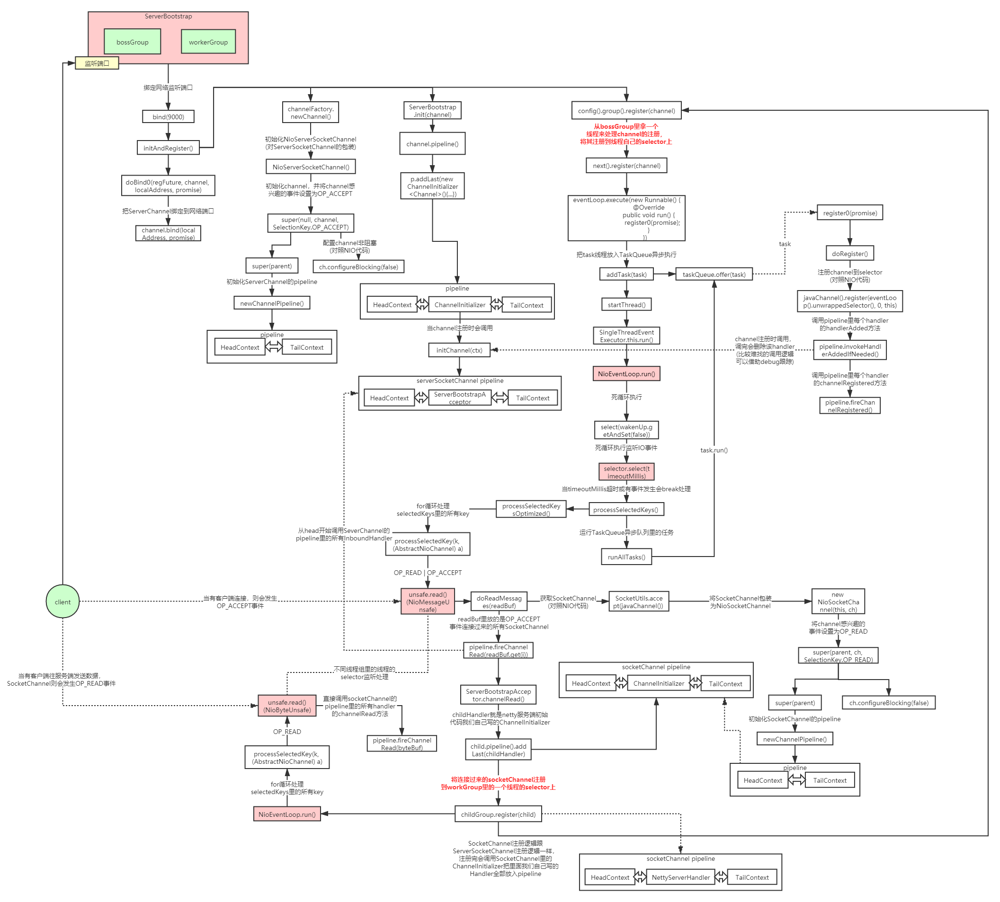

### 1. Netty 线程模型图


### 2. Netty 线程模型源码图 



### 3. Netty高并发高性能架构设计精髓

  1. 主从Reactor线程模型

  2. NIO多路复用非阻塞
 
  3. 无锁串行化设计思想

  4. 支持高性能序列化协议

  5. 零拷贝(直接内存的使用)

  6. ByteBuf内存池设计

  7. 灵活的TCP参数配置能力

  8.并发优化
  
#### 3.1 无锁串行化设计思想

   在大多数场景下，并行多线程处理可以提升系统的并发性能。但是，如果对于共享资源的并发访问处理不当，会带来严重的锁竞争，这最终会导致性能的下降。为了尽可能的避免锁竞争带来的性能损耗，
   可以通过串行化设计，即消息的处理尽可能在同一个线程内完成，期间不进行线程切换，这样就避免了多线程竞争和同步锁。NIO的多路复用就是一种无锁串行化的设计思想(理解下Redis和Netty的线程模型)

   为了尽可能提升性能，Netty采用了串行无锁化设计，在IO线程内部进行串行操作，避免多线程竞争导致的性能下降。表面上看，串行化设计似乎CPU利用率不高，并发程度不够。但是，通过调整NIO线程池的线程参数，
   可以同时启动多个串行化的线程并行运行，这种局部无锁化的串行线程设计相比一个队列-多个工作线程模型性能更优。

   Netty的NioEventLoop读取到消息之后，直接调用ChannelPipeline的fireChannelRead(Object msg)，只要用户不主动切换线程，一直会由NioEventLoop调用到用户的Handler，期间不进行线程切换，
   这种串行化处理方式避免了多线程操作导致的锁的竞争，从性能角度看是最优的。

#### 3.2 直接内存

   直接内存（Direct Memory）并不是虚拟机运行时数据区的一部分，也不是Java虚拟机规范中定义的内存区域，某些情况下这部分内存也会被频繁地使用，而且也可能导致OutOfMemoryError异常出现。
   Java里用DirectByteBuffer可以分配一块直接内存(堆外内存)，元空间对应的内存也叫作直接内存，它们对应的都是机器的物理内存。


##### 3.2.1 直接内存示例 

```java
@Slf4j
public class DirectMemoryTest {

    public static void main(String[] args) {
        for (int i = 0; i < 10; i++) {
            heapAccess();;
            directAccess();
        }
        
        log.info(" ======================== ");

        for (int i = 0; i < 10; i++) {
            heapAllocate();
            directAllocate();
        }
    }

    public static void heapAccess() {
        long startTime = System.currentTimeMillis();
        // 分配堆内存
        ByteBuffer buffer = ByteBuffer.allocate(1000);
        for (int i = 0; i < 100000; i++) {
            for (int j = 0; j < 200; j++) {
                buffer.putInt(j);
            }
            buffer.flip();
            for (int j = 0; j < 200; j++) {
                buffer.getInt();
            }
            buffer.clear();
        }
        long endTime = System.currentTimeMillis();
        log.info("堆内存访问:  {} ms", endTime - startTime);
    }


    public static void directAccess() {
        long startTime = System.currentTimeMillis();
        // 分配直接内存
        ByteBuffer buffer = ByteBuffer.allocateDirect(1000);
        for (int i = 0; i < 100000; i++) {
            for (int j = 0; j < 200; j++) {
                buffer.putInt(j);
            }
            buffer.flip();
            for (int j = 0; j < 200; j++) {
                buffer.getInt();
            }
            buffer.clear();
        }
        log.info("直接内存访问: {} ms", System.currentTimeMillis() - startTime);
    }

    public static void heapAllocate() {
        long startTime = System.currentTimeMillis();
        for (int i = 0; i < 100000; i++) {
            ByteBuffer.allocate(100);
        }
        log.info(" 堆内存申请； {}  ms", System.currentTimeMillis()- startTime);
    }

    public static void directAllocate() {
        long startTime = System.currentTimeMillis();
        for (int i = 0; i < 100000; i++) {
            ByteBuffer.allocateDirect(100);
        }
        log.info("直接内存申请: {}  ms", System.currentTimeMillis() - startTime);
    }
}

28 [main] INFO com.wlz.directbuffer.DirectMemoryTest - 堆内存访问:  27 ms
        44 [main] INFO com.wlz.directbuffer.DirectMemoryTest - 直接内存访问: 16 ms
        61 [main] INFO com.wlz.directbuffer.DirectMemoryTest - 堆内存访问:  17 ms
        69 [main] INFO com.wlz.directbuffer.DirectMemoryTest - 直接内存访问: 8 ms
        96 [main] INFO com.wlz.directbuffer.DirectMemoryTest - 堆内存访问:  27 ms
        109 [main] INFO com.wlz.directbuffer.DirectMemoryTest - 直接内存访问: 13 ms
        127 [main] INFO com.wlz.directbuffer.DirectMemoryTest - 堆内存访问:  18 ms
        137 [main] INFO com.wlz.directbuffer.DirectMemoryTest - 直接内存访问: 10 ms
        155 [main] INFO com.wlz.directbuffer.DirectMemoryTest - 堆内存访问:  18 ms
        164 [main] INFO com.wlz.directbuffer.DirectMemoryTest - 直接内存访问: 9 ms
        182 [main] INFO com.wlz.directbuffer.DirectMemoryTest - 堆内存访问:  17 ms
        192 [main] INFO com.wlz.directbuffer.DirectMemoryTest - 直接内存访问: 10 ms
        210 [main] INFO com.wlz.directbuffer.DirectMemoryTest - 堆内存访问:  18 ms
        219 [main] INFO com.wlz.directbuffer.DirectMemoryTest - 直接内存访问: 9 ms
        237 [main] INFO com.wlz.directbuffer.DirectMemoryTest - 堆内存访问:  18 ms
        247 [main] INFO com.wlz.directbuffer.DirectMemoryTest - 直接内存访问: 10 ms
        264 [main] INFO com.wlz.directbuffer.DirectMemoryTest - 堆内存访问:  17 ms
        274 [main] INFO com.wlz.directbuffer.DirectMemoryTest - 直接内存访问: 10 ms
        292 [main] INFO com.wlz.directbuffer.DirectMemoryTest - 堆内存访问:  18 ms
        302 [main] INFO com.wlz.directbuffer.DirectMemoryTest - 直接内存访问: 10 ms
        302 [main] INFO com.wlz.directbuffer.DirectMemoryTest -  ========================
        307 [main] INFO com.wlz.directbuffer.DirectMemoryTest -  堆内存申请； 5  ms
        334 [main] INFO com.wlz.directbuffer.DirectMemoryTest - 直接内存申请: 27  ms
        336 [main] INFO com.wlz.directbuffer.DirectMemoryTest -  堆内存申请； 2  ms
        361 [main] INFO com.wlz.directbuffer.DirectMemoryTest - 直接内存申请: 25  ms
        453 [main] INFO com.wlz.directbuffer.DirectMemoryTest -  堆内存申请； 92  ms
        492 [main] INFO com.wlz.directbuffer.DirectMemoryTest - 直接内存申请: 39  ms
        492 [main] INFO com.wlz.directbuffer.DirectMemoryTest -  堆内存申请； 0  ms
        515 [main] INFO com.wlz.directbuffer.DirectMemoryTest - 直接内存申请: 23  ms
        516 [main] INFO com.wlz.directbuffer.DirectMemoryTest -  堆内存申请； 1  ms
        610 [main] INFO com.wlz.directbuffer.DirectMemoryTest - 直接内存申请: 94  ms
        611 [main] INFO com.wlz.directbuffer.DirectMemoryTest -  堆内存申请； 1  ms
        640 [main] INFO com.wlz.directbuffer.DirectMemoryTest - 直接内存申请: 29  ms
        641 [main] INFO com.wlz.directbuffer.DirectMemoryTest -  堆内存申请； 1  ms
        664 [main] INFO com.wlz.directbuffer.DirectMemoryTest - 直接内存申请: 23  ms
        664 [main] INFO com.wlz.directbuffer.DirectMemoryTest -  堆内存申请； 0  ms
        690 [main] INFO com.wlz.directbuffer.DirectMemoryTest - 直接内存申请: 26  ms
        694 [main] INFO com.wlz.directbuffer.DirectMemoryTest -  堆内存申请； 4  ms
        722 [main] INFO com.wlz.directbuffer.DirectMemoryTest - 直接内存申请: 28  ms
        723 [main] INFO com.wlz.directbuffer.DirectMemoryTest -  堆内存申请； 1  ms
        885 [main] INFO com.wlz.directbuffer.DirectMemoryTest - 直接内存申请: 162  ms
```


  从程序运行结果看出直接内存申请较慢，但访问效率高。在java虚拟机实现上，本地IO一般会直接操作直接内存（直接内存=>系统调用=>硬盘/网卡），
  而非直接内存则需要二次拷贝（堆内存=>直接内存=>系统调用=>硬盘/网卡）。

##### 3.2.2 直接内存分配

```
    DirectByteBuffer(int cap) {                   // package-private

        super(-1, 0, cap, cap);
        boolean pa = VM.isDirectMemoryPageAligned();
        int ps = Bits.pageSize();
        long size = Math.max(1L, (long)cap + (pa ? ps : 0));
        // 判断是否有足够的直接内存空间分配，可通过-XX:MaxDirectMemorySize=<size>参数指定直接内存最大可分配空间，如果不指定默认为最大堆内存大小，
        //在分配直接内存时如果发现空间不够会显示调用System.gc()触发一次full gc回收掉一部分无用的直接内存的引用对象，同时直接内存也会被释放掉
        // 如果释放完分配空间还是不够会抛出异常java.lang.OutOfMemoryError
        Bits.reserveMemory(size, cap);

        long base = 0;
        try {
        // 调用unsafe本地方法分配直接内存
            base = unsafe.allocateMemory(size);
        } catch (OutOfMemoryError x) {
           //分配失败，释放内存
            Bits.unreserveMemory(size, cap);
            throw x;
        }
        unsafe.setMemory(base, size, (byte) 0);
        if (pa && (base % ps != 0)) {
            // Round up to page boundary
            address = base + ps - (base & (ps - 1));
        } else {
            address = base;
        }
        // 使用Cleaner机制注册内存回收处理函数，当直接内存引用对象被GC清理掉时，
        // 会提前调用这里注册的释放直接内存的Deallocator线程对象的run方法
        cleaner = Cleaner.create(this, new Deallocator(base, size, cap));
        att = null;
    }
```


##### 3.2.3 使用直接内存的优缺点：

  优点：

    不占用堆内存空间，减少了发生GC的可能
    java虚拟机实现上，本地IO会直接操作直接内存（直接内存=>系统调用=>硬盘/网卡），而非直接内存则需要二次拷贝（堆内存=>直接内存=>系统调用=>硬盘/网卡）

  缺点：

    初始分配较慢

    没有JVM直接帮助管理内存，容易发生内存溢出。为了避免一直没有FULL GC，最终导致直接内存把物理内存耗完。我们可以指定直接内存的最大值，通过-XX：MaxDirectMemorySize来指定，当达到阈值的时候，调用system.gc来进行一次FULL GC，间接把那些没有被使用的直接内存回收掉。

#### 3.3 Netty零拷贝


   Netty的接收和发送ByteBuf采用DIRECT BUFFERS，使用堆外直接内存进行Socket读写，不需要进行字节缓冲区的二次拷贝。

   如果使用传统的JVM堆内存（HEAP BUFFERS）进行Socket读写，JVM会将堆内存Buffer拷贝一份到直接内存中，然后才能写入Socket中。JVM堆内存的数据是不能直接写入Socket中的。相比于堆外直接内存，
   消息在发送过程中多了一次缓冲区的内存拷贝。

   可以看下netty的读写源码，比如read源码NioByteUnsafe.read()

#### 3.4 ByteBuf内存池设计

   随着JVM虚拟机和JIT即时编译技术的发展，对象的分配和回收是个非常轻量级的工作。但是对于缓冲区Buffer(相当于一个内存块)，情况却稍有不同，特别是对于堆外直接内存的分配和回收，是一件耗时的操作。
   为了尽量重用缓冲区，Netty提供了基于ByteBuf内存池的缓冲区重用机制。需要的时候直接从池子里获取ByteBuf使用即可，使用完毕之后就重新放回到池子里去。

#### 3.5 灵活的TCP参数配置能力

   合理设置TCP参数在某些场景下对于性能的提升可以起到显著的效果，例如接收缓冲区SO_RCVBUF和发送缓冲区SO_SNDBUF。如果设置不当，对性能的影响是非常大的。通常建议值为128K或者256K。

   Netty在启动辅助类ChannelOption中可以灵活的配置TCP参数，满足不同的用户场景。
   
#### 3.6 并发优化

   1. volatile的大量、正确使用;

   2. CAS和原子类的广泛使用；

   3. 线程安全容器的使用；
   
   4. 通过读写锁提升并发性能。

#### 3.7 handler的生命周期回调接口调用顺序

```java
/**
 *  handler的生命周期回调接口调用顺序:
 *  handlerAdded -> channelRegistered -> channelActive -> channelRead -> channelReadComplete
 *  -> channelInactive -> channelUnRegistered -> handlerRemoved
 *
 * handlerAdded: 新建立的连接会按照初始化策略，把handler添加到该channel的pipeline里面，也就是channel.pipeline.addLast(new LifeCycleInBoundHandler)执行完成后的回调；
 * channelRegistered: 当该连接分配到具体的worker线程后，该回调会被调用。
 * channelActive：channel的准备工作已经完成，所有的pipeline添加完成，并分配到具体的线上上，说明该channel准备就绪，可以使用了。
 * channelRead：客户端向服务端发来数据，每次都会回调此方法，表示有数据可读；
 * channelReadComplete：服务端每次读完一次完整的数据之后，回调该方法，表示数据读取完毕；
 * channelInactive：当连接断开时，该回调会被调用，说明这时候底层的TCP连接已经被断开了。
 * channelUnRegistered: 对应channelRegistered，当连接关闭后，释放绑定的workder线程；
 * handlerRemoved： 对应handlerAdded，将handler从该channel的pipeline移除后的回调方法。
 * @author wlz
 * @date 2022-07-10  11:21 下午
 */
@Slf4j
public class MyLifeCycleInBoundHandler extends ChannelInboundHandlerAdapter {


    @Override
    public void channelRegistered(ChannelHandlerContext ctx)
            throws Exception {
        log.info("channelRegistered: channel注册到NioEventLoop");
        super.channelRegistered(ctx);
    }

    @Override
    public void channelUnregistered(ChannelHandlerContext ctx)
            throws Exception {
        log.info("channelUnregistered: channel取消和NioEventLoop的绑定");
        super.channelUnregistered(ctx);
    }

    @Override
    public void channelActive(ChannelHandlerContext ctx)
            throws Exception {
        log.info("channelActive: channel准备就绪");
        super.channelActive(ctx);
    }

    @Override
    public void channelInactive(ChannelHandlerContext ctx)
            throws Exception {
        log.info("channelInactive: channel被关闭");
        super.channelInactive(ctx);
    }

    @Override
    public void channelRead(ChannelHandlerContext ctx, Object msg)
            throws Exception {
        log.info("channelRead: channel中有可读的数据" );
        super.channelRead(ctx, msg);
    }

    @Override
    public void channelReadComplete(ChannelHandlerContext ctx)
            throws Exception {
        log.info("channelReadComplete: channel读数据完成");
        super.channelReadComplete(ctx);
    }

    @Override
    public void handlerAdded(ChannelHandlerContext ctx)
            throws Exception {
        log.info("handlerAdded: handler被添加到channel的pipeline");
        super.handlerAdded(ctx);
    }

    @Override
    public void handlerRemoved(ChannelHandlerContext ctx)
            throws Exception {
        log.info("handlerRemoved: handler从channel的pipeline中移除");
        super.handlerRemoved(ctx);
    }

}
```

