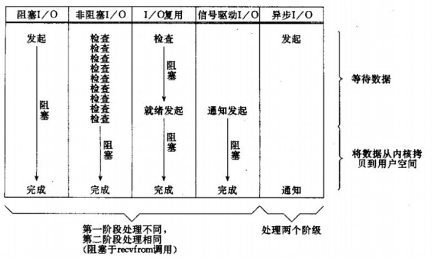

### 1. OSI七层模型各层的作用 
   
   

#### 物理层：

   并不是物理媒体本身，它只是开放系统中利用物理媒体实现物理连接的功能描述和执行连接的规程。

   物理层的媒体包括架空明线、平衡电缆、光纤、无线信道等。通信用的互连设备指DTE（Data Terminal Equipment）和DCE（Data Communications Equipment）间的互连设备。DTE即[数据终端设备](https://baike.baidu.com/item/数据终端设备)，又称[物理设备](https://baike.baidu.com/item/物理设备)，如计算机、终端等都包括在内。而DCE则是数据通信设备或电路连接设备，如[调制解调器](https://baike.baidu.com/item/调制解调器)等。数据传输通常是经过DTE-DCE，再经过DCE-DTE的路径。互连设备指将DTE、DCE连接起来的装置，如各种插头、插座。LAN中的各种粗、细同轴电缆、T型接头、插头、接收器、发送器、[中继器](https://baike.baidu.com/item/中继器)等都属物理层的媒体和连接器。

[物理层](https://baike.baidu.com/item/物理层)的主要功能是：

   ①  为数据端设备提供传送数据的通路，[数据通路](https://baike.baidu.com/item/数据通路)可以是一个[物理媒体](https://baike.baidu.com/item/物理媒体)，也可以是多个物理媒体连接而成。一次完整的数据传输，包括激活物理连接、传送数据和终止物理连接。所谓激活，就是不管有多少[物理媒体](https://baike.baidu.com/item/物理媒体)参与，都要在通信的两个[数据终端设备](https://baike.baidu.com/item/数据终端设备)间连接起来，形成一条通路。

   ②传输数据。[物理层](https://baike.baidu.com/item/物理层)要形成适合数据传输需要的实体，为数据传送服务。一是要保证数据能在其上正确通过，二是要提供足够的[带宽](https://baike.baidu.com/item/带宽)(带宽是指每秒钟内能通过的比特(Bit)数)，以减少信道上的拥塞。传输数据的方式能满足点到点，一点到多点，串行或并行，半双工或全双工，同步或[异步传输](https://baike.baidu.com/item/异步传输)的需要。

#### 数据链路：

   可以粗略地理解为数据通道。[物理层](https://baike.baidu.com/item/物理层)要为[终端设备](https://baike.baidu.com/item/终端设备)间的数据通信提供[传输介质](https://baike.baidu.com/item/传输介质)及其连接。介质是长期的，连接是有生存期的。在连接生存期内，收发两端可以进行不等的一次或多次数据通信。每次通信都要经过建立通信联络和拆除通信联络两个过程。这种建立起来的数据收发关系就叫做数据链路。而在[物理媒体](https://baike.baidu.com/item/物理媒体)上传输的数据难免受到各种不可靠因素的影响而产生差错，为了弥补[物理层](https://baike.baidu.com/item/物理层)上的不足，为上层提供无差错的数据传输，就要能对数据进行检错和纠错。[链路层](https://baike.baidu.com/item/链路层)应具备如下功能：

   链路连接的建立、拆除和分离；

   差错检测和恢复。还有链路标识，[流量控制](https://baike.baidu.com/item/流量控制)等等。

   独立的链路产品中最常见的当属网卡，网桥也是链路产品。

#### 网络层：

   当数据终端增多时。它们之间有中继设备相连，此时会出现一台[终端](https://baike.baidu.com/item/终端)要求不只是与惟一的一台而是能和多台终端通信的情况，这就产生了把任意两台[数据终端设备](https://baike.baidu.com/item/数据终端设备)的数据链接起来的问题，也就是[路由](https://baike.baidu.com/item/路由)或者叫寻径。另外，当一条物理信道建立之后，被一对用户使用，往往有许多空闲时间被浪费掉。人们自然会希望让多对用户共用一条链路，为解决这一问题就出现了逻辑信道技术和[虚拟电路](https://baike.baidu.com/item/虚拟电路)技术。

#### 传输层：

   有一个既存事实，即世界上各种[通信子网](https://baike.baidu.com/item/通信子网)在性能上存在着很大差异。例如电话交换网，分组交换网，公用数据交换网，局域网等[通信子网](https://baike.baidu.com/item/通信子网)都可互连，但它们提供的[吞吐量](https://baike.baidu.com/item/吞吐量)，[传输速率](https://baike.baidu.com/item/传输速率)，数据延迟通信费用各不相同。对于会话层来说，却要求有一性能恒定的界面。[传输层](https://baike.baidu.com/item/传输层)就承担了这一功能。

#### 会话层：

   会话单位的控制层，其主要功能是按照在应用进程之间约定的原则，按照正确的顺序收、发数据，进行各种形态的对话。会话层规定了会话服务用户间会话连接的建立和拆除规程以及数据传送规程。

   会话层提供的服务是应用建立和维持会话，并能使会话获得同步。会话层使用[校验点](https://baike.baidu.com/item/校验点)可使通信会话在通信失效时从校验点继续恢复通信。这种能力对于传送大的文件极为重要。

#### 表示层：

   其主要功能是把应用层提供的信息变换为能够共同理解的形式，提供字符代码、数据格式、控制信息格式、加密等的统一表示。表示层的作用之一是为异种机通信提供一种公共语言，以便能进行互操作。这种类型的服务之所以需要，是因为不同的计算机体系结构使用的数据表示法不同。例如，IBM[主机](https://baike.baidu.com/item/主机)使用EBCDIC编码，而大部分PC机使用的是ASCII码。在这种情况下，便需要表示层来完成这种转换。

#### 应用层:

   向应用程序提供服务，这些服务按其向应用程序提供的特性分成组，并称为服务元素。有些可为多种应用程序共同使用，有些则为较少的一类应用程序使用。应用层是开放系统的最高层，是直接为应用进程提供服务的。其作用是在实现多个系统应用进程相互通信的同时，完成一系列业务处理所需的服务。

### TCP\IP协议
   
   TCP 是面向连接的、可靠的流协议,必须建立连接，通讯完成时要拆除连接。
   
   UDP是面向无连接的通讯协议，UDP通讯时不需要接收方确认，属于不可靠的传输，可能会出现丢包现象。
   
#### 端口号

   端口号用来识别同一台计算机中进行通信的不同应用程序。因此，它也被称为程序地址。
   
    

### TCP/IP中的数据包 

   每个分层中，都会对所发送的数据附加一个首部，在这个首部中包含了该层必要的信息，如发送的目标地址以及协议相关信息。通常，为协议提供的信息为包首部，所要发送的内容为数据。在下一层的角度看，从上一层收到的包全部都被认为是本层的数据。

   网络中传输的数据包由两部分组成：一部分是协议所要用到的首部，另一部分是上一层传过来的数据。首部的结构由协议的具体规范详细定义。在数据包的首部，明确标明了协议应该如何读取数据。反过来说，看到首部，也就能够了解该协议必要的信息以及所要处理的数据。

① 应用程序处理
 首先应用程序会进行编码处理，这些编码相当于 OSI 的表示层功能；
 编码转化后，邮件不一定马上被发送出去，这种何时建立通信连接何时发送数据的管理功能，相当于 OSI 的会话层功能。 

② TCP 模块的处理
 TCP 根据应用的指示，负责建立连接、发送数据以及断开连接。TCP 提供将应用层发来的数据顺利发送至对端的可靠传输。为了实现这一功能，需要在应用层数据的前端附加一个 TCP 首部。 

③ IP 模块的处理
 IP 将 TCP 传过来的 TCP 首部和 TCP 数据合起来当做自己的数据，并在 TCP 首部的前端加上自己的 IP 首部。IP 包生成后，参考路由控制表决定接受此 IP 包的路由或主机。 

④ 网络接口（以太网驱动）的处理
 从 IP 传过来的 IP 包对于以太网来说就是数据。给这些数据附加上以太网首部并进行发送处理，生成的以太网数据包将通过物理层传输给接收端。 

⑤ 网络接口（以太网驱动）的处理
 主机收到以太网包后，首先从以太网包首部找到 MAC 地址判断是否为发送给自己的包，若不是则丢弃数据。
 如果是发送给自己的包，则从以太网包首部中的类型确定数据类型，再传给相应的模块，如 IP、ARP 等。这里的例子则是 IP 。 

⑥ IP 模块的处理
 IP 模块接收到 数据后也做类似的处理。从包首部中判断此 IP 地址是否与自己的 IP 地址匹配，如果匹配则根据首部的协议类型将数据发送给对应的模块，如 TCP、UDP。这里的例子则是 TCP。
 另外吗，对于有路由器的情况，接收端地址往往不是自己的地址，此时，需要借助路由控制表，在调查应该送往的主机或路由器之后再进行转发数据。 

⑦ TCP 模块的处理
 在 TCP 模块中，首先会计算一下校验和，判断数据是否被破坏。然后检查是否在按照序号接收数据。最后检查端口号，确定具体的应用程序。数据被完整地接收以后，会传给由端口号识别的应用程序。 

⑧ 应用程序的处理
 接收端应用程序会直接接收发送端发送的数据。通过解析数据，展示相应的内容。
 
    

###  建立和断开链接
   
   

### 什么是Socket

   Socket是应用层与TCP/IP协议族通信的中间软件抽象层，它是一组接口。

   在设计模式中，Socket其实就是一个门面模式，它把复杂的TCP/IP协议族隐藏在Socket接口后面，对用户来说，一组简单的接口就是全部，让Socket去组织数据，以符合指定的协议。
   
   
 

### 连接类型

#### 短连接：

连接->传输数据->关闭连接
也可以这样说：短连接是指SOCKET连接后发送后接收完数据后马上断开连接。

#### 长连接：

连接->传输数据->保持连接 -> 传输数据-> 。。。 ->关闭连接。
长连接指建立SOCKET连接后不管是否使用都保持连接，但安全性较差。

#### 什么时候用长连接，短连接？

  长连接多用于操作频繁，点对点的通讯，而且连接数不能太多情况，。每个TCP连接都需要三步握手，这需要时间，如果每个操作都是先连接，再操作的话那么处理速度会降低很多，所以每个操作完后都不断开，次处理时直接发送数据包就OK了，不用建立TCP连接。例如：**数据库的连接**用长连接， 如果用短连接频繁的通信会造成socket错误，而且频繁的socket 创建也是对资源的浪费。

 而像WEB网站的http服务一般都用短链接，因为长连接对于服务端来说会耗费一定的资源，而像WEB网站这么频繁的成千上万甚至上亿客户端的连接用短连接会更省一些资源，如果用长连接，而且同时有成千上万的用户，如果每个用户都占用一个连接的话，那可想而知吧。所以并发量大，但每个用户无需频繁操作情况下需用短连好。

 总之，长连接和短连接的选择要视情况而定。

 

#### 文件描述符（file descriptor）：

在[UNIX](https://baike.baidu.com/item/UNIX)、[Linux](https://baike.baidu.com/item/Linux)的[系统调用](https://baike.baidu.com/item/系统调用)中，大量的系统调用都是依赖于文件描述符。

内核系统把应用程序可以操作的资源都抽象成了文件概念，比如说硬件设备，socket，流，磁盘，进程，线程；文件描述符就是索引（指针）

#### 应用程序获取数据的两个阶段：

数据准备:应用程序无法直接操作我们的硬件资源，需要操作系统资源时，先通知我们的内核，内核检查是否有就绪的资源，如果有则先把对应数据加载到内核空间。

数据拷贝：把数据资源从内核空间复制到应用程序的用户空间

   

### 零拷贝

现代操作系统都使用虚拟内存，使用虚拟的地址取代物理地址，这样做的好处是：

1.一个以上的虚拟地址可以指向同一个物理内存地址，

2.虚拟内存空间可大于实际可用的物理地址；

利用第一条特性可以把内核空间地址和用户空间的虚拟地址映射到同一个物理地址，这样DMA就可以填充对内核和用户空间进程同时可见的缓冲区了，大致如下图所示：

（硬盘或者网卡）

### Linux网络IO模型
   
   

#### 同步和异步，阻塞和非阻塞

**同步和异步关注的是结果消息的通信机制(强调结果返回的形式)：**

同步:同步的意思就是调用方需要主动等待结果的返回

异步:异步的意思就是不需要主动等待结果的返回，而是通过其他手段比如，状态通知，回调函数等。

**阻塞和非阻塞主要关注的是等待结果返回调用方的状态(强调对调用端的影响)：**

阻塞:是指结果返回之前，当前线程被挂起，不做任何事

非阻塞:是指结果在返回之前，线程可以做一些其他事，不会被挂起。

**阻塞I/O模型：**

 应用程序调用一个IO函数，导致应用程序阻塞，等待数据准备好。 如果数据没有准备好，一直等待….数据准备好了，从内核拷贝到用户空间,IO函数返回成功指示。

 当调用recv()函数时，系统首先查是否有准备好的数据。如果数据没有准备好，那么系统就处于等待状态。当数据准备好后，将数据从系统缓冲区复制到用户空间，然后该函数返回。在套接应用程序中，当调用recv()函数时，未必用户空间就已经存在数据，那么此时recv()函数就会处于等待状态。
 
  

**非阻塞IO模型** 

  我们把一个SOCKET接口设置为非阻塞就是告诉内核，当所请求的I/O操作无法完成时，不要将进程睡眠，而是返回一个错误。这样我们的I/O操作函数将不断的测试数据是否已经准备好，如果没有准备好，继续测试，直到数据准备好为止。在这个不断测试的过程中，会大量的占用CPU的时间。上述模型绝不被推荐。

  把SOCKET设置为非阻塞模式，即通知系统内核：在调用Windows Sockets API时，不要让线程睡眠，而应该让函数立即返回。在返回时，该函数返回一个错误代码。图所示，一个非阻塞模式套接字多次调用recv()函数的过程。前三次调用recv()函数时，内核数据还没有准备好。因此，该函数立即返回WSAEWOULDBLOCK错误代码。第四次调用recv()函数时，数据已经准备好，被复制到应用程序的缓冲区中，recv()函数返回成功指示，应用程序开始处理数据。
   
   
   
**IO复用模型：**

  简介：主要是select和epoll；对一个IO端口，两次调用，两次返回，比阻塞IO并没有什么优越性；关键是能实现同时对多个IO端口进行监听；
 
  I/O复用模型会用到select、poll、epoll函数，这几个函数也会使进程阻塞，但是和阻塞I/O所不同的的，这两个函数可以同时阻塞多个I/O操作。而且可以同时对多个读操作，多个写操作的I/O函数进行检测，直到有数据可读或可写时，才真正调用I/O操作函数。

当用户进程调用了select，那么整个进程会被block；而同时，kernel会“监视”所有select负责的socket；当任何一个socket中的数据准备好了，select就会返回。这个时候，用户进程再调用read操作，将数据从kernel拷贝到用户进程。
   这个图和blocking IO的图其实并没有太大的不同，事实上还更差一些。因为这里需要使用两个系统调用(select和recvfrom)，而blocking IO只调用了一个系统调用(recvfrom)。但是，用select的优势在于它可以同时处理多个connection。（select/epoll的优势并不是对于单个连接能处理得更快，而是在于能处理更多的连接。）

   

 

##### 信号驱动IO

   简介：两次调用，两次返回；

  首先我们允许套接口进行信号驱动I/O,并安装一个信号处理函数，进程继续运行并不阻塞。当数据准备好时，进程会收到一个SIGIO信号，可以在信号处理函数中调用I/O操作函数处理数据。

   
   
##### 异步IO模型

  当一个异步过程调用发出后，调用者不能立刻得到结果。实际处理这个调用的部件在完成后，通过状态、通知和回调来通知调用者的输入输出操作。

在linux的异步IO模型中,并没有真正实现异步通道，最终的实现还是等同于调用Epoll。
    
   
 

**LinuxIO****模型总结：**

 

### select、poll、epoll的区别

 1、支持一个进程所能打开的最大连接数

| select | 单个进程所能打开的最大连接数有FD_SETSIZE宏定义，其大小是32个整数的大小（在32位的机器上，大小就是32*32，同理64位机器上FD_SETSIZE为32*64），可以对进行修改，然后重新编译内核，但是性能可能会受到影响。 |
| ------ | ------------------------------------------------------------ |
| poll   | poll本质上和select没有区别，但是它没有最大连接数的限制，原因是它是基于链表来存储的 |
| epoll  | 连接数有上限，但是很大，1G内存的机器上可以打开10万左右的连接，2G内存的机器可以打开20万左右的连接 |

2、FD剧增后带来的IO效率问题

| select | 因为每次调用时都会对连接进行线性遍历，所以随着FD的增加会造成遍历速度慢的“线性下降性能问题”。 |
| ------ | ------------------------------------------------------------ |
| poll   | 同上                                                         |
| epoll  | 因为epoll内核中实现是根据每个fd上的callback函数来实现的，只有活跃的socket才会主动调用callback，所以在活跃socket较少的情况下，使用epoll没有前面两者的线性下降的性能问题，但是所有socket都很活跃的情况下，可能会有性能问题。 |

3、 消息传递方式

| select | 内核需要将消息传递到用户空间，都需要内核拷贝动作 |
| ------ | ------------------------------------------------ |
| poll   | 同上                                             |
| epoll  | epoll通过内核和用户空间共享一块内存来实现的。    |

#### EPOLL的水平触发和边缘触发

#### Level_triggered(水平触发)：

当被监控的文件描述符上有可读写事件发生时，epoll_wait()会通知处理程序去读写。如果这次没有把数据一次性全部读写完(如读写缓冲区太小)，那么下次调用 epoll_wait()时，它还会通知你在上没读写完的文件描述符上继续读写，当然如果你一直不去读写，它会一直通知你！！！如果系统中有大量你不需要读写的就绪文件描述符，而它们每次都会返回，这样会大大降低处理程序检索自己关心的就绪文件描述符的效率！！！

#### Edge_triggered(边缘触发)：

当被监控的文件描述符上有可读写事件发生时，epoll_wait()会通知处理程序去读写。如果这次没有把数据全部读写完(如读写缓冲区太小)，那么下次调用epoll_wait()时，它不会通知你，也就是它只会通知你一次，直到该文件描述符上出现第二次可读写事件才会通知你！！！这种模式比水平触发效率高，系统不会充斥大量你不关心的就绪文件描述符！！

 select(),poll()模型都是水平触发模式，信号驱动IO是边缘触发模式，epoll()模型即支持水平触发，也支持边缘触发，默认是水平触发。

 

 