## 1. 商品模块-秒杀

### 1.1 商品模块业务场景介绍: 

#### 1.1.1 商品模块业务详解

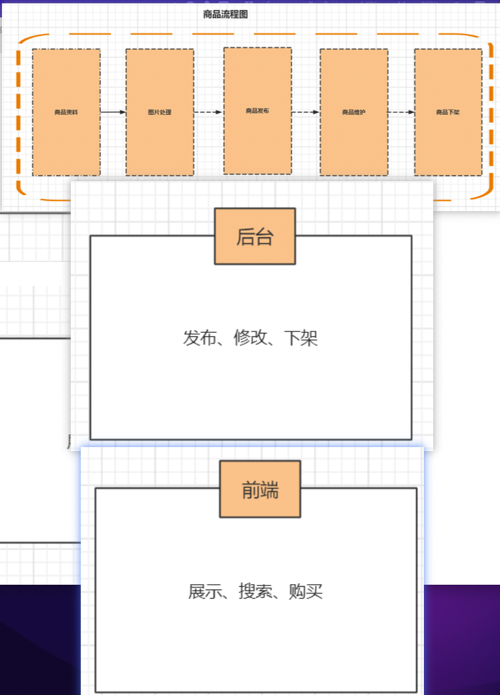

### 1.2 商品模块技术难点

#### 1.2.1 表的设计:打开游览器访问京东详细页

##### 1.2.1.1 问题:

   商品这块的数据库如何更好的设计，商品详细页显示这么多信息，是一张表还是多张表更好了?

   这个问题到底是一张表还是多张表，我们判断依据是什么?我们判断商品详细页里面显示的这些信息他们的关系。通过他们的关系，我们才能知道到底是设计一张表还是多张表。

##### 1.2.1.2 一张表:

   如果是一张表存储所有数据的话，那么查询是非常方便的，这是其优点，但是你会发现存储的时候是不是很麻烦。不通类型不同大小不通商品等等都不一样，那这样的一张表设计起来实在是太复杂了。
   
##### 1.2.1.3 多张表:

   如果是多张表的话业务更加清晰，维护起来也更加方便，但是你会发现查询好像会非常的复杂，一个商品页面我们需要查很多的表和数据。

   我们来分析下刚才我们看到了一个商品有很多的名词、比如分类、商品属性、商品评价 那他们的关系是?

   分析:

    分类:一个商品属于某个分类 商品属性:一个商品有N个属性，不同的商品有不同的属性 
    
    商品品牌:一个商品属于一个品牌，一个品牌下面有多个商品

    商品参数:不同的商品参数不一样

    商品活动:一个商品可以有多个活动。

    评价:一个商品有多条评论

   所以综合上述所述，根据商品详细页的显示，我们正确的方式是根据不通的数据类型按不通的 表进行存储。 我们现在已经看到商品详细页需要显示这么多内容，那这些内容是的作用是什么，以及他为什 么需要这么多数据。
   
##### 1.2.1.4 为什么商品需要分类?

   我们知道商品是有不通类型的，比如有吃的 比如有穿的比如还有其他的用的。不通的商品用途 不一样。我们一开始就可以按分类来进行划分我们的商品，这个就有点像我们去看论坛的分类 是一样的。

#### 1.2.2 商品模块 表设计 演变

##### 1.2.2.1 第一个版本:商品+分类

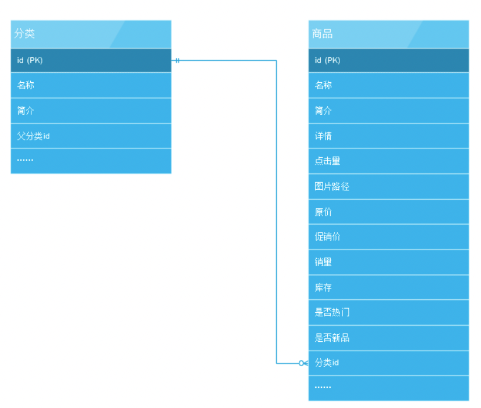

   目前这个方案有什么问题了?我们慢慢发现一个问题，只有分类并不能适应所有的需求，比如 nike鞋和nikeT恤，用户可能希望先看nike的所有商品，这个模型就不能满足。
   我们想在这个关 系中，加入“品牌”概念
   
##### 1.2.2.2 第二个版本:商品+分类+品牌

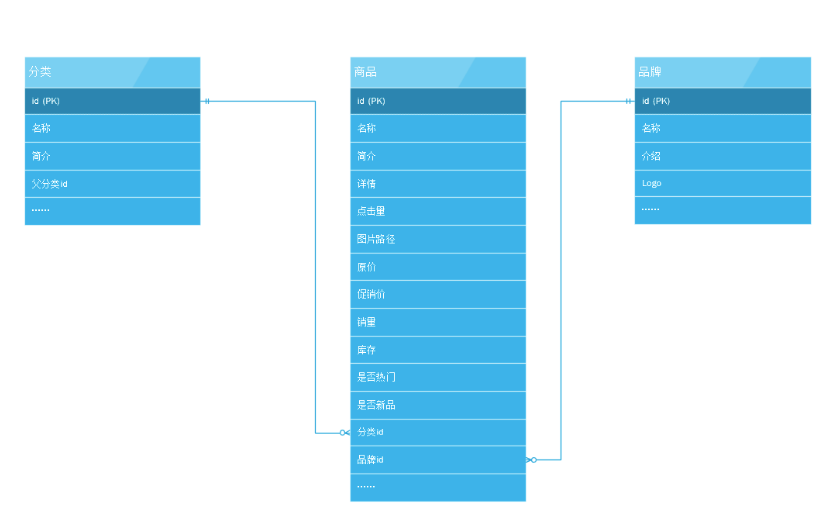

   这样基本用户可以在首页上通过分类或者品牌找到自己想要的商品，也可以直接查看热门的商品和新上架的商品。

   但是问题也来了，用户在进入分类后，展示在用户面前的是很多很多商品，用户希望再通过筛选查询出更接近 他目标的商品?

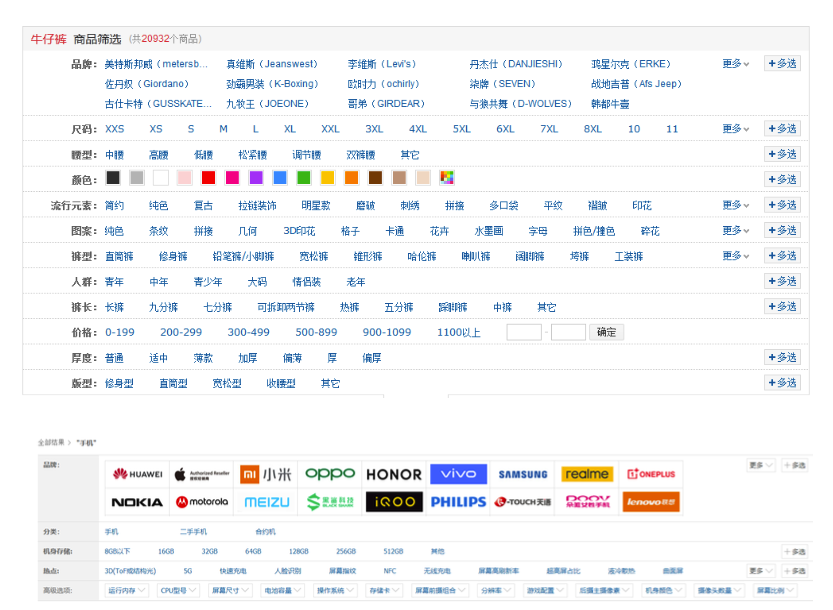

##### 1.2.2.3 商品+分类+品牌+属性

   用户可以通过这些筛选条件进一步缩小自己的目标范围，那么问题又来了，这样的产品需求 排在程序员面前，怎么去实现它?经过分析，我们找出了一个方法，我们知道商品之间的属性可能存在着较大的差别，
   比如牛仔裤它有版型、腰型、裤长等属性;而电脑它有CPU、显卡等属 性，各类商品的属性是不同的。再进一步想，休闲裤也版型、腰型、裤长等属性;台式电脑或 者笔记本电脑都有CPU、显卡等属性。
   所以我们得出: 一个分类对应若干属性，而一个属性，对应若干属性选项，而一个具体商品又对应若干属性选项(例如具体一条牛仔裤，他的裤长:7 分，裤型:直筒)。

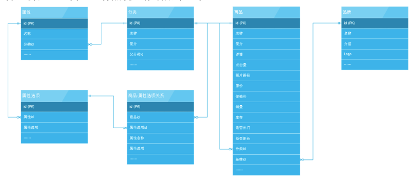

   从图上可以看出，分类和属性的关系(例如:“牛仔裤”分类下有裤型、裤长、版型等属 性)、属性和属性选项的关系(例如:裤长属性有长款、九分裤、七分裤的选项)、
   商品和属性选项的关系(例如某条牛仔裤的裤长是7分裤)。至此，我们知道一个商品的分类、品牌以及 它有什么属性和对应的属性值。那么通过筛选条件，自然就可以查询出指定的商品。
   这里特别说一句，价格也是属性，不要设想用商品表中的价格字段去做计算。这不利于查询也增加了复 杂度，让商家编辑人员用属性来设置并保证他的正确性。


   这个页面展示商品的所有信息，按照之前的设计好像都可以满足。但是我们似乎感觉错过了什么，在图上右边我们发现该商品当前的颜色和尺寸，并且允许用户可以选择其他的颜色和尺寸。
   这给我们带来了疑惑，这里的“颜色”和“尺寸”是什么，一件商品的不同颜色不同尺寸是算一个商品还是多个商品。
   
##### 1.2.2.4 第四个版本:商品+分类+品牌+属性+规格

   经过思考后，我们发现我们混淆了两个概念——“商品”和“货品”。不同规格的货品作为独 立的商品。比如一条裤子的有L尺寸、M尺寸、一个U盘有16G还是32G的，都是同样的货品，不同规格的商品。
   可以认为货品和商品是一对多的关系。弄清了这个概念，处理这个需求就容易多 了，这里的“颜色”、“尺寸”我们就作为“规格”来处理，而红色、黑色;L号、M号我们视 为规格的选项或者说规格值。
   一件货品对应若干规格，而具有某一规格值的货品就是商品。 
   
   spu:iphone12 sku:金色64 iphone12

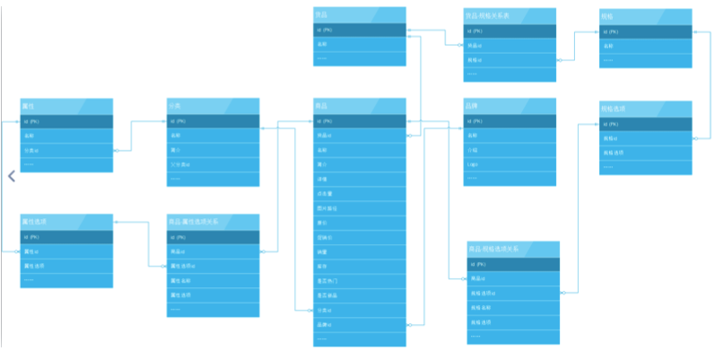

   可以根据这个模型数据生成对应的商品索引，达到准确搜索的目的。商品模块还会和其他模块一起协作，比如用户系统、订单系统、支付系统等。一般情况下我们会把商品业务独立出来做成“商品中心”的服务，
   集中处理商品查询、更新、发布等业务，支撑其他业务。

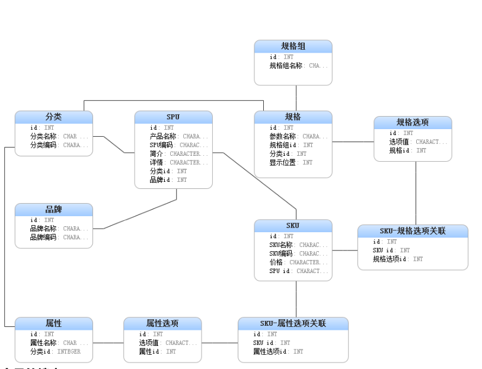

#### 1.3 商品的搜索: 

   搜索引擎: elasticsearch、 solr 等 

#### 1.4 商品的展示:

### 1.3 商品模块展示技术难点

   商品详情页是展示商品详细信息的一个页面，承载在网站的大部分流量和订单的入口。京东商城目前有通用版、全球购、闪购、易车、惠买车、服装、拼购、今日抄底等许多套模板。各套模板的元数据是一样的，
   只是展示方式不一样。目前商品详情页个性化需求非常多，数据来源也是非常多的，而且许多基础服务做不了的都放我们这，因此我们需要一种架构能快速响应和优雅的解决这些需求问题。
   因此我们重新设计了商品详情页的架构，主要包括三部分:商品详情页系统、商品详情页统一服务系统和商品详情页动态服务系统;商品详情页系统负责静的部分，而统一服务负责动的部分，
   而动态服务负责给内网其他系统提供一些数据服务。


#### 1.3.1 商品详情页前端结构

   前端展示可以分为这么几个维度:商品维度(标题、图片、属性等)、主商品维度(商品介 绍、规格参数)、分类维度、商家维度、店铺维度等;
   另外还有一些实时性要求比较高 的如实时价格、实时促销、广告词、配送至、预售等是通过异步加载。

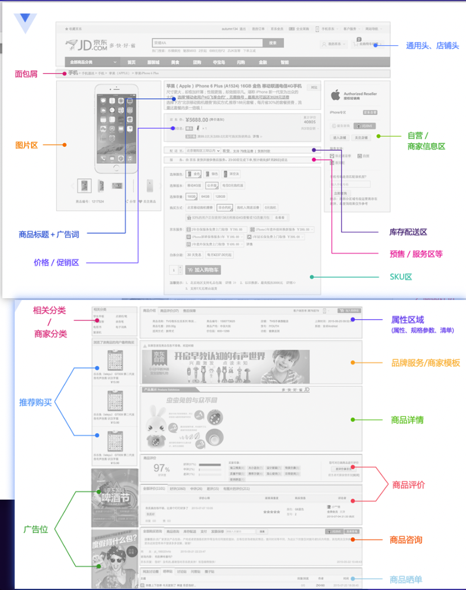

   SPU: Standard Product Unit (标准化产品单元),SPU是商品信息聚合的最小单位，是一组 可复用、易检索的标准化信息的集合，该集合描述了一个产品的特性。

   SKU: Stock keeping unit(库存量单位) SKU即库存进出计量的单位(买家购买、商家进货、 供应商备货、工厂生产都是依据SKU进行的)，在服装、鞋类商品中使用最多最普遍。 
   例如纺 织品中一个SKU通常表示:规格、颜色、款式。SKU是物理上不可分割的最小存货单元。
   
#### 1.3.2 单品页流量特点

   热点少，各种爬虫、比价软件抓取。

   1、换数据库

   2、分库分表

##### 1.3.2.1 压测测试

###### 1. jmeter模板

###### 2. 后台 代码 

```java
public class PmsProductServiceImpl implements PmsProductService {
    public PmsProductParam getProductInfo1(Long id) {
        PmsProductParam productInfo = portalProductDao.getProductInfo(id);
        if (null == productInfo) {
            return null;
        }
        FlashPromotionParam promotion = flashPromotionProductDao.getFlashPromotion(id);
        if (!ObjectUtils.isEmpty(promotion)) {
            productInfo.setFlashPromotionCount(promotion.getRelation().get(0).getFlashPromotionCount());
            productInfo.setFlashPromotionLimit(promotion.getRelation().get(0).getFlashPromotionLimit());
            productInfo.setFlashPromotionPrice(promotion.getRelation().get(0).getFlashPromotionPrice());
            productInfo.setFlashPromotionRelationId(promotion.getRelation().get(0).getId());
            productInfo.setFlashPromotionEndDate(promotion.getEndDate());
            productInfo.setFlashPromotionStartDate(promotion.getStartDate());
            productInfo.setFlashPromotionStatus(promotion.getStatus());
        }
        return productInfo;
    }
}
```

###### 3. 压测结果:

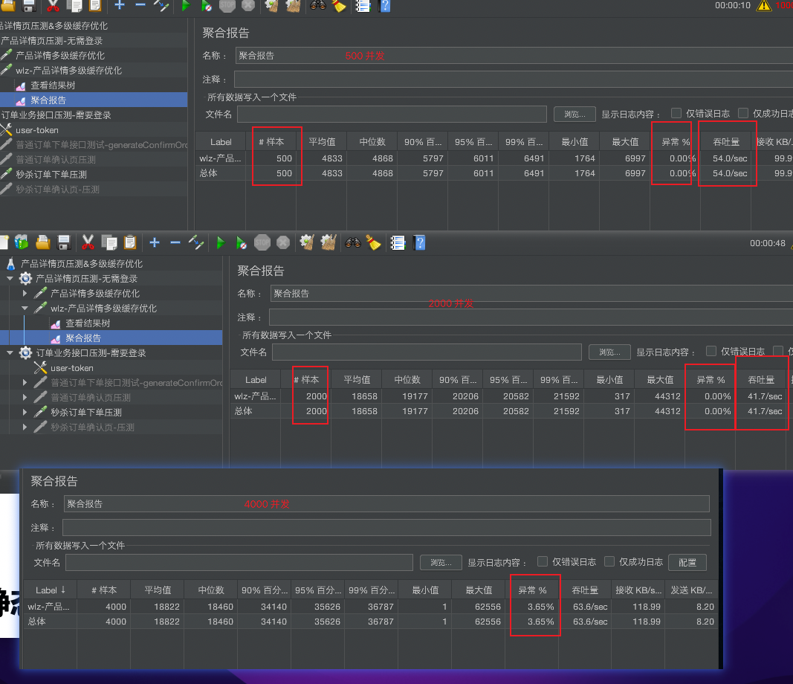

### 1.4 静态化处理

   FreeMarker 是一款模板引擎:即基于模板和数据源生成输出文本(html网页，配置文件，电 子邮件，源代码)的通用工具。它是一个 java 类库，最初被设计用来在MVC模式的Web开发框架中生成HTML页面，
   它没有被绑定到Servlet或HTML或任意Web相关的东西上。也可以用 于非Web应用环境中。模板编写使用FreeMarker Template Language(FTL)。使用方式类似JSP的EL表达式。
   模板中 专注于如何展示数据，模板之外可以专注于要展示什么数据。

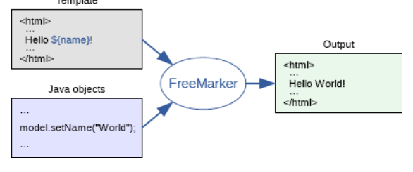

### 1.5 架构方案的问题

#### 1.5.1 问题一:

   我们知道数据新增分:增量和全量数据 如果后台的小二新增了很多的商品，那我们都要对这些商品进行静态化，但是现在有个问题。 那这些数据如何同步了?这是一个新增商品同步的问题，
   那这个问题怎么解决比较好了?。不同应用部署在不同服务器甚至在不同的机房不同的国家。

   1、通过网络同步的方式 就是其中一台服务器静态化之后，然后把文件同步到其他应用服务器 上去。比如我们的linux命令scp方式。这种方式虽然可行，但是我们发现问题还是蛮多的，
   有多少个节点就需要同步多少份，等于是商品的数量*服务器的应用数数。很显然这种办法不是最 优的解决办法 如果上述办法无法解决，那我们就用另外的方案，同学们你们觉得还有其他的方案没有?

   2、定时任务:可以在某个应用用一个定时任务，然后分别去执行数据库需要静态化的数据即 可，可以解决上述1数据同步的问题，因为所有的任务都是在本机运行，就不需要数据同步了。 
   但是也有一个问题。就是如何避免不通的机器跑的数据不要重复，也就是A和B定时任务都跑了 一份商品。这个是这种方案需要解决的。(比较直观的就是上锁) 
   
   3、消息中间件:还有一种办法就是通过消息中间件来解决。订阅topic然后生成当前服务器静 态化的页面。

#### 1.5.2 问题二:

   我们的freemark它是数据要事先按我这个模板生产好的，那就是说一定你改了模板，如果要生 效的话，需要重新在把数据取出来和我们这个模板进行匹配生产更多的的静态html文件。那这 是一个比较大的问题
   
   如果后台数据有变更呢?如何及时同步到其它服务端? 如果页面静态化了，我们搜索打开一个商品详细页，怎么知道要我需要的访问的静态页面? 万一我们模板需要修改了怎么办? 牵一发动全身。

### 1.6 后台优化:

   后台问题描述：

        访问数据库查询商品信息:
        读多写少

#### 1.6.1 前端静态化页面:

   我们对数据进行静态化，也是有很多问题的，比如我们商品如果过多， freemark模板一定修改之后，我们所有的商品都需要重新再次生产静态化，这个工作量实在是 太大了。

#### 1.6.2 引入缓存:

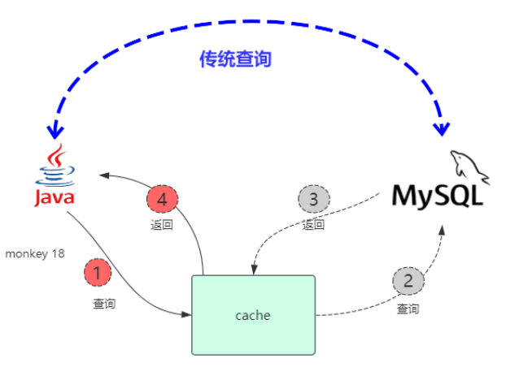

##### 1.6.2.1 好处:

   加入redis之后我们发现提高了可以把之前请求 数据库查询的商品都缓存到redis中，通过对 redis的访问来减少对数据里的依赖，减少了依赖本质就是减少了磁盘IO。

##### 1.6.2.2 问题:

   提高请求的吞吐量，除了减少磁盘IO，还有网络IO，我们可以发现，请求redis其实也会涉及到 网络IO，我们所有的请求都要走xxx端口号。那有没有更好的优化思路了。

##### 1.6.2.3 缓存方案 

   1. 最终一致性方案: 设置超时时间来解决
  
   2、实时一致性方案: canal binlog

##### 1.6.2.4 优化 

    1. 高并发 、 通过测试可以发现, 实际请求中， 并不止一次访问数据库, 理论 是加入缓存只访问一次数据，但是实际上 不止访问了一次数据库，就有了并发问题， 添加分布式锁，解决并发问题

    2. 对数据的压缩 从而可以 减少内存，

#### 1.6.3 缓存实战: 

##### 1.6.1.1 版本1:  加 redis 缓存 

###### 1. 实现 

```java
public class PmsProductServiceImpl implements PmsProductService {
  /**
     * 获取商品详情信息  加入redis
     *
     * @param id 产品ID
     */
    public PmsProductParam getProductInfo2(Long id) {
        PmsProductParam productInfo = null;
        //从缓存Redis里找
        productInfo = redisOpsUtil.get(RedisKeyPrefixConst.PRODUCT_DETAIL_CACHE + id, PmsProductParam.class);
        if (null != productInfo) {
            return productInfo;
        }
        productInfo = portalProductDao.getProductInfo(id);
        if (null == productInfo) {
            log.warn("没有查询到商品信息,id:" + id);
            return null;
        }
        checkFlash(id, productInfo);
        redisOpsUtil.set(RedisKeyPrefixConst.PRODUCT_DETAIL_CACHE + id, productInfo, 3600, TimeUnit.SECONDS);
        return productInfo;
    }

    private void checkFlash(Long id, PmsProductParam productInfo) {
        FlashPromotionParam promotion = flashPromotionProductDao.getFlashPromotion(id);
        if (!ObjectUtils.isEmpty(promotion)) {
            productInfo.setFlashPromotionCount(promotion.getRelation().get(0).getFlashPromotionCount());
            productInfo.setFlashPromotionLimit(promotion.getRelation().get(0).getFlashPromotionLimit());
            productInfo.setFlashPromotionPrice(promotion.getRelation().get(0).getFlashPromotionPrice());
            productInfo.setFlashPromotionRelationId(promotion.getRelation().get(0).getId());
            productInfo.setFlashPromotionEndDate(promotion.getEndDate());
            productInfo.setFlashPromotionStartDate(promotion.getStartDate());
            productInfo.setFlashPromotionStatus(promotion.getStatus());
        }
    }
}
```

###### 2. 压测 

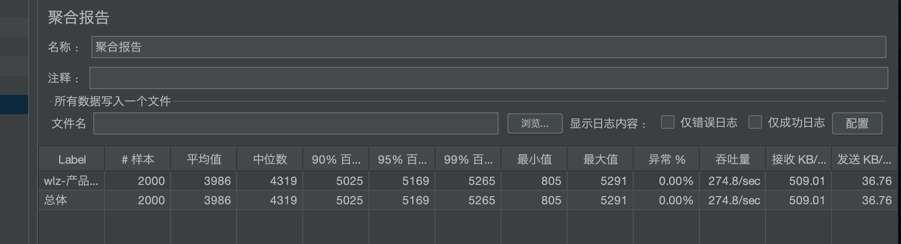

   发现吞吐量有一定的提高。但是问题还是有的。

   通过测试可以发现, 实际请求中， 并不止一次访问数据库, 理论 是加入缓存只访问一次数据，但是实际上 不止访问了一次数据库，就有了并发问题。 

##### 1.6.1.2 版本2 分布式锁(redisson)、 本地缓存、redis缓存

###### 1. 实现 

```java
public class PmsProductServiceImpl implements PmsProductService {
    /**
     * 获取商品详情信息 分布式锁、 本地缓存、redis缓存
     *
     * @param id 产品ID
     */
    public PmsProductParam getProductInfo3(Long id) {
        PmsProductParam productInfo = null;
        productInfo = cache.get(RedisKeyPrefixConst.PRODUCT_DETAIL_CACHE + id);
        if (null != productInfo) {
            return productInfo;
        }
        productInfo = redisOpsUtil.get(RedisKeyPrefixConst.PRODUCT_DETAIL_CACHE + id, PmsProductParam.class);
        if (productInfo != null) {
            log.info("get redis productId:" + productInfo);
            cache.setLocalCache(RedisKeyPrefixConst.PRODUCT_DETAIL_CACHE + id, productInfo);
            return productInfo;
        }
        try {
            if (zkLock.lock(lockPath + "_" + id)) {
                productInfo = portalProductDao.getProductInfo(id);
                if (null == productInfo) {
                    return null;
                }
                checkFlash(id, productInfo);
                log.info("set db productId:" + productInfo);
                redisOpsUtil.set(RedisKeyPrefixConst.PRODUCT_DETAIL_CACHE + id, productInfo, 3600, TimeUnit.SECONDS);
                cache.setLocalCache(RedisKeyPrefixConst.PRODUCT_DETAIL_CACHE + id, productInfo);
            } else {
                log.info("get redis2 productId:" + productInfo);
                productInfo = redisOpsUtil.get(RedisKeyPrefixConst.PRODUCT_DETAIL_CACHE + id, PmsProductParam.class);
                if (productInfo != null) {
                    cache.setLocalCache(RedisKeyPrefixConst.PRODUCT_DETAIL_CACHE + id, productInfo);
                }
            }
        } finally {
            log.info("unlock :" + productInfo);
            zkLock.unlock(lockPath + "_" + id);
        }
        return productInfo;
    }
}
```

###### 2. 压测 

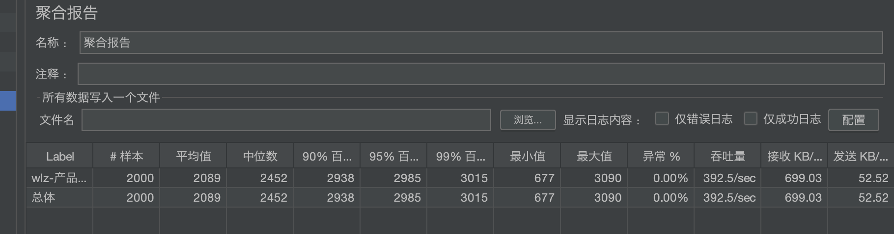

### 1.7 缓存不足:

#### 1.7.1 缓存击穿问题(热点数据单个key)

   对于一些设置了过期时间的key，如果这些key可能会在某些时间点被超高并发地访问，是一种 非常“热点”的数据。这个时候，需要考虑一个问题:缓存被“击穿”的问题，这个和缓存雪崩的区别在于这里针对某一key缓存，
   前者则是很多key。

##### 1.7.1.1 解决方案:

   1.加锁，在未命中缓存时，通过加锁避免大量请求访问数据库 
   
   2.不允许过期。物理不过期，也就是不设置过期时间。而是逻辑上定时在后台异步的更新数据。 
   
   3.采用二级缓存。L1缓存失效时间短，L2缓存失效时间长。请求优先从L1缓存获取数据，如果 未命中，则加锁，保证只有一个线程去数据库中读取数据然后再更新到L1和L2中。
   然后其他线 程依然在L2缓存获取数据。

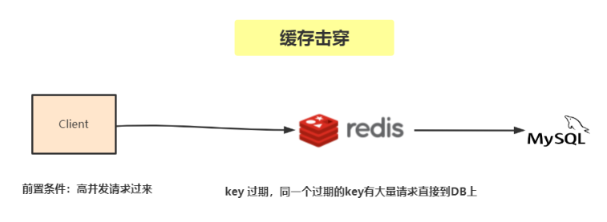

#### 1.7.2 缓存穿透问题(恶意攻击、访问不存在数据)

   缓存穿透是指查询一个一定不存在的数据，由于缓存是不命中时被动写的，并且出于容错考 虑，如果从存储层查不到数据则不写入缓存，这将导致这个不存在的数据每次请求都要到存储层去查询，
   失去了缓存的意义。在流量大时，可能DB就挂掉了，要是有人利用不存在的key频 繁攻击我们的应用，这就是漏洞。

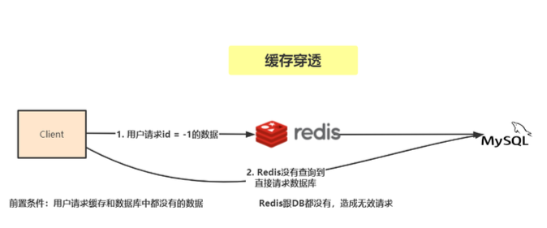

##### 1.7.2.1 解决方案

   1、最常见的则是采用布隆过滤器，将所有可能存在的数据哈希到一个足够大的 bitmap中，一个一定不存在的数据会被 这个bitmap拦截掉，从而避免了对底层存储系统的查 询压力。      
   
   2、另外也有一个更为简单粗暴的方法(我们采用的就是这种)，如果一个查询返回 的数据为空(不管是数 据不存在，还是系统故障)，我们仍然把这个空结果进行缓存，但它的 过期时间会很短，最长不超过五分钟。

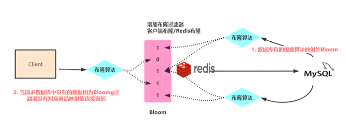

#### 1.7.3 缓存雪崩(同一时间失效，并发量大)

   缓存雪崩是指在我们设置缓存时采用了相同的过期时间，导致缓存在某一时刻同时失效，请求全 部转发到DB，DB瞬时压力过重雪崩。

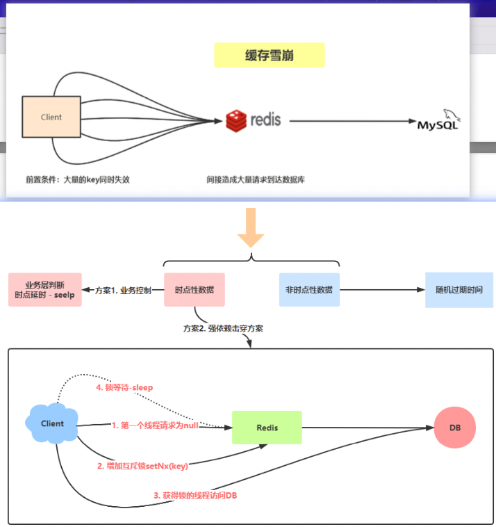

##### 1.7.3.1 解决方案

   1、缓存失效时的雪崩效应对底层系统的冲击非常可怕。大多数系统设计者考虑用加锁或者队列 的方式保证缓存的单线 程(进程)写，从而避免失效时大量的并发请求落到底层存储系统上。 
   这里分享一个简单方案就时讲缓存失效时间分散开，比如我们可以在原有的失效时间基础上增 加一个随机值，比如1-5分钟随机，这样每一个缓存的过期时间的重复率就会降低，就很难引发 集体失效的事件。

   2、事前:这种方案就是在发生雪崩前对缓存集群实现高可用，如果是使用 Redis，可以使用 主 从+哨兵 ，Redis Cluster 来避免 Redis 全盘崩溃的情况。

   3、事中:使用 Hystrix进行限流 & 降级 ，比如一秒来了5000个请求，我们可以设置假设只能 有一秒 2000个请求能通过这个组件，那么其他剩余的 3000 请求就会走限流逻辑。
   然后去调用我们自己开发的降级组件(降级)，比如设置的一些默认值呀之类的。以此来保护最后的 MySQL 不会被大量的请求给打死。

   4、事后:开启Redis持久化机制，尽快恢复缓存集群
   
#### 1.8.4 缓存和数据库双写一致性问题


   一致性问题是分布式常见问题，还可以再分为最终一致性和强一致性。数据库和缓存双写，就必然会存在不一致的问题。 
   
   答这个问题，先明白一个前提。就是如果对数据有强一致性要求，不能放缓存。我们所做的一切，只能保证最终一致性。
   
   另外，我们所做的方案其实从根本上来说，只能说降低不一致发生的概率，无法完全避免。因此，有强一致性要求的数据，不能放缓存。

##### 1.8.4.1  解决方案

   zk>临时顺序节点》原子性 线程创建如果可以创建成功，是否第一个 拿到了锁
   
   但是加锁 也会导致 qps 的降低。 
   
