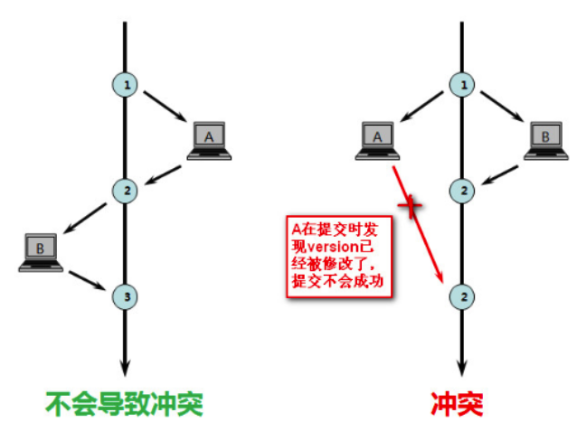

## 1. 业务场景介绍

### 1.1 正常电商流程:


## 2. 秒杀系统设计

   分两部分内容;秒杀业务设计和秒杀技术实现。

### 2.1 秒杀业务设计

#### 2.1.1 秒杀业务的特性:


#### 2.1.2 秒杀业务设计:


   营销工具:系统整理的促销工具，可以对某些特定的工具详细解释。

   营销活动:从营销工具中提出创建一个活动。

   营销活动订单:针对营销活动产生的订单。
   
#### 2.1.3 秒杀级别 

##### 2.1.3.1 商品限时秒杀(商品级别)

   限时促销(商品级)、 限时抢购(商品级) 秒杀(商品级) 商品包邮(商品级)

   是一款用于常规的营销活动，在限时促销上增加“排除参与活动”、“限制用户购买次数”、“限购种类”、“未付款取消时间”、“活动商品限制库存”等功能，
   是限时促销的增强版，常用于用户拉新、日常的秒杀、日常活动。促销渠道(app，pc，wap，global_app， fresh_app)等。

##### 2.1.3.2 订单满额减(订单级别)

   满就赠(订单级) 满立减(订单级) 送优惠券(订单级) 折扣(订单级) Vip折扣(订单级) 订单包邮(订单级)

   常用促销工具，有满X元减Y元、满X件减Y元，支持叠加满减，订单商品满减金额，支持限制用户参与次数，可设置包括享受优惠的商品分类，商品品牌，商品、
   促销会员等级，会员标签，促 销渠道(app，pc，wap，global_app，fresh_app)，订单可享受满减的支付门槛金额等，如购买 全场商品，订单满100元优惠20元

##### 2.1.3.3 银行促销(全站)

   优惠券 、优化券补发 、银行促销 、支付红包 、团购预售 、微信砍价

   常用促销工具，与银行合作在一段时间内每周固定几天进行优惠，可设置用户总参与次数，每 天总活动次数，在用户进行支付时进行减免。当前只有光大银行每周二、周六有活动，
   参与渠道只 有pc、h5端，支持排除部分商品，通常是虚拟商品。
   
#### 2.1.4 秒杀技术特性:


##### 2.1.4.1 单一职责:

   秒杀流量是占比比较重的一环，所以要独立部署，与其他业务分开，互不影响。扩容容易。

##### 2.1.4.2 防止超卖:

   100个库存，1000个人购买，如何保证其中100个人能买到

##### 2.1.4.3  限流、熔断、降级:

   主要是防止程序蹦掉。核心就是限制次数、限制总量、快速失败、降级运行
   
##### 2.1.4.4 队列削峰:

   12306中选择购票时，选择自己靠窗座位时，所有下单请求，加入队列，满满匹配撮合。
   
##### 2.1.4.5 流量错峰、防刷:

   使用各种手段、将流量分担到更大宽度的时间点、比如验证码、F码
   
##### 2.1.4.6 预热、快速扣减:

   秒杀读多写少(访问商品人数往往大于购买人数)。活动和库存都可以提前预热。比如把数据放到redis中。
   
##### 2.1.4.7 动静分离:
 
nginx做好动静分离、使用CDN网络、分担后端的相应压力。

### 2.2 秒杀实战

核心问题: 一个是并发读，一个是并发写

#### 2.2.1 数据库:

   秒杀场次表:sms_flash_promotion_session 
   
   秒杀活动表:sms_flash_promotion 
   
   场次商品关系表:sms_flash_promotion_product_relation

#### 2.2.2 下单流程:


##### 2.2.2.1 下单秒杀 确认接口: (确认下单流程)

   com.wlz.mall.controller.OmsPortalOrderController#generateMiaoShaConfirmOrder

   一、检查方法:confirmCheck

      1、检查本地缓存售罄状态

      2、校验是否有权限购买token

      3、判断redis库存是否充足

      4、 检查是否正在排队当中
   
   二、调用会员服务获取会员信息

      fegin远程调用
   
   三、产品服务获取产品信息

   四、验证秒杀时间是否超时

   五、获取用户收货列表

   六、构建商品信息

   七、计算金额####

   八、会员积分

   下单方式:0->同步下单。1->异步下单排队中。-1->秒杀失败。>1->秒杀成功(返回订单号)

##### 2.2.2.2 下单秒杀 下单秒杀接口: (下单提交流程)

com.wlz.mall.controller.OmsPortalOrderController#generateMiaoShaOrder

   1、检查方法:confirmCheck

   2、 从产品服务获取产品信息

   3、 验证秒杀时间是否超时

   4、调用会员服务获取会员信息

   5、通过Feign远程调用 会员地址服务

   6、预减库存 ####(异步流程才需要这块，数据库锁不需要 此操作) 7、生成下单商品信息

   8、库存处理


### 2.3 秒杀流程核心点: 

   价格计算、库存处理
   
##### 2.3.1 价格计算

##### 2.3.1.1. 商品级别优惠计算


##### 2.3.1.2. 订单级别计算优惠


#### 2.3.2 库存问题

   高并发下会出现超卖问题。问题如下。


   线程一查询库存100个，然后进行扣减库存。

   线程二查询库存也是100个，然后也进行扣减库存。
   
   实际情况是:两个线程都扣减了库存，买了两件商品，但是库存在只扣了一次，订单有两笔订单， 但是库存只扣了一个。这就是库存超卖问题。
   
##### 2.3.2.1. 何时扣减库存:

   下单时扣减 、支付时扣减
   
##### 2.3.2.2. 库存解决:

   数据库的锁、用redis的特性、异步下单等解决方案来解决。

###### 1. 悲观锁操作:

```sql
begin;
select flash_promotion_count from sms_flash_promotion_product_relation where id=43 for UPDATE;
update sms_flash_promotion_product_relation set flash_promotion_count=flash_promotion_count-1 where id=43
 ROLLBACK;
commit;
```

   select...for update是MySQL提供的实现悲观锁的方式。此时在秒杀表中，id为43的那条数据就 被我们锁定了，其它的要执行select * from 秒杀表 
   where id=43 for update的事务必须等本次事务提交之后才能执行。这样我们可以保证当前的数据不会被其它事务修改。

   MySQL还有个问题是select...for update语句执行中所有扫描过的行都会被锁上，因此在MySQL 中用悲观锁务必须确定走了索引，而不是全表扫描，否则将会将整个数据表锁住。

   for update 悲观锁 行锁还有条件:就是要能查询到记录、并且走了索引才是行锁。某些情况可能 是锁整张表。 
   
   因此悲观锁并不是适用于任何场景，它也存在一些不足，因为悲观锁大多数情况下依靠数据库的锁 机制实现，以保证操作最大程度的独占性。如果加锁的时间过长，其他用户长时间无法访问，
   影响了程序的并发访问性，同时这样对数据库性能开销影响也很大，特别是对长事务而言，这样的开销 往往无法承受，这时就需要乐观锁。
   
###### 2. 乐观锁:

   乐观锁相对悲观锁而言，它认为数据一般情况下不会造成冲突，所以在数据进行提交更新的时候，才会正式对数据的冲突与否进行检测，如果发现冲突了，则让返回错误信息，让用户决定如何去做。

   版本号的实现方式有两种，一个是数据版本机制，一个是时间戳机制。



```sql
 begin;
select flash_promotion_count from sms_flash_promotion_product_relation where id=43 ;
update sms_flash_promotion_product_relation set flash_promotion_count=flash_promotion_count ,version=version+1 
where id=43 and version=#version#;
ROLLBACK;
 Commit;
```

   这除了select查询库存 还需要更新库存，其实还有插入insert order orderlog orderdetail等需要 插入数据库。库存更新没问题，但是插入订单时失败了是不是要回滚，
   如果不在一个事务就会出 错。如果在一个事务，那又涉及到事务过长甚至可能是跨库然后无法用本地事务来解决。

### 2.4 秒杀问题

   性能问题、个数问题、架构问题。
   
#### 2.4.1 性能问题

无论是悲观锁还是乐观锁对需要对数据库进行上锁，而我们数据库的资源是非常有限的。

#### 2.4.2 个数问题:

```sql
<!--扣减库存 防止库存超卖-->
UPDATE sms_flash_promotion_product_relation
    SET flash_promotion_count = CASE
        WHEN flash_promotion_count>=#{stock} 
        THEN
            flash_promotion_count - #{stock}
        ELSE
            flash_promotion_count
        END
    WHERE
        id = #{id}
```

如果库存数量只有1个了，但是现在小明下单这时要买两个，那这条sql语句就有问题了，我们库存只有一个，很明显不够卖了吧。

#### 2.4.3 架构问题

   1000个人来抢就意味着有1000个人来请求数据库尝试扣减库存。 假设我数据库只有10减商品，意味着990个请求是没有意义的。 那这样说的话这种架构有优化的空间吧
   


### 2.5 Redis2.0版本 （改进1）

   秒杀的场景一般都是商品比较实惠的，而大众都有贪图便宜的 这个心态，那商家为了吸引顾客会以比较少的商品来吸引比较多的顾客，就是顾客多商品少，那就 意味着大部分人是买不到商品的，
   就好比库存只有10个，但是现在有100个人购买或者1000个人 准备下单购买。但是里面只有10个人才能买到。这大量的请求数据库是受不了的。


#### 2.5.1 预下单:

   根据这种情况我们可以把库存放到redis里面，秒杀下单时，先从redis里面获取库存数量，然后根 据库存数量判断是否可以进行下一部，如果有库存就直接下单，如果没有库存就不能下单。
   这样做的好处是可以拦截大部分流量进入到数据库中，刚才我们说过了上诉 的业务场景问题，简称就是狼多肉少吧，这一步我们也叫下单流程中的”预下单“。
   
```
//3、从redis缓存当中取出当前要购买的商品库存
Integerstock=redisOpsUtil.get(RedisKeyPrefixConst.MIAOSHA_STOCK_CACHE_PREFIX + productId, Integer.class);
if(stock==null||stock<=0){
   return CommonResult.failed("商品已经售罄,请购买其它商品!"); 
}
```

#### 2.5.2 预售库存:

   我们现在库存不从数据库里面扣减，而是从redis里面获取，那请问我们redis扣减库存这个数量 从哪儿来的?
   
##### 2.5.2.1 初始化(全量)

   com.wlz.mall.config.RedisConifg#afterPropertiesSet


##### 2.5.2.2 预售库存逻辑 

```
//3、从redis缓存当中取出当前要购买的商品库存
Integerstock=redisOpsUtil.get(RedisKeyPrefixConst.MIAOSHA_STOCK_CACHE_PREFIX+ productId, Integer.class);
if(stock==null||stock<=0){
   /*设置标记，如果售罄了在本地cache中设置为true*/
   cache.setLocalCache(RedisKeyPrefixConst.MIAOSHA_STOCK_CACHE_PREFIX + productId, true);
   return CommonResult.failed("商品已经售罄,请购买其它商品!"); 
}
```

```
/*
* 订单下单前的购买与检查
*/
private CommonResultconfirmCheck(LongproductId,LongmemberId,Stringtoken) throws BusinessException {
   /*1、设置标记，如果售罄了在本地cache中设置为true*/
   Boolean localcache = cache.getCache(RedisKeyPrefixConst.MIAOSHA_STOCK_CACHE_PREFIX + productId);
   if (localcache != null && localcache) {
      return CommonResult.failed("商品已经售罄,请购买其它商品!");
   }
   //3、从redis缓存当中取出当前要购买的商品库存
   Integer stock = redisOpsUtil.get(RedisKeyPrefixConst.MIAOSHA_STOCK_CACHE_PREFX + productId, Integer.class);
   if (stock == null || stock <= 0) {
      /*设置标记，如果售罄了在本地cache中设置为true*/
      cache.setLocalCache(RedisKeyPrefixConst.MIAOSHA_STOCK_CACHE_PREFIX +productId, true);
      return CommonResult.failed("商品已经售罄,请购买其它商品!");
   }
   return CommonResult.success(null);
}
```

##### 2.5.2.3 问题

   可以发现本地的缓存级别是jvm级别的，而各自的jvm售罄状态是不一样的，每个jvm只能修 改自己本身的售罄状态，但是不能影响别的jvm状态。

##### 2.5.2.4 解决方案:

###### 1. zookeeper

   可以用zookeeper的watch机制来实现，给毎个jvm都监听zk的某个就节点，一旦数据有改变之后通知到其他节点上


###### 2. redis 的channel机制实现。 

###### 3. mq 等 

#### 2.5.3 异步下单:

   之前方案不足: 数据库insert 很多表 数据库优化

   1、颠覆性 》mysql oracle 
   
   2、改进型》索引、分库分表、读写分离
   
##### 2.5.3.1 处理未支付的订单

###### 1. 生产端:

```java
public class OrderMessageSender {
   public boolean sendTimeOutOrderMessage(String cancelId) {
      Message message = MessageBuilder.withPayload(cancelId)
              .setHeader(RocketMQHeaders.KEYS, cancelId)
              .build();
      SendResult result = rocketMQTemplate.syncSend(scheduleTopic + ":" + TAG, message, 5000, 15);
      return SendStatus.SEND_OK == result.getSendStatus();
   }
}
```

###### 2. 消费端:

````java
@Slf4j
@Component
@RocketMQMessageListener(consumerGroup = "${rocketmq.tulingmall.cancelGroup}", topic = "${rocketmq.tulingmall.scheduleTopic}")
public class RocketMqCancelOrderReciever implements RocketMQListener<String> {

    @Autowired
    private OmsPortalOrderService omsPortalOrderService;

    @Autowired
    private SecKillOrderService secKillOrderService;

    /**
     * 延时消息,取消超时订单
     * @param cancelId
     */
    @Override
    public void onMessage(String cancelId) {
        if(StringUtils.isEmpty(cancelId)){
            return;
        }
        Long orderId = Long.parseLong(cancelId.split(":")[0]);
        Long promotionId = Long.parseLong(cancelId.split(":")[1]);
        Long productId = Long.parseLong(cancelId.split(":")[2]);
        try {
            //取消的订单,释放DB库存
            omsPortalOrderService.cancelOrder(orderId,promotionId);
            //取消的订单-还原缓存库存
            secKillOrderService.incrRedisStock(productId);
        } catch (Exception e) {
            log.error("订单取消异常 : 还原库存失败，please check:{}",e.getMessage(),e.getCause());
            throw new RuntimeException();//抛异常出去,rocketmq会重新投递
        }

    }

}
````