### redis 是什么?
   
   是完全开源免费的，用c语言编写的，是一个单线程，高性能的（key/value）内存数据库，基于内存运行并支持持久化的nosql数据库
   
### redis 能干嘛？
   
   主要是用来做缓存，但不仅仅只能做缓存，比如：redis的计数器生成分布式唯一主键，redis实现分布式锁，队列，会话缓存。

### redis 为什么这么快
   
   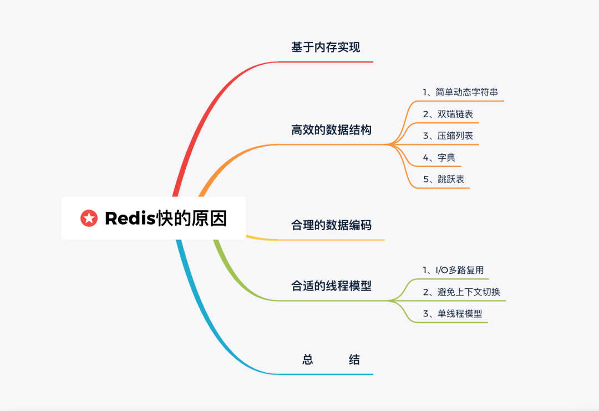

#### 基于内存实现
   
   Redis 是基于内存的数据库，那不可避免的就要与磁盘数据库做对比。对于磁盘数据库来说，是需要将数据读取到内存里的，这个过程会受到磁盘 I/O 的限制。
   
   而对于内存数据库来说，本身数据就存在于内存里，也就没有了这方面的开销。

#### 高效的数据结构
   
   Redis 中有多种数据类型，每种数据类型的底层都由一种或多种数据结构来支持。正是因为有了这些数据结构，Redis 在存储与读取上的速度才不受阻碍。这些数据结构有什么特别的地方，各位看官接着往下看：
   
   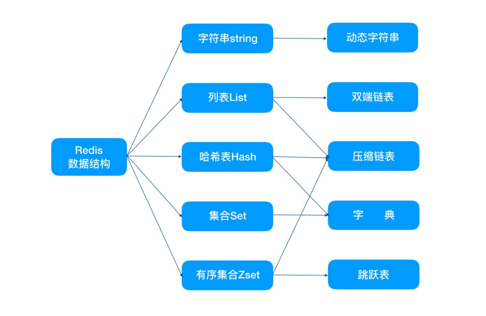

##### 1、简单动态字符串
   
   这个名词可能你不熟悉，换成 SDS 肯定就知道了。这是用来处理字符串的。了解 C 语言的都知道，它是有处理字符串方法的。而 Redis 就是 C 语言实现的，那为什么还要重复造轮子？我们从以下几点来看：
   
   **(1)字符串长度处理**
   
   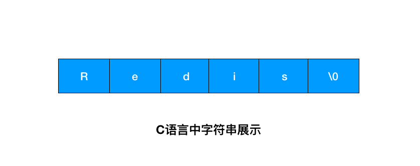
   
   这个图是字符串在 C 语言中的存储方式，想要获取 「Redis」的长度，需要从头开始遍历，直到遇到 '\0' 为止。
   
   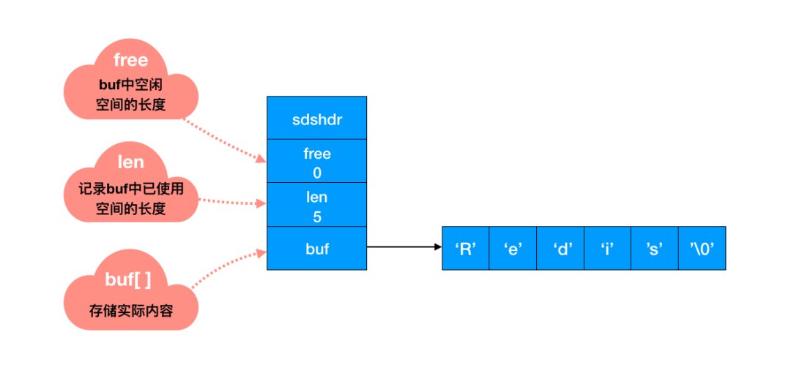
   
   Redis 中怎么操作呢？用一个 len 字段记录当前字符串的长度。想要获取长度只需要获取 len 字段即可。你看，差距不言自明。前者遍历的时间复杂度为 O(n)，Redis 中 O(1) 就能拿到，速度明显提升。
   
   **（2）内存重新分配**
   
   C 语言中涉及到修改字符串的时候会重新分配内存。修改地越频繁，内存分配也就越频繁。而内存分配是会消耗性能的，那么性能下降在所难免。
   
   而 Redis 中会涉及到字符串频繁的修改操作，这种内存分配方式显然就不适合了。于是 SDS 实现了两种优化策略：
   
   空间预分配
        
        对 SDS 修改及空间扩充时，除了分配所必须的空间外，还会额外分配未使用的空间。
        
        具体分配规则是这样的：SDS 修改后，len 长度小于 1M，那么将会额外分配与 len 相同长度的未使用空间。如果修改后长度大于 1M，那么将分配1M的使用空间。
   
   惰性空间释放
        
        当然，有空间分配对应的就有空间释放。
        
        SDS 缩短时，并不会回收多余的内存空间，而是使用 free 字段将多出来的空间记录下来。如果后续有变更操作，直接使用 free 中记录的空间，减少了内存的分配。
   
   **（3）二进制安全**
   
   你已经知道了 Redis 可以存储各种数据类型，那么二进制数据肯定也不例外。但二进制数据并不是规则的字符串格式，可能会包含一些特殊的字符，比如 '\0' 等。
   
   前面我们提到过，C 中字符串遇到 '\0' 会结束，那 '\0' 之后的数据就读取不上了。但在 SDS 中，是根据 len 长度来判断字符串结束的。

##### 2、双端链表
   
   列表 List 更多是被当作队列或栈来使用的。队列和栈的特性一个先进先出，一个先进后出。双端链表很好的支持了这些特性。
   
   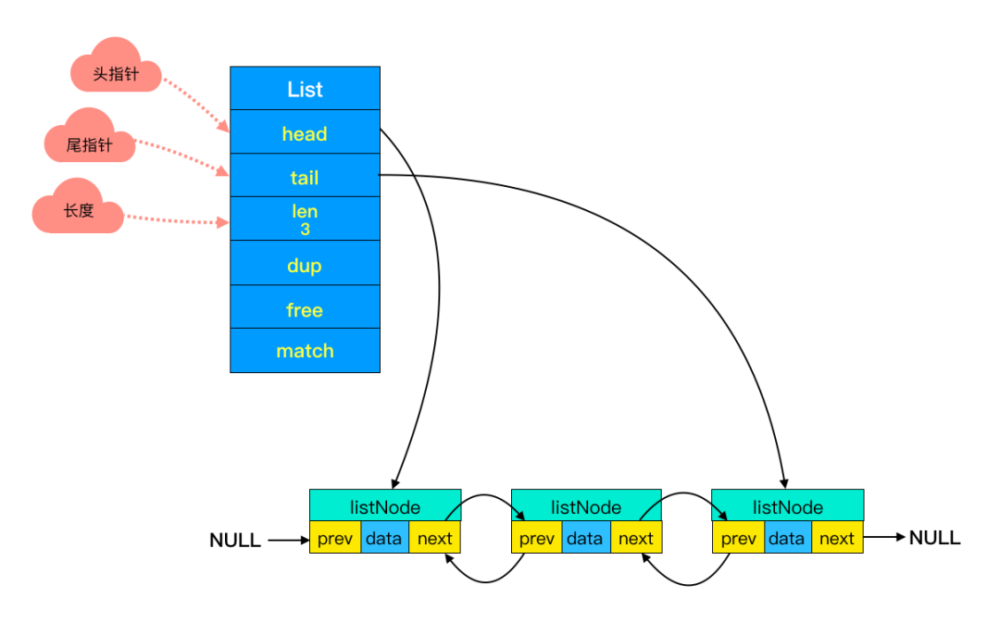
   
   **（1）前后节点**
   
   
   
   链表里每个节点都带有两个指针，prev 指向前节点，next 指向后节点。这样在时间复杂度为 O(1) 内就能获取到前后节点。
   
   **（2）头尾节点**

   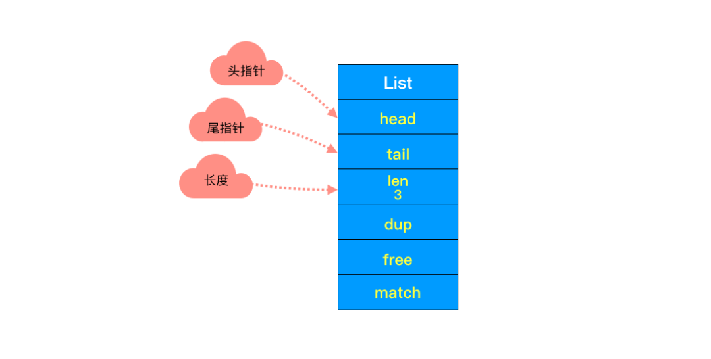
   
   你可能注意到了，头节点里有 head 和 tail 两个参数，分别指向头节点和尾节点。这样的设计能够对双端节点的处理时间复杂度降至 O(1) ，对于队列和栈来说再适合不过。同时链表迭代时从两端都可以进行。
   
   **（3）链表长度**
   
   头节点里同时还有一个参数 len，和上边提到的 SDS 里类似，这里是用来记录链表长度的。因此获取链表长度时不用再遍历整个链表，直接拿到 len 值就可以了，这个时间复杂度是 O(1)。
   
##### 3、压缩列表
   
   双端链表我们已经熟悉了。不知道你有没有注意到一个问题：如果在一个链表节点中存储一个小数据，比如一个字节。那么对应的就要保存头节点，前后指针等额外的数据。
   
   这样就浪费了空间，同时由于反复申请与释放也容易导致内存碎片化。这样内存的使用效率就太低了。
   
   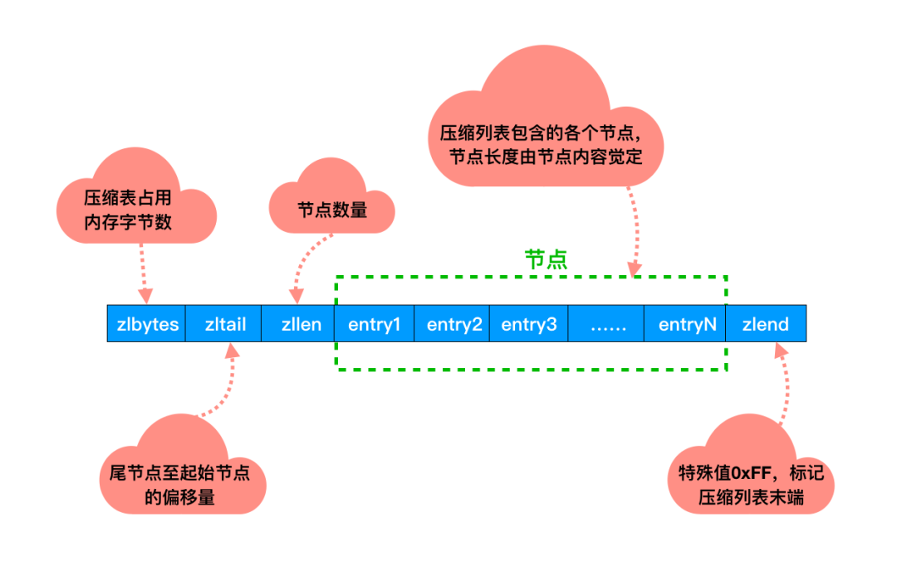
   
   它是经过特殊编码，专门为了提升内存使用效率设计的。所有的操作都是通过指针与解码出来的偏移量进行的。
  
   并且压缩列表的内存是连续分配的，遍历的速度很快。

##### 4、字典
   
   Redis 作为 K-V 型数据库，所有的键值都是用字典来存储的。
   
   日常学习中使用的字典你应该不会陌生，想查找某个词通过某个字就可以直接定位到，速度非常快。这里所说的字典原理上是一样的，通过某个 key 可以直接获取到对应的value。
   
   字典又称为哈希表，这点没什么可说的。哈希表的特性大家都很清楚，能够在 O(1) 时间复杂度内取出和插入关联的值。
   
##### 5、跳跃表
   
   作为 Redis 中特有的数据结构-跳跃表，其在链表的基础上增加了多级索引来提升查找效率。
   
   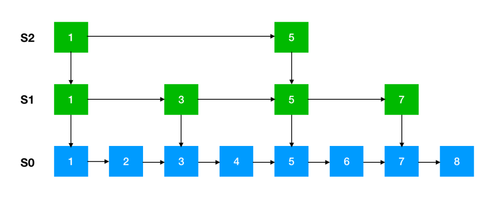
   
   这是跳跃表的简单原理图，每一层都有一条有序的链表，最底层的链表包含了所有的元素。这样跳跃表就可以支持在 O(logN) 的时间复杂度里查找到对应的节点。
   
   下面这张是跳表真实的存储结构，和其它数据结构一样，都在头节点里记录了相应的信息，减少了一些不必要的系统开销。
   
   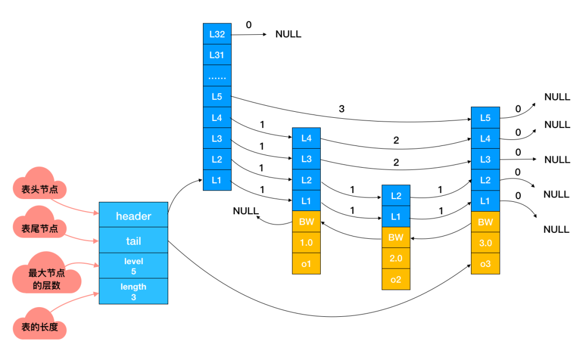

#### 合理的数据编码
   
   对于每一种数据类型来说，底层的支持可能是多种数据结构，什么时候使用哪种数据结构，这就涉及到了编码转化的问题。
  
   String：存储数字的话，采用int类型的编码，如果是非数字的话，采用 raw 编码；
   
   List：字符串长度及元素个数小于一定范围使用 ziplist 编码，任意条件不满足，则转化为 linkedlist 编码；
   
   Hash：hash 对象保存的键值对内的键和值字符串长度小于一定值及键值对；
   
   Set：保存元素为整数及元素个数小于一定范围使用 intset 编码，任意条件不满足，则使用 hashtable 编码；
   
   Zset：zset 对象中保存的元素个数小于及成员长度小于一定值使用 ziplist 编码，任意条件不满足，则使用 skiplist 编码。

#### 合适的线程模型
   
   Redis 快的原因还有一个是因为使用了合适的线程模型：
   
   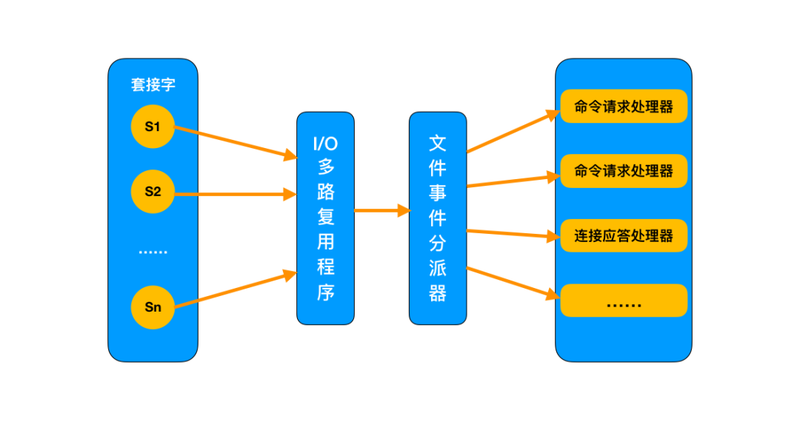
   
##### 1、I/O多路复用模型
    
   I/O ：网络 I/O
   
   多路：多个 TCP 连接
   
   复用：共用一个线程或进程
   
   生产环境中的使用，通常是多个客户端连接 Redis，然后各自发送命令至 Redis 服务器，最后服务端处理这些请求返回结果。
   
   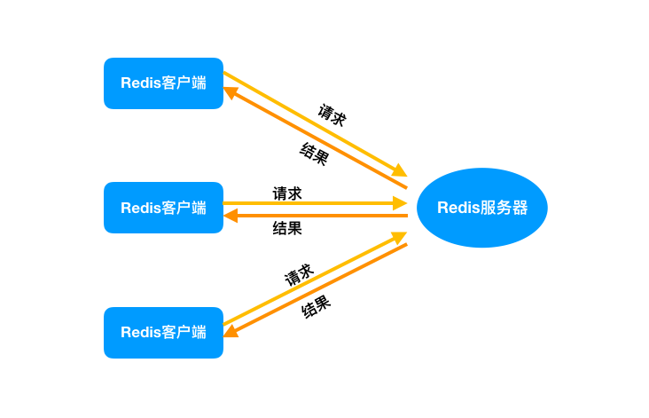
   
   应对大量的请求，Redis 中使用 I/O 多路复用程序同时监听多个套接字，并将这些事件推送到一个队列里，然后逐个被执行。最终将结果返回给客户端。
   
##### 2、避免上下文切换
   
   你一定听说过，Redis 是单线程的。那么单线程的 Redis 为什么会快呢？
   
   因为多线程在执行过程中需要进行 CPU 的上下文切换，这个操作比较耗时。Redis 又是基于内存实现的，对于内存来说，没有上下文切换效率就是最高的。多次读写都在一个CPU 上，对于内存来说就是最佳方案。
   
##### 3、单线程模型
   
   顺便提一下，为什么 Redis 是单线程的。
  
   Redis 中使用了 Reactor 单线程模型，你可能对它并不熟悉。没关系，只需要大概了解一下即可。
   
   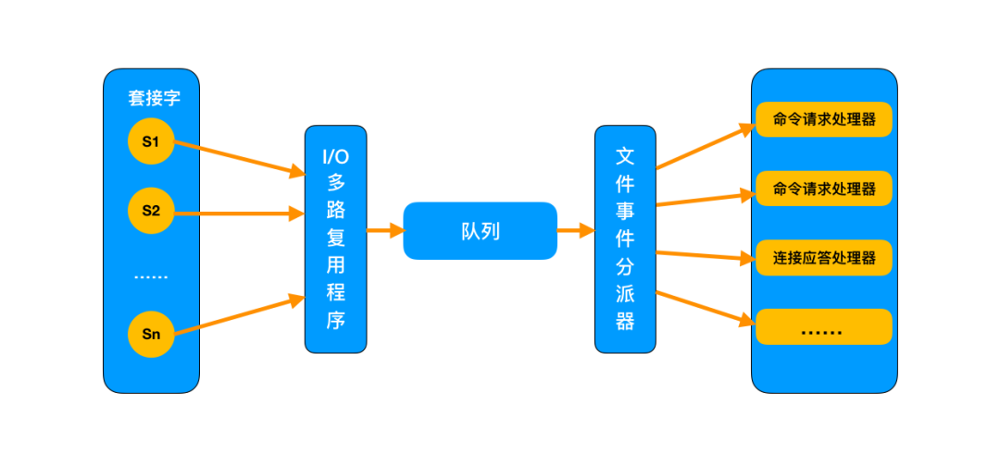
   
   这张图里，接收到用户的请求后，全部推送到一个队列里，然后交给文件事件分派器，而它是单线程的工作方式。Redis 又是基于它工作的，所以说 Redis 是单线程的。

### redis数据类型及api操作
   
   http://redisdoc.com
    
#### key
   
   keys *
   
   scan  0 match  *  count  1
   
   exists key 判断某个key是否存在
   
   move key db  当前库就没有了，到指定的库中去了
   
   expire key  为给定的key设置过期时间
   
   ttl key 查看还有多少时间过期   -1表示永不过期  -2表示已过期
   
   type key  查看key是什么类型
   
#### 1.string
   
   string是redis最基本的类型，你可以理解成与Memcached一模一样的类型，一个key对应一个value。
   
   string类型是二进制安全的。意思是redis的string可以包含任何数据。比如jpg图片或者序列化的对象 。
   
   string类型是Redis最基本的数据类型，一个redis中字符串value最多可以是512M
   
   set  key  value   设置key  value
   
   get  key    查看当前key的值
   
   del  key   删除key
   
   append key  value   如果key存在，则在指定的key末尾添加，如果key存在则类似set
   
   strlen  key  返回此key的长度
   
   以下几个命令只有在key值为数字的时候才能正常操作
        
      incr  key  为执定key的值加一
      decr  key  为指定key的值减一
      incrby key  数值     为指定key的值增加数值
      decrby key  数值     为指定key的值减数值
   
   getrange  key  0(开始位置)  -1（结束位置）    获取指定区间范围内的值，类似between......and的关系 （0 -1）表示全部
   
   setrange key 1（开始位置，从哪里开始设置） 具体值    设置（替换）指定区间范围内的值
   
   setex 键 秒值 真实值    设置带过期时间的key，动态设置。
   
   setnx  key   value         只有在 key 不存在时设置 key 的值。
   
   mset   key1   value  key2   value       同时设置一个或多个 key-value 对。
   
   mget   key1   key 2    获取所有(一个或多个)给定 key 的值。
   
   msetnx   key1   value  key2   value   同时设置一个或多个 key-value 对，当且仅当所有给定 key 都不存在。
   
   getset   key    value  将给定 key 的值设为 value ，并返回 key 的旧值(old value)。
   
#### 2.list
   
   它是一个字符串链表，left、right都可以插入添加；
   
   如果键不存在，创建新的链表；
   
   如果键已存在，新增内容；
   
   如果值全移除，对应的键也就消失了。
   
   链表的操作无论是头和尾效率都极高，但假如是对中间元素进行操作，效率就很惨淡了。
   
   Redis 列表是简单的字符串列表，按照插入顺序排序。你可以添加一个元素导列表的头部（左边）或者尾部（右边）。
   
   它的底层实际是个链表
   
   lpush  key  value1  value2  将一个或多个值加入到列表头部
   
   rpush  key  value1  value2 将一个或多个值加入到列表底部
   
   lrange key  start  end  获取列表指定范围的元素   （0 -1）表示全部
   
   lpop key 移出并获取列表第一个元素
   
   rpop key  移出并获取列表最后一个元素
   
   lindex key index   通过索引获取列表中的元素
   
   llen 获取列表长度
   
   lrem key   0（数量） 值，表示删除全部给定的值。零个就是全部值   从left往right删除指定数量个值等于指定值的元素，返回的值为实际删除的数量
   
   ltrim key  start(从哪里开始截)  end（结束位置） 截取指定索引区间的元素，格式是ltrim list的key 起始索引 结束索引
   
#### 3.set
   
   Redis的Set是string类型的无序，不能重复的集合。
   
   sadd key value1 value 2 向集合中添加一个或多个成员
   
   smembers  key  返回集合中所有成员
   
   sismembers  key   member  判断member元素是否是集合key的成员
   
   scard key  获取集合里面的元素个数
   
   srem key value  删除集合中指定元素
   
   srandmember key  数值     从set集合里面随机取出指定数值个元素   如果超过最大数量就全部取出，
   
   spop key  随机移出并返回集合中某个元素
   
   smove  key1  key2  value(key1中某个值)   作用是将key1中执定的值移除  加入到key2集合中
   
   sdiff key1 key2  在第一个set里面而不在后面任何一个set里面的项(差集)
   
   sinter key1 key2  在第一个set和第二个set中都有的 （交集）
   
   sunion key1 key2  两个集合所有元素（并集）
   
#### 4.hash
   
   Redis hash 是一个键值对集合。
   
   Redis hash是一个string类型的field和value的映射表，hash特别适合用于存储对象。
   
   kv模式不变，但v是一个键值对
   
   类似Java里面的Map<String,Object>
   
   hset  key  (key value)  向hash表中添加一个元素
   
   hget key  key  向hash表中获取一个元素
   
   hmset  key key1 value1 key2 value2 key3 value3 向集合中添加一个或多个元素
   
   hmget key  key1 key2 key3  向集合中获取一个或多个元素
   
   hgetall  key   获取在hash列表中指定key的所有字段和值
   
   hdel  key  key1 key2 删除一个或多个hash字段
   
   hlen key 获取hash表中字段数量
   
   hexits key key  查看hash表中，指定key（字段）是否存在
   
   hkeys  key 获取指定hash表中所有key（字段）
   
   hvals key 获取指定hash表中所有value(值)
   
   hincrdy key  key1  数量（整数）  执定hash表中某个字段加  数量  ，和incr一个意思
   
   hincrdyfloat key key1  数量（浮点数，小数）  执定hash表中某个字段加  数量  ，和incr一个意思
   
   hsetnx key key1 value1  与hset作用一样，区别是不存在赋值，存在了无效。
   
#### 5.zset
   
   Redis zset 和 set 一样也是string类型元素的集合,且不允许重复的成员。
   
   不同的是每个元素都会关联一个double类型的分数。
   
   redis正是通过分数来为集合中的成员进行从小到大的排序。zset的成员是唯一的,但分数(score)却可以重复。
   
   zadd  key  score 值   score 值   向集合中添加一个或多个成员
   
   zrange key  0   -1  表示所有   返回指定集合中所有value
   
   zrange key  0   -1  withscores  返回指定集合中所有value和score
   
   zrangebyscore key 开始score 结束score    返回指定score间的值
   
   zrem key score某个对应值（value），可以是多个值   删除元素
   
   zcard key  获取集合中元素个数
   
   zcount key   开始score 结束score       获取分数区间内元素个数
   
   zrank key vlaue   获取value在zset中的下标位置(根据score排序)
   
   zscore key value  按照值获得对应的分数
   
### redis事务
   
#### 什么是redis的事务？
   
   redis事务就是一个命令执行的队列，将一系列预定义命令包装成一个整体，就是一个队列。当执行的时候，一次性按照添加顺序依次执行，中间不会被打断或者干扰。
####   能干嘛？
   
   一个队列中，一次性，顺序性，排他性的执行一系列命令

####redis事务基本操作
   
   开启事务：multi     设置事务的开始位置，这个指令开启后，后面所有的指令都会加入事务中
   
   执行事务： exec     设置事务的结束位置，同时执行事务，与multi成对出现，成对使用
   
   取消事务：discard  终止当前事务，取消multi后，exec前的所有指令
   
   **注意：** 加入事务的命令并没有立马执行，而且加入队列中，exec命令后才执行
   
   加入和执行事务有错误会怎么办？
   
   加入事务语法报错，事务则取消
   
   执行事务报错，则成功的返回成功，失败的返回失败，不影响报错后面的指令
   
   **注意：** 已经执行完毕的命令对应的数据不会自动回滚，需要程序员自己实现
   
#### 监控key
   
   watch： 对key进行监控，如果在exec执行前，监控的key发生了变化，终止事务执行
   
   unwatch： 取消对所有的key进行监控
   
### redis发布订阅
   
   publish: 发布消息   语法：publish channel名称   “消息内存”
   
   subscribe: 订阅消息  语法：subscribe channel名称
   
   subscribe: 使用通配符订阅消息 语法: pubscribe channel*名称
   
   punsubscribe: 使用通配符退订消息。语法：punsubscribe channel*名称
   
   unsubscribe : 退订消息 语法：unsubscribe  channel名称

### 删除策略
   
   定时删除-->以CPU内存换redis内存
   
   惰性删除-->以redis内存换CPU内存
   
   定期删除
   
   redis使用：惰性删除+定期删除
   
   1.redis在启动的时候读取配置文件hz的值，默认为10
   
   2.每秒执行hz次serverCron()-->databasesCron()--->actveEXpireCyle()
   
   3.actveEXpireCyle()对每个expires[*]进行逐一检测，每次执行250ms/hz
   
   4.对某个expires[*]检测时，随机挑选N个key检查
   	   
   	   如果key超时，删除key
   	   
   	   如果一轮中删除的key的数量>N*25%，循环该过程
   	    
   	   如果一轮中删除的key的数量小于等于N25%,检查下一个expires[  ]
   
   current_db用于记录actveEXpireCyle()进入哪个expires[ * ] 执行，如果时间到了，那么下次根据current_db继续执行
   
### 逐出算法
   
   相关配置：
   
   maxmemory： 最大可使用内存，占用物理内存的比例，默认值为0,，表示不限制。生产环境一般根据需求设置，通常50%以上
   
   maxmemory-policy： 达到最大内存后，对挑选出来的数据进行删除策略
   
   maxmemory-samples: 每次选取待删除数据的个数，选取数据时并不会全库扫描，采用随机获取数据的方式作为待检测删除数据

### redis的持久化机制
   
   说白了，就是在指定的时间间隔内，将内存当中的数据集快照写入磁盘，它恢复时是将快照文件直接读到内存
   
   什么意思呢？我们都知道，内存当中的数据，如果我们一断电，那么数据必然会丢失，但是玩过redis的同学应该都知道，我们一关机之后再启动的时候数据是还在的，所以它必然是在redis启动的时候重新去加载了持久化的文件
   
   redis提供两种方式进行持久化，
   
   一种是RDB持久化默认，
   
   另外一种是AOF（append only file）持久化。
   
#### 1.RDB
   
##### 是什么？
   
   原理是redis会单独创建（fork）一个与当前进程一模一样的子进程来进行持久化，这个子进程的所有数据（变量。环境变量，程序程序计数器等）都和原进程一模一样，会先将数据写入到一个临时文件中，待持久化结束了，再用这个临时文件替换上次持久化好的文件，整个过程中，主进程不进行任何的io操作，这就确保了极高的性能
   
   问题：为什么要fork一个子进程？（上课演示了阻塞效果，证明了fork了子进程）
   
   因为redis是单线程的，如果这个线程去进行rdb持久化了，那么此时有客户端向我们服务端发送命令，他是得不到处理的（唯一的线程在做持久化），必须要等持久化结束后才能接受客户端命令。那么这个过程可以理解为客户端发送命令会阻塞，性能低下。

##### 1.这个持久化文件在哪里
   
   根据dir配置

##### 2.他什么时候fork子进程，或者什么时候触发rdb持久化机制
   
   shutdown时，如果没有开启aof，会触发
   
   配置文件中默认的快照配置
   
   执行命令save或者bgsave
   
   bgsave：会fork子进程，原理与rdb上面原理一样，系统默认触发rdb持久化都是调用的此命令
   
   save：是不会fork子进程的，它使用主进程进行持久化，所以会导致客户端命令发送到我们服务端得不到及时处理，所以他是阻塞的
   
   执行flushall命令  但是里面是空的，无意义
   
#### 2.aof
   
##### 是什么？
   
   原理是将Reids的操作日志以追加的方式写入文件，读操作是不记录的，整体分为三步
   
   数据写入内存--》数据写入aof_buf---》写入持久化文件。第二步到第三步什么时候执行根据配置文件触发机制
   
   注意：aof持久化不会fork子进程
   
##### 1.这个持久化文件在哪里
   
  根据dir配置

##### 2.触发机制（根据配置文件配置项）
   
   no：表示等操作系统进行数据缓存同步到磁盘（快，持久化没保证）
   
   always：同步持久化，每次发生数据变更时，立即记录到磁盘（慢，安全）
   
   everysec：表示每秒同步一次（默认值,很快，但可能会丢失一秒以内的数据）

##### 3.aof重写机制
   
   为什么会出现重写？
   
   aof是以日志追加的方式将命令字符串协议保存在aof 文件中，随着我们使用redis的时间越长，最redis的操作越多，这个aof文件会越来越大，如果不做处理，总有会撑爆磁盘，所以就出现了重写，重写就是专门给aof文件廋身的，
   
   他的思想是：直接根据现在内存的数据，生成新的aof文件，然后去替换旧的aof文件，就可以把一下没用字符去掉，比如set k1 v1 ,然后我们del k1等等一些没用操作，这样我们的文件大小就会小很多

##### 触发机制
   
   当AOF文件增长到一定大小的时候Redis能够调用 bgrewriteaof对日志文件进行重写 。当AOF文件大小的增长率大于该配置项时自动开启重写（这里指超过原大小的100%）。
   
   auto-aof-rewrite-percentage 100
   
   当AOF文件增长到一定大小的时候Redis能够调用 bgrewriteaof对日志文件进行重写 。当AOF文件大小大于该配置项时自动开启重写
   
   auto-aof-rewrite-min-size 64mb
   
   注意：重写操作是通过fork子进程来完成的，所以正常的aof不会fork子进程，触发了重写才会
 
##### 4.redis4.0后混合持久化机制
   
   **开启混合持久化**
   
   4.0版本的混合持久化默认关闭的，通过aof-use-rdb-preamble配置参数控制，yes则表示开启，no表示禁用，5.0之后默认开启。
   
   混合持久化是通过bgrewriteaof完成的，不同的是当开启混合持久化时，fork出的子进程先将共享的内存副本全量的以RDB方式写入aof文件，然后在将重写缓冲区的增量命令以AOF方式写入到文件，写入完成后通知主进程更新统计信息，并将新的含有RDB格式和AOF格式的AOF文件替换旧的的AOF文件。简单的说：新的AOF文件前半段是RDB格式的全量数据后半段是AOF格式的增量数据，
   
   优点：混合持久化结合了RDB持久化 和 AOF 持久化的优点, 由于绝大部分都是RDB格式，加载速度快，同时结合AOF，增量的数据以AOF方式保存了，数据更少的丢失。
   
   缺点：兼容性差，一旦开启了混合持久化，在4.0之前版本都不识别该aof文件，同时由于前部分是RDB格式，阅读性较差
   
#### 问题解答：
     
     rdb配置成save 1 1（代表一秒钟看一次，是否有1个数据更改，有就触发rdb）
     aof采用默认值everysec（表示每秒同步一次），那么这两种方式有什么区别？
     答：rdb持久化会fork子进程，aof持久化不会fork子进程（重写的时候才会fork子进程，重写不会频繁触发），
     fork子进程，复制一个进程，比我们整个redis整体开销少不了多。所以如果配置成这样，性能开销相差是巨大的
     小总结：
     1.redis提供了rdb持久化方案，为什么还要aof？
     优化数据丢失问题，rdb会丢失最后一次快照后的数据，aof丢失不会超过2秒的数据
     2.如果aof和rdb同时存在，听谁的？
     aof
     3.rdb和aof优势劣势
     rdb 适合大规模的数据恢复，对数据完整性和一致性不高 ，  在一定间隔时间做一次备份，如果redis意外down机的话，就会丢失最后一次快照后的所有操作
     aof 根据配置项而定，如果是默认配置，不会丢失超过两秒的数据
     性能建议（这里只针对单机版redis持久化做性能建议）：
     rdb和aof同时存在时，因为RDB文件只用作后备用途，只要15分钟备份一次就够了，只保留save 900 1这条规则。
     重写：只要硬盘许可，应该尽量减少AOF rewrite的频率，AOF重写的基础大小默认值64M太小了，可以设到5G以上。默认超过原大小100%大小时重写可以改到适当的数值。
     
#### 持久化机制总结：
   
##### 1.redis提供了rdb持久化方案，为什么还要aof？
   
   优化数据丢失问题，rdb会丢失最后一次快照后的数据，aof丢失不会超过2秒的数据

##### 2.如果aof和rdb同时存在，听谁的？
   aof

##### 3.rdb和aof优势劣势
   
   rdb 适合大规模的数据恢复，对数据完整性和一致性不高 ，  在一定间隔时间做一次备份，如果redis意外down机的话，就会丢失最后一次快照后的所有操作
   
   aof 根据配置项而定，如果是默认配置，不会丢失超过两秒的数据
   
##### 性能建议（这里只针对单机版redis持久化做性能建议）：
   
   rdb和aof同时存在时，因为RDB文件只用作后备用途，只要15分钟备份一次就够了，只保留save 900 1这条规则。
   
   重写：只要硬盘许可，应该尽量减少AOF rewrite的频率，AOF重写的基础大小默认值64M太小了，可以设到5G以上。默认超过原大小100%大小时重写可以改到适当的数值。
   
### redis.conf 配置详解 
   
   bind 127.0.0.1 (只能本机连接)
   
   bind 192.168.27.133 (指定本机ip<只能是内网ip>，外网可以连接)
   
   bind 0.0.0.0 (多ip，外网可以连接)
   
   删除  bind  (注释掉，外网不能连接，如果需要外网访问 配置 protected-mode no)
    
   protected-mode (保护模式， 使用了bind，或设置了密码，protected-mode yes 将不生效等同于no)
   
   supervised no (可以通过upstart 和systemd 管理redis 守护进程，这个参数是和具体的操作系统相关的)
   
   pidfile /var/run/redis_6379.pid (当redis以守护进程方式运行时，redis默认会把pid写入/var/run/redis.pid文件，可以通过pidfile设置)
   
   loglevel notice (设置日志级别 debug、verbose、notice、warning、默认为verbose)
   
   logfile "" ( 日志文件位置，当指定为空字符串时，为标准输出，如果redis已守护进程模式运行，那么日志将会输出到 /dev/null)

```
# 配置大小单位,开头定义了一些基本的度量单位，只支持bytes，不支持bit  对大小写不敏感
# 1k => 1000 bytes
# 1kb => 1024 bytes
# 1m => 1000000 bytes
# 1mb => 1024*1024 bytes
# 1g => 1000000000 bytes
# 1gb => 1024*1024*1024 bytes

# 引入其他文件
# include /path/to/local.conf
# include /path/to/other.conf
# bind 192.168.1.100 10.0.0.1
# bind 127.0.0.1 ::1
# 绑定Ip   指定可以连接本实例Redis的ip  如果注释（删掉）则任意IP都可以连接
bind 127.0.0.1

#禁止外网访问redis，如果启用了，即使注释掉了bind 127.0.0.1，再访问redisd时候还是无法连接的
#它启用的条件有两个，第一是没有使用bind，第二是没有设置访问密码。
protected-mode yes

#指定Redis的端口
port 6379

# 此参数确定了TCP连接中已完成队列(完成三次握手之后)的长度， 
# 当然此值必须不大于Linux系统定义的/proc/sys/net/core/somaxconn值，默认是511，
# 而Linux的默认参数值是128。当系统并发量大并且客户端速度缓慢的时候，可以将这二个参数一起参考设定。
# 在高并发环境下你需要一个高backlog值来避免慢客户端连接问题
tcp-backlog 511

# 当客户端闲置多长时间后关闭连接，如果指定为0，表示关闭该功能
timeout 0

# 设置多长时间检测死连接 单位为秒，如果设置为0，则不会进行Keepalive检测
tcp-keepalive 300

# 是否以守护进程启动
daemonize no

#可以通过upstart和systemd管理Redis守护进程，这个参数是和具体的操作系统相关的。
supervised no

#当Redis以守护进程方式运行时，Redis默认会把pid写入/var/run/redis.pid文件，可以通过pidfile指定
pidfile /var/run/redis_6379.pid

#设置日志的级别  debug、verbose、notice、warning，默认为verbose
loglevel notice

#日志文件的位置，当指定为空字符串时，为标准输出，如果redis已守护进程模式运行，那么日志将会输出到  /dev/null 。
logfile ""

# 设置数据库的数目。默认的数据库是DB 0 ，可以在每个连接上使用select  <dbid> 命令选择一个不同的数据库，dbid是一个介于0到databases - 1 之间的数值。
databases 16

always-show-logo yes

#   save ""
# 指定在多长时间内，有多少次更新操作，就将数据同步到数据文件，可以多个条件配合
# 这里表示900秒（15分钟）内有1个更改，300秒（5分钟）内有10个更改以及60秒内有10000个更改
# 如果想禁用RDB持久化的策略，只要不设置任何save指令，或者给save传入一个空字符串参数也可以
save 900 1
save 300 10
save 60  1

# 默认情况下，如果 redis 最后一次的后台保存失败，redis 将停止接受写操作，这样以一种强硬的方式让用户知道数据不能正确的持久化到磁盘， 
# 否则就会没人注意到灾难的发生。 如果后台保存进程重新启动工作了，redis 也将自动的允许写操作。
# 如果配置成no，表示你不在乎数据不一致或者有其他的手段发现和控制
stop-writes-on-bgsave-error yes

# 对于存储到磁盘中的快照(rdb)，可以设置是否进行压缩存储。如果是的话，redis会采用
# LZF算法进行压缩。如果你不想消耗CPU来进行压缩的话，可以设置为关闭此功能
rdbcompression yes

# 在存储快照后，还可以让redis使用CRC64算法来进行数据校验，但是这样做会增加大约
# 10%的性能消耗，如果希望获取到最大的性能提升，可以关闭此功能
rdbchecksum yes

#rdb文件的名字。
dbfilename dump.rdb

# dbfilename文件存放目录。必须是一个目录，aof文件也会保存到该目录下。
dir ./

#设置当本机为slave服务时，设置master服务的IP地址及端口，在Redis启动时，它会自动从master进行数据同步
# replicaof <masterip> <masterport>

#当master服务设置了密码保护时，slave服务连接master的密码
# masterauth <master-password>

#当一个slave与master失去联系时，或者复制正在进行的时候，slave应对请求的行为: 
#如果为 yes（默认值） ，slave 仍然会应答客户端请求，但返回的数据可能是过时，或者数据可能是空的在第一次同步的时候
#如果为 no ，在你执行除了 info 和 salveof 之外的其他命令时，slave 都将返回一个 "SYNC with master in progress" 的错误。
replica-serve-stale-data yes

# 主从数据复制是否使用无硬盘复制功能。
repl-diskless-sync no


# 指定slave定期ping master的周期，默认10秒钟。
# repl-ping-replica-period 10

#设置主库批量数据传输时间或者ping回复时间间隔，默认值是60秒 。
# repl-timeout 60

#指定向slave同步数据时，是否禁用socket的NO_DELAY选项。
#若配置为“yes”，则禁用NO_DELAY，则TCP协议栈会合并小包统一发送，这样可以减少主从节点间的包数量并节省带宽，但会增加数据同步到 slave的时间。
#若配置为“no”，表明启用NO_DELAY，则TCP协议栈不会延迟小包的发送时机，这样数据同步的延时会减少，但需要更大的带宽。 
#通常情况下，应该配置为no以降低同步延时，但在主从节点间网络负载已经很高的情况下，可以配置为yes。
repl-disable-tcp-nodelay no

# 设置主从复制backlog容量大小。这个 backlog 是一个用来在 slaves 被断开连接时存放 slave 数据的 buffer，
# 所以当一个 slave 想要重新连接，通常不希望全部重新同步，只是部分同步就够了，仅仅传递 slave 在断开连接时丢失的这部分数据。
# 这个值越大，salve 可以断开连接的时间就越长。
# repl-backlog-size 1mb

#配置当master和slave失去联系多少秒之后，清空backlog释放空间。当配置成0时，表示永远不清空。
# repl-backlog-ttl 3600

#当 master 不能正常工作的时候，Redis Sentinel 会从 slaves 中选出一个新的 master，这个值越小，就越会被优先选中，但是如果是 0 ， 那是意味着这个 slave 不可能被选中。 默认优先级为 100。
replica-priority 100

# 设置Redis连接密码，如果配置了连接密码，客户端在连接Redis时需要通过AUTH <password>命令提供密码，默认关闭
# requirepass foobared

#设置同一时间最大客户端连接数，Redis可以同时打开的客户端连接数为Redis进程可以打开的最大文件描述符数，
#如果设置 maxclients 0，表示不作限制。当客户端连接数到达限制时，Redis会关闭新的连接并向客户端返回max number of clients reached错误信息
# maxclients 10000

# 指定Redis最大内存限制，Redis在启动时会把数据加载到内存中，达到最大内存后，Redis会先尝试清除已到期或即将到期的Key，
# 当此方法处理后，仍然到达最大内存设置，将无法再进行写入操作，但仍然可以进行读取操作。
# Redis新的vm机制，会把Key存放内存，Value会存放在swap区
# maxmemory <bytes>


#当内存使用达到最大值时，redis使用的清除策略。有以下几种可以选择（明明有6种，官方配置文件里却说有5种可以选择？）：
# 1）volatile-lru   利用LRU算法移除设置过过期时间的key (LRU:最近使用 Least Recently Used ) 
# 2）allkeys-lru   利用LRU算法移除任何key 
# 3）volatile-random 移除设置过过期时间的随机key 
# 4）allkeys-random  移除随机key 
# 5）volatile-ttl   移除即将过期的key(minor TTL) 
# 6）noeviction  不移除任何key，只是返回一个写错误 。默认选项


# LRU 和 minimal TTL 算法都不是精准的算法，但是相对精确的算法(为了节省内存)，随意你可以选择样本大小进行检测。redis默认选择5个样本进行检测，你可以通过maxmemory-samples进行设置样本数。
# maxmemory-samples 5

lazyfree-lazy-eviction no
lazyfree-lazy-expire no
lazyfree-lazy-server-del no
replica-lazy-flush no


# 是否启用aof持久化方式 。否在每次更新操作后进行日志记录，Redis在默认情况下是异步的把数据写入磁盘，如果不开启，可能会在断电时导致一段时间内的数据丢失。
# 因为 redis本身同步数据文件是按上面save条件来同步的，所以有的数据会在一段时间内只存在于内存中。默认为no
appendonly no

# The name of the append only file (default: "appendonly.aof")
# 指定更新日志（aof）文件名，默认为appendonly.aof
appendfilename "appendonly.aof"

# If unsure, use "everysec".
#指定更新日志条件，共有3个可选值： 
#  no：表示等操作系统进行数据缓存同步到磁盘（快，持久化没保证） 
#  always：同步持久化，每次发生数据变更时，立即记录到磁盘（慢，安全） 
#  everysec：表示每秒同步一次（默认值,很快，但可能会丢失一秒以内的数据）
# appendfsync always
appendfsync everysec
# appendfsync no


# 指定是否在后台aof文件rewrite期间调用fsync，默认为no，表示要调用fsync（无论后台是否有子进程在刷盘）。
# Redis在后台写RDB文件或重写AOF文件期间会存在大量磁盘IO，此时，在某些linux系统中，调用fsync可能会阻塞。
#如果应用系统无法忍受延迟，而可以容忍少量的数据丢失，则设置为yes。如果应用系统无法忍受数据丢失，则设置为no。
no-appendfsync-on-rewrite no


#当AOF文件增长到一定大小的时候Redis能够调用 BGREWRITEAOF 对日志文件进行重写 。当AOF文件大小的增长率大于该配置项时自动开启重写。
auto-aof-rewrite-percentage 100
#当AOF文件增长到一定大小的时候Redis能够调用 BGREWRITEAOF 对日志文件进行重写 。当AOF文件大小大于该配置项时自动开启重写
auto-aof-rewrite-min-size 64mb

#redis在启动时可以加载被截断的AOF文件，而不需要先执行redis-check-aof 工具。
aof-load-truncated yes

#是否开启混合持久化
aof-use-rdb-preamble yes

#一个Lua脚本最长的执行时间，单位为毫秒，如果为0或负数表示无限执行时间
lua-time-limit 5000


# 是否开启cluster集群模式 如果配置yes则开启集群功能，此redis实例作为集群的一个节点，否则，它是一个普通的单一的redis实例。
# cluster-enabled yes

#虽然此配置的名字叫"集群配置文件"，但是此配置文件不能人工编辑，它是集群节点自动维护的文件，
#主要用于记录集群中有哪些节点、他们的状态以及一些持久化参数等，方便在重启时恢复这些状态。通常是在收到请求之后这个文件就会被更新。
# cluster-config-file nodes-6379.conf


#这是集群中的节点能够失联的最大时间，超过这个时间，该节点就会被认为故障。如果主节点超过这个时间还是不可达，则用它的从节点将启动故障迁移，升级成主节点。
# cluster-node-timeout 15000

#如果设置成０，则无论从节点与主节点失联多久，从节点都会尝试升级成主节点。
#如果设置成正数，则cluster-node-timeout乘以cluster-slave-validity-factor得到的时间，是从节点与主节点失联后，
#此从节点数据有效的最长时间，超过这个时间，从节点不会启动故障迁移。
#假设cluster-node-timeout=5，cluster-slave-validity-factor=10，则如果从节点跟主节点失联超过50秒，此从节点不能成为主节点。
#注意，如果此参数配置为非0，将可能出现由于某主节点失联却没有从节点能顶上的情况，从而导致集群不能正常工作，
#在这种情况下，只有等到原来的主节点重新回归到集群，集群才恢复运作。
# cluster-replica-validity-factor 10


#master的slave数量大于该值，slave才能迁移到其他孤立master上，如这个参数若被设为2，那么只有当一个主节点拥有2 个可工作的从节点时，它的一个从节点会尝试迁移。
#不建议设置为0
#想禁用可以设置一个非常大的值
#如果小于0则启动失败
# cluster-migration-barrier 1

# 表示当负责一个插槽的主库下线且没有相应的从库进行故障恢复时，是否整个集群不可用？
# cluster-require-full-coverage yes

```
   
   
   
   
   