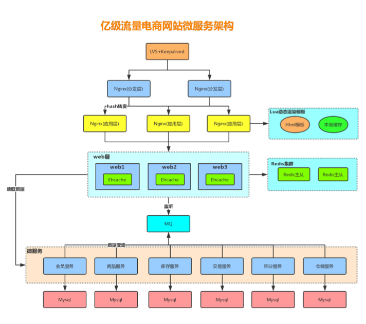
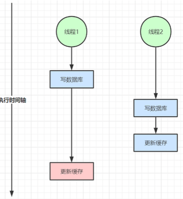
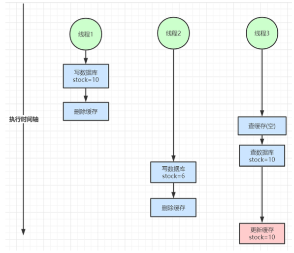
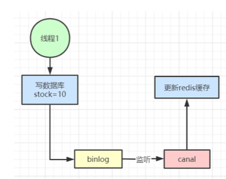

### 1. 多级缓存架构 



### 2. 缓存几大问题

#### 2.1. 缓存粒度控制

通俗来讲，缓存粒度问题就是我们在使用缓存时，是将所有数据缓存还是缓存部分数据？


缓存粒度问题是一个容易被忽视的问题，如果使用不当，可能会造成很多无用空间的浪费，可能会造成网络带宽的浪费，可能会造成代码通用性较差等情况，必须学会综合数据通用性、空间占用比、代码维护性 三点评估取舍因素权衡使用。

#### 2.2 缓存穿透问题

缓存穿透是指查询一个一定不存在的数据，由于缓存不命中，并且出于容错考虑， 如果从存储层查不到数据则不写入缓存，这将导致这个不存在的数据每次请求都要到存储层去查询，失去了缓存的意义。

数据库没有，缓存也没有 （解决方案：缓存空对象、布隆过滤器）

##### 2.2.1 可能造成原因：

1.业务代码自身问题

2.恶意攻击。爬虫等等

##### 2.2.2 危害

对底层数据源压力过大，有些底层数据源不具备高并发性。  例如mysql一般来说单台能够扛1000-QPS就已经很不错了

##### 2.2.3 解决方案

1.缓存空对象
```
public class NullValueResultDO implements Serializable{
     private static final long serialVersionUID = -6550539547145486005L;
}
 
public class UserManager {
     UserDAO userDAO;
     LocalCache localCache;
 
     public UserDO getUser(String userNick) {
          Object object = localCache.get(userNick);
          if(object != null) {
               if(object instanceof NullValueResultDO) {
                    return null;
               }
               return (UserDO)object;
          } else {
               User user = userDAO.getUser(userNick);
               if(user != null) {
                    localCache.put(userNick,user);
               } else {
                    localCache.put(userNick, new NullValueResultDO());
               }
               return user;
          }
     }          
}
```

2.布隆过滤器

  对于恶意攻击，向服务器请求大量不存在的数据造成的缓存穿透，还可以用布隆过滤器先做一次过滤，对于不 存在的数据布隆过滤器一般都能够过滤掉，
  不让请求再往后端发送。当布隆过滤器说某个值存在时，这个值可 能不存在;当它说不存在时，那就肯定不存在。

  布隆过滤器就是一个大型的位数组和几个不一样的无偏 hash 函数。所谓无偏就是能够把元素的 hash 值算得 比较均匀。
  
  向布隆过滤器中添加 key 时，会使用多个 hash 函数对 key 进行 hash 算得一个整数索引值然后对位数组长度 进行取模运算得到一个位置，
  每个 hash 函数都会算得一个不同的位置。再把位数组的这几个位置都置为 1 就 完成了 add 操作。

  向布隆过滤器询问 key 是否存在时，跟 add 一样，也会把 hash 的几个位置都算出来，看看位数组中这几个位 置是否都为 1，只要有一个位为 0，
  那么说明布隆过滤器中这个key 不存在。如果都是 1，这并不能说明这个 key 就一定存在，只是极有可能存在，因为这些位被置为 1 
  可能是因为其它的 key 存在所致。如果这个位数组 比较稀疏，这个概率就会很大，如果这个位数组比较拥挤，这个概率就会降低。
  这种方法适用于数据命中不高、 数据相对固定、 实时性低(通常是数据集较大) 的应用场景， 代码维护较为 复杂， 但是缓存空间占用很少。

1）、Google布隆过滤器的缺点

        基于JVM内存的一种布隆过滤器
        
        重启即失效
        
        本地内存无法用在分布式场景
        
        不支持大数据量存储

2）、Redis布隆过滤器

可扩展性Bloom过滤器：一旦Bloom过滤器达到容量，就会在其上创建一个新的过滤器

不存在重启即失效或者定时任务维护的成本：基于Google实现的布隆过滤器需要启动之后初始化布隆过滤器

缺点：需要网络IO，性能比Google布隆过滤器低

实现: 

``` 引入依赖 
<dependency>
    <groupId>org.redisson</groupId>
    <artifactId>redisson</artifactId>
    <version>3.6.5</version>
</dependency>
```

  伪代码: 

````java
package com.redission;

import org.redisson.Redisson;
import org.redisson.api.RBloomFilter;
import org.redisson.api.RedissonClient;
import org.redisson.config.config;

public class RedissionBloomFilter {

    public static void main(String[] args) {
        Config config = new Config();
        config.useSingServer().setAddress("redis://localhost:6379");
        // 构造Redisson 
        RedissonClient redisson = Redisson.create(config);
        
        // 初始化布隆过滤器:预计元素 1000000000L ，误差率为 3%， 根据这两个参数会计算出底层的bit 数组大小 
        RBloomFilter<String> bloomFilter = redisson.getBloomFilter("nameList");
        bloomFilter.tryInit(1000000000L, 0.03);
        
        // 将 wlz 插入到布隆过滤器中 
        bloomFilter.add("wlz");
        
        // 判断下面号码是否在布隆过滤器中 
        System.out.println(bloomFilter.contains("wlz1"));
        System.out.println(bloomFilter.contains("wlz1"));
        System.out.println(bloomFilter.contains("wlz"));
    }
}

````

#### 2.3 缓存(失效)击穿

缓存击穿是指缓存中没有但数据库中有的数据（一般是缓存时间到期），这时由于并发用户特别多，同时读缓存没读到数据，又同时去数据库去取数据，引起数据库压力瞬间增大，造成过大压力

我们知道，使用缓存，如果获取不到，才会去数据库里获取。但是如果是热点 key，访问量非常的大，数据库在重建缓存的时候，会出现很多线程同时重建的情况。
因为高并发导致的大量热点的 key 在重建还没完成的时候，不断被重建缓存的过程，由于大量线程都去做重建缓存工作，导致服务器拖慢的情况。

数据刚好失效（缓存中没有这条数据），此时来了并发访问 （解决方案：使用分布式锁,设置不同的过期时间）

##### 2.3.1 解决方案

 1. 设置不同(随机)过期时间

```java
import java.util.Random;

public class Test {

    public static void main(String[] args) {

        String str = get(key);
    }

    static String get(String key) {
        // 从缓存中获取数据
        String cacheValue = cache.get(key);

        // 如果缓存为空
        if (StringUtils.isBlank(cacheValue)) {
            // 从存储中获取 
            String storageValue = storage.get(key);
            cache.set(key, storageValue);
            // 设置一个过期时间(300到600之间的一个随机数)
            int expireTime = new Random().nextInt(300) + 300;
            if (storageValue == null) {
                cache.expire(key, expireTime);
            } 
            return storageValue;
        } else {
            // 缓存非空
            return cacheValue;
        }
    }

}
```

#### 2.4. 缓存雪崩问题

缓存雪崩是指机器宕机或在我们设置缓存时采用了相同的过期时间，导致缓存在某一时刻同时失效，请求全部转发到DB，DB瞬时压力过重雪崩。

1：在缓存失效后，通过加锁或者队列来控制读数据库写缓存的线程数量。比如对某个key只允许一个线程查询数据和写缓存，其他线程等待。

2：做二级缓存，A1为原始缓存，A2为拷贝缓存，A1失效时，可以访问A2，A1缓存失效时间设置为短期，A2设置为长期

3：不同的key，设置不同的过期时间，让缓存失效的时间点尽量均匀。

4：如果缓存数据库是分布式部署，将热点数据均匀分布在不同的缓存数据库中。

大部分数据失效（机器宕机） 解决方案（搭建高可用集群、错开缓存失效时间，限流）

#### 2.5 热点缓存key重建优化

开发人员使用“缓存+过期时间”的策略既可以加速数据读写， 又保证数据的定期更新， 这种模式基本能够满 足绝大部分需求。 但是有两个问题如果同时出现， 可能就会对应用造成致命的危害：

      当前key是一个热点key（例如一个热门的娱乐新闻），并发量非常大。 
      重建缓存不能在短时间完成， 可能是一个复杂计算， 例如复杂的SQL、 多次IO、 多个依赖等。 

在缓存失效的瞬间， 有大量线程来重建缓存， 造成后端负载加大， 甚至可能会让应用崩溃。 要解决这个问题主要就是要避免大量线程同时重建缓存。 我们可以利用互斥锁来解决，此方法只允许一个线程重建缓存， 其他线程等待重建缓存的线程执行完， 重新从 缓存获取数据即可。

1.互斥锁

第一次获取缓存的时候，加一个锁，然后查询数据库，接着是重建缓存。这个时候，另外一个请求又过来获取缓存，发现有个锁，这个时候就去等待，之后都是一次等待的过程，直到重建完成以后，锁解除后再次获取缓存命中。

```
String get(String key) {
    // 从Redis中获取数据
    String value = redis.get(key);
    // 如果value为空， 则开始重构缓存 
    if (value == null) {
       // 只允许一个线程重建缓存， 使用nx， 并设置过期时间ex 
       String mutexKey = "mutext:key:" + key; 
       if (redis.set(mutexKey, "1", "ex 180", "nx")) { 
          // 从数据源获取数据 
          value = db.get(key); 
          // 回写Redis， 并设置过期时间 
          redis.setex(key, timeout, value); 
          // 删除key_mutex 14 redis.delete(mutexKey); 
          }
          // 其他线程休息50毫秒后重试 
      else { 
             Thread.sleep(50); 
             get(key); 
      } 
   } 
      return value; 
}
```

互斥锁的优点是思路非常简单，具有一致性，但是互斥锁也有一定的问题，就是大量线程在等待的问题。存在死锁的可能性。


#### 2.6 缓存与数据库双写不一致

 在大并发下，同时操作数据库与缓存会存在数据不一致问题。

1、双写不一致情况



2、读写并发不一致



*解决方案：*

       1、对于并发几率很小的数据(如个人维度的订单数据、用户数据等)，这种几乎不用考虑这个问题，很少会发生 缓存不一致，可以给缓存数据加上过期时间，每隔一段时间触发读的主动更新即可。 
       2、就算并发很高，如果业务上能容忍短时间的缓存数据不一致(如商品名称，商品分类菜单等)，缓存加上过期 时间依然可以解决大部分业务对于缓存的要求。 
       3、如果不能容忍缓存数据不一致，可以通过加读写锁保证并发读写或写写的时候按顺序排好队，读读的时候相 当于无锁。 
       4、也可以用阿里开源的canal通过监听数据库的binlog日志及时的去修改缓存，但是引入了新的中间件，增加 了系统的复杂度。



*总结：*

      以上我们针对的都是读多写少的情况加入缓存提高性能，如果写多读多的情况又不能容忍缓存数据不一致，那 就没必要加缓存了，可以直接操作数据库。放入缓存的数据应该是对实时性、一致性要求不是很高的数据。切 记不要为了用缓存，同时又要保证绝对的一致性做大量的过度设计和控制，增加系统复杂性！

### 3. 开发规范与性能优化 

#### 3.1 键值设计 

##### 3.1.1 key 名设计 

(1)【建议】: 可读性和可管理性 

  以业务名(或数据库名)为前缀(防止key冲突)，用冒号分隔，比如业务名:表名:id

```
 trade:order:1
```

(2)【建议】:简洁性

保证语义的前提下，控制key的长度，当key较多时，内存占用也不容忽视，例如: 

```
user:{uid}:friends:messages:{mid} 简化为 u:{uid}:fr:m:{mid}
```

(3)【强制】:不要包含特殊字符

反例:包含空格、换行、单双引号以及其他转义字符

##### 3.1.2 value 设计 

(1)【强制】:拒绝bigkey(防止网卡流量、慢查询)

  在Redis中，一个字符串最大512MB，一个二级数据结构(例如hash、list、set、zset)可以存 储大约40亿个(2^32-1)个元素，但实际中如果下面两种情况，我就会认为它是bigkey。

    1. 字符串类型:它的big体现在单个value值很大，一般认为超过10KB就是bigkey。

    2. 非字符串类型:哈希、列表、集合、有序集合，它们的big体现在元素个数太多。
   
    一般来说，string类型控制在10KB以内，hash、list、set、zset元素个数不要超过5000。

    反例:一个包含200万个元素的list。 

    非字符串的bigkey，不要使用del删除，使用hscan、sscan、zscan方式渐进式删除，同时要注 意防止bigkey过期时间自动删除问题
    (例如一个200万的zset设置1小时过期，会触发del操作，造 成阻塞)

###### bigkey 的危害  

1.导致redis阻塞

2.网络拥塞 bigkey也就意味着每次获取要产生的网络流量较大，假设一个bigkey为1MB，客户端每秒访问 量为1000，那么每秒产生1000MB的流量，
对于普通的千兆网卡(按照字节算是128MB/s)的服务 器来说简直是灭顶之灾，而且一般服务器会采用单机多实例的方式来部署，
也就是说一个bigkey 可能会对其他实例也造成影响，其后果不堪设想。

3. 过期删除 有个bigkey，它安分守己(只执行简单的命令，例如hget、lpop、zscore等)，但它设置了过 期时间，当它过期后，会被删除，
   如果没有使用Redis 4.0的过期异步删除(lazyfree-lazy- expire yes)，就会存在阻塞Redis的可能性。  
   
###### bigkey的产生: 

一般来说，bigkey的产生都是由于程序设计不当，或者对于数据规模预料不清楚造成的，来看几 个例子:

    (1) 社交类:粉丝列表，如果某些明星或者大v不精心设计下，必是bigkey。
    (2) 统计类:例如按天存储某项功能或者网站的用户集合，除非没几个人用，否则必是bigkey。 
    (3) 缓存类:将数据从数据库load出来序列化放到Redis里，这个方式非常常用，但有两个地方需 要注意，
        
        第一，是不是有必要把所有字段都缓存;
        第二，有没有相关关联的数据，有的同学为了 图方便把相关数据都存一个key下，产生bigkey。

###### 如何优化bigkey

1. 拆
   
     big list: list1、list2、...listN
     big hash:可以讲数据分段存储，比如一个大的key，假设存了1百万的用户数据，可以拆分成 200个key，每个key下面存放5000个用户数据

2. 如果bigkey不可避免，也要思考一下要不要每次把所有元素都取出来(例如有时候仅仅需要 hmget，而不是hgetall)，删除也是一样，
   尽量使用优雅的方式来处理。

(2)【推荐】:选择适合的数据类型。

例如:实体类型(要合理控制和使用数据结构，但也要注意节省内存和性能之间的平衡)

反例:

```
setuser:1:nametom
setuser:1:age19
setuser:1:favorfootball
```

正例:

```
hmsetuser:1nametomage19favorfootball
```

3.【推荐】:控制key的生命周期，redis不是垃圾桶。

建议使用expire设置过期时间(条件允许可以打散过期时间，防止集中过期)。


#### 3.2 命令使用 

##### 1.【推荐】 O(N)命令关注N的数量

例如hgetall、lrange、smembers、zrange、sinter等并非不能使用，但是需要明确N的值。有 遍历的需求可以使用hscan、sscan、zscan代替。

##### 2.【推荐】:禁用命令

禁止线上使用keys、flushall、flushdb等，通过redis的rename机制禁掉命令，或者使用scan的 方式渐进式处理。

##### 3.【推荐】合理使用select

redis的多数据库较弱，使用数字进行区分，很多客户端支持较差，同时多业务用多数据库实际还 是单线程处理，会有干扰。

##### 4.【推荐】使用批量操作提高效率

```
原生命令:例如mget、mset。
2 非原生命令:可以使用pipeline提高效率。
 
```

但要注意控制一次批量操作的元素个数(例如500以内，实际也和元素字节数有关)。 注意两者不同:

```
1. 原生是原子操作，pipeline是非原子操作。 
2.pipeline可以打包不同的命令，原生做不到 
3.pipeline需要客户端和服务端同时支持。
```

##### 5.【建议】Redis事务功能较弱，不建议过多使用，可以用lua替代

#### 3.3 客户端使用

##### 1.【推荐】

避免多个应用使用一个Redis实例 正例:不相干的业务拆分，公共数据做服务化。

##### 2.【推荐】

使用带有连接池的数据库，可以有效控制连接，同时提高效率，标准使用方式:

```
JedisPoolConfigjedisPoolConfig=newJedisPoolConfig();
jedisPoolConfig.setMaxTotal(5);
jedisPoolConfig.setMaxIdle(2);
jedisPoolConfig.setTestOnBorrow(true);

JedisPooljedisPool=newJedisPool(jedisPoolConfig,"192.168.0.60",6379,3000,null); 7
Jedisjedis=null;
try{
    jedis = jedisPool.getResource();
    //具体的命令
    jedis.executeCommand() 
}catch(Exceptione){
    logger.error("op key {} error: " + e.getMessage(), key, e); 
}finally{
    //注意这里不是关闭连接，在JedisPool模式下，Jedis会被归还给资源池。 if (jedis != null)
    jedis.close();
}
```

##### 3.【建议】

高并发下建议客户端添加熔断功能(例如sentinel、hystrix)

##### 4.【推荐】

设置合理的密码，如有必要可以使用SSL加密访问

##### 5. 【建议】

 Redis对于过期键有三种清除策略:
    
    1. 被动删除:当读/写一个已经过期的key时，会触发惰性删除策略，直接删除掉这个过期 key
    2. 主动删除:由于惰性删除策略无法保证冷数据被及时删掉，所以Redis会定期主动淘汰一 批已过期的key
    3. 当前已用内存超过maxmemory限定时，触发主动清理策略
   
主动清理策略在Redis 4.0 之前一共实现了 6 种内存淘汰策略，在 4.0 之后，又增加了 2 种策 略，总共8种:

a) 针对设置了过期时间的key做处理:

    1. volatile-ttl:在筛选时，会针对设置了过期时间的键值对，根据过期时间的先后进行删 除，越早过期的越先被删除。
    2. volatile-random:就像它的名称一样，在设置了过期时间的键值对中，进行随机删除。 
    3. volatile-lru:会使用 LRU 算法筛选设置了过期时间的键值对删除。
    4. volatile-lfu:会使用 LFU 算法筛选设置了过期时间的键值对删除。

b) 针对所有的key做处理:
    
    5. allkeys-random:从所有键值对中随机选择并删除数据。 
    6. allkeys-lru:使用 LRU 算法在所有数据中进行筛选删除。 
    7. allkeys-lfu:使用 LFU 算法在所有数据中进行筛选删除。

c) 不处理:
    8. noeviction:不会剔除任何数据，拒绝所有写入操作并返回客户端错误信息"(error) OOM command not allowed when used memory"，此时Redis只响应读操作。


##### 6. LRU 算法(Least Recently Used，最近最少使用) 

 淘汰很久没被访问过的数据，以最近一次访问时间作为参考。
 
##### 7. LFU 算法(Least Frequently Used，最不经常使用)

淘汰最近一段时间被访问次数最少的数据，以次数作为参考。

当存在热点数据时，LRU的效率很好，但偶发性的、周期性的批量操作会导致LRU命中率急剧下 降，缓存污染情况比较严重。这时使用LFU可能更好点。

根据自身业务类型，配置好maxmemory-policy(默认是noeviction)，推荐使用volatile-lru。
如 果不设置最大内存，当 Redis 内存超出物理内存限制时，内存的数据会开始和磁盘产生频繁的交 换 (swap)，会让 Redis 的性能急剧下降。

当Redis运行在主从模式时，只有主结点才会执行过期删除策略，然后把删除操作”del key”同 步到从结点删除数据。