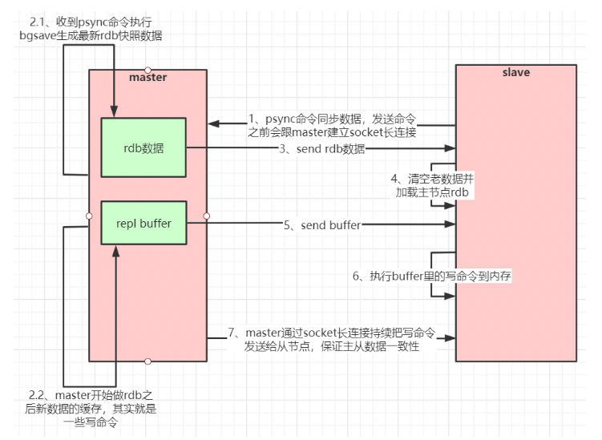
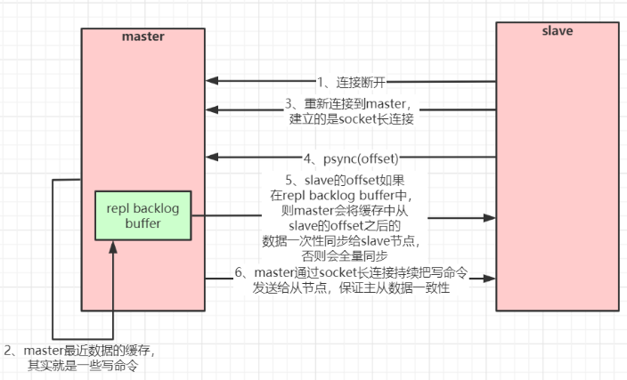
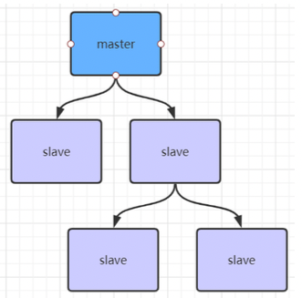
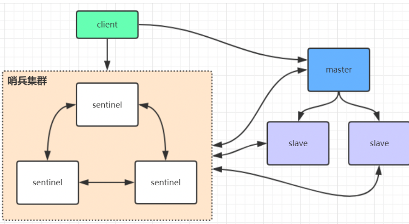
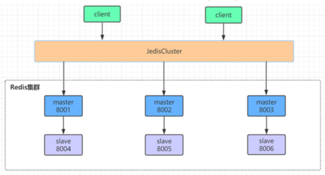
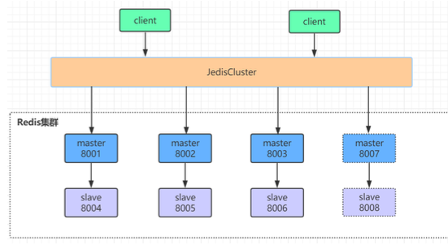

### Redis主从复制

  如果为master 配置了一个slave，不管这个slave 是否是第一次连接上master,它都会发送一个PSYNC 命令给master 请求复制数据. 

   master 收到PSYNC 命令后，会在后台进行数据持久化通过bgsave 生成最新的rdb 快照文件，持久化期间，master 会继续接收客户端的请求，它会把这些可能修改数据集的请求缓存
   在内存中。当持久化进行完毕以后，master 会把这份rdb 文件数据集发送给slave,slave 会把接收到的数据进行持久化生成rdb,然后再加载到内存中。然后
   ，master 再将之前缓存在内存中的命令发送给slave. 
  
   当master 与 slave 之间的连接由于某些原因而断开时，slave 能够自动重连master,如果master 收到了多个slave 并发连接请求，它只会进行一次持久化，而不是一个连接一次，然后再把这一份持久化
   的数据发送给多个并发连接的slave. 

  主从复制(全量复制) 流程图: 



  主从复制(部分复制，断点续传) 流程图: 



  当master 和 slave 断开连接重连后，一般都会对整份数据进行复制，但从 redis2.8 版本开始， redis 改用可以支持部分数据复制的命令 PYSNC 去master 同步数据，
  slave 与master 能够在网络连接断开重连后只进行部分数据复制(断点续传)

  master 会在其内存中创建一个复制数据用的缓存队列，缓存最近一段时间的数据，master 和它 所有的slave 都维护了复制数据下标 offset 和  master 的进程id, 
  因此，当网络连接断开后，slave 会请求master 继续进行未完成的复制，从所记录的数据下标开始。如果master 进程id 变化了，或者从节点数据下标offset 太旧，已经不在master 
  的缓存队列里了，那么将会进行一次全量数据的复制。 

  如果有很多从节点, 为了缓解主从复制风暴(多个从节点同时复制主节点导致主节点压力过大)， 可以做如下架构，让部分从节点与从节点(与主节点同步)同步数据



#### 1.是什么
   
   1.单机有什么问题：
   
   单机故障
   
   容量瓶颈
   
   qps瓶颈
   
   主机数据更新后根据配置和策略，自动同步到备机的master/slaver机制，mester已写为主，slaver已读为主

#### 2.能干嘛
   
   1.读写分离
   
   2.容灾备份
   
#### 3.怎么玩
   
   玩法原则:
   
    1.配从不配主
   
    2.使用命令 SLAVEOF 动态指定主从关系  ，如果设置了密码，关联后使用 config set masterauth 密码
   
    3.配置文件和命令混合使用时，如果混合使用，动态指定了主从，请注意一定要修改对应的配置文件
    
   1.新建redis8000,redis8001,redis8002文件夹
    
   2.将redis.conf文件复制在redis8000下
    
   3.分别修改个目录下的redis.conf文件
        
    redis8000/redis.conf
        
        1.bind 192.168.0.104   指定本机ip
        2.port 8000
        3.daemonize yes
        4.pidfile /var/run/redis_8000.pid
        5.dir /myredis/redis8000
        6.requirepass 123456
    
   4.把redis8000/redis.conf文件复制到redis8001,redis8002下
   
    redis8001/redis.conf
    	
    	1.   :%s/8000/8001/g    批量替换
    	
    	2.   replicaof 192.168.0.104 8000
    	
    	3.   masterauth 123456
    	
     redis8002/redis.conf

        1.  :%s/8000/8002/g    批量替换
 	    
 	    2.  replicaof 192.168.0.104 8000
 	    
 	    3.  masterauth 123456


   5.分别启动8000.8001,8002实例
   
```
[root@localhost  myredis]# /usr/local/bin/redis-server /myredis/redis8000/redis.conf
[root@localhost  myredis]# /usr/local/bin/redis-server /myredis/redis8001/redis.conf
[root@localhost  myredis]# /usr/local/bin/redis-server /myredis/redis8002/redis.conf
```

   6.客户端连接

   /usr/local/bin/redis-cli -h 192.168.0.104 -p 8000 -a 123456
   
   /usr/local/bin/redis-cli -h 192.168.0.104 -p 8001 -a 123456
   
   /usr/local/bin/redis-cli -h 192.168.0.104 -p 8002 -a 123456

#### 工作流程
   
##### 1.建立连接
    
   1.设置master的地址和端口，发送slaveof ip port指令，master会返回响应客户端，根据响应信息保存master ip  port信息 (连接测试)
    
   2.根据保存的信息创建连接master的socket
    
   3.周期性发送ping，master会响应pong
    
   4.发送指令 auth password（身份验证），master验证身份
    
   5.发送slave端口信息，master保存slave的端口号
   
##### 2.数据同步
   
   1.slave发送指令 psyn2
   
   2.master 执行bgsave
   
   3.在第一个salve连接时，创建命令缓存区
   
   4.生成RDB文件，通过socket发送给slave
   
   5.slave接收RDB，清空数据，执行RDB文件恢复过程
   
   6.发送命令告知RDB恢复已经完成（告知全量复制完成）
   
   7.master发送复制缓冲区信息
   
   8.slave接收信息，执行重写后恢复数据
   
   **注意：** master会保存slave从我这里拿走了多少数据，保存salve的偏移量
   
##### 3.命令传播
   
   slave心跳：replconf    ack     {offset}    汇报slave自己的offset，获取最新数据指令
   
   命令传播阶段出现断网：
    
    • 网络闪断闪连    忽略
    • 段时间断网     增量
    • 长时间断网     全量
   
   全量复制核心三个要素
   
   1. 服务器运行id
       
      用于服务器之间通信验证身份，master首次连接slave时，会将自己的run_id发送给slave，slave保存此ID
   
   2. 主服务器积压的命令缓冲区
       
       先进先出队列
   
   3. 主从服务器的复制偏移量
       
       用于比对偏移量，然后判断出执行全量还是增量
       
####  4.全量复制消耗
   
   1.bgsave时间
   
   2.rdb文件网络传输
   
   3.从节点请求请求数据时间
   
   4.从节点加载rdb的时间
   
   5.可能的aof重写时间

#### 5.主从复制的缺点
   
   1.由于所有的写操作都是先在Master上操作，然后同步更新到Slave上，所以从Master同步到Slave机器有一定的延迟，当系统很繁忙的时候，延迟问题会更加严重，Slave机器数量的增加也会使这个问题更加严重。
   
   2.当主机宕机之后，将不能进行写操作，需要手动将从机升级为主机，从机需要重新制定master
   简单总结：
    
    一个master可以有多个Slave
    
    一个slave只能有一个master
    
    数据流向是单向的，只能从主到从

### redis哨兵模式


   
#### 1.是什么，能干嘛？
   
   在Redis 2.8版本开始引入。哨兵的核心功能是主节点的自动故障转移。
   
   通俗来讲哨兵模式的出现是就是为了解决我们主从复制模式中需要我们人为操作的东西变为自动版，并且它比人为要更及时

#### 2.哨兵主要功能（做了哪些事）
   
   监控（Monitoring）：哨兵会不断地检查主节点和从节点是否运作正常。
   
   自动故障转移（Automatic Failover）：当主节点不能正常工作时，哨兵会开始自动故障转移操作，它会将失效主节点的其中一个从节点升级为新的主节点，并让其他从节点改为复制新的主节点。
   
   配置提供者（Configuration Provider）：客户端在初始化时，通过连接哨兵来获得当前Redis服务的主节点地址。
   
   通知（Notification）：哨兵可以将故障转移的结果发送给客户端。
   
   其中，监控和自动故障转移功能，使得哨兵可以及时发现主节点故障并完成转移；而配置提供者和通知功能，则需要在与客户端的交互中才能体现。

#### 3.架构
   
   哨兵节点：哨兵系统由一个或多个哨兵节点组成，哨兵节点是特殊的Redis节点，不存储数据。
   
   数据节点：主节点和从节点都是数据节点。

#### 4.怎么玩
   
##### 1.部署主从节点
   
   哨兵系统中的主从节点，与普通的主从节点配置是一样的，并不需要做任何额外配置。下面分别是主节点（port=8000）和2个从节点（port=8001/8002）的配置文件；
   
   我们刚才搭建的主从复制就是主从节点

##### 2.部署哨兵节点
   
   哨兵节点本质上是特殊的Redis节点。
   
   3个哨兵节点的配置几乎是完全一样的，主要区别在于端口号的不同（26379 / 26380 / 26381）下面以26379节点为例介绍节点的配置和启动方式；配置部分尽量简化：
   
   // sentinel-26379.conf
```
 port 26379
   daemonize yes
   logfile "26379.log"
   sentinel monitor mymaster 192.168.0.104 6379 2
```

   其中，sentinel monitor mymaster 192.168. 92.128 6379 2配置的含义是：该哨兵节点监92.168.0.104 6379这个主节点，该主节点的名称是mymaster，最后的2的含义与主节点的故障判定有关：至少需要2个哨兵节点同意，才能判定主节点故障并进行故障转移。
   
   哨兵节点的启动有两种方式，二者作用是完全相同的：
   
    redis-sentinel sentinel-26379.conf
   
    redis-server sentinel-26379.conf --sentinel
 
##### 5.故障转移演示（哨兵的监控和自动故障转移功能）
    
   使用kill命令杀掉主节点

##### 6.客户端（jedis）访问哨兵系统（自动故障转移功能）
   
```
public static void main(String[] args)  {
        Logger logger= LoggerFactory.getLogger(TestJedisSentinel.class);
        Set<String> set=new HashSet<>();
        set.add("192.168.0.104:28000");
        set.add("192.168.0.104:28001");
        set.add("192.168.0.104:28002");
        JedisSentinelPool jedisSentinelPool=new JedisSentinelPool("mymaster",set,"123456");
        while (true) {
            Jedis jedis=null;
            try {
                jedis = jedisSentinelPool.getResource();
                String s = UUID.randomUUID().toString();
                jedis.set("k" + s, "v" + s);
                System.out.println(jedis.get("k" + s));
                Thread.sleep(1000);
            }catch (Exception e){
                logger.error(e.getMessage());
            }finally {
                if(jedis!=null){
                    jedis.close();
                }
            }
        }
    }
```

#### 7.基本原理
   
   关于哨兵的原理，关键是了解以下几个概念：
   
   主观下线：在心跳检测的定时任务中，如果其他节点超过一定时间没有回复，哨兵节点就会将其进行主观下线。顾名思义，主观下线的意思是一个哨兵节点“主观地”判断下线；与主观下线相对应的是客观下线。
   
   客观下线：哨兵节点在对主节点进行主观下线后，会通过sentinel is-master-down-by-addr命令询问其他哨兵节点该主节点的状态；如果判断主节点下线的哨兵数量达到一定数值，则对该主节点进行客观下线。
   
   需要特别注意的是，客观下线是主节点才有的概念；如果从节点和哨兵节点发生故障，被哨兵主观下线后，不会再有后续的客观下线和故障转移操作。
   
   定时任务：每个哨兵节点维护了3个定时任务。定时任务的功能分别如下：
   
   1.每10秒通过向主从节点发送info命令获取最新的主从结构；
   
    发现slave节点
   
    确定主从关系
   
   2.每2秒通过发布订阅功能获取其他哨兵节点的信息；SUBSCRIBE  c2     PUBLISH c2 hello-redis
   
    交互对节点的“看法”和自身情况
   
   3.每1秒通过向其他节点发送ping命令进行心跳检测，判断是否下线（monitor）。
   
    心跳检测，失败判断依据
    
    选举领导者哨兵节点：当主节点被判断客观下线以后，各个哨兵节点会进行协商，选举出一个领导者哨兵节点，并由该领导者节点对其进行故障转移操作。
    
    监视该主节点的所有哨兵都有可能被选为领导者，选举使用的算法是Raft算法；Raft算法的基本思路是先到先得：即在一轮选举中，哨兵A向B发送成为领导者的申请，如果B没有同意过其他哨兵，则会同意A成为领导者。选举的具体过程这里不做详细描述，一般来说，哨兵选择的过程很快，谁先完成客观下线，一般就能成为领导者。
    
    故障转移：选举出的领导者哨兵，开始进行故障转移操作，该操作大体可以分为3个步骤：
    
    在从节点中选择新的主节点：选择的原则是，
        1.首先过滤掉不健康的从节点；
        2.过滤响应慢的节点
        3.过滤与master断开时间最久的
        4.优先原则
   	        先选择优先级最高的从节点（由replica-priority指定）；如果优先级无法区分，
            则选择复制偏移量最大的从节点；如果仍无法区分，
   	        则选择runid最小的从节点。
   
   更新主从状态：通过slaveof no one命令，让选出来的从节点成为主节点；并通过slaveof命令让其他节点成为其从节点。
   
   将已经下线的主节点（即6379）保持关注，当6379从新上线后设置为新的主节点的从节点

#### 8.实践建议
   
   哨兵节点的数量应不止一个。一方面增加哨兵节点的冗余，避免哨兵本身成为高可用的瓶颈；另一方面减少对下线的误判。此外，这些不同的哨兵节点应部署在不同的物理机上。
   
   哨兵节点的数量应该是奇数，便于哨兵通过投票做出“决策”：领导者选举的决策、客观下线的决策等。
   
   各个哨兵节点的配置应一致，包括硬件、参数等；此外应保证时间准确、一致。
   
#### 哨兵模式总结
   
   在主从复制的基础上，哨兵引入了主节点的自动故障转移，进一步提高了Redis的高可用性；但是哨兵的缺陷同样很明显：哨兵无法对从节点进行自动故障转移，在读写分离场景下，从节点故障会导致读服务不可用，需要我们对从节点做额外的监控、切换操作。此外，哨兵仍然没有解决写操作无法负载均衡、及存储能力受到单机限制的问题

### redis cluster高可用集群 




   
#### 1.redis cluster集群是什么？
   
   redis cluster集群是一个由多个主从节点群组成的分布式服务器群，它具有复制、高可用和分片特
   性。Redis cluster集群不需要sentinel哨兵也能完成节点移除和故障转移的功能。需要将每个节点
   设置成集群模式，这种集群模式没有中心节点，可水平扩展，据官方文档称可以线性扩展到
   1000节点。redis cluster集群的性能和高可用性均优于之前版本的哨兵模式，且集群配置非常简单
   
#### 2.redis cluster集群搭建
   
   /usr/local/bin/redis-cli --cluster help
   
##### 1.原生搭建
   
   1.配置开启cluster节点
    
    cluster-enabled yes（启动集群模式）
    cluster-config-file nodes-8001.conf（这里800x最好和port对应上）
   
   2.meet
    
    cluster meet ip port
   
   3.指派槽
    
    查看crc16 算法算出key的槽位命令  cluster keyslot key
    16384/3  0-5461  5462-10922  10923-16383
    16384/4 4096
    cluster addslots slot（槽位下标）
   
   4.分配主从
    
    cluster replicate node-id

##### 2.使用redis提供的rb脚本
    
   redis cluster集群需要至少要三个master节点，我们这里搭建三个master节点，并且给每个
   master再搭建一个slave节点，总共6个redis节点，由于节点数较多，这里采用在一台机器
   上创建6个redis实例，并将这6个redis实例配置成集群模式，所以这里搭建的是伪集群模
   式，当然真正的分布式集群的配置方法几乎一样，搭建伪集群的步骤如下：
   
   第一步：在/usr/local下创建文件夹redis-cluster，然后在其下面分别创建6个文件夾如下
    
     （1）mkdir -p /usr/local/redis-cluster
     （2）mkdir 7000、 mkdir 7001、 mkdir 7002、 mkdir 7003、 mkdir 7004、 mkdir 7005
   
   第二步：把之前的redis.conf配置文件copy到8001下，修改如下内容：
     
     （1）daemonize yes
     （2）port 8001（分别对每个机器的端口号进行设置）
     （3）bind 127.0.0.1（如果只在本机玩则可以指定为127.0.0.1  如果需要外网访问则需要指定本机真实ip）
     定可能会出现循环查找集群节点机器的情况）
     （4）dir /usr/local/redis-cluster/8001/（指定数据文件存放位置，必须要指定不同的目
    录位置，不然会丢失数据）
     （5）cluster-enabled yes（启动集群模式）
     （6）cluster-config-file nodes-8001.conf（这里800x最好和port对应上）
     （7）cluster-node-timeout 5000
     （8）appendonly yes
   
   第三步：把修改后的配置文件，批量替换一下，然后生成到新的文件到其他的各个目录
     
     如：
        sed 's/7000/7001/g' /usr/local/redis-cluster/7000/redis.conf  > /usr/local/redis-cluster/7001/redis.conf
     语法： sed 's/目标值/替换成什么值/g'  目标文件  >   替换后生成到哪里
   
   第四步：由于 redis集群需要使用 ruby命令，所以我们需要安装 ruby（redis5.0之后省略）
     
     （1）yum install ruby
     （2）yum install rubygems
     （3）gem install redis --version 3.0.0（安装redis和 ruby的接囗）
   
   第五步：分别启动6个redis实例，然后检查是否启动成功
     
     （1）/usr/local/redis/bin/redis-server /usr/local/redis-cluster/800*/redis.conf
     （2）ps -ef | grep redis 查看是否启动成功
   
   第六步：在redis3的安装目录下执行 redis-trib.rb命令创建整个redis集群
     
     （1）cd /usr/local/redis3/src
     （2）./redis-trib.rb create --replicas 1 127.0.0.1:9000 127.0.0.1:9001
         127.0.0.1:9002 127.0.0.1:9003 127.0.0.1:9004  127.0.0.1:9005
      
      redis 5.0 之后不需要上述操作，只需要执行以下步骤即可 ( --cluster -replicas 1  分配主从 1：代表 3：3 前面三个为master 后面三个为slave ， 2：代表 2：4 前面2个为master，后面四个为slave ，但是redis 搭建集群必须要有3个 master)
      -a 123456 输入密码
      /usr/local/bin/redis-cli --cluster create 192.168.27.133 7000 192.168.27.133 7001 192.168.27.133 7002 192.168.27.133 7003 192.168.27.133 7004 192.168.27.133 7005 --cluster -replicas 1 -a 123456
      
   第七步：验证集群：
    
    （1）连接任意一个客户端即可：./redis-cli -c -h -p (-c表示集群模式，指定ip地址和端口
    号）如：/usr/local/redis/bin/redis-cli -c -h 127.0.0.1 -p 800*
    （2）进行验证： cluster info（查看集群信息）、cluster nodes（查看节点列表）
    （3）进行数据操作验证
    （4）关闭集群则需要逐个进行关闭，使用命令：
    /usr/local/redis/bin/redis-cli -c -h 127.0.0.1 -p 800* shutdown
    
    扩展：
          -a 123456 输入密码
         /usr/local/bin/redis-cli -h 192.168.27.133 -p 7000 -a 123456 --cluster help (查看搭建redis 集群可以使用哪些命令，相当于一个文档)
   
#### 3.集群伸缩
   
##### 1.扩容集群
   
   1.准备新节点
   
   2.加入集群
    
    使用redis-cli  语法：add-node 新节点ip  端口  已存在节点ip 端口
    使用原生命令 语法：cluster meet ip port
   
    指定主从
    使用redis-cli  语法（加入时指定）：add-node 新节点ip  端口  已存在节点ip 端口  --cluster-slave --cluster-master-id masterID
    使用原生命令  语法：cluster replicate node-id
    
   3.迁移槽和数据
    
    1.槽迁移计划
        
        语法：/redis-cli --cluster reshard 已存在节点ip ： 端口
        /usr/local/bin/redis-cli --cluster reshard 192.168.204.188:7000
    
    2.迁移数据
        执行流程：提示要分配多少槽-》接收节点ID-》all/done
    
    3.添加从节点

##### 2.缩容集群
   
   1.下线迁移槽
   
    语法：redis-cli --cluster reshard --cluster-from 要迁出节点ID  --cluster-to  接收槽节点ID --cluster-slots 迁出槽数量 已存在节点ip 端口
    /usr/local/bin/redis-cli --cluster reshard --cluster-from a2fdd1359d03acacf2a6e558acbc006639445d53 --cluster-to 1794864d5f8af79e88cfc0f699f02b6341c78b5c --cluster-slots 1366 192.168.0.104 7000
   
   2.忘记节点.关闭节点
    
    语法： redis-cli --cluster del-node 已存在节点IP：端口 要删除的节点ID
    /usr/local/bin/redis-cli --cluster del-node 192.168.0.104:7000 8de55e2a7419983184cede9daab5d36ee9da1fa3

#### 4.cluster客户端
   
   1.moved重定向：指我们发送命令时，会对发送的key进行crc16算法，得到一个数字，然而我们连接的客户端并不是管理这个数字的范围，所以会返回错误并告诉你此key应该对应的槽位，然后客户端需要捕获此异常，重新发起请求到对应的槽位
   
   2.asx重定向：指在我们送发命令时，对应的客户端正在迁移槽位中，所以此时我们不能确定这个key是还在旧的节点中还是新的节点中
   
   3.smart客户端
    
    1.从集群中选取一个可运行节点，使用cluster slots初始化槽和节点映射。
    2.将cluster slots的结果映射到本地，为每个节点创建jedispool
    3.准备执行命令
  
#### 5.故障转移（与哨兵相似）
   
   1.故障发现： 通过ping/pong消息实现故障发现（不依赖sentinel）
   
   2.故障恢复
    1.检查资格
    1.每个从节点检查与主节点的断开时间
   超过cluster-node-timeout * cluster-replica-validity-factor 时间取消资格
   
   2.选择偏移量最大的
    
    替换主节点
    
    1.当前从节点取消复制变为主节点（slaveof no one）
    2.撤销以前主节点的槽位，给新的主节点
    3.向集群广播消息，表明已经替换了故障节点


### redis 集群原理分析 

  redis Cluster 将所有数据划分为 16384 个 slots(槽位)， 每个节点负责其中一部分槽位.槽位的信息存储于每个节点中。 

  当redis cluster 的客户端来连接集群时，它会得到一份集群的槽位配置信息并将其缓存在客户端本地。这样当客户端要查找某个key 时，可以直接定位到目标节点。 
  同时因为槽位可能会存在客户端与服务器不一致情况，还需要纠正机制来实现槽位信息的校验调整。 

#### 槽位定位算法

  Cluster 默认会对key 值 使用crc16 算法进行hash 得到一个整数值，然后用这个整数值对 16384 进行取模来得到具体槽位. 

  HASH_SLOT = crc16(key) mod 16384 

#### 跳转重定位

  当客户端向一个错误的节点发出了指令，该节点会发现指令的key 所在的槽位并不归自己管理，这时它会向客户端发送一个特殊的跳转指令携带目标操作的节点地址，
  告诉客户端去连接这个节点获取数据.客户端收到指令后除了跳转到正确的节点上去操作，还会同步更新纠正本地的槽位映射表缓存，后续所有key 将使用新的槽位映射表。


### redis 集群选举原理分析 

   当slave 发现自己的master 变为fail 状态时，便尝试进行Failover,以期望成为新的master.由于挂掉的master 可能会有多个slave ,从而存在多个slave 竞争成为 
   master 节点的过程,其过程如下: 

    1. slave 发现自己的master 变为 fail
    2. 将自己记录的集群currentEpoch 加1， 并广播 FAILOVER_AUTH_REQUEST 信息
    3. 其他节点收到该信息，只有master 响应，判断请求者的合法性，并发送 FAILOVER_AUTH_ACK, 对每一个 epoch 只发送一次ack 
    4. 尝试 failover 的slave 收集master 返回的 FAILOVER_AUTH_ACK 
    5. slave 收到 超过半数master 的ack 后变为新 master (这里解释了集群为什么至少需要三个节点，如果只有两个，当其中一个挂了，只剩下一个主节点是不能选举成功的)
    6. slave 广播 Pong 消息通知其他集群节点。

  从节点并不是在主节点一进入 fail 状态就马上尝试发起选举，而是有一点的延迟，一定得延迟确保我们等待fail 状态在集群中传播，slave 如果立即尝试选举，其他
  master 或许尚未意识到fail 状态，可能会拒绝投票

### redis 集群对批量操作命令的支持

  对于类似 mset， mget 这样的多个key 的原生批量操作命令，redis 集群只支持所以key 落在同一 slot 的情况，如果有多个key 一定要用mset 命令在redis 
  集群上操作， 则可以在key 的前面加上{xx}, 这样参数数据分片 hash 计算的只会是大括号里的值，这样能确保不同的 key 能落到 同一 slot 里去 ，

  示例如下:

```
 mset {user1}:1name wlz {user1}:1:age 18 
```

  假设name 和age 计算的hash slot 值不一样，但是这条命令在集群下执行，redis 只会用大括号里的user1 做 hash slot 计算，所以算出来的slot 值肯定相同，
  最后都能落到同一个 slot .

### 哨兵leader 选举流程 

  当一个master服务器被某sentinel视为下线状态后，该sentinel会与其他sentinel协商选出sentinel的leader进 行故障转移工作。
  每个发现master服务器进入下线的sentinel都可以要求其他sentinel选自己为sentinel的 leader，选举是先到先得。
  同时每个sentinel每次选举都会自增配置纪元(选举周期)，每个纪元中只会选择一 个sentinel的leader。
  如果所有超过一半的sentinel选举某sentinel作为leader。之后该sentinel进行故障转移 操作，从存活的slave中选举出新的master，这个选举过程跟集群的master选举很类似。
  
  哨兵集群只有一个哨兵节点，redis的主从也能正常运行以及选举master，如果master挂了，那唯一的那个哨 兵节点就是哨兵leader了，可以正常选举新master。
  
  不过为了高可用一般都推荐至少部署三个哨兵节点。为什么推荐奇数个哨兵节点原理跟集群奇数个master节点类似。

### redis 5.0版本  之后的伪集群搭建
   
   redis cluster集群需要至少要三个master节点，我们这里搭建三个master节点，并且给每个
   master再搭建一个slave节点，总共6个redis节点，由于节点数较多，这里采用在一台机器
   上创建6个redis实例，并将这6个redis实例配置成集群模式，所以这里搭建的是伪集群模
   式，当然真正的分布式集群的配置方法几乎一样，搭建伪集群的步骤如下：
   
   第一步：在/usr/local下创建文件夹redis-cluster，然后在其下面分别创建6个文件夾如下
         
    （1）mkdir -p /usr/local/redis-cluster
    （2）mkdir 7000、 mkdir 7001、 mkdir 7002、 mkdir 7003、 mkdir 7004、 mkdir 7005
     
   第二步：把之前的redis.conf配置文件copy到8001下，修改如下内容：
      
        (1)cp /usr/local/redis/redis/conf /usr/local/redis-cluster/redis7000/redis.conf
        (2) 改配置文件
            
            --基本配置--
            1）port 8001（分别对每个机器的端口号进行设置）
            2）daemonize yes
            3）bind 127.0.0.1（如果只在本机玩则可以指定为127.0.0.1  如果需要外网访问则需要指定本机真实ip）
                   定可能会出现循环查找集群节点机器的情况）
            4）dir /usr/local/redis-cluster/8001/（指定数据文件存放位置，必须要指定不同的目
            5）appendonly yes
            6）protected-mode yes 
            7)profiile /var/run/redis_7000.pid (在一台机器模拟的时候需要修改这个，多台机器不需要)
            8）logfile "/myredis/redis7000/redis.log" (日志目录,要先创建目录)
            9）masterauth 123456 (设置集群密码)
            10）requirepass 123456 (设置redis 密码)
            --集群配置--
            11）cluster-enabled yes（启动集群模式）
            12）cluster-config-file nodes-8001.conf（这里800x最好和port对应上，集群信息的配置文件）
            13）cluster-node-timeout 5000
            14）cluster-require-full-coverage yes (设置为yes，当有一个小集群挂掉，整个集群不可用，设置为no，当有一个小集群挂掉，其他整个集群可用)
            15）cluster-announce-ip 192.168.1.97 (docker 搭建的话需要配置这个》》配置外网访问)
     
   第三步：把修改后的配置文件，批量替换一下，然后生成到新的文件到其他的各个目录
       
       如：
          sed 's/7000/7001/g' /usr/local/redis-cluster/7000/redis.conf  > /usr/local/redis-cluster/7001/redis.conf
       语法： sed 's/目标值/替换成什么值/g'  目标文件  >   替换后生成到哪里
   
   第四步：分别启动6个redis实例，然后检查是否启动成功
       
      （1） /usr/local/redis/bin/redis-server /usr/local/redis-cluster/7000/redis.conf
           /usr/local/redis/bin/redis-server /usr/local/redis-cluster/7000/redis.conf
      （2） ps -ef | grep redis 查看是否启动成功
      
      （3）连接任意一个客户端即可：./redis-cli -c -h -p (-c表示集群模式，指定ip地址和端口
               号）如：/usr/local/redis/bin/redis-cli -c -h 127.0.0.1 -p 700*
      （4）添加一个数据
            set k1 v1 （显示添加失败未分配槽位（slot），因为在集群模式下，未分配槽位u，不能添加数据）
    
   第五步：分配主从，分配槽位
       
       （1）创建集群 分配槽位
             (--cluster -replicas 1  分配主从 1：代表 3：3 前面三个为master 后面三个为slave ， 2：代表 2：4 前面2个为master，后面四个为slave ，但是redis 搭建集群必须要有3个 master) -a 123456 输入密码
             /usr/local/bin/redis-cli --cluster create 192.168.27.133 7000 192.168.27.133 7001 192.168.27.133 7002 192.168.27.133 7003 192.168.27.133 7004 192.168.27.133 7005 --cluster -replicas 1 -a 123456
       
       （2）查看集群节点信息
            /usr/local/bin/redis-cli -h 192.168.27.129 -p 7000 -a 123456 cluster nodes
        
       （3）连接客户端
            /usr/local/redis/bin/redis-cli -h 127.0.0.1 -p 7000 -a 123456
            set k1 v1 （还是报错生成的哈希值不在7000 这个节点，所以报错）
       
       （4）以集群方式连接客户端 
            /usr/local/redis/bin/redis-cli -h 127.0.0.1 -p 7000 -a 123456 -c
            set k1 v1 （成功，自动会重定向到其他对应的节点）
            cluster keyslot k2 （查看这个key 的槽位是多少）
   
   扩容：
        
        （1）启动 7006 7007 
            /usr/local/redis/bin/redis-server /usr/local/redis-cluster/7006/redis.conf
        （2）加入集群
            /usr/local/bin/redis-cli --cluster add-node 192.168.27.133:7006 192.168.27.133 7003 -a 123456 
            
            /usr/local/bin/redis-cli --cluster add-node 192.168.27.133:7007 192.168.27.133 7001 --cluster-slave --cluster-master-id 341233434123dfdsff(master_id)  -a 123456 
            
         (3) 给 7006 分配槽位
            /usr/local/bin/redis-cli --cluster reshard 192.168.27.133:7000 -a 123456
            提示：分配多少槽位  写 300 （这个随便写）
            再次提示： all （新的槽位在哪里分配，all：其他节点平均分配，输入 节点id 指定分配以done 结束）
   
   缩容：
   
      （1）迁出槽位
         /usr/local/bin/redis-cli --cluster reshard 192.168.27.133:7000 --cluster-from 3412334412dfasdafdsfasd --cluster-to 1234123412dfaafadsf --cluster-slots 300 
      (2) 先删slave 再删除master 
          /usr/local/bin/redis-cli --cluster del-node 192.168.27.133:7000 dfadfasdffdasdfsadf34123413 -a 123456
          /usr/local/bin/redis-cli --cluster del-node 192.168.27.133:7000 5434134122343412asdfasd2342 -a 123456
            
   
   扩展：
   
         -a 123456 输入密码
         /usr/local/bin/redis-cli -h 192.168.27.133 -p 7000 -a 123456 --cluster help (查看搭建redis 集群可以使用哪些命令，相当于一个文档)