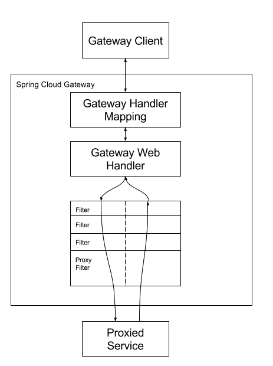
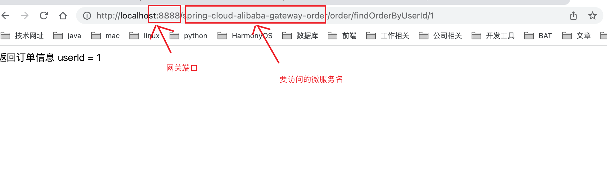
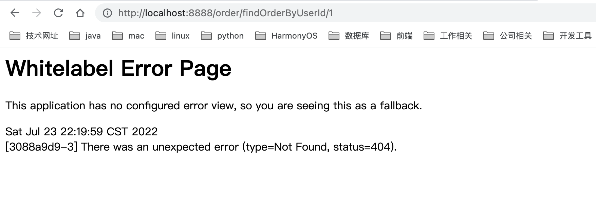
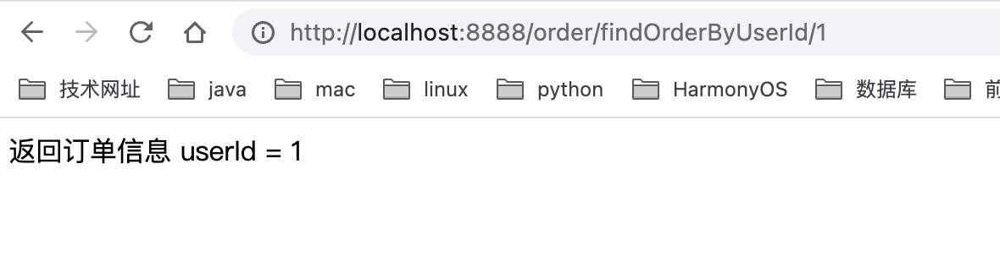
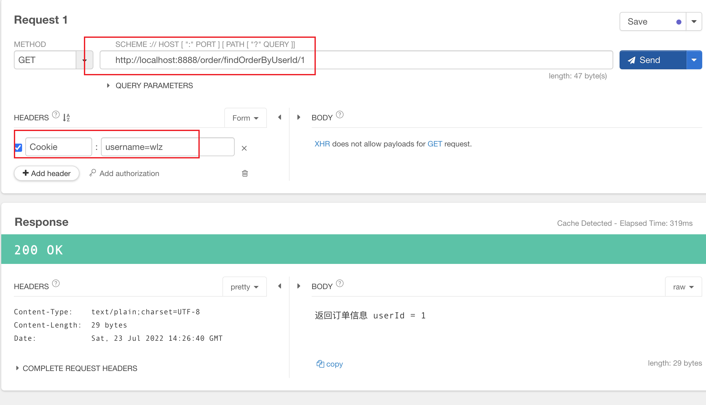
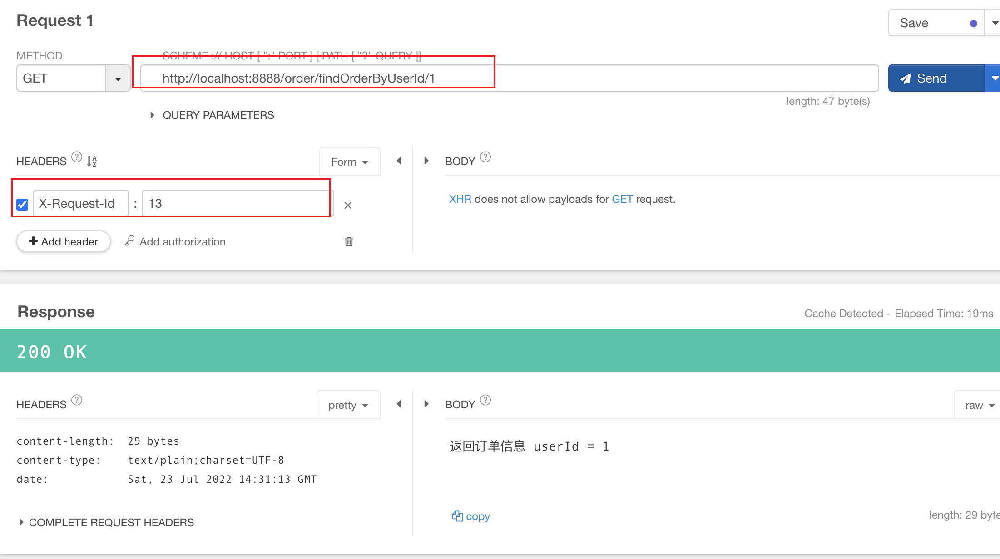
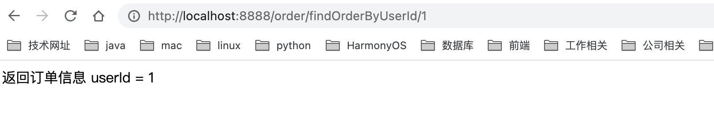
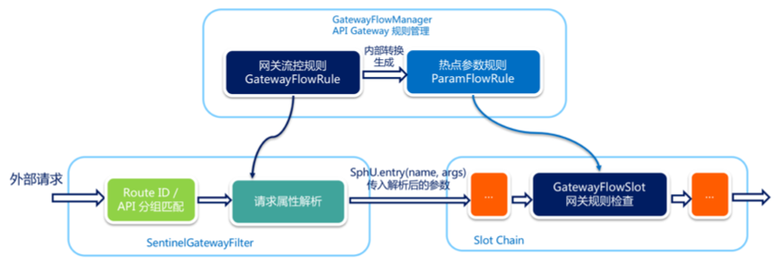
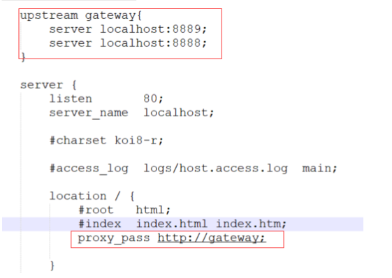

### 1. 什么是Spring Cloud Gateway

   网关作为流量的入口，常用的功能包括路由转发，权限校验，限流等。

   Spring Cloud Gateway 是Spring Cloud官方推出的第二代网关框架，定位于取代 Netflix Zuul。相比 Zuul 来说， Spring Cloud Gateway 提供更优秀的性能，更强大的有功能。

   Spring Cloud Gateway 是由 WebFlux + Netty + Reactor 实现的响应式的 API 网关。*它不能在传统的 servlet 容器中 工作，也不能构建成 war 包*。

   Spring Cloud Gateway 旨在为微服务架构提供一种简单且有效的 API 路由的管理方式，并基于 Filter 的方式提供网关的 基本功能，例如说安全认证、监控、限流等等。

   官网文档:https://docs.spring.io/spring-cloud-gateway/docs/current/reference/html/#gateway-request- predicates-factories
   
#### 1.1 核心概念 

   1. 路由(route)

    路由是网关中最基础的部分，路由信息包括一个ID、一个目的URI、一组断言工厂、一组Filter组成。如果断言为真，则说 明请求的URL和配置的路由匹配。

   2. 断言(predicates)

    Java8中的断言函数，SpringCloud Gateway中的断言函数类型是Spring5.0框架中的ServerWebExchange。断言函数允许开发者去定义匹配Http request中的任何信息，比如请求头和参数等。

   3. 过滤器(Filter)

    SpringCloud Gateway中的filter分为Gateway FilIer和Global Filter。Filter可以对请求和响应进行处理。

#### 1.2 工作原理

   Spring Cloud Gateway 的工作原理跟 Zuul 的差不多，最大的区别就是 Gateway 的 Filter 只有 pre 和 post 两种。



   客户端向 Spring Cloud Gateway 发出请求，如果请求与网关程序定义的路由匹配，则该请求就会被发送到网关 Web 处理程序，此时处理程序运行特定的请求过滤器链。

   过滤器之间用虚线分开的原因是过滤器可能会在发送代理请求的前后执行逻辑。所有 pre 过滤器逻辑先执行，然后执 行代理请求;代理请求完成后，执行 post 过滤器逻辑。

### 2. Spring Cloud Gateway快速开始

#### 2.1 环境搭建 

##### 2.1.1 引入依赖

```xml
 <dependencies>
        <!-- gateway网关 -->
        <dependency>
            <groupId>org.springframework.cloud</groupId>
            <artifactId>spring-cloud-starter-gateway</artifactId>
        </dependency>

        <!-- nacos服务注册与发现 -->
        <dependency>
            <groupId>com.alibaba.cloud</groupId>
            <artifactId>spring-cloud-starter-alibaba-nacos-discovery</artifactId>
        </dependency>
    
    </dependencies>
```

   *注意:会和spring-webmvc的依赖冲突，需要排除spring-webmvc*

##### 2.1.2 编写yml配置文件

```yaml
server:
  port: 8888

spring:
  application:
    name: spring-cloud-alibaba-gateway-demo  #微服务名称

  #配置nacos注册中心地址
  cloud:
    nacos:
      discovery:
        server-addr: 127.0.0.1:8848

    gateway:
      discovery:
        locator:
          # 默认为false，设为true开启通过微服务创建路由的功能，即可以通过微服务名访问服务
          # http://localhost:8888/spring-cloud-alibaba-gateway-order/order/findOrderByUserId/1
          enabled: true
      # 是否开启网关
      enabled: true


```

##### 2.1.3 测试



#### 2.2 路由断言工厂(Route Predicate Factories)配置

   官方文档: https://docs.spring.io/spring-cloud-gateway/docs/current/reference/html/#gateway-request-predicates-factories

##### 2.2.1  时间匹配

   可以用在限时抢购的一些场景中。

###### 1. 配置 yml

```yaml
server:
  port: 8888

spring:
  application:
    name: spring-cloud-alibaba-gateway-demo  #微服务名称

  #配置nacos注册中心地址
  cloud:
    nacos:
      discovery:
        server-addr: 127.0.0.1:8848

    gateway:
      #设置路由：路由id、路由到微服务的uri、断言
      routes:
        - id: spring-cloud-alibaba-gateway-order  #路由ID，全局唯一，建议配合服务名
#          uri: http://localhost:8020  #目标微服务的请求地址和端口
          uri: lb://spring-cloud-alibaba-gateway-order  #lb 整合负载均衡器ribbon,loadbalancer
          predicates:
          # 测试 http://localhost:8888/order/findOrderByUserId/1
          # 匹配在指定的日期时间之后发生的请求  入参是ZonedDateTime类型
          - After=2022-07-23T21:56:18.601+08:00[Asia/Shanghai]
```

###### 2. 设置 时间之前发起请求



###### 3. 设置 时间之后 再次请求 



##### 2.2.3 Cookie 匹配 

###### 1. 配置 yml

```yaml
server:
  port: 8888

spring:
  application:
    name: spring-cloud-alibaba-gateway-demo  #微服务名称

  #配置nacos注册中心地址
  cloud:
    nacos:
      discovery:
        server-addr: 127.0.0.1:8848

    gateway:
      discovery:
        locator:
          # 默认为false，设为true开启通过微服务创建路由的功能，即可以通过微服务名访问服务
          # http://localhost:8888/spring-cloud-alibaba-gateway-order/order/findOrderByUserId/1
          enabled: false
      # 是否开启网关
      enabled: true

      #设置路由：路由id、路由到微服务的uri、断言
      routes:
        - id: spring-cloud-alibaba-gateway-order  #路由ID，全局唯一，建议配合服务名
#          uri: http://localhost:8020  #目标微服务的请求地址和端口
          uri: lb://spring-cloud-alibaba-gateway-order  #lb 整合负载均衡器ribbon,loadbalancer
          predicates:
          # 测试 http://localhost:8888/order/findOrderByUserId/1
          # 匹配在指定的日期时间之后发生的请求  入参是ZonedDateTime类型
#          - After=2022-07-23T21:56:18.601+08:00[Asia/Shanghai]
          # Cookie匹配
          - Cookie=username, wlz
```

###### 2. postman 测试 



##### 2.2.4 Header匹配

###### 1. 配置 yml

```yaml
server:
  port: 8888

spring:
  application:
    name: spring-cloud-alibaba-gateway-demo  #微服务名称

  #配置nacos注册中心地址
  cloud:
    nacos:
      discovery:
        server-addr: 127.0.0.1:8848

    gateway:
      discovery:
        locator:
          # 默认为false，设为true开启通过微服务创建路由的功能，即可以通过微服务名访问服务
          # http://localhost:8888/spring-cloud-alibaba-gateway-order/order/findOrderByUserId/1
          enabled: false
      # 是否开启网关
      enabled: true

      #设置路由：路由id、路由到微服务的uri、断言
      routes:
        - id: spring-cloud-alibaba-gateway-order  #路由ID，全局唯一，建议配合服务名
#          uri: http://localhost:8020  #目标微服务的请求地址和端口
          uri: lb://spring-cloud-alibaba-gateway-order  #lb 整合负载均衡器ribbon,loadbalancer
          predicates:
          # 测试 http://localhost:8888/order/findOrderByUserId/1
          # 匹配在指定的日期时间之后发生的请求  入参是ZonedDateTime类型
#          - After=2022-07-23T21:56:18.601+08:00[Asia/Shanghai]
          # Cookie匹配
#          - Cookie=username, wlz
          # Header匹配  请求中带有请求头名为 x-request-id，其值与 \d+ 正则表达式匹配
          - Header=X-Request-Id, \d+
```

###### 2. postman 测试



##### 2.2.5 路径匹配

###### 1. 配置 yml

```yaml
server:
  port: 8888

spring:
  application:
    name: spring-cloud-alibaba-gateway-demo  #微服务名称

  #配置nacos注册中心地址
  cloud:
    nacos:
      discovery:
        server-addr: 127.0.0.1:8848

    gateway:
      discovery:
        locator:
          # 默认为false，设为true开启通过微服务创建路由的功能，即可以通过微服务名访问服务
          # http://localhost:8888/spring-cloud-alibaba-gateway-order/order/findOrderByUserId/1
          enabled: false
      # 是否开启网关
      enabled: true

      #设置路由：路由id、路由到微服务的uri、断言
      routes:
        - id: spring-cloud-alibaba-gateway-order  #路由ID，全局唯一，建议配合服务名
#          uri: http://localhost:8020  #目标微服务的请求地址和端口
          uri: lb://spring-cloud-alibaba-gateway-order  #lb 整合负载均衡器ribbon,loadbalancer
          predicates:
          # 测试 http://localhost:8888/order/findOrderByUserId/1
          # 匹配在指定的日期时间之后发生的请求  入参是ZonedDateTime类型
#          - After=2022-07-23T21:56:18.601+08:00[Asia/Shanghai]
          # Cookie匹配
#          - Cookie=username, wlz
          # Header匹配  请求中带有请求头名为 x-request-id，其值与 \d+ 正则表达式匹配
#          - Header=X-Request-Id, \d+
          # 测试:http://localhost:8888/order/findOrderByUserId/1
          - Path=/order/**   #Path路径匹配
```

###### 2. 测试 




##### 2.2.6 自定义路由断言工厂

   自定义路由断言工厂需要继承 AbstractRoutePredicateFactory 类，重写 apply 方法的逻辑。在 apply 方法中可以 通过 exchange.getRequest() 拿到 ServerHttpRequest 对象，
   从而可以获取到请求的参数、请求方式、请求头等信息。
   
   *注意: 命名需要以 RoutePredicateFactory 结尾*

###### 1. 自定义 路由断言工厂 配置类 

```java
package com.wlz.predicate;

import lombok.extern.slf4j.Slf4j;
import org.springframework.cloud.gateway.handler.predicate.AbstractRoutePredicateFactory;
import org.springframework.cloud.gateway.handler.predicate.GatewayPredicate;
import org.springframework.stereotype.Component;
import org.springframework.web.server.ServerWebExchange;

import java.util.Collections;
import java.util.List;
import java.util.function.Predicate;

/**
 *  自定义RoutePredicateFactory
 * @author wlz
 * @date 2022-07-23  10:37 下午
 */
@Component
@Slf4j
public class CheckAuthRoutePredicateFactory extends AbstractRoutePredicateFactory<CheckAuthRoutePredicateFactory.Config> {


    public CheckAuthRoutePredicateFactory() {
        super(Config.class);
    }

    @Override
    public Predicate<ServerWebExchange> apply(Config config) {
        return new GatewayPredicate() {
            @Override
            public boolean test(ServerWebExchange serverWebExchange) {
                log.info("调用 CheckAuthRoutePredicateFactory {}", config.getName());
                if (config.getName().equals("wlz")) {
                    return true;
                }
                return false;
            }
        };
    }

    /**
     *  快捷配置
     * @return
     */
    @Override
    public List<String> shortcutFieldOrder() {
        return Collections.singletonList("name");
    }

    /**
     * 需要定义一个内部类，该类用于封装application.yml中的配置
     */
    public static class Config {

        private String name;

        public String getName() {
            return name;
        }

        public void setName(String name) {
            this.name = name;
        }
    }

}

```

###### 2. 配置 yml

```yaml
server:
  port: 8888

spring:
  application:
    name: spring-cloud-alibaba-gateway-demo  #微服务名称

  #配置nacos注册中心地址
  cloud:
    nacos:
      discovery:
        server-addr: 127.0.0.1:8848

    gateway:
      discovery:
        locator:
          # 默认为false，设为true开启通过微服务创建路由的功能，即可以通过微服务名访问服务
          # http://localhost:8888/spring-cloud-alibaba-gateway-order/order/findOrderByUserId/1
          enabled: false
      # 是否开启网关
      enabled: true

      #设置路由：路由id、路由到微服务的uri、断言
      routes:
        - id: spring-cloud-alibaba-gateway-order  #路由ID，全局唯一，建议配合服务名
#          uri: http://localhost:8020  #目标微服务的请求地址和端口
          uri: lb://spring-cloud-alibaba-gateway-order  #lb 整合负载均衡器ribbon,loadbalancer
          predicates:
          # 测试 http://localhost:8888/order/findOrderByUserId/1
          # 匹配在指定的日期时间之后发生的请求  入参是ZonedDateTime类型
#          - After=2022-07-23T21:56:18.601+08:00[Asia/Shanghai]
          # Cookie匹配
#          - Cookie=username, wlz
          # Header匹配  请求中带有请求头名为 x-request-id，其值与 \d+ 正则表达式匹配
#          - Header=X-Request-Id, \d+
          # 测试:http://localhost:8888/order/findOrderByUserId/1
#          - Path=/order/**,/test/**   #Path路径匹配
          #自定义CheckAuth断言工厂, 普通配置
#          - name: CheckAuth
#              args:
#                name: wlz
          # 自定义CheckAuth断言工厂 快捷配置， 需要 实现 shortcutFieldOrder 方法
          - CheckAuth=wlz # 如果设置的是wlz 能够正常请求;  如果这里设置的是 wlz111, 就会访问不到
```

#### 2.3 过滤器工厂( GatewayFilter Factories)配置

   SpringCloudGateway 内置了很多的过滤器工厂，我们通过一些过滤器工厂可以进行一些业务逻辑处理器，比如添加剔除响应头，添加去除参数等

   官方文档: https://docs.spring.io/spring-cloud-gateway/docs/current/reference/html/#gatewayfilter-factories

##### 2.3.1 添加请求头

###### 1. 配置 yml

```yaml
server:
  port: 8888

spring:
  application:
    name: spring-cloud-alibaba-gateway-demo  #微服务名称

  #配置nacos注册中心地址
  cloud:
    nacos:
      discovery:
        server-addr: 127.0.0.1:8848

    gateway:
      discovery:
        locator:
          # 默认为false，设为true开启通过微服务创建路由的功能，即可以通过微服务名访问服务
          # http://localhost:8888/spring-cloud-alibaba-gateway-order/order/findOrderByUserId/1
          enabled: false
      # 是否开启网关
      enabled: true

      #设置路由：路由id、路由到微服务的uri、断言
      routes:
        - id: spring-cloud-alibaba-gateway-order  #路由ID，全局唯一，建议配合服务名
          #          uri: http://localhost:8020  #目标微服务的请求地址和端口
          uri: lb://spring-cloud-alibaba-gateway-order  #lb 整合负载均衡器ribbon,loadbalancer
          predicates:
            # 测试:http://localhost:8888/order/findOrderByUserId/1
            - Path=/order/**   #Path路径匹配

          filters:
            - AddRequestHeader=X-Request-color, red  #添加请求头
              #          - AddRequestParameter=color, blue   # 添加请求参数
              #          - PrefixPath=/spring-cloud-alibaba-gateway-order  # 添加前缀 对应微服务需要配置context-path
            #- RedirectTo=302, http://baidu.com  #重定向到百度
  #          - CheckAuth=wlz,男  #配置自定义的过滤器工厂
```

###### 2. 添加接口 

```java
package com.wlz.controller;

import lombok.extern.slf4j.Slf4j;
import org.springframework.web.bind.annotation.*;

import javax.servlet.http.HttpServletRequest;

/**
 * @author wlz
 * @date 2022-07-23  11:07 下午
 */
@RestController
@RequestMapping("/test")
@Slf4j
public class TestGatewayController {

    /**
     * 测试gateway
     * @param request
     * @return
     * @throws Exception
     */
    @GetMapping("/testgateway")
    public String testGateway(HttpServletRequest request) throws Exception {
        log.info("gateWay获取请求头X-Request-color："
                +request.getHeader("X-Request-color"));
        return "success X-Request-color " + request.getHeader("X-Request-color");
    }
    @GetMapping("/testgateway2")
    public String testGateway(@RequestHeader("X-Request-color") String color) throws Exception {
        log.info("gateWay获取请求头X-Request-color："+color);
        return "success color = " + color;
    }
}

```

###### 3. 测试 

   http://localhost:8888/test/testgateway

   http://localhost:8888/test/testgateway2

##### 2.3.2 添加请求参数

###### 1. 配置 yml

```yaml
server:
  port: 8888

spring:
  application:
    name: spring-cloud-alibaba-gateway-demo  #微服务名称

  #配置nacos注册中心地址
  cloud:
    nacos:
      discovery:
        server-addr: 127.0.0.1:8848

    gateway:
      discovery:
        locator:
          # 默认为false，设为true开启通过微服务创建路由的功能，即可以通过微服务名访问服务
          # http://localhost:8888/spring-cloud-alibaba-gateway-order/order/findOrderByUserId/1
          enabled: false
      # 是否开启网关
      enabled: true

      #设置路由：路由id、路由到微服务的uri、断言
      routes:
        - id: spring-cloud-alibaba-gateway-order  #路由ID，全局唯一，建议配合服务名
#          uri: http://localhost:8020  #目标微服务的请求地址和端口
          uri: lb://spring-cloud-alibaba-gateway-order  #lb 整合负载均衡器ribbon,loadbalancer

        filters:
          - AddRequestParameter=color, blue   # 添加请求参数
```

###### 2. 添加接口 

```java
package com.wlz.controller;

import lombok.extern.slf4j.Slf4j;
import org.springframework.web.bind.annotation.*;

import javax.servlet.http.HttpServletRequest;

/**
 * @author wlz
 * @date 2022-07-23  11:07 下午
 */
@RestController
@RequestMapping("/test")
@Slf4j
public class TestGatewayController {
    
    @GetMapping("/testgateway3")
    public String testGateway3(@RequestParam("color") String color) throws Exception {
        log.info("gateWay获取请求参数color:"+color);
        return "success";
    }

}

```

###### 3. 测试 

http://localhost:8888/test/testgateway3

##### 2.3.3 为匹配的路由统一添加前缀

###### 1. 配置 yml 

```yaml
server:
  port: 8888

spring:
  application:
    name: spring-cloud-alibaba-gateway-demo  #微服务名称

  #配置nacos注册中心地址
  cloud:
    nacos:
      discovery:
        server-addr: 127.0.0.1:8848

    gateway:
      discovery:
        locator:
          # 默认为false，设为true开启通过微服务创建路由的功能，即可以通过微服务名访问服务
          # http://localhost:8888/spring-cloud-alibaba-gateway-order/order/findOrderByUserId/1
          enabled: false
      # 是否开启网关
      enabled: true

      #设置路由：路由id、路由到微服务的uri、断言
      routes:
        - id: spring-cloud-alibaba-gateway-order  #路由ID，全局唯一，建议配合服务名
#          uri: http://localhost:8020  #目标微服务的请求地址和端口
          uri: lb://spring-cloud-alibaba-gateway-order  #lb 整合负载均衡器ribbon,loadbalancer

        filters:
          - PrefixPath=/spring-cloud-alibaba-gateway-order  # 添加前缀 对应微服务需要配置context-path
```

###### 2. 中需要配置

```yaml
server:
  servlet:
    context-path: /spring-cloud-alibaba-gateway-order
```

###### 3. 测试

测试:http://localhost:8888/order/findOrderByUserId/1 ====》 http://localhost:8020/spring-cloud-alibaba-gateway-order/order/findOrderByUserId/1

##### 2.3.4 重定向操作

###### 1. 配置 yml 

```yaml
server:
  port: 8888

spring:
  application:
    name: spring-cloud-alibaba-gateway-demo  #微服务名称

  #配置nacos注册中心地址
  cloud:
    nacos:
      discovery:
        server-addr: 127.0.0.1:8848

    gateway:
      discovery:
        locator:
          # 默认为false，设为true开启通过微服务创建路由的功能，即可以通过微服务名访问服务
          # http://localhost:8888/spring-cloud-alibaba-gateway-order/order/findOrderByUserId/1
          enabled: false
      # 是否开启网关
      enabled: true

      #设置路由：路由id、路由到微服务的uri、断言
      routes:
        - id: spring-cloud-alibaba-gateway-order  #路由ID，全局唯一，建议配合服务名
#          uri: http://localhost:8020  #目标微服务的请求地址和端口
          uri: lb://spring-cloud-alibaba-gateway-order  #lb 整合负载均衡器ribbon,loadbalancer

        filters:
          - RedirectTo=302, http://baidu.com  #重定向到百度
```

###### 2. 测试 

   测试:http://localhost:8888/order/findOrderByUserId/1

##### 2.3.5 自定义过滤器工厂

   继承AbstractNameValueGatewayFilterFactory且我们的自定义名称必须要以GatewayFilterFactory结尾并交给spring管理。
   
###### 1. 创建 自定义过滤器工厂 配置类 

```java
@Component
@Slf4j
public class CheckAuthGatewayFilterFactory extends AbstractNameValueGatewayFilterFactory {
    @Override
    public GatewayFilter apply(NameValueConfig config) {
        return (exchange, chain) -> {
            log.info("调用CheckAuthGatewayFilterFactory==="
                    + config.getName() + ":" + config.getValue());
            // TODO
            return chain.filter(exchange);
        };
    }
}
```

###### 2. 配置 yml 

```yaml
server:
  port: 8888

spring:
  application:
    name: spring-cloud-alibaba-gateway-demo  #微服务名称

  #配置nacos注册中心地址
  cloud:
    nacos:
      discovery:
        server-addr: 106.52.11.147:8848

    gateway:
      discovery:
        locator:
          # 默认为false，设为true开启通过微服务创建路由的功能，即可以通过微服务名访问服务
          # http://localhost:8888/spring-cloud-alibaba-gateway-order/order/findOrderByUserId/1
          enabled: false
      # 是否开启网关
      enabled: true

      #设置路由：路由id、路由到微服务的uri、断言
      routes:
        - id: spring-cloud-alibaba-gateway-order  #路由ID，全局唯一，建议配合服务名
#          uri: http://localhost:8020  #目标微服务的请求地址和端口
          uri: lb://spring-cloud-alibaba-gateway-order  #lb 整合负载均衡器ribbon,loadbalancer

        filters:
          - CheckAuth=wlz,男  #配置自定义的过滤器工厂
```

###### 3. 测试 

   测试:http://localhost:8888/order/findOrderByUserId/1

#### 2.4 全局过滤器 Global Filters)配置

   GlobalFilter 接口和 GatewayFilter 有一样的接口定义，只不过， GlobalFilter 会作用于所有路由。 官方声明:GlobalFilter的接口定义以及用法在未来的版本可能会发生变化。

##### 2.4.1 LoadBalancerClientFilter

   LoadBalancerClientFilter 会查看exchange的属性 ServerWebExchangeUtils.GATEWAY_REQUEST_URL_ATTR 的 值(一个URI)，如果该值的scheme是 lb，比如:lb://myservice ，
   它将会使用Spring Cloud的LoadBalancerClient 来 将 myservice 解析成实际的host和port，并替换掉 ServerWebExchangeUtils.GATEWAY_REQUEST_URL_ATTR 的内 容。
   
   *其实就是用来整合负载均衡器Ribbon的*
   
###### 1. 配置 yml 

```yaml
server:
  port: 8888

spring:
  application:
    name: spring-cloud-alibaba-gateway-demo  #微服务名称

  #配置nacos注册中心地址
  cloud:
    nacos:
      discovery:
        server-addr: 127.0.0.1:8848

    gateway:
      discovery:
        locator:
          # 默认为false，设为true开启通过微服务创建路由的功能，即可以通过微服务名访问服务
          # http://localhost:8888/spring-cloud-alibaba-gateway-order/order/findOrderByUserId/1
          enabled: false
      # 是否开启网关
      enabled: true

      #设置路由：路由id、路由到微服务的uri、断言
      routes:
        - id: spring-cloud-alibaba-gateway-order  #路由ID，全局唯一，建议配合服务名
#          uri: http://localhost:8020  #目标微服务的请求地址和端口
          uri: lb://spring-cloud-alibaba-gateway-order  #lb 整合负载均衡器ribbon,loadbalancer
          predicates:
          # 测试:http://localhost:8888/order/findOrderByUserId/1
          - Path=/order/**   #Path路径匹配

```


##### 2.4.2 自定义全局过滤器

###### 1. 配置 自定义 全局过滤器 类 

```java
/** 
 *  自定义全局过滤器 
 * @author wlz
 * @date 2022-07-23  11:27 下午
 */
@Order(-1)
@Component
@Slf4j
public class CheckAuthFilter implements GlobalFilter {
    @Override
    public Mono<Void> filter(ServerWebExchange exchange, GatewayFilterChain chain) {
        //校验请求头中的token
        List<String> token = exchange.getRequest().getHeaders().get("token");
        log.info("token:"+ token);
        if (token.isEmpty()){
            return chain.filter(exchange);
        }
        // TODO token校验
        return chain.filter(exchange);
    }
}
```

```java
@Slf4j
@Component
public class CheckIPFilter implements GlobalFilter, Ordered {
    @Override
    public Mono<Void> filter(ServerWebExchange exchange, GatewayFilterChain chain) {
        HttpHeaders headers = exchange.getRequest().getHeaders();
        //模拟对 IP 的访问限制，即不在 IP 白名单中就不能调用的需求
        if (getIp(headers).equals("127.0.0.1")) {
            log.info("======非法访问======");
            ServerHttpResponse response = exchange.getResponse();
            byte[] bytes = new String("======非法访问======").getBytes();
            response.setStatusCode(HttpStatus.NOT_ACCEPTABLE);
            DataBuffer buffer = response.bufferFactory().wrap(bytes);
            response.getHeaders().add("Content-Type",
                    "application/json;charset=UTF-8");
            return exchange.getResponse().writeWith(Mono.just(buffer));
        }
        return chain.filter(exchange);
    }

    @Override
    public int getOrder() {
        return 0;
    }

    private String getIp(HttpHeaders headers) {
        return headers.getHost().getHostName();
    }
}
```


#### 2.5 Gateway跨域配置(CORS Configuration)

   官方文档: https://docs.spring.io/spring-cloud-gateway/docs/current/reference/html/#cors-configuration

##### 2.5.1 通过yml配置的方式

```yaml
server:
  port: 8888

spring:
  application:
    name: spring-cloud-alibaba-gateway-demo  #微服务名称

  #配置nacos注册中心地址
  cloud:
    nacos:
      discovery:
        server-addr: 106.52.11.147:8848

    gateway:
      discovery:
        locator:
          # 默认为false，设为true开启通过微服务创建路由的功能，即可以通过微服务名访问服务
          # http://localhost:8888/spring-cloud-alibaba-gateway-order/order/findOrderByUserId/1
          enabled: false
      # 是否开启网关
      enabled: true

      # Gateway跨域配置
      globalcors:
        cors-configurations:
          '[/**]':
            allowedOrigins: "*"
            allowedMethods:
              - GET
              - POST
              - DELETE
              - PUT
              - OPTION

      #设置路由：路由id、路由到微服务的uri、断言
      routes:
        - id: spring-cloud-alibaba-gateway-order  #路由ID，全局唯一，建议配合服务名
#          uri: http://localhost:8020  #目标微服务的请求地址和端口
          uri: lb://spring-cloud-alibaba-gateway-order  #lb 整合负载均衡器ribbon,loadbalancer
```


##### 2.5.2 通过java配置的方式

```java
package com.wlz.config;

import org.springframework.context.annotation.Bean;
import org.springframework.context.annotation.Configuration;
import org.springframework.web.cors.CorsConfiguration;
import org.springframework.web.cors.reactive.CorsWebFilter;
import org.springframework.web.cors.reactive.UrlBasedCorsConfigurationSource;
import org.springframework.web.util.pattern.PathPatternParser;

/**
 * @author wlz
 * @date 2022-07-23  11:33 下午
 */
@Configuration
public class CorsConfig {

    @Bean
    public CorsWebFilter corsWebFilter() {
        CorsConfiguration config = new CorsConfiguration();
        config.addAllowedMethod("*");
        config.addAllowedOrigin("*");
        config.addAllowedHeader("*");

        UrlBasedCorsConfigurationSource source = new UrlBasedCorsConfigurationSource(new PathPatternParser());
        source.registerCorsConfiguration("/**", config);

        return new CorsWebFilter(source);
    }

}

```

### 3. gateway整合sentinel限流

   从 1.6.0 版本开始，Sentinel 提供了 Spring Cloud Gateway 的适配模块，可以提供两种资源维度的限流:

    1. route 维度:即在 Spring 配置文件中配置的路由条目，资源名为对应的 routeId 

    2. 自定义 API 维度:用户可以利用 Sentinel 提供的 API 来自定义一些 API 分组

   官方文档: https://github.com/alibaba/Sentinel/wiki/%E7%BD%91%E5%85%B3%E9%99%90%E6%B5%81

#### 3.1 快速开始

##### 3.1.1 引入依赖

```xml
 <dependencies>

        <!-- gateway网关 -->
        <dependency>
            <groupId>org.springframework.cloud</groupId>
            <artifactId>spring-cloud-starter-gateway</artifactId>
        </dependency>

        <!-- gateway接入sentinel  -->
        <dependency>
            <groupId>com.alibaba.cloud</groupId>
            <artifactId>spring-cloud-alibaba-sentinel-gateway</artifactId>
        </dependency>

        <dependency>
            <groupId>com.alibaba.cloud</groupId>
            <artifactId>spring-cloud-starter-alibaba-sentinel</artifactId>
        </dependency>


        <!-- nacos服务注册与发现 -->
        <dependency>
            <groupId>com.alibaba.cloud</groupId>
            <artifactId>spring-cloud-starter-alibaba-nacos-discovery</artifactId>
        </dependency>


    </dependencies>
```

##### 3.1.2 接入sentinel dashboard，添加yml配置

```yaml
server:
  port: 8888

spring:
  application:
    name: spring-cloud-alibaba-gateway-sentinel-demo  #微服务名称

  #配置nacos注册中心地址
  cloud:
    nacos:
      discovery:
        server-addr: 127.0.0.1:8848

    # 接入 sentinel dashboard 
    sentinel:
      transport:
        # 添加sentinel的控制台地址
        dashboard: 127.0.0.1:8080

    gateway:
      discovery:
        locator:
          # 默认为false，设为true开启通过微服务创建路由的功能，即可以通过微服务名访问服务
          # http://localhost:8888/spring-cloud-alibaba-gateway-order/order/findOrderByUserId/1
          enabled: false
      # 是否开启网关
      enabled: true

      #设置路由：路由id、路由到微服务的uri、断言
      routes:
        - id: spring-cloud-alibaba-gateway-order  #路由ID，全局唯一，建议配合服务名
#          uri: http://localhost:8020  #目标微服务的请求地址和端口
          uri: lb://spring-cloud-alibaba-gateway-order  #lb 整合负载均衡器ribbon,loadbalancer
          predicates:
          - Path=/order/**,/test/**   #Path路径匹配
```


##### 3.1.3 使用时只需注入对应的 SentinelGatewayFilter 实例以及 SentinelGatewayBlockExceptionHandler 实例 即可

```java
package com.wlz.config;

import com.alibaba.csp.sentinel.adapter.gateway.sc.SentinelGatewayFilter;
import com.alibaba.csp.sentinel.adapter.gateway.sc.exception.SentinelGatewayBlockExceptionHandler;
import org.springframework.beans.factory.ObjectProvider;
import org.springframework.cloud.gateway.filter.GlobalFilter;
import org.springframework.context.annotation.Bean;
import org.springframework.context.annotation.Configuration;
import org.springframework.core.Ordered;
import org.springframework.core.annotation.Order;
import org.springframework.http.codec.ServerCodecConfigurer;
import org.springframework.web.reactive.result.view.ViewResolver;

import javax.annotation.PostConstruct;
import java.util.Collections;
import java.util.List;

/**
 * @author wlz
 * @date 2022-07-24  12:16 上午
 */
@Configuration
public class GatewayConfiguration {
    
    private final List<ViewResolver> viewResolvers;
    private final ServerCodecConfigurer serverCodecConfigurer;


    public GatewayConfiguration(ObjectProvider<List<ViewResolver>> viewResolversProvider,
                                ServerCodecConfigurer serverCodecConfigurer) {
        this.viewResolvers = viewResolversProvider.getIfAvailable(Collections::emptyList);
        this.serverCodecConfigurer = serverCodecConfigurer;
    }

    /**
     * 限流异常处理器
     * @return
     */
    @Bean
    @Order(Ordered.HIGHEST_PRECEDENCE)
    public SentinelGatewayBlockExceptionHandler sentinelGatewayBlockExceptionHandler() {
        // Register the block exception handler for Spring Cloud Gateway.
        return new SentinelGatewayBlockExceptionHandler(viewResolvers, serverCodecConfigurer);
    }

    /**
     * 限流过滤器 (项目启动时提示 该bean 已存在，故暂时注释掉)
     * @return
     */
   //    @Bean
//    @Order(Ordered.HIGHEST_PRECEDENCE)
//    public GlobalFilter sentinelGatewayFilter() {
//        return new SentinelGatewayFilter();
//    }
}

```

##### 3.1.4 用户可以 通过 GatewayRuleManager.loadRules(rules) 手动加载网关规则

```java
package com.wlz.config;

import com.alibaba.csp.sentinel.adapter.gateway.common.SentinelGatewayConstants;
import com.alibaba.csp.sentinel.adapter.gateway.common.api.ApiDefinition;
import com.alibaba.csp.sentinel.adapter.gateway.common.api.ApiPathPredicateItem;
import com.alibaba.csp.sentinel.adapter.gateway.common.api.ApiPredicateItem;
import com.alibaba.csp.sentinel.adapter.gateway.common.api.GatewayApiDefinitionManager;
import com.alibaba.csp.sentinel.adapter.gateway.common.rule.GatewayFlowRule;
import com.alibaba.csp.sentinel.adapter.gateway.common.rule.GatewayRuleManager;
import com.alibaba.csp.sentinel.adapter.gateway.sc.SentinelGatewayFilter;
import com.alibaba.csp.sentinel.adapter.gateway.sc.callback.BlockRequestHandler;
import com.alibaba.csp.sentinel.adapter.gateway.sc.callback.GatewayCallbackManager;
import com.alibaba.csp.sentinel.adapter.gateway.sc.exception.SentinelGatewayBlockExceptionHandler;
import org.springframework.beans.factory.ObjectProvider;
import org.springframework.cloud.gateway.filter.GlobalFilter;
import org.springframework.context.annotation.Bean;
import org.springframework.context.annotation.Configuration;
import org.springframework.core.Ordered;
import org.springframework.core.annotation.Order;
import org.springframework.http.HttpStatus;
import org.springframework.http.MediaType;
import org.springframework.http.codec.ServerCodecConfigurer;
import org.springframework.web.reactive.function.BodyInserters;
import org.springframework.web.reactive.function.server.ServerResponse;
import org.springframework.web.reactive.result.view.ViewResolver;
import org.springframework.web.server.ServerWebExchange;
import reactor.core.publisher.Mono;

import javax.annotation.PostConstruct;
import java.util.*;

/**
 * @author wlz
 * @date 2022-07-24  12:16 上午
 */
@Configuration
public class GatewayConfiguration {
    
    
    
    @PostConstruct
    public void doInit() {
//        //初始化自定义的API
        initCustomizedApis();
//        //初始化网关限流规则
        initGatewayRules();
//        //自定义限流异常处理器
        initBlockRequestHandler();
    }

    private void initCustomizedApis() {
        Set<ApiDefinition> definitions = new HashSet<>();
        // 资源保护名user_service_api    Path:/user/**
        ApiDefinition api = new ApiDefinition("user_service_api")
                .setPredicateItems(new HashSet<ApiPredicateItem>() {{
                    add(new ApiPathPredicateItem().setPattern("/order/**")
                            .setMatchStrategy(SentinelGatewayConstants.URL_MATCH_STRATEGY_PREFIX));
                }});
        definitions.add(api);
        GatewayApiDefinitionManager.loadApiDefinitions(definitions);
    }

    private void initGatewayRules() {
        Set<GatewayFlowRule> rules = new HashSet<>();
        //resource：资源名称，可以是网关中的 route 名称或者用户自定义的 API 分组名称。
        //count：限流阈值
        //intervalSec：统计时间窗口，单位是秒，默认是 1 秒。
        rules.add(new GatewayFlowRule("order_route")
                .setCount(1)
                .setIntervalSec(1)
        );
        rules.add(new GatewayFlowRule("user_service_api")
                .setCount(2)
                .setIntervalSec(1)
        );

        // 加载网关规则
        GatewayRuleManager.loadRules(rules);
    }

    private void initBlockRequestHandler() {
        BlockRequestHandler blockRequestHandler = new BlockRequestHandler() {
            @Override
            public Mono<ServerResponse> handleRequest(ServerWebExchange exchange, Throwable t) {
                HashMap<String, String> result = new HashMap<>();
                result.put("code",String.valueOf(HttpStatus.TOO_MANY_REQUESTS.value()));
                result.put("msg", HttpStatus.TOO_MANY_REQUESTS.getReasonPhrase());

                return ServerResponse.status(HttpStatus.TOO_MANY_REQUESTS)
                        .contentType(MediaType.APPLICATION_JSON)
                        .body(BodyInserters.fromValue(result));
            }
        };
        //设置自定义异常处理器
        GatewayCallbackManager.setBlockHandler(blockRequestHandler);
    }

}

```

#### 3.2 网关流控控制台

   Sentinel 1.6.3 引入了网关流控控制台的支持，用户可以直接在 Sentinel 控制台上查看 API Gateway 实时的 route 和自定义 API 分组监控，管理网关规则和 API 分组配置。

   在 API Gateway 端，用户只需要在原有启动参数的基础上添加如下启动参数即可标记应用为 API Gateway 类型:
   
```shell
# 注:通过 Spring Cloud Alibaba Sentinel 自动接入的 API Gateway 整合则无需此参数 
 -Dcsp.sentinel.app.type=1
```

#### 3.3 网关流控实现原理



### 4. 网关高可用

为了保证 Gateway 的高可用性，可以同时启动多个 Gateway 实例进行负载，在 Gateway 的上游使用 Nginx 或者 F5 进 行负载转发以达到高可用。



### 5. Gateway 源码 


