### 1. nacos 配置中心使用 

   官方文档: https://github.com/alibaba/spring-cloud-alibaba/wiki/Nacos-config

   Nacos 提供用于存储配置和其他元数据的 key/value 存储，为分布式系统中的外部化配置提供服务器端和客户端支持。使 用 Spring Cloud Alibaba Nacos Config，
   您可以在 Nacos Server 集中管理你 Spring Cloud 应用的外部属性配置。

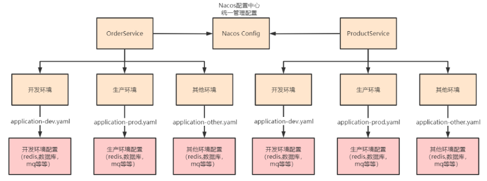

#### 1.1 快速开始 

准备配置，nacos server中新建nacos-config.properties

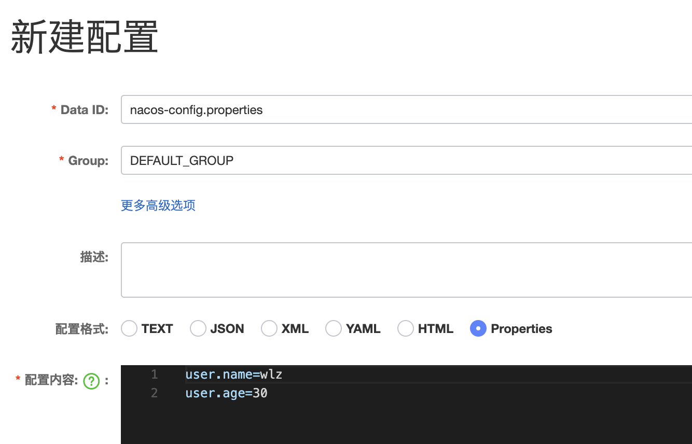

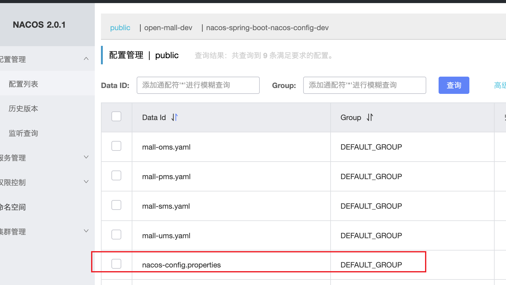

#### 1.2 搭建 nacos-config 服务 

   通过 Nacos Server 和 spring-cloud-starter-alibaba-nacos-config 实现配置的动态变更
   
##### 1.2.1 引入依赖

```xml
 <dependencies>
        <!--nacos配置中心-->
        <dependency>
            <groupId>com.alibaba.cloud</groupId>
            <artifactId>spring-cloud-starter-alibaba-nacos-config</artifactId>
        </dependency>


        <dependency>
            <groupId>org.springframework.boot</groupId>
            <artifactId>spring-boot-starter-web</artifactId>
        </dependency>

        <!-- nacos服务注册与发现 -->
        <dependency>
            <groupId>com.alibaba.cloud</groupId>
            <artifactId>spring-cloud-starter-alibaba-nacos-discovery</artifactId>
        </dependency>

    </dependencies>
```

##### 1.2.2 添加 bootstrap.properties 或 bootstrap.yml

```yaml
spring.application.name=nacos-config

# 配置中心地址
spring.cloud.nacos.config.server-addr=106.52.11.147:8848

# dataId 为 yaml 的文件扩展名配置方式
# `${spring.application.name}.${file-extension:properties}`
spring.cloud.nacos.config.file-extension=yaml

# profile 粒度的配置 `${spring.application.name}-${profile}.${file‐extension:properties}`
spring.profiles.active=prod
```

##### 1.2.3 启动服务 

   测试微服务是否使用配置中心的配置

```java
@Slf4j
@SpringBootApplication
public class NacosConfigConfigServiceApplication {

    public static void main(String[] args) {
        ConfigurableApplicationContext context = SpringApplication.run(NacosConfigConfigServiceApplication.class, args);

        while (true) {
            String userName = context.getEnvironment().getProperty("common.name");
            String userAge = context.getEnvironment().getProperty("common.age");
            log.info(" user name : {}  ; age = {}", userName, userAge);


            try {
                TimeUnit.SECONDS.sleep(3);
            } catch (InterruptedException e) {
                e.printStackTrace();
            }

        }
    }
}
```

#### 1.3 Config相关配置

   Nacos 数据模型 Key 由三元组唯一确定, Namespace默认是空串，公共命名空间(public)，分组默认是 DEFAULT_GROUP

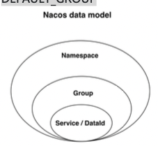

##### 1.3.1 支持配置的动态更新

```java
@Slf4j
@SpringBootApplication
public class NacosConfigConfigServiceApplication {

    public static void main(String[] args) {
        ConfigurableApplicationContext context = SpringApplication.run(NacosConfigConfigServiceApplication.class, args);

        while (true) {
           //当动态配置刷新时，会更新到 Enviroment中，因此这里每隔一秒中从Enviroment中获取配置
            String userName = context.getEnvironment().getProperty("common.name");
            String userAge = context.getEnvironment().getProperty("common.age");
            log.info(" user name : {}  ; age = {}", userName, userAge);
            
            try {
                TimeUnit.SECONDS.sleep(1);
            } catch (InterruptedException e) {
                e.printStackTrace();
            }

        }
    }
}
```

##### 1.3.2 支持profile粒度的配置

   spring-cloud-starter-alibaba-nacos-config 在加载配置的时候，不仅仅加载了以 dataid 为 ${spring.application.name}.${file-extension:properties} 为前缀的基础配置，
   还加载了dataid为 ${spring.application.name}-${profile}.${file-extension:properties} 的基础配置。
   在日常开发中如果遇到多套环境下的不 同配置，可以通过Spring 提供的 ${spring.profiles.active} 这个配置项来配置。
   
```yaml
spring.profiles.active=dev
```

##### 1.3.3 支持自定义 namespace 的配置

   用于进行租户粒度的配置隔离。不同的命名空间下，可以存在相同的 Group 或 Data ID 的配置。Namespace 的常用场景 之一是不同环境的配置的区分隔离，例如开发测试环境和生产环境的资源(如配置、服务)隔离等。 
   
   在没有明确指定 ${spring.cloud.nacos.config.namespace} 配置的情况下， 默认使用的是 Nacos 上 Public 这个 namespace。如果需要使用自定义的命名空间，
   
   可以通过以下配置来实现:

```yaml
# 自定义 namespace 的配置
spring.cloud.nacos.config.namespace=3733c469-a42a-488b-abd9-9faa9bdaa0bf
```

##### 1.3.4 支持自定义 Group 的配置

   Group是组织配置的维度之一。通过一个有意义的字符串(如 Buy 或 Trade )对配置集进行分组，从而区分 Data ID 相同的配置集。当您在 Nacos 上创建一个配置时，如果未填写配置分组的名称，
   则配置分组的名称默认采用 DEFAULT_GROUP 。配置分组的常见场景:不同的应用或组件使用了相同的配置类型，如 database_url 配置和 MQ_topic 配置。

   在没有明确指定 ${spring.cloud.nacos.config.group} 配置的情况下，默认是DEFAULT_GROUP 。如果需要自定义自己的 Group，可以通过以下配置来实现:

```yaml
# 自定义 group 的配置 
spring.cloud.nacos.config.group=DEVELOP_GROUP
```

##### 1.3.5 支持自定义扩展的 Data Id 配置

   Data ID 是组织划分配置的维度之一。Data ID 通常用于组织划分系统的配置集。一个系统或者应用可以包含多个配置 集，每个配置集都可以被一个有意义的名称标识。
   Data ID 通常采用类 Java 包(如 com.taobao.tc.refund.log.level)的命 名规则保证全局唯一性。此命名规则非强制。

   通过自定义扩展的 Data Id 配置，既可以解决多个应用间配置共享的问题，又可以支持一个应用有多个配置文件。

```yaml
#自定义DataId的配置
#不同工程的通用配置 支持共享的 DataId 
spring.cloud.nacos.config.sharedConfigs[0].data‐id=common.yaml 
spring.cloud.nacos.config.sharedConfigs[0].group=REFRESH_GROUP 
spring.cloud.nacos.config.sharedConfigs[0].refresh=true

#configexternalconfiguration
# 支持一个应用多个 DataId 的配置 
spring.cloud.nacos.config.extensionConfigs[0].data‐id=ext‐config‐common01.properties
spring.cloud.nacos.config.extensionConfigs[0].group=REFRESH_GROUP 
spring.cloud.nacos.config.extensionConfigs[0].refresh=true

spring.cloud.nacos.config.extensionConfigs[1].data‐id=ext‐config‐common02.properties 
spring.cloud.nacos.config.extensionConfigs[1].group=REFRESH_GROUP 
spring.cloud.nacos.config.extensionConfigs[1].refresh=true
```

#### 1.4 配置的优先级

   Spring Cloud Alibaba Nacos Config 目前提供了三种配置能力从 Nacos 拉取相关的配置。

      1. 通过 spring.cloud.nacos.config.shared-configs 支持多个共享 Data Id 的配置

      2. 通过 spring.cloud.nacos.config.ext-config[n].data-id 的方式支持多个扩展 Data Id 的配置 

      3. 通过内部相关规则(应用名、应用名+ Profile )自动生成相关的 Data Id 配置

   当三种方式共同使用时，他们的一个优先级关系是:1 < 2 < 3

   优先级从高到低:

      1. nacos-config-prod.yaml 精准配置
     
      2. nacos-config.yaml 同工程不同环境的通用配置

      3. ext-config: 不同工程 扩展配置

      4 shared-dataids 不同工程通用配置: common2.yml > common1.yml

#### 1.5 @RefreshScope

   @Value注解可以获取到配置中心的值，但是无法动态感知修改后的值，需要利用@RefreshScope注解
   
```java
@RestController
@RefreshScope
public class TestController {

    @Value("${common.name}")
    private String name;

    @Value("${common.age}")
    private String age;

    @GetMapping("/refresh")
    public String common() {
        return name + ", " + age;
    }


}
```

### 2. 配置中心源码分析

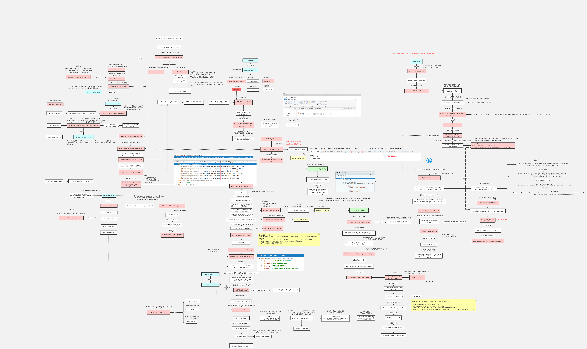

#### 2.1 配置中心的架构

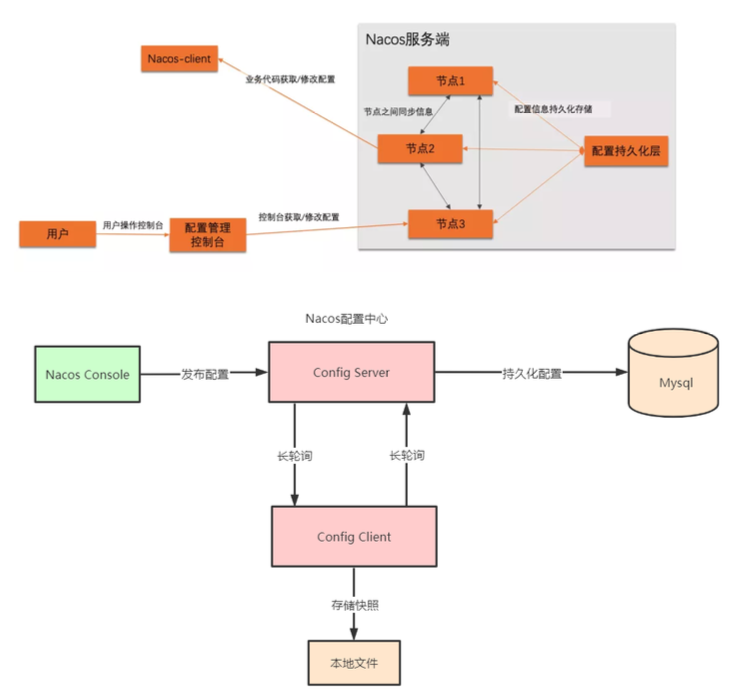

##### 2.1.1 配置中心使用demo

```java
@Slf4j
public class ConfigServerDemo {

    public static void main(String[] args) throws Exception{

        String serverAddr = "127.0.0.1:8848";
        String dataId = "nacos-config-demo.yaml";
        String group = "DEFAULT_GROUP";

        Properties properties = new Properties();
        properties.put(PropertyKeyConst.SERVER_ADDR, serverAddr);

        // 获取配置中心服务
        ConfigService configService = NacosFactory.createConfigService(properties);

        // 拉取配置
        String content = configService.getConfig(dataId, group, 5000);
        log.info(" content: {} ", content);

        // 注册监听器 
        configService.addListener(dataId, group, new Listener() {
            @Override
            public Executor getExecutor() {
                return null;
            }

            @Override
            public void receiveConfigInfo(String configInfo) {
                log.info(" 感知配置中心变化: {} ", configInfo);
            }
        });

        // 发布配置
        configService.publishConfig(dataId, group, "common.age=40", ConfigType.PROPERTIES.getType());

        Thread.sleep(3000);

        // 从配置中心拉取配置
        content = configService.getConfig(dataId, group, 5000);
        log.info(" content 22 : {} ", content);


      /*  boolean b = configService.removeConfig(dataId, group);
        log.info("is remove ok： {} ", b);
        Thread.sleep(3000);*/

      /*  content = configService.getConfig(dataId, group, 5000);
        log.info(" content 33 : {} ", content);
        Thread.sleep(3000);*/


        Thread.sleep(Integer.MAX_VALUE);


    }
}
```


#### 2.2 nacos config 客户端(client) 源码分析

   配置中心核心接口 ConfigService 

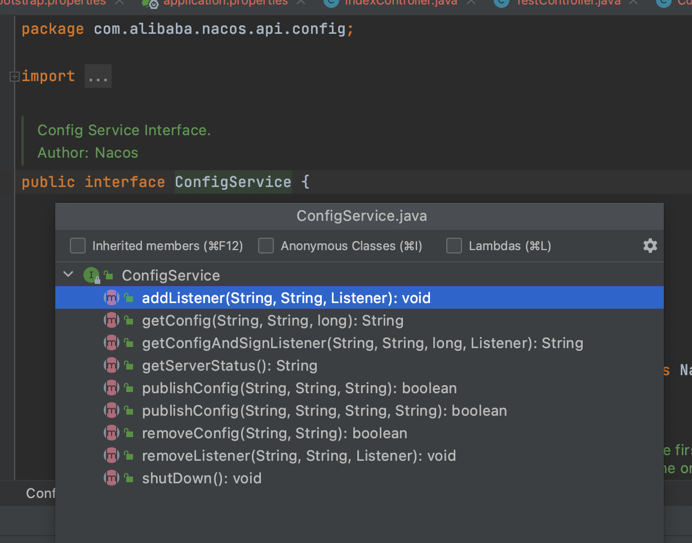

##### 2.1.1  获取配置

   获取配置的主要方法是 NacosConfigService 类的 getConfig 方法，通常情况下该方法直接从本地文件中取得配置的值，如果本地文件不存在或者内容为空，则再通过 HTTP GET 方法从远端拉取配置，
   并保存到本地快照中。当通过 HTTP 获取远端配置时，Nacos 提供了两种熔断策略，一是超时时间，二是最大重试次数，默认重试三次。

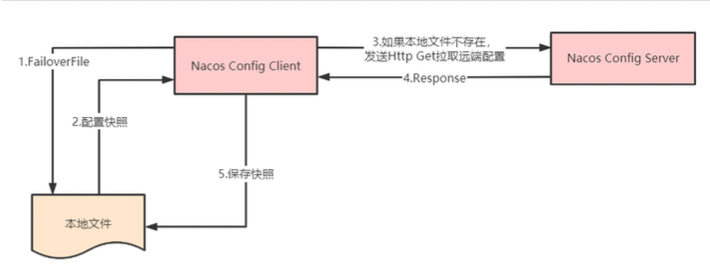

```java
public class NacosConfigService implements ConfigService {
   private String getConfigInner(String tenant, String dataId, String group, long timeoutMs) throws NacosException {
      group = null2defaultGroup(group);
      ParamUtils.checkKeyParam(dataId, group);
      ConfigResponse cr = new ConfigResponse();

      cr.setDataId(dataId);
      cr.setTenant(tenant);
      cr.setGroup(group);

      // 优先使用本地配置
      // 1. 获取本地文件
      String content = LocalConfigInfoProcessor.getFailover(agent.getName(), dataId, group, tenant);
      if (content != null) {
         LOGGER.warn("[{}] [get-config] get failover ok, dataId={}, group={}, tenant={}, config={}", agent.getName(),
                 dataId, group, tenant, ContentUtils.truncateContent(content));
         cr.setContent(content);
         configFilterChainManager.doFilter(null, cr);
         // 2. 配置快照 
         content = cr.getContent();
         return content;
      }

      try {
         // 3.本地文件不存在，发送http Get 拉取远端配置， 4. 返回
         // 5. 拉取完后 保存快照
         String[] ct = worker.getServerConfig(dataId, group, tenant, timeoutMs);
         cr.setContent(ct[0]);

         configFilterChainManager.doFilter(null, cr);
         content = cr.getContent();

         return content;
      } catch (NacosException ioe) {
         if (NacosException.NO_RIGHT == ioe.getErrCode()) {
            throw ioe;
         }
         LOGGER.warn("[{}] [get-config] get from server error, dataId={}, group={}, tenant={}, msg={}",
                 agent.getName(), dataId, group, tenant, ioe.toString());
      }

      LOGGER.warn("[{}] [get-config] get snapshot ok, dataId={}, group={}, tenant={}, config={}", agent.getName(),
              dataId, group, tenant, ContentUtils.truncateContent(content));
      content = LocalConfigInfoProcessor.getSnapshot(agent.getName(), dataId, group, tenant);
      cr.setContent(content);
      configFilterChainManager.doFilter(null, cr);
      content = cr.getContent();
      return content;
   }
}
```

##### 2.1.2 注册监听器

   配置中心客户端会通过对配置项注册监听器达到在配置项变更的时候执行回调的功能。

```
NacosConfigService#getConfigAndSignListener
ConfigService#addListener
```

   Nacos 可以通过以上方式注册监听器，它们内部的实现均是调用 ClientWorker 类的 addCacheDataIfAbsent。其中 CacheData 是一个维护配置项和其下注册的所有监听器的实例，
   所有的 CacheData 都保存在 ClientWorker 类中的 原子 cacheMap 中，其内部的核心成员有:

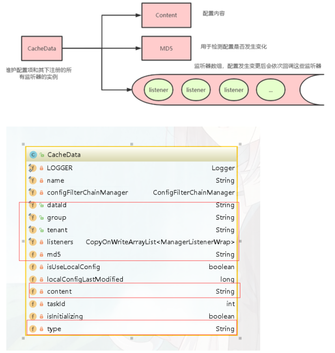

##### 2.1.3 配置长轮询

   ClientWorker 通过其下的两个线程池完成配置长轮询的工作，一个是单线程的 executor，每隔 10ms 按照每 3000 个 配置项为一批次捞取待轮询的 cacheData 实例，
   将其包装成为一个 LongPollingTask 提交进入第二个线程

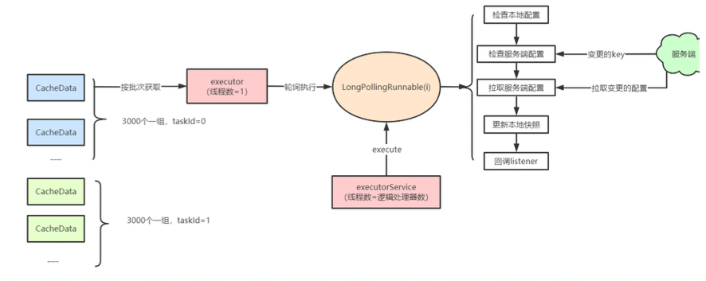
   
#### 2.2 nacos config 服务端(server) 源码分析

##### 2.2.1 配置dump

```
com.alibaba.nacos.config.server.service.dump.DumpService
```

   服务端启动时就会依赖 DumpService 的 init 方法，从数据库中 load 配置存储在本地磁盘上，并将一些重要的元信 息例如 MD5 值缓存在内存中。服务端会根据心跳文件中保存的最后一次心跳时间，
   来判断到底是从数据库 dump 全量 配置数据还是部分增量配置数据(如果机器上次心跳间隔是 6h 以内的话)。

   全量 dump 当然先清空磁盘缓存，然后根据主键 ID 每次捞取一千条配置刷进磁盘和内存。增量 dump 就是捞取最 近六小时的新增配置(包括更新的和删除的)，先按照这批数据刷新一遍内存和文件，
   再根据内存里所有的数据全量去 比对一遍数据库，如果有改变的再同步一次，相比于全量 dump 的话会减少一定的数据库 IO 和磁盘 IO 次数。
   
##### 2.2.2 配置发布

   发布配置的代码位于 ConfigController#publishConfig中。集群部署，请求一开始也只会打到一台机器，这台机器 将配置插入Mysql中进行持久化。服务端并不是针对每次配置查询都去访问 MySQL ，
   而是会依赖 dump 功能在本地文 件中将配置缓存起来。因此当单台机器保存完毕配置之后，需要通知其他机器刷新内存和本地磁盘中的文件内容，因此 它会发布一个名为 ConfigDataChangeEvent 的事件，
   这个事件会通过 HTTP 调用通知所有集群节点(包括自身)，触 发本地文件和内存的刷新。

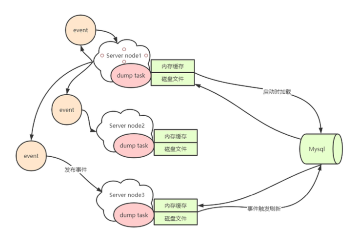

##### 2.2.3 处理长轮询

   客户端会有一个长轮询任务，拉取服务端的配置变更，服务端处理逻辑在LongPollingService类中，其中有一个 Runnable 任务名为ClientLongPolling，
   服务端会将收到的轮询请求包装成一个 ClientLongPolling 任务，该任务持 有一个 AsyncContext 响应对象，通过定时线程池延后 29.5s 执行。
   比客户端 30s 的超时时间提前 500ms 返回是为了 最大程度上保证客户端不会因为网络延时造成超时。

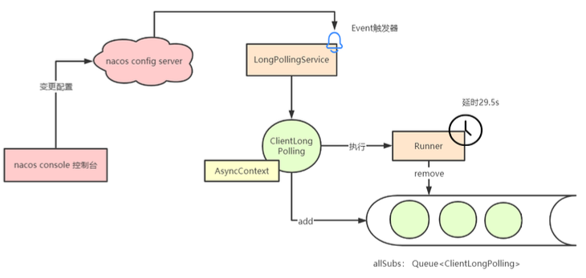