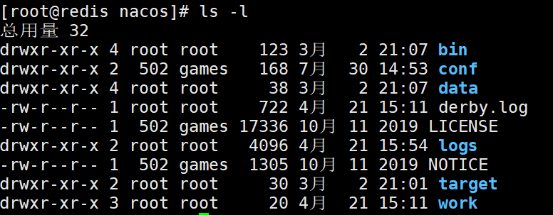
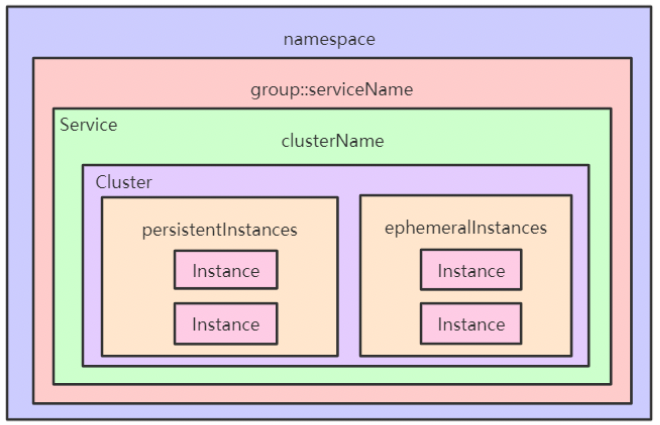
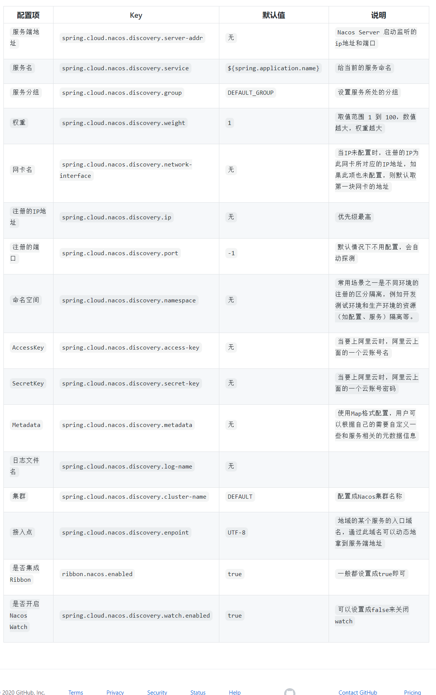

### 1. 什么是 Nacos

官方文档： https://nacos.io/zh-cn/docs/what-is-nacos.html

Nacos 致力于帮助您发现、配置和管理微服务。Nacos 提供了一组简单易用的特性集，帮助您快速实现动态服务发现、服务配置、服务元数据及流量管理。

Nacos 的关键特性包括:

- 服务发现和服务健康监测
- 动态配置服务
- 动态 DNS 服务
- 服务及其元数据管理

#### 1.1 Nacos 架构


  NamingService: 命名服务，注册中心核心接口 
  
  ConfigService:配置服务，配置中心核心接口 
  
  OpenAPI文档:https://nacos.io/zh-cn/docs/open-api.html 
  
  nacos版本: v1.1.4 升级到v1.4.1

官方文档：https://nacos.io/zh-cn/docs/architecture.html

#### 1.2 Nacos Server 部署

##### 1.2.1 下载

###### 1. 下载源码编译

源码下载地址：https://github.com/alibaba/nacos/  

```shell
cd nacos/
mvn -Prelease-nacos clean install -U
cd nacos/distribution/target/
```

###### 2. 下载安装包

下载地址：https://github.com/alibaba/Nacos/releases


##### 1.2.2 单机模式

官方文档： https://nacos.io/zh-cn/docs/deployment.html

解压，进入nacos目录



单机启动nacos，执行命令

```shell
bin/startup.sh -m standalone
```

访问nocas的管理端：http://192.168.3.14:8848/nacos ，默认的用户名密码是 nocas/nocas


##### 1.2.3 集群模式

官网文档： https://nacos.io/zh-cn/docs/cluster-mode-quick-start.html

1）单机搭建伪集群，复制nacos安装包，修改为nacos8849，nacos8850，nacos8851


2）以nacos8849为例，进入nacos8849目录

2.1）修改conf\application.properties的配置，使用外置数据源

```properties
#使用外置mysql数据源 
spring.datasource.platform=mysql 

db.num=1 
db.url.0=jdbc:mysql://192.168.3.14:3306/nacos_test?characterEncoding=utf8
&connectTimeout=1000&socketTimeout=3000&autoReconnect=true
db.user=root 
db.password=root
```


2.2）将conf\cluster.conf.example改为==cluster.conf==,添加节点配置

```makefile
# ip:port 
192.168.3.14:8849 
192.168.3.14:8850 
192.168.3.14:8851
```

nacos8850，nacos8851 按同样的方式配置。

3）创建mysql数据库,sql文件位置：conf\nacos-mysql.sql

4)  修改启动脚本（bin\startup.sh）的jvm参数


5)  分别启动nacos8849，nacos8850，nacos8851

以nacos8849为例，进入nacos8849目录，启动nacos

```shell
bin/startup.sh
```


6) 测试

登录 http://192.168.3.14:8849/nacos  ，用户名和密码都是nacos


7）官方推荐，nginx反向代理


访问： [http://192.168.3.14:8847/nacos](http://192.168.3.14:8849/nacos) 


#### 1.3 prometheus + grafana 监控 Nacos

  https://nacos.io/zh-cn/docs/monitor-guide.html

  Nacos 0.8.0版本完善了监控系统，支持通过暴露metrics数据接入第三方监控系统监控Nacos运行状态。

##### 1.3.1 nacos暴露metrics数据

```
management.endpoints.web.exposure.include=*
```

   测试: http://localhost:8848/nacos/actuator/prometheus

##### 1.3.2. prometheus采集Nacos metrics数据

   启动prometheus服务

```
prometheus.exe‐‐config.file=prometheus.yml
```

  测试:http://localhost:9090/graph

##### 1.3.3. grafana展示metrics数据

  测试: http://localhost:3000/

### 2. Nacos注册中心

官方文档： https://github.com/alibaba/spring-cloud-alibaba/wiki/Nacos-discovery

#### 2.1 微服务之间如何调用

**RestTemplate实现服务间调用**

Spring框架提供的RestTemplate类可用于在应用中调用rest服务，它简化了与http服务的通信方式，统一了RESTful的标准，封装了http链接， 我们只需要传入url及返回值类型即可。相较于HttpClient，RestTemplate是一种更优雅的调用RESTful服务的方式。在SpringBoot中可以通过RestTemplate 调用方式来进行服务调用，比如user服务（服务消费者）调用order服务（服务提供者）。

```
String url = "http://localhost:8010/order/findOrderByUserId/"+id;
ResponseEntity<List> responseEntity = restTemplate.getForEntity(url,
List.class);
List<Order> orderList = responseEntity.getBody();
```

#### 2.2 注册中心演变及其设计思想 


#### 2.3 注册中心架构


#### 2.4 核心功能

**服务注册**：Nacos Client会通过发送REST请求的方式向Nacos Server注册自己的服务，提供自身的元数据，比如ip地址、端口等信息。Nacos Server接收到注册请求后，就会把这些元数据信息存储在一个双层的内存Map中。

**服务心跳**：在服务注册后，Nacos Client会维护一个定时心跳来持续通知Nacos Server，说明服务一直处于可用状态，防止被剔除。默认5s发送一次心跳。

**服务同步**：Nacos Server集群之间会互相同步服务实例，用来保证服务信息的一致性。

**服务发现**：服务消费者（Nacos Client）在调用服务提供者的服务时，会发送一个REST请求给Nacos Server，获取上面注册的服务清单，并且缓存在Nacos Client本地，同时会在Nacos Client本地开启一个定时任务定时拉取服务端最新的注册表信息更新到本地缓存

**服务健康检查**：Nacos Server会开启一个定时任务用来检查注册服务实例的健康情况，对于超过15s没有收到客户端心跳的实例会将它的healthy属性置为false(客户端服务发现时不会发现)，如果某个实例超过30秒没有收到心跳，直接剔除该实例(被剔除的实例如果恢复发送心跳则会重新注册)

#### 2.5 服务注册表结构 



#### 2.6 服务领域模型 


### 3. Spring Cloud Alibaba Nacos 快速开始

#### 3.1 Spring Cloud Alibaba版本选型

#### 3.2 搭建Nacos-client服务

##### 3.2.1 引入依赖

###### 1. 父Pom中支持spring cloud&spring cloud alibaba, 引入依赖

```xml
<dependencyManagement>
    <dependencies>
        <!--引入springcloud的版本-->
        <dependency>
            <groupId>org.springframework.cloud</groupId>
            <artifactId>spring-cloud-dependencies</artifactId>
            <version>Greenwich.SR3</version>
            <type>pom</type>
            <scope>import</scope>
        </dependency>

        <dependency>
            <groupId>com.alibaba.cloud</groupId>
            <artifactId>spring-cloud-alibaba-dependencies</artifactId>
            <version>2.1.1.RELEASE</version>
            <type>pom</type>
            <scope>import</scope>
        </dependency>
    </dependencies>

</dependencyManagement>
```

###### 2. 当前项目pom中引入依赖

```xml
<dependency>
    <groupId>com.alibaba.cloud</groupId>
    <artifactId>spring-cloud-starter-alibaba-nacos-discovery</artifactId>
</dependency>
```

##### 2. application.properties中配置

```properties
server.port=8002
#微服务名称
spring.application.name=service-user
#配置 Nacos server 的地址
spring.cloud.nacos.discovery.server-addr=localhost:8848
```

更多配置：https://github.com/alibaba/spring-cloud-alibaba/wiki/Nacos-discovery



##### 3. 启动springboot应用，nacos管理端界面查看是否成功注册


##### 4. 测试

使用RestTemplate进行服务调用，可以使用微服务名称 （spring.application.name）

```
log.info("根据userId:"+id+"查询订单信息");
 // 添加@LoadBalanced调用, 如果不添加 会找不到
String url = "http://spring-cloud-alibaba-nacos-order/order/findOrderByUserId/"+id;
String result = restTemplate.getForObject(url,String.class);
return result;
```

注意：==需要添加@LoadBalanced注解==

```
@Bean
@LoadBalanced
public RestTemplate restTemplate() {
    return new RestTemplate();
}
```

或者：

```
 @Bean
public RestTemplate restTemplate() {
        RestTemplate restTemplate = new RestTemplate();
        restTemplate.setInterceptors(Collections.singletonList(new LoadBalancerInterceptor(loadBalancerClient)));
        return restTemplate;
}
```

### 4. Nacos源码编译运行

#### 4.1 源码下载

  下载地址：https://github.com/alibaba/nacos/

  版本： Nacos 1.4.1


#### 4.2 进入nacos目录，执行编译命令

```shell
mvn -Prelease-nacos -Dmaven.test.skip=true -Drat.skip=true clean install -U
```

编译成功后会在distribution/target目录下生成  nacos-server-1.4.1.tar.gz 


##### 4.2.1 m1 编译报错 

https://www.its203.com/article/qq_42651904/120923278

  直接修改maven的settings.xml  
  
  增加一个profile标签和一个activeProfile标签

```
<profile>
  <id>apple-silicon</id>
  <properties>
    <os.detected.classifier>osx-x86_64</os.detected.classifier>
  </properties>
</profile>

<activeProfiles>
  <activeProfile>apple-silicon</activeProfile>
</activeProfiles>
```

#### 4.3 启动nacos

##### 4.3.1 进入console模块，找到启动类 com.alibaba.nacos.Nacos，执行main方法


##### 4.3.2 配置启动参数

单机模式执行需要指定nacos.standalone=true

```
-Dnacos.standalone=true -Dnacos.home=/Library/java_workspace/nacos/nacos
```

- 创建nacos_config数据库（distribution/conf/nacos-mysql.sql）
- 在application.properties中添加mysql配置

```
# 支持mysql
spring.datasource.platform=mysql
db.num=1
db.url.0=jdbc:mysql://127.0.0.1:3306/nacos_config?characterEncoding=utf8\
  &connectTimeout=1000&socketTimeout=3000&autoReconnect=true
db.user=root
db.password=root
```

#### 4.4 查看 

  进入 [http://localhost:8848/nacos](http://localhost:8848/nacos/#/login)，用户名和密码默认nacos


### 服务注册表结构


#### 数据模型

Nacos 数据模型 Key 由三元组唯一确定, Namespace默认是空串，公共命名空间（public），分组默认是 DEFAULT_GROUP。


#### 服务领域模型


官网地址：https://nacos.io/zh-cn/docs/architecture.html

#### 服务实例数据

```json
[{
	"clusterName": "DEFAULT",
	"enabled": true,
	"ephemeral": true,
	"healthy": true,
	"instanceHeartBeatInterval": 5000,
	"instanceHeartBeatTimeOut": 15000,
	"instanceId": "127.0.0.1#8880#DEFAULT#DEFAULT_GROUP@@orderService",
	"instanceIdGenerator": "simple",
	"ip": "127.0.0.1",
	"ipDeleteTimeout": 30000,
	"metadata": {},
	"port": 8880,
	"serviceName": "DEFAULT_GROUP@@orderService",
	"weight": 1.0
}, {
	"clusterName": "DEFAULT",
	"enabled": true,
	"ephemeral": true,
	"healthy": true,
	"instanceHeartBeatInterval": 5000,
	"instanceHeartBeatTimeOut": 15000,
	"instanceId": "127.0.0.1#8888#DEFAULT#DEFAULT_GROUP@@orderService",
	"instanceIdGenerator": "simple",
	"ip": "127.0.0.1",
	"ipDeleteTimeout": 30000,
	"metadata": {},
	"port": 8888,
	"serviceName": "DEFAULT_GROUP@@orderService",
	"weight": 1.0
}]
```

## Nacos配置中心

官方文档： https://github.com/alibaba/spring-cloud-alibaba/wiki/Nacos-config

Nacos 提供用于存储配置和其他元数据的 key/value 存储，为分布式系统中的外部化配置提供服务器端和客户端支持。使用 Spring Cloud Alibaba Nacos Config，您可以在 Nacos Server 集中管理你 Spring Cloud 应用的外部属性配置。


### 快速开始

准备配置，nacos server中新建nacos-config.properties


搭建nacos-config服务

1）引入依赖

```xml
<dependency>
    <groupId>com.alibaba.cloud</groupId>
    <artifactId>spring-cloud-starter-alibaba-nacos-config</artifactId>
</dependency>
```

2）添加bootstrap.properties

```properties
spring.application.name=nacos-config
spring.cloud.nacos.config.server-addr=127.0.0.1:8848

#基于 dataid 为 yaml 的文件扩展名配置方式
spring.cloud.nacos.config.file-extension=yaml
```

3) 测试

```java
@SpringBootApplication
public class NacosConfigApplication {

    public static void main(String[] args) {
        ConfigurableApplicationContext applicationContext = SpringApplication.run(NacosConfigApplication.class, args);
        String userName = applicationContext.getEnvironment().getProperty("user.name");
        String userAge = applicationContext.getEnvironment().getProperty("user.age");
        System.out.println("user name :"+userName+"; age: "+userAge);
    }
}
```


### config相关配置

- **支持配置的动态更新**

- **支持profile粒度的配置**

  spring-cloud-starter-alibaba-nacos-config 在加载配置的时候，不仅仅加载了以 dataid 为 `${spring.application.name}.${file-extension:properties}` 为前缀的基础配置，还加载了dataid为 `${spring.application.name}-${profile}.${file-extension:properties}` 的基础配置。在日常开发中如果遇到多套环境下的不同配置，可以通过Spring 提供的 `${spring.profiles.active}` 这个配置项来配置。

  ```properties
  spring.profiles.active=develop
  ```

- **支持自定义 namespace 的配置**

  用于进行租户粒度的配置隔离。不同的命名空间下，可以存在相同的 Group 或 Data ID 的配置。Namespace 的常用场景之一是不同环境的配置的区分隔离，例如开发测试环境和生产环境的资源（如配置、服务）隔离等。

  在没有明确指定 `${spring.cloud.nacos.config.namespace}` 配置的情况下， 默认使用的是 Nacos 上 Public 这个namespace。如果需要使用自定义的命名空间，可以通过以下配置来实现：

  ```properties
  spring.cloud.nacos.config.namespace=71bb9785-231f-4eca-b4dc-6be446e12ff8
  ```

- **支持自定义 Group 的配置**

  Group是组织配置的维度之一。通过一个有意义的字符串（如 Buy 或 Trade ）对配置集进行分组，从而区分 Data ID 相同的配置集。当您在 Nacos 上创建一个配置时，如果未填写配置分组的名称，则配置分组的名称默认采用 DEFAULT_GROUP 。配置分组的常见场景：不同的应用或组件使用了相同的配置类型，如 database_url 配置和 MQ_topic 配置。

  在没有明确指定 `${spring.cloud.nacos.config.group}` 配置的情况下，默认是DEFAULT_GROUP 。如果需要自定义自己的 Group，可以通过以下配置来实现：

  ```properties
  spring.cloud.nacos.config.group=DEVELOP_GROUP
  ```

- **支持自定义扩展的 Data Id 配置**

  Data ID  是组织划分配置的维度之一。Data ID 通常用于组织划分系统的配置集。一个系统或者应用可以包含多个配置集，每个配置集都可以被一个有意义的名称标识。Data ID 通常采用类 Java 包（如 com.taobao.tc.refund.log.level）的命名规则保证全局唯一性。此命名规则非强制。

  ```properties
  # 自定义 Data Id 的配置
  #不同工程的通用配置
  spring.cloud.nacos.config.shared-dataids= common.yaml,common2.yaml
  spring.cloud.nacos.config.refreshable-dataids= common.yaml,common2.yaml
  
  # config external configuration
  # 1、Data Id 在默认的组 DEFAULT_GROUP,不支持配置的动态刷新
  spring.cloud.nacos.config.ext-config[0].data-id=ext-config-common01.properties
          
  # 2、Data Id 不在默认的组，不支持动态刷新
  spring.cloud.nacos.config.ext-config[1].data-id=ext-config-common02.properties
  spring.cloud.nacos.config.ext-config[1].group=GLOBALE_GROUP
  
  
  # 3、Data Id 既不在默认的组，也支持动态刷新
  spring.cloud.nacos.config.ext-config[2].data-id=ext-config-common03.properties
  spring.cloud.nacos.config.ext-config[2].group=REFRESH_GROUP
  spring.cloud.nacos.config.ext-config[2].refresh=true
  ```

  

### 配置的优先级

Spring Cloud Alibaba Nacos Config 目前提供了三种配置能力从 Nacos 拉取相关的配置。

- A: 通过 `spring.cloud.nacos.config.shared-configs` 支持多个共享 Data Id 的配置
- B: 通过 `spring.cloud.nacos.config.ext-config[n].data-id` 的方式支持多个扩展 Data Id 的配置
- C: 通过内部相关规则(应用名、应用名+ Profile )自动生成相关的 Data Id 配置

当三种方式共同使用时，他们的一个优先级关系是:A < B < C

优先级从高到低：

1) nacos-config-product.yaml 精准配置
2) nacos-config.yaml 同工程不同环境的通用配置
3) ext-config: 不同工程 扩展配置
4) shared-dataids 不同工程通用配置:  common2.yml > common1.yml  

### 配置方案

https://github.com/alibaba/spring-cloud-alibaba/issues/141


### @RefreshScope

@Value注解可以获取到配置中心的值，但是无法动态感知修改后的值，需要利用@RefreshScope注解

```java
@RestController
@RefreshScope
public class TestController {

    @Value("${common.age}")
    private String age;

    @GetMapping("/common")
    public String hello() {
        return age;
    }

}
```

#### 实现原理

利用Spring时间监听机制为每一个dataId注册事件监听器，当dataId中配置发生修改是，会执行Listener#receiveConfigInfo方法，加载最新配置，提前变更的配置参数，清除refreshscope缓存幷销毁Bean。当更新配置后第一次调用接口获取配置时，会通过objectFactory.getObject()生成新的bean

```markdown
ClassPathBeanDefinitionScanner#doScan
# 将beanClass属性设置为ScopedProxyFactoryBean
》ScopedProxyUtils.createScopedProxy(definitionHolder, registry, proxyTargetClass)
》registerBeanDefinition(definitionHolder, this.registry)
# bean工厂的后置处理器中进行处理
GenericScope#postProcessBeanDefinitionRegistry
》 root.setBeanClass(LockedScopedProxyFactoryBean.class)
GenericScope#postProcessBeanFactory
# 注册RefreshScope到scopes中
》 beanFactory.registerScope(this.name, this)

ServletWebServerApplicationContext#finishRefresh
# Spring事件监听机制
》RefreshScope#onApplicationEvent
# 动态感知的核心逻辑
》NacosContextRefresher#onApplicationEvent
# 为每一个dataId注册事件监听器
registerNacosListener(nacosPropertySource.getGroup(), dataId)

# 当dataId中配置发生修改时，被监听器监听到
Listener#receiveConfigInfo
》applicationContext.publishEvent(new RefreshEvent(this, null, "Refresh Nacos config"))
》RefreshEventListener#onApplicationEvent
# 更新配置的核心逻辑
》ContextRefresher#refresh
# 加载最新的配置，提取变更的配置参数
》ContextRefresher#refreshEnvironment
# 清除refreshscope缓存幷销毁Bean
》this.scope.refreshAll()

# 当更新配置后第一次调用（ curl localhost:8080/common） 获取配置时
AbstractBeanFactory#doGetBean
# scope="refresh"  通过objectFactory.getObject()生成新的bean
GenericScope.BeanLifecycleWrapper#getBean
》this.bean = this.objectFactory.getObject()
```


## Nacos源码分析

### 注册中心源码分析

https://www.processon.com/view/link/5ea27ca15653bb6efc68eb8c