### 1. nacos 注册中心源码

#### 1.1 Nacos&Ribbon&Feign核心微服务架构图

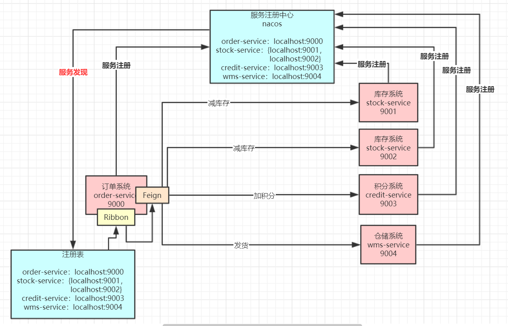

##### 1.1.1 架构原理 

   1、微服务系统在启动时将自己注册到服务注册中心，同时外发布 Http 接口供其它系统调用(一般都是基于Spring MVC)

   2、服务消费者基于 Feign 调用服务提供者对外发布的接口，先对调用的本地接口加上注解@FeignClient，Feign会针对加了该注解的接口生成动态代理，服务消费者针对 Feign 生成的动态代理去调用方法时，
   会在底层生成Http协议格式的请求，类似 /stock/deduct?productId=100

   3、Feign 最终会调用Ribbon从本地的Nacos注册表的缓存里根据服务名取出服务提供在机器的列表，然后进行负载均衡并选择一台机器出来，对选出来的机器IP和端口拼接之前生成的url请求，
   生成调用的Http接口地址 http://192.168.0.60:9000/stock/deduct?productId=100，最后基于HTTPClient调用请求

#### 1.2 nacos 架构图

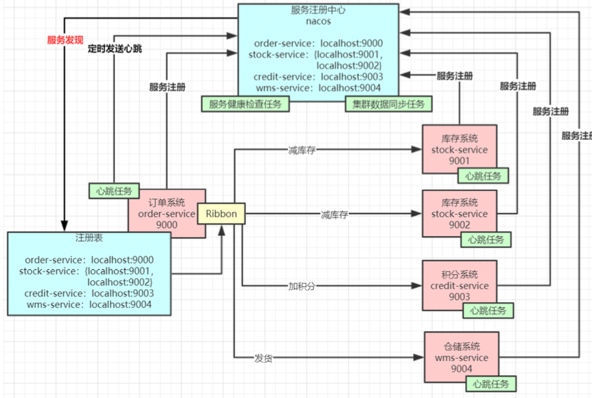

##### 1.2.1 nacos 核心功能点

**服务注册**：Nacos Client会通过发送REST请求的方式向Nacos Server注册自己的服务，提供自身的元数据，比如ip地址、端口等信息。Nacos Server接收到注册请求后，就会把这些元数据信息存储在一个双层的内存Map中。

**服务心跳**：在服务注册后，Nacos Client会维护一个定时心跳来持续通知Nacos Server，说明服务一直处于可用状态，防止被剔除。默认5s发送一次心跳。

**服务同步**：Nacos Server集群之间会互相同步服务实例，用来保证服务信息的一致性。

**服务发现**：服务消费者（Nacos Client）在调用服务提供者的服务时，会发送一个REST请求给Nacos Server，获取上面注册的服务清单，并且缓存在Nacos Client本地，同时会在Nacos Client本地开启一个定时任务定时拉取服务端最新的注册表信息更新到本地缓存

**服务健康检查**：Nacos Server会开启一个定时任务用来检查注册服务实例的健康情况，对于超过15s没有收到客户端心跳的实例会将它的healthy属性置为false(客户端服务发现时不会发现)，如果某个实例超过30秒没有收到心跳，直接剔除该实例(被剔除的实例如果恢复发送心跳则会重新注册)


#### 1.3 nacos 核心功能源码架构图

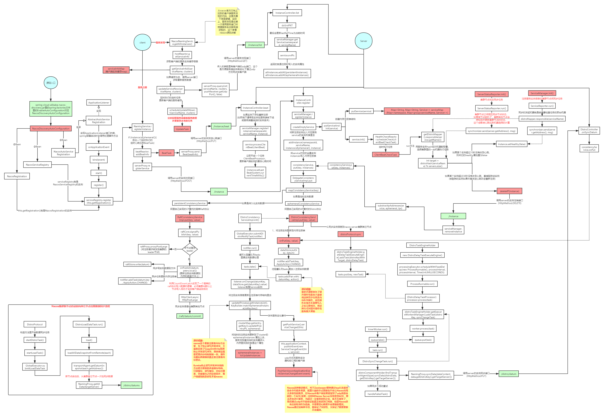

#### 1.4 nacos 服务注册表结构 


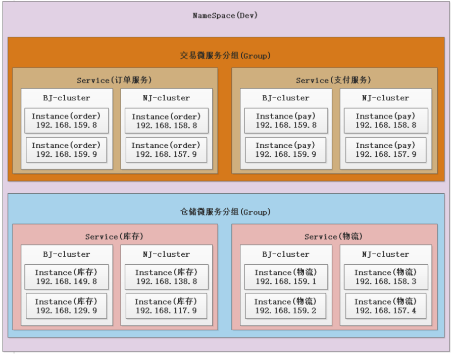

### 2. 源码集群运行 

#### 2.1 配置数据库 

   nacos集群需要配置mysql存储，需要先创建一个数据，名字随便取，然后执行 distribution/conf 目录下的 nacos-mysql.sql 脚本，然后修改 console\src\main\resources 
   目录下的 application.properties 文件里的mysql配置，如下所示
   
```yaml
### If use MySQL as datasource:
spring.datasource.platform=mysql

### Count of DB:
db.num=1

### Connect URL of DB:
db.url.0=jdbc:mysql://127.0.0.1:3306/nacos?characterEncoding=utf8&connectTimeout=1000&socketTimeout=3000&autoReconnect=true&useUnicode=true&useSSL=false&serverTimezone=UTC
db.user.0=root
db.password.0=root
```

#### 2.2 配置 文件 及 运行参数 

   运行console模块里的 com.alibaba.nacos.Nacos.java，需要增加启动vm参数端口号和实例运行路径nacos.home(对应的目录需要自己提前创建好)，
   每台server的nacos.home目录里需要创建一个conf文件夹，里面放一个cluster.conf文件，文件里需要把所有集群机器ip和端口写入进去，见下图：

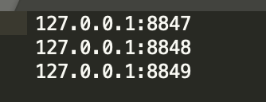

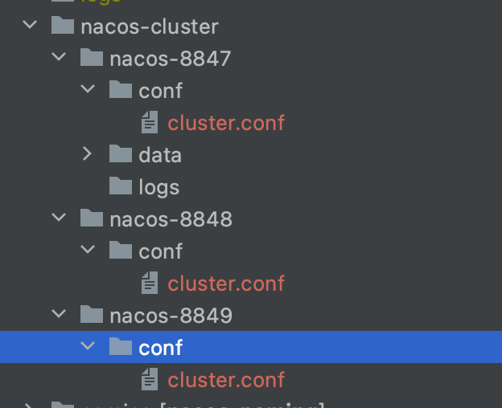

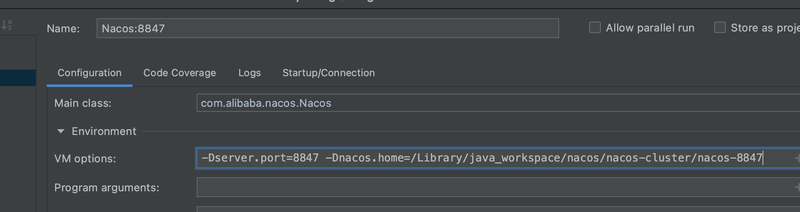

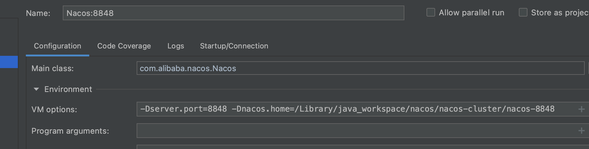

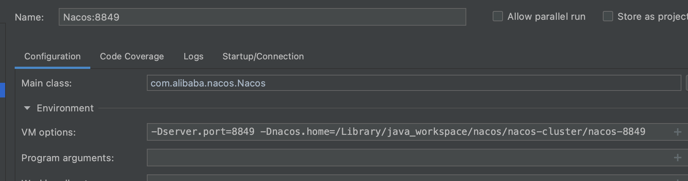

#### 2.3 启动

### 3. CAP 

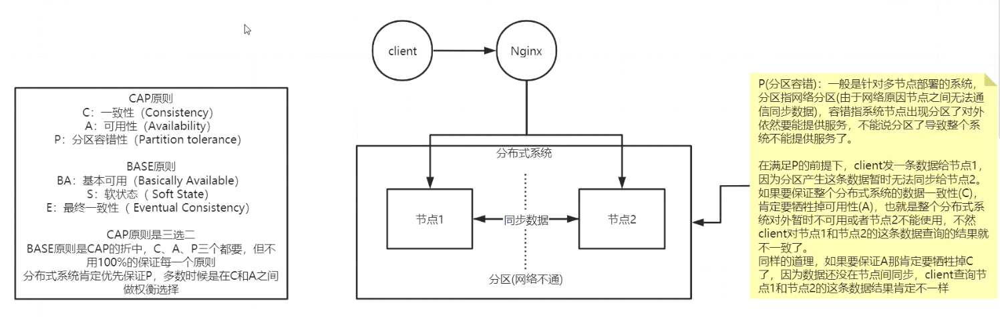

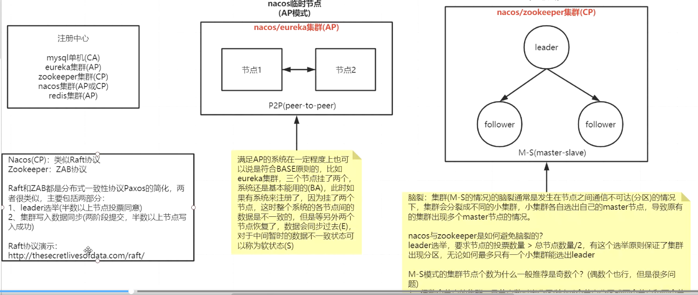

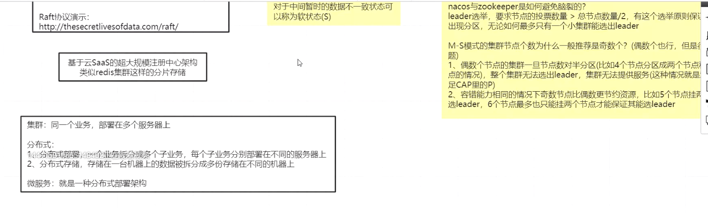

### 4. Nacos源码剖析-集群数据一致性(持久化实例CP模式Raft协议实现)

.jpg)

