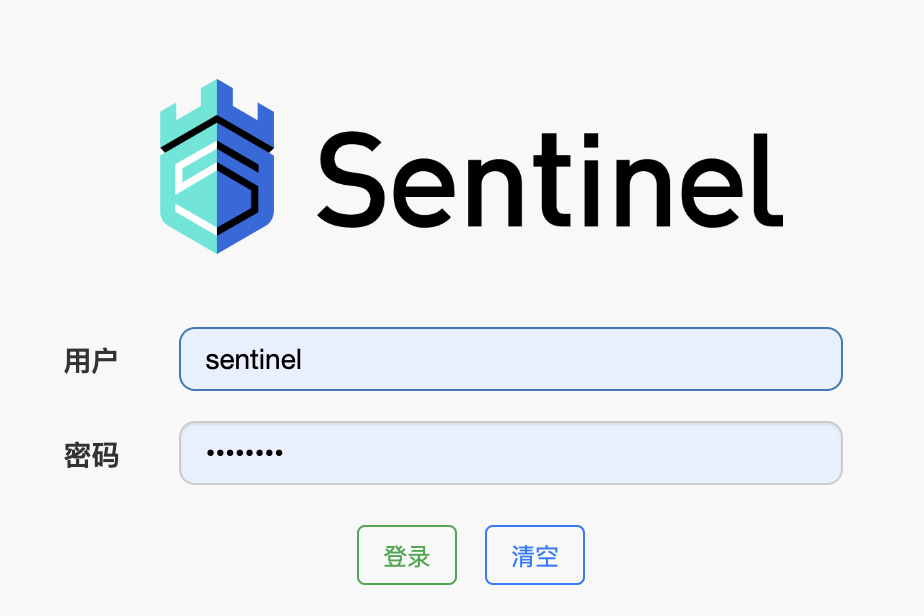
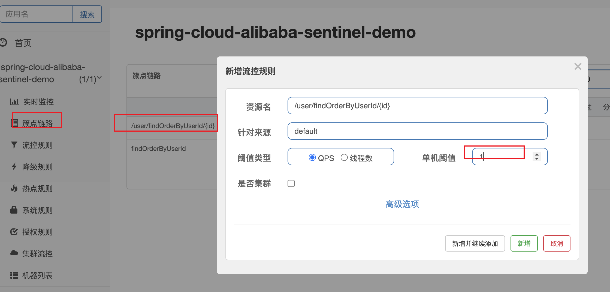

## 1. 分布式系统问题

### 1.1 分布式系统遇到的问题 

   在一个高度服务化的系统中,我们实现的一个业务逻辑通常会依赖多个服务,比如:商品详情展示服务会依赖商品服务, 价格 服务, 商品评论服务. 如图所示:


   调用三个依赖服务会共享商品详情服务的线程池. 如果其中的商品评论服务不可用, 就会出现线程池里所有线程都因等待 响应而被阻塞, 从而造成服务雪崩. 如图所示:


   服务雪崩效应:因服务提供者的不可用导致服务调用者的不可用,并将不可用逐渐放大的过程，就叫服务雪崩效应 导致服务不可用的原因: 程序Bug，大流量请求，硬件故障，缓存击穿

    【大流量请求】:在秒杀和大促开始前,如果准备不充分,瞬间大量请求会造成服务提供者的不可用。 

    【硬件故障】:可能为硬件损坏造成的服务器主机宕机, 网络硬件故障造成的服务提供者的不可访问。

    【缓存击穿】:一般发生在缓存应用重启, 缓存失效时高并发，所有缓存被清空时,以及短时间内大量缓存失效时。大量的 缓存不命中, 使请求直击后端,造成服务提供者超负荷运行,引起服务不可用。

   在服务提供者不可用的时候，会出现大量重试的情况:用户重试、代码逻辑重试，这些重试最终导致:进一步加大请求 流量。所以归根结底导致雪崩效应的最根本原因是:大量请求线程同步等待造成的资源耗尽。
   当服务调用者使用同步调 用时, 会产生大量的等待线程占用系统资源。一旦线程资源被耗尽,服务调用者提供的服务也将处于不可用状态, 于是服务 雪崩效应产生了。
   
### 1.2 解决方案

#### 1.2.1 超时机制

在不做任何处理的情况下，服务提供者不可用会导致消费者请求线程强制等待，而造成系统资源耗尽。加入超时机制，一旦超时，就释放资源。由于释放资源速度较快，一定程度上可以抑制资源耗尽的问题。

#### 1.2.2 服务限流(资源隔离)

   限制请求核心服务提供者的流量，使大流量拦截在核心服务之外，这样可以更好的保证核心服务提供者不出问题，对于一些出问题的服务可以限制流量访问，只分配固定线程资源访问，
   这样能使整体的资源不至于被出问题的服务耗尽，进 而整个系统雪崩。那么服务之间怎么限流，怎么资源隔离?例如可以通过线程池+队列的方式，通过信号量的方式。 如下图所示, 当商品评论服务不可用时, 
   即使商品服务独立分配的20个线程全部处于同步等待状态,也不会影响其他依赖服务的调用。


#### 1.2.3 服务熔断

   远程服务不稳定或网络抖动时暂时关闭，就叫服务熔断。

   现实世界的断路器大家肯定都很了解，断路器实时监控电路的情况，如果发现电路电流异常，就会跳闸，从而防止电路 被烧毁。

   软件世界的断路器可以这样理解:实时监测应用，如果发现在一定时间内失败次数/失败率达到一定阈值，就“跳闸”，断路 器打开——此时，请求直接返回，而不去调用原本调用的逻辑。跳闸一段时间后(例如10秒)，
   断路器会进入半开状 态，这是一个瞬间态，此时允许一次请求调用该调的逻辑，如果成功，则断路器关闭，应用正常调用;如果调用依然不 成功，断路器继续回到打开状态，过段时间再进入半开状态尝试——通过”跳闸“，
   应用可以保护自己，而且避免浪费资 源;而通过半开的设计，可实现应用的“自我修复“。

   所以，同样的道理，当依赖的服务有大量超时时，在让新的请求去访问根本没有意义，只会无畏的消耗现有资源。比如 我们设置了超时时间为1s,如果短时间内有大量请求在1s内都得不到响应，
   就意味着这个服务出现了异常，此时就没有必 要再让其他的请求去访问这个依赖了，这个时候就应该使用断路器避免资源浪费。


#### 1.2.4 服务降级

   有服务熔断，必然要有服务降级。

   所谓降级，就是当某个服务熔断之后，服务将不再被调用，此时客户端可以自己准备一个本地的fallback(回退)回调， 返回一个缺省值。 例如:(备用接口/缓存/mock数据) 。
   这样做，虽然服务水平下降，但好歹可用，比直接挂掉要强，当然这也要看适合的业务场景。

## 2. Sentinel (分布式系统的流量防卫兵)

### 2.1 Sentinel 是什么

   随着微服务的流行，服务和服务之间的稳定性变得越来越重要。Sentinel 是面向分布式服务架构的流量控制组件，主要以 流量为切入点，从限流、流量整形、熔断降级、系统负载保护、
   热点防护等多个维度来帮助开发者保障微服务的稳定 性。

   源码地址:https://github.com/alibaba/Sentinel

   官方文档:https://github.com/alibaba/Sentinel/wiki

#### 2.1.1 Sentinel 的特征: 

   1. 丰富的应用场景: Sentinel 承接了阿里巴巴近 10 年的双十一大促流量的核心场景，例如秒杀(即突发流量控制在系统容量可以承受的范围)、消息削峰填谷、实时熔断下游不可用应用等。

   2. 完备的实时监控: Sentinel 同时提供实时的监控功能。您可以在控制台中看到接入应用的单台机器秒级数据，甚至 500 台以下规模的集群的汇总运行情况。

   3. 广泛的开源生态: Sentinel 提供开箱即用的与其它开源框架/库的整合模块，例如与 Spring Cloud、Dubbo、 gRPC 的整合。您只需要引入相应的依赖并进行简单的配置即可快速地接入 Sentinel。

   4. 完善的 SPI 扩展点: Sentinel 提供简单易用、完善的 SPI 扩展点。您可以通过实现扩展点，快速的定制逻辑。例如定制规则管理、适配数据源等。

#### 2.1.2 Sentinel和Hystrix对比 

   https://github.com/alibaba/Sentinel/wiki/Sentinel-%E4%B8%8E-Hystrix-%E7%9A%84%E5%AF%B9%E6%AF%94


### 2.2 Sentinel 工作原理

#### 2.2.1 基本概念

   资源:

    资源是 Sentinel 的关键概念。它可以是 Java 应用程序中的任何内容，例如，由应用程序提供的服务，或由应用程序调用 的其它应用提供的服务，甚至可以是一段代码。
    在接下来的文档中，我们都会用资源来描述代码块。只要通过 Sentinel API 定义的代码，就是资源，能够被 Sentinel 保护起来。大部分情况下，可以使用方法签名，URL， 
    甚至服务名称作为资源名来标示资源。

   规则

    围绕资源的实时状态设定的规则，可以包括流量控制规则、熔断降级规则以及系统保护规则。所有规则可以动态实时调整。

#### 2.2.2 Sentinel工作主流程

   https://github.com/alibaba/Sentinel/wiki/Sentinel%E5%B7%A5%E4%BD%9C%E4%B8%BB%E6%B5%81%E7%A8%8B

   在 Sentinel 里面，所有的资源都对应一个资源名称(resourceName)，每次资源调用都会创建一个 Entry 对象。Entry 可以 通过对主流框架的适配自动创建，
   也可以通过注解的方式或调用 SphU API 显式创建。Entry 创建的时候，同时也会创建一 系列功能插槽(slot chain)，这些插槽有不同的职责，例如:

    1. NodeSelectorSlot 负责收集资源的路径，并将这些资源的调用路径，以树状结构存储起来，用于根据调用路径来 限流降级;

    2. ClusterBuilderSlot 则用于存储资源的统计信息以及调用者信息，例如该资源的 RT, QPS, thread count 等等，这 些信息将用作为多维度限流，降级的依据;

    3. StatisticSlot 则用于记录、统计不同纬度的 runtime 指标监控信息;

    4. FlowSlot 则用于根据预设的限流规则以及前面 slot 统计的状态，来进行流量控制; 

    5. AuthoritySlot 则根据配置的黑白名单和调用来源信息，来做黑白名单控制; 

    6. DegradeSlot 则通过统计信息以及预设的规则，来做熔断降级;

    7. SystemSlot 则通过系统的状态，例如 load1 等，来控制总的入口流量;


### 2.3  Sentinel快速开始

   在官方文档中，定义的Sentinel进行资源保护的几个步骤:

    1. 定义资源

    2. 定义规则

    3. 检验规则是否生效

```java
public class Demo {
 public String demo() {

        Entry entry = null;
        try {
            // 1. 资源名可使用任意有业务语义的字符串，比如方法名、接口名或其它可唯一标识的字符串。
            entry = SphU.entry(RESOURCE_NAME);
            // 2. 被保护的业务逻辑 todo
            String str = "hello world";
            log.info("====="+str+"=====");
            return str;
        } catch (BlockException e1) {
            // 资源访问阻止，被限流或被降级
            //进行相应的处理操作
            log.info("block!");
            return "被流控了！";
        } catch (Exception ex) {
            //  若需要配置降级规则，需要通过这种方式记录业务异常
            Tracer.traceEntry(ex, entry);
        } finally {
            // 务必保证 exit，务必保证每个 entry 与 exit 配对
            if (entry != null) {
                entry.exit();
            }
        }
        return null;
    }
}
```

#### 2.3.1 Sentinel资源保护的方式

##### 2.3.1.1 API  实现

###### 1. 引入依赖

```xml
<dependency>
    <groupId>com.alibaba.csp</groupId>
    <artifactId>sentinel‐core</artifactId>
    <version>1.8.0</version>
</dependency>
```

###### 2. 编写测试逻辑

```java
package com.wlz.controller;

import com.alibaba.csp.sentinel.Entry;
import com.alibaba.csp.sentinel.SphU;
import com.alibaba.csp.sentinel.Tracer;
import com.alibaba.csp.sentinel.slots.block.BlockException;
import com.alibaba.csp.sentinel.slots.block.RuleConstant;
import com.alibaba.csp.sentinel.slots.block.flow.FlowRule;
import com.alibaba.csp.sentinel.slots.block.flow.FlowRuleManager;
import lombok.extern.slf4j.Slf4j;
import org.springframework.web.bind.annotation.RequestMapping;
import org.springframework.web.bind.annotation.RestController;

import javax.annotation.PostConstruct;
import java.util.ArrayList;
import java.util.List;

/**
 * @author wlz
 * @date 2022-07-23  2:05 下午
 */
@RestController
@Slf4j
public class HelloController {

    private static final String RESOURCE_NAME = "hello";

    @RequestMapping(value = "/hello")
    public String hello() {
        Entry entry = null;
        try {
            // 资源名可使用任意有业务语义的字符串，比如方法名、接口名或其它可唯一标识的字符串。
            entry = SphU.entry(RESOURCE_NAME);

            // 被保护的业务逻辑
            String str = "hello world wlz";
            log.info(" ====== {} ======", str);
            return str;
        } catch (BlockException e) {
            // 资源访问阻止，被限流或被降级
            //进行相应的处理操作
            log.info(" block!");
            return "被流控了";
        } catch (Exception e) {
            // 若需要配置降级规则，需要通过这种方式记录业务异常
            Tracer.traceEntry(e, entry);
        } finally {
            // 务必保证 exit，务必保证每个 entry 与 exit 配对
            if (entry != null) {
                entry.exit();
            }
        }
        return null;
    }

    /**
     *  定义流控规则
     */
    @PostConstruct
    private static void initFlowRules() {
        List<FlowRule> rules = new ArrayList<>();
        FlowRule rule = new FlowRule();
        // 设置受保护的资源
        rule.setResource(RESOURCE_NAME);
        // 设置流控规则 QPS
        rule.setGrade(RuleConstant.FLOW_GRADE_QPS);

        // 设置受保护的资源阈值
        // Set limit QPS to 20.
        rule.setCount(1);

        rules.add(rule);

        // 加载配置好的规则
        FlowRuleManager.loadRules(rules);
    }

}

```

###### 3. 测试效果:


###### 4. 缺点

   业务侵入性很强，需要在controller中写入非业务代码.

   配置不灵活 若需要添加新的受保护资源 需要手动添加 init方法来添加流控规则

##### 2.3.1.2 @SentinelResource 实现

###### 1. 引入依赖

```xml
<dependency>
    <groupId>com.alibaba.csp</groupId>
    <artifactId>sentinel‐annotation‐aspectj</artifactId>
    <version>1.8.0</version>
</dependency>
```

###### 2. 配置 切面支持 

```java
@Configuration
public class SentinelAspectConfig {
    
    /**
     *  spring boot 项目 无需引入，会自定引入
     * @return
     */
    @Bean
    public SentinelResourceAspect sentinelResourceAspect() {
        return new SentinelResourceAspect();
    }
}
```

###### 3. UserController中编写测试逻辑，添加@SentinelResource，并配置blockHandler和fallback

```java
@RestController
@RequestMapping(value = "/user")
@Slf4j
public class UserController {

   @Autowired
   private OrderFeignService orderFeignService;

   // 这里 其实 有两个 资源 
   // /user/findOrderByUserId/{id} 和 findOrderByUserId
   // 如果 /user/findOrderByUserId/{id} 配置了 流控规则  则 /user/findOrderByUserId/{id} 生效 
   // 如果 /user/findOrderByUserId/{id} 未配置 流控规则， 则  findOrderByUserId 配置的 流控规则 生效 
   @RequestMapping(value = "/findOrderByUserId/{id}")
   @SentinelResource(value = "findOrderByUserId",
           blockHandler = "handleException2",blockHandlerClass = CommonBlockHandler.class,
           fallback = "fallback", fallbackClass = CommonBlockHandler.class)
   public String findOrderByUserId(@PathVariable("id") Integer id) {
      log.info("UserController  findOrderByUserId 访问 : id = {}", id);
      // findOrderByUserId  限流规则  2    sentinel dashboard 定义规则

      // feign 调用
      String result = orderFeignService.findOrderByUserId(id);

      return result;
   }
}
```

###### 4. 编写 CommonBlockHandler，注意如果指定了class，方法必须是static方法

```java
public class CommonBlockHandler {

    /**
     * 注意： 必须为 static 函数   多个方法之间方法名不能一样
     * @param exception
     * @return
     */
    public static String handleException(Map<String, Object> params, BlockException exception){
        return "===handleException 被限流啦==="+exception;
    }

    public static String handleException2(Integer id, BlockException exception){
        return "===handleException2 被限流啦==="+exception;
    }

    public static String handleException3(BlockException exception){
        return "===handleException3 被限流啦==="+exception;
    }

    public static String fallback(Integer id,Throwable e){
        return "===fallback 被异常降级啦===";
    }

}
```

###### 5. 流控规则设置可以通过Sentinel dashboard配置

客户端需要引入 Transport 模块来与 Sentinel 控制台进行通信。

```xml
<dependency>
    <groupId>com.alibaba.csp</groupId>
    <artifactId>sentinel‐transport‐simple‐http</artifactId>
   <version>1.8.0</version>
</dependency>
```

###### 6. 启动 Sentinel 控制台

   下载控制台 jar 包并在本地启动:可以参见 https://github.com/alibaba/Sentinel/wiki/%E6%8E%A7%E5%88%B6%E5%8F%B0#2-%E5%90%AF%E5%8A%A8%E6%8E%A7%E5%88%B6%E5%8F%B0

```shell
#启动控制台命令
java -jar sentinel-dashboard-1.8.0.jar
```

用户可以通过如下参数进行配置:

```shell
#用于指定控制台的登录用户名为 sentinel;
-Dsentinel.dashboard.auth.username=sentinel
#用于指定控制台的登录密码为 123456;如果省略这两个参数，默认用户和密码均为 sentinel;
-Dsentinel.dashboard.auth.password=123456
#用于指定 Spring Boot 服务端 session 的过期时间，如 7200 表示 7200 秒;60m 表示 60 分钟， 默认为 30 分钟; 
-Dserver.servlet.session.timeout=7200
```

###### 7. 访问 Sentinel 控制台

http://localhost:8080/#/login ,默认用户名密码: sentinel/sentinel

Sentinel 会在客户端首次调用的时候进行初始化，开始向控制台发送心跳包，所以要确保客户端有访问量;




###### 8. 给资源 添加 规则  及 结果 





### 2.4 Spring Cloud Alibaba整合Sentinel

#### 2.4.1 引入依赖

```xml
<dependencies>
  <!--sentinel -->
        <dependency>
            <groupId>com.alibaba.cloud</groupId>
            <artifactId>spring-cloud-starter-alibaba-sentinel</artifactId>
        </dependency>
        
        <!-- actuator 微服务监控依赖   -->
      <dependency>
         <groupId>org.springframework.boot</groupId>
         <artifactId>spring-boot-starter-actuator</artifactId>
      </dependency>
</dependencies>
```

#### 2.4.2 添加yml配置，为微服务设置sentinel控制台地址

  添加Sentinel后，需要暴露/actuator/sentinel端点,而Springboot默认是没有暴露该端点的，所以需要设置，测试 http://localhost:8800/actuator/sentinel

```yaml
server:
  port: 8040

spring:
  application:
    name: spring-cloud-alibaba-sentinel-demo  #微服务名称

  #配置nacos注册中心地址
  cloud:
    nacos:
      discovery:
        server-addr: 127.0.0.1:8848

    sentinel:
      transport:
        # 添加sentinel的控制台地址
        dashboard: 127.0.0.1:8080
        # 指定应用与Sentinel控制台交互的端口，应用本地会起一个该端口占用的HttpServer
        #port: 8719
#      datasource:
#        ds1:
#          nacos:
#            server-addr: 127.0.0.1:8848
#            dataId: ${spring.application.name}
#            groupId: DEFAULT_GROUP
#            data-type: json
#            rule-type: flow

#暴露actuator端点   http://localhost:8040/actuator/sentinel
management:
  endpoints:
    web:
      exposure:
        include: '*'
```

#### 2.4.3 在sentinel控制台中设置流控规则

   1. 资源名: 接口的API

   2. 针对来源: 默认是default，当多个微服务都调用这个资源时，可以配置微服务名来对指定的微服务设置阈值 
      
   3. 阈值类型: 分为QPS和线程数 假设阈值为10


      1. QPS类型: 只得是每秒访问接口的次数>10就进行限流

      2. 线程数: 为接受请求该资源分配的线程数>10就进行限流

```java
package com.wlz.controller;

import com.alibaba.csp.sentinel.annotation.SentinelResource;
import com.wlz.feign.OrderFeignService;
import com.wlz.sentinel.CommonBlockHandler;
import lombok.extern.slf4j.Slf4j;
import org.springframework.beans.factory.annotation.Autowired;
import org.springframework.web.bind.annotation.PathVariable;
import org.springframework.web.bind.annotation.RequestMapping;
import org.springframework.web.bind.annotation.RestController;

/**
 * @author wlz
 * @date 2022-07-23  2:33 下午
 */
@RestController
@RequestMapping(value = "/user")
@Slf4j
public class UserController {

    @Autowired
    private OrderFeignService orderFeignService;

    @RequestMapping(value = "/getById/{id}")
    public String getById(@PathVariable("id") Integer id) {
        log.info("UserController  getById 访问 : id = {}", id);
        // feign 调用
        String result = orderFeignService.findOrderByUserId(id);
        return result;
    }
}

```


#### 2.4.4 测试 

   因为QPS是1，所以1秒内多次访问会出现如下情形:


#### 2.5 访问 http://localhost:8040/actuator/sentinel， 可以查看flowRules

```json
{
    "blockPage": null,
    "appName": "spring-cloud-alibaba-sentinel-demo",
    "consoleServer": [
        {
            "r1": "127.0.0.1",
            "r2": 8080
        }
    ],
    "coldFactor": "3",
    "rules": {
        "systemRules": [],
        "authorityRule": [],
        "paramFlowRule": [],
        "flowRules": [
            {
                "resource": "hello",
                "limitApp": "default",
                "grade": 1,
                "count": 1,
                "strategy": 0,
                "refResource": null,
                "controlBehavior": 0,
                "warmUpPeriodSec": 10,
                "maxQueueingTimeMs": 500,
                "clusterMode": false,
                "clusterConfig": null
            },
            {
                "resource": "/user/getById/{id}",
                "limitApp": "default",
                "grade": 1,
                "count": 1,
                "strategy": 0,
                "refResource": null,
                "controlBehavior": 0,
                "warmUpPeriodSec": 10,
                "maxQueueingTimeMs": 500,
                "clusterMode": false,
                "clusterConfig": {
                    "flowId": null,
                    "thresholdType": 0,
                    "fallbackToLocalWhenFail": true,
                    "strategy": 0,
                    "sampleCount": 10,
                    "windowIntervalMs": 1000
                }
            }
        ],
        "degradeRules": []
    },
    "metricsFileCharset": "UTF-8",
    "filter": {
        "order": -2147483648,
        "urlPatterns": [
            "/**"
        ],
        "enabled": true
    },
    "totalMetricsFileCount": 6,
    "datasource": {},
    "clientIp": "192.168.31.30",
    "clientPort": "8720",
    "logUsePid": false,
    "metricsFileSize": 52428800,
    "logDir": "/Users/wlz/logs/csp/",
    "heartbeatIntervalMs": 10000
}
```

#### 2.6 微服务和Sentinel Dashboard通信原理

Sentinel控制台与微服务端之间，实现了一套服务发现机制，集成了Sentinel的微服务都会将元数据传递给Sentinel控制 台，架构图如下所示:


### 2.5 Sentinel 控制台介绍

   Sentinel 提供一个轻量级的开源控制台，它提供机器发现以及健康情况管理、监控(单机和集群)，规则 管理和推送的功能。

   Sentinel 控制台包含如下功能:

      查看机器列表以及健康情况:收集 Sentinel 客户端发送的心跳包，用于判断机器是否在线。

      监控 (单机和集群聚合):通过 Sentinel 客户端暴露的监控 API，定期拉取并且聚合应用监控信 息，最终可以实现秒级的实时监控。

      规则管理和推送:统一管理推送规则。

      鉴权:生产环境中鉴权非常重要。这里每个开发者需要根据自己的实际情况进行定制。

#### 2.5.1 实时监控

监控接口的通过的QPS和拒绝的QPS


#### 2.5.2 簇点链路

用来显示微服务的所监控的API


#### 2.5.3  流控规则

   流量控制(flow control)，其原理是监控应用流量的 QPS 或并发线程数等指标，当达到指定的阈值时对流 量进行控制，以避免被瞬时的流量高峰冲垮，从而保障应用的高可用性。

   同一个资源可以创建多条限流规则。FlowSlot 会对该资源的所有限流规则依次遍历，直到有规则触发限流 或者所有规则遍历完毕。一条限流规则主要由下面几个因素组成，
   我们可以组合这些元素来实现不同的限流效果。


   参考文档:https://github.com/alibaba/Sentinel/wiki/%E6%B5%81%E9%87%8F%E6%8E%A7%E5%88%B6

##### 2.5.1 限流阈值类型

   流量控制主要有两种统计类型，一种是统计并发线程数，另外一种则是统计 QPS。类型由 FlowRule 的grade 字段来定义。其中，0 代表根据并发数量来限流，1 代表根据 QPS 来进行流量控制。 
   
   QPS(Query Per Second):每秒请求数，就是说服务器在一秒的时间内处理了多少个请求。
   
###### 1. QPS 

   进入簇点链路选择具体的访问的API，然后点击流控按钮


   测试: 


   BlockException异常统一处理

   springwebmvc接口资源限流入口在HandlerInterceptor的实现类AbstractSentinelInterceptor的preHandle方法中，
   对异常的处理是BlockExceptionHandler的实现类 sentinel 1.7.1 引入了 sentinel-spring-webmvc-adapter.jar 

自定义BlockExceptionHandler 的实现类统一处理BlockException

```java
package com.wlz.sentinel;

import com.alibaba.csp.sentinel.adapter.spring.webmvc.callback.BlockExceptionHandler;
import com.alibaba.csp.sentinel.slots.block.BlockException;
import com.alibaba.csp.sentinel.slots.block.authority.AuthorityException;
import com.alibaba.csp.sentinel.slots.block.degrade.DegradeException;
import com.alibaba.csp.sentinel.slots.block.flow.FlowException;
import com.alibaba.csp.sentinel.slots.block.flow.param.ParamFlowException;
import com.alibaba.csp.sentinel.slots.system.SystemBlockException;
import com.fasterxml.jackson.databind.ObjectMapper;
import lombok.extern.slf4j.Slf4j;
import org.springframework.http.MediaType;
import org.springframework.stereotype.Component;

import javax.servlet.http.HttpServletRequest;
import javax.servlet.http.HttpServletResponse;

/**
 * @author wlz
 * @date 2022-07-23  4:42 下午
 */
@Slf4j
@Component
public class MyBlockExceptionHandler implements BlockExceptionHandler {
    @Override
    public void handle(HttpServletRequest request, HttpServletResponse response, BlockException e) throws Exception {
        log.info("BlockExceptionHandler BlockException================"+e.getRule());
        String r = null;

        if (e instanceof FlowException) {
            r = "接口限流了";

        } else if (e instanceof DegradeException) {
            r = "服务降级了";

        } else if (e instanceof ParamFlowException) {
            r = "热点参数限流了";

        } else if (e instanceof SystemBlockException) {
            r = "触发系统保护规则了";

        } else if (e instanceof AuthorityException) {
            r = "授权规则不通过";
        }

        //返回json数据
        response.setStatus(500);
        response.setCharacterEncoding("utf-8");
        response.setContentType(MediaType.APPLICATION_JSON_VALUE);
        new ObjectMapper().writeValue(response.getWriter(), r);
    }
}

```

  测试: 


###### 2. 并发线程数 

   并发数控制用于保护业务线程池不被慢调用耗尽。例如，当应用所依赖的下游应用由于某种原因导致服务不稳定、响应延迟增加，对于调用者来说，意味着吞吐量下降和更多的线程数占用，极端情况下甚至导致
   线程池耗尽。为应对太多线程占用的情况，业内有使用隔离的方案，比如通过不同业务逻辑使用不同线程池来隔离业务自身之间的资源争抢(线程池隔离)。这种隔离方案虽然隔离性比较好，
   但是代价就是线程 数目太多，线程上下文切换的 overhead 比较大，特别是对低延时的调用有比较大的影响。

   Sentinel 并发控 制不负责创建和管理线程池，而是简单统计当前请求上下文的线程数目(正在执行的调用数目)，如果超 出阈值，新的请求会被立即拒绝，效果类似于信号量隔离。
   并发数控制通常在调用端进行配置。


  模拟测试并发线程数限流

```java
package com.wlz.controller;

import com.alibaba.csp.sentinel.annotation.SentinelResource;
import com.wlz.feign.OrderFeignService;
import com.wlz.sentinel.CommonBlockHandler;
import lombok.extern.slf4j.Slf4j;
import org.springframework.beans.factory.annotation.Autowired;
import org.springframework.web.bind.annotation.PathVariable;
import org.springframework.web.bind.annotation.RequestMapping;
import org.springframework.web.bind.annotation.RestController;

/**
 * @author wlz
 * @date 2022-07-23  2:33 下午
 */
@RestController
@RequestMapping(value = "/user")
@Slf4j
public class UserController {

    @Autowired
    private OrderFeignService orderFeignService;
    
    @RequestMapping(value = "/findOrderByUserId/{id}")
    @SentinelResource(value = "findOrderByUserId",
            blockHandler = "handleException2",blockHandlerClass = CommonBlockHandler.class,
            fallback = "fallback", fallbackClass = CommonBlockHandler.class)
    public String findOrderByUserId(@PathVariable("id") Integer id) {
        log.info("UserController  findOrderByUserId 访问 : id = {}", id);
        // findOrderByUserId  限流规则  2    sentinel dashboard 定义规则

        try {
            // 模拟测试并发线程数限流
            Thread.sleep(900);
        } catch (InterruptedException e) {
            e.printStackTrace();
        }
        // feign 调用
        String result = orderFeignService.findOrderByUserId(id);
        return result;
    }
    
}

```

   通过 jmeter 测试 


##### 2.5.3.1 流控模式

   基于调用关系的流量控制。调用关系包括调用方、被调用方;一个方法可能会调用其它方法，形成一个调用链路的层次关系。
   
###### 1 直接

资源调用达到设置的阈值后直接被流控抛出异常


###### 2. 关联 

   当两个资源之间具有资源争抢或者依赖关系的时候，这两个资源便具有了关联。比如对数据库同一个字段 的读操作和写操作存在争抢，读的速度过高会影响写得速度，写的速度过高会影响读的速度。
   
   如果放任读 写操作争抢资源，则争抢本身带来的开销会降低整体的吞吐量。可使用关联限流来避免具有关联关系的资 源之间过度的争抢，举例来说，read_db 和 write_db 这两个资源分别代表数据库读写，
   我们可以给 read_db 设置限流规则来达到写优先的目的:设置 strategy 为 RuleConstant.STRATEGY_RELATE 同时设置 refResource 为 write_db。
   
   这样当写库操作过于频繁时，读数据的请求会被限流。


   当 关联资源 /user/info/{id} 达到了设置的阈值 2, 对上面的 /user/findOrderByUserId/{id} 资源 进行 限流。 
   
   测试:


   结果: 
   
      当 /user/info/{id} 达到 设置的 阈值之后, 再次访问 /user/info/{id} ，不会进行限流, 而 对 /user/findOrderByUserId/{id} 访问 则会进行限流 

###### 3. 链路 

   根据调用链路入口限流。

   NodeSelectorSlot 中记录了资源之间的调用链路，这些资源通过调用关系，相互之间构成一棵调用树。这棵 树的根节点是一个名字为 machine-root 的虚拟节点，调用链的入口都是这个虚节点的子节点。


   上图中来自入口 Entrance1 和 Entrance2 的请求都调用到了资源 NodeA，Sentinel 允许只根据某个入口的统计 信息对资源限流。


   测试会发现链路规则不生效

   *注意，高版本此功能直接使用不生效* 

##### 2.5.3.2 流控效果

   当 QPS 超过某个阈值的时候，则采取措施进行流量控制。流量控制的效果包括以下几种:快速失败(直接 拒绝)、Warm Up(预热)、匀速排队(排队等待)。对应 FlowRule 中的 controlBehavior 字段。
   
###### 1. 快速失败

   (RuleConstant.CONTROL_BEHAVIOR_DEFAULT)方式是默认的流量控制方式，当QPS超过任意规则的阈值后，新 的请求就会被立即拒绝，拒绝方式为抛出FlowException。
   这种方式适用于对系统处理能力确切已知的情况下，比如通过压测确定了系统的准确水位时。
   
###### 2. Warm Up

   Warm Up(RuleConstant.CONTROL_BEHAVIOR_WARM_UP)方式，即预热/冷启动方式。当系统长期处于低水位的情 况下，当流量突然增加时，直接把系统拉升到高水位可能瞬间把系统压垮。通过"冷启动"，
   让通过的流量缓 慢增加，在一定时间内逐渐增加到阈值上限，给冷系统一个预热的时间，避免冷系统被压垮。

   冷加载因子: codeFactor 默认是3，即请求 QPS 从 threshold / 3 开始，经预热时长逐渐升至设定的 QPS 阈值。
   
###### 3. 匀速排队

   匀速排队(`RuleConstant.CONTROL_BEHAVIOR_RATE_LIMITER`)方式会严格控制请求通过的间隔时 间，也即是让请求以均匀的速度通过，对应的是漏桶算法。

   这种方式主要用于处理间隔性突发的流量，例如消息队列。想象一下这样的场景，在某一秒有大量的请求到来，而接下来的几秒则处于空闲状态，我们希望系统能够在接下来的空闲期间逐渐处理这些请求，
   而不是在第一秒直接拒绝多余的请求。
   


#### 2.5.4 降级规则

   除了流量控制以外，对调用链路中不稳定的资源进行熔断降级也是保障高可用的重要措施之一。我们需要对不稳定的弱依赖服务调用进行熔断降级，暂时切断不稳定调用，避免局部不稳定因素导致整体的雪崩。
   熔断降级作为保护自身的手段，通常在客户端(调用端)进行配置。
   
##### 2.5.4.1 熔断降级规则说明


#### 2.5.5 热点参数限流

   何为热点?热点即经常访问的数据。很多时候我们希望统计某个热点数据中访问频次最高的 Top K 数据， 并对其访问进行限制。比如:

      1. 商品 ID 为参数，统计一段时间内最常购买的商品 ID 并进行限制

      2. 用户 ID 为参数，针对一段时间内频繁访问的用户 ID 进行限制

   热点参数限流会统计传入参数中的热点参数，并根据配置的限流阈值与模式，对包含热点参数的资源调用 进行限流。热点参数限流可以看做是一种特殊的流量控制，仅对包含热点参数的资源调用生效。


   注意:

      1. 热点规则需要使用@SentinelResource("resourceName")注解，否则不生效 
      
      2. 参数必须是7种基本数据类型才会生效

#### 2.5.6 系统规则

   Sentinel 系统自适应限流从整体维度对应用入口流量进行控制，结合应用的 Load、CPU 使用率、总体平 均 RT、入口 QPS 和并发线程数等几个维度的监控指标，通过自适应的流控策略，
   让系统的入口流量和系 统的负载达到一个平衡，让系统尽可能跑在最大吞吐量的同时保证系统整体的稳定性。

      1. Load 自适应(仅对 Linux/Unix-like 机器生效):系统的 load1 作为启发指标，进行自适应系统 保护。当系统 load1 超过设定的启发值，
      且系统当前的并发线程数超过估算的系统容量时才会触发系统保护(BBR 阶段)。系统容量由系统的 maxQps * minRt 估算得出。设定参考值一般是 CPU cores * 2.5。

      2. CPU usage(1.5.0+ 版本):当系统 CPU 使用率超过阈值即触发系统保护(取值范围 0.0- 1.0)，比较灵敏。

      3. 平均 RT:当单台机器上所有入口流量的平均 RT 达到阈值即触发系统保护，单位是毫秒。 

      4. 并发线程数:当单台机器上所有入口流量的并发线程数达到阈值即触发系统保护。

      5. 入口 QPS:当单台机器上所有入口流量的 QPS 达到阈值即触发系统保护。

#### 2.5.7 授权控制规则

   很多时候，我们需要根据调用来源来判断该次请求是否允许放行，这时候可以使用 Sentinel 的来源访问控 制(黑白名单控制)的功能。来源访问控制根据资源的请求来源(origin)限制资源是否通过，
   若配置白名 单则只有请求来源位于白名单内时才可通过;若配置黑名单则请求来源位于黑名单时不通过，其余的请求 通过。

   来源访问控制规则(AuthorityRule)非常简单，主要有以下配置项: 
   
      1. resource:资源名，即限流规则的作用对象。

      2. limitApp:对应的黑名单/白名单，不同 origin 用 , 分隔，如 appA,appB。 

      3. strategy:限制模式，AUTHORITY_WHITE 为白名单模式，AUTHORITY_BLACK 为黑名单模式，默认为白名单模式。

#### 2.5.8 集群规则

   为什么要使用集群流控呢?假设我们希望给某个用户限制调用某个 API 的总 QPS 为 50，但机器数可能很多(比如有 100 台)。这时候我们很自然地就想到，找一个 server 来专门来统计总的调用量，
   其它的实例 都与这台 server 通信来判断是否可以调用。这就是最基础的集群流控的方式。 
   
   另外集群流控还可以解决流量不均匀导致总体限流效果不佳的问题。假设集群中有 10 台机器，我们给每台 机器设置单机限流阈值为 10 QPS，理想情况下整个集群的限流阈值就为 100 QPS。
   不过实际情况下流量 到每台机器可能会不均匀，会导致总量没有到的情况下某些机器就开始限流。因此仅靠单机维度去限制的话会无法精确地限制总体流量。而集群流控可以精确地控制整个集群的调用总量，
   结合单机限流兜底，可 以更好地发挥流量控制的效果。

   官方文档:https://github.com/alibaba/Sentinel/wiki/%E9%9B%86%E7%BE%A4%E6%B5%81%E6%8E%A7

   集群流控中共有两种身份:

      1. Token Client:集群流控客户端，用于向所属 Token Server 通信请求 token。集群限流服务端会 返回给客户端结果，决定是否限流。

      2. Token Server:即集群流控服务端，处理来自 Token Client 的请求，根据配置的集群规则判断是 否应该发放 token(是否允许通过)。

   Sentinel 集群流控支持限流规则和热点规则两种规则，并支持两种形式的阈值计算方式: 
   
      1. 集群总体模式:即限制整个集群内的某个资源的总体 qps 不超过此阈值。 

      2. 单机均摊模式:单机均摊模式下配置的阈值等同于单机能够承受的限额，token server 会根据连接数来计算总的阈值(比如独立模式下有 3 个 client 连接到了 token server，
      然后配的单机均摊阈值 为 10，则计算出的集群总量就为 30)，按照计算出的总的阈值来进行限制。这种方式根据当前的连 接数实时计算总的阈值，对于机器经常进行变更的环境非常适合。

