## 1. skywalking 是什么

   对于一个大型的几十个、几百个微服务构成的微服务架构系统，通常会遇到下面一些问题，比如: 

    1. 如何串联整个调用链路，快速定位问题?

    2. 如何理清各个微服务之间的依赖关系?

    3. 如何进行各个微服务接口的性能分折?

    4. 如何跟踪整个业务流程的调用处理顺序?

   skywalking 是一个国产开源框架，2015年由吴晟开源 ， 2017年加入Apache孵化器。skywalking是分布式系统的应用程序性能监视 工具，专为微服务、
   云原生架构和基于容器(Docker、K8s、Mesos)架构而设计。SkyWalking 是观察性分析平台和应用性能管理 系统，提供分布式追踪、服务网格遥测分析、度量聚合和可视化一体化解决方案。

   官网:https://skywalking.apache.org/

   下载:https://skywalking.apache.org/downloads/ 
   
   Github:https://github.com/apache/skywalking

   文档:https://skywalking.apache.org/docs/skywalking-showcase/v8/readme/

   中文文档: https://skyapm.github.io/document-cn-translation-of-skywalking/ 
   
   版本: v8.3.0 升级到v8.4.0

### 1.1 调用链选型

   1. Zipkin是Twitter开源的调用链分析工具，目前基于springcloud sleuth得到了广泛的使用，特点是轻量，使用部署简单。

   2. Pinpoint是韩国人开源的基于字节码注入的调用链分析，以及应用监控分析工具。特点是支持多种插件，UI功能强大，接入 端无代码侵入。

   3. SkyWalking是本土开源的基于字节码注入的调用链分析，以及应用监控分析工具。特点是支持多种插件，UI功能较强，接入 端无代码侵入。目前已加入Apache孵化器。

   4. CAT是大众点评开源的基于编码和配置的调用链分析，应用监控分析，日志采集，监控报警等一系列的监控平台工具。

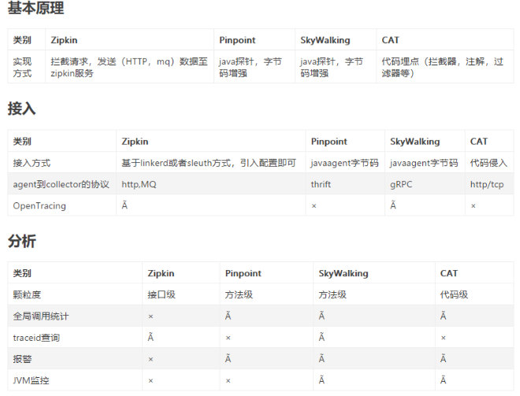

### 1.2. 探针性能对比

   模拟了三种并发用户:500，750，1000。使用jmeter测试，每个线程发送30个请求，设置思考时间为10ms。使用的采样率为1，即 100%，这边与生产可能有差别。pinpoint默认的采样率为20，即50%，
   通过设置agent的配置文件改为100%。zipkin默认也是1。组 合起来，一共有12种。下面看下汇总表:

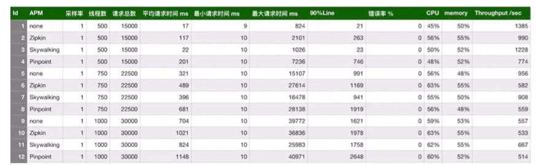

   从上表可以看出，在三种链路监控组件中，skywalking的探针对吞吐量的影响最小，zipkin的吞吐量居中。pinpoint的探针对吞吐 量的影响较为明显，在500并发用户时，测试服务的吞吐量从1385降低到774，
   影响很大。然后再看下CPU和memory的影响，在内 部服务器进行的压测，对CPU和memory的影响都差不多在10%之内。

### 1.3 Skywalking 主要功能特性

   1. 多种监控手段，可以通过语言探针和service mesh获得监控的数据;

   2. 支持多种语言自动探针，包括 Java，.NET Core 和 Node.JS; 
      
   3. 轻量高效，无需大数据平台和大量的服务器资源; 
      
   4. 模块化，UI、存储、集群管理都有多种机制可选; 
      
   5. 支持告警;

   6. 优秀的可视化解决方案;

### 1.4 Skywalking 整体架构

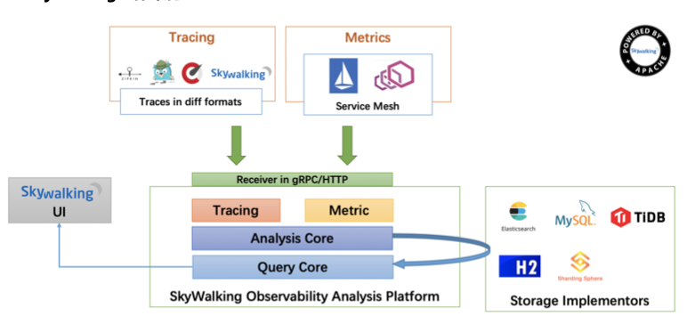

#### 1.4.1 整个架构分成四部分:

   1、上部分Agent :负责从应用中，收集链路信息，发送给 SkyWalking OAP 服务器;

   2、下部分 SkyWalking OAP :负责接收Agent发送的Tracing数据信息，然后进行分析(Analysis Core)，存储到外 部存储器(Storage)，最终提供查询(Query)功能; 
   
   3、右部分Storage:Tracing数据存储，目前支持ES、MySQL、Sharding Sphere、TiDB、H2多种存储器，目前采 用较多的是ES，主要考虑是SkyWalking开发团队自己的生产环境采用ES为主;

   4、左部分SkyWalking UI:负责提供控制台，查看链路等等;

##### 1.4.1.1 SkyWalking支持三种探针

   1. Agent – 基于ByteBuddy字节码增强技术实现，通过jvm的agent参数加载，并在程序启动时拦截指定的方法来 收集数据。

   2. SDK – 程序中显式调用SkyWalking提供的SDK来收集数据，对应用有侵入。

   3. Service Mesh – 通过Service mesh的网络代理来收集数据。

##### 1.4.1.2 后端(Backend)

   接受探针发送过来的数据，进行度量分析，调用链分析和存储。后端主要分为两部分:

   1. OAP(Observability Analysis Platform)- 进行度量分析和调用链分析的后端平台，并支持将数据存储到各种 数据库中，如:ElasticSearch，MySQL，InfluxDB等。
 
   2. OAL(Observability Analysis Language)- 用来进行度量分析的DSL，类似于SQL，用于查询度量分析结果和 警报。

##### 1.4.1.3 界面(UI)

   1. RocketBot UI – SkyWalking 7.0.0 的默认web UI

   2. CLI – 命令行界面

#### 1.4.2 三个模块的交互流程:

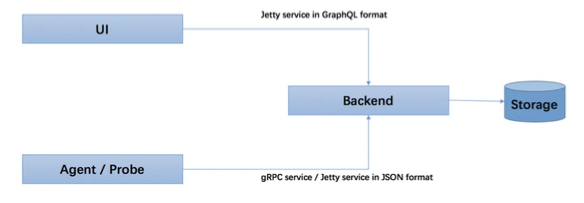

## 2. SkyWalking 环境搭建部署

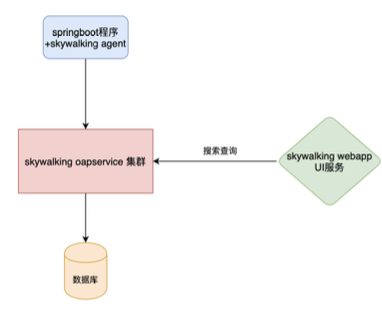

   1. skywalking agent和业务系统绑定在一起，负责收集各种监控数据

   2. Skywalking oapservice是负责处理监控数据的，比如接受skywalking agent的监控数据，并存储在数据库中(本案例使用elasticsearch);接受skywalking webapp的前端请求，
      从数据库查询数据，并返回数据给前端。Skywalking oapservice通常以集群的形式存在。

   3. skywalking webapp，前端界面，用于展示数据。 
      
   4. 用于存储监控数据的数据库，比如mysql、elasticsearch等。

### 2.1 下载 SkyWalking

   下载:https://skywalking.apache.org/downloads/

   指定版本下载: https://archive.apache.org/dist/skywalking/8.4.0/

#### 2.1.1 目录结构 

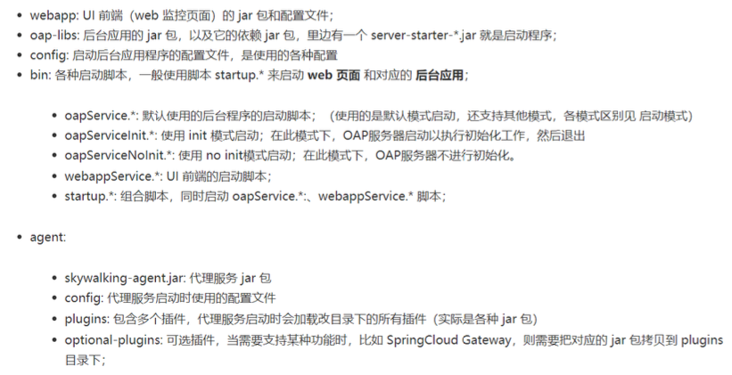

#### 2.1.2 上传 解压(linux- centos7)

##### 2.1.2.1 创建文件夹 

```shell
cd /software
mkdir skyWalking 
```

##### 2.1.2.2 将 下载 的 apache-skywalking-apm-8.4.0.tar.gz 上传至 linux 

   上传 apache-skywalking-apm-8.4.0.tar.gz 包 
   
##### 2.1.2.3 解压 

```shell
cd /software/skyWalking
tar -zxvf apache-skywalking-apm-8.4.0.tar.gz
```


#### 2.2 搭建SkyWalking OAP 服务

先使用默认的H2数据库存储,不用修改配置

##### 2.2.1 修改 config/application.yml ， 默认是 h2 ,可以不用修改

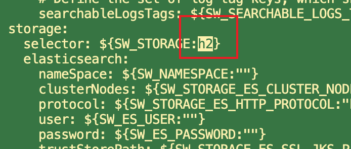

##### 2.2.2 启动脚本bin/startup.sh

```shell
c
```

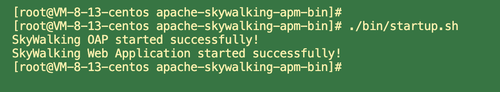

##### 2.2.3  日志信息存储在logs目录

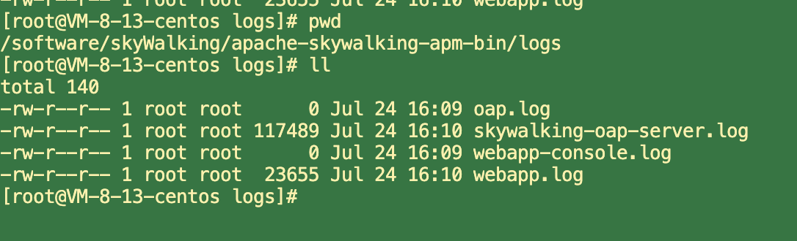

##### 2.2.4 查看是否启动成功 

  因为 SkyWalking 是java 应用，所以可以 通过下面命令启动 

```shell
ps -ef|grep java 
jps -l 
```

   启动成功后会启动两个服务，一个是skywalking-oap-server，一个是skywalking-web-ui 
   
   skywalking-oap-server服务启动后会暴露11800 和 12800 两个端口，分别为收集监控数据的端口11800和接受前 端请求的端口12800，修改端口可以修改config/applicaiton.yml

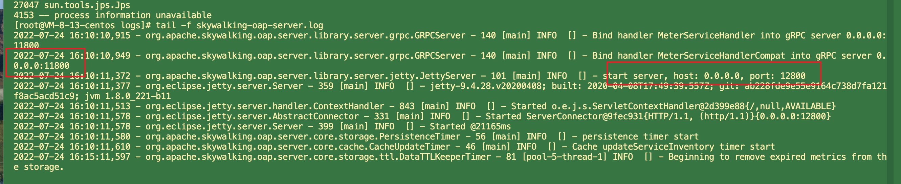

   skywalking-web-ui服务会占用 8080 端口， 修改端口可以修改webapp/webapp.yml

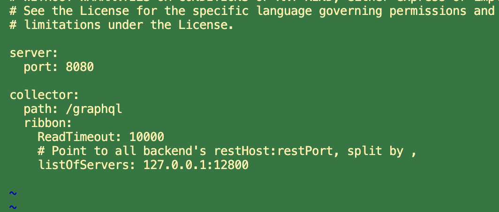
 
   server.port:SkyWalking UI服务端口，默认是8080;

   collector.ribbon.listOfServers:SkyWalking OAP服务地址数组，SkyWalking UI界面的数据是通过请求SkyWalking OAP服务来获得;

##### 2.2.5 访问 (如果是云服务器，需要开放相对于端口，及防火墙配置等)

   访问:http://127.0.0.1:8080/   

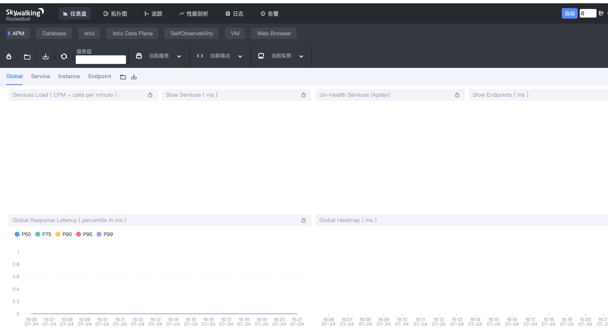

## 3. SkyWalking中三个概念

   1. 服务(Service) :表示对请求提供相同行为的一系列或一组工作负载，在使用Agent时，可以定义服务的名字; 
      
   2. 服务实例(Service Instance) :上述的一组工作负载中的每一个工作负载称为一个实例， 一个服务实例实际就是操作系 统上的一个真实进程;

   3. 端点(Endpoint) :对于特定服务所接收的请求路径, 如HTTP的URI路径和gRPC服务的类名 + 方法签名;

## 4. SkyWalking快速开始

### 4.1 SkyWalking Agent跟踪微服务

#### 4.1.1  通过jar包方式接入

准备一个springboot程序，打成可执行jar包，写一个shell脚本，在启动项目的Shell脚本上，通过 -javaagent 参数 进行配置SkyWalking Agent来跟踪微服务;

##### 4.1.1.1 准备 可执行 的jar 包

spring-boot-skywalking-demo-1.0-SNAPSHOT.jar

##### 4.1.1.2 编写启动脚本 startup.sh  

```shell
#!/bin/sh
#SkyWalkingAgent配置
export SW_AGENT_NAME=spring-boot-skywalking-demo #Agent名字,一般使用`spring.application.name`
export SW_AGENT_COLLECTOR_BACKEND_SERVICES=127.0.0.1:11800 #配置 Collector 地址。
export SW_AGENT_SPAN_LIMIT=2000 #配置链路的最大Span数量，默认为 300。
export JAVA_AGENT=-javaagent:/software/skyWalking/apache-skywalking-apm-bin/agent/skywalking-agent.jar
java $JAVA_AGENT -jar spring-boot-skywalking-demo-1.0-SNAPSHOT.jar #jar启动
```
 
  等同于:

```shell
java -javaagent:/software/skyWalking/apache-skywalking-apm-bin/agent/skywalking-agent.jar
-DSW_AGENT_COLLECTOR_BACKEND_SERVICES=127.0.0.1:11800
-DSW_AGENT_NAME=spring-boot-skywalking-demo -jar spring-boot-skywalking-demo-1.0-SNAPSHOT.jar
```

   参数名对应agent/config/agent.config配置文件中的属性。 属性对应的源码:org.apache.skywalking.apm.agent.core.conf.Config.java

   我们也可以使用skywalking.+配置文件中的配置名作为系统配置项来进行覆盖。 javaagent参数配置方式优先级更高

```shell
-javaagent:/software/skyWalking/apache-skywalking-apm-bin/agent/skywalking-agent.jar
-Dskywalking.agent.service_name=spring-boot-skywalking-demo
-Dskywalking.collector.backend_service=127.0.0.1:11800
```

##### 4.1.1.3 启动 及日志 

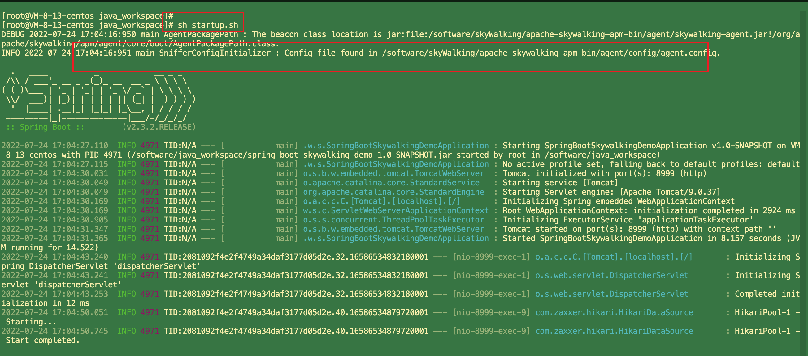

##### 4.1.1.4 测试 

http://127.0.0.1:8999/user/info/1

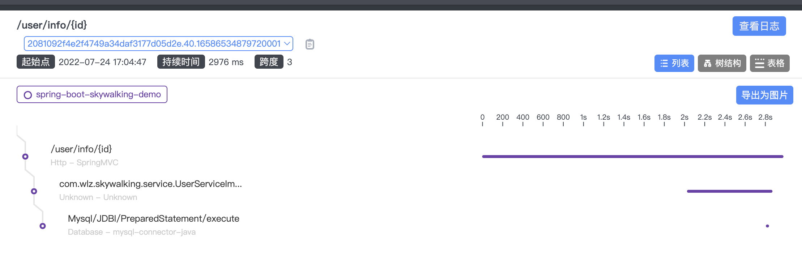


#### 4.1.2 在IDEA中使用Skywalking

   在运行的程序配置jvm参数，如下图所示:

```shell
#skywalking‐agent.jar的本地磁盘的路径
-javaagent:/Library/java_workspace/skyWalking/apache-skywalking-apm-bin/agent/skywalking-agent.jar
# 在skywalking上显示的服务名
-Dskywalking.agent.service_name=spring-boot-skywalking-demo
#skywalking的collector服务的IP及端口
-Dskywalking.collector.backend_service=127.0.0.1:11800
```

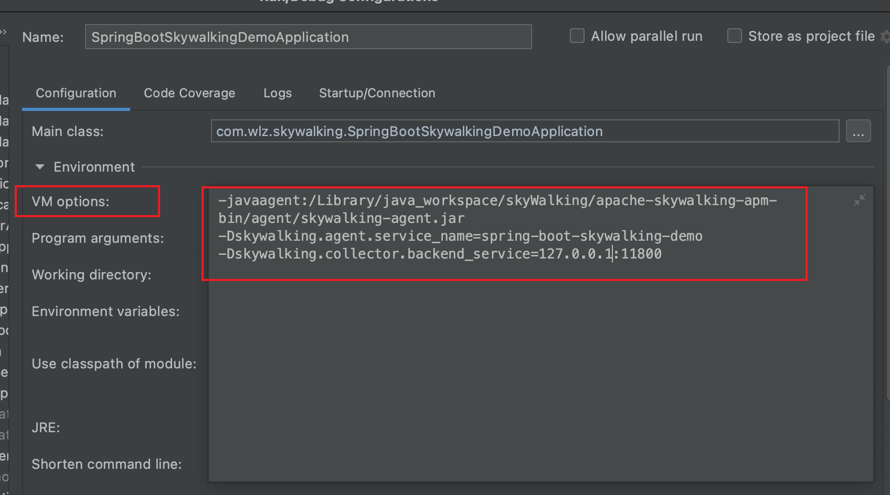

#### 4.1.3 Skywalking跨多个微服务跟踪

Skywalking跨多个微服务跟踪，只需要每个微服务启动时添加javaagent参数即可。

##### 4.1.3.1 配置 

启动微服务spring-cloud-alibaba-gateway-demo，spring-cloud-alibaba-gateway-order ，配置skywalking的jvm参数

```shell
-javaagent:/Library/java_workspace/skyWalking/apache-skywalking-apm-bin/agent/skywalking-agent.jar
-Dskywalking.agent.service_name=spring-cloud-alibaba-gateway-demo
-Dskywalking.collector.backend_service=127.0.0.1:11800


-javaagent:/Library/java_workspace/skyWalking/apache-skywalking-apm-bin/agent/skywalking-agent.jar
-Dskywalking.agent.service_name=spring-cloud-alibaba-gateway-order
-Dskywalking.collector.backend_service=127.0.0.1:11800
```

##### 4.1.3.2 测试 

http://localhost:8888/order/findOrderByUserId/1

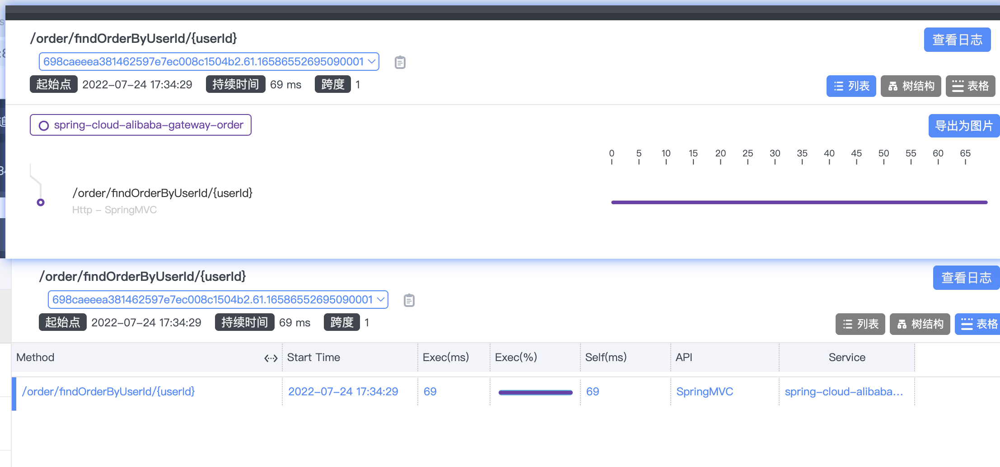

##### 4.1.3.3 注意:此处存在bug，跟踪链路不显示gateway

拷贝agent/optional-plugins目录下的gateway插件到agent/plugins目录

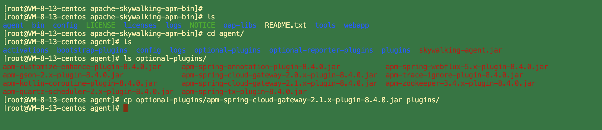

## 5. Skywalking启动流程源码分析 

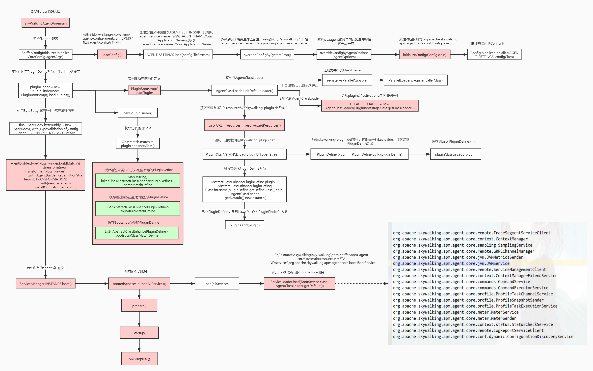