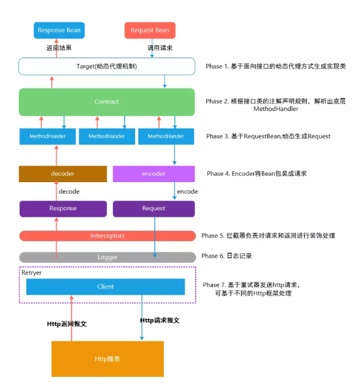
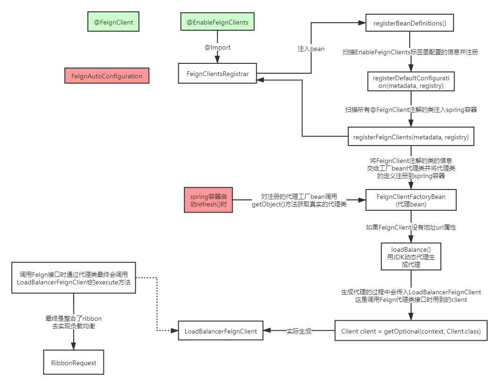

## 1. JAVA 项目中如何实现接口调用 

   1. HttpClient 是 Apache Jakarta Common 下的子项目，用来提供高效的、最新的、功能丰富的支持 Http 协 议的客户端编程工具包，并且它支持 HTTP 协议最新版本和建议。
      HttpClient 相比传统 JDK 自带的 URLConnection，提升了易用性和灵活性，使客户端发送 HTTP 请求变得容易，提高了开发的效率。 

   2. Okhttp 一个处理网络请求的开源项目，是安卓端最火的轻量级框架，由 Square 公司贡献，用于替代 HttpUrlConnection 和 Apache HttpClient。
      OkHttp 拥有简洁的 API、高效的性能，并支持多种协议 (HTTP/2 和 SPDY)。

   3. HttpURLConnection 是 Java 的标准类，它继承自 URLConnection，可用于向指定网站发送 GET 请求、 POST 请求。HttpURLConnection 使用比较复杂，不像 HttpClient 那样容易使用。

   4. RestTemplate 是 Spring 提供的用于访问 Rest 服务的客户端，RestTemplate 提供了多种便捷访问远程 HTTP 服务的方法，能够大大提高客户端的编写效率。 
      上面介绍的是最常见的几种调用接口的方法，我们下面要介绍的方法比上面的更简单、方便，它就是 Feign。

## 2. Feign

### 2.1 什么是Feign (Netflix 开发的)

   Feign是Netflix开发的声明式、模板化的HTTP客户端，其灵感来自Retrofit、JAXRS-2.0以及WebSocket。 Feign可帮助我们更加便捷、优雅地调用HTTP API。
   
   Feign支持多种注解，例如Feign自带的注解或者JAX-RS注解等。
   
#### 2.1.1 openfeign (Spring Cloud 对 feign 的再次开发)

   Spring Cloud openfeign 对Feign进行了增强，使其支持Spring MVC注解，另外还整合了Ribbon和Eureka，从而使得Feign的使用更加方便
   
#### 2.1.2 优势

   Feign可以做到使用 HTTP 请求远程服务时就像调用本地方法一样的体验，开发者完全感知不到这是远程方 法，更感知不到这是个 HTTP 请求。
   它像 Dubbo 一样，consumer 直接调用接口方法调用 provider，而不 需要通过常规的 Http Client 构造请求再解析返回数据。它解决了让开发者调用远程接口就跟调用本地方法 一样，
   无需关注与远程的交互细节，更无需关注分布式环境开发。

#### 2.1.3 Feign的设计架构



#### 2.1.4  Ribbon&Feign对比

##### 2.1.4.1 Ribbon+RestTemplate进行微服务调用

```java
@Configuration
public class RestConfig {

    @Bean
    @LoadBalanced
    public RestTemplate restTemplate() {
        return new RestTemplate();
    }
}

@RestController
@RequestMapping("/user")
@Slf4j
public class UserController {

    @Autowired
    private RestTemplate restTemplate;

    @RequestMapping(value = "/findOrderByUserId/{id}")
    public String  findOrderByUserId(@PathVariable("id") Integer id) {
        log.info("根据userId:"+id+"查询订单信息" + "restTemplate");
        //  基于 restTemplate   添加@LoadBalanced调用, 如果不添加 会找不到
        String url = "http://spring-cloud-alibaba-loadBalancer-order/order/findOrderByUserId/"+id;
        String result = restTemplate.getForObject(url,String.class);
        return result;
    }
}
```


##### 2.1.4.2  Feign单独使用

###### 1. 引入依赖

```xml
<dependencies>
   <!-- feign调用依赖 -->
        <dependency>
            <groupId>com.netflix.feign</groupId>
            <artifactId>feign-core</artifactId>
            <version>8.18.0</version>
        </dependency>
        <dependency>
            <groupId>com.netflix.feign</groupId>
            <artifactId>feign-jackson</artifactId>
            <version>8.18.0</version>
        </dependency>
    </dependencies>
```

###### 2. 编写接口

```java
public interface RemoteService {
    
    @Headers({"Content-Type: application/json","Accept: application/json"})
    @RequestLine("GET /order/findOrderByUserId/{userId}")
    String findOrderByUserId(@Param("userId") Integer userId);
}
```

###### 3. 调用

```java
@Slf4j
public class FeignDemo {

    public static void main(String[] args) {

        //基于json
        // encoder指定对象编码方式，decoder指定对象解码方式
        RemoteService remoteService = Feign.builder()
//                .encoder(new JacksonEncoder())
//                .decoder(new JacksonDecoder())
                .encoder(new Encoder.Default())
                .decoder(new Decoder.Default())
                .options(new Request.Options(1000, 3500))
                .target(RemoteService.class, "http://localhost:8020/");

        String result = remoteService.findOrderByUserId(1);
        log.info("feign 单独调用结果: {}", result);
    }
}
```

##### 2.1.4.3 feign 源码分析  



## 3. Spring Cloud Alibaba 整合Feign

### 3.1 Spring Cloud Alibaba 快速整合Feign

#### 3.1.1 引入依赖

```xml
    <dependencies>
    <dependency>
        <groupId>org.springframework.boot</groupId>
        <artifactId>spring-boot-starter-web</artifactId>
    </dependency>

    <!-- nacos服务注册与发现 -->
    <dependency>
        <groupId>com.alibaba.cloud</groupId>
        <artifactId>spring-cloud-starter-alibaba-nacos-discovery</artifactId>
    </dependency>

    <!-- openfeign 远程调用 -->
    <dependency>
        <groupId>org.springframework.cloud</groupId>
        <artifactId>spring-cloud-starter-openfeign</artifactId>
    </dependency>

</dependencies>
```

#### 3.1.2 编写调用接口+@FeignClient注解

```java
@FeignClient(value = "spring-cloud-alibaba-feign-order",path = "/order")
public interface OrderFeignService {

    @RequestMapping("/findOrderByUserId/{userId}")
    String findOrderByUserId(@PathVariable("userId") Integer userId);
}
```

#### 3.1.3 调用端在启动类上添加@EnableFeignClients注解

```java
@SpringBootApplication
@EnableFeignClients
public class UserFeignApplication {

    public static void main(String[] args) {
        SpringApplication.run(UserFeignApplication.class,args);
    }
}
```

#### 3.1.4 发起调用，像调用本地方式一样调用远程服务

```java
@RestController
@RequestMapping("/user")
@Slf4j
public class UserController {

    @Autowired
    private OrderFeignService orderFeignService;

    @RequestMapping(value = "/findOrderByUserId/{id}")
    public String  findOrderByUserId(@PathVariable("id") Integer id) {
        log.info("根据userId:"+id+"查询订单信息" + "   feign 调用");
        //feign调用
        String result = orderFeignService.findOrderByUserId(id);
        return result;
    }
}
```

   *提示: Feign 的继承特性可以让服务的接口定义单独抽出来，作为公共的依赖，以方便使用。* 

### 3.2 Spring Cloud Feign的自定义配置及使用

   Feign 提供了很多的扩展机制，让用户可以更加灵活的使用。

#### 3.2.1 日志配置

   有时候我们遇到 Bug，比如接口调用失败、参数没收到等问题，或者想看看调用性能，就需要配置 Feign 的 日志了，以此让 Feign 把请求信息输出来。
   
##### 3.2.1.1 定义一个配置类，指定日志级别

```java
// 注意: 此处配置@Configuration注解就会全局生效，如果想指定对应微服务生效，就不能配置
@Configuration
public class FeignConfig {

    /**
     * 日志级别
     * 通过源码可以看到日志等级有 4 种，分别是：
     * 1. NONE：不输出日志。(性能最佳，适用于生产)
     * 2. BASIC：只输出请求方法的 URL 和响应的状态码以及接口执行的时间。 (适用于生产环境追踪问题)
     * 3. HEADERS：将 BASIC 信息和请求头信息输出。
     * 4. FULL：输出完整的请求信息。 (比较适用于开发及测试环境定位问题)
     *
     * @return
     */
    @Bean
    public Logger.Level feignLoggerLevel() {
        return Logger.Level.FULL;
    }
}
```

##### 3.2.1.2 在yml配置文件中 配置 日志级别 

   在yml配置文件中执行 Client 的日志级别才能正常输出日志，格式是"logging.level.feign接口包路径=debug"

```yaml
logging:
  level:
    com.wlz.feign: debug
```

##### 3.2.1.3 局部配置

   让调用的微服务生效，在@FeignClient 注解中指定使用的配置类
   
```java
// 指定 configuration， 注意: FeignConfig 不能添加 @Configuration， 不然还是 全局配置 
@FeignClient(value = "spring-cloud-alibaba-feign-order",path = "/order",configuration = FeignConfig.class)
public interface OrderFeignService {

    @RequestMapping("/findOrderByUserId/{userId}")
    String findOrderByUserId(@PathVariable("userId") Integer userId);

}
```

##### 3.2.1.4 局部配置可以在yml中配置

   对应属性配置类:  org.springframework.cloud.openfeign.FeignClientProperties.FeignClientConfiguration
   
```yaml
feign:
  client:
    config:
      spring-cloud-alibaba-feign-order: # 对应微服务
        loggerLevel: BASIC
```

#### 3.2.2 契约配置

   Spring Cloud 在 Feign 的基础上做了扩展，可以让 Feign 支持 Spring MVC 的注解来调用。原生的 Feign 是不支持 Spring MVC 注解的，
   如果你想在 Spring Cloud 中使用原生的注解方式来定义客户端也是 可以的，通过配置契约来改变这个配置，Spring Cloud 中默认的是 SpringMvcContract。

##### 3.2.2.1 修改契约配置，支持Feign原生的注解

```java
@Configuration
public class FeignConfig {

    /**
     * 使用Feign原生的注解配置
     * @return
     */
    @Bean
    public Contract feignContract() {
        return new Contract.Default();
    }

}
```

   *注意:修改契约配置后，OrderFeignService 不再支持springmvc的注解，需要使用Feign原生的注解*

##### 3.2.2.2 OrderFeignService 中配置使用Feign原生的注解

```java
@FeignClient(value = "spring-cloud-alibaba-feign-order",path = "/order")
public interface OrderFeignService {
    /**
     *  使用Feign原生的注解
     * @param userId
     * @return
     */
    @RequestLine("GET /findOrderByUserId/{userId}")
    String findOrderByUserId(@Param("userId") Integer userId);

}
```

##### 3.2.2.3 也可以通过yml配置契约

```yaml
feign:
  client:
    config:
      spring-cloud-alibaba-feign-order: # 对应微服务
        loggerLevel: BASIC
        contract: feign.Contract.Default   #指定Feign原生注解契约配置
```

#### 3.2.3 通过拦截器实现认证

   通常我们调用的接口都是有权限控制的，很多时候可能认证的值是通过参数去传递的，还有就是通过请求头 去传递认证信息，比如 Basic 认证方式。
   
##### 3.2.3.1 Feign 中我们可以直接配置 Basic 认证

```java
@Configuration
public class FeignConfig {

    /**
     * 开启Basic认证
     * @return
     */
    @Bean
    public BasicAuthRequestInterceptor basicAuthRequestInterceptor() {
        return new BasicAuthRequestInterceptor("wlz","123456");
    }

}
```

##### 3.2.3.2 扩展点: feign.RequestInterceptor

   每次 feign 发起http调用之前，会去执行拦截器中的逻辑。

   feign.RequestInterceptor

```java
public interface RequestInterceptor {

  /**
   * Called for every request. Add data using methods on the supplied {@link }.
   */
  void apply(RequestTemplate template);
}
```

##### 3.2.3.3 使用场景

   1. 统一添加 header 信息;

   2. 对 body 中的信息做修改或替换;

##### 3.2.3.4 自定义拦截器实现认证逻辑

```java
/**
 *   feign  自定义拦截器实现认证逻辑
 * @author wlz
 * @date 2022-07-19  1:01 上午
 */
public class FeignAuthRequestInterceptor implements RequestInterceptor {
    @Override
    public void apply(RequestTemplate template) {
        // 业务逻辑，模拟认证逻辑
        String token = UUID.randomUUID().toString();
        template.header("Authorization", token);
    }
}
```

```java
@Configuration
public class FeignConfig {
    
    /**
     * 自定义拦截器
     * @return
     */
    @Bean
    public FeignAuthRequestInterceptor feignAuthRequestInterceptor(){
        return new FeignAuthRequestInterceptor();
    }

}
```

##### 3.2.3.5 可以在yml中配置

```yaml
feign:
  client:
    config:
      spring-cloud-alibaba-feign-order: # 对应微服务
        loggerLevel: FULL
#        contract: feign.Contract.Default   #指定Feign原生注解契约配置
        requestInterceptors[0]:  #配置拦截器
          com.wlz.interceptor.FeignAuthRequestInterceptor
```

###### 1.  spring-cloud-alibaba-feign-order 端可以通过 @RequestHeader获取请求参数

```java
@RestController
@RequestMapping("/order")
@Slf4j
public class OrderController {

    /**
     *  查询订单信息
     * @param userId
     * @return
     */
    @RequestMapping("/findOrderByUserId/{userId}")
    public String findOrderByUserId(@PathVariable("userId") Integer userId,
                                    @RequestHeader(value = "Authorization",required = false) String authorization) {
        log.info("根据userId:"+userId+"查询订单信息" + "  Authorization = " +  authorization);
        return  "返回订单信息 userId = " + userId;
    }
}
```

#### 3.2.4 超时时间配置

   通过 Options 可以配置连接超时时间和读取超时时间，Options 的第一个参数是连接的超时时间(ms)， 默认值是 2s;第二个是请求处理的超时时间(ms)，默认值是 5s。
   
##### 3.2.5 全局配置

```java
@Configuration
public class FeignConfig {

    /**
     *  超时时间配置
     * @return
     */
    @Bean
    public Request.Options options() {
        return new Request.Options(5000, 5000);
    }
}
```

##### 3.2.6 yml中配置 (局部配置)

```yaml
feign:
  client:
    config:
      spring-cloud-alibaba-feign-order: # 对应微服务
        loggerLevel: FULL
#        contract: feign.Contract.Default   #指定Feign原生注解契约配置
#        requestInterceptors[0]:  #配置拦截器
#          com.wlz.interceptor.FeignAuthRequestInterceptor
        # 连接超时时间，默认2s
        connectTimeout: 3000
        # 请求处理超时时间，默认5s
        readTimeout: 7000
```

   *补充说明: Feign的底层用的是Ribbon，但超时时间以Feign配置为准*


#### 3.2.5 配置Apache HttpClient

##### 3.2.5.1 引入依赖

```xml
<dependencies>
    <!-- Apache HttpClient -->
    <dependency>
        <groupId>org.apache.httpcomponents</groupId>
        <artifactId>httpclient</artifactId>
        <version>4.5.7</version>
    </dependency>
    <dependency>
        <groupId>io.github.openfeign</groupId>
        <artifactId>feign-httpclient</artifactId>
        <version>10.1.0</version>
    </dependency>
</dependencies>
```

##### 3.2.5.2 然后修改yml配置，将 Feign 的 Apache HttpClient启用

```yaml
feign:
  client:
    config:
      spring-cloud-alibaba-feign-order: # 对应微服务
        loggerLevel: FULL
#        contract: feign.Contract.Default   #指定Feign原生注解契约配置
#        requestInterceptors[0]:  #配置拦截器
#          com.wlz.interceptor.FeignAuthRequestInterceptor
        # 连接超时时间，默认2s
        connectTimeout: 3000
        # 请求处理超时时间，默认5s
        readTimeout: 7000

 # feign 使用 Apache HttpClient 可以忽略，默认开启
  httpclient:
      enabled: true
```

##### 3.2.5.3 Apache HttpClient 调用过程

关于配置可参考源码: org.springframework.cloud.openfeign.FeignAutoConfiguration

```java
@Configuration(
        proxyBeanMethods = false
)
@ConditionalOnClass({Feign.class})
@EnableConfigurationProperties({FeignClientProperties.class, FeignHttpClientProperties.class})
@Import({DefaultGzipDecoderConfiguration.class})
public class FeignAutoConfiguration {
    
    // Apache HttpClient 自动配置 
    @Configuration(
            proxyBeanMethods = false
    )
    @ConditionalOnClass({ApacheHttpClient.class})
    @ConditionalOnMissingClass({"com.netflix.loadbalancer.ILoadBalancer"})
    @ConditionalOnMissingBean({CloseableHttpClient.class})
    @ConditionalOnProperty(
            value = {"feign.httpclient.enabled"},
            matchIfMissing = true // 默认设置 自动开启 
    )
    protected static class HttpClientFeignConfiguration {
    }
}
```

   *调用会进入feign.httpclient.ApacheHttpClient#execute*

#### 3.2.6 配置 OkHttp

##### 3.2.6.1 引入依赖

```xml
    <dependencies>
        <!-- feign-okhttp -->
        <dependency>
        <groupId>io.github.openfeign</groupId>
        <artifactId>feign-okhttp</artifactId>
        </dependency>

    </dependencies>
```

##### 3.2.6.2 修改yml配置，将 Feign 的 HttpClient 禁用，启用 OkHttp，配置如下

```yaml
feign:
  client:
    config:
      spring-cloud-alibaba-feign-order: # 对应微服务
        loggerLevel: FULL
#        contract: feign.Contract.Default   #指定Feign原生注解契约配置
#        requestInterceptors[0]:  #配置拦截器
#          com.wlz.interceptor.FeignAuthRequestInterceptor
        # 连接超时时间，默认2s
        connectTimeout: 3000
        # 请求处理超时时间，默认5s
        readTimeout: 7000

 # feign 使用 Apache HttpClient 可以忽略，默认开启
  httpclient:
      enabled: false
  #feign 使用 okhttp
  okhttp:
      enabled: true
```

##### 3.2.6.3 okHttp 调用过程

关于配置可参考源码: org.springframework.cloud.openfeign.FeignAutoConfiguration

```java
@Configuration(
        proxyBeanMethods = false
)
@ConditionalOnClass({Feign.class})
@EnableConfigurationProperties({FeignClientProperties.class, FeignHttpClientProperties.class})
@Import({DefaultGzipDecoderConfiguration.class})
public class FeignAutoConfiguration {

    // okHttp 自动配置 
    @Configuration(
            proxyBeanMethods = false
    )
    @ConditionalOnClass({OkHttpClient.class})
    @ConditionalOnMissingClass({"com.netflix.loadbalancer.ILoadBalancer"})
    @ConditionalOnMissingBean({okhttp3.OkHttpClient.class})
    @ConditionalOnProperty({"feign.okhttp.enabled"}) // 默认不开启
    protected static class OkHttpFeignConfiguration {
        
    }
}
```

   *调用会进入feign.okhttp.OkHttpClient#execute*


#### 3.2.7 GZIP 压缩配置

   开启压缩可以有效节约网络资源，提升接口性能，我们可以配置 GZIP 来压缩数据:
   
```yaml
feign:
  client:
    config:
      spring-cloud-alibaba-feign-order: # 对应微服务
        loggerLevel: FULL
#        contract: feign.Contract.Default   #指定Feign原生注解契约配置
#        requestInterceptors[0]:  #配置拦截器
#          com.wlz.interceptor.FeignAuthRequestInterceptor
        # 连接超时时间，默认2s
        connectTimeout: 3000
        # 请求处理超时时间，默认5s
        readTimeout: 7000

 # feign 使用 Apache HttpClient 可以忽略，默认开启
  httpclient:
      enabled: true
  #feign 使用 okhttp
  okhttp:
      enabled: false

  # GZIP 压缩配置
  compression:
    request:
      enabled: true
      # 配置压缩的类型
      mime-types: text/xml,application/xml,application/json
      # 最小压缩值
      min-request-size: 2048
    response:
      enabled: true
```

   只有当 Feign 的 Http Client 不是 okhttp3 的时候，压缩才会生效，配置源码在 FeignAcceptGzipEncodingAutoConfiguration
   
```java
@Configuration(
    proxyBeanMethods = false
)
@EnableConfigurationProperties({FeignClientEncodingProperties.class})
@ConditionalOnClass({Feign.class})
@ConditionalOnBean({Client.class})
@ConditionalOnProperty(
    value = {"feign.compression.response.enabled"},
    matchIfMissing = false
)
@ConditionalOnMissingBean(
    type = {"okhttp3.OkHttpClient"}
)
@AutoConfigureAfter({FeignAutoConfiguration.class})
public class FeignAcceptGzipEncodingAutoConfiguration {
    public FeignAcceptGzipEncodingAutoConfiguration() {
    }

    @Bean
    public FeignAcceptGzipEncodingInterceptor feignAcceptGzipEncodingInterceptor(FeignClientEncodingProperties properties) {
        return new FeignAcceptGzipEncodingInterceptor(properties);
    }
}
```

   *核心代码就是 @ConditionalOnMissingBean(type="okhttp3.OkHttpClient")，表示 Spring BeanFactory 中不包含指定的 bean 时条件匹配，也就是没有启用 okhttp3 时才会进行压缩配置。*
   


#### 3.2.8 编码器解码器配置

   Feign 中提供了自定义的编码解码器设置，同时也提供了多种编码器的实现，比如 Gson、Jaxb、Jackson。 我们可以用不同的编码解码器来处理数据的传输。如果你想传输 XML 格式的数据，
   可以自定义 XML 编码解 码器来实现获取使用官方提供的 Jaxb。
   
##### 3.2.8.1 扩展点:Encoder & Decoder

```java
public interface Encoder {
    /**
     * Converts objects to an appropriate representation in the template.
     *
     * @param object   what to encode as the request body.
     * @param bodyType the type the object should be encoded as. {@link #MAP_STRING_WILDCARD}
     *                 indicates form encoding.
     * @param template the request template to populate.
     * @throws EncodeException when encoding failed due to a checked exception.
     */
    void encode(Object object, Type bodyType, RequestTemplate template) throws EncodeException;

}


public interface Decoder {
    /**
     * Decodes an http response into an object corresponding to its {@link
     * java.lang.reflect.Method#getGenericReturnType() generic return type}. If you need to wrap
     * exceptions, please do so via {@link DecodeException}.
     *
     * @param response the response to decode
     * @param type     {@link java.lang.reflect.Method#getGenericReturnType() generic return type} of
     *                 the method corresponding to this {@code response}.
     * @return instance of {@code type}
     * @throws IOException     will be propagated safely to the caller.
     * @throws DecodeException when decoding failed due to a checked exception besides IOException.
     * @throws FeignException  when decoding succeeds, but conveys the operation failed.
     */
    Object decode(Response response, Type type) throws IOException, DecodeException, FeignException;
}

```

##### 3.2.8.2 Java配置方式

   配置编码解码器只需要在 Feign 的配置类中注册 Decoder 和 Encoder 这两个类即可:

```java
@Configuration
public class FeignConfig {
    /**
     *  配置解码器
     * @return
     */
    @Bean
    public Decoder decoder() {
//        return new JacksonDecoder();
        return new Decoder.Default();
    }

    /**
     * 配置编码器
     * @return
     */
    @Bean
    public Encoder encoder() {
//        return new JacksonEncoder();
        return new Encoder.Default();
    }

}
```

##### 3.2.8.3 yml配置方式

```yaml
feign:
  client:
    config:
      spring-cloud-alibaba-feign-order: # 对应微服务
        loggerLevel: FULL
#        contract: feign.Contract.Default   #指定Feign原生注解契约配置
#        requestInterceptors[0]:  #配置拦截器
#          com.wlz.interceptor.FeignAuthRequestInterceptor
        # 连接超时时间，默认2s
        connectTimeout: 3000
        # 请求处理超时时间，默认5s
        readTimeout: 7000
        # 配置编解码器
        encoder: feign.codec.Encoder.Default
        decoder: feign.codec.Decoder.Default
```

## 4. Spring Cloud Alibaba 整合 Dubbo

### 4.1 服务端(provider) 配置

#### 4.1.1 引入依赖

```xml
<dependencies>
  <!-- nacos服务注册与发现 -->
        <dependency>
            <groupId>com.alibaba.cloud</groupId>
            <artifactId>spring-cloud-starter-alibaba-nacos-discovery</artifactId>
        </dependency>

        <dependency>
            <groupId>com.alibaba.cloud</groupId>
            <artifactId>spring-cloud-starter-dubbo</artifactId>
        </dependency>


        <dependency>
            <groupId>com.wlz</groupId>
            <artifactId>spring-cloud-alibaba-dubbo-api</artifactId>
            <version>1.0-SNAPSHOT</version>
            <scope>compile</scope>
        </dependency>
</dependencies>
```

#### 4.1.2 application.yml 配置 

```yaml
server:
  port: 8020

spring:
  application:
    name: spring-cloud-alibaba-dubbo-provider-user  #微服务名称
  main:
    allow-bean-definition-overriding: true
  #配置nacos注册中心地址
  cloud:
    nacos:
      discovery:
        server-addr: 127.0.0.1:8848

dubbo:
  scan:
    # 指定 Dubbo 服务实现类的扫描基准包
    base-packages: com.wlz.service
  #  application:
  #    name: ${spring.application.name}
  protocol:
    # dubbo 协议
    name: dubbo
    # dubbo 协议端口（ -1 表示自增端口，从 20880 开始）
    port: 20880
    host: 192.168.31.30
#  registry:
#    #挂载到 Spring Cloud 注册中心  高版本可选
#    address: spring-cloud://127.0.0.1:8848

logging:
  level:
    com.wlz: debug
```

#### 4.1.3 服务实现类上 配置 @DubboService 注解, 暴露服务

```java
@DubboService
@Slf4j
public class UserServiceImpl implements UserService{

    @Override
    public List<User> list() {
        log.info(" dubbo 查询 User 列表 ");
        List<User> users = new ArrayList<>();
        for (int i = 0; i < 5; i++) {
            users.add(new User(i+1, "name" + i));
        }
        return users;
    }

    @Override
    public User getById(Integer id) {
        log.info(" dubbo 查询 User 信息");
        return new User(id, "name " + id);
    }
}
```

### 4.2 消费端(consumer) 配置

#### 4.2.1 引入依赖

```xml
    <dependencies>

        <dependency>
            <groupId>org.springframework.boot</groupId>
            <artifactId>spring-boot-starter-web</artifactId>
        </dependency>

    <!-- nacos服务注册与发现 -->
        <dependency>
            <groupId>com.alibaba.cloud</groupId>
            <artifactId>spring-cloud-starter-alibaba-nacos-discovery</artifactId>
        </dependency>
    
        <dependency>
            <groupId>com.alibaba.cloud</groupId>
            <artifactId>spring-cloud-starter-dubbo</artifactId>
        </dependency>

        <dependency>
            <groupId>com.wlz</groupId>
            <artifactId>spring-cloud-alibaba-dubbo-api</artifactId>
            <version>1.0-SNAPSHOT</version>
            <scope>compile</scope>
        </dependency>

    </dependencies>
```

#### 4.2.2 application.yml 配置

```yaml
server:
  port: 8040

spring:
  application:
    name: spring-cloud-alibaba-dubbo-consumer-order #微服务名称
  main:
    allow-bean-definition-overriding: true
  #配置nacos注册中心地址
  cloud:
    nacos:
      discovery:
        server-addr: 106.52.11.147:8848

dubbo:
  cloud:
    # 指定需要订阅的服务提供方，默认值*，会订阅所有服务，不建议使用
    subscribed-services: spring-cloud-alibaba-dubbo-provider-user
  #  application:
  #    name: ${spring.application.name}
  protocol:
#    # dubbo 协议
    name: dubbo
#    # dubbo 协议端口（ -1 表示自增端口，从 20880 开始）
    port: 20881
    host: 192.168.31.30
#  registry:
#    #挂载到 Spring Cloud 注册中心  高版本可选
#    address: spring-cloud://127.0.0.1:8848

logging:
  level:
    com.wlz: debug


```

#### 4.2.3 服务消费端 通过 @DubboReference 引入服务 

```java
@RestController
@RequestMapping("/user")
@Slf4j
public class UserController {

    @DubboReference
    private UserService userService;

    @RequestMapping(value = "/info/{id}")
    public User info(@PathVariable("id") Integer id) {
        log.info("根据userId:"+id+"查询用户信息" + "   dubbo 调用");
        // dubbo 调用
        User result = userService.getById(id);
        return result;
    }


    @RequestMapping(value = "/list")
    public List<User> list() {
        log.info("查询 用户 列表 dubbo 调用");
        // dubbo 调用
        List<User> result = userService.list();
        return result;
    }
}
```

### 4.3 消费端 调用服务端 调用 服务端 

   http://localhost:8040/user/info/3

   http://localhost:8040/user/list

