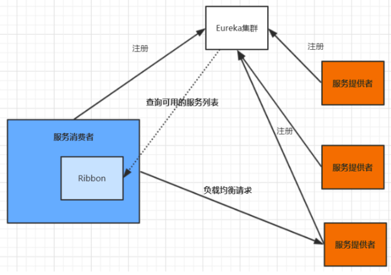
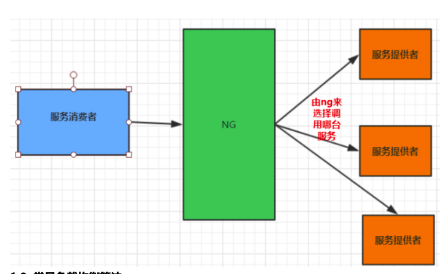
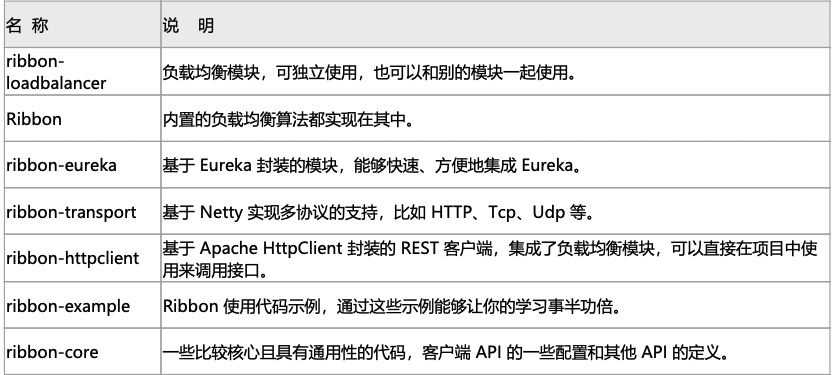
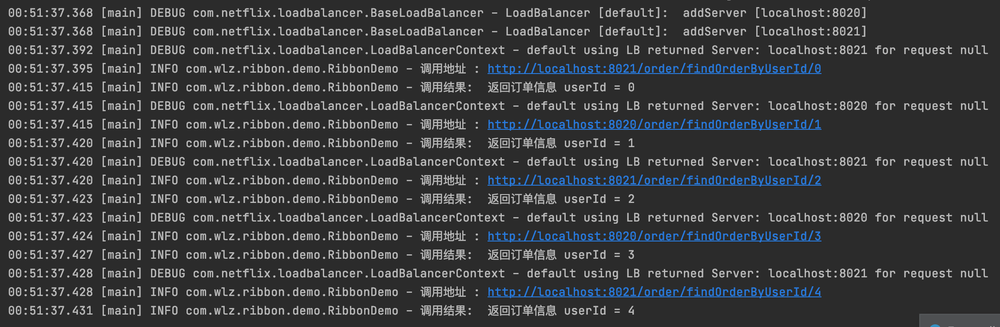
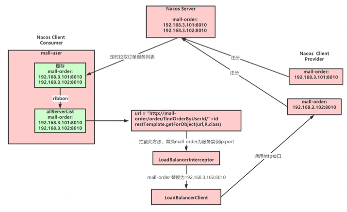
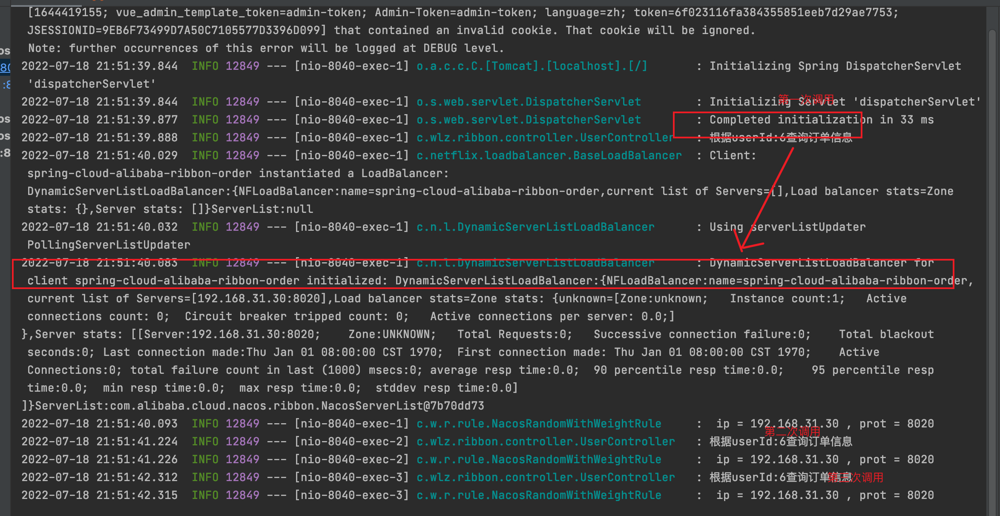
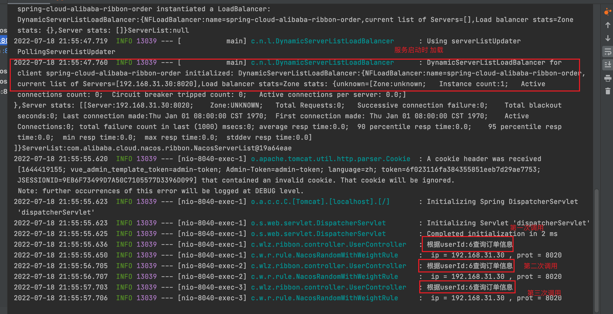
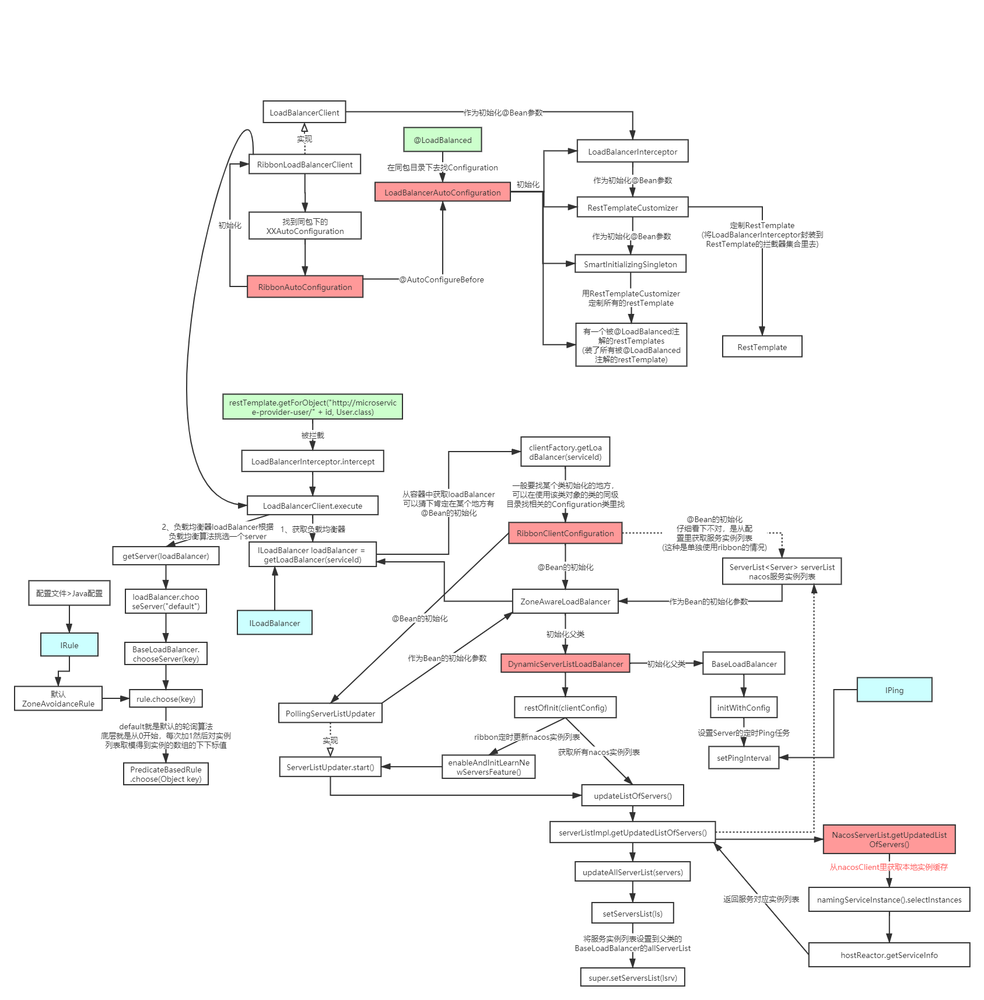

## 1. Ribbon

### 1.1 什么是 Ribbon

   目前主流的负载方案分为以下两种:

    1. 集中式负载均衡，在消费者和服务提供方中间使用独立的代理方式进行负载，有硬件的(比如F5)，也有软件的(比如 Nginx)。 

    2. 客户端根据自己的请求情况做负载均衡，Ribbon 就属于客户端自己做负载均衡。

   Spring Cloud Ribbon是基于Netflix Ribbon 实现的一套客户端的负载均衡工具，Ribbon客户端组件提 供一系列的完善的配置，如超时，重试等。通过Load Balancer获取到服务提供的所有机器实例， 
   Ribbon会自动基于某种规则(轮询，随机)去调用这些服务。Ribbon也可以实现我们自己的负载均衡算法。
   
#### 1.1.1 客户端的负载均衡

   例如spring cloud中的ribbon，客户端会有一个服务器地址列表，在发送请求前通过负载均衡算法选择 一个服务器，然后进行访问，这是客户端负载均衡;即在客户端就进行负载均衡算法分配。



#### 1.1.2  服务端的负载均衡

   例如Nginx，通过Nginx进行负载均衡，先发送请求，然后通过负载均衡算法，在多个服务器之间选择一 个进行访问;即在服务器端再进行负载均衡算法分配。



#### 1.1.3 常见负载均衡算法

    1. 随机，通过随机选择服务进行执行，一般这种方式使用较少; 

    2. 轮训，负载均衡默认实现方式，请求来之后排队处理; 

    3. 加权轮训，通过对服务器性能的分型，给高配置，低负载的服务器分配更高的权重，均衡各个服务器的压力;

    4. 地址Hash，通过客户端请求的地址的HASH值取模映射进行服务器调度。

    5. 最小链接数，即使请求均衡了，压力不一定会均衡，最小连接数法就是根据服务器的情况，比如请求积压数等参数，将请求分配到当前压力最小的服务器上。

#### 1.1.4 Ribbon模块



#### 1.1.5 Ribbon 使用 

   编写一个客户端来调用接口

```java
package com.wlz.ribbon.demo;

import com.google.common.collect.Lists;
import com.netflix.loadbalancer.ILoadBalancer;
import com.netflix.loadbalancer.LoadBalancerBuilder;
import com.netflix.loadbalancer.Server;
import com.netflix.loadbalancer.reactive.LoadBalancerCommand;
import com.netflix.loadbalancer.reactive.ServerOperation;
import lombok.extern.slf4j.Slf4j;
import rx.Observable;

import java.io.InputStream;
import java.net.HttpURLConnection;
import java.net.MalformedURLException;
import java.net.URL;
import java.util.List;

/**
 * @author wlz
 * @date 2022-07-18  12:38 上午
 */
@Slf4j
public class RibbonDemo {

    public static void main(String[] args) {
        // 服务列表
        List<Server> serverList = Lists.newArrayList(
                new Server("localhost", 8020),
                new Server("localhost", 8021));
        // 构建负载实例
        ILoadBalancer loadBalancer = LoadBalancerBuilder.newBuilder()
                .buildFixedServerListLoadBalancer(serverList);

        for (int i = 0; i < 5; i++) {
            final Integer userId = i;
            String result = LoadBalancerCommand.<String>builder()
                    .withLoadBalancer(loadBalancer).build()
                    .submit(new ServerOperation<String>() {
                        @Override
                        public Observable<String> call(Server server) {
                            String addr = "http://" + server.getHost() + ":" +
                                    server.getPort() + "/order/findOrderByUserId/" + userId;
                            log.info("调用地址 : {} ", addr);
                            URL url = null;
                            try {
                                url = new URL(addr);
                                HttpURLConnection conn = (HttpURLConnection) url.openConnection();
                                conn.setRequestMethod("GET");
                                conn.connect();
                                InputStream in = conn.getInputStream();
                                byte[] data = new byte[in.available()];
                                in.read(data);
                                return Observable.just(new String(data));
                            } catch (Exception e) {
                                e.printStackTrace();
                            }
                            return null;
                        }
                    }).toBlocking().first();
            log.info("调用结果:  {}", result);
        }
    }
}

```

   这个例子主要演示了 Ribbon 如何去做负载操作，调用接口用的最底层的 HttpURLConnection。



### 1.2 Spring Cloud 快速整合 Ribbon

#### 1.2.1 引入依赖

```xml
 <!--添加ribbon的依赖-->
        <dependency>
            <groupId>org.springframework.cloud</groupId>
            <artifactId>spring-cloud-starter-netflix-ribbon</artifactId>
        </dependency>
```

   nacos-discovery依赖了ribbon，可以不用再引入ribbon依赖

#### 1.2.2 添加@LoadBalanced注解

```java
@Configuration
public class RestConfig {

    @Bean
    @LoadBalanced
    public RestTemplate restTemplate() {
        return new RestTemplate();
    }
}
```

#### 1.2.3 修改controller

```java
package com.wlz.ribbon.controller;

import lombok.extern.slf4j.Slf4j;
import org.springframework.beans.factory.annotation.Autowired;
import org.springframework.web.bind.annotation.PathVariable;
import org.springframework.web.bind.annotation.RequestMapping;
import org.springframework.web.bind.annotation.RestController;
import org.springframework.web.client.RestTemplate;

/**
 * @author wlz
 * @date 2022-07-17  10:53 下午
 */
@RestController
@RequestMapping("/user")
@Slf4j
public class UserController {

    @Autowired
    private RestTemplate restTemplate;

    @RequestMapping(value = "/findOrderByUserId/{id}")
    public String  findOrderByUserId(@PathVariable("id") Integer id) {
        log.info("根据userId:"+id+"查询订单信息");
        // RestTemplate调用
        /*String url = "http://localhost:8020/order/findOrderByUserId/"+id;
        String result = restTemplate.getForObject(url,String.class);*/

        // 添加@LoadBalanced调用, 如果不添加 会找不到
        String url = "http://spring-cloud-alibaba-ribbon-order/order/findOrderByUserId/"+id;
        String result = restTemplate.getForObject(url,String.class);
        return result;
    }
}
```


### 1.3 Ribbon 内核原理 

#### 1.3.1 Ribbon 原理 



##### 1.3.1.1 模拟 ribbon 实现 

```java
@RestController
@RequestMapping("/user")
@Slf4j
public class UserController {

    @Autowired
    private RestTemplate restTemplate;

    @Autowired
    private DiscoveryClient discoveryClient;

    @RequestMapping(value = "/findOrderByUserId/{id}")
    public String  findOrderByUserId(@PathVariable("id") Integer id) {
        log.info("根据userId:"+id+"查询订单信息");
        // RestTemplate调用
        /*String url = "http://localhost:8020/order/findOrderByUserId/"+id;
        String result = restTemplate.getForObject(url,String.class);*/

        // 添加@LoadBalanced调用, 如果不添加 会找不到
        /*String url = "http://spring-cloud-alibaba-ribbon-order/order/findOrderByUserId/"+id;
        String result = restTemplate.getForObject(url,String.class);
        return result;*/


        // 模拟 Ribbon 实现  需要 将 @LoadBalanced 注释调，不然 会报错
        String url = getUri("spring-cloud-alibaba-ribbon-order")+"/order/findOrderByUserId/"+id;
        String result = restTemplate.getForObject(url, String.class);
        return result;
    }


    public String getUri(String serviceName) {
        List<ServiceInstance> instances = discoveryClient.getInstances(serviceName);
        if (instances == null || instances.isEmpty()) {
            return null;
        }
        int serviceSize = instances.size();
        int indexServer = incrementAndGetModulo(serviceSize);
        return instances.get(indexServer).getUri().toString();
    }


    private AtomicInteger nextIndex = new AtomicInteger(0);

    private int incrementAndGetModulo(int modulo) {
        for (;;) {
            int current = nextIndex.get();
            int next = (current + 1) % modulo;
            if (nextIndex.compareAndSet(current,next) && current < modulo) {
                return current;
            }
        }
    }
    
}
```

##### 1.3.1.2  @LoadBalanced 注解原理
 
   自动配置类: org.springframework.cloud.client.loadbalancer.LoadBalancerAutoConfiguration

   @LoadBalanced利用@Qualifier作为restTemplates注入的筛选条件，筛选出具有负载均衡标识的 RestTemplate。
   
```java
@Qualifier
public @interface LoadBalanced {
}
```

```
public class LoadBalancerAutoConfiguration {

    @LoadBalanced
    @Autowired(required = false)
    private List<RestTemplate> restTemplates = Collections.emptyList();
}
```

   被@LoadBalanced注解的restTemplate会被定制，添加LoadBalancerInterceptor拦截器。
   
```java
   @Configuration(
        proxyBeanMethods = false
    )
    @ConditionalOnMissingClass({"org.springframework.retry.support.RetryTemplate"})
    static class LoadBalancerInterceptorConfig {
        LoadBalancerInterceptorConfig() {
        }

        @Bean
        public LoadBalancerInterceptor ribbonInterceptor(LoadBalancerClient loadBalancerClient, LoadBalancerRequestFactory requestFactory) {
            return new LoadBalancerInterceptor(loadBalancerClient, requestFactory);
        }

        @Bean
        @ConditionalOnMissingBean
        public RestTemplateCustomizer restTemplateCustomizer(final LoadBalancerInterceptor loadBalancerInterceptor) {
            return (restTemplate) -> {
                List<ClientHttpRequestInterceptor> list = new ArrayList(restTemplate.getInterceptors());
                list.add(loadBalancerInterceptor);
                // 添加 LoadBalancerInterceptor 拦截器 
                restTemplate.setInterceptors(list);
            };
        }
    }
```

##### 1.3.1.3 Ribbon相关接口

   参考: org.springframework.cloud.netflix.ribbon.RibbonClientConfiguration

      1. IClientConfig:Ribbon的客户端配置，默认采用DefaultClientConfigImpl实现。

      2. IRule:Ribbon的负载均衡策略，默认采用ZoneAvoidanceRule实现，该策略能够在多区域环境下选出 最佳区域的实例进行访问。

      3. IPing:Ribbon的实例检查策略，默认采用DummyPing实现，该检查策略是一个特殊的实现，实际上 它并不会检查实例是否可用，而是始终返回true，默认认为所有服务实例都是可用的。

      4. ServerList:服务实例清单的维护机制，默认采用ConfigurationBasedServerList实现

      5. ServerListFilter:服务实例清单过滤机制，默认采ZonePreferenceServerListFilter，该策略能够优先 过滤出与请求方处于同区域的服务实例。

      6. ILoadBalancer:负载均衡器，默认采用ZoneAwareLoadBalancer实现，它具备了区域感知的能力。

#### 1.3.2 Ribbon负载均衡策略 (算法)

   1. RandomRule: 随机选择一个Server。

   2. RetryRule: 对选定的负载均衡策略机上重试机制，在一个配置时间段内当选择Server不成 功，则一直尝试使用subRule的方式选择一个可用的server。

   3. RoundRobinRule: 轮询选择， 轮询index，选择index对应位置的Server。

   4. AvailabilityFilteringRule: 过滤掉一直连接失败的被标记为circuit tripped的后端Server，并 过滤掉那些高并发的后端Server或者使用一个AvailabilityPredicate来包含过滤server的逻辑，其 实就是检查status里记录的各个Server的运行状态。

   5. BestAvailableRule: 选择一个最小的并发请求的Server，逐个考察Server，如果Server被 tripped了，则跳过。

   6. WeightedResponseTimeRule: 根据响应时间加权，响应时间越长，权重越小，被选中的可 能性越低。

   7. ZoneAvoidanceRule: 默认的负载均衡策略，即复合判断Server所在区域的性能和 Server的可用性选择Server，在没有区域的环境下，类似于轮询(RandomRule)

   8. NacosRule: 同集群优先调用

##### 1.3.2.1 修改默认负载均衡策略

###### 1. 全局配置

   调用其他微服务，一律使用指定的负载均衡算法

```java
@Configuration
public class RibbonConfig {

    /**
     *  全局配置
     *  指定负载均衡策略
     * @return
     */
    @Bean
    public IRule ribbonRule() {
        // 指定使用Nacos提供的负载均衡策略（优先调用同一集群的实例，基于随机权重）
        return new NacosRule();
    }

}
```

```
spring:
  application:
    name: spring-cloud-alibaba-ribbon-order  #微服务名称

  #配置nacos注册中心地址
  cloud:
    nacos:
      discovery:
        server-addr: 127.0.0.1:8848
        cluster-name: SH
```

```
spring:
  application:
    name: spring-cloud-alibaba-ribbon-user  #微服务名称

  #配置nacos注册中心地址
  cloud:
    nacos:
      discovery:
        server-addr: 127.0.0.1:8848
        cluster-name: SH
```

###### 2. 局部配置 

   调用指定微服务提供的服务时，使用对应的负载均衡算法 修改application.yml

```
# 被调用的微服务名  当需要使用局部配置的时候推荐使用这种方式
spring-cloud-alibaba-ribbon-order:
  ribbon:
    #指定使用Nacos提供的负载均衡策略（优先调用同一集群的实例，基于随机&权重）
    NFLoadBalancerRuleClassName: com.alibaba.cloud.nacos.ribbon.NacosRule
```

##### 1.3.2.2 自定义负载均衡策略

   通过实现 IRule 接口可以自定义负载策略，主要的选择服务逻辑在 choose 方法中。

###### 1. 实现基于Nacos权重的负载均衡策略

````java
@Slf4j
public class NacosRandomWithWeightRule extends AbstractLoadBalancerRule {

    @Autowired
    private NacosDiscoveryProperties nacosDiscoveryProperties;

    @Override
    public void initWithNiwsConfig(IClientConfig iClientConfig) {

    }

    @Override
    public Server choose(Object o) {

        DynamicServerListLoadBalancer loadBalancer = (DynamicServerListLoadBalancer) getLoadBalancer();
        String serverName = loadBalancer.getName();
        NamingService namingService = nacosDiscoveryProperties.namingServiceInstance();

        try {
            Instance instance = namingService.selectOneHealthyInstance(serverName);
            log.info(" ip = {} , prot = {} ", instance.getIp(), instance.getPort() );
            return new NacosServer(instance);
        } catch (NacosException e) {
            e.printStackTrace();
        }

        return null;
    }
}
````

###### 2. 配置自定义的策略

   1. 局部配置:  修改application.yml

```
# 被调用的微服务名  当需要使用局部配置的时候推荐使用这种方式
spring-cloud-alibaba-ribbon-order:
  ribbon:
    # 自定义的负载均衡策略（基于随机&权重）
    NFLoadBalancerRuleClassName: com.wlz.ribbon.rule.NacosRandomWithWeightRule
```


   2. 全局配置: 

```java
@Configuration
public class RibbonConfig {

    /**
     *  全局配置
     *  指定负载均衡策略
     * @return
     */
    @Bean
    public IRule ribbonRule() {
        return new NacosRandomWithWeightRule();
    }

}
```

#### 1.3.3 饥饿加载 

   在进行服务调用的时候，如果网络情况不好，第一次调用会超时。

   Ribbon默认懒加载，意味着只有在发起调用的时候才会创建客户端。




   开启饥饿加载，解决第一次调用慢的问题  
   
```
ribbon:
  eager-load:
    # 开启ribbon饥饿加载
    enabled: true
    # 配置  spring-cloud-alibaba-ribbon-order 使用ribbon饥饿加载，多个使用逗号分隔
    clients: spring-cloud-alibaba-ribbon-order
```




   源码对应属性配置类:RibbonEagerLoadProperties

```java
package org.springframework.cloud.netflix.ribbon;

import java.util.List;
import org.springframework.boot.context.properties.ConfigurationProperties;

@ConfigurationProperties(
    prefix = "ribbon.eager-load"
)
public class RibbonEagerLoadProperties {
    private boolean enabled = false; // 默认懒加载 
    private List<String> clients;

    public RibbonEagerLoadProperties() {
    }

    public boolean isEnabled() {
        return this.enabled;
    }

    public void setEnabled(boolean enabled) {
        this.enabled = enabled;
    }

    public List<String> getClients() {
        return this.clients;
    }

    public void setClients(List<String> clients) {
        this.clients = clients;
    }
}
```

#### 1.3.4 Ribbon 源码分析



## 2. LoadBalancer (Spring Cloud LoadBalancer)

### 2.1 什么是Spring Cloud LoadBalancer

   Spring Cloud LoadBalancer是Spring Cloud官方自己提供的客户端负载均衡器, 用来替代Ribbon。

   Spring官方提供了两种负载均衡的客户端:

      1. RestTemplate是Spring提供的用于访问Rest服务的客户端，RestTemplate提供了多种便捷访问 远程Http服务的方法，能够大大提高客户端的编写效率。默认情况下，
      RestTemplate默认依赖 jdk的HTTP连接工具。

      2. WebClient是从Spring WebFlux 5.0版本开始提供的一个非阻塞的基于响应式编程的进行Http请 求的客户端工具。它的响应式编程的基于Reactor的。
      WebClient中提供了标准Http请求方式对 应的get、post、put、delete等方法，可以用来发起相应的请求。

### 2.2 RestTemplate整合LoadBalancer

#### 2.2.1 引入依赖

```xml
 <dependencies>
        <!--    提供了RestTemplate支持    -->
        <dependency>
            <groupId>org.springframework.boot</groupId>
            <artifactId>spring-boot-starter-web</artifactId>
        </dependency>

        <!-- nacos服务注册与发现  移除ribbon支持 -->
        <dependency>
            <groupId>com.alibaba.cloud</groupId>
            <artifactId>spring-cloud-starter-alibaba-nacos-discovery</artifactId>
            <!--     nacos-discovery中引入了ribbon，需要移除ribbon的包 如果不移除，也可以在yml中配置不使用ribbon ,不建议移除  ribbon的包  -->
            <exclusions>
                <exclusion>
                    <groupId>org.springframework.cloud</groupId>
                    <artifactId>spring‐cloud‐starter‐netflix‐ribbon</artifactId>
                </exclusion>
            </exclusions>
        </dependency>

        <!-- LoadBalancer -->
        <dependency>
            <groupId>org.springframework.cloud</groupId>
            <artifactId>spring-cloud-starter-loadbalancer</artifactId>
        </dependency>
   
    </dependencies>
```

   nacos-discovery中引入了ribbon，需要移除ribbon的包 如果不移除，也可以在yml中配置不使用ribbon

```yaml
spring:
  application:
    name: spring-cloud-alibaba-loadBalancer-user  #微服务名称

  #配置nacos注册中心地址
  cloud:
    nacos:
      discovery:
        server-addr: 127.0.0.1:8848
    # 不使用 ribbon
    loadbalancer:
      ribbon:
        enabled: false
```

##### 2.2.1.1 原理  nacos-discovery中引入了ribbon，需要移除ribbon的包 如果不移除，也可以在yml中配置不使用ribbon

   默认情况下，如果同时拥有RibbonLoadBalancerClient和 BlockingLoadBalancerClient，为了保持向后兼容性，将使用RibbonLoadBalancerClient。要覆盖它，
   可以设置spring.cloud.loadbalancer.ribbon.enabled属性为false。

#### 2.2.2 使用@LoadBalanced注解配置RestTemplate

```java
@Configuration
public class RestConfig {

    @Bean
    @LoadBalanced
    public RestTemplate restTemplate() {
        return new RestTemplate();
    }
}
```

#### 2.2.3 使用

```java
@RestController
@RequestMapping("/user")
@Slf4j
public class UserController {

    @Autowired
    private RestTemplate restTemplate;

    @RequestMapping(value = "/findOrderByUserId/{id}")
    public String  findOrderByUserId(@PathVariable("id") Integer id) {
        log.info("根据userId:"+id+"查询订单信息" + "restTemplate");
        //  基于 restTemplate   添加@LoadBalanced调用, 如果不添加 会找不到
        String url = "http://spring-cloud-alibaba-loadBalancer-order/order/findOrderByUserId/"+id;
        String result = restTemplate.getForObject(url,String.class);
        return result;
    }
    
}
```


### 2.3 WebClient 整合 LoadBalancer

#### 2.3.1 引入依赖

```xml
    <dependencies>
        <!--    提供了RestTemplate支持    -->
        <dependency>
            <groupId>org.springframework.boot</groupId>
            <artifactId>spring-boot-starter-web</artifactId>
        </dependency>

        <!-- nacos服务注册与发现 -->
        <dependency>
            <groupId>com.alibaba.cloud</groupId>
            <artifactId>spring-cloud-starter-alibaba-nacos-discovery</artifactId>
<!--            <exclusions>-->
<!--                <exclusion>-->
<!--                    <groupId>org.springframework.cloud</groupId>-->
<!--                    <artifactId>spring‐cloud‐starter‐netflix‐ribbon</artifactId>-->
<!--                </exclusion>-->
<!--            </exclusions>-->
        </dependency>

        <!-- LoadBalancer -->
        <dependency>
            <groupId>org.springframework.cloud</groupId>
            <artifactId>spring-cloud-starter-loadbalancer</artifactId>
        </dependency>

        <!--    webflux    -->
        <dependency>
            <groupId>org.springframework.boot</groupId>
            <artifactId>spring-boot-starter-webflux</artifactId>
        </dependency>

    </dependencies>
```

#### 2.3.2 配置WebClient作为负载均衡器的client

```java
@Configuration
public class WebClientConfig {

    @Bean
    @LoadBalanced
    public WebClient.Builder webClientBuilder() {
        return WebClient.builder();
    }

    @Bean
    public WebClient webClient() {
        return webClientBuilder().build();
    }

}
```

#### 2.3.3 使用

```java
@RestController
@RequestMapping("/user")
@Slf4j
public class UserController {

    @Autowired
    private WebClient webClient;

    @RequestMapping(value = "/findOrderByUserId2/{id}")
    public Mono<String> findOrderByUserIdWithWebClient(@PathVariable("id") Integer id) {
        log.info("根据userId:"+id+"查询订单信息 " + "webClient");
        String url = "http://spring-cloud-alibaba-loadBalancer-order/order/findOrderByUserId/"+id;
        //基于WebClient
        Mono<String> result = webClient.get().uri(url)
                .retrieve().bodyToMono(String.class);
        return result;
    }
}
```

   原理: 底层会使用ReactiveLoadBalancer

#### 2.3.4 基于 WebClient + webFlux 

```java

```