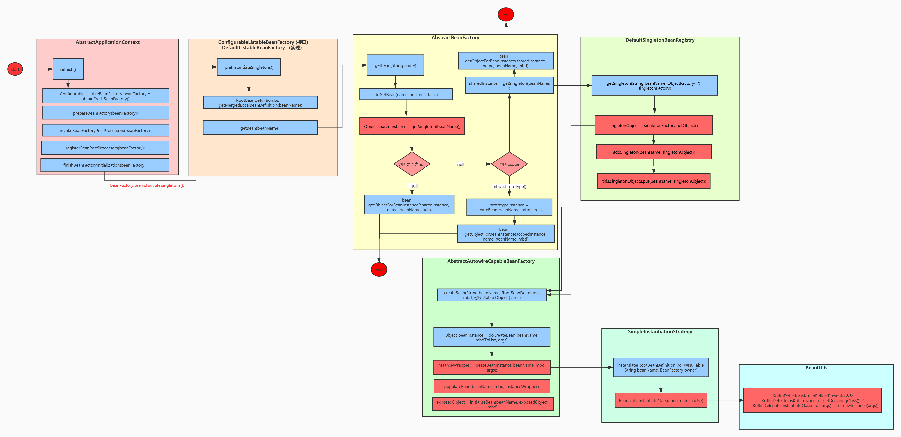
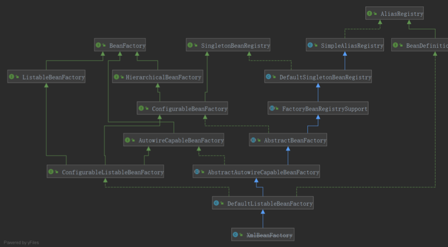

### 1. 原理图
 
  

### 2. bean的注册原理
  
 思考：==bean的属性是什么对象承载的？ bean是如何注册到容器中的？==

#### 2.1 BeanDefinition
   
   容器中的每一个 bean 都会有一个对应的 BeanDefinition 实例，该实例负责保存 bean 对象的所有必要信息，包括 bean 对象的 class 类型、是否是抽象类、构造方法和参数、其他属性等等
   
   

#### 2.2 BeanDefinitionRegistry
   
   BeanDefinition的注册器，抽象了 bean 的注册逻辑，包括registerBeanDefinition、removeBeanDefinition、getBeanDefinition 等注册管理 BeanDefinition 的方法。

#### 2.3 BeanFactory  

   bean工厂，抽象了 bean 的管理逻辑，主要包含 getBean、containBean、getType、getAliases 等管理 bean 的方法。

   

#### 2.4 DefaultListableBeanFactory
   
   Spring IoC的核心类， 即实现了BeanFactory  ，也实现了BeanDefinitionRegistry
```
# 注册BeanDefinition对象
public void registerBeanDefinition(String beanName, BeanDefinition beanDefinition)
			throws BeanDefinitionStoreException {}
# 注册bean对象
public void registerSingleton(String beanName, Object singletonObject) throws IllegalStateException {}
```
  xml Configuration demo
```
//创建一个简单注册器
//BeanDefinitionRegistry register = new SimpleBeanDefinitionRegistry();
//创建一个实现了注册器的工厂  
BeanDefinitionRegistry registry = new DefaultListableBeanFactory();
//创建bean定义读取器
BeanDefinitionReader reader = new XmlBeanDefinitionReader(register);
// 创建资源读取器
//DefaultResourceLoader resourceLoader = new DefaultResourceLoader();
// 获取资源
//Resource xmlResource = resourceLoader.getResource("spring.xml");
// 装载Bean的定义
//reader.loadBeanDefinitions(xmlResource);
reader.loadBeanDefinitions("spring.xml");
// 打印构建的Bean 名称
System.out.println(Arrays.toString(register.getBeanDefinitionNames());

// 工厂调用getBean方法
System.out.println(registry.getBean("user"));
```
  java Configuration  demo
```
AnnotationConfigApplicationContext context =
      new AnnotationConfigApplicationContext(AppConfig.class);

// 通过容器获取到beanFactory  即是工厂，又是注册器
DefaultListableBeanFactory factory = context.getDefaultListableBeanFactory();

RootBeanDefinition beanDefinition = new RootBeanDefinition(User.class);
factory.registerBeanDefinition("user",beanDefinition);

//beanDefinition.setAutowireMode(2);

// 填充属性
beanDefinition.getPropertyValues().add("name","user");
```

#### 2.5 动态注册bean

   ==思考：如何动态的将一个普通对象交给Spring管理？==

   1.BeanDefinitionRegistryPostProcessor
```
public interface BeanDefinitionRegistryPostProcessor extends BeanFactoryPostProcessor {

	void postProcessBeanDefinitionRegistry(BeanDefinitionRegistry registry) throws BeansException;

}
```
   2.ImportBeanDefinitionRegistrar
```
public interface ImportBeanDefinitionRegistrar {

	public void registerBeanDefinitions(
			AnnotationMetadata importingClassMetadata, BeanDefinitionRegistry registry);

}
```
   3.BeanFactoryPostProcessor
```
public interface BeanFactoryPostProcessor {

   void postProcessBeanFactory(ConfigurableListableBeanFactory beanFactory) throws BeansException;

}
```

### 3. IoC启动流程(加载过程)

#### 3.1 Spring框架总体结构

   Spring 最重要的概念是IOC 和AOP ,其中IOC 是Spring 中的根基。


#### 3.2 Spring 加载过程图解
   


#### 3.3 demo 

```java
@Configuration
@ComponentScan("com.wlz")
public class AppConfig {
}

@Component
public class A {

  @Autowired
  private B b;

//	public A(B b) {
//		this.b = b;
//	}

}

@Component
public class B {

  @Autowired
  private A a;

//	public B(A a) {
//		this.a = a;
//	}


}
public class IOCTest {
  @Test
  public void test() {

    // ioc容器
    AnnotationConfigApplicationContext context = new AnnotationConfigApplicationContext(AppConfig.class);
    String[] beanDefinitionNames = context.getBeanDefinitionNames();
    for (String beanDefinitionName : beanDefinitionNames) {
      System.out.println(beanDefinitionName);
    }

    DefaultListableBeanFactory defaultListableBeanFactory = context.getDefaultListableBeanFactory();

    A a = (A) defaultListableBeanFactory.getBean("a");
    System.out.println(a);
    
    
  }
}
```

#### 3.4 Spring IOC  容器加载过程 

##### 3.4.1 实例化容器
   
###### 3.4.1.1 基于 java 配置（在容器启动之前就创建beanFactory）: 

```
AnnotationConfigApplicationContext context =
      new AnnotationConfigApplicationContext(AppConfig.class);
```
 
    1. 这是一个有参构造方法，可以接收多个配置类，一般是一个。 
  
    2. 这个配置类由两种情况，一种是传统意义上带上@Configuration 注解的配置类，另一种是没有带上@Configuration ，但是
    带有 @Component、@Import 、@ImportResource、@Service @ComponentScan 等注解的配置类，Spring 中 前者称为 Full 配置类，
    后者称为Lite 配置类(或者普通bean类)。 其中 Full 配置类 会创建动态代理 使其变为一个代理类。

```
	//最常用的构造函数，将涉及到的配置类传递给该构造函数，以实现将相应配置类中的Bean自动注册到容器中
	public AnnotationConfigApplicationContext(Class<?>... annotatedClasses) {
		//调用父类构造方法
		//	1. 初始化bean定义读取器和扫描器;
		// 	2.调用父类GenericApplicationContext无参构造函数，初始化一个BeanFactory：DefaultListableBeanFactory
		// 	3.注册Spring自带的bean,共5个  包括: ConfigurationClassPostProcessor
		//  		AutowiredAnnotationBeanPostProcessor  CommonAnnotationBeanPostProcessor
		// EventListenerMethodProcessor  DefaultEventListenerFactory
		this();
		//  注册AppConfig, ApplicationContext传入的配置类
		register(annotatedClasses);
		refresh(); // 启动容器
	}
```
  this()方法  --> 会调用父类的无参构造器  及创建 reader 和 scaner 

```
public AnnotationConfigApplicationContext() {
      // 这里会隐式的调用父类的构造方法，初始化DefaultListableBeanFactory 

		// 初始化一个Bean 读取器  注册spring 自带的bean  5个 
		this.reader = new AnnotatedBeanDefinitionReader(this);
		// 初始化一个bean的扫描器 (仅仅是在外部手动调用.scan 方式时才有用) ClassPathBeanDefinitionScanner  扫描
		this.scanner = new ClassPathBeanDefinitionScanner(this);
	}
```

```
public GenericApplicationContext() {
   this.beanFactory = new DefaultListableBeanFactory();
}
```
   
###### 3.4.1.2  基于 xml 配置: 
```
ClassPathXmlApplicationContext context = new ClassPathXmlApplicationContext("Spring.xml");
```
```
	public ClassPathXmlApplicationContext(String configLocation) throws BeansException {
		// 调用重载的构造器
		this(new String[] {configLocation}, true, null);
	}
  
  ============================================================================   

   	public ClassPathXmlApplicationContext(
   			String[] configLocations, boolean refresh, @Nullable ApplicationContext parent)
   			throws BeansException {
   		// 设置bean 资源加载器 》 ResourceLoader
   		// 初始化 AbstractApplicationContext
   		super(parent);
   		//配置资源的位置,  String[] configLocations = {"spring.xml,"spring01.xml"}
   		setConfigLocations(configLocations);
   		//保证只会初始化一次
   		if (refresh) {
   			// 启动IOC 容器,AbstractApplicationContext.refresh()
   			refresh();
   		}
   	}   
```
  调refresh()后，即容器启动过程中创建beanFactory
```
// Tell the subclass to refresh the internal bean factory.
//告诉子类刷新内部bean工厂  创建BeanFactory
// 	获得刷新的beanFactory
// 	 对于AnnotationConfigApplicationContext，作用：
// 		1.调用org.springframework.context.support.GenericApplicationContext.refreshBeanFactory，
// 		   只是指定了SerializationId
// 		2.直接返回beanFactory(不用创建，容器中已存在)
//   对于ClassPathXmlApplicationContext，作用：
// 		1.调用AbstractRefreshableApplicationContext.refreshBeanFactory() 执行实际刷新
// 		2.如果存在beanFactory ，先销毁单例bean，关闭beanFactory，再创建beanFactory
// 		3.注册传入的spring的xml配置文件中配置的bean，注册到beanFactory
// 		4.将beanFactory赋值给容器，返回beanFactory
ConfigurableListableBeanFactory beanFactory = obtainFreshBeanFactory();

> refreshBeanFactory(); // AbstractApplicationContext#refreshBeanFactory
```
   先创建DefaultListableBeanFactory实例，然后 解析xml配置文件，注册bean到beanFactory，最后再将beanFactory赋值给容器
```
DefaultListableBeanFactory beanFactory = createBeanFactory();
beanFactory.setSerializationId(getId());
// 定制beanFactory，设置参数
customizeBeanFactory(beanFactory);
// 注册spring的xml配置的bean到beanFactory，此时容器还未指定beanbeanFactory
loadBeanDefinitions(beanFactory);
// 给容器指定beanFactory
synchronized (this.beanFactoryMonitor) {
   this.beanFactory = beanFactory;
}
```

##### 3.4.2 实例化工厂 

   容器底层用 DefaultListableBeanFactory，即实现了BeanDefinitionRegistry，又实现了BeanFactory

   DefaultListableBeanFactory 关系图



```
java 

public GenericApplicationContext() {
   this.beanFactory = new DefaultListableBeanFactory();
}

xml 

DefaultListableBeanFactory beanFactory = createBeanFactory();
```

##### 3.4.3 实例化 BeanDefinition 读取器 AnnotatedBeanDefinitionReader

  主要做了两件事： 
  
    1. 注册内置的 BeanPostProcessor  BeanFactoryPostProcessor 
    2. 注册相关的BeanDefinition 


  主要注册了5个自带的内置类： 

    ConfigurationClassPostProcessor、AutowiredAnnotationBeanPostProcessor、CommonAnnotationBeanPostProcessor、
    （EventListenerMethodProcessor、DefaultEventListenerFactory）
 

  ConfigurationClassPostProcessor实现BeanDefinitionRegistryPostProcessor接口，
   
  BeanDefinitionRegistryPostProcessor接口又扩展了BeanFactoryPostProcessor接口，
  
  BeanFactoryPostProcessor是Spring的扩展点之一
   
  ConfigurationClassPostProcessor是Spring极 为重要的一个类，必须牢牢的记住上面所说的这个类和它的继承关系。

###### 3.4.4 创建BeanDefinition 扫描器 ClassPathBeanDefinitionScanner

   由于常规使用方式是不会用到AnnotationConfigApplicationContext里面的scanner的，
   这里的scanner 仅仅是为了程序员可以手动调用AnnotationConfigApplicationContext对象的scan方法。 
   所以这里就分析 scanner是如何被实例化的了。

##### 3.4.5 注册配置类为BeanDefinition (register(annotatedClasses))

```
//  注册AppConfig, ApplicationContext传入的配置类
register(annotatedClasses);

```

  最终会调用下面方法: 

```	
<T> void doRegisterBean(Class<T> annotatedClass, @Nullable Supplier<T> instanceSupplier, @Nullable String name,
			@Nullable Class<? extends Annotation>[] qualifiers, BeanDefinitionCustomizer... definitionCustomizers) {

		//1. 根据指定的注解Bean定义类(annotatedClass) ，创建Spring容器中对注解Bean的封装的数据结构
		AnnotatedGenericBeanDefinition abd = new AnnotatedGenericBeanDefinition(annotatedClass);
		
		// 判断是否需要跳过注解，Spring 中有一个@Condition 注解，当条件不满足时，这个bean 不会被解析
		if (this.conditionEvaluator.shouldSkip(abd.getMetadata())) {
			return;
		}

		abd.setInstanceSupplier(instanceSupplier);
		//3. 解析注解Bean定义 的作用域，获取scope的值。若@Scope("prototype")，则Bean为原型类型；若@Scope("singleton")，则Bean为单态类型
		ScopeMetadata scopeMetadata = this.scopeMetadataResolver.resolveScopeMetadata(abd);
		//为注解Bean定义 设置作用域
		abd.setScope(scopeMetadata.getScopeName());
		//4. 为注解Bean定义 生成Bean名称
		String beanName = (name != null ? name : this.beanNameGenerator.generateBeanName(abd, this.registry));

		//5. 处理注解Bean定义中的通用注解
		AnnotationConfigUtils.processCommonDefinitionAnnotations(abd);
		//6. 如果在向容器注册 注解Bean定义【AnnotatedBeanDefinition】时，使用了额外的限定符注解，则解析限定符注解。
		if (qualifiers != null) {
			// 主要是配置 关于autowiring自动依赖注入装配的限定条件，即@Qualifier注解
			// Spring自动依赖注入装配默认是按类型装配，如果使用@Qualifier则按名称
			for (Class<? extends Annotation> qualifier : qualifiers) {
				//如果配置了@Primary注解，设置该Bean为autowiring自动依赖注入装//配时的首选
				if (Primary.class == qualifier) {
					abd.setPrimary(true);
				}
				//如果配置了@Lazy注解，则设置该Bean为非延迟初始化，如果没有配置，//则该Bean为预实例化
				else if (Lazy.class == qualifier) {
					abd.setLazyInit(true);
				}
				//如果使用了除@Primary和@Lazy以外的其他注解，则为该Bean添加一个autowiring自动依赖注入装配限定符，
				// 该Bean在进autowiring自动依赖注入装配时，根据名称装配限定符指定的Bean
				else {
					abd.addQualifier(new AutowireCandidateQualifier(qualifier));
				}
			}
		}
		for (BeanDefinitionCustomizer customizer : definitionCustomizers) {
			customizer.customize(abd);
		}

		//7. 创建一个指定Bean名称的Bean定义对象BeanDefinitionHolder ，封装注解Bean定义类数据
		BeanDefinitionHolder definitionHolder = new BeanDefinitionHolder(abd, beanName);

		//AnnotationConfigUtils根据注解Bean定义类中配置的作用域为其应用相应的代理策略
		//根据 注解Bean定义类 中配置的作用域，创建相应的代理对象
		definitionHolder = AnnotationConfigUtils.applyScopedProxyMode(scopeMetadata, definitionHolder, this.registry);

		// 8. 向IOC容器注册 注解Bean类定义对象bd
		//主要是校验Bean定义，然后将Bean添加到容器中一个管理Bean定义的HashMap中
		BeanDefinitionReaderUtils.registerBeanDefinition(definitionHolder, this.registry);
	}
```

##### 3.4.6 refresh() 方法 

  看到其实到这里，Spring还没有进行扫描，只是实例化了一个工厂，注册了一些内置的Bean和我 们传进去的配置类，真正的大头是在第三行代码:

```
refresh(); // 启动容器
```

```
	public void refresh() throws BeansException, IllegalStateException {
		synchronized (this.startupShutdownMonitor) {
			// Prepare this context for refreshing.
			// 准备此上下文以进行刷新。(就是保存了容器的启动时间，启动标志等)
			prepareRefresh();

			// Tell the subclass to refresh the internal bean factory.
			//告诉子类刷新内部bean工厂  创建BeanFactory
			// 	获得刷新的beanFactory
			// 	 对于AnnotationConfigApplicationContext，作用：
			// 		1.调用org.springframework.context.support.GenericApplicationContext.refreshBeanFactory，
			// 		   只是指定了SerializationId
			// 		2.直接返回beanFactory(不用创建，容器中已存在)
			//   对于ClassPathXmlApplicationContext，作用：
			// 		1.调用AbstractRefreshableApplicationContext.refreshBeanFactory() 执行实际刷新
			// 		2.如果存在beanFactory ，先销毁单例bean，关闭beanFactory，再创建beanFactory
			// 		3.注册传入的spring的xml配置文件中配置的bean，注册到beanFactory
			// 		4.将beanFactory赋值给容器，返回beanFactory
			ConfigurableListableBeanFactory beanFactory = obtainFreshBeanFactory();

			// Prepare the bean factory for use in this context. 准备在这种情况下使用的bean工厂
			// 准备bean工厂： 指定beanFactory的类加载器， 添加后置处理器，注册缺省环境bean等
			// beanFactory添加了2个后置处理器 ApplicationContextAwareProcessor, ApplicationListenerDetector (new )
			prepareBeanFactory(beanFactory);

			try {
				// Allows post-processing of the bean factory in context subclasses.
				//允许在上下文子类中对bean工厂进行后处理  完成了扫描
				// 比如 AbstractRefreshableWebApplicationContext.postProcessBeanFactory
				postProcessBeanFactory(beanFactory);

				// Invoke factory processors registered as beans in the context.
				//调用工厂处理器 注册bean  完成扫描  代理
				// 1.通过beanFactory.getBean(ppName, BeanDefinitionRegistryPostProcessor.class)
				//   	拿到ConfigurationClassPostProcessor
				// 2.通过ConfigurationClassPostProcessor.postProcessBeanDefinitionRegistry，注册所有注解配置的bean
				// 	注册的顺序： @ComponentScan>实现ImportSelector>方法bean>@ImportResource("spring.xml")
				//  	> 实现 ImportBeanDefinitionRegistrar  (相对的顺序，都在同一个配置类上配置)
				// 3. 调用ConfigurationClassPostProcessor#postProcessBeanFactory
				//  	增强@Configuration修饰的配置类  AppConfig--->AppConfig$$EnhancerBySpringCGLIB
				// 		(可以处理内部方法bean之间的调用，防止多例)
				//  	添加了后置处理器 ConfigurationClassPostProcessor.ImportAwareBeanPostProcessor (new)
				invokeBeanFactoryPostProcessors(beanFactory);

				// Register bean processors that intercept bean creation.
				// 注册拦截bean创建的后置处理器：
				// 1.添加Spring自身的：  BeanPostProcessorChecker （new）  以及注册了beanDefinition的两个
				//  	CommonAnnotationBeanPostProcessor AutowiredAnnotationBeanPostProcessor
				//  	重新添加ApplicationListenerDetector(new ) ，删除旧的，移到处理器链末尾
				// 2.用户自定义的后置处理器
				// 注册了beanDefinition的会通过 beanFactory.getBean(ppName, BeanPostProcessor.class) 获取后置处理器

				registerBeanPostProcessors(beanFactory);

				// Initialize message source for this context.
				initMessageSource();

				// Initialize event multicaster for this context.
				// 初始化事件多播器
				initApplicationEventMulticaster();

				// Initialize other special beans in specific context subclasses.
				// 空方法
				onRefresh();

				// Check for listener beans and register them.
				registerListeners();

				// 在创建BeanFactory的过程中，BeanDefinition注册到了BeanFactory中的一个ConCurretHashMap对象中
				// 以BeanName为key，BeanDefinition为value
				// Instantiate all remaining (non-lazy-init) singletons. 实例化所有剩余的（非延迟初始化）单例。
				// 实例化所有剩余的(非懒加载)单例。
				finishBeanFactoryInitialization(beanFactory);

				// Last step: publish corresponding event.  最后一步：发布相应的事件。
				finishRefresh();
			}

			catch (BeansException ex) {
				if (logger.isWarnEnabled()) {
					logger.warn("Exception encountered during context initialization - " +
							"cancelling refresh attempt: " + ex);
				}

				// Destroy already created singletons to avoid dangling resources.
				// 销毁以创建的Bean
				destroyBeans();

				// Reset 'active' flag.
				//取消refresh操作，重置容器的同步标识
				cancelRefresh(ex);

				// Propagate exception to caller.
				throw ex;
			}

			finally {
				// Reset common introspection caches in Spring's core, since we
				// might not ever need metadata for singleton beans anymore...
				resetCommonCaches();
			}
		}
	}

```

##### 3.4.7  调用工厂后置处理器 注册bean 完成扫描 invokeBeanFactoryPostProcessors(beanFactory)

```
	public static void invokeBeanFactoryPostProcessors(
			ConfigurableListableBeanFactory beanFactory, List<BeanFactoryPostProcessor> beanFactoryPostProcessors) {

		// Invoke BeanDefinitionRegistryPostProcessors first, if any.
		Set<String> processedBeans = new HashSet<>();

		if (beanFactory instanceof BeanDefinitionRegistry) {
			BeanDefinitionRegistry registry = (BeanDefinitionRegistry) beanFactory;
			// 普通的BeanFactoryPostProcessor列表
			List<BeanFactoryPostProcessor> regularPostProcessors = new ArrayList<>();
			// BeanDefinitionRegistryPostProcessor列表
			List<BeanDefinitionRegistryPostProcessor> registryProcessors = new ArrayList<>();
			// 调用beanFactory的后置处理器 BeanDefinitionRegistryPostProcessor
			// 用户可以实现BeanDefinitionRegistryPostProcessor#postProcessBeanDefinitionRegistry 注册bean
			for (BeanFactoryPostProcessor postProcessor : beanFactoryPostProcessors) {
				if (postProcessor instanceof BeanDefinitionRegistryPostProcessor) {
					BeanDefinitionRegistryPostProcessor registryProcessor =
							(BeanDefinitionRegistryPostProcessor) postProcessor;
					registryProcessor.postProcessBeanDefinitionRegistry(registry);
					registryProcessors.add(registryProcessor);
				}
				else {
					// 用户实现了BeanFactoryPostProcessor 但没有实现BeanDefinitionRegistryPostProcessor
					regularPostProcessors.add(postProcessor);
				}
			}

			// Do not initialize FactoryBeans here: We need to leave all regular beans
			// uninitialized to let the bean factory post-processors apply to them!
			// Separate between BeanDefinitionRegistryPostProcessors that implement
			// PriorityOrdered, Ordered, and the rest.
			// 保存本次要执行的BeanDefinitionRegistryPostProcessor
			List<BeanDefinitionRegistryPostProcessor> currentRegistryProcessors = new ArrayList<>();

			// First, invoke the BeanDefinitionRegistryPostProcessors that implement PriorityOrdered.
			// 去容器中查询是否有实现了PriorityOrdered接口的BeanDefinitionRegistryPostProcessor
			String[] postProcessorNames =
					beanFactory.getBeanNamesForType(BeanDefinitionRegistryPostProcessor.class, true, false);
			for (String ppName : postProcessorNames) {
				//判断是否实现了PriorityOrdered
				if (beanFactory.isTypeMatch(ppName, PriorityOrdered.class)) {
					// 获取 ConfigurationClassPostProcessor 实现了BeanDefinitionRegistryPostProcessor
					currentRegistryProcessors.add(beanFactory.getBean(ppName, BeanDefinitionRegistryPostProcessor.class));
					processedBeans.add(ppName);
				}
			}
			sortPostProcessors(currentRegistryProcessors, beanFactory);
			registryProcessors.addAll(currentRegistryProcessors);
			// 会调用ConfigurationClassPostProcessor#postProcessBeanDefinitionRegistry 解析注解，注册bean
			// 设置Configuration配置类属性是full还是lite
			invokeBeanDefinitionRegistryPostProcessors(currentRegistryProcessors, registry);
			currentRegistryProcessors.clear();

			// Next, invoke the BeanDefinitionRegistryPostProcessors that implement Ordered.
			// 去容器中查询是否有实现了Ordered接口的BeanDefinitionRegistryPostProcessor
			postProcessorNames = beanFactory.getBeanNamesForType(BeanDefinitionRegistryPostProcessor.class, true, false);
			for (String ppName : postProcessorNames) {
				// 排除被处理过的，并且实现了Ordered接口的
				if (!processedBeans.contains(ppName) && beanFactory.isTypeMatch(ppName, Ordered.class)) {
					currentRegistryProcessors.add(beanFactory.getBean(ppName, BeanDefinitionRegistryPostProcessor.class));
					processedBeans.add(ppName);
				}
			}
			sortPostProcessors(currentRegistryProcessors, beanFactory);
			registryProcessors.addAll(currentRegistryProcessors);
			invokeBeanDefinitionRegistryPostProcessors(currentRegistryProcessors, registry);
			currentRegistryProcessors.clear();

			// Finally, invoke all other BeanDefinitionRegistryPostProcessors until no further ones appear.
			// 去容器中查询是否有排除实现PriorityOrdered和Ordered后的其他的BeanDefinitionRegistryPostProcessor
			boolean reiterate = true;
			while (reiterate) {
				reiterate = false;
				postProcessorNames = beanFactory.getBeanNamesForType(BeanDefinitionRegistryPostProcessor.class, true, false);
				for (String ppName : postProcessorNames) {
					if (!processedBeans.contains(ppName)) {
						currentRegistryProcessors.add(beanFactory.getBean(ppName, BeanDefinitionRegistryPostProcessor.class));
						processedBeans.add(ppName);
						reiterate = true;
					}
				}
				sortPostProcessors(currentRegistryProcessors, beanFactory);
				registryProcessors.addAll(currentRegistryProcessors);
				invokeBeanDefinitionRegistryPostProcessors(currentRegistryProcessors, registry);
				currentRegistryProcessors.clear();
			}

			// Now, invoke the postProcessBeanFactory callback of all processors handled so far.
			//CGLib代理
			// 调用ConfigurationClassPostProcessor#postProcessBeanFactory
			// 1. 增强@Configuration修饰的配置类    AppConfig--->AppConfig$$EnhancerBySpringCGLIB
			// 2. 添加了后置处理器 ConfigurationClassPostProcessor.ImportAwareBeanPostProcessor
			// 调用用户自定义实现的BeanDefinitionRegistryPostProcessor#postProcessBeanFactory
			invokeBeanFactoryPostProcessors(registryProcessors, beanFactory);

			// 调用用户自定义实现BeanFactoryPostProcessor 但没有实现BeanDefinitionRegistryPostProcessor
			// 的后置处理器的postProcessBeanFactory方法
			invokeBeanFactoryPostProcessors(regularPostProcessors, beanFactory);
		}

		else {
			// Invoke factory processors registered with the context instance.
			// 调用用上下文实例注册的工厂处理器  beanFactory没有实现BeanDefinitionRegistry
			invokeBeanFactoryPostProcessors(beanFactoryPostProcessors, beanFactory);
		}

		// Do not initialize FactoryBeans here: We need to leave all regular beans
		// uninitialized to let the bean factory post-processors apply to them!
		// 去容器中查询是否有实现BeanFactoryPostProcessor的后置处理器
		String[] postProcessorNames =
				beanFactory.getBeanNamesForType(BeanFactoryPostProcessor.class, true, false);

		// Separate between BeanFactoryPostProcessors that implement PriorityOrdered,
		// Ordered, and the rest.
		// 实现 PriorityOrdered
		List<BeanFactoryPostProcessor> priorityOrderedPostProcessors = new ArrayList<>();
		// 实现 Ordered
		List<String> orderedPostProcessorNames = new ArrayList<>();
		// 剩下的
		List<String> nonOrderedPostProcessorNames = new ArrayList<>();
		for (String ppName : postProcessorNames) {
			if (processedBeans.contains(ppName)) {
				// skip - already processed in first phase above
			}
			else if (beanFactory.isTypeMatch(ppName, PriorityOrdered.class)) {
				priorityOrderedPostProcessors.add(beanFactory.getBean(ppName, BeanFactoryPostProcessor.class));
			}
			else if (beanFactory.isTypeMatch(ppName, Ordered.class)) {
				orderedPostProcessorNames.add(ppName);
			}
			else {
				nonOrderedPostProcessorNames.add(ppName);
			}
		}

		// First, invoke the BeanFactoryPostProcessors that implement PriorityOrdered.
		sortPostProcessors(priorityOrderedPostProcessors, beanFactory);
		//调用实现了PriorityOrdered的BeanFactoryPostProcessor#postProcessBeanFactory
		invokeBeanFactoryPostProcessors(priorityOrderedPostProcessors, beanFactory);

		// Next, invoke the BeanFactoryPostProcessors that implement Ordered.
		List<BeanFactoryPostProcessor> orderedPostProcessors = new ArrayList<>();
		for (String postProcessorName : orderedPostProcessorNames) {
			orderedPostProcessors.add(beanFactory.getBean(postProcessorName, BeanFactoryPostProcessor.class));
		}
		sortPostProcessors(orderedPostProcessors, beanFactory);
		invokeBeanFactoryPostProcessors(orderedPostProcessors, beanFactory);

		// Finally, invoke all other BeanFactoryPostProcessors.
		List<BeanFactoryPostProcessor> nonOrderedPostProcessors = new ArrayList<>();
		for (String postProcessorName : nonOrderedPostProcessorNames) {
			nonOrderedPostProcessors.add(beanFactory.getBean(postProcessorName, BeanFactoryPostProcessor.class));
		}
		//调用剩下的BeanFactoryPostProcessor#postProcessBeanFactory
		invokeBeanFactoryPostProcessors(nonOrderedPostProcessors, beanFactory);

		// Clear cached merged bean definitions since the post-processors might have
		// modified the original metadata, e.g. replacing placeholders in values...
		beanFactory.clearMetadataCache();
	}

```

##### 3.4.8 实例化 bean  finishBeanFactoryInitialization(beanFactory)

```
// 实例化所有剩余的(非懒加载)单例。
finishBeanFactoryInitialization(beanFactory);
```

 最终会调用下面方法 

```
public void preInstantiateSingletons() throws BeansException {
		if (logger.isTraceEnabled()) {
			logger.trace("Pre-instantiating singletons in " + this);
		}

		// Iterate over a copy to allow for init methods which in turn register new bean definitions.
		// While this may not be part of the regular factory bootstrap, it does otherwise work fine.
		List<String> beanNames = new ArrayList<>(this.beanDefinitionNames);

		/**
		 下面遍历beanDefinitionNames这个list对象中的BeanName，循环调用getBean(beanName)方法
		 该方法实际上就是创建Bean并递归构建Bean间的依赖关系，
		 getBean(beanName)方法最终会调用doGetBean(name,null,null,false)
		 *
		 */
		// Trigger initialization of all non-lazy singleton beans...
		for (String beanName : beanNames) {
			RootBeanDefinition bd = getMergedLocalBeanDefinition(beanName);
			// 判断不是抽象 是单例 不是懒加载 就进入
			if (!bd.isAbstract() && bd.isSingleton() && !bd.isLazyInit()) {
				// 判断是否是factoryBean 是的话就将最前面的& 截掉
				if (isFactoryBean(beanName)) {
					// 拼接&
					Object bean = getBean(FACTORY_BEAN_PREFIX + beanName);
					if (bean instanceof FactoryBean) {
						final FactoryBean<?> factory = (FactoryBean<?>) bean;
						boolean isEagerInit;
						if (System.getSecurityManager() != null && factory instanceof SmartFactoryBean) {
							isEagerInit = AccessController.doPrivileged((PrivilegedAction<Boolean>)
											((SmartFactoryBean<?>) factory)::isEagerInit,
									getAccessControlContext());
						}
						else {
							isEagerInit = (factory instanceof SmartFactoryBean &&
									((SmartFactoryBean<?>) factory).isEagerInit());
						}
						if (isEagerInit) {
							getBean(beanName);
						}
					}
				}
				else {
					getBean(beanName);
				}
			}
		}

		// Trigger post-initialization callback for all applicable beans...
		// 所有的bean初始化完成之后回调    实现SmartInitializingSingleton#afterSingletonsInstantiated
		for (String beanName : beanNames) {
			Object singletonInstance = getSingleton(beanName);
			if (singletonInstance instanceof SmartInitializingSingleton) {
				final SmartInitializingSingleton smartSingleton = (SmartInitializingSingleton) singletonInstance;
				if (System.getSecurityManager() != null) {
					AccessController.doPrivileged((PrivilegedAction<Object>) () -> {
						smartSingleton.afterSingletonsInstantiated();
						return null;
					}, getAccessControlContext());
				}
				else {
					smartSingleton.afterSingletonsInstantiated();
				}
			}
		}
	}
```


##### 3.4.8 创建 bean  doGetBean()  ，包括单例bean 多例bean 等其他bean 

```
	protected <T> T doGetBean(final String name, @Nullable final Class<T> requiredType,
			@Nullable final Object[] args, boolean typeCheckOnly) throws BeansException {

		//根据指定的名称获取被管理Bean的名称，剥离指定名称中对容器的相关依赖
		//如果指定的是别名，将别名 转换为规范的Bean名称
		// 	1.带&前缀的去掉前缀
		// 	2.从aliasMap中找name对应id，bean没有配id就用name
		final String beanName = transformedBeanName(name);
		Object bean;

		// Eagerly check singleton cache for manually registered singletons.
		//先从单例对象池(缓存)（singletonObjects）中取是否已经有被创建过的单态类型的Bean
		//对于单例模式的Bean整个IOC容器中只创建一次，不需要重复创建,没有就去创建
		//处理循环依赖的问题,比如A->B，B->A
		//	1、getBean(A),获取到A的实例，此时还未进行注入
		//	2、开始注入，发现B属性，开始getBean(B)，获取到B的实例
		//	3、开始对B注入，发现A属性，获取到还未注入完成的A，即处于isSingletonCurrentlyInCreation的A
		//	4、完成B的注入，getBean(B)完成，然后A的注入也完成，也就是在构建单例的时候，
		// 	会将还未完成注入的A提前暴露，便于B完成注入
		Object sharedInstance = getSingleton(beanName);
		//IOC容器创建单例模式Bean实例对象
		if (sharedInstance != null && args == null) {
			//如果指定名称的Bean在容器中已有单例模式的Bean被创建
			//直接返回已经创建的Bean
			if (logger.isTraceEnabled()) {
				if (isSingletonCurrentlyInCreation(beanName)) {
					logger.trace("Returning eagerly cached instance of singleton bean '" + beanName +
							"' that is not fully initialized yet - a consequence of a circular reference");
				}
				else {
					logger.trace("Returning cached instance of singleton bean '" + beanName + "'");
				}
			}
			//获取给定Bean的实例对象，主要是完成FactoryBean的相关处理
			// 如果name 是以&开头，返回的是FactoryBean Bean 实例，如果不是以&开头，返回的是 FactoryBean 的getObject() 方法实现的对象
			//注意：BeanFactory是管理容器中Bean的工厂，而FactoryBean是创建创建对象的工厂Bean，两者之间有区别
			bean = getObjectForBeanInstance(sharedInstance, name, beanName, null);
		}
		// 缓存没有 创建Bean
		else {
			// Fail if we're already creating this bean instance:
			// We're assumably within a circular reference.
			//缓存没有  正在创建的单例模式Bean
			//缓存中已经有创建的原型模式Bean
			//但是由于循环引用的问题导致实例化对象失败
			// 如果作为原型模式的bean正在被创建则抛异常  原型模式不支持循环依赖
			if (isPrototypeCurrentlyInCreation(beanName)) {
				throw new BeanCurrentlyInCreationException(beanName);
			}

			// Check if bean definition exists in this factory.
			//对IOC容器中是否存在指定名称的BeanDefinition进行检查，首先检查是否
			//能在当前的BeanFactory中获取的所需要的Bean，如果不能则 委托当前容器
			//的父级容器去查找，如果还是找不到则沿着容器的继承体系向父级容器查找
			BeanFactory parentBeanFactory = getParentBeanFactory();

			//当前容器的父级容器存在，且当前容器中不存在指定名称的Bean
			if (parentBeanFactory != null && !containsBeanDefinition(beanName)) {
				// Not found -> check parent.
				//解析指定Bean名称的原始名称
				String nameToLookup = originalBeanName(name);
				if (parentBeanFactory instanceof AbstractBeanFactory) {
					return ((AbstractBeanFactory) parentBeanFactory).doGetBean(
							nameToLookup, requiredType, args, typeCheckOnly);
				}
				else if (args != null) {
					// Delegation to parent with explicit args.
					// 委派父级容器根据指定名称和显式的参数查找
					return (T) parentBeanFactory.getBean(nameToLookup, args);
				}
				else if (requiredType != null) {
					// No args -> delegate to standard getBean method.
					// 委派父级容器根据指定名称和类型查找
					return parentBeanFactory.getBean(nameToLookup, requiredType);
				}
				else {
					// 委派父级容器根据指定名称查找
					return (T) parentBeanFactory.getBean(nameToLookup);
				}
			}
			//创建的Bean是否需要进行类型验证，一般不需要
			if (!typeCheckOnly) {
				//向容器标记指定的Bean已经被创建
				markBeanAsCreated(beanName);
			}

			try {
				// 合并BeanDefinition bean定义，统一返回RootBeanDefinition
				//根据指定Bean名称获取其父级的Bean定义
				//主要解决Bean继承时子类合并父类公共属性问题
				// 返回 RootBeanDefinition
				// 读取XML配置信息的是GernericBeanDefinition,后续都是针对RootBeanDefinition的处理,
				// 因而转换.如果父类bean存在,则合并父类属性.
				final RootBeanDefinition mbd = getMergedLocalBeanDefinition(beanName);
				checkMergedBeanDefinition(mbd, beanName, args);

				/**
				 * 确保当前bean依赖的bean的初始化。
				 * 首先获取当前Bean依赖关系mbd.getDependsOn()
				 * 接着根据依赖的BeanName递归调用getBean()方法
				 * 直到调用getSingleton()返回依赖
				 */
				// Guarantee initialization of beans that the current bean depends on.
				String[] dependsOn = mbd.getDependsOn();
				if (dependsOn != null) {
					for (String dep : dependsOn) {
						if (isDependent(beanName, dep)) {
							throw new BeanCreationException(mbd.getResourceDescription(), beanName,
									"Circular depends-on relationship between '" + beanName + "' and '" + dep + "'");
						}
						registerDependentBean(dep, beanName);
						try {
							//递归调用getBean方法，获取当前Bean的依赖Bean
							getBean(dep);
						}
						catch (NoSuchBeanDefinitionException ex) {
							throw new BeanCreationException(mbd.getResourceDescription(), beanName,
									"'" + beanName + "' depends on missing bean '" + dep + "'", ex);
						}
					}
				}

				// Create bean instance.
				//创建单例模式Bean的实例对象
				if (mbd.isSingleton()) {
					//这里使用了一个匿名内部类，创建Bean实例对象，并且注册给所依赖的对象
					sharedInstance = getSingleton(beanName, () -> {
						try {
							// 直到调用getSingleton()返回依赖
							// 创建一个指定Bean实例对象，如果有父级继承，则合并子类和父类的定义
							return createBean(beanName, mbd, args);
						}
						catch (BeansException ex) {
							// Explicitly remove instance from singleton cache: It might have been put there
							// eagerly by the creation process, to allow for circular reference resolution.
							// Also remove any beans that received a temporary reference to the bean.
							// 出现异常，则执行销毁bean 的逻辑， 销毁前后调用 后置处理器
							destroySingleton(beanName);
							throw ex;
						}
					});
					//获取给定Bean的实例对象, 此处主要处理的也是FactoryBean, 如果是普通Bean 则直接返回
					// 如果 是 FactoryBean ，则看 name 是否已& 开头，以&开头返回FactoryBean 实例，
					// 不是以&开头 返回 factoryBean.getObject() 生成的Bean
					bean = getObjectForBeanInstance(sharedInstance, name, beanName, mbd);
				}
				//IOC容器创建原型模式Bean实例对象
				else if (mbd.isPrototype()) {
					// It's a prototype -> create a new instance.
					//原型模式(Prototype)是每次都会创建一个新的对象
					Object prototypeInstance = null;
					try {
						//回调beforePrototypeCreation方法，默认的功能是注册当前创建的原型对象
						beforePrototypeCreation(beanName);
						//创建指定Bean对象实例
						prototypeInstance = createBean(beanName, mbd, args);
					}
					finally {
						//回调afterPrototypeCreation方法，默认的功能告诉IOC容器指定Bean的原型对象不再创建
						afterPrototypeCreation(beanName);
					}
					//获取给定Bean的实例对象,此处主要处理的也是FactoryBean, 如果是普通Bean 则直接返回
					// 如果 是 FactoryBean ，则看 name 是否已& 开头，以&开头返回FactoryBean 实例，
					// 不是以&开头 返回 factoryBean.getObject() 生成的Bean
					bean = getObjectForBeanInstance(prototypeInstance, name, beanName, mbd);
				}

				//要创建的Bean既不是单例模式，也不是原型模式，则根据Bean定义资源中
				//配置的生命周期范围，选择实例化Bean的合适方法，这种在Web应用程序中
				//比较常用，如：request、session、application 等生命周期
				else {
					String scopeName = mbd.getScope();
					final Scope scope = this.scopes.get(scopeName);
					//Bean定义资源中没有配置生命周期范围，则Bean定义不合法
					if (scope == null) {
						throw new IllegalStateException("No Scope registered for scope name '" + scopeName + "'");
					}
					try {
						//这里又使用了一个匿名内部类，获取一个指定生命周期范围的实例
						Object scopedInstance = scope.get(beanName, () -> {
							beforePrototypeCreation(beanName);
							try {
								return createBean(beanName, mbd, args);
							}
							finally {
								afterPrototypeCreation(beanName);
							}
						});
						//获取给定Bean的实例对象, 同单例bean 原型bean
						bean = getObjectForBeanInstance(scopedInstance, name, beanName, mbd);
					}
					catch (IllegalStateException ex) {
						throw new BeanCreationException(beanName,
								"Scope '" + scopeName + "' is not active for the current thread; consider " +
								"defining a scoped proxy for this bean if you intend to refer to it from a singleton",
								ex);
					}
				}
			}
			catch (BeansException ex) {
				cleanupAfterBeanCreationFailure(beanName);
				throw ex;
			}
		}

		// Check if required type matches the type of the actual bean instance.
		//对创建的Bean实例对象进行类型检查
		if (requiredType != null && !requiredType.isInstance(bean)) {
			try {
				T convertedBean = getTypeConverter().convertIfNecessary(bean, requiredType);
				if (convertedBean == null) {
					throw new BeanNotOfRequiredTypeException(name, requiredType, bean.getClass());
				}
				return convertedBean;
			}
			catch (TypeMismatchException ex) {
				if (logger.isTraceEnabled()) {
					logger.trace("Failed to convert bean '" + name + "' to required type '" +
							ClassUtils.getQualifiedName(requiredType) + "'", ex);
				}
				throw new BeanNotOfRequiredTypeException(name, requiredType, bean.getClass());
			}
		}
		return (T) bean;
	}

```

##### 3.4.9  正式 实例化bean （bean 生命周期） 

```
protected Object createBean(String beanName, RootBeanDefinition mbd, @Nullable Object[] args)
			throws BeanCreationException {

		if (logger.isTraceEnabled()) {
			logger.trace("Creating instance of bean '" + beanName + "'");
		}
		// bean 的元数据
		RootBeanDefinition mbdToUse = mbd;

		// Make sure bean class is actually resolved at this point, and
		// clone the bean definition in case of a dynamically resolved Class
		// which cannot be stored in the shared merged bean definition.
		// 判断当前要创建的bean是否可以实例化，是否可以通过类加载器加载
		Class<?> resolvedClass = resolveBeanClass(mbd, beanName);
		if (resolvedClass != null && !mbd.hasBeanClass() && mbd.getBeanClassName() != null) {
			mbdToUse = new RootBeanDefinition(mbd);
			mbdToUse.setBeanClass(resolvedClass);
		}

		// Prepare method overrides.
		try {
			mbdToUse.prepareMethodOverrides();
		}
		catch (BeanDefinitionValidationException ex) {
			throw new BeanDefinitionStoreException(mbdToUse.getResourceDescription(),
					beanName, "Validation of method overrides failed", ex);
		}

		try {
			// Give BeanPostProcessors a chance to return a proxy instead of the target bean instance.
			// 实例化 前的后置处理器调用 InstantiationAwareBeanPostProcessor
			// 主要调用 BeanPostProcessor
			// 1. InstantiationAwareBeanPostProcessor#postProcessBeforeInstantiation
			// 2. InstantiationAwareBeanPostProcessor#postProcessAfterInitialization
			// 可以直接返回任意的Object 对象
			// 第1次调用后置处理器
			Object bean = resolveBeforeInstantiation(beanName, mbdToUse);
			if (bean != null) {
				// 直接返回替代的对象实例，不再实例化目标对象
				return bean;
			}
		}
		catch (Throwable ex) {
			throw new BeanCreationException(mbdToUse.getResourceDescription(), beanName,
					"BeanPostProcessor before instantiation of bean failed", ex);
		}

		try {
			//doCreateBean 将会返回Bean对象的实例  (第二次调用后置处理器)
			// 及之后的后置处理器的调用
			Object beanInstance = doCreateBean(beanName, mbdToUse, args);
			if (logger.isTraceEnabled()) {
				logger.trace("Finished creating instance of bean '" + beanName + "'");
			}
			return beanInstance;
		}
		catch (BeanCreationException | ImplicitlyAppearedSingletonException ex) {
			// A previously detected exception with proper bean creation context already,
			// or illegal singleton state to be communicated up to DefaultSingletonBeanRegistry.
			throw ex;
		}
		catch (Throwable ex) {
			throw new BeanCreationException(
					mbdToUse.getResourceDescription(), beanName, "Unexpected exception during bean creation", ex);
		}
	}

```

```
	protected Object doCreateBean(final String beanName, final RootBeanDefinition mbd, final @Nullable Object[] args)
			throws BeanCreationException {

		// Instantiate the bean.
		BeanWrapper instanceWrapper = null;
		if (mbd.isSingleton()) {
			instanceWrapper = this.factoryBeanInstanceCache.remove(beanName);
		}
		if (instanceWrapper == null) {
			// todo 第2次调用后置处理器  用来创建实例
			/**
			 * 第2次调用后置处理器
			 * 创建bean实例，并将实例放在包装类BeanWrapper中返回
			 * 1.通过工厂方法创建bean实例     method.invoke(obj,args)   @Bean
			 * 2.通过构造方法自动注入创建bean实例（获取 @Autowired 修饰的构造器）  clazz.newInstance(constructors)
			 * 3.通过无参构造器创建bean实例   clazz.newInstance()
			 */
			instanceWrapper = createBeanInstance(beanName, mbd, args);
		}
		final Object bean = instanceWrapper.getWrappedInstance();
		Class<?> beanType = instanceWrapper.getWrappedClass();
		if (beanType != NullBean.class) {
			mbd.resolvedTargetType = beanType;
		}

		// Allow post-processors to modify the merged bean definition.
		synchronized (mbd.postProcessingLock) {
			if (!mbd.postProcessed) {
				try {
					//允许后置处理器修改合并的bean定义
					// MergedBeanDefinitionPostProcessor#postProcessMergedBeanDefinition
					// todo 第3次调用后置处理器
					// AutowiredAnnotationBeanPostProcessor 解析@Autowired和@Value，封装到 InjectionMetadata
					applyMergedBeanDefinitionPostProcessors(mbd, beanType, beanName);
				}
				catch (Throwable ex) {
					throw new BeanCreationException(mbd.getResourceDescription(), beanName,
							"Post-processing of merged bean definition failed", ex);
				}
				mbd.postProcessed = true;
			}
		}

		// Eagerly cache singletons to be able to resolve circular references
		// even when triggered by lifecycle interfaces like BeanFactoryAware.
		// 急切地缓存单例，以便能够解析循环引用,即使是由生命周期接口(如BeanFactoryAware)触发的。
		// 如果当前是单例，且允许循环依赖而且当前bean处于创建状态
		// 是否单例bean 允许循环依赖，存在正在创建beanName
		boolean earlySingletonExposure = (mbd.isSingleton() && this.allowCircularReferences &&
				isSingletonCurrentlyInCreation(beanName));
		// 如果 earlySingletonExposure 为true ,则将早期的bean 暴露出去
		if (earlySingletonExposure) {
			if (logger.isTraceEnabled()) {
				logger.trace("Eagerly caching bean '" + beanName +
						"' to allow for resolving potential circular references");
			}
			// 添加到singletonFactories SmartInstantiationAwareBeanPostProcessor#getEarlyBeanReference
			// todo 第4次调用后置处理器，提前暴露bean 的引用，主要用户解决循环依赖问题
			// earlySingletonExposure为true，将早期的bean 对象包装成 ObjectFactory (也就是未填充属性的bean) 暴露到三级缓存
			//  缓存当前beanName 的单例工厂到  singletonFactories.put(beanName, singletonFactory)
			addSingletonFactory(beanName, () -> getEarlyBeanReference(beanName, mbd, bean));
		}

		// Initialize the bean instance.
		// 初始化bean实例
		Object exposedObject = bean;
		try {
			//填充Bean，该方法就是发生依赖注入的地方
			// 填充bean 设置属性  InstantiationAwareBeanPostProcessor
			// todo 第5次，第6次调用后置处理器     注入依赖
			// 第5次调用后置处理器，在属性填充前调用，可以忽略属性填充  InstantiationAwareBeanPostProcessor#postProcessAfterInstantiation
			// 第6次调用后置处理器， @Autowired 属性注入逻辑
			populateBean(beanName, mbd, instanceWrapper);
			// todo  初始化bean 第7次,第8次 调用后置处理器
			// 调用 Aware 方法，判断 Aware 类型可以分别设置beanName,beanClassLoader,BeanFactory 属性值  invokeAwareMethods
			// 第7次调用后置处理器  InitDestroyAnnotationBeanPostProcessor#postProcessBeforeInitialization 处理@PostConstruct 注解
			// Aware方法调用  ApplicationContextAware  EnvironmentAware    ApplicationEventPublisherAware
			//ApplicationContextAwareProcessor#postProcessBeforeInitialization
			// 执行 bean 生命周期 回调 的init 方法 invokeInitMethods()
			// 第8次调用 处理aop 逻辑 实现
			exposedObject = initializeBean(beanName, exposedObject, mbd);
		}
		catch (Throwable ex) {
			if (ex instanceof BeanCreationException && beanName.equals(((BeanCreationException) ex).getBeanName())) {
				throw (BeanCreationException) ex;
			}
			else {
				throw new BeanCreationException(
						mbd.getResourceDescription(), beanName, "Initialization of bean failed", ex);
			}
		}
		// 提前暴露单例
		if (earlySingletonExposure) {
			//allowEarlyReference=false 只会尝试从第1级和第2级缓存中获取bean
			//  this.earlySingletonObjects.put(beanName, singletonObject); 三级缓存
			Object earlySingletonReference = getSingleton(beanName, false);
			if (earlySingletonReference != null) {
				//判断早期暴露的bean和最终spring容器构建完成是否还是同一个bean
				if (exposedObject == bean) {
					exposedObject = earlySingletonReference;
				}
				else if (!this.allowRawInjectionDespiteWrapping && hasDependentBean(beanName)) {
					String[] dependentBeans = getDependentBeans(beanName);
					Set<String> actualDependentBeans = new LinkedHashSet<>(dependentBeans.length);
					for (String dependentBean : dependentBeans) {
						if (!removeSingletonIfCreatedForTypeCheckOnly(dependentBean)) {
							actualDependentBeans.add(dependentBean);
						}
					}
					if (!actualDependentBeans.isEmpty()) {
						throw new BeanCurrentlyInCreationException(beanName,
								"Bean with name '" + beanName + "' has been injected into other beans [" +
								StringUtils.collectionToCommaDelimitedString(actualDependentBeans) +
								"] in its raw version as part of a circular reference, but has eventually been " +
								"wrapped. This means that said other beans do not use the final version of the " +
								"bean. This is often the result of over-eager type matching - consider using " +
								"'getBeanNamesOfType' with the 'allowEagerInit' flag turned off, for example.");
					}
				}
			}
		}

		// Register bean as disposable.
		try {
			// 将bean注册为可以销毁   DestructionAwareBeanPostProcessor bean的销毁后置处理器
			// todo 第九次调用后置处理器
			registerDisposableBeanIfNecessary(beanName, bean, mbd);
		}
		catch (BeanDefinitionValidationException ex) {
			throw new BeanCreationException(
					mbd.getResourceDescription(), beanName, "Invalid destruction signature", ex);
		}

		return exposedObject;
	}
```


#### 4. 注册bean 的两种方式 (注解、xml)


#### 4. 1. 注册bean 注解方式 

  核心原理: 
    
    通过调用registerBeanDefinition方法将bean的beanName----beanDefinition注册到beanFactory
```
DefaultListableBeanFactory#registerBeanDefinition  //  实现了 BeanDefinitionRegistry
> beanDefinitionMap.put(beanName, beanDefinition);  // 缓存beanDefinition
```
 代码示例：
```
    // ioc容器
    ApplicationContext context = new AnnotationConfigApplicationContext(AppConfig.class);
    
    // 拿到工厂  实现了 BeanDefinitionRegistry
    	DefaultListableBeanFactory beanFactory = ((AnnotationConfigApplicationContext) context).getDefaultListableBeanFactory();
    
    //创建一个beanDefinition
    RootBeanDefinition beanDefinition = new RootBeanDefinition(User.class);
    
    // 注册
    beanFactory.registerBeanDefinition("user",beanDefinition);
```
  
#####  java配置:
  
  容器启动过程中, 会调用ConfigurationClassPostProcessor#postProcessBeanDefinitionRegistry 解析注解，注册bean
```
// Invoke factory processors registered as beans in the context.
//调用工厂处理器 注册bean  完成扫描  代理
// 1.通过beanFactory.getBean(ppName, BeanDefinitionRegistryPostProcessor.class)
//   	拿到ConfigurationClassPostProcessor
// 2.通过ConfigurationClassPostProcessor.postProcessBeanDefinitionRegistry，注册所有注解配置的bean
// 	注册的顺序： @ComponentScan>实现ImportSelector>方法bean>@ImportResource("spring.xml")
//  	> 实现 ImportBeanDefinitionRegistrar  (相对的顺序，都在同一个配置类上配置)
// 3. 调用ConfigurationClassPostProcessor#postProcessBeanFactory
//  	增强@Configuration修饰的配置类  AppConfig--->AppConfig$$EnhancerBySpringCGLIB
// 		(可以处理内部方法bean之间的调用，防止多例)
//  	添加了后置处理器 ConfigurationClassPostProcessor.ImportAwareBeanPostProcessor (new)
invokeBeanFactoryPostProcessors(beanFactory); // 解析注解，注册bean

> ConfigurationClassPostProcessor#postProcessBeanDefinitionRegistry
```
   ConfigurationClassPostProcessor#postProcessBeanDefinitionRegistry 中有两个很重要的方法
```
// 解析配置类  @ComponentScan (bean注册到容器) @Import @ImportResource @Bean
parser.parse(candidates);

// 注册bean到容器
// 注册实现了ImportSelector的bean
// 方法bean注册到容器
// @ImportResource("spring.xml") 配置的bean注册到容器
// 实现ImportBeanDefinitionRegistrar的bean 注册到容器
this.reader.loadBeanDefinitions(configClasses);
```
#####  解析注解
```
parser.parse(candidates);
>ConfigurationClassParser#processConfigurationClass

>ConfigurationClassParser#doProcessConfigurationClass
```
  ConfigurationClassParser#doProcessConfigurationClass 会处理@ComponentScan，@Import，@ImportResource，@Bean
  
  @ComponentScan会将@Component修饰的bean注入到容器
```
ClassPathBeanDefinitionScanner#doScan
>
// 找到@Component修饰的类的beanDefiniton集合
Set<BeanDefinition> candidates = findCandidateComponents(basePackage);
// 注册bean
registerBeanDefinition(definitionHolder, this.registry);
```
#####  4.2  注册bean xml 方式
```
this.reader.loadBeanDefinitions(configClasses)
    
>ConfigurationClassBeanDefinitionReader#loadBeanDefinitionsForConfigurationClass
```
```
if (configClass.isImported()) {
   //  implements ImportSelector 的bean 注册
   registerBeanDefinitionForImportedConfigurationClass(configClass);
}
for (BeanMethod beanMethod : configClass.getBeanMethods()) {
   // 方法bean 注册到容器
   loadBeanDefinitionsForBeanMethod(beanMethod);
}

// @ImportResource("spring.xml") 配置的bean注册到容器
loadBeanDefinitionsFromImportedResources(configClass.getImportedResources());
//  实现 ImportBeanDefinitionRegistrar的 bean 注册到容器
loadBeanDefinitionsFromRegistrars(configClass.getImportBeanDefinitionRegistrars());
```

#####  xml配置：
    
   ConfigurableListableBeanFactory beanFactory = obtainFreshBeanFactory();
    
   refreshBeanFactory(); // AbstractApplicationContext#refreshBeanFactory
  
  将beanFactory赋值给容器之前 解析xml，并且注册bean
```
DefaultListableBeanFactory beanFactory = createBeanFactory();
beanFactory.setSerializationId(getId());
// 定制beanFactory，设置参数
customizeBeanFactory(beanFactory);
// 注册spring的xml配置的bean到beanFactory，此时容器还未指定beanbeanFactory
loadBeanDefinitions(beanFactory);
// 给容器指定beanFactory
synchronized (this.beanFactoryMonitor) {
   this.beanFactory = beanFactory;
}
```
#####  解析xml
    loadBeanDefinitions(beanFactory) 最终会调
    DefaultBeanDefinitionDocumentReader#doRegisterBeanDefinitions
```
// 注册spring的xml配置的bean到beanFactory，此时容器还未指定beanbeanFactory
loadBeanDefinitions(beanFactory);

>DefaultBeanDefinitionDocumentReader#doRegisterBeanDefinitions

preProcessXml(root);
parseBeanDefinitions(root, this.delegate);// 解析xml
postProcessXml(root);

>DefaultBeanDefinitionDocumentReader#parseDefaultElement

else if (delegate.nodeNameEquals(ele, BEAN_ELEMENT)) {
	// 解析bean
	processBeanDefinition(ele, delegate);
}

>DefaultBeanDefinitionDocumentReader#processBeanDefinition
// 注册最后修饰后的实例beanDefinition
BeanDefinitionReaderUtils.registerBeanDefinition(bdHolder, getReaderContext().getRegistry());
```
  
  ##### 注册bean
  
  BeanDefinitionReaderUtils#registerBeanDefinition 中会注册bean
```
// 注册beanDefiniton
registry.registerBeanDefinition(beanName, definitionHolder.getBeanDefinition());
```


   
   


