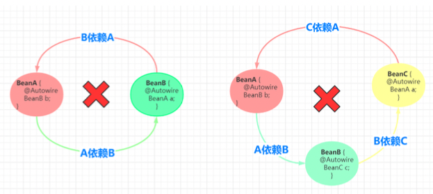
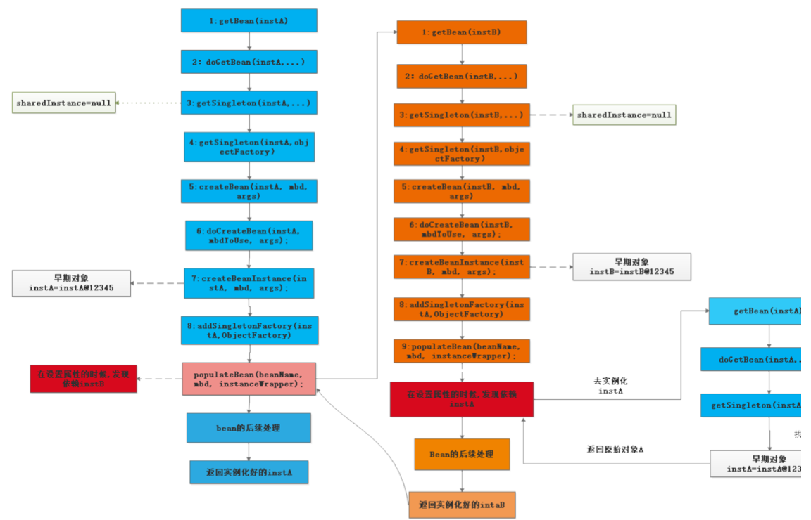
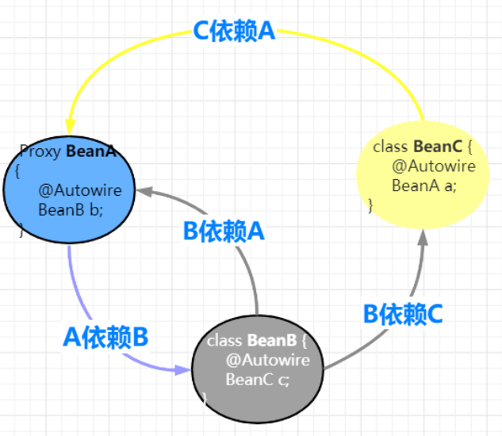

### 1. 什么是循环依赖？ 

  所谓循环依赖是指，A 依赖 B，B 又依赖 A，它们之间形成了循环依赖。或者是 A 依赖 B，B 依赖 C，C 又依 赖 A。它们之间的依赖关系如下:



  demo 
  
```java
package com.wlz.dependencies;

import org.springframework.beans.BeansException;
import org.springframework.beans.factory.annotation.Autowired;
import org.springframework.beans.factory.config.BeanDefinition;
import org.springframework.beans.factory.support.RootBeanDefinition;

import java.lang.reflect.Field;
import java.util.HashSet;
import java.util.Map;
import java.util.Set;
import java.util.concurrent.ConcurrentHashMap;

/**
 * @author wlz
 * @date 2022-05-25  9:07 下午
 */
public class MainStart {

	/**
	 * bean 定义
	 */
	private static Map<String, BeanDefinition> beanDefinitionMap = new ConcurrentHashMap<>(16);

	/**
	 * 一级缓存
	 */
	public static Map<String,Object> singletonObjects = new ConcurrentHashMap<>();

	/**
	 * 二级缓存： 为了将 成熟Bean和纯净Bean分离，避免读取到不完整得Bean
	 */
	public static Map<String,Object> earlySingletonObjects=new ConcurrentHashMap<>();

	/**
	 * 三级缓存
	 */
	public static Map<String, ObjectFactory> singletonFactories=new ConcurrentHashMap<>();

	/**
	 *  循环依赖标识 正在创建的 bean
	 */
	public  static Set<String> singletonsCurrennlyInCreation=new HashSet<>();

	/**
	 *  模拟 读取 bean 定义
	 */
	public static void loadbeanDefinition() {
		RootBeanDefinition beanDefinitionA = new RootBeanDefinition(InstanceA.class);
		RootBeanDefinition beanDefinitionB = new RootBeanDefinition(InstanceB.class);
		beanDefinitionMap.put("instanceA", beanDefinitionA);
		beanDefinitionMap.put("instanceB", beanDefinitionB);
	}


	public static void main(String[] args) throws Exception {
		// 加载 BeanDefinition
		loadbeanDefinition();

		// 注册bean 的后置处理器

		// 创建bean
		for (String beanName : beanDefinitionMap.keySet()) {
			// 先创建A
			getBean(beanName);
		}
		InstanceA instanceA = (InstanceA)getBean("instanceA");
		instanceA.say();
		System.out.println(instanceA);

	}

	/**
	 *  获取bean
	 * @param beanName
	 * @return
	 */
	public static Object getBean(String beanName) throws Exception {
		Object singleton = getSingleton(beanName);
		if (singleton != null) {
			return singleton;
		}

		if (!singletonsCurrennlyInCreation.contains(beanName)) {
			singletonsCurrennlyInCreation.add(beanName);
		}

		// 实例化
		RootBeanDefinition beanDefinition = (RootBeanDefinition) beanDefinitionMap.get(beanName);
		Class<?> beanClass = beanDefinition.getBeanClass();
		Object instanceBean = beanClass.newInstance(); // 通过无参构造函数实例化

		// 如果需要动态代理  创建动态代理 （耦合，BeanPostProcessor）
		// 动态代理创建有两种情况
		// 1. 存在循环依赖是 在 实例化之后创建动态代理
		// 2. 不存在循环依赖， 在 初始化之后创建 动态代理
//		instanceBean = new JdkProxyBeanPostProcessor().getEarlyBeanReference(instanceBean,beanName);

		// 使用函数式接口
		singletonFactories.put(beanName, new ObjectFactory() {
			@Override
			public Object getObject() throws BeansException {
				return new JdkProxyBeanPostProcessor().getEarlyBeanReference(earlySingletonObjects.get(beanName),beanName); // todo  bug
			}
		});

		// 假设放到属性赋值的前面 ,虽然可以解决死循环调用问题，
		// 但是 如果此时另一个 线程也去getBean("instanceA") ,此时，instanceA 还未完成属性赋值(是不完整的bean) ,从而出现问题，此时就需要增加二级缓存
//		singletonObjects.put(beanName, instanceBean);  // 所以一级缓存不能放到这里
		// 使用二级缓存 存储, 使用二级缓存其实也可以解决循环依赖的问题
		// 但是 不易于扩展

		// 创建的动态代理，直接放到二级缓存，这时就不需要三级缓存了
		// 但是在这里 创建了动态代理，从而导致 初始化后创建的动态代理就没有用了
		// 此时 可以设置 只在循环依赖的情况下创建动态代理， 正常情况下还是在初始化之后创建动态代理

		// 如果 使用到了 对象工厂，二级缓存也不用在这里存储了
//		earlySingletonObjects.put(beanName, instanceBean);

		// 属性赋值
		Field[] declaredFields = beanClass.getDeclaredFields();
		for (Field declaredField : declaredFields) {
			Autowired annotation = declaredField.getAnnotation(Autowired.class);
			// 说明属性上有 @Autowired
			if (annotation != null) {
				declaredField.setAccessible(true);
				// byType byName
				Object filedObject = getBean(declaredField.getName()); // 获取B 的bean
				declaredField.set(instanceBean,filedObject);
			}
		}

		// 初始化 init-method 等


		// 由于 递归完后A 还是原实例 ，所以还是要从二级缓存中拿到proxy
		if (earlySingletonObjects.containsKey(beanName)) {
			instanceBean = earlySingletonObjects.get(beanName);
		}

		// 添加到一级缓存
		singletonObjects.put(beanName, instanceBean);
		// remove 二级缓存、三级缓存
		//
		return instanceBean;
	}

	public static Object getSingleton(String beanName) {
		// 先从一级缓存中拿
		Object object = singletonObjects.get(beanName);
		// 说明是循环依赖
		if (object == null && singletonsCurrennlyInCreation.contains(beanName)) {
			// 如果二级缓存中没有，再从三级缓存中拿
			object = earlySingletonObjects.get(beanName);
			if (object == null) {
				// 从三级缓存中拿
				ObjectFactory objectFactory = singletonFactories.get(beanName);
				if (objectFactory != null) {
					object = objectFactory.getObject(); // todo bug
					earlySingletonObjects.put(beanName,object);
				}
			}
		}
		return object;

	}


}

```

### 2. 如何解决循环依赖？

   主要有哪三级缓存？ 
   
```java
public class DefaultSingletonBeanRegistry extends SimpleAliasRegistry implements SingletonBeanRegistry {
    
    // 一级缓存， 这个就是 单例对象池，用于保存所有的单实例bean 
    private final Map<String, Object> singletonObjects = new ConcurrentHashMap<>(256); // 一级缓存

    // 三级缓存， 该map 用户缓存 key 为 beanName value 为 ObjectFactory(包装的早期对象) 
	private final Map<String, ObjectFactory<?>> singletonFactories = new HashMap<>(16); // 三级缓存
    
    // 二级缓存 , 缓存 key 为 beanName value 是我们早期的对象(也就是对象属性还没有来的及赋值的对象)
	private final Map<String, Object> earlySingletonObjects = new HashMap<>(16);  // 二级缓存≈
}
``` 

   以beanA 和 beanB 两个类相互依赖为例 
   
#### 2.1 创建原始的bean 对象  （纯净态的bean ）

```java
public abstract class AbstractAutowireCapableBeanFactory extends AbstractBeanFactory
		implements AutowireCapableBeanFactory {
    protected Object doCreateBean(final String beanName, final RootBeanDefinition mbd, final @Nullable Object[] args)
            throws BeanCreationException {
        if (instanceWrapper == null) {
			// todo 第2次调用后置处理器  用来创建实例
			/**
			 * 第2次调用后置处理器
			 * 创建bean实例，并将实例放在包装类BeanWrapper中返回
			 * 1.通过工厂方法创建bean实例     method.invoke(obj,args)   @Bean
			 * 2.通过构造方法自动注入创建bean实例（获取 @Autowired 修饰的构造器）  clazz.newInstance(constructors)
			 * 3.通过无参构造器创建bean实例   clazz.newInstance()
			 */
			instanceWrapper = createBeanInstance(beanName, mbd, args);
		}
		final Object bean = instanceWrapper.getWrappedInstance();
    }
}
``` 

   如果 beanA 先被创建， 创建后的原始对象为BeanA@123, 以上代码中的bean 变量指向的就是这个对象。 
   
#### 2.2 暴露早期的引用 

   该方法用于将早期对象包装成ObjectFactroy 暴露到三级缓存中, 用户解决循环依赖

```  同 doCreateBean() 方法 
boolean earlySingletonExposure = (mbd.isSingleton() && this.allowCircularReferences &&
				isSingletonCurrentlyInCreation(beanName));
// 如果 earlySingletonExposure 为true ,则将早期的bean 暴露出去
if (earlySingletonExposure) {
    if (logger.isTraceEnabled()) {
        logger.trace("Eagerly caching bean '" + beanName +
                "' to allow for resolving potential circular references");
    }
    // 添加到singletonFactories SmartInstantiationAwareBeanPostProcessor#getEarlyBeanReference
    // todo 第4次调用后置处理器，提前暴露bean 的引用，主要用户解决循环依赖问题
    // earlySingletonExposure为true，将早期的bean 对象包装成 ObjectFactory (也就是未填充属性的bean) 暴露到三级缓存
    //  缓存当前beanName 的单例工厂到  singletonFactories.put(beanName, singletonFactory)
    addSingletonFactory(beanName, () -> getEarlyBeanReference(beanName, mbd, bean));
}


protected void addSingletonFactory(String beanName, ObjectFactory<?> singletonFactory) {
		Assert.notNull(singletonFactory, "Singleton factory must not be null");
		synchronized (this.singletonObjects) {
			if (!this.singletonObjects.containsKey(beanName)) {
			    // 将 早期对象包装成 ObjectFactory 暴露到三级缓存
				this.singletonFactories.put(beanName, singletonFactory);
				this.earlySingletonObjects.remove(beanName);
				this.registeredSingletons.add(beanName);
			}
		}
	}
```

   beanA 指向的原始地址创建好后，就开始把指向原始对象的引用通过 ObjectFactory 暴露出去. getEarlyBeanReference 方法的第三个
   参数bean 指向的就是 createBeanInstance 方法创建出原始bean 对象 BeanA@123。 
   
#### 2.3 解析依赖 （属性赋值）  

```
//填充Bean，该方法就是发生依赖注入的地方
// 填充bean 设置属性  InstantiationAwareBeanPostProcessor
// todo 第5次，第6次调用后置处理器     注入依赖
// 第5次调用后置处理器，在属性填充前调用，可以忽略属性填充  InstantiationAwareBeanPostProcessor#postProcessAfterInstantiation
// 第6次调用后置处理器， @Autowired 属性注入逻辑

populateBean(beanName, mbd, instanceWrapper);
```

  populateBean() 用于向beanA 这个原始对象中填充属性，当它检测到 beanA 依赖于beanB 时，会首先实例化beanB. 
  beanB 也会走到这里解析自己的依赖，当它检测到beanA 这个依赖，于是调用 BeanFactory.getBean("beanA") ,从容器中获取beanA .

#### 2.4 获取早期的引用 

```
protected Object getSingleton(String beanName, boolean allowEarlyReference) {
		// 首先 去 一级缓存(单例对象池中去获取对象，一般情况下从该map 中获取的对象是直接可以使用的)
		// IOC  容器 初始化加载单实例bean 的时候第一次进来时，该map 一般会返回空 
		Object singletonObject = this.singletonObjects.get(beanName);
		// 若 从 一级缓存中没有获取到对象，并且 isSingletonCurrentlyInCreation 这个list 里 包含该bean 
		// IOC 容器初始化加载单实例bean时第一次进来，该list  也是返回空，但是从循环依赖的时候可以满足条件 
		if (singletonObject == null && isSingletonCurrentlyInCreation(beanName)) {
			synchronized (this.singletonObjects) {
				// 尝试去二级缓存 中获取对象(二级缓存中是一个早期的对象)
				singletonObject = this.earlySingletonObjects.get(beanName);
				// 二级缓存中也没有获取到对象， 且 allowEarlyReference 为true 
				if (singletonObject == null && allowEarlyReference) {
					// 直接从三级缓存中获取 objectFactory 对象，这个对接主要就是用来解决循环依赖的关键 
					// 在IOC 后期的过程中， 当bean 调用了构造方法时，把早期对象包装成一个 ObjectFactory 暴露到三级缓存中 
					ObjectFactory<?> singletonFactory = this.singletonFactories.get(beanName);
					// 从三级缓存中获取到对象不为空 
					if (singletonFactory != null) {
						// 在这里 通过暴露的objectFactory 包装对象中，通过调用它的 getObject() 来获取我们的早期对象 
						// 在这里会 调用到 getEarlyBeanReference 来进行后置处理 
						singletonObject = singletonFactory.getObject(); 
						// 接着又把 对象放置到二级缓存，避免重复调用
						this.earlySingletonObjects.put(beanName, singletonObject);
						// 然后把 objectFactory 包装对象从三级缓存中删除 
						this.singletonFactories.remove(beanName);
					}
				}
			}
		}
		return singletonObject;
	}
``` 

  步骤: 

    1. populateBean 调用BeanFactory.getBean("beanA") 以获取beanB 的依赖 

    2. getBean("beanB") 会先调用 getBean("beanA") ，尝试从缓存中获取beanA, 此时beanA 还没有完全 创建好， 单例对象池中还没有。 

    3. 于是 tthis.earlySingletonObjects.get("beanA") 返回null。 

    4. 接着 this.earlySingletonObjects.get("beanA") 也返回null, 因为此时 beanA 早期引用还没有放到这个 二级缓存中去。 

    5. 最后获取 this.singletonFactories.get("beanA") 三级缓存中 暴露的早期包装ObjectFactory 对象 ，
    调用 singletonFactory.getObject() 会返回 singletonObject ，此时singletonObject 不为null, singletonObject 指向 
    BeanA@123， 也就是createBeanInstance 创建的原始对象。 此时 beanB 获取到这个原始对象的引用，beanB 就可以顺利完成bean 的创建， beanB 完成创建后，beanA  
    就可以获取到 beanB 所指的实例，beanA  接着也会完成bean 的创建工作。 由于 beanB.beanA 和beanA  指向的是同一个 对象 BeanA@123 ，所以 beanB 中的 beanA 也是可用状态。


  循环依赖流程图: 




### 3. 为何需要三级缓存， 而不是两级缓存？

#### 3.1 为什么需要二级缓存?

    二级缓存只要是为了分离成熟Bean和纯净Bean(未注入属性)的存放， 防止多线程中在Bean还未创建完成时读取到的Bean时不完整的。
    所以也是为了保证我们getBean是完整最终的Bean，不会出现不完整的情况。
  
#### 3.2 为什么需要三级缓存？ 

   我们都知道Bean的aop动态代理创建时在初始化之后，但是循环依赖的Bean如果使用了AOP。 那无法等到解决完循环依赖再创建动态代 理，
   因为这个时候已经注入属性。 所以如果循环依赖的Bean使用了aop. 需要提前创建aop。 
   
   但是需要思考的是动态代理在哪创建?? 在实例化后直接创建? 但是我们正常的Bean是在初始化创建啊。 
   所以可以加个判断如果是循环依赖就实例化后调用，没有循环依赖就正常在初始化后调用。

   怎么判断当前创建的bean是不是循环依赖? 根据二级缓存判断?有就是循环依赖? 那这个判断怎么加?加载实例化后面行吗? 且看:


```
实例化 后 

if(二级缓存有说明是循环依赖？) {
    二级缓存 = 创建动态代理覆盖 (判断当前bean 是否被二级缓存命中);
}
```

   这样写可以吗? 肯定不行啊， 因为实例化后始终会放入二级缓存中。 所以这样写不管是不是循环依赖都会在实例化后创建动态代理。
 
   创建本身的时候没法判断自己是不是循环依赖，， 只有在B 引用A (不同bean的引用直接)下才能判断是不是循环依赖(比如B引用A,A 正在创建，那说明是循环依赖)， 
   所以判断要写在 getSingleton 中。

```
如果 A 是 proxy 

A创建Bean  --> 注入属性B --> getBean(B) --> 创建B --> 注入属性A ---> getSingleton("a") 后面写以下代码

if(二级缓存有说明是循环依赖？) {
    二级缓存 = 创建动态代理覆盖 (判断当前bean 是否被二级缓存命中 ,没有命中依然返回二级缓存);
}

```

  在这里创建行吗? 行! 那要三级缓存干吗? 如果是这样的依赖呢?


 
  A被循环依赖了俩次或N次， 那要创建N次aop吗然后在里面判断有没有命中? 什么? 你说根据二级缓存的对象判断? 
  
  如果是动态代 理就不重复创建?逻辑太复杂了。毫无扩展性也太过于耦合。。如果希望循环依赖给程序员扩展呢?那程序员不一定就返回proxy 。
  
```
如果 A 是 proxy 

A创建Bean  --> 注入属性B --> getBean(B) --> 创建B --> 注入属性A ---> getSingleton("a") 后面写以下代码

if(二级缓存有说明是循环依赖？) {
    if(二级缓存是aop就) {
        return 二级缓存; 
    }
    二级缓存 = 创建动态代理覆盖 (判断当前bean 是否被二级缓存命中 ,没有命中依然返回二级缓存);
}

```


   除了这样没有更好的解决方案吗? 能不能让二级缓存存储的bean无脑返回就行了(不管是普通的还是代理的，让这块逻辑分离? 可 以。 增加三级缓存，二级缓存先啥也不存。

   三级缓存 存一个函数接口， 动态代理还是普通bean的逻辑调用BeanPostProcessor 都放在这里面。 只要调用了就存在二级缓存，无 脑返回就行。 大大减少业务逻辑复杂度
   
### 4. 为什么Spring 不能解决构造器的循环依赖？ （其实可以解决，在属性上加@Lazy 懒加载就可以）

   从流程图应该不难看出来，在Bean调用构造器实例化之前，一二三级缓存并没有Bean的任何相关信息，在 实例化之后才放入三级缓存中，因此当getBean的时候缓存并没有命中，这样就抛出了循环依赖的异常了。

####  4.1 构造器注入如何解决循环依赖？

利用@Lazy，会获取到代理对象完成注入
```
DefaultListableBeanFactory#resolveDependency
>ContextAnnotationAutowireCandidateResolver#buildLazyResolutionProxy
```


### 5. 为什么多例Bean不能解决循环依赖?

   循环依赖的核心是利用一个map，来解决这个问题的，这个map就相当于缓存。 为什么可以这么做，因为我们的bean是单例的，
   而且是字段注入(setter注入)的，单例意味着只需要创建一次对象，后面就可以从缓存 中取出来，字段注入，意味着我们无需调用构造方法进行注入。
    
    如果是原型bean，那么就意味着每次都要去创建对象，无法利用缓存; 
   
    如果是构造方法注入，那么就意味着需要调用构造方法注入，也无法利用缓存。

### 6. 循环依赖可以关闭吗? （可以）

Spring提供了这个功能，我们需要这么写

```java
public class Main {
    public static void main(String[] args) {
        AnnotationConfigApplicationContext applicationContext = new AnnotationConfigApplicationContext();
        applicationContext.setAllowCircularReferences(false);
        applicationContext.register(AppConfig.class);
        applicationContext.refresh();
    }    
}
```

### 7. 如何进行拓展? 

  bean可以通过实现SmartInstantiationAwareBeanPostProcessor接口(一般这个接口供spring内部使用)的 getEarlyBeanReference方法进行拓展
  
#### 1. 何时进行拓展?(进行bean的实例化时) 

```
protected Object doCreateBean(final String beanName, final RootBeanDefinition mbd, final @Nullable Object[] args)
			throws BeanCreationException {
   
   // 急切地缓存单例，以便能够解析循环引用,即使是由生命周期接口(如BeanFactoryAware)触发的。
		// 如果当前是单例，且允许循环依赖而且当前bean处于创建状态
		// 是否单例bean 允许循环依赖，存在正在创建beanName
		boolean earlySingletonExposure = (mbd.isSingleton() && this.allowCircularReferences &&
				isSingletonCurrentlyInCreation(beanName));
		// 如果 earlySingletonExposure 为true ,则将早期的bean 暴露出去
		if (earlySingletonExposure) {
			if (logger.isTraceEnabled()) {
				logger.trace("Eagerly caching bean '" + beanName +
						"' to allow for resolving potential circular references");
			}
			// 添加到singletonFactories SmartInstantiationAwareBeanPostProcessor#getEarlyBeanReference
			// todo 第4次调用后置处理器，提前暴露bean 的引用，主要用户解决循环依赖问题
			// earlySingletonExposure为true，将早期的bean 对象包装成 ObjectFactory (也就是未填充属性的bean) 暴露到三级缓存
			//  缓存当前beanName 的单例工厂到  singletonFactories.put(beanName, singletonFactory)
			addSingletonFactory(beanName, () -> getEarlyBeanReference(beanName, mbd, bean));
		} 
} 
``` 

getEarlyBeanReference 方法 
```
protected Object getEarlyBeanReference(String beanName, RootBeanDefinition mbd, Object bean) {
		Object exposedObject = bean;
		// 第四次调用  BeanPostProcessor
		if (!mbd.isSynthetic() && hasInstantiationAwareBeanPostProcessors()) {
			for (BeanPostProcessor bp : getBeanPostProcessors()) {
				if (bp instanceof SmartInstantiationAwareBeanPostProcessor) {
					SmartInstantiationAwareBeanPostProcessor ibp = (SmartInstantiationAwareBeanPostProcessor) bp;
					// 调用singletonFactories.getObject() 会执行此方法，返回未填充属性的bean
					exposedObject = ibp.getEarlyBeanReference(exposedObject, beanName);
				}
			}
		}
		return exposedObject;
}
```

#### 2. 示例 

```java
@Component
public class JdkProxyBeanPostProcessor implements SmartInstantiationAwareBeanPostProcessor {

	@Override
	public Object getEarlyBeanReference(Object bean, String beanName) {
		// 假设 A 被 切点命中，需要创建代理对象 模拟 @PointCut("execution(*.*.InstanceA.*(..))")
		if (bean instanceof InstanceA) {
			JdkDynimcProxy jdkDynimcProxy = new JdkDynimcProxy(bean);
			return jdkDynimcProxy.getProxy();
		}
		return bean;
	}
}
```