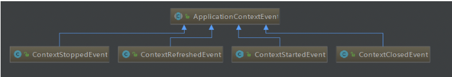
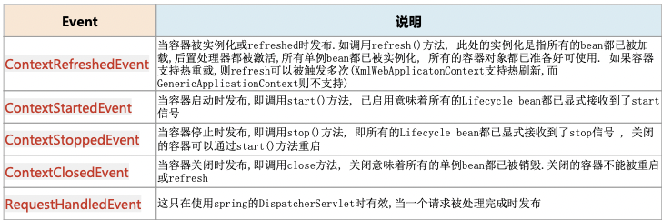
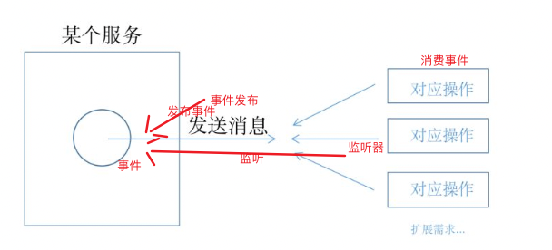
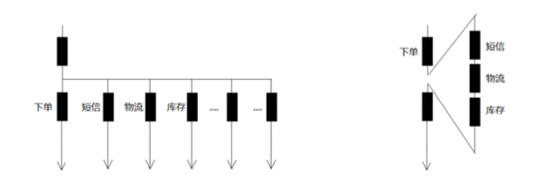
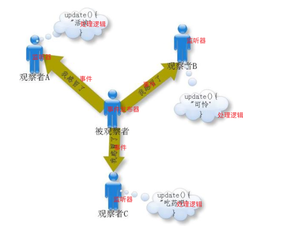
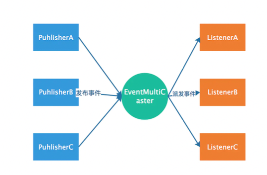
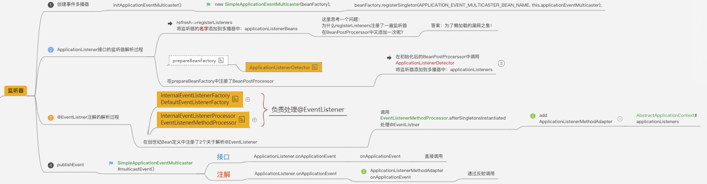

### 1. 使用Spring 事件 

  Spring 事件主要包括三个组件: 事件(Event)、事件监听器(Listener)、事件广播器
  
#### 1.2 事件 

##### 1.2.1 Spring 内置事件 

   内置事件中由系统内部进行发布，只需注入监听器





##### 1.2.2 自定义事件

###### 1.2.2.1  事件  继承ApplicationEvent 类 

```java
public class UserEvent extends ApplicationEvent {

	private static final long serialVersionUID = 123412341234L;

	private String name;

	public UserEvent(Object source,String name) {
		super(source);
		this.name = name;
	}

	public String getName() {
		return name;
	}
}
```

###### 1.2.2.2 事件监听器  基于接口 ApplicationListener

```java
@Component
public class UserEventListener implements ApplicationListener<UserEvent> {


	@Override
	public void onApplicationEvent(UserEvent event) {
		if (event.getName().equals("wlz")) {
			System.out.println("UserEventListener 基于接口实现 事件被监听 。。。。。。");
		}
	}
}
```

###### 1.2.2.3 事件监听器 基于 注解 @EventListener

```java

@Component
public class UserEventListener2 {

	@EventListener(UserEvent.class)
	public void onApplicationEvent(UserEvent event) {
		if (event.getName().equals("wlz")) {
			System.out.println("UserEventListener 基于注解 事件被监听 。。。。。。");
		}
	}

}
```

###### 1.2.2.4 事件发布 

```java
public class IOCTest {
    @Test
    public void test4() {

        // ioc容器
        AnnotationConfigApplicationContext context = new AnnotationConfigApplicationContext(AppConfig6.class);
        String[] beanDefinitionNames = context.getBeanDefinitionNames();
        for (String beanDefinitionName : beanDefinitionNames) {
            System.out.println(beanDefinitionName);
        }

        context.publishEvent(new UserEvent(this, "wlz"));

    }
}
```

### 2. 事件监听机制 应用  



   1. 同样的事件能有多个监听器 -- 可以的

   2. 事件监听器一定要写一个类去实现吗 -- 其实是可以不需要的，spring有个注解@EventListener，修饰在方法上。

   3. 事件监听操作和发布事件的操作是同步的吗? -- 是的，所以如果有事务，监听操作也在事务内
    
   4. 可以作为异步处理吗? --可以 看源码有解释。:

```java
@Configuration
@ComponentScan("com.wlz.eventListener")
public class AppConfig6 {

    /**
     *  事件监听机制 异步处理  bean id 必须叫 applicationEventMulticaster
     * @return
     */
    @Bean("applicationEventMulticaster") // step1: id 必须叫 applicationEventMulticaster
    public ApplicationEventMulticaster simpleApplicationEventMulticaster() {
        // step2: 实例化 SimpleApplicationEventMulticaster
        SimpleApplicationEventMulticaster eventMulticaster = new SimpleApplicationEventMulticaster();
        // Step3: 设置TaskExecutor
        eventMulticaster.setTaskExecutor(new SimpleAsyncTaskExecutor());
        return eventMulticaster;
    }

}
```



### 3. Spring 事件原理 

  原理： 观察者模式
  
  spring的事件监听有三个部分组成: 
  
    事件(ApplicationEvent): 负责对应于相应监听器 事件源发生某事件是特定监听器被触发的原因。

    监听器(ApplicationListener): 对应于 观察者模式中的观察者. 监听器监听特定事件，并在内部定义了事件发生后的相应逻辑.

    事件发布器(ApplicationEventMulticaster): 对应于 观察者模式中的 被观察者/主题， 赋值通知观察者 对外提供发布事件和增删事件监听器的接口，维护事件和事件监听器之间
    的映射关系，并在事件发生时负责通知相关监听器。



  Spring 事件机制是观察者模式的一种实现，但是除了发布者和监听者两个角色之外，还有一个EventMultiCaster 的角色负责把
  事件转发给监听者，工作流程如下: 



  也就是说上面代码中发布者调用 context.publishEvent(new UserEvent(this, "wlz")); 是会将事件发送给了 
  EventMultiCaster ，而后由 EventMultiCaster 注册着所有的 Listener, 然后根据 事件类型 决定转发给 那个Listener . 
  
### 4. 源码流程 

#### 4.1 源码流程图 



#### 4.2 源码分析 

  Spring在ApplicationContext接口的抽象实现类AbstractApplicationContext中完成了事件体系的搭建。 
  
  AbstractApplicationContext拥有一个applicationEventMulticaster成员变量，applicationEventMulticaster提供了容器监听器的注册表。
  
  AbstractApplicationContext在refresh()这个容器启动方法中搭建了事件的基础设施,其中 AbstractApplicationContext的refresh方法实现如下:
  
```
public void refresh() throws BeansException, IllegalStateException {
		synchronized (this.startupShutdownMonitor) {
			try {
				// Initialize event multicaster for this context.
				// 初始化事件多播器
				initApplicationEventMulticaster();

				// Check for listener beans and register them.
				// 注册事件监听器
				registerListeners();

				// Last step: publish corresponding event.  
				//最后一步：发布相应的事件。
				finishRefresh();
			}
			catch (BeansException ex) {
				// Propagate exception to caller.
				throw ex;
			}
			finally {
				// Reset common introspection caches in Spring's core, since we
				// might not ever need metadata for singleton beans anymore...
				resetCommonCaches();
			}
		}
	}
```

##### 4.2.1 事件广播器的初始化

  用户可以在配置文件中为容器定义一个自定义的事件广播器，只要实现ApplicationEventMulticaster就可以了，
  Spring会通过 反射的机制将其注册成容器的事件广播器，如果没有找到配置的外部事件广播器，
  Spring自动使用 SimpleApplicationEventMulticaster作为事件广播器。

```
	protected void initApplicationEventMulticaster() {
		ConfigurableListableBeanFactory beanFactory = getBeanFactory();
		if (beanFactory.containsLocalBean(APPLICATION_EVENT_MULTICASTER_BEAN_NAME)) {
			this.applicationEventMulticaster =
					beanFactory.getBean(APPLICATION_EVENT_MULTICASTER_BEAN_NAME, ApplicationEventMulticaster.class);
			if (logger.isTraceEnabled()) {
				logger.trace("Using ApplicationEventMulticaster [" + this.applicationEventMulticaster + "]");
			}
		}
		else {
			this.applicationEventMulticaster = new SimpleApplicationEventMulticaster(beanFactory);
			beanFactory.registerSingleton(APPLICATION_EVENT_MULTICASTER_BEAN_NAME, this.applicationEventMulticaster);
			if (logger.isTraceEnabled()) {
				logger.trace("No '" + APPLICATION_EVENT_MULTICASTER_BEAN_NAME + "' bean, using " +
						"[" + this.applicationEventMulticaster.getClass().getSimpleName() + "]");
			}
		}
	}
```

##### 4.2.2 注册事件监听器

```
protected void registerListeners() {
		// Register statically specified listeners first.
		for (ApplicationListener<?> listener : getApplicationListeners()) {
			getApplicationEventMulticaster().addApplicationListener(listener);
		}

		// Do not initialize FactoryBeans here: We need to leave all regular beans
		// uninitialized to let post-processors apply to them!
		String[] listenerBeanNames = getBeanNamesForType(ApplicationListener.class, true, false);
		for (String listenerBeanName : listenerBeanNames) {
			getApplicationEventMulticaster().addApplicationListenerBean(listenerBeanName);
		}

		// Publish early application events now that we finally have a multicaster...
		Set<ApplicationEvent> earlyEventsToProcess = this.earlyApplicationEvents;
		this.earlyApplicationEvents = null;
		if (earlyEventsToProcess != null) {
			for (ApplicationEvent earlyEvent : earlyEventsToProcess) {
				getApplicationEventMulticaster().multicastEvent(earlyEvent);
			}
		}
	}
```

   Spring根据反射机制，使用ListableBeanFactory的getBeansOfType方法，从BeanDefinitionRegistry中找出所有实现 
   org.springframework.context.ApplicationListener的Bean，将它们注册为容器的事件监听器，
   实际的操作就是将其添加到事件广播器所提供的监听器注册表中。
   
##### 4.2.3 发布事件 

  跟着 finishRefresh();方法进入publishEvent(new ContextRefreshedEvent(this));方法如下:

```
	protected void finishRefresh() {
	
		// Publish the final event.
		// 发布事件
		publishEvent(new ContextRefreshedEvent(this));
	}
```

```
	protected void publishEvent(Object event, @Nullable ResolvableType eventType) {
		Assert.notNull(event, "Event must not be null");

		// Decorate event as an ApplicationEvent if necessary
		ApplicationEvent applicationEvent;
		if (event instanceof ApplicationEvent) {
			applicationEvent = (ApplicationEvent) event;
		}
		else {
			applicationEvent = new PayloadApplicationEvent<>(this, event);
			if (eventType == null) {
				eventType = ((PayloadApplicationEvent<?>) applicationEvent).getResolvableType();
			}
		}

		// Multicast right now if possible - or lazily once the multicaster is initialized
		if (this.earlyApplicationEvents != null) {
			this.earlyApplicationEvents.add(applicationEvent);
		}
		else {
		    // 发布事件
			getApplicationEventMulticaster().multicastEvent(applicationEvent, eventType);
		}

		// Publish event via parent context as well...
		if (this.parent != null) {
			if (this.parent instanceof AbstractApplicationContext) {
				((AbstractApplicationContext) this.parent).publishEvent(event, eventType);
			}
			else {
				this.parent.publishEvent(event);
			}
		}
	}
```

  在AbstractApplicationContext的publishEvent方法中， Spring委托ApplicationEventMulticaster将事件通知给所有的事件监听器.

##### 4.2.4 Spring默认的事件广播器SimpleApplicationEventMulticaster

```
	public void multicastEvent(final ApplicationEvent event, @Nullable ResolvableType eventType) {
		ResolvableType type = (eventType != null ? eventType : resolveDefaultEventType(event));
		Executor executor = getTaskExecutor();
		for (ApplicationListener<?> listener : getApplicationListeners(event, type)) {
			if (executor != null) {
				executor.execute(() -> invokeListener(listener, event));
			}
			else {
				invokeListener(listener, event);
			}
		}
	}
```

```
	protected void invokeListener(ApplicationListener<?> listener, ApplicationEvent event) {
		ErrorHandler errorHandler = getErrorHandler();
		if (errorHandler != null) {
			try {
				doInvokeListener(listener, event);
			}
			catch (Throwable err) {
				errorHandler.handleError(err);
			}
		}
		else {
			doInvokeListener(listener, event);
		}
	}
```

   遍历注册的每个监听器，并启动来调用每个监听器的onApplicationEvent方法。由于 SimpleApplicationEventMulticaster的taskExecutor的实现类是SyncTaskExecutor，
   因此，事件监听器 对事件的处理，是同步进行的。 
   
   从代码可以看出，applicationContext.publishEvent()方法，需要同步等待各个监听器处理完之后，才返回。
   
   也就是说，Spring提供的事件机制，默认是同步的。如果想用异步的，可以自己实现 ApplicationEventMulticaster接口，
   并在Spring容器中注册id为applicationEventMulticaster的Bean。例 如下面所示:

```java

@Configuration
@ComponentScan("com.wlz.eventListener")
public class AppConfig6 {

    /**
     *  事件监听机制 异步处理  bean id 必须叫 applicationEventMulticaster
     * @return
     */
    @Bean("applicationEventMulticaster") // step1: id 必须叫 applicationEventMulticaster
    public ApplicationEventMulticaster simpleApplicationEventMulticaster() {
        // step2: 实例化 SimpleApplicationEventMulticaster
        SimpleApplicationEventMulticaster eventMulticaster = new SimpleApplicationEventMulticaster();
        // Step3: 设置TaskExecutor
        eventMulticaster.setTaskExecutor(new SimpleAsyncTaskExecutor());
        return eventMulticaster;
    }

}
```