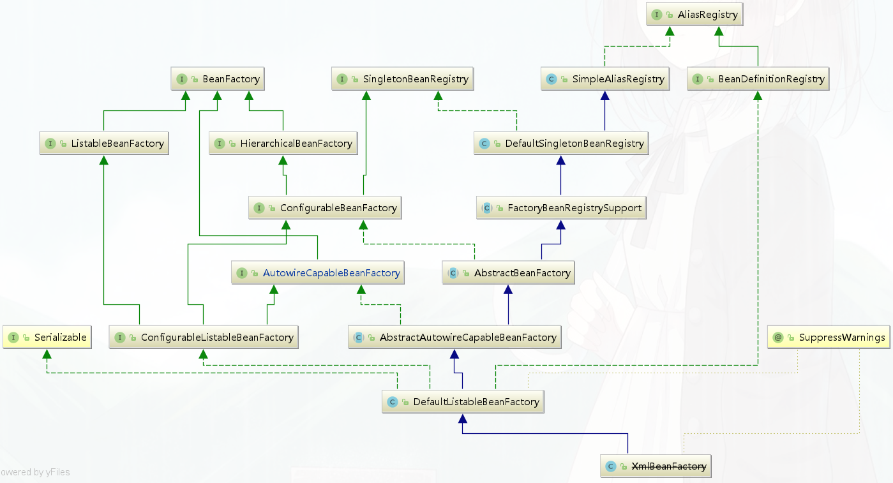

### 原理图
 
  

### bean的注册原理
  
 思考：==bean的属性是什么对象承载的？ bean是如何注册到容器中的？==

#### BeanDefinition
   
   容器中的每一个 bean 都会有一个对应的 BeanDefinition 实例，该实例负责保存 bean 对象的所有必要信息，包括 bean 对象的 class 类型、是否是抽象类、构造方法和参数、其他属性等等
   
   

#### BeanDefinitionRegistry
   
   BeanDefinition的注册器，抽象了 bean 的注册逻辑，包括registerBeanDefinition、removeBeanDefinition、getBeanDefinition 等注册管理 BeanDefinition 的方法。

#### BeanFactory  

   bean工厂，抽象了 bean 的管理逻辑，主要包含 getBean、containBean、getType、getAliases 等管理 bean 的方法。

   

#### DefaultListableBeanFactory
   
   Spring IoC的核心类， 即实现了BeanFactory  ，也实现了BeanDefinitionRegistry
```
# 注册BeanDefinition对象
public void registerBeanDefinition(String beanName, BeanDefinition beanDefinition)
			throws BeanDefinitionStoreException {}
# 注册bean对象
public void registerSingleton(String beanName, Object singletonObject) throws IllegalStateException {}
```
  xml Configuration demo
```
//创建一个简单注册器
//BeanDefinitionRegistry register = new SimpleBeanDefinitionRegistry();
//创建一个实现了注册器的工厂  
BeanDefinitionRegistry registry = new DefaultListableBeanFactory();
//创建bean定义读取器
BeanDefinitionReader reader = new XmlBeanDefinitionReader(register);
// 创建资源读取器
//DefaultResourceLoader resourceLoader = new DefaultResourceLoader();
// 获取资源
//Resource xmlResource = resourceLoader.getResource("spring.xml");
// 装载Bean的定义
//reader.loadBeanDefinitions(xmlResource);
reader.loadBeanDefinitions("spring.xml");
// 打印构建的Bean 名称
System.out.println(Arrays.toString(register.getBeanDefinitionNames());

// 工厂调用getBean方法
System.out.println(registry.getBean("user"));
```
  java Configuration  demo
```
AnnotationConfigApplicationContext context =
      new AnnotationConfigApplicationContext(AppConfig.class);

// 通过容器获取到beanFactory  即是工厂，又是注册器
DefaultListableBeanFactory factory = context.getDefaultListableBeanFactory();

RootBeanDefinition beanDefinition = new RootBeanDefinition(User.class);
factory.registerBeanDefinition("user",beanDefinition);

//beanDefinition.setAutowireMode(2);

// 填充属性
beanDefinition.getPropertyValues().add("name","user");
```

#### 动态注册bean
   ==思考：如何动态的将一个普通对象交给Spring管理？==

   1.BeanDefinitionRegistryPostProcessor
```
public interface BeanDefinitionRegistryPostProcessor extends BeanFactoryPostProcessor {

	void postProcessBeanDefinitionRegistry(BeanDefinitionRegistry registry) throws BeansException;

}
```
   2.ImportBeanDefinitionRegistrar
```
public interface ImportBeanDefinitionRegistrar {

	public void registerBeanDefinitions(
			AnnotationMetadata importingClassMetadata, BeanDefinitionRegistry registry);

}
```
   3.BeanFactoryPostProcessor
```
public interface BeanFactoryPostProcessor {

   void postProcessBeanFactory(ConfigurableListableBeanFactory beanFactory) throws BeansException;

}
```

### IoC启动流程
   
   
   
#### 1.创建beanFactory
  
   容器底层用DefaultListableBeanFactory，即实现了BeanDefinitionRegistry，又实现了BeanFactory
   
   java 配置（在容器启动之前就创建beanFactory）：
```
AnnotationConfigApplicationContext context =
      new AnnotationConfigApplicationContext(AppConfig.class);
```
```
	//最常用的构造函数，将涉及到的配置类传递给该构造函数，以实现将相应配置类中的Bean自动注册到容器中
	public AnnotationConfigApplicationContext(Class<?>... annotatedClasses) {
		//调用父类构造方法
		//	1. 初始化bean定义读取器和扫描器;
		// 	2.调用父类GenericApplicationContext无参构造函数，初始化一个BeanFactory：DefaultListableBeanFactory
		// 	3.注册Spring自带的bean,共5个  包括: ConfigurationClassPostProcessor
		//  		AutowiredAnnotationBeanPostProcessor  CommonAnnotationBeanPostProcessor
		// EventListenerMethodProcessor  DefaultEventListenerFactory
		this();
		//  注册AppConfig, ApplicationContext传入的配置类
		register(annotatedClasses);
		refresh(); // 启动容器
	}
```
  this()方法-->会调用父类的无参构造器
```
public GenericApplicationContext() {
   this.beanFactory = new DefaultListableBeanFactory();
}
```
   
  xml 配置 ：
```
ClassPathXmlApplicationContext context = new ClassPathXmlApplicationContext("Spring.xml");
```
```
	public ClassPathXmlApplicationContext(String configLocation) throws BeansException {
		// 调用重载的构造器
		this(new String[] {configLocation}, true, null);
	}
  
  ============================================================================   

   	public ClassPathXmlApplicationContext(
   			String[] configLocations, boolean refresh, @Nullable ApplicationContext parent)
   			throws BeansException {
   		// 设置bean 资源加载器 》 ResourceLoader
   		// 初始化 AbstractApplicationContext
   		super(parent);
   		//配置资源的位置,  String[] configLocations = {"spring.xml,"spring01.xml"}
   		setConfigLocations(configLocations);
   		//保证只会初始化一次
   		if (refresh) {
   			// 启动IOC 容器,AbstractApplicationContext.refresh()
   			refresh();
   		}
   	}   
```
  调refresh()后，即容器启动过程中创建beanFactory
```
// Tell the subclass to refresh the internal bean factory.
//告诉子类刷新内部bean工厂  创建BeanFactory
// 	获得刷新的beanFactory
// 	 对于AnnotationConfigApplicationContext，作用：
// 		1.调用org.springframework.context.support.GenericApplicationContext.refreshBeanFactory，
// 		   只是指定了SerializationId
// 		2.直接返回beanFactory(不用创建，容器中已存在)
//   对于ClassPathXmlApplicationContext，作用：
// 		1.调用AbstractRefreshableApplicationContext.refreshBeanFactory() 执行实际刷新
// 		2.如果存在beanFactory ，先销毁单例bean，关闭beanFactory，再创建beanFactory
// 		3.注册传入的spring的xml配置文件中配置的bean，注册到beanFactory
// 		4.将beanFactory赋值给容器，返回beanFactory
ConfigurableListableBeanFactory beanFactory = obtainFreshBeanFactory();

> refreshBeanFactory(); // AbstractApplicationContext#refreshBeanFactory
```
   先创建DefaultListableBeanFactory实例，然后 解析xml配置文件，注册bean到beanFactory，最后再将beanFactory赋值给容器
```
DefaultListableBeanFactory beanFactory = createBeanFactory();
beanFactory.setSerializationId(getId());
// 定制beanFactory，设置参数
customizeBeanFactory(beanFactory);
// 注册spring的xml配置的bean到beanFactory，此时容器还未指定beanbeanFactory
loadBeanDefinitions(beanFactory);
// 给容器指定beanFactory
synchronized (this.beanFactoryMonitor) {
   this.beanFactory = beanFactory;
}
```

#### 2.注册bean

  核心原理: 
    
    通过调用registerBeanDefinition方法将bean的beanName----beanDefinition注册到beanFactory
```
DefaultListableBeanFactory#registerBeanDefinition  //  实现了 BeanDefinitionRegistry
> beanDefinitionMap.put(beanName, beanDefinition);  // 缓存beanDefinition
```
 代码示例：
```
    // ioc容器
    ApplicationContext context = new AnnotationConfigApplicationContext(AppConfig.class);
    
    // 拿到工厂  实现了 BeanDefinitionRegistry
    	DefaultListableBeanFactory beanFactory = ((AnnotationConfigApplicationContext) context).getDefaultListableBeanFactory();
    
    //创建一个beanDefinition
    RootBeanDefinition beanDefinition = new RootBeanDefinition(User.class);
    
    // 注册
    beanFactory.registerBeanDefinition("user",beanDefinition);
```
  
#####  java配置:
  
  容器启动过程中, 会调用ConfigurationClassPostProcessor#postProcessBeanDefinitionRegistry 解析注解，注册bean
```
// Invoke factory processors registered as beans in the context.
//调用工厂处理器 注册bean  完成扫描  代理
// 1.通过beanFactory.getBean(ppName, BeanDefinitionRegistryPostProcessor.class)
//   	拿到ConfigurationClassPostProcessor
// 2.通过ConfigurationClassPostProcessor.postProcessBeanDefinitionRegistry，注册所有注解配置的bean
// 	注册的顺序： @ComponentScan>实现ImportSelector>方法bean>@ImportResource("spring.xml")
//  	> 实现 ImportBeanDefinitionRegistrar  (相对的顺序，都在同一个配置类上配置)
// 3. 调用ConfigurationClassPostProcessor#postProcessBeanFactory
//  	增强@Configuration修饰的配置类  AppConfig--->AppConfig$$EnhancerBySpringCGLIB
// 		(可以处理内部方法bean之间的调用，防止多例)
//  	添加了后置处理器 ConfigurationClassPostProcessor.ImportAwareBeanPostProcessor (new)
invokeBeanFactoryPostProcessors(beanFactory); // 解析注解，注册bean

> ConfigurationClassPostProcessor#postProcessBeanDefinitionRegistry
```
   ConfigurationClassPostProcessor#postProcessBeanDefinitionRegistry 中有两个很重要的方法
```
// 解析配置类  @ComponentScan (bean注册到容器) @Import @ImportResource @Bean
parser.parse(candidates);

// 注册bean到容器
// 注册实现了ImportSelector的bean
// 方法bean注册到容器
// @ImportResource("spring.xml") 配置的bean注册到容器
// 实现ImportBeanDefinitionRegistrar的bean 注册到容器
this.reader.loadBeanDefinitions(configClasses);
```
#####  解析注解
```
parser.parse(candidates);
>ConfigurationClassParser#processConfigurationClass

>ConfigurationClassParser#doProcessConfigurationClass
```
  ConfigurationClassParser#doProcessConfigurationClass 会处理@ComponentScan，@Import，@ImportResource，@Bean
  
  @ComponentScan会将@Component修饰的bean注入到容器
```
ClassPathBeanDefinitionScanner#doScan
>
// 找到@Component修饰的类的beanDefiniton集合
Set<BeanDefinition> candidates = findCandidateComponents(basePackage);
// 注册bean
registerBeanDefinition(definitionHolder, this.registry);
```
#####  注册bean
```
this.reader.loadBeanDefinitions(configClasses)
    
>ConfigurationClassBeanDefinitionReader#loadBeanDefinitionsForConfigurationClass
```
```
if (configClass.isImported()) {
   //  implements ImportSelector 的bean 注册
   registerBeanDefinitionForImportedConfigurationClass(configClass);
}
for (BeanMethod beanMethod : configClass.getBeanMethods()) {
   // 方法bean 注册到容器
   loadBeanDefinitionsForBeanMethod(beanMethod);
}

// @ImportResource("spring.xml") 配置的bean注册到容器
loadBeanDefinitionsFromImportedResources(configClass.getImportedResources());
//  实现 ImportBeanDefinitionRegistrar的 bean 注册到容器
loadBeanDefinitionsFromRegistrars(configClass.getImportBeanDefinitionRegistrars());
```

#####  xml配置：
    
   ConfigurableListableBeanFactory beanFactory = obtainFreshBeanFactory();
    
   refreshBeanFactory(); // AbstractApplicationContext#refreshBeanFactory
  
  将beanFactory赋值给容器之前 解析xml，并且注册bean
```
DefaultListableBeanFactory beanFactory = createBeanFactory();
beanFactory.setSerializationId(getId());
// 定制beanFactory，设置参数
customizeBeanFactory(beanFactory);
// 注册spring的xml配置的bean到beanFactory，此时容器还未指定beanbeanFactory
loadBeanDefinitions(beanFactory);
// 给容器指定beanFactory
synchronized (this.beanFactoryMonitor) {
   this.beanFactory = beanFactory;
}
```
#####  解析xml
    loadBeanDefinitions(beanFactory) 最终会调
    DefaultBeanDefinitionDocumentReader#doRegisterBeanDefinitions
```
// 注册spring的xml配置的bean到beanFactory，此时容器还未指定beanbeanFactory
loadBeanDefinitions(beanFactory);

>DefaultBeanDefinitionDocumentReader#doRegisterBeanDefinitions

preProcessXml(root);
parseBeanDefinitions(root, this.delegate);// 解析xml
postProcessXml(root);

>DefaultBeanDefinitionDocumentReader#parseDefaultElement

else if (delegate.nodeNameEquals(ele, BEAN_ELEMENT)) {
	// 解析bean
	processBeanDefinition(ele, delegate);
}

>DefaultBeanDefinitionDocumentReader#processBeanDefinition
// 注册最后修饰后的实例beanDefinition
BeanDefinitionReaderUtils.registerBeanDefinition(bdHolder, getReaderContext().getRegistry());
```
  
  ##### 注册bean
  
  BeanDefinitionReaderUtils#registerBeanDefinition 中会注册bean
```
// 注册beanDefiniton
registry.registerBeanDefinition(beanName, definitionHolder.getBeanDefinition());
```

#### 3.创建bean实例
##### 准备
  容器启动过程中会实例化非懒加载单例bean,通过AbstractBeanFactory创建bean的实例
```
AbstractApplicationContext#refresh

// Instantiate all remaining (non-lazy-init) singletons.
// 在创建BeanFactory的过程中，BeanDefinition注册到了BeanFactory中的一个ConCurretHashMap对象中
// 以BeanName为key，BeanDefinition为value
// Instantiate all remaining (non-lazy-init) singletons. 实例化所有剩余的（非延迟初始化）单例。
// 实例化所有剩余的(非懒加载)单例。
> finishBeanFactoryInitialization(beanFactory);
> AbstractApplicationContext#getBean(String)
```
  调用context.getBean(name)获取bean实例，实际会去调用AbstractBeanFactory的getBean()方法。
```
AbstractApplicationContext#getBean(String)
>AbstractBeanFactory#getBean(String)
>AbstractBeanFactory#doGetBean
```
  调用AbstractBeanFactory#doGetBean， 先从singletonObjects中去获取bean
```
//转换对应的beanName
// 1.带&前缀的去掉前缀
// 2.从aliasMap中找name对应id，bean没有配id就用name
final String beanName = transformedBeanName(name);

//先从缓存singletonObjects中找,没有则去创建
//处理循环依赖的问题,比如A->B，B->A
Object sharedInstance = getSingleton(beanName);


//判断单例
if (mbd.isSingleton()) {
	sharedInstance = getSingleton(beanName, () -> {
		return createBean(beanName, mbd, args);
    });   
	bean = getObjectForBeanInstance(sharedInstance, name, beanName, mbd);
}                                  
```
   调用AbstractAutowireCapableBeanFactory#doCreateBean 返回bean
```
AbstractAutowireCapableBeanFactory#createBean(String, RootBeanDefinition, Object[])
// 返回bean实例
>Object beanInstance = doCreateBean(beanName, mbdToUse, args);
```
##### 实例化bean
   调用AbstractAutowireCapableBeanFactory#doCreateBean 
```
/**
* 第2次调用后置处理器
* 创建bean实例，并将实例放在包装类BeanWrapper中返回
* 1.通过工厂方法创建bean实例
* 2.通过构造方法自动注入创建bean实例
* 3.通过无参构造器创建bean实例
*/
instanceWrapper = createBeanInstance(beanName, mbd, args);
final Object bean = instanceWrapper.getWrappedInstance();
```
##### 填充bean
```
// 填充bean 设置属性  InstantiationAwareBeanPostProcessors
// 第5次，第6次调用后置处理器   注入依赖
populateBean(beanName, mbd, instanceWrapper);
```
##### 初始化bean
```
// 初始化bean
exposedObject = initializeBean(beanName, exposedObject, mbd);
```
##### 返回bean
```
// 返回类型判断 FactoryBean BeanFactroy
bean = getObjectForBeanInstance(sharedInstance, name, beanName, mbd);
>
//  涉及FactoryBean的判断，直接返回普通bean的条件  类型是否是FactoryBean || name首字符是否是&
if (!(beanInstance instanceof FactoryBean) ||BeanFactoryUtils.isFactoryDereference(name){
	return beanInstance;
}
```


   
   


