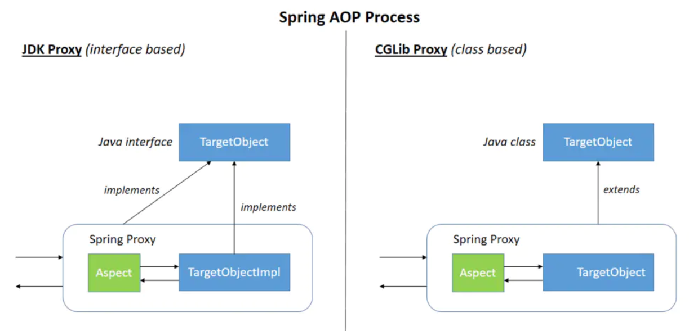

### 1. 什么是AOP

与OOP对比，AOP是处理一些==横切性问题==，这些横切性问题不会影响到主逻辑实现的，但是会散落到代码的各个部分，难以维护。

AOP就是把这些问题和主业务逻辑分开，达到与主业务逻辑解耦的目的。

  

### 2. AOP的应用场景

- 日志记录

- 权限验证

- 效率检查

- 事务管理


### 3. Spring AOP原理及其应用

#### 3.1 AOP相关概念

- **Aspect**(切面): 通常是一个类(交给Spring容器管理)，里面可以定义切入点和通知

- **JointPoint**(连接点): 程序执行过程中的一个点，如方法的执行或异常的处理

- **Advice**(通知): AOP在特定的切入点上执行的增强处理

  通知类型：

  - Before advice
  - After returning advice
  - After throwing advice
  - After (finally) advice
  - Around advice

  调用顺序：

  Around advice>Before advice>After (finally) advice>After returning advice/After throwing advice

- **Pointcut**(切入点):  连接点的集合  

- **Target object**(目标对象)：被通知对象

- **AOP proxy**：AOP框架创建的对象，代理就是目标对象的增强。

     -  JDK dynamic proxy
     - CGLIB proxy

  思考： 初始化时织入还是获取对象时织入?    

- **Weaving**(织入)：把代理逻辑加入到目标对象上的过程叫做织入


### 3.2 AOP的应用

#### 3.2.1 Spring AOP with AspectJ pointcuts

##### Schema-based AOP Support

xml配置对AOP支持的 后置处理器

```
AspectJAwareAdvisorAutoProxyCreator
AnnotationAwareAspectJAutoProxyCreator // 配置 <aop:aspectj-autoproxy/>
```


spring-aop.xml

```
<!-- 自动为spring容器中那些配置@AspectJ切面的bean创建代理，织入切面
	proxy-target-class默认为false，表示使用jdk动态代理织入增强，
	当配为true时，表示使用Cglib动态代理技术织入增强-->
<aop:aspectj-autoproxy proxy-target-class="true"/>

<aop:config>
    <!-- 配置切面-->
    <aop:aspect id="myAspect" ref="xmlAspect">
        <!-- 配置切入点-->
        <aop:pointcut id="businessService"
                      expression="execution(* com.wlz.dao.*.*(..))"/>
        <!-- 通知-->
        <aop:before pointcut-ref="businessService" method="before"/>
        <aop:after pointcut-ref="businessService" method="after"/>
    </aop:aspect>

</aop:config>

<bean id="xmlAspect" class="com.wlz.config.XmlAspect"/>

<bean id="foxDao" class="com.wlz.dao.FoxDao"/>
```

```java
public class XmlAspect {

	public void before(JoinPoint point) {
		System.out.println("before");
	}

	public void after() {
		System.out.println("after");
	}
}
```

##### @AspectJ support   

注解配置对AOP支持的 后置处理器

```
AnnotationAwareAspectJAutoProxyCreator
```

利用aspectj的注解

```java
@Configuration
@EnableAspectJAutoProxy
public class AppConfig {

}
```


```java
@Aspect
@Component
public class AspectConfig {

   //@Pointcut("execution(* com.wlz.dao.*.*(..))")
   //@Pointcut("within(com.wlz.dao.*)")
   //@Pointcut("args(String)")
   //@Pointcut("this(com.wlz.dao.FoxDao)")   // jdk动态代理 extend Proxy implements IFoxDao
   //@Pointcut("target(com.wlz.dao.FoxDao)")
   //@Pointcut("args(String ...) || args()")
   //@Pointcut("execution(* com.wlz.dao.*.*(String))")
   //@Pointcut("@annotation(com.wlz.anno.Yuanma)")
   //@Pointcut("@target(com.wlz.anno.Dao)")  // 目标是注解配置
   //@Pointcut("@within(com.wlz.anno.Dao)")
   //@Pointcut("@args(com.wlz.anno.Dao)") //传参类型配置@Dao的类型
   @Pointcut("bean(foxDao)")
   private void pointcut() {

   }


   @Before("pointcut()")
   public void before(JoinPoint point) {
      point.getThis();
      System.out.println("before");
   }

   @After("pointcut()")
   public void after() {
      System.out.println("after");
   }

   @AfterReturning("pointcut()")
   public void afterReturning() {
      System.out.println("afterReturning");
   }

   @AfterThrowing("pointcut()")
   public void afterThrwoing() {
      System.out.println("afterThrwoing");
   }

   @Around("pointcut()")
   public Object around(ProceedingJoinPoint point) throws Throwable {
      System.out.println("around");
      Object[] args = point.getArgs();
      for(int i=0;i<args.length;i++){
         System.out.println("====args:"+args[i]);
         if(args[i].getClass().equals(String.class)){
            args[i] += "xxxx";
         }
      }
      Object result = point.proceed(args);

      return result;
   }
}
```


#### 3.2.2 Spring  AOP with auto-proxy

##### BeanNameAutoProxyCreator

通过BeanNameAutoProxyCreator指定beanName 实现代理逻辑

```
//使用BeanNameAutoProxyCreator来创建代理
@Bean
public BeanNameAutoProxyCreator beanNameAutoProxyCreator(){
    BeanNameAutoProxyCreator beanNameAutoProxyCreator=new BeanNameAutoProxyCreator();
    //设置要创建代理的 beanNames
    beanNameAutoProxyCreator.setBeanNames("*Service");
    //设置拦截链名字(有先后顺序)   通知
    beanNameAutoProxyCreator.setInterceptorNames("aopMethodInterceptor");
    return beanNameAutoProxyCreator;
}
```

##### DefaultAdvisorAutoProxyCreator

根据Advisor的匹配机制自动创建代理，会对容器中所有的Advisor进行扫描，自动将这些切面应用到匹配的Bean中，实现类DefaultAdvisorAutoProxyCreator

```
@Bean
public NameMatchMethodPointcutAdvisor nameMatchMethodPointcutAdvisor(){
    NameMatchMethodPointcutAdvisor nameMatchMethodPointcutAdvisor=
        new NameMatchMethodPointcutAdvisor();
    // 方法级别
    nameMatchMethodPointcutAdvisor.setMappedNames("query*","find*");
    nameMatchMethodPointcutAdvisor.setAdvice(aopMethodInterceptor());
    return nameMatchMethodPointcutAdvisor;
}

@Bean
public DefaultAdvisorAutoProxyCreator defaultAdvisorAutoProxyCreator(){
    return new DefaultAdvisorAutoProxyCreator();
}
```


#### 3.2.3 pointcut的配置分析

##### 1.execution

```
execution(modifiers-pattern? ret-type-pattern declaring-type-pattern?name-pattern(param-pattern) throws-pattern?)

modifiers-pattern：方法的可见性，如public，protected；
ret-type-pattern：方法的返回值类型，如int，void等，必须配置；
declaring-type-pattern：方法所在类的全路径名，如com.wlz.dao.FoxDao；
name-pattern：方法名类型，如userService()，必须配置；
param-pattern：方法的参数类型，如java.lang.String，必须配置；
throws-pattern：方法抛出的异常类型，如java.lang.Exception；
```

方法级别的，广泛应用，ret-type-pattern和name-pattern(param-pattern) 是必须的

```java
@Pointcut("execution(* com.wlz.dao.*.*(..))")
```

##### 2.within

表达式的最小粒度为类

```java
@Pointcut("within(com.wlz.dao.*)")
```

##### 3.this

代理对象

```java
// jdk动态代理 基于接口 extend Proxy implements IFoxDao 只支持接口和Proxy
// cglib   基于继承，支持接口和目标类
@Pointcut("this(com.wlz.dao.FoxDao)") 
```

##### 4.target

目标对象

```java
@Pointcut("target(com.wlz.dao.FoxDao)")
```

##### 5.args

args表达式的作用是匹配指定参数类型和指定参数数量的方法,与包名和类名无关

```java
@Pointcut("args(String)")
@Pointcut("args(String ...) || args()")
```

##### 6.@target

目标对象有配置@Dao注解

```java
@Pointcut("@target(com.wlz.anno.Dao)")
```

##### 7.@args

传参类型配置@Dao的类型

```java
@Pointcut("@args(com.wlz.anno.Dao)") 
```

##### 8.@within

##### 9.@annotation

作用方法级别，配置@Yuanma

```java
@Pointcut("@annotation(com.wlz.anno.Yuanma)")
```

##### 10.bean

指定bean

```java
@Pointcut("bean(foxDao)")
@Pointcut("bean(*Service)")
```

注意: **上述所有的表达式可以混合使用,|| && !**

#### 3.2.4 Advice的使用

##### 通知类型

- Before adviceAfter
-  returning advice
- After throwing advice
- After (finally) advice
- Around advice


##### Proceedingjoinpoint 和JoinPoint

```
Proceedingjoinpoint 和JoinPoint的区别:
Proceedingjoinpoint 继承了JoinPoint,proceed()这个是aop代理链执行的方法。`

JoinPoint的方法
1.java.lang.Object[] getArgs()：获取连接点方法运行时的入参列表； 
2.Signature getSignature() ：获取连接点的方法签名对象； 
3.java.lang.Object getTarget() ：获取连接点所在的目标对象； 
4.java.lang.Object getThis() ：获取代理对象本身；

proceed()有重载,有个带参数的方法,可以修改目标方法的的参数
```


### 4. AOP的源码分析

源码分析： https://www.processon.com/view/link/5d1af6f0e4b0e96e79bb528e

核心接口&类

```
AopProxyFactory    //AOP代理工厂
AopProxy           //AOP代理  getProxy获取到代理对象     
AbstractAutoProxyCreator  // 代理对象的抽象后置处理器
    
```


在bean的initializeBean方法的applyBeanPostProcessorsAfterInitialization中调用

```
AbstractAutowireCapableBeanFactory#initializeBean(String, Object, RootBeanDefinition)
>
AbstractAutowireCapableBeanFactory#applyBeanPostProcessorsAfterInitialization
>
AbstractAutoProxyCreator#postProcessAfterInitialization
> 
AbstractAutoProxyCreator#wrapIfNecessary
> 
//创建代理对象
Object proxy = createProxy(
bean.getClass(), beanName, specificInterceptors, new SingletonTargetSource(bean));
```


通过AopProxyFactory获取AopProxy 

```
ProxyCreatorSupport#createAopProxy
>DefaultAopProxyFactory#createAopProxy

// JDK动态代理和Cglib的选择
if (config.isOptimize() || config.isProxyTargetClass() || hasNoUserSuppliedProxyInterfaces(config)) {
	Class<?> targetClass = config.getTargetClass();
	if (targetClass == null) {
		throw new AopConfigException("TargetSource cannot determine target class: 				" +"Either an interface or a target is required for proxy creation.");
	}
	if (targetClass.isInterface() || Proxy.isProxyClass(targetClass)) {
		return new JdkDynamicAopProxy(config);
	}
	return new ObjenesisCglibAopProxy(config);
}
else {
	return new JdkDynamicAopProxy(config);
}
```




##### JDK dynamic proxy

在Proxy这个类当中首先实例化一个对象ProxyClassFactory,然后在get方法中调用了apply方法,完成对代理类的创建

```
JdkDynamicAopProxy#getProxy(java.lang.ClassLoader)
> Proxy#newProxyInstance
> Proxy#getProxyClass0
proxyClassCache = new WeakCache<>(new KeyFactory(), new ProxyClassFactory());

>ProxyClassFactory#apply

// generateProxyClass: 通过反射收集字段和属性然后生成字节码
byte[] proxyClassFile = ProxyGenerator.generateProxyClass(
                proxyName, interfaces, accessFlags);
// defineClass0:  jvm内部完成对上述字节码的load
return defineClass0(loader, proxyName,
      proxyClassFile, 0, proxyClassFile.length);
```


##### CGLIB proxy

cglib封装了ASM这个开源框架,对字节码操作,完成对代理类的创建。主要通过集成目标对象,然后完成重写,再操作字节码。

```
org.springframework.aop.framework.CglibAopProxy#getProxy(java.lang.ClassLoader)
```


总结:

 cglib是通过继承来操作子类的字节码生成代理类,JDK是通过接口,然后利用java反射完成对类的动态创建，严格意义上来说cglib的效率高于JDK的反射,但是这种效率取决于代码功力,其实可以忽略不计