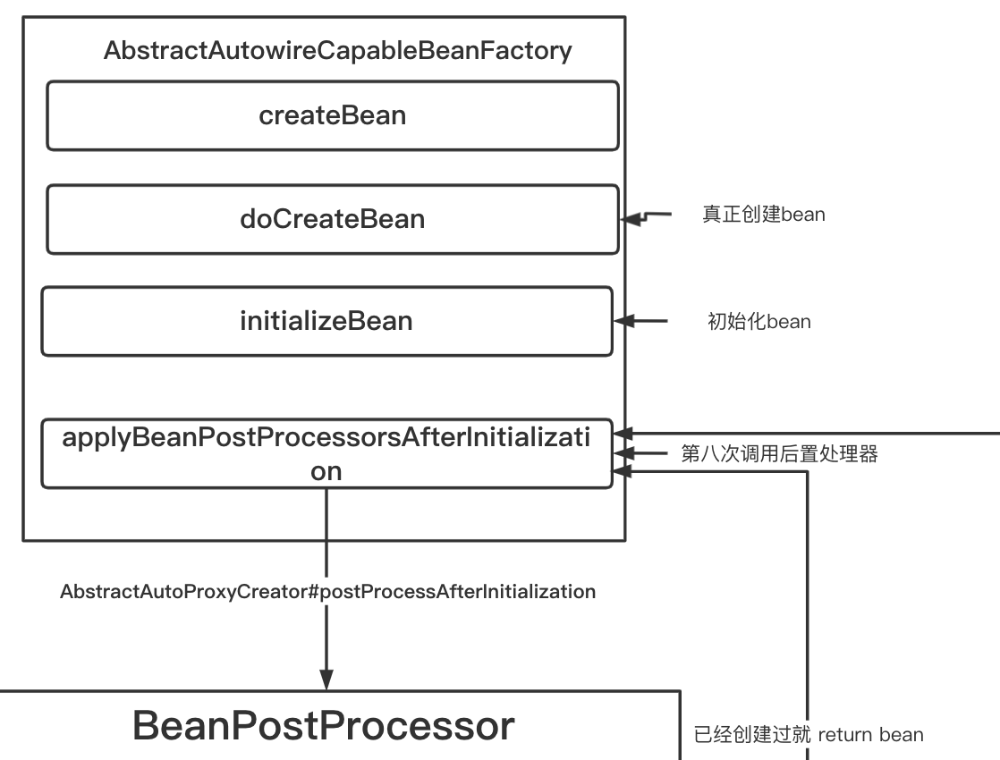

### 1. 什么是AOP

与OOP对比，AOP是处理一些==横切性问题==，这些横切性问题不会影响到主逻辑实现的，但是会散落到代码的各个部分，难以维护。

AOP就是把这些问题和主业务逻辑分开，达到与主业务逻辑解耦的目的。


### 2. AOP的应用场景

- 日志记录

- 权限验证

- 效率检查

- 事务管理


### 3. AOP、AspectJ、Spring AOP 

  AOP 要实现的是在我们原来写的代码的基础上，进行一定的包装，如在方法执行前、方法返回后、方法抛出异 常后等地方进行一定的拦截处理或者叫增强处理。

  AOP 的实现并不是因为 Java 提供了什么神奇的钩子，可以把方法的几个生命周期告诉我们，而是我们要实现 一个代理，实际运行的实例其实是生成的代理类的实例。

#### 3.1 AOP术语介绍 


  它是基于动态代理实现的。 默认的，如果使用接口，使用JDK动态代理实现，如果使用类，则使用CGLIB来实现。

  Spring 3.2 之后，spring-core 直接就把CGLIB 和 ASM 的源码包含进来了，所以就不需要显式引入这两个依赖。
  
  Spring 的IOC  容器和AOP 很重要，Spring IOC  需要依赖IOC 容器来管理。 

  Spring AOP  只能作用于Spring 容器中的Bean, 它是使用纯粹的java代码实现的，只能作用于bean的方法。

  Spring 提供了AspectJ 的支持，但只用到了AspectJ 的切点解析和匹配。

  Spring AOP  和AspectJ 的性能，Spring AOP 是基于代理实现的，在容器启动的时候需要生成代理，在方法调用上也会增加栈的深度，使得Spring 
  AOP  的性能不如AspectJ 那么好。

#### 3.2 AspectJ 

  AspectJ 来自于Eclipse 基金会。

   属于静态织入，它是通过修改代码来实现的，它的织入时机可以是: 

    Compile-time weaving: 编译期织入， 如类的A 使用AspectJ 添加一个属性，类B 引用了它，这个场景就需要编译期的时候就进行织入，否则没办法编译类B。 

    Post-compile weaving: 编译后织入，也就是已经生成了.class 文件，或已经打成jar 包了，这种情况需要增强处理，就得用到编译后织入。 

    Load-time weaving: 指的是在加载类的时候进行织入，要实现这个时期的织入，有几种方法. 
    
      1. 自定义类加载器来做，在被织入类加载到JVM 前对它进行加载，这样就可以在加载的时候定义行为。

      2. 在JVM 启动的时候指定 AspectJ 提供的agent: -javaagent:xxx/xxx/aspectjwaver.jar 

  AspectJ 能做很多Spring AOP  做不了的事情，它是AOP 编程的完全解决方案。Spring AOP  致力于解决的是企业级开发中最普遍的AOP需求
  (方法织入)， 而不是力求成为一个像AspectJ 一样的AOP编程完全解决方案。

  因为AspectJ在实际代码运行前完成了织入，所以说它生成的类是没有额外运行开销的。

#### 3.3 Spring AOP  

  这里说的Spring AOP是纯的Spring代码，和AspectJ没什么关系，但是Spring 沿用了AspectJ 中的概念，包括使用了AspectJ提供的jar包中的
  注解，但是不依赖于其实现功能. 
  
    后面说的 @Aspect、@Pointcut 、@Befor 、 @After 等注解都是来自于AspectJ, 但是功能的实现是纯Spring AOP自己实现的。 

  Spring AOP 的使用方法，目前Spring AOP  一共有三种配置方式，Spring 做到了很好的向下兼容。

    1. Spring 1.2 基于接口的配置：最早的Spring AOP 是完全基于几个接口的。

    2. Spring 2.o schema-based 配置: Spring 2.0 以后使用XML 的方式来配置，使用命名空间<aop></aop> 

    3. Spring 2.0 @AspectJ 配置: 使用注解的方式来配置，这种方式感觉是最方便的，还有，这里虽然加@AspectJ，但是和AspectJ 没有关系。

##### 3.3.1 Spring 1.2 中的配置 (基于接口的配置) 

###### 1. 定义需要被增强的类 

```java
@Component
public class MyCalculate implements Calculate{


  @Override
  public int add(int numA, int numB) {

    System.out.println("执行目标方法:add");
    return numA+numB;
  }

  @Override
  public int sub(int numA, int numB) {
    System.out.println("执行目标方法:reduce");
    return numA-numB;
  }

  @Override
  public int div(int numA, int numB) {
    System.out.println("执行目标方法:div");
    return numA/numB;
  }

  @Override
  public int multi(int numA, int numB) {
    System.out.println("执行目标方法:multi");

    return numA*numB;
  }

  @Override
  public int mod(int numA, int numB){
    System.out.println("执行目标方法:mod");

    int retVal = ((Calculate) AopContext.currentProxy()).add(numA,numB);
    //int retVal = this.add(numA,numB);

    return retVal%numA;

    //return numA%numB;
  }
}

```

###### 2. 定义advice 或Interceptor 

   这两个 Advice 分别用于方法调用前输出参数和方法调用后输出结果。

```java
public class MyLogAdvice implements MethodBeforeAdvice {
	@Override
	public void before(Method method, Object[] args, Object target) throws Throwable {
		String methodName = method.getName();

		System.out.println("执行目标方法《" + methodName + "》的前置通知，入参 " + Arrays.asList(args));
	}
}
```

```java
public class MyLogInterceptor implements MethodInterceptor {
	@Override
	public Object invoke(MethodInvocation invocation) throws Throwable {

		System.out.println(getClass() + " 调用方法前 。。。。");

		Object proceed = invocation.proceed();

		System.out.println(getClass() + " 调用方法后 。。。。");
		return proceed;
	}
}
```

###### 3. 创建配置类 

```java
public class EarlyAopConfig {

  /**
   *  被代理的对象
   * @return
   */
  @Bean
  public Calculate myCalculate() {
    return new MyCalculate();
  }

  /**
   *  Advice 方式
   * @return
   */
  @Bean
  public MyLogAdvice myLogAdvice() {
    return new MyLogAdvice();
  }

  /**
   *  Interceptor 方式，类似环绕通知
   * @return
   */
  @Bean
  public MyLogInterceptor myLogInterceptor() {
    return new MyLogInterceptor();
  }

  /**
   * FactoryBean方式单个： ProxyFactoryBean
   *
   * 此中方法有个致命的问题，如果我们只能指定单一的Bean的AOP，
   * 如果多个Bean需要创建多个ProxyFactoryBean 。
   * 而且，我们看到，我们的拦截器的粒度只控制到了类级别，类中所有的方法都进行了拦截。
   * 接下来，我们看看怎么样只拦截特定的方法。
   * @return
   */
  @Bean
  public ProxyFactoryBean calculateProxy() {
    ProxyFactoryBean userService = new ProxyFactoryBean();
    userService.setInterceptorNames("myLogAdvice", "myLogInterceptor");
    userService.setTarget(myCalculate());
    return userService;
  }

}
```

###### 4. 执行 （控制粒度到类）

```
public class MainStarter {

	public static void main(String[] args) {
		AnnotationConfigApplicationContext context = new AnnotationConfigApplicationContext(EarlyAopConfig.class);
		for (String beanDefinitionName : context.getBeanDefinitionNames()) {
			System.out.println(beanDefinitionName);
		}

		Calculate calculate = context.getBean("calculateProxy",Calculate.class);
		calculate.div(1,1);
		System.out.println("-----------------");
		calculate.add(1,2);

	}
}

// 结果
执行目标方法《div》的前置通知，入参 [1, 1]
class com.wlz.aop.earlyAop.MyLogInterceptor 调用方法前 。。。。
        执行目标方法:div
class com.wlz.aop.earlyAop.MyLogInterceptor 调用方法后 。。。。
        -----------------
        执行目标方法《add》的前置通知，入参 [1, 2]
class com.wlz.aop.earlyAop.MyLogInterceptor 调用方法前 。。。。
        执行目标方法:add
class com.wlz.aop.earlyAop.MyLogInterceptor 调用方法后 。。。。
```

   从结果可以看到，使用了责任链方式对advice和Interceptor都进行调用。这个例子理解起来应该非常简单，就是通过调 用FactoryBean的getObject方法创建一个代理实现。

   此中方法有个致命的问题，如果我们只能指定单一的Bean的AOP， 如果多个Bean需要创建多个ProxyFactoryBean 。而且，我们看到，我们的拦截器的粒度只控制到了类级别，类中所有的方法都进行了拦截。

###### 5. 只拦截特定的方法 

   在上面的配置中，配置拦截器的时候，interceptorNames 除了指定为 Advice，是还可以指定为 Interceptor 和 Advisor 的。

   这里我们来理解 Advisor 的概念，它也比较简单，它内部需要指定一个 Advice，Advisor 决定该拦截哪些方法，拦截 后需要完成的工作还是内部的 Advice 来做。

   它有好几个实现类，这里我们使用实现类 NameMatchMethodPointcutAdvisor 来演示，从名字上就可以看出来，它 需要我们给它提供方法名字，这样符合该配置的方法才会做拦截。

```java
public class EarlyAopConfig {
    
    @Bean
    public NameMatchMethodPointcutAdvisor myLogAspectAdvisor() {
      NameMatchMethodPointcutAdvisor advisor = new NameMatchMethodPointcutAdvisor();
      advisor.setAdvice(myLogAdvice());
      advisor.setAdvice(myLogInterceptor());
      advisor.setMappedNames("div");
      return advisor;
    }

    /**
     *  控制粒度到方法
     */
    @Bean
    public NameMatchMethodPointcutAdvisor myLogAspectAdvisor() {
      NameMatchMethodPointcutAdvisor advisor = new NameMatchMethodPointcutAdvisor();
      advisor.setAdvice(myLogAdvice());
//      advisor.setAdvice(myLogInterceptor());  // 如果再setAdvice 会覆盖
      advisor.setMappedNames("div");
      return advisor;
    }
}
```

###### 6. 执行结果 （控制粒度到方法）

```
public class MainStarter {

    public static void main(String[] args) {
      // 控制粒度到类
  //		test();
      // 控制粒度到方法
      test2();
  
    }
      
    public static void test2() {
      AnnotationConfigApplicationContext context = new AnnotationConfigApplicationContext(EarlyAopConfig.class);
      for (String beanDefinitionName : context.getBeanDefinitionNames()) {
        System.out.println(beanDefinitionName);
      }
  
      Calculate calculate = context.getBean("calculateProxy", Calculate.class);
      calculate.div(1, 1);
      System.out.println("-----------------");
      calculate.add(1, 2);
    }
    
// 结果输出: 
  执行目标方法《div》的前置通知，入参 [1, 1]
  执行目标方法:div
-----------------
  执行目标方法:add
}
```

  可以看到，calculateProxy 这个bean 配置了一个advisor ,advisor 内部有一个advice.advisor 负责匹配方法，内部的advice 负责实现方法包装。 

  mappedNames 可以指定多个，用逗号分割， 可以是不同类中的方法。相比直接指定advice ,advisor 实现更细粒度的控制，因为在这里可以配置advice的话。所以的方法都会拦截。

###### 7. autoproxy  之 BeanNameAutoProxyCreator 类

   说完了 Advice、Advisor、Interceptor 三个概念，相信大家应该很容易就看懂它们了。 
   
   它们有个共同的问题，那就是我们得为每个 bean 都配置一个代理，之后获取 bean 的时候需要获取这个代理类的 bean 实例(如 ctx.getBean("calculateProxy",Calculate.class))，
   这显然非常不方便，不利于我们之后要使用的自动根据类 型注入。下面介绍 autoproxy 的解决方案。

   autoproxy:从名字我们也可以看出来，它是实现自动代理，也就是说当 Spring 发现一个 bean 需要被切面织入的时候，
   Spring 会自动生成这个bean 的一个代理来拦截方法的执行，确保定义的切面能被执行。 
   
   这里强调自动，也就是说 Spring 会自动做这件事，而不用像前面介绍的，我们需要显式地指定代理类的 bean。 
   我们去掉原来的 ProxyFactoryBean 的配置，改为使用 BeanNameAutoProxyCreator 来配置:

```java
public class EarlyAopConfig {

	/**
	 *  被代理的对象
	 * @return
	 */
	@Bean
	public Calculate myCalculate() {
		return new MyCalculate();
	}

	/**
	 *  Advice 方式
	 * @return
	 */
	@Bean
	public MyLogAdvice myLogAdvice() {
		return new MyLogAdvice();
	}

	/**
	 *  Interceptor 方式，类似环绕通知
	 * @return
	 */
	@Bean
	public MyLogInterceptor myLogInterceptor() {
		return new MyLogInterceptor();
	}

	/**
	 *  自定 配置代理
	 * @return
	 */
    @Bean
    public BeanNameAutoProxyCreator autoProxyCreator() {
      BeanNameAutoProxyCreator beanNameAutoProxyCreator = new BeanNameAutoProxyCreator();
      // 设置要创建代理的那些bean 的名字
      beanNameAutoProxyCreator.setBeanNames("my*");
      // 设置拦截链的名字（有先后顺序）粒度到类
//		beanNameAutoProxyCreator.setInterceptorNames("myLogInterceptor","myLogAdvice");
      // 粒度到方法
      beanNameAutoProxyCreator.setInterceptorNames("myLogAspectAdvisor");
      return beanNameAutoProxyCreator;
    }

    /**
     *  控制粒度到方法
     */
    @Bean
    public NameMatchMethodPointcutAdvisor myLogAspectAdvisor() {
      NameMatchMethodPointcutAdvisor advisor = new NameMatchMethodPointcutAdvisor();
      advisor.setAdvice(myLogAdvice());
  //		advisor.setAdvice(myLogInterceptor()); // 如果再setAdvice 会覆盖
      advisor.setMappedNames("div");
      return advisor;
    }
}
```

  配置很简单，beanNames 中可以使用正则来匹配 bean 的名字来增强多个类。 也就是说不再是配置某个 bean 的代理 了。 

  这里的InterceptorNames 和前面的一样，也是可以配置成Advisor 和 Interceptor 的。

###### 8. 执行 （自动配置代理）

```java
public class MainStarter {

  public static void main(String[] args) {
    // 控制粒度到类
//		test();
    // 控制粒度到方法
//		test2();
    // 控制自动配置代理
    test3();
  }
  /**
   *  自定配置代理
   */
  public static void test3() {
    AnnotationConfigApplicationContext context = new AnnotationConfigApplicationContext(EarlyAopConfig.class);
    for (String beanDefinitionName : context.getBeanDefinitionNames()) {
      System.out.println(beanDefinitionName);
    }

    Calculate calculate = context.getBean("myCalculate", Calculate.class);
    calculate.div(1, 1);
    System.out.println("-----------------");
    calculate.add(1, 2);
  }
}
```

  我们在使用的时候，完全不需要关心代理了，直接使用原来的类型就可以了，这是非常方便的。 
  输出结果就是 myCalculate 中的每个方法都得到了拦截:

```
执行目标方法《div》的前置通知，入参 [1, 1]
执行目标方法:div
-----------------
执行目标方法:add
```

  到这里，是不是发现 BeanNameAutoProxyCreator 非常好用，它需要指定被拦截类名的模式(如 *ServiceImpl)，它可 以配置多次，这样就可以用来匹配不同模式的类了。

###### 9. autoproxy 之 RegexpMethodPointcutAdvisor、 DefaultBeanFactoryPointcutAdvisor 类

```java
public class EarlyAopConfig {

  /**
   *  被代理的对象
   * @return
   */
  @Bean
  public Calculate myCalculate() {
    return new MyCalculate();
  }

  /**
   *  Advice 方式
   * @return
   */
  @Bean
  public MyLogAdvice myLogAdvice() {
    return new MyLogAdvice();
  }

  /**
   *  Interceptor 方式，类似环绕通知
   * @return
   */
  @Bean
  public MyLogInterceptor myLogInterceptor() {
    return new MyLogInterceptor();
  }


  /******************************  test4()  **************************/

  /**
   *  BeanPostProcessor 自动扫描Advisor 方式 DefaultBeanFactoryPointcutAdvisor
   * @return
   */
  @Bean
  public DefaultBeanFactoryPointcutAdvisor autoProxyCreator() {
    return new DefaultBeanFactoryPointcutAdvisor();
  }

  /**
   *  定 配置代理  按正则 匹配类
   * @return
   */
  @Bean
  public RegexpMethodPointcutAdvisor myLogAspectInterceptor() {
    RegexpMethodPointcutAdvisor advisor = new RegexpMethodPointcutAdvisor();
    advisor.setAdvice(myLogInterceptor());
    advisor.setPattern("com.wlz.aop.MyCalculate.*");
    return advisor;

  }
}
```

   我们能通过配置 Advisor，精确定位到需要被拦截的方法，然后使用内部的 Advice 执行逻辑处理。

   之后，我们需要配置 DefaultAdvisorAutoProxyCreator，它的配置非常简单，直接使用下面这段配置就可以了，它 就会使得所有的 Advisor 自动生效，无须其他配置。
 
###### 10. 执行 (自动配置代理)  -- DefaultBeanFactoryPointcutAdvisor

```java
public class MainStarter {

  public static void main(String[] args) {
    // 控制粒度到类
//		test();
    // 控制粒度到方法
//		test2();
    // 控制自动配置代理
//		test3();
    // 按正则匹配类, 使用 DefaultBeanFactoryPointcutAdvisor 
    test4();
  }

  /**
   *  自定配置代理 按正则匹配类
   */
  public static void test4() {
    AnnotationConfigApplicationContext context = new AnnotationConfigApplicationContext(EarlyAopConfig.class);
    for (String beanDefinitionName : context.getBeanDefinitionNames()) {
      System.out.println(beanDefinitionName);
    }

    Calculate calculate = context.getBean("myCalculate", Calculate.class);
    calculate.div(1, 1);
    System.out.println("-----------------");
    calculate.add(1, 2);
  }
}
```

##### 3.3.2 Spring 2.0 @AspectJ 配置 AnnotationAwareAspectJAutoProxyCreator 后置处理器

###### 1. 创建配置类

```java
@Configuration
@ComponentScan("com.wlz.aop")
@EnableAspectJAutoProxy
public class AppConfig2 {

}
```

###### 2. 创建 切面 

```java
@Aspect
@Order
@Component
public class MyLogAspect {

	@Pointcut("execution(* com.wlz.aop.MyCalculate.*(..))")
    //@Pointcut("within(com.wlz.dao.*)")
    //@Pointcut("args(String)")
    //@Pointcut("this(com.wlz.dao.FoxDao)")   // jdk动态代理 extend Proxy implements IFoxDao
    //@Pointcut("target(com.wlz.dao.FoxDao)")
    //@Pointcut("args(String ...) || args()")
    //@Pointcut("execution(* com.wlz.dao.*.*(String))")
    //@Pointcut("@annotation(com.wlz.anno.Yuanma)")
    //@Pointcut("@target(com.wlz.anno.Dao)")  // 目标是注解配置
    //@Pointcut("@within(com.wlz.anno.Dao)")
    //@Pointcut("@args(com.wlz.anno.Dao)") //传参类型配置@Dao的类型
//    @Pointcut("bean(foxDao)")
	public void pointCut() {

	}


	@Before(value = "pointCut()")
	public void methodBefore(JoinPoint joinPoint) throws Throwable {
		String methodName = joinPoint.getSignature().getName();
		System.out.println("执行目标方法【"+methodName+"】的<前置通知>,入参"+ Arrays.asList(joinPoint.getArgs()));
	}

	@After(value = "pointCut()")
	public void methodAfter(JoinPoint joinPoint) {
		String methodName = joinPoint.getSignature().getName();
		System.out.println("执行目标方法【"+methodName+"】的<后置通知>,入参"+Arrays.asList(joinPoint.getArgs()));
	}

	@AfterReturning(value = "pointCut()",returning = "result")
	public void methodReturning(JoinPoint joinPoint, Object result) {
		String methodName = joinPoint.getSignature().getName();
		System.out.println("执行目标方法【"+methodName+"】的<返回通知>,入参"+Arrays.asList(joinPoint.getArgs()));
	}

	@AfterThrowing(value = "pointCut()")
	public void methodAfterThrowing(JoinPoint joinPoint) {
		String methodName = joinPoint.getSignature().getName();
		System.out.println("执行目标方法【"+methodName+"】的<异常通知>,入参"+Arrays.asList(joinPoint.getArgs()));
	}

	@Around(value = "pointCut()")
	public Object around(ProceedingJoinPoint point) throws Throwable {
		String methodName = point.getSignature().getName();
		System.out.println("执行目标方法【"+methodName+"】的<环绕通知>,入参"+Arrays.asList(point.getArgs()));
		Object[] args = point.getArgs();
		for(int i=0;i<args.length;i++){
			System.out.println("====args:"+args[i]);
			if(args[i].getClass().equals(String.class)){
				args[i] += "xxxx";
			}
		}

		// before
		Object result = point.proceed(args);

		// 处理逻辑
		System.out.println("执行目标方法【"+methodName+"】的<环绕通知>,结果"+ result.toString());
		return result;
	}
}
```

###### 3. 执行 

```java
public class MainStarter2 {

	public static void main(String[] args) {
		// @AspectJ 配置
		test1();
	}

	/**
	 * @AspectJ 配置
	 */
	public static void test1() {
		AnnotationConfigApplicationContext context = new AnnotationConfigApplicationContext(AppConfig2.class);
		for (String beanDefinitionName : context.getBeanDefinitionNames()) {
			System.out.println(beanDefinitionName);
		}

		Calculate calculate = context.getBean("myCalculate",Calculate.class);
		calculate.div(1,1);
	}
}
```

###### 4. 结果 

```
执行目标方法【div】的<环绕通知>,入参[1, 1]
====args:1
====args:1
执行目标方法【div】的<前置通知>,入参[1, 1]
执行目标方法:div
执行目标方法【div】的<环绕通知>,结果1
执行目标方法【div】的<后置通知>,入参[1, 1]
执行目标方法【div】的<返回通知>,入参[1, 1]
```

##### 3.3.3 Spring 2.0 schema-based 配置  AspectJAwareAdvisorAutoProxyCreator 后置处理器 

xml配置对AOP支持的 后置处理器

```
AspectJAwareAdvisorAutoProxyCreator
AnnotationAwareAspectJAutoProxyCreator // 配置 <aop:aspectj-autoproxy/>
```


###### 1. 创建配置文件

```
<?xml version="1.0" encoding="UTF-8"?>
<beans xmlns="http://www.springframework.org/schema/beans"
       xmlns:xsi="http://www.w3.org/2001/XMLSchema-instance"
	   xmlns:aop="http://www.springframework.org/schema/aop"
       xsi:schemaLocation="http://www.springframework.org/schema/beans
       http://www.springframework.org/schema/beans/spring-beans.xsd
       http://www.springframework.org/schema/aop
       https://www.springframework.org/schema/aop/spring-aop.xsd
		">

	<!-- 自动为spring容器中那些配置@AspectJ切面的bean创建代理，织入切面
	proxy-target-class默认为false，表示使用jdk动态代理织入增强，
	当配为true时，表示使用Cglib动态代理技术织入增强-->
	<aop:aspectj-autoproxy proxy-target-class="true"/>

	<aop:config>
		<!-- 配置切面-->
		<aop:aspect id="myLogXmlAspect" ref="xmlAspect">
			<!-- 配置切入点-->
			<aop:pointcut id="businessService"
						  expression="execution(* com.wlz.aop.*.*(..))"/>
			<!-- 通知-->
			<aop:before pointcut-ref="businessService" method="methodBefore"/>
			<aop:after pointcut-ref="businessService" method="methodAfter"/>
			<aop:after-returning pointcut-ref="businessService" returning="result" method="methodReturning"/>
			<aop:after-throwing pointcut-ref="businessService" method="methodAfterThrowing"/>
			<aop:around pointcut-ref="businessService" method="methodAround"/>
		</aop:aspect>

	</aop:config>

	<bean id="xmlAspect" class="com.wlz.aop.MyLogXmlAspect"/>

	<bean id="myCalculate" class="com.wlz.aop.MyCalculate"/>

</beans>
```

###### 2. 创建切面 

```java
public class MyLogXmlAspect {


	public void methodBefore(JoinPoint joinPoint) throws Throwable {
		String methodName = joinPoint.getSignature().getName();
		System.out.println("执行目标方法【"+methodName+"】的<前置通知>,入参"+ Arrays.asList(joinPoint.getArgs()));
	}

	public void methodAfter(JoinPoint joinPoint) {
		String methodName = joinPoint.getSignature().getName();
		System.out.println("执行目标方法【"+methodName+"】的<后置通知>,入参"+ Arrays.asList(joinPoint.getArgs()));
	}

	public void methodReturning(JoinPoint joinPoint, Object result) {
		String methodName = joinPoint.getSignature().getName();
		System.out.println("执行目标方法【"+methodName+"】的<返回通知>,入参"+Arrays.asList(joinPoint.getArgs()));
	}

	public void methodAfterThrowing(JoinPoint joinPoint) {
		String methodName = joinPoint.getSignature().getName();
		System.out.println("执行目标方法【"+methodName+"】的<异常通知>,入参"+Arrays.asList(joinPoint.getArgs()));
	}

	public Object methodAround(ProceedingJoinPoint point) throws Throwable {
		String methodName = point.getSignature().getName();
		System.out.println("执行目标方法【"+methodName+"】的<环绕通知>,入参"+Arrays.asList(point.getArgs()));
		Object[] args = point.getArgs();
		for(int i=0;i<args.length;i++){
			System.out.println("====args:"+args[i]);
			if(args[i].getClass().equals(String.class)){
				args[i] += "xxxx";
			}
		}

		// before
		Object result = point.proceed(args);

		// 处理逻辑
		System.out.println("执行目标方法【"+methodName+"】的<环绕通知>,结果"+ result.toString());
		return result;
	}

}
```

###### 3. 执行 

```java
public class MainStarter2 {

	public static void main(String[] args) {
		//  xml 配置
		test2();
	}

    /**
     *  xml 配置 
     */
	public static void test2(){
		ClassPathXmlApplicationContext context =
				new ClassPathXmlApplicationContext("spring-aop1.xml");
		for (String beanDefinitionName : context.getBeanDefinitionNames()) {
			System.out.println(beanDefinitionName);
		}

		Calculate calculate = context.getBean("myCalculate",Calculate.class);
		calculate.div(1,1);

	}

}
```

###### 4. 结果

```
执行目标方法【div】的<前置通知>,入参[1, 1]
执行目标方法【div】的<环绕通知>,入参[1, 1]
====args:1
====args:1
执行目标方法:div
执行目标方法【div】的<环绕通知>,结果1
执行目标方法【div】的<返回通知>,入参[1, 1]
执行目标方法【div】的<后置通知>,入参[1, 1]
```

#### 3.4 Spring  AOP  pointcut 的配置分析

##### 1.execution

```
execution(modifiers-pattern? ret-type-pattern declaring-type-pattern?name-pattern(param-pattern) throws-pattern?)

modifiers-pattern：方法的可见性，如public，protected；
ret-type-pattern：方法的返回值类型，如int，void等，必须配置；
declaring-type-pattern：方法所在类的全路径名，如com.wlz.dao.FoxDao；
name-pattern：方法名类型，如userService()，必须配置；
param-pattern：方法的参数类型，如java.lang.String，必须配置；
throws-pattern：方法抛出的异常类型，如java.lang.Exception；
```

方法级别的，广泛应用，ret-type-pattern和name-pattern(param-pattern) 是必须的

```java
@Pointcut("execution(* com.wlz.dao.*.*(..))")
```

##### 2.within

表达式的最小粒度为类

```java
@Pointcut("within(com.wlz.dao.*)")
```

##### 3.this

代理对象

```java
// jdk动态代理 基于接口 extend Proxy implements IFoxDao 只支持接口和Proxy
// cglib   基于继承，支持接口和目标类
@Pointcut("this(com.wlz.dao.FoxDao)") 
```

##### 4.target

目标对象

```java
@Pointcut("target(com.wlz.dao.FoxDao)")
```

##### 5.args

args表达式的作用是匹配指定参数类型和指定参数数量的方法,与包名和类名无关

```java
@Pointcut("args(String)")
@Pointcut("args(String ...) || args()")
```

##### 6.@target

目标对象有配置@Dao注解

```java
@Pointcut("@target(com.wlz.anno.Dao)")
```

##### 7.@args

传参类型配置@Dao的类型

```java
@Pointcut("@args(com.wlz.anno.Dao)") 
```

##### 8.@within

##### 9.@annotation

作用方法级别，配置@Yuanma

```java
@Pointcut("@annotation(com.wlz.anno.Yuanma)")
```

##### 10.bean

指定bean

```java
@Pointcut("bean(foxDao)")
@Pointcut("bean(*Service)")
```

注意: **上述所有的表达式可以混合使用,|| && !**

#### 3.5 Advice的使用

##### 1. 通知类型

- Before adviceAfter
-  returning advice
- After throwing advice
- After (finally) advice
- Around advice


##### 2. Proceedingjoinpoint 和JoinPoint

```
Proceedingjoinpoint 和JoinPoint的区别:
Proceedingjoinpoint 继承了JoinPoint,proceed()这个是aop代理链执行的方法。`

JoinPoint的方法
1.java.lang.Object[] getArgs()：获取连接点方法运行时的入参列表； 
2.Signature getSignature() ：获取连接点的方法签名对象； 
3.java.lang.Object getTarget() ：获取连接点所在的目标对象； 
4.java.lang.Object getThis() ：获取代理对象本身；

proceed()有重载,有个带参数的方法,可以修改目标方法的的参数
```

#### 3.6 Spring AOP 的相关概念

- **Aspect**(切面): 通常是一个类(交给Spring容器管理)，里面可以定义切入点和通知

- **JointPoint**(连接点): 程序执行过程中的一个点，如方法的执行或异常的处理

- **Advice**(通知): AOP在特定的切入点上执行的增强处理

  通知类型：

  - Before advice
  - After returning advice
  - After throwing advice
  - After (finally) advice
  - Around advice

  调用顺序：

  Around advice>Before advice>After (finally) advice>After returning advice/After throwing advice

- **Pointcut**(切入点):  连接点的集合

- **Target object**(目标对象)：被通知对象

- **AOP proxy**：AOP框架创建的对象，代理就是目标对象的增强。

  -  JDK dynamic proxy
  - CGLIB proxy

  思考： 初始化时织入还是获取对象时织入?

- **Weaving**(织入)：把代理逻辑加入到目标对象上的过程叫做织入


### 4. Spring AOP 的源码分析

  Spring 中的aop 是通过动态代理实现的，那么具体是怎么实现的呢？ 

  Spring 通过一个切面类，在他的类上加入 @Aspect 注解，定义一个PointCut 方法,最后定义一系列的增强方法(@Before、@After 等)。 
  这样就完成了一个切面的操作。 

  实现aop 大致有以下思路: 

    1. 找到所有的切面类
    2. 解析出所有的advice 并保存。
    3. 创建一个动态代理类
    4. 调用被代理类的方法时，找到它的所有增强器，并增强当前方法。


#### 4.1 切面类的解析 

  Spring 通过@EnableAspectJAutoProxy 开启aop 切面，在注解类上发现 @Import(AspectJAutoProxyRegistrar.class),
  AspectJAutoProxyRegistrar 实现了 ImportBeanDefinitionRegistrar，所以会通过 registerBeanDefinitions 方法注册bean 定义。


##### 4.1.1 进入解析过程: 


postProcessBeforeInstantiation 是在任意bean 创建的时候就调用了 
  
    org.springframework.beans.factory.support.AbstractAutowireCapableBeanFactory#resolveBeforeInstantiation
    org.springframework.beans.factory.support.AbstractAutowireCapableBeanFactory#applyBeanPostProcessorsBeforeInstantiation
    org.springframework.beans.factory.config.InstantiationAwareBeanPostProcessor#postProcessBeforeInstantiation
    org.springframework.aop.framework.autoproxy.AbstractAutoProxyCreator#postProcessBeforeInstantiation

###### 1. AOP切面解析详细流程图： 

    https://www.processon.com/apps/5f02929e7d9c0844204bcb59

###### 2. 追踪一下源码 

   追踪源码可以看到最终导入AnnotationAwareAspectJAutoProxyCreator, 看一下他的类继承关系图，发现它实现了两个重要 的接口，BeanPostProcessor和InstantiationAwareBeanPostProcessor

   首先看InstantiationAwareBeanPostProcessor的postProcessBeforeInstantiation方法 

    org.springframework.aop.framework.autoproxy.AbstractAutoProxyCreator#postProcessBeforeInstantiation
    org.springframework.aop.aspectj.autoproxy.AspectJAwareAdvisorAutoProxyCreator#shouldSkip
    org.springframework.aop.aspectj.annotation.AnnotationAwareAspectJAutoProxyCreator#findCandidateAdvisors
    org.springframework.aop.aspectj.annotation.BeanFactoryAspectJAdvisorsBuilder#buildAspectJAdvisors

```
public List<Advisor> buildAspectJAdvisors() {
		// 获取缓存中的 aspectBeanNames
		List<String> aspectNames = this.aspectBeanNames;

		if (aspectNames == null) {
			synchronized (this) {
				aspectNames = this.aspectBeanNames;
				if (aspectNames == null) {
					// 保存所有通知的集合
					List<Advisor> advisors = new ArrayList<>();
					// 保存切面的名称的集合
					aspectNames = new ArrayList<>();
					/**
					 *  aop功能中在这里传入的是Object.class，代表去容器中获取所有的组件的名称，然后一一的进行遍历，
					 *  这个过程是十分消耗性能的，所以spring会在这里加入了保存切面
					 *  但是事务功能不一样，事务模块的功能是直接去容器中获取Advisor 类型，现在范围小，
					 *  spring 在事务模块中没有加入缓存来保存我们的事务相关的advisor
					 */
					String[] beanNames = BeanFactoryUtils.beanNamesForTypeIncludingAncestors(
							this.beanFactory, Object.class, true, false);
					// 遍历从IOC 容器中获取的所有bean 的名称
					for (String beanName : beanNames) {
						if (!isEligibleBean(beanName)) {
							continue;
						}
						// We must be careful not to instantiate beans eagerly as in this case they
						// would be cached by the Spring container but would not have been weaved.
						// 通过beanName 去容器中获取到对应的class 对象
						Class<?> beanType = this.beanFactory.getType(beanName);
						if (beanType == null) {
							continue;
						}
						// 判断 bean 是否 有 @AspectJ 注解， 也就是是不是切面类
						if (this.advisorFactory.isAspect(beanType)) {
							// 是切面类，加入缓存
							aspectNames.add(beanName);
							// 把beanName 和 class 对象构建成为一个AspectMetadata
							AspectMetadata amd = new AspectMetadata(beanType, beanName);
							if (amd.getAjType().getPerClause().getKind() == PerClauseKind.SINGLETON) {
								// 构建切面注解的实例工厂
								MetadataAwareAspectInstanceFactory factory =
										new BeanFactoryAspectInstanceFactory(this.beanFactory, beanName);
								// 解析 @Before @After 注解 ，封装成 Advisor 类
								// 真正的去获取我们的通知对象
								List<Advisor> classAdvisors = this.advisorFactory.getAdvisors(factory);
								if (this.beanFactory.isSingleton(beanName)) {
									// 加入到缓存中
									this.advisorsCache.put(beanName, classAdvisors);
								}
								else {
									this.aspectFactoryCache.put(beanName, factory);
								}
								advisors.addAll(classAdvisors);
							}
							else {
								// Per target or per this.
								if (this.beanFactory.isSingleton(beanName)) {
									throw new IllegalArgumentException("Bean with name '" + beanName +
											"' is a singleton, but aspect instantiation model is not singleton");
								}
								MetadataAwareAspectInstanceFactory factory =
										new PrototypeAspectInstanceFactory(this.beanFactory, beanName);
								this.aspectFactoryCache.put(beanName, factory);
								advisors.addAll(this.advisorFactory.getAdvisors(factory));
							}
						}
					}
					this.aspectBeanNames = aspectNames;
					return advisors;
				}
			}
		}

		if (aspectNames.isEmpty()) {
			return Collections.emptyList();
		}
		List<Advisor> advisors = new ArrayList<>();
		for (String aspectName : aspectNames) {
			// 当再次进入，会直接从advisorsCaChe 缓存中获取 
			List<Advisor> cachedAdvisors = this.advisorsCache.get(aspectName);
			if (cachedAdvisors != null) {
				advisors.addAll(cachedAdvisors);
			}
			else {
				MetadataAwareAspectInstanceFactory factory = this.aspectFactoryCache.get(aspectName);
				advisors.addAll(this.advisorFactory.getAdvisors(factory));
			}
		}
		return advisors;
	}

```

###### 3. 调用后置处理器，并进入解析入口流程图 


###### 4. 解析步骤 


#### 4.2 创建代理 


   postProcessAfterInitialization是在bean创建完成之后执行的(也就是执行初始化时，调用第八次bean 的后置处理器时):

    org.springframework.beans.factory.support.AbstractAutowireCapableBeanFactory#doCreateBean
    org.springframework.beans.factory.support.AbstractAutowireCapableBeanFactory#initializeBean
    org.springframework.beans.factory.support.AbstractAutowireCapableBeanFactory#applyBeanPostProcessorsAfterInitialization
    org.springframework.beans.factory.config.BeanPostProcessor#postProcessAfterInitialization
    org.springframework.aop.framework.autoproxy.AbstractAutoProxyCreator#postProcessAfterInitialization



###### 1. AOP创建动态代理详细流程图：

  https://www.processon.com/apps/5f02929e7d9c0844204bcb59

###### 2. 获取advisor  


  创建代理之前首先要判断当前bean是否满足被代理， 所以需要将advisor从之前的缓存中拿出来和当前bean 根据表达式进行匹配:

    org.springframework.aop.framework.autoproxy.AbstractAutoProxyCreator#postProcessAfterInitialization
    org.springframework.aop.framework.autoproxy.AbstractAutoProxyCreator#wrapIfNecessary
    org.springframework.aop.framework.autoproxy.AbstractAdvisorAutoProxyCreator#getAdvicesAndAdvisorsForBean
    org.springframework.aop.framework.autoproxy.AbstractAdvisorAutoProxyCreator#findEligibleAdvisors

   上述代码的链路最终到了findCandidateAdvisors，我们发现在postProcessBeforeInstantiation方法中对查找到的Advisors做了缓存， 所以这里只需要从缓存中取就好了
   最后创建代理类，并将Advisors赋予代理类，缓存当前的代理类

###### 3. 匹配 


  根据advisors和当前的bean根据切点表达式进行匹配，看是否符合。

    org.springframework.aop.framework.autoproxy.AbstractAdvisorAutoProxyCreator#findAdvisorsThatCanApply
    org.springframework.aop.support.AopUtils#findAdvisorsThatCanApply
    org.springframework.aop.support.AopUtils#canApply  拿到 PointCut 
    org.springframework.aop.ClassFilter#matches   粗筛
    org.springframework.aop.IntroductionAwareMethodMatcher#matches  精筛

###### 4. 创建代理 

  找到了 和当前Bean匹配的advisor说明满足创建动态代理的条件:


```
Object proxy = createProxy(
					bean.getClass(), beanName, specificInterceptors, new SingletonTargetSource(bean));
```


#### 4.3 代理类的调用

   spring将找到的增强器Advisors赋予了代理类，那么在执行只要将这些增强器应用到被代理的类上面就可以了，
   那么 spring具体是怎么实现的呢，下面我们以jdk代理为例分析一下源码:

https://www.processon.com/apps/5f02929e7d9c0844204bcb59

##### 4.3.1. 调用 jdk 的 invoke 方法

```java
final class JdkDynamicAopProxy implements AopProxy, InvocationHandler, Serializable {
  public Object invoke(Object proxy, Method method, Object[] args) throws Throwable {
    Object oldProxy = null;
    boolean setProxyContext = false;

    // 获取当前被代理类
    TargetSource targetSource = this.advised.targetSource;
    Object target = null;
    // equals hashCode等方法不做代理，直接调用
    try {
      if (!this.equalsDefined && AopUtils.isEqualsMethod(method)) {
        // The target does not implement the equals(Object) method itself.
        return equals(args[0]);
      } else if (!this.hashCodeDefined && AopUtils.isHashCodeMethod(method)) {
        // The target does not implement the hashCode() method itself.
        return hashCode();
      } else if (method.getDeclaringClass() == DecoratingProxy.class) {
        // There is only getDecoratedClass() declared -> dispatch to proxy config.
        return AopProxyUtils.ultimateTargetClass(this.advised);
      } else if (!this.advised.opaque && method.getDeclaringClass().isInterface() &&
              method.getDeclaringClass().isAssignableFrom(Advised.class)) {
        // Service invocations on ProxyConfig with the proxy config...
        return AopUtils.invokeJoinpointUsingReflection(this.advised, method, args);
      }

      Object retVal;
      // 将代理对象放到线程本地变量中
      if (this.advised.exposeProxy) {
        // Make invocation available if necessary.
        oldProxy = AopContext.setCurrentProxy(proxy);
        setProxyContext = true;
      }

      // Get as late as possible to minimize the time we "own" the target,
      // in case it comes from a pool.
      target = targetSource.getTarget();
      Class<?> targetClass = (target != null ? target.getClass() : null);

      // Get the interception chain for this method.
      // 将 增强器转换为方法执行拦截器链
      List<Object> chain = this.advised.getInterceptorsAndDynamicInterceptionAdvice(method, targetClass);

      // Check whether we have any advice. If we don't, we can fallback on direct
      // reflective invocation of the target, and avoid creating a MethodInvocation.
      if (chain.isEmpty()) {
        // We can skip creating a MethodInvocation: just invoke the target directly
        // Note that the final invoker must be an InvokerInterceptor so we know it does
        // nothing but a reflective operation on the target, and no hot swapping or fancy proxying.
        Object[] argsToUse = AopProxyUtils.adaptArgumentsIfNecessary(method, args);
        retVal = AopUtils.invokeJoinpointUsingReflection(target, method, argsToUse);
      } else {
        // We need to create a method invocation...
        // 我们需要创建一个方法调用
        // 将拦截器链包装为ReflectiveMethodInvocation 并执行
        MethodInvocation invocation =
                new ReflectiveMethodInvocation(proxy, target, method, args, targetClass, chain);
        // Proceed to the joinpoint through the interceptor chain.
        // 通过拦截器链进入连接点。
        retVal = invocation.proceed();
      }

      // Massage return value if necessary.
      Class<?> returnType = method.getReturnType();
      if (retVal != null && retVal == target &&
              returnType != Object.class && returnType.isInstance(proxy) &&
              !RawTargetAccess.class.isAssignableFrom(method.getDeclaringClass())) {
        // Special case: it returned "this" and the return type of the method
        // is type-compatible. Note that we can't help if the target sets
        // a reference to itself in another returned object.
        retVal = proxy;
      } else if (retVal == null && returnType != Void.TYPE && returnType.isPrimitive()) {
        throw new AopInvocationException(
                "Null return value from advice does not match primitive return type for: " + method);
      }
      return retVal;
    } finally {
      if (target != null && !targetSource.isStatic()) {
        // Must have come from TargetSource.
        targetSource.releaseTarget(target);
      }
      if (setProxyContext) {
        // Restore old proxy.
        AopContext.setCurrentProxy(oldProxy);
      }
    }
  }
}
```

  通过上面代码可知，将增强器装换为方法拦截器链，最终包装为ReflectiveMethodInvocation执行它的proceed方法，
  那么我们就来看下 具体如何执行

##### 4.3.2 . 执行 ReflectiveMethodInvocation 的 proceed 方法 

  这里用了责任链的设计模式，递归调用排序好的拦截器链

```java
public class ReflectiveMethodInvocation implements ProxyMethodInvocation, Cloneable {
  public Object proceed() throws Throwable {
    //	We start with an index of -1 and increment early.
    // 当执行到最后一个拦截器的时候才会进入 
    if (this.currentInterceptorIndex == this.interceptorsAndDynamicMethodMatchers.size() - 1) {
      return invokeJoinpoint();
    }

    // 获取集合当前需要运行的拦截器
    Object interceptorOrInterceptionAdvice =
            this.interceptorsAndDynamicMethodMatchers.get(++this.currentInterceptorIndex);
    if (interceptorOrInterceptionAdvice instanceof InterceptorAndDynamicMethodMatcher) {
      // Evaluate dynamic method matcher here: static part will already have
      // been evaluated and found to match.
      InterceptorAndDynamicMethodMatcher dm =
              (InterceptorAndDynamicMethodMatcher) interceptorOrInterceptionAdvice;
      Class<?> targetClass = (this.targetClass != null ? this.targetClass : this.method.getDeclaringClass());
      if (dm.methodMatcher.matches(this.method, targetClass, this.arguments)) {
        return dm.interceptor.invoke(this);
      } else {
        // Dynamic matching failed.
        // Skip this interceptor and invoke the next in the chain.
        // 执行拦截器方法
        return proceed();
      }
    } else {
      // It's an interceptor, so we just invoke it: The pointcut will have
      // been evaluated statically before this object was constructed.
      return ((MethodInterceptor) interceptorOrInterceptionAdvice).invoke(this);
    }
  }
}
```

##### 4.3.3 执行各个通知的 MethodInterceptor#invoke 方法

###### 1. org.springframework.aop.interceptor.ExposeInvocationInterceptor#invoke

```java
public final class ExposeInvocationInterceptor implements MethodInterceptor, PriorityOrdered, Serializable {
  public Object invoke(MethodInvocation mi) throws Throwable {
    MethodInvocation oldInvocation = invocation.get();
    invocation.set(mi);
    try {
      return mi.proceed();
    } finally {
      invocation.set(oldInvocation);
    }
  }
}
```

###### 2. org.springframework.aop.aspectj.AspectJAfterThrowingAdvice#invoke 异常拦截器，当方法调用异常会被执行

```java
public class AspectJAfterThrowingAdvice extends AbstractAspectJAdvice
        implements MethodInterceptor, AfterAdvice, Serializable {
  @Override
  public Object invoke(MethodInvocation mi) throws Throwable {
    try {
      return mi.proceed();
    } catch (Throwable ex) {
      if (shouldInvokeOnThrowing(ex)) {
        invokeAdviceMethod(getJoinPointMatch(), null, ex);
      }
      throw ex;
    }
  }
}
```

###### 3. org.springframework.aop.framework.adapter.AfterReturningAdviceInterceptor#invoke 返回拦截器，方法执行失败，不会调用

```java
public class AfterReturningAdviceInterceptor implements MethodInterceptor, AfterAdvice, Serializable {
  public Object invoke(MethodInvocation mi) throws Throwable {
    Object retVal = mi.proceed();
    this.advice.afterReturning(retVal, mi.getMethod(), mi.getArguments(), mi.getThis());
    return retVal;
  }
}
```

###### 4. org.springframework.aop.aspectj.AspectJAfterAdvice#invoke 后置拦截器，总是执行

```java
public class AspectJAfterAdvice extends AbstractAspectJAdvice
        implements MethodInterceptor, AfterAdvice, Serializable {
  public Object invoke(MethodInvocation mi) throws Throwable {
    try {
      return mi.proceed();
    } finally {
      invokeAdviceMethod(getJoinPointMatch(), null, null);
    }
  }
}
```

###### 5. org.springframework.aop.framework.adapter.MethodBeforeAdviceInterceptor#invoke 前置拦截器

```java
public class MethodBeforeAdviceInterceptor implements MethodInterceptor, BeforeAdvice, Serializable {
  public Object invoke(MethodInvocation mi) throws Throwable {
    this.advice.before(mi.getMethod(), mi.getArguments(), mi.getThis());
    return mi.proceed();
  }
}
```

###### 6. org.springframework.aop.aspectj.AspectJAroundAdvice#invoke 环绕通知 

```java
public class AspectJAroundAdvice extends AbstractAspectJAdvice implements MethodInterceptor, Serializable {
  public Object invoke(MethodInvocation mi) throws Throwable {
    if (!(mi instanceof ProxyMethodInvocation)) {
      throw new IllegalStateException("MethodInvocation is not a Spring ProxyMethodInvocation: " + mi);
    }
    ProxyMethodInvocation pmi = (ProxyMethodInvocation) mi;
    ProceedingJoinPoint pjp = lazyGetProceedingJoinPoint(pmi);
    JoinPointMatch jpm = getJoinPointMatch(pmi);
    return invokeAdviceMethod(pjp, jpm, null, null);
  }
}
```


### 5. 总结:

 cglib是通过继承来操作子类的字节码生成代理类,JDK是通过接口,然后利用java反射完成对类的动态创建，严格意义上来说cglib的效率高于JDK的反射,但是这种效率取决于代码功力,其实可以忽略不计