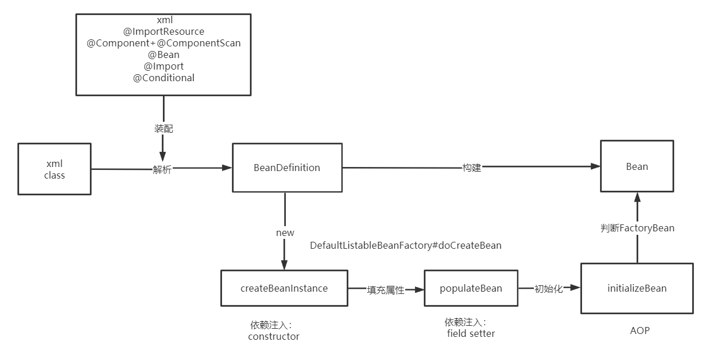
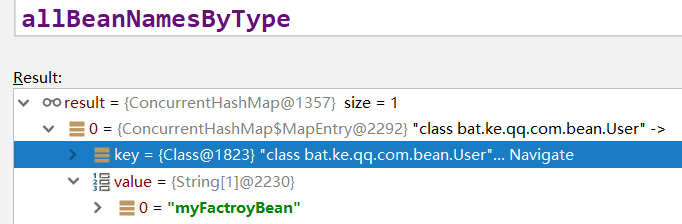

### Spring整体架构
   
   

### IoC容器的设计理念
   
   
   
   **IoC**(Inversion of Control) 也称为**依赖注入**(dependency injection, DI)。它是一个==对象定义依赖关系的过程==，也就是说，对象只通过构造函数参数、工厂方法的参数或对象实例构造或从工厂方法返回后在对象实例上设置的属性来定义它们所使用的其他对象。然后==容器在创建bean时注入这些依赖项==。这个过程基本上是bean的逆过程，因此称为**控制反转**(IoC)
   
   在Spring中，构成应用程序主干并由Spring IoC容器管理的对象称为**bean**。bean是由Spring IoC容器实例化、组装和管理的对象。
   
   IoC容器设计理念：通过容器统一对象的构建方式，并且自动维护对象的依赖关系。
   
   
   
   https://www.processon.com/view/link/5cd10507e4b085d010929d02
   
### IoC的应用
   
   

#### bean 的装配方式

   1.xml
   
   2.@ImportResource
   
   3.@Component +@ComponentScan
   
   4.@Bean+ @Configuration
   
   5.@Import
   
   6.@Conditional
   
##### xml
```
<?xml version="1.0" encoding="UTF-8"?>
<beans xmlns="http://www.springframework.org/schema/beans"
       xmlns:xsi="http://www.w3.org/2001/XMLSchema-instance"
       xsi:schemaLocation="http://www.springframework.org/schema/beans
        https://www.springframework.org/schema/beans/spring-beans.xsd">

    <bean id="user"  class="com.wlz.bean.User"/>
</beans>
```
 容器加载xml
```
ApplicationContext context = new ClassPathXmlApplicationContext("spring.xml");
for(String beanName:context.getBeanDefinitionNames()){
			System.out.println(beanName+":  "+context.getBean(beanName));
}
```

#####  @ImportResource
```
@ImportResource("spring.xml")
public class AppConfig {

}
```
 容器加载@ImportResource
```
ApplicationContext context = new AnnotationConfigApplicationContext(AppConfig.class);
for(String beanName:context.getBeanDefinitionNames()){
			System.out.println(beanName+":  "+context.getBean(beanName));
}
```

##### @Component +@ComponentScan
  @ComponentScan默认扫描: @Component, @Repository，@Service, @Controller
```
@ComponentScan("com.wlz")
public class AppConfig {
}
```
 容器加载
```
ApplicationContext context = new AnnotationConfigApplicationContext(AppConfig.class);
for(String beanName:context.getBeanDefinitionNames()){
			System.out.println(beanName+":  "+context.getBean(beanName));
}
```
###### @CompentScan  注解扩展用法：
 
  1.排除用法 excludeFilters
```
@ComponentScan(basePackages = "com.wlz",excludeFilters = {
    @ComponentScan.Filter(type = FilterType.ANNOTATION,value = {Service.class}),
    @ComponentScan.Filter(type = FilterType.ASSIGNABLE_TYPE,value = {User.class})
})
```  
  2.包含用法 includeFilters  
```
@ComponentScan(basePackages = "com.wlz",includeFilters = {
    @ComponentScan.Filter(type = FilterType.CUSTOM,value = {CustomTypeFilter.class})
},useDefaultFilters = false)
```
  ==FilterType.CUSTOM实现自定义过滤规则==
```
public class CustomTypeFilter implements TypeFilter {
    @Override
    public boolean match(MetadataReader metadataReader, MetadataReaderFactory metadataReaderFactory) throws IOException {
        
        ClassMetadata classMetadata = metadataReader.getClassMetadata();
        if (classMetadata.getClassName().contains("Service")) {
            return true;
        }
        return false;
    }
}
```

##### @Bean+ @Configuration
```
@Configuration
public class AppConfig {

    @Bean
    public User user(){
        return new User();
    }

    @Bean
    public UserService userService(){
        // 调用其他@Bean方法
        return new UserService(user());
    }
}
```

##### @Import
```
@Import(value = MyImportBeanDefinitionRegistrar.class)
public class AppConfig {
}
```
**Configuration**
 导入一个或多个配置类
```
@Configuration
public class ConfigA {

    @Bean
    public A a() {
        return new A();
    }
}
```
```
@Configuration
@Import(ConfigA.class)
public class ConfigB {

    @Bean
    public B b() {
        return new B();
    }
}
```
**ImportSelector**
```
public class MyImportSelector implements ImportSelector {
   @Override
   public String[] selectImports(AnnotationMetadata importingClassMetadata) {
      return new String[]{User.class.getName()}; 
   }
}
```
**ImportBeanDefinitionRegistrar**
```
public class MyImportBeanDefinitionRegistrar implements ImportBeanDefinitionRegistrar {
   @Override
   public void registerBeanDefinitions(AnnotationMetadata importingClassMetadata,BeanDefinitionRegistry registry) {
      //创建BeanDefinition
      RootBeanDefinition rootBeanDefinition = new RootBeanDefinition(User.class);
      // 注册到容器
      registry.registerBeanDefinition("user",rootBeanDefinition);
   }
}
```

##### @Conditional
 
  @Conditional是Spring4新提供的注解，它的作用是按照一定的条件进行判断，满足条件给容器注册bean。
```
@Configuration
public class AppConfig {
  @Bean
  public Cat cat(){
     return new Cat();
  }
    
  @Bean
  @Conditional(value = MyConditional.class)
  public User user(){
     return new User();
  }
}

public class MyConditional implements Condition {
   @Override
   public boolean matches(ConditionContext context, AnnotatedTypeMetadata metadata) {
      if(context.getBeanFactory().containsBean("cat"))
         return true;
      return false;
   }
}
```
  应用场景：
  
  Spring boot 自动配置实现核心技术之一： 条件装配 ，Spring Boot进行了扩展
  
  - @ConditionalOnWebApplication：当前项目是 Web项目的条件下
  
  - @ConditionalOnBean：当容器里有指定 Bean 的条件下
  
  - @ConditionalOnMissingBean：当容器里没有指定 Bean 的情况下
  
  - @ConditionalOnClass：当类路径下有指定类的条件下
  
  - @ConditionalOnMissingClass：当类路径下没有指定类的条件下
  
  - @ConditionalOnProperty：指定的属性是否有指定的值


#### bean的依赖注入

##### 查找方式：
  - byType User.class
  - byName beanName

##### 自动装配注解：
   
   1.@Autowired
        
        - @Autowired是spring自带的注解，通过`AutowiredAnnotationBeanPostProcessor`类实现的依赖注入；
        
        - ==@Autowired是根据类型进行自动装配的==，如果需要按名称进行装配，则需要配合@Qualifier；
        - @Autowired有个属性为required，可以配置为false，如果配置为false之后，当没有找到相应bean的时候，系统不会抛错；
        
        - @Autowired可以作用在变量、setter方法、构造函数上。
   
   2.@Resource
        
        - @Resource是JSR250规范的实现，需要导入javax.annotation实现注入；
        
        - @Resource是根据名称进行自动装配的，一般会指定一个name属性，==当找不到与名称匹配的bean时才按照类型进行装配==；
        
        - @Resource可以作用在变量、setter方法上。
   
   3.@Inject
       
       - @Inject是JSR330 (Dependency Injection for Java)中的规范，需要导入javax.inject.Inject;实现注入。
       
       - ==@Inject是根据类型进行自动装配的==，如果需要按名称进行装配，则需要配合@Named；
       
       - @Inject可以作用在变量、setter方法、构造函数上。
```
<dependency>
    <groupId>javax.inject</groupId>
    <artifactId>javax.inject</artifactId>
    <version>1</version>
</dependency>
```

##### 注入方式及原理：
   
   1.field(属性注入):
    注入原理： 属性反射
```
AbstractAutowireCapableBeanFactory#populateBean
AutowiredAnnotationBeanPostProcessor.AutowiredFieldElement#inject
>value = beanFactory.resolveDependency(desc, beanName, autowiredBeanNames, typeConverter)
>field.set(bean, value)
```
   
   2.constructor(构造方法注入):
     
     不配置@Autowired情况下
     
     * 当只有一个构造器时，如果构造器入参都是bean,则会执行此构造器（参数会自动注入），如果出现非bean的入参，则会抛出NoSuchBeanDefinitionException      
     
     * 当显示定义多个构造器时，会默认调用无参构造器，如果没有无参构造器，则会抛出 No default constructor found
     
     * 当该bean的beanDefinition设置了AutowireMode为3后，则会选择构造器贪婪模式，选择合适的构造器列表(前提：构造器入参都是bean) 构造bean对象
```
@Component
public class MyBeanFactoryProcessor implements BeanFactoryPostProcessor {
   @Override
   public void postProcessBeanFactory(ConfigurableListableBeanFactory beanFactory) throws BeansException {
      AbstractBeanDefinition beanDefinition = (AbstractBeanDefinition) beanFactory.getBeanDefinition("userService");
       //构造器贪婪模式
      beanDefinition.setAutowireMode(3);
   }
}
```
  多构造器筛选时会先排序，构造器排序会先比较方法修饰符（Modifier），然后比较方法参数。同为public情况下，会选择参数多的构造器构造bean对象。
```
AbstractAutowireCapableBeanFactory#createBeanInstance
ConstructorResolver#autowireConstructor
> AutowireUtils.sortConstructors(candidates)
>> ConstructorResolver#createArgumentArray    
> bw.setBeanInstance(instantiate(beanName, mbd, constructorToUse, argsToUse))
```

   3.setter

      不配置*@Autowired情况下*
      
      通过设置AutowireMode为1或者2，会调用setter方法，通过setter方法注入bean
```
// AutowireCapableBeanFactory
int AUTOWIRE_NO = 0;
int AUTOWIRE_BY_NAME = 1;
int AUTOWIRE_BY_TYPE = 2;
int AUTOWIRE_CONSTRUCTOR = 3;
```
   注入原理：  方法反射
```
AbstractAutowireCapableBeanFactory#populateBean
AutowiredAnnotationBeanPostProcessor.AutowiredMethodElement#inject
>arg = beanFactory.resolveDependency(currDesc, beanName, autowiredBeans, typeConverter)
>method.invoke(bean, arguments)
```

### 思考：FactoryBean和BeanFactory的区别？
```
AbstractBeanFactory#getObjectForBeanInstance
!(beanInstance instanceof FactoryBean) || BeanFactoryUtils.isFactoryDereference(name)
```    
  factoryBeanObjectCache ：  缓存getObject()获取的单例
```
FactoryBeanRegistrySupport#getCachedObjectForFactoryBean
```
  allBeanNamesByType：  缓存  getObjectType ：FactoryBean
  

```
DefaultListableBeanFactory#getBeanNamesForType(java.lang.Class<?>, boolean, boolean)

FactoryBeanRegistrySupport#getTypeForFactoryBean
```

  
  
  应用场景：
  
  如何将接口交给Spring管理？
  
  实现：  

  - mybatis-spring.jar   MapperFactoryBean
  
  - feign      FeignClientFactorybean
  
### 2. 手动装配和自动装配的区别，自动装配模型Autowiring Modes 详解
   
   1.xml (spring 早期是使用xml方式) 
     手动装配：  ref
     自动装配： autowire modes 自动配置模型:  no  byType  byName  constructor
```
    <bean id="user"  class="com.wlz.bean.User"  />

    <bean name="user2"  class="com.wlz.bean.User"  />

    <bean id="userService" class="com.wlz.service.UserService" >
        <!-- 手动装配-->
        <!--setter-->
        <property name="user" ref="user"/>
        <!--constructor-->
        <constructor-arg ref="user"/>
    </bean>

    <!-- 自动装配  autowire = no  byType  byName  constructor-->
    <bean id="userService2" class="com.wlz.service.UserService" autowire="byName">
    </bean>
```

   2.annotation / java configuration 
   
        @Autowired     autowireMode =0   1 2 3 (默认为0) 
    
     注解是借助于 AutowiredAnnotationBeanPostProcessor 后置处理器实现的
     
     InjectedElement#inject
         
         AutowiredFieldElement extends InjectionMetadata.InjectedElement
         
         AutowiredMethodElement extends InjectionMetadata.InjectedElement
   
    


