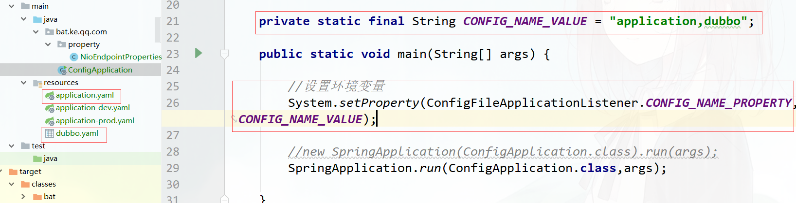

### **1. Spring Boot介绍**

#### **1.1 什么是Spring Boot**

Spring Boot是由Pivotal团队提供的全新框架，其设计目的是用来简化新Spring应用的初始搭建以及开发过程，该框架使用了特定的方式来进行配置，从而使开发人员不再需要定义样板化的配置。Spring Boot使创建独立的、生产级的基于Spring的应用程序变得很容易，我们可以直接运行这些应用程序。

官网： https://spring.io/projects/spring-boot#learn

#### 1.2 Spring Boot的特性

Spring Boot是一个快速开发框架，其特性：

- Create stand-alone Spring applications
- Embed Tomcat, Jetty or Undertow directly (no need to deploy WAR files)
- Provide opinionated 'starter' dependencies to simplify your build configuration
- Automatically configure Spring and 3rd party libraries whenever possible
- Provide production-ready features such as metrics, health checks and externalized configuration
- Absolutely no code generation and no requirement for XML configuration

翻译过来就是：

- 创建独立的Spring应用程序
- 内嵌入Tomcat、Jetty或Undertow(不需要部署WAR文件)    
- 提供“starter”依赖项来简化构建配置         
- 在可能的情况下自动配置Spring和第三方库     
- 提供可用于生产的特性，如度量标准、健康状况检查和外部化配置

- 完全不需要代码生成，也不需要XML配置      

#### 1.3 Spring Boot版本选择


版本号说明，比如2.1.13：

-  2：主版本号，当功能模块有较大更新或者整体架构发生变化时，主版本号会更新。
-  1：次版本号，次版本表示只是局部的一些变动。
-  13：修改版本号，一般是bug的修改或者是小的变动。

版本号后面英文的具体含义（版本发布计划）：

|   版本号   | 版本说明                                     | 用途                                                         |
| :--------: | -------------------------------------------- | ------------------------------------------------------------ |
| BUILD-XXX  | 开发版                                       | 一般是开发团队内部用的                                       |
|     GA     | 稳定版                                       | 内部开发到一定阶段了，各个模块集成后，经过全面测试，发现没有问题了，可以对外发布了，这个时候就叫GA（AenrallyAvailable）版，系统的核心功能已经可以使用。意思就是基本上可以使用了。 |
| PRE(M1,M2) | 里程碑版                                     | 由于GA版还不属于公开的发行版，里面还有功能不完善的或者一些BUG，于是就有了milestone（里程碑）版，milestone版本主要修复一些BUG。一个GA后，一般有多个里程碑，例如 M1 M2 M3 |
|     RC     | 候选发布版                                   | 从BUILD后GA再到M基本上系统就定型了，这个时候系统就进入RELEASE candidates（RC候选发布）版，该阶段的软件类似于最终发行前的一个观察期，该期间只对一些发现的等级高的BUG进行修复，发布RC1,RC2等版本。 |
|     SR     | 正式                                  发布版 | 公开正式发布。正式发布版一般也有多个发布，例如SR1 SR2 SR3等等，一般是用来修复大BUG或优化。 |

### **2. Spring Boot快速开始**

#### **2.1** **使用Spring Initializr创建项目**

- Spring initializr： https://start.spring.io/
- idea 提供的Spring initializr

#### **2.2 基于maven构建**

2.2.1) 创建一个空的maven工程，然后导入Spring Boot相关的jar包

父POM中主要做了两件事情：

- 所有jar包的版本统一管理
- 所有jar的依赖管理， 其中包含SpringBoot给我们提供的很多的starter启动器

```xml
<!-- Spring Boot支持需要引入其父pom -->
<parent>
    <groupId>org.springframework.boot</groupId>
    <artifactId>spring-boot-starter-parent</artifactId>
    <version>2.1.5.RELEASE</version>
    <relativePath/> <!-- lookup parent from repository -->
</parent>

<dependencies>
    <dependency>
        <groupId>org.springframework.boot</groupId>
        <artifactId>spring-boot-starter</artifactId>
    </dependency>
    
    <!-- 实现对 SpringMVC 的自动化配置 -->
    <dependency>
        <groupId>org.springframework.boot</groupId>
        <artifactId>spring-boot-starter-web</artifactId>
    </dependency>

    <dependency>
        <groupId>org.springframework.boot</groupId>
        <artifactId>spring-boot-starter-test</artifactId>
        <scope>test</scope>
    </dependency>
</dependencies>

<!-- 引入一个spring boot插件，可以支持我们将web应用程序打成可运行jar包 -->
<build>
    <plugins>
        <plugin>
            <groupId>org.springframework.boot</groupId>
            <artifactId>spring-boot-maven-plugin</artifactId>
        </plugin>
    </plugins>
</build>
```

2.2.2)  编写主入口程序 ，添加**@SpringBootApplication** 注解

```java
@SpringBootApplication
public class VipSpringBootDemoApplication {

    public static void main(String[] args) {
        SpringApplication.run(VipSpringBootDemoApplication.class,args);
    }
}
```


#### 2.3 SpringBoot运行

运行main函数启动程序，访问http://localhost:8080/demo/say，或者执行mvn package将项目打成jar包，用java -jar XXX.jar直接运行。

多种启动方式：

- 进入target目录， jar & war方式启动

```shell
java -jar  demo.jar  --server.port=8088  

java -jar  demo.war(内嵌容器)  
```

- 进入项目根目录，maven插件启动

```shell
mvn spring-boot:run
```

- 进入jar或war目录,  loader 启动

```shell
java org.springframework.boot.loader.JarLauncher  
java org.springframework.boot.loader.WarLauncher
```

==为什么jar -jar可以启动应用？==  

原理：查看解压后的demo/target/demo/META-INF/MANIFEST.MF


#### 2.4 SpringBoot 测试

```java
@SpringBootTest(webEnvironment= SpringBootTest.WebEnvironment.RANDOM_PORT)  // 测试方法设置随机端口
@RunWith(SpringRunner.class)
public class DemoControllerTest {

    @Autowired
    DemoController demoController;

    @Test
    public void say() {
        TestCase.assertEquals(demoController.say(),"hello fox");
    }
}
```

#### 2.5 Spring Boot打包

```xml
<build>
    <!--指定打包的文件名称-->
    <finalName>demo</finalName>
    <plugins>
        <plugin>
            <groupId>org.springframework.boot</groupId>
            <artifactId>spring-boot-maven-plugin</artifactId>
            <!--指定主启动类-->
            <configuration>
                <mainClass>
                    bat.ke.qq.com.VipSpringBootDemoApplication
                </mainClass>
            </configuration>
            <goals>
                <goal>repackage</goal>
            </goals>
        </plugin>
    </plugins>
</build>
```

==如何打war包部署到外置tomcat?==

- 第1步：指定springboot pom中的打包方式 由jar改为war

```xml
<packaging>war</packaging>
```

- 第2步：移除spring-boot-starter-web依赖中的tomcat依赖

```xml
<dependency>
  <groupId>org.springframework.boot</groupId>
  <artifactId>spring-boot-starter-tomcat</artifactId>
  <!--编译时依赖，但不会打包进去-->
  <scope>provided</scope>
</dependency>
```

- 主启动类上实现SpringBootServletInitializer 重写confiure方法

```java
@SpringBootApplication
public class DemoMain extends SpringBootServletInitializer {

    public static void main(String[] args) {

        SpringApplication.run(DemoMain.class, args);
    }

    @Override
    protected SpringApplicationBuilder configure(SpringApplicationBuilder builder) {
        return builder.sources(DemoMain.class);
    }
}
```

#### 2.6 日志打印

控制台输出请求路径

```yaml
logging:
  level:
    #org.springframework.web.servlet.mvc.method.annotation.RequestMappingHandlerMapping: trace
    org.springframework.web: TRACE 
```

#### 2.7 热部署

引入依赖

```xml
<!--devtools热部署-->
<dependency>
    <groupId>org.springframework.boot</groupId>
    <artifactId>spring-boot-devtools</artifactId>
    <optional>true</optional>
</dependency>

<!--spring-boot-maven-plugin 中配置-->
<configuration>
    <!-- 没有该配置，devtools 不生效 -->
    <fork>true</fork>
</configuration>
```

application.yml中配置

```yaml
spring:
  devtools:
    restart:
      enabled: true  #设置开启热部署
      additional-paths: src/main/java #重启目录
      exclude: WEB-INF/**
  freemarker:
    cache: false    #页面不加载缓存，修改即时生效
```

idea中配置

1）File-Settings-Compiler-Build Project automatically


2）ctrl + shift + alt + / ,选择Registry,勾上 Compiler autoMake allow when app running


#### 2.8 jsp的支持

 对于Jetty和Tomcat，如果使用war打包，它应该可以工作。一个可执行的war在使用java -jar启动时可以工作，并且也可以部署到任何标准容器中。使用可执行jar时不支持jsp。


#### 2.9 中文编码

官方文档：https://docs.spring.io/spring-boot/docs/current/reference/html/appendix-application-properties.html


```properties
# 设置spring.http.encoding.force=true，其他均为默认
spring.http.encoding.force=true
```

当spring.http.encoding.enabled=false时，可以定义过滤器，设置编码类型及强制转换

```java
@Configuration
public class EncodingFilterConfig {
    
    @Bean
    public FilterRegistrationBean filterRegistrationBean() {
        FilterRegistrationBean registrationBean = 
        new FilterRegistrationBean();
        CharacterEncodingFilter characterEncodingFilter = 
        new CharacterEncodingFilter();
        characterEncodingFilter.setForceEncoding(true);
        characterEncodingFilter.setEncoding("UTF-8");
        registrationBean.setFilter(characterEncodingFilter);
        return registrationBean;
    }
}
```

### **3. Spring Boot配置详解**

#### **3.1 多环境配置**

我们在开发应用时，通常一个项目会被部署到不同的环境中，比如：开发、测试、生产等。其中每个环境的数据库地址、服务器端口等等配置都会不同，对于多环境的配置，大部分构建工具或是框架解决的基本思路是一致的，通过配置多份不同环境的配置文件，再通过打包命令指定需要打包的内容之后进行区分打包。针对多环境场景下，我们会给每个环境创建一个配置文件application-${profile}.yaml。其中，${profile} 为环境名，对应到 Spring Boot 项目生效的Profile。

application.yaml

```yaml
spring:
  profiles:
    active: dev
```

多环境配置文件：

- application-local.yaml，本地环境
- application-dev.yaml，开发环境

```yaml
server:
  port: 8080
```

- application-uat.yaml，UAT 环境
- application-pre.yaml，预发布环境
- application-prod.yaml，生产环境

```yaml
server:
  port: 8888
```

测试，添加 --spring.profiles.active=prod 到 Program arguments 中，启动项目。


补充： yaml支持多模块文档块

```yaml
server:
  servlet:
    context-path: /
spring:
  profiles:
    active: dev
---
spring:
  profiles: dev
server:
  port: 8080
---
spring:
  profiles: prod
server:
  port: 8888
```

激活指定环境配置： 

- 直接在application.yml的配置文件中使用 spring.profiles.active=dev|prod
- 设置虚拟机参数 -Dspring.profiles.active=dev|prod
- 设置命令行参数 --spring.profiles.active=prod 

例如：

```shell
java -jar vip-spring-boot-demo-0.0.1-SNAPSHOT.jar --server.port=8888
```

补充：

Spring 中可以利用 PropertyPlaceholderConfigurer 的特性来实现动态加载配置文件，实现多环境切换。AbstractEnvironment 提供了activeProfiles用于存放激活的profiles，提供了defaultProfiles作为默认的profiles，以及获取，设置和增加profiles的方法。在spring中，所有的profiles都是存environment环境中的，只要保证context在新建完成以后设置生效profiles，就可以应用于整个系统。

spring boot中org.springframework.boot.SpringApplication#prepareEnvironment

```java
// Create and configure the environment
//创建默认的ConfigurableEnvironment  根据是否是web环境创建
ConfigurableEnvironment environment = getOrCreateEnvironment();
//默认的环境参数设置
configureEnvironment(environment, applicationArguments.getSourceArgs());
//springboot使用SpringApplicationRunListeners通知机制 在环境创建完成进行了设置
listeners.environmentPrepared(environment);
```

#### 3.2 配置随机值

Spring Boot 通过 RandomValuePropertySource 类，提供配置项的随机值。例如用于临时密码、服务器端口等等。RandomValuePropertySource 通过在配置文件中，设置配置项的为 ${random.*} 来实现，目前提供了如下几种随机值：

- 随机整数

```properties
# 指定 int 整数。
my-number=${random.int}
# 指定 long 整数。
my-long-number=${random.long}
# 随机小于 10 的 int 整数。
my-number=${random.int(10)}
# 随机大于等于 10 ，小于等于 65536 的 int 整数。
my-number=${random.int[1024,65536]}
```

- 随机字符串

```properties
# 普通字符串
secret=${random.value}
# UUID 字符串
secret=${random.uuid}
```

#### 3.3 读取自定义配置文件

- 使用@Value注解  

```java
@Component
public class ValueCommandLineRunner implements CommandLineRunner {
    @Value("${nio.endpoint.max-threads}")
    private Integer maxThreads;
    @Value("${nio.endpoint.connect-timeout}")
    private Integer connectTimeout;

    @Override
    public void run(String... args) {
        System.out.println("maxThreads:" + maxThreads+",connectTimeout:" + connectTimeout);
    }
}
```

- 使用@ConfigurationProperties注解，配置前缀 ，将配置文件自动设置到被注解的类

第1步：引入依赖

```xml
<!-- Spring Boot 配置处理器 -->
<dependency>
    <groupId>org.springframework.boot</groupId>
    <artifactId>spring-boot-configuration-processor</artifactId>
</dependency>
```

引入 spring-boot-configuration-processor 依赖的原因是，编译项目时，会扫描 @ConfigurationProperties 注解，生成 spring-configuration-metadata.json 配置元数据文件（vip-spring-boot-config/target/classes/META-INF/spring-configuration-metadata.json），并交给IDEA解析。

这样做的好处是：

- 在 application.yaml 配置文件，添加配置项时，IDEA 会给出提示。
- 点击配置项时，可以跳转到对应的 @ConfigurationProperties 注解的配置类

第2步：创建NioEndpointProperties配置类，读取 NioEndpoint 配置项。编译一次该项目后，可以自动通过 spring-boot-configuration-processor 依赖生成对应的 spring-configuration-metadata.json 配置元数据。

```java
@Component
@ConfigurationProperties(prefix = "nio.endpoint")
public class NioEndpointProperties {

    private Integer maxThreads;
    private Integer connectTimeout;

    public Integer getMaxThreads() {
        return maxThreads;
    }

    public void setMaxThreads(Integer maxThreads) {
        this.maxThreads = maxThreads;
    }

    public Integer getConnectTimeout() {
        return connectTimeout;
    }

    public void setConnectTimeout(Integer connectTimeout) {
        this.connectTimeout = connectTimeout;
    }
}
```

 第3步： 在 application.yml 中，添加自定义配置：

```yaml
nio:
  endpoint:
    connect-timeout: 10
    max-threads: 200
```

第4步： 测试，读取属性

```java
@Component
public class NioEndpointPropertiesCommandLineRunner implements CommandLineRunner {
    @Autowired
    private NioEndpointProperties nioEndpointProperties;
    @Override
    public void run(String... args) {
        System.out.println(nioEndpointProperties);
    }
}
```

**总结：**

@ConfigurationProperties两种用法：

- @ConfigurationProperties & @Component 
- @EnableConfigurationProperties(class:  @ConfigurationProperties)+@Configuration & @ConfigurationProperties

@EnableConfigurationProperties 注解，可以将指定带有 @ConfigurationProperties 的类，注册成BeanDefinition ，从而创建成 Bean 对象。当@EnableConfigurationProperties注解应用到@Configuration时， 任何被@ConfigurationProperties注解的beans将自动被Environment属性配置。

#### 3.4 自定义配置文件名

Spring Boot 默认读取文件名为 application 的配置文件。例如，application.yaml 配置文件。同时，Spring Boot 可以通过 spring.config.name 配置项，设置自定义配置文件名。



#### 3.5 配置文件加载过程源码分析

在使用 Spring Boot 时，我们可以很方便的在 application.properties 或 application.yml 配置文件中，添加相应的应用所需的配置。

Spring Boot是如何实现的？

Spring Boot 实现 application.properties 或 application.yml 配置文件的加载，关键在于入口类ConfigFileApplicationListener 和配置加载接口类*PropertySourceLoader*

ApplicationListener#onApplicationEvent()

ConfigFileApplicationListener #onApplicationEvent()

*PropertySourceLoader#load*

```java
// ConfigFileApplicationListener.java

public void onApplicationEvent(ApplicationEvent event) {
    //<1> 如果是ApplicationEnvironmentPreparedEvent 事件，说明 Spring 环境准备好了，执行相应的处理
    if (event instanceof ApplicationEnvironmentPreparedEvent) {
        onApplicationEnvironmentPreparedEvent((ApplicationEnvironmentPreparedEvent) event);
    }
    //<2> 如果是 ApplicationPreparedEvent 事件，说明 Spring 容器初始化好了，执行相应的处理
    if (event instanceof ApplicationPreparedEvent) {
        onApplicationPreparedEvent(event);
    }
}

private void onApplicationEnvironmentPreparedEvent(ApplicationEnvironmentPreparedEvent event) {
    // <1.1> 加载指定类型的EnvironmentPostProcessor 
    // 从spring-boot-2.1.5.RELEASE.jar!/META-INF/spring.factories中加载
    List<EnvironmentPostProcessor> postProcessors = loadPostProcessors();
    postProcessors.add(this);
    AnnotationAwareOrderComparator.sort(postProcessors);
    // 遍历 postProcessors
    for (EnvironmentPostProcessor postProcessor : postProcessors) {
        postProcessor.postProcessEnvironment(event.getEnvironment(), event.getSpringApplication());
    }
}

public void postProcessEnvironment(ConfigurableEnvironment environment,
      SpringApplication application) {
   addPropertySources(environment, application.getResourceLoader());
}

protected void addPropertySources(ConfigurableEnvironment environment,
      ResourceLoader resourceLoader) {
   //添加 RandomValuePropertySource 到 environment 中
   RandomValuePropertySource.addToEnvironment(environment);
   //创建 Loader 对象，进行加载
   new Loader(environment, resourceLoader).load();
}
```

Loader 是 ConfigFileApplicationListener 的内部类，负责加载指定的配置文件

```java
Loader(ConfigurableEnvironment environment, ResourceLoader resourceLoader) {
    this.environment = environment;
    // <1> 创建 PropertySourcesPlaceholdersResolver 对象
    this.placeholdersResolver = new PropertySourcesPlaceholdersResolver(this.environment);
    // <2> 创建 DefaultResourceLoader 对象
    this.resourceLoader = (resourceLoader != null) ? resourceLoader : new DefaultResourceLoader();
    // <3> 加载指定类型 PropertySourceLoader 对应的，在 `META-INF/spring.factories` 里的类名的列表
    // 默认情况下，返回的是 PropertiesPropertySourceLoader、YamlPropertySourceLoader 类
    // YamlPropertySourceLoader#load  加载扩展名为yml/yaml的propertySource配置文件
    this.propertySourceLoaders = SpringFactoriesLoader.loadFactories(PropertySourceLoader.class, 
    getClass().getClassLoader());
}
```


#### **3.6** 配置加载顺序

Spring Boot 不仅仅可以从配置文件获得配置，还可以从环境变量、命令行参数、jar 外部配置文件等等。其加载的优先级如下：

- 您的主目录上的[Devtools global 设置 properties](https://www.docs4dev.com/docs/zh/spring-boot/2.1.1.RELEASE/reference/using-boot-devtools.html#using-boot-devtools-globalsettings)(当 devtools 为 active 时为~/.spring-boot-devtools.properties)。
- [@TestPropertySource](https://docs.spring.io/spring/docs/5.1.3.RELEASE/javadoc-api/org/springframework/test/context/TestPropertySource.html) 注释测试。
- 你测试的properties属性。可在[@SpringBootTest](https://docs.spring.io/spring-boot/docs/2.1.1.RELEASE/api/org/springframework/boot/test/context/SpringBootTest.html)和[test annotations 用于测试 application 的特定切片](https://www.docs4dev.com/docs/zh/spring-boot/2.1.1.RELEASE/reference/boot-features-testing.html#boot-features-testing-spring-boot-applications-testing-autoconfigured-tests)上使用。
- 命令 line arguments。
- _Pro来自SPRING_APPLICATION_JSON(嵌入在环境变量或系统 property 中的内联 JSON)。
- ServletConfig init 参数。
- 来自java:comp/env的 JNDI 属性。
- Java System properties(System.getProperties())。
- OS 环境变量。
- 只在random.*中具有 properties。
- 在打包的 jar(application-{profile}.properties和 YAML 变体)之外的Profile-specific application properties。
- [Profile-specific application properties](https://www.docs4dev.com/docs/zh/spring-boot/2.1.1.RELEASE/reference/boot-features-external-config.html#boot-features-external-config-profile-specific-properties)打包在 jar(application-{profile}.properties和 YAML 变体)中。
- Application properties 在打包的 jar(application.properties和 YAML 变体)之外。
- Application properties 打包在 jar(application.properties和 YAML 变体)中。
- @Configuration classes 上的[@PropertySource](https://docs.spring.io/spring/docs/5.1.3.RELEASE/javadoc-api/org/springframework/context/annotation/PropertySource.html) 注释。
- 默认 properties(通过设置SpringApplication.setDefaultProperties指定)。

参考：

[《Spring官方文档》](https://docs.spring.io/spring-boot/docs/2.1.12.RELEASE/reference/html/boot-features-external-config.html#boot-features-external-config)

[《Spring Boot 中文文档 —— 外部化 Configuration》](https://www.docs4dev.com/docs/zh/spring-boot/2.1.1.RELEASE/reference/boot-features-external-config.html)文档