### SpringBoot内嵌容器

内嵌容器Tomcat自动配置和启动源码分析：

https://www.processon.com/view/link/5e54b5fae4b07f2b8322a60f


### Spring MVC 是如何集成到 Servlet 3.0 中

####  Servlet2.5时代

在 WEB-INF/web.xml 中配置 servlet 和 filter

```xml
<?xml version="1.0" encoding="UTF-8"?>
<web-app xmlns="http://java.sun.com/xml/ns/javaee"
           xmlns:xsi="http://www.w3.org/2001/XMLSchema-instance"
           xsi:schemaLocation="http://java.sun.com/xml/ns/javaee
        http://java.sun.com/xml/ns/javaee/web-app_4_0.xsd"
           version="4.0">

    <servlet>
        <servlet-name>HelloWorldServlet</servlet-name>
        <servlet-class>com.servlet.HelloWorldServlet</servlet-class>
    </servlet>

    <servlet-mapping>
        <servlet-name>HelloWorldServlet</servlet-name>
        <url-pattern>/hello</url-pattern>
    </servlet-mapping>

    <filter>
        <filter-name>HelloWorldFilter</filter-name>
        <filter-class>com.filter.HelloWorldFilter</filter-class>
    </filter>
    <filter-mapping>
        <filter-name>HelloWorldFilter</filter-name>
        <url-pattern>/hello</url-pattern>
    </filter-mapping>

</web-app>
```

#### Servlet3.0时代

**1. Servlet3.0 提供了无 xml 配置的特性，首先提供了 @WebServlet ，@WebFilter**

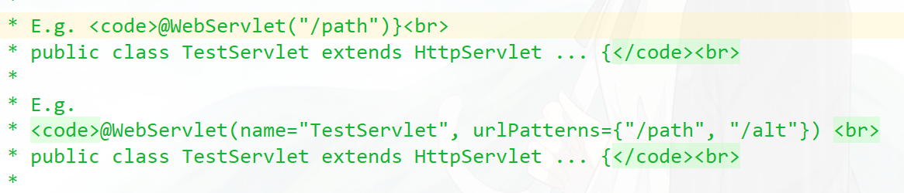

```java
@WebServlet("/hello")
public class HelloHttpServlet extends HttpServlet {
    @Override
    protected void doGet(HttpServletRequest request, HttpServletResponse response) throws ServletException, IOException {
        response.setContentType("text/html");
        PrintWriter out = response.getWriter();

        out.println("hello fox !!!!");

        out.flush();
        out.close();
    }

    @Override
    protected void doPost(HttpServletRequest req, HttpServletResponse resp) throws ServletException, IOException {
        doGet(req, resp);
    }
}

@WebFilter("/*")
public class HelloFilter implements Filter {
    @Override
    public void init(FilterConfig filterConfig) throws ServletException {

    }

    @Override
    public void doFilter(ServletRequest request, ServletResponse response, FilterChain chain) throws IOException, ServletException {
        System.out.println("触发 HelloFilter 过滤器...");
        chain.doFilter(request,response);
    }

    @Override
    public void destroy() {

    }
}
```

web.xml可以配置的servlet属性，在@WebServlet中都可以配置。

**@WebServlet常用属性:**

| 属性名         | **类型**       | **描述**                                                     |
| -------------- | -------------- | ------------------------------------------------------------ |
| name           | String         | 指定Servlet 的 name 属性，等价于 <servlet-name>。如果没有显式指定，则该 Servlet 的取值即为类的全限定名。 |
| value          | String[]       | 该属性等价于 urlPatterns 属性。两个属性不能同时使用。        |
| urlPatterns    | String[]       | 指定一组 Servlet 的 URL 匹配模式。等价于<url-pattern>标签。  |
| loadOnStartup  | int            | 指定 Servlet 的加载顺序，等价于 <load-on-startup>标签。      |
| initParams     | WebInitParam[] | 指定一组 Servlet 初始化参数，等价于<init-param>标签。        |
| asyncSupported | boolean        | 声明 Servlet 是否支持异步操作模式，等价于<async-supported> 标签。 |
| description    | String         | 该 Servlet 的描述信息，等价于 <description>标签。            |
| displayName    | String         | 该 Servlet 的显示名，通常配合工具使用，等价于 <display-name>标签。 |


**@WebFilter 的常用属性：**

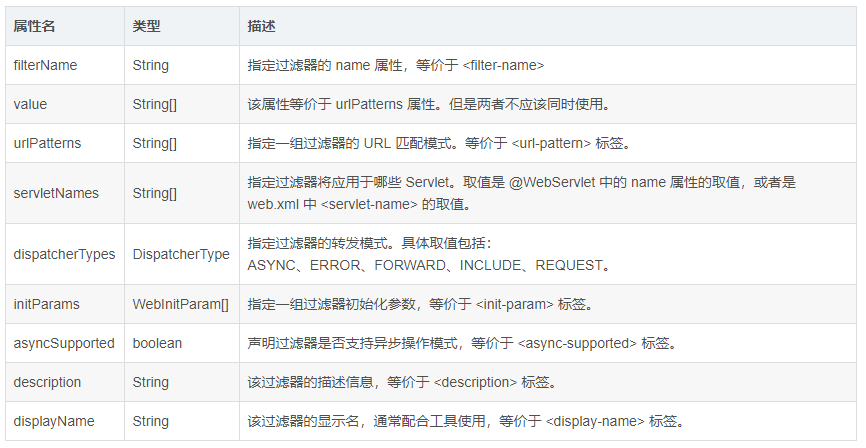

**2.使用 ServletContainerInitializer 的 SPI 机制 + @HandlesTypes 注解**

Servlet3.0 规范还提供了更强大的功能，可以在运行时**动态注册 servlet ，filter，listener**

**ServletContext**为动态配置 Servlet 增加了如下方法：

```java
ServletRegistration.Dynamic addServlet(String servletName,Class<? extends Servlet> servletClass)

ServletRegistration.Dynamic addServlet(String servletName, Servlet servlet)

ServletRegistration.Dynamic addServlet(String servletName, String className)

T createServlet(Class clazz)

ServletRegistration getServletRegistration(String servletName)

Map<String,? extends ServletRegistration> getServletRegistrations()
```

会在以下方法中调用：

```markdown
javax.servlet.ServletContextListener#contextInitialized

javax.servlet.ServletContainerInitializer#onStartup
```

**ServletContainerInitializer** 也是 Servlet 3.0 新增的一个接口，容器在启动时通过SPI 来发现 ServletContainerInitializer 的实现类，并且容器将 WEB-INF/lib 目录下 JAR 包中的类都交给该类的 #onStartup(...) 方法处理，我们通常需要在该实现类上使用 @HandlesTypes 注解来指定希望被处理的类，过滤掉不希望给 #onStartup(...) 处理的类。

可以实现 javax.servlet.ServletContainerInitializer 接口，用来在 web 容器启动时加载指定的 servlet 和 filter。

```java
@HandlesTypes(WebApplication.class)
public class CustomServletContainerInitializer implements ServletContainerInitializer {
    @Override
    public void onStartup(Set<Class<?>> c, ServletContext ctx) throws ServletException {

        System.out.println("创建 HelloHttpServlet...");

        ServletRegistration.Dynamic servlet = ctx.addServlet(
                HelloHttpServlet.class.getSimpleName(),
                HelloHttpServlet.class);
        servlet.addMapping("/hello");

        System.out.println("创建 HelloFilter...");

        FilterRegistration.Dynamic filter = ctx.addFilter(
                HelloFilter.class.getSimpleName(), HelloFilter.class);
        EnumSet<DispatcherType> dispatcherTypes = EnumSet.allOf(DispatcherType.class);
        dispatcherTypes.add(DispatcherType.REQUEST);
        dispatcherTypes.add(DispatcherType.FORWARD);
        filter.addMappingForUrlPatterns(dispatcherTypes, true, "/hello");


        for (Class clazz:c){
            if(WebApplication.class.isAssignableFrom(clazz)){
                try {
                    WebApplication webServer =  (WebApplication) clazz.newInstance();
                    webServer.onStartup(ctx);

                } catch (Exception e) {
                    e.printStackTrace();
                }
            }
        }

    }
}

public class MvcWebApplication implements WebApplication {
    @Override
    public void onStartup(ServletContext servletContext) throws ServletException {
        //TODO
        System.out.println("===== 执行mvc逻辑 ====");

    }
}
```

需要在META-INF/services/javax.servlet.ServletContainerInitializer添加

```markdown
bat.ke.qq.com.CustomServletContainerInitializer
```

#### Spring 是如何支持 Servlet 3.0 的

spring-web-5.1.7.RELEASE.jar!/META-INF/services/javax.servlet.ServletContainerInitializer 

```markdown
# 实现了ServletContainerInitializer接口和@HandlesTypes(WebApplicationInitializer.class)
org.springframework.web.SpringServletContainerInitializer
```

```java
@HandlesTypes(WebApplicationInitializer.class)
public class SpringServletContainerInitializer 
    implements ServletContainerInitializer {
        
@Override
public void onStartup(@Nullable Set<Class<?>> webAppInitializerClasses, ServletContext servletContext)
      throws ServletException {
          // ....
       for (WebApplicationInitializer initializer : initializers) {
          initializer.onStartup(servletContext);
       }
    }            
 }      
```

WebApplicationInitializer的实现类负责对 servlet 和 filter 进行注册，比如：

AbstractDispatcherServletInitializer#registerDispatcherServlet

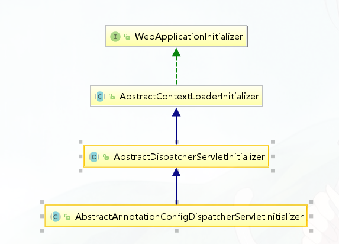

也可以通过自定义WebApplicationInitializer 实现类实现

SpringMvc官网地址：  https://docs.spring.io/spring/docs/current/spring-framework-reference/web.html

```java
public class MyWebApplicationInitializer implements WebApplicationInitializer {

    @Override
    public void onStartup(ServletContext servletCxt) {

        // Load Spring web application configuration
        AnnotationConfigWebApplicationContext ac = new AnnotationConfigWebApplicationContext();
        ac.register(AppConfig.class);
        //ac.refresh();

        // Create and register the DispatcherServlet
        DispatcherServlet servlet = new DispatcherServlet(ac);
        ServletRegistration.Dynamic registration = servletCxt.addServlet("app", servlet);
        registration.setLoadOnStartup(1);
        registration.addMapping("/app/*");
    }
}
```

思考：外置tomcat如何启动spring应用的？

源码分析地址：https://www.processon.com/view/link/5e08357be4b0aef94cb6518a


### Spring MVC 是如何集成到 Spring Boot 的

**第一种注册方式： Servlet 3.0 注解 + @ServletComponentScan**

Spring Boot 依旧兼容 Servlet 3.0 一系列以 @Web* 开头的注解：@WebServlet，@WebFilter，@WebListener

```java
@WebServlet("/hello")
public class HelloHttpServlet extends HttpServlet {}
@WebFilter("/hello/*")
public class HelloFilter implements Filter {}
```

启动类添加@ServletComponentScan扫描servlet注解

```java
@SpringBootApplication
@ServletComponentScan
public class RestApplication {

    public static void main(String[] args) {
        SpringApplication.run(RestApplication.class,args);
    }
}
```

@ServletComponentScan 注解上的 @Import(ServletComponentScanRegistrar.class) ，它会将扫描到的 @WebServlet、@WebFilter、@WebListener 的注解对应的类，最终封装成 FilterRegistrationBean、ServletRegistrationBean、ServletListenerRegistrationBean 对象，注册到 Spring 容器中。

**第二种注册方式：RegistrationBean**

ServletRegistrationBean 和 FilterRegistrationBean 都集成自 RegistrationBean ，RegistrationBean 是 Spring Boot 中广泛应用的一个注册类，负责把 servlet，filter，listener 给容器化，使他们被 Spring 托管，并且完成自身对 Web 容器的注册。

```java
@Configuration
public class ServletConfig {

    @Bean
    public ServletRegistrationBean helloHttpServlet() {
        ServletRegistrationBean helloHttpServlet = new ServletRegistrationBean();
        helloHttpServlet.addUrlMappings("/hello");
        helloHttpServlet.setServlet(new HelloHttpServlet());
        return helloHttpServlet;
    }

    @Bean
    public FilterRegistrationBean helloFilter() {
        FilterRegistrationBean helloFilter = new FilterRegistrationBean();
        helloFilter.addUrlPatterns("/hello/*");
        helloFilter.setFilter(new HelloFilter());
        return helloFilter;
    }
}
```

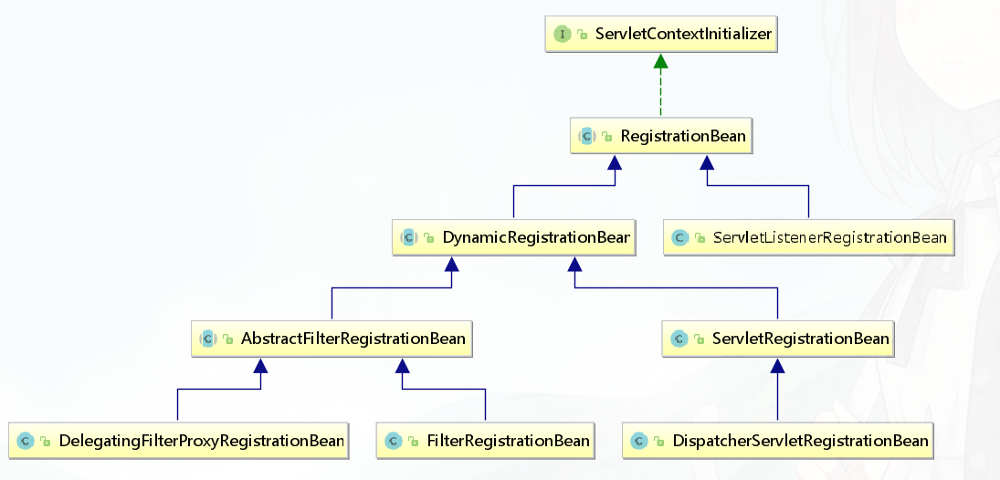

### SpringBoot 中 Servlet 加载流程的源码分析

使用内嵌的 Tomcat 时， Spring Boot 完全走了另一套初始化流程，不会走SpringServletContainerInitializer ，会进入org.springframework.boot.web.embedded.tomcat.TomcatStarter#onStartup

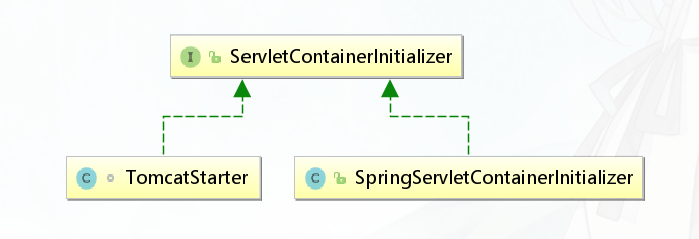

官方issues： https://github.com/spring-projects/spring-boot/issues/321

Spring Boot 这么做是有意而为之。Spring Boot 考虑到了如下的问题，我们在使用 Spring Boot 时，开发阶段一般都是使用内嵌 Tomcat 容器，但部署时却存在两种选择：一种是打成 jar 包，使用 java -jar 的方式运行；另一种是打成 war 包，交给外置容器去运行。

前者就会导致容器搜索算法出现问题，因为这是 jar 包的运行策略，不会按照 Servlet 3.0 的策略去加载 ServletContainerInitializer！

作者提供了一个替代选项：ServletContextInitializer，注意是 **ServletContextInitializer** ！

```java
class TomcatStarter implements ServletContainerInitializer {
    TomcatStarter(ServletContextInitializer[] initializers) {
   this.initializers = initializers;
}

@Override
public void onStartup(Set<Class<?>> classes, ServletContext servletContext)
      throws ServletException {
   try {
      for (ServletContextInitializer initializer : this.initializers) {
         initializer.onStartup(servletContext);
      }
   }
   catch (Exception ex) {
      this.startUpException = ex;
      // Prevent Tomcat from logging and re-throwing when we know we can
      // deal with it in the main thread, but log for information here.
      if (logger.isErrorEnabled()) {
         logger.error("Error starting Tomcat context. Exception: "
               + ex.getClass().getName() + ". Message: " + ex.getMessage());
      }
   }
}
    
}
```

org.springframework.boot.web.servlet.context.ServletWebServerApplicationContext#selfInitialize

```java
private void selfInitialize(ServletContext servletContext) throws ServletException {
   prepareWebApplicationContext(servletContext);
   registerApplicationScope(servletContext);
   WebApplicationContextUtils.registerEnvironmentBeans(getBeanFactory(),
         servletContext);
   // 注册servlet，filter
   for (ServletContextInitializer beans : getServletContextInitializerBeans()) {
      beans.onStartup(servletContext);
   }
}
```


### HttpMessageConverter 消息转换器分析

在 Spring MVC 中，可以使用 @RequestBody 和 @ResponseBody 两个注解，分别完成请求报文到对象和对象到响应报文的转换，底层这种灵活的消息转换机制，就是Spring 3.x 中新引入的 HttpMessageConverter ，即消息转换器机制。

在 Servlet 标准中，可以用javax.servlet.**ServletRequest** 接口中的以下方法：

```java
public ServletInputStream getInputStream() throws IOException;
```

来得到一个ServletInputStream。这个 ServletInputStream 中，可以读取到一个原始请求报文的所有内容。

同样的，在 javax.servlet.**ServletResponse** 接口中，可以用以下方法：

```java
public ServletOutputStream getOutputStream() throws IOException;
```

来得到一个 ServletOutputStream 。这个 ServletOutputSteam ，继承自 java 中的OutputStream，可以让你输出 Http 的响应报文内容。

我们从流中，只能读取到原始的字符串报文，同样，我们往输出流中，也只能写原始的字符。

在 SpringMVC 中，利用 HttpMessageConverter机制，通过**HttpInputMessage** 和 **HttpOutputMessage**，对原始的字符串报文进行了封装。

```java
public interface HttpInputMessage extends HttpMessage {

   /**
    * Return the body of the message as an input stream.
    * @return the input stream body (never {@code null})
    * @throws IOException in case of I/O errors
    */
   InputStream getBody() throws IOException;

}
public interface HttpOutputMessage extends HttpMessage {

   /**
    * Return the body of the message as an output stream.
    * @return the output stream body (never {@code null})
    * @throws IOException in case of I/O errors
    */
   OutputStream getBody() throws IOException;

}
```

**HttpMessageConverter**

```java
public interface HttpMessageConverter<T> {
    boolean canRead(Class<?> clazz, MediaType mediaType);
    boolean canWrite(Class<?> clazz, MediaType mediaType);
	 List<MediaType> getSupportedMediaTypes();
    T read(Class<? extends T> clazz, HttpInputMessage inputMessage)
      throws IOException, HttpMessageNotReadableException;
    void write(T t, @Nullable MediaType contentType, HttpOutputMessage outputMessage)
      throws IOException, HttpMessageNotWritableException;
} 
```

```java
@GetMapping(value = "/{id}")
public User getUserById(@PathVariable Long id, @RequestParam(required = false) String name) {
    User user = new User();
    user.setId(id);
    user.setName(name);
    return user;
}
```

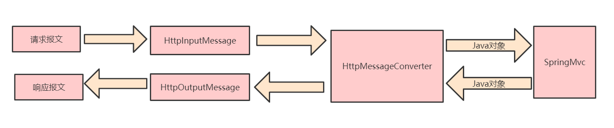

**RequestResponseBodyMethodProcessor**同时实现了 HandlerMethodArgumentResolver 和 HandlerMethodReturnValueHandler 两个接口。前者是将请求报文绑定到处理方法形参的策略接口，后者则是对处理方法返回值进行处理的策略接口。

```java
public interface HandlerMethodArgumentResolver {
    
   boolean supportsParameter(MethodParameter parameter);
   
   @Nullable
   Object resolveArgument(MethodParameter parameter, @Nullable ModelAndViewContainer mavContainer,
         NativeWebRequest webRequest, @Nullable WebDataBinderFactory binderFactory) throws Exception;
}

public interface HandlerMethodReturnValueHandler {

   boolean supportsReturnType(MethodParameter returnType);

   void handleReturnValue(@Nullable Object returnValue, MethodParameter returnType,
         ModelAndViewContainer mavContainer, NativeWebRequest webRequest) throws Exception;

}
```

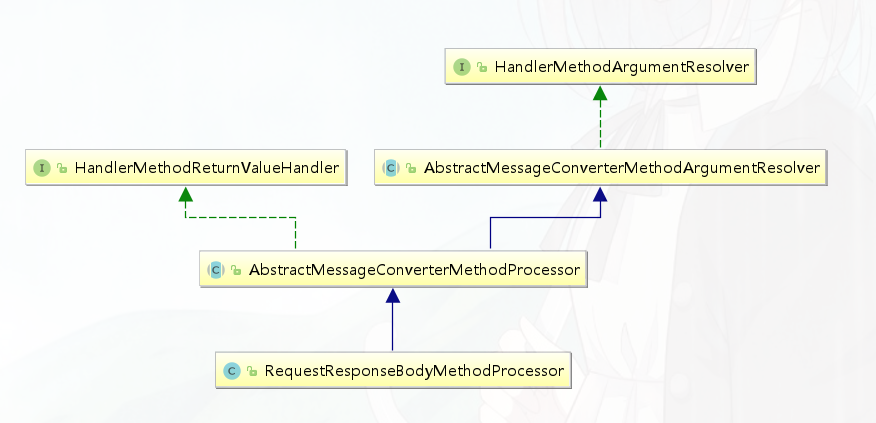

在Spring MVC 的设计中，一次请求报文和一次响应报文，分别被抽象为一个请求消息HttpInputMessage 和一个响应消息 HttpOutputMessage 。处理请求时，由合适的消息转换器将请求报文绑定为方法中的形参对象，在这里，同一个对象就有可能出现多种不同的消息形式，比如 json 和 xml 。同样，当响应请求时，方法的返回值也同样可能被返回为不同的消息形式，比如 json 和 xml 。

在 Spring MVC 中，针对不同的消息形式，我们有不同的 HttpMessageConverter 实现类来处理各种消息形式。但是，只要这些消息所蕴含的“有效信息”是一致的，那么各种不同的消息转换器，都会生成同样的转换结果。

#### 自定义HttpMessageConverter

1.  自定义UserHttpMessageConverter extends AbstractHttpMessageConverter

```java
public class UserHttpMessageConverter extends AbstractHttpMessageConverter<User> {

    public UserHttpMessageConverter() {
        // application/properties+user
        super(MediaType.valueOf("application/properties+user"));
        setDefaultCharset(Charset.forName("UTF-8"));
    }

    @Override
    protected boolean supports(Class clazz) {
        return clazz.isAssignableFrom(User.class);
    }

    @Override
    protected User readInternal(Class<? extends User> clazz, HttpInputMessage inputMessage) throws IOException, HttpMessageNotReadableException {
        InputStream inputStream = inputMessage.getBody();

        Properties properties = new Properties();
        properties.load(new InputStreamReader(inputStream,getDefaultCharset()));

        User user = new User();
        user.setId(Long.valueOf(properties.getProperty("user.id")));
        user.setName(properties.getProperty("user.name"));
        return user;
    }

    @Override
    protected void writeInternal(User user, HttpOutputMessage outputMessage) throws IOException, HttpMessageNotWritableException {
        OutputStream outputStream = outputMessage.getBody();

        Properties properties = new Properties();
        properties.setProperty("user.id",String.valueOf(user.getId()));
        properties.setProperty("user.name",user.getName());

        properties.store(new OutputStreamWriter(outputStream,getDefaultCharset()),"write by fox");
    }
}
```

2.  添加自定义的UserHttpMessageConverter

```java
@Configuration
public class MyWebMvcConfigurer implements WebMvcConfigurer {
    @Override
    public void configureMessageConverters(List<HttpMessageConverter<?>> converters) {
        converters.add(new UserHttpMessageConverter());
    }
//    @Override
//    public void extendMessageConverters(List<HttpMessageConverter<?>> converters) {
//        converters.add(new UserHttpMessageConverter());
//    }
}
```

或者

```java
@Bean
public HttpMessageConverter userHttpMessageConverter(){
    return  new UserHttpMessageConverter();
}
```

3. 配置consumers,produces  

```java
@PostMapping(value = "/json/to/properties",
        consumes = MediaType.APPLICATION_JSON_UTF8_VALUE,
        produces = "application/properties+user")
public User jsonToProperties(@RequestBody User user){
    // accept  客户端要求接收 properties
    // @RequestBody 是json  响应的内容是properties
    return user;
}
```

4. 演示效果

   http://localhost:8080/user/json/to/properties

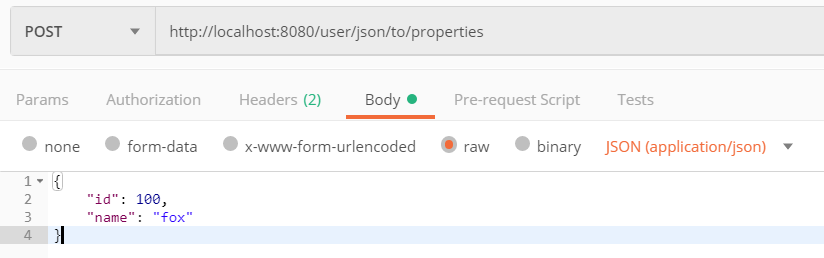

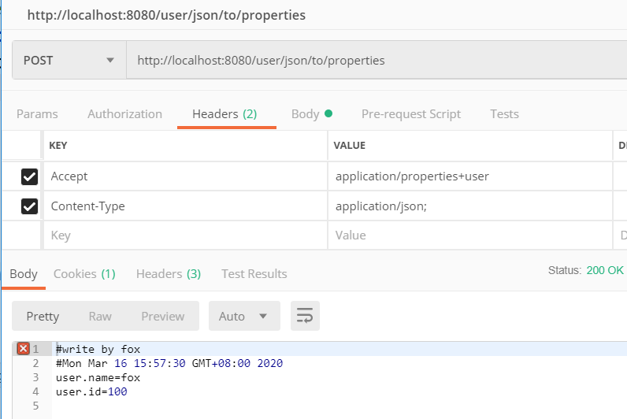


http://localhost:8080/user/properties/to/json

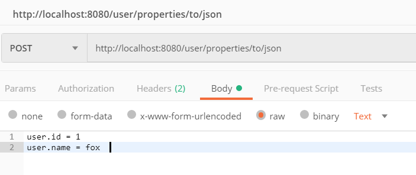

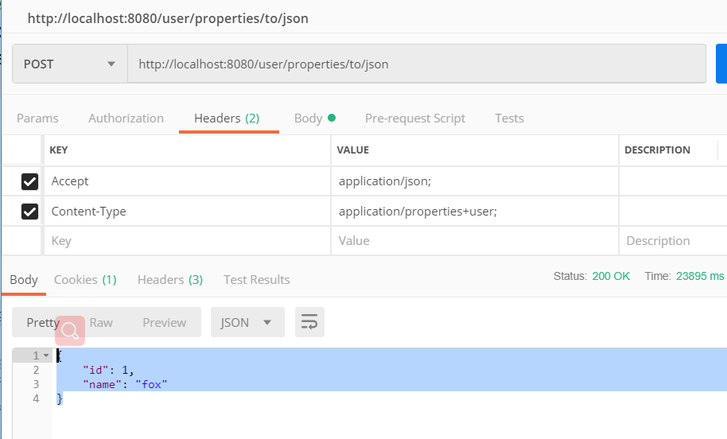