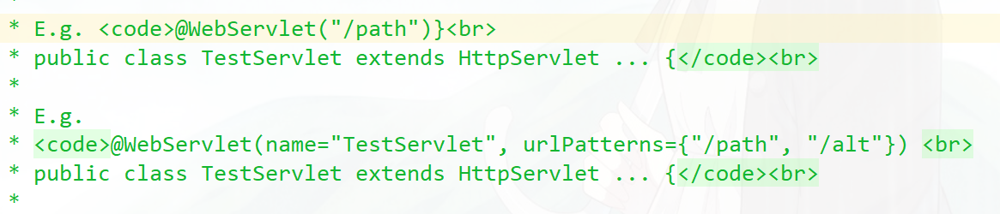

### Spring Boot整合第三方框架实战

#### 整合jdbc

1. 导入的maven依赖  

   ```java
   <dependency>
       <groupId>org.springframework.boot</groupId>
       <artifactId>spring-boot-starter-jdbc</artifactId>
   </dependency>
   
   <dependency>
       <groupId>mysql</groupId>
       <artifactId>mysql-connector-java</artifactId>
       <scope>runtime</scope>
       <version>5.1.47</version>
   </dependency>
   ```

2. 配置数据源

   ```yaml
   spring:
     datasource:
       # mysql8的驱动和url
       #driver-class-name: com.mysql.cj.jdbc.Driver
       #url: jdbc:mysql://localhost:3306/test?serverTimezone=UTC&characterEncoding=utf8&useUnicode=true&useSSL=false
       driver-class-name: com.mysql.jdbc.Driver
       url: jdbc:mysql://localhost:3306/test
       username: root
       password: root
   ```

   

3. 测试

   ```java
   @SpringBootTest(webEnvironment= SpringBootTest.WebEnvironment.RANDOM_PORT)
   @RunWith(SpringRunner.class)
   public class SpringBootJdbcApplicationTest {
       @Autowired
       private DataSource dataSource;
   
       @Test
       public void test(){
           // HikariDataSource
           System.out.println("自动配置数据源的类型:"+dataSource.getClass());
       }
   }
   ```

   

4. DataSource的自动配置

   ```java
   //org.springframework.boot.autoconfigure.jdbc.DataSourceConfiguration
   /**
    * Hikari DataSource configuration.    默认数据源配置
    */
   @Configuration
   @ConditionalOnClass(HikariDataSource.class)
   @ConditionalOnMissingBean(DataSource.class)
   @ConditionalOnProperty(name = "spring.datasource.type",
         havingValue = "com.zaxxer.hikari.HikariDataSource", matchIfMissing = true)
   static class Hikari {
   
      @Bean
      @ConfigurationProperties(prefix = "spring.datasource.hikari")
      public HikariDataSource dataSource(DataSourceProperties properties) {
         HikariDataSource dataSource = createDataSource(properties,
               HikariDataSource.class);
         if (StringUtils.hasText(properties.getName())) {
            dataSource.setPoolName(properties.getName());
         }
         return dataSource;
      }
   }
   
      /**
        * Generic DataSource configuration.   通用数据源配置，比如整合druid
        */
       @Configuration
       @ConditionalOnMissingBean(DataSource.class)
       @ConditionalOnProperty(name = "spring.datasource.type")
       static class Generic {
       
          @Bean
          public DataSource dataSource(DataSourceProperties properties) {
             return properties.initializeDataSourceBuilder().build();
          }
       
       }
   ```

   

5. jdbcTemplate自动配置

   ```java
   //org.springframework.boot.autoconfigure.jdbc.JdbcTemplateAutoConfiguration
   
   @Bean
   @Primary
   @ConditionalOnMissingBean(JdbcOperations.class)
   public JdbcTemplate jdbcTemplate() {
      JdbcTemplate jdbcTemplate = new JdbcTemplate(this.dataSource);
      JdbcProperties.Template template = this.properties.getTemplate();
      jdbcTemplate.setFetchSize(template.getFetchSize());
      jdbcTemplate.setMaxRows(template.getMaxRows());
      if (template.getQueryTimeout() != null) {
         jdbcTemplate
               .setQueryTimeout((int) template.getQueryTimeout().getSeconds());
      }
      return jdbcTemplate;
   }
   ```

   测试

   ```java
   @Autowired
   private JdbcTemplate jdbcTemplate;
   
   @Test
   public void testJdbcTemplate() {
       List<Map<String,Object>> list = jdbcTemplate.queryForList(
       "select * from user");
       System.out.println(list.size());
   }
   ```

   

####  整合druid

 引入依赖

```java
<dependency>
    <groupId>com.alibaba</groupId>
    <artifactId>druid</artifactId>
    <version>1.1.21</version>
</dependency>
```

定制一个druid的配置类

```java
@ConfigurationProperties(prefix = "spring.datasource.druid")
@Data
public class DruidDataSourceProperties {

    private String username;
    
    private String password;
    
    private String jdbcUrl;
    
    private String driverClassName;
    
    private Integer initialSize;

    private Integer maxActive;

    private Integer minIdle;

    private long maxWait;

    private boolean poolPreparedStatements;

    public String filters;

}

// 配置数据源监控，配置一个statViewSerlvet(后端管理) WebStatFilter sql监控
@Configuration
@EnableConfigurationProperties(value = DruidDataSourceProperties.class)
public class DruidDataSourceConfig {

    @Autowired
    private DruidDataSourceProperties druidDataSourceProperties;

    @Bean
    public DataSource dataSource() throws SQLException {
        DruidDataSource druidDataSource = new DruidDataSource();
        druidDataSource.setUsername(druidDataSourceProperties.getUsername());
        druidDataSource.setPassword(druidDataSourceProperties.getPassword());
        druidDataSource.setUrl(druidDataSourceProperties.getJdbcUrl());
        druidDataSource.setDriverClassName(druidDataSourceProperties.getDriverClassName());
        druidDataSource.setInitialSize(druidDataSourceProperties.getInitialSize());
        druidDataSource.setMinIdle(druidDataSourceProperties.getMinIdle());
        druidDataSource.setMaxActive(druidDataSourceProperties.getMaxActive());
        druidDataSource.setMaxWait(druidDataSourceProperties.getMaxWait());
        druidDataSource.setFilters(druidDataSourceProperties.getFilters());
        druidDataSourceProperties.setPoolPreparedStatements(druidDataSourceProperties.isPoolPreparedStatements());
        return druidDataSource;
    }

    /**
     * 配置druid管理后台的servlet
     * @return
     */
    @Bean
    public ServletRegistrationBean statViewSerlvet() {
        ServletRegistrationBean bean = new ServletRegistrationBean(new StatViewServlet(),"/druid/*");
        Map<String,Object> initParameters = new HashMap<>();
        initParameters.put("loginUsername","admin");
        initParameters.put("loginPassword","123456");
        bean.setInitParameters(initParameters);
        return bean;
    }

    @Bean
    public FilterRegistrationBean filterRegistrationBean() {
        FilterRegistrationBean filterRegistrationBean = new FilterRegistrationBean(new WebStatFilter());
        filterRegistrationBean.setUrlPatterns(Arrays.asList("/*"));

        Map<String,Object> initParams = new HashMap<>();
        initParams.put("exclusions","*.js,*.css,/druid/*");
        filterRegistrationBean.setInitParameters(initParams);
        return  filterRegistrationBean;
    }
}
```

配置application.yml

```yaml
spring:
  datasource:
    type: com.alibaba.druid.pool.DruidDataSource
    druid:
      username: root
      password: root
      jdbcUrl: jdbc:mysql://localhost:3306/test
      driverClassName: com.mysql.jdbc.Driver
      initialSize: 5
      minIdle: 5
      maxActive: 20
      maxWait: 60000
      timeBetweenEvictionRunsMillis: 60000
      minEvictableIdleTimeMillis: 300000
      validationQuery: SELECT 1 FROM DUAL
      testWhileIdle: true
      testOnBorrow: false
      testOnReturn: false
      poolPreparedStatements: true
      filters: stat,wall
      maxPoolPreparedStatementPerConnectionSize: 20
      useGlobalDataSourceStat: true
      connectionProperties: druid.stat.mergeSql=true;druid.stat.slowSqlMillis=500
```

监控访问路径: http://localhost:8080/druid/


####  整合mybaits

引入依赖

```yaml
<dependency>
    <groupId>mysql</groupId>
    <artifactId>mysql-connector-java</artifactId>
    <scope>runtime</scope>
    <version>5.1.46</version>
</dependency>

<!-- mybatis自动配置依赖-->
<dependency>
    <groupId>org.mybatis.spring.boot</groupId>
    <artifactId>mybatis-spring-boot-starter</artifactId>
    <version>2.0.0</version>
</dependency>
```

编写Mapper接口

```java
public interface UserMapper {
    @Select("select * from user")
    List<User> list();
}
```

在启动类加上@MapperScan注解

```java
@SpringBootApplication
@MapperScan("bat.ke.qq.com.vipspringbootmybatis.mapper")
public class VipSpringBootMybatisApplication {

    public static void main(String[] args) {
        SpringApplication.run(VipSpringBootMybatisApplication.class, args);
    }
}
```

mybatis自动配置原理  

org.mybatis.spring.boot.autoconfigure.MybatisAutoConfiguration

- 自动配置了 sqlSessionFactory，sqlSessionTemplate
- @Import({ AutoConfiguredMapperScannerRegistrar.**class** })

sql写在方法上配置方式：

方式一： 启动类上加@MapperScan，扫描mapper包

方式二： 每一个Mapper接口都添加@Mapper

sql写在配置文件上：

```yaml
#配置mybatis
mybatis:
    configuration:
        map-underscore-to-camel-case: true 开启驼峰命名
    mapper-locations: classpath:/mybatis/mapper/*.xml 指定配置文件的位置
```

#### 整合redis

SpringBoot2.x默认使用的是Lettuce。

关于jedis跟lettuce的区别：

- Lettuce 和 Jedis 的定位都是Redis的client，所以他们当然可以直接连接redis server。
- Jedis在实现上是直接连接的redis server，如果在多线程环境下是非线程安全的，这个时候只有使用连接池，为每个Jedis实例增加物理连接。
- Lettuce的连接是基于Netty的，连接实例（StatefulRedisConnection）可以在多个线程间并发访问，应为StatefulRedisConnection是线程安全的，所以一个连接实例（StatefulRedisConnection）就可以满足多线程环境下的并发访问，当然这个也是可伸缩的设计，一个连接实例不够的情况也可以按需增加连接实例。

1. 引入依赖

   ```xml
   <dependency>
       <groupId>org.springframework.boot</groupId>
       <artifactId>spring-boot-starter-data-redis</artifactId>
   </dependency>
   
   <dependency>
       <groupId>org.apache.commons</groupId>
       <artifactId>commons-pool2</artifactId>
       <version>2.6.2</version>
   </dependency>
   ```

   配置原理：

   org.springframework.boot.autoconfigure.data.redis.RedisAutoConfiguration 自动配置redisTemplate和stringRedisTemplate

2. 配置yaml ，对应RedisProperties配置类

   ```yaml
   spring:
     redis:
       # Redis开关/默认关闭
       enabled: true
       database: 0
       password:     #redis密码
       host: 192.168.3.14
       port: 6379
       lettuce:
         pool:
           max-active:  100 # 连接池最大连接数（使用负值表示没有限制）
           max-idle: 100 # 连接池中的最大空闲连接
           min-idle: 50 # 连接池中的最小空闲连接
           max-wait: 6000 # 连接池最大阻塞等待时间（使用负值表示没有限制）
       timeout: 1000
   ```

   使用redis 自动配置的默认的redisTemplate是使用jdk自带的序列化工具JdkSerializationRedisSerializer,通过redis 客户端工具看到的key，value是字节形式的

   

   自己配置一个RedisTemplate，替换序列化协议

   ```java
   @Configuration
   public class RedisConfig {
       /**
        * 配置自定义redisTemplate
        * @return
        */
       @Bean
       RedisTemplate<String, Object> redisTemplate(RedisConnectionFactory redisConnectionFactory) {
           RedisTemplate<String, Object> template = new RedisTemplate<>();
           template.setConnectionFactory(redisConnectionFactory);
   
            //使用Jackson2JsonRedisSerializer来序列化和反序列化redis的value值
           Jackson2JsonRedisSerializer serializer =
                   new Jackson2JsonRedisSerializer(Object.class);
           ObjectMapper mapper = new ObjectMapper();
           mapper.setVisibility(PropertyAccessor.ALL, JsonAutoDetect.Visibility.ANY);
           mapper.enableDefaultTyping(ObjectMapper.DefaultTyping.NON_FINAL);
           serializer.setObjectMapper(mapper);
           template.setValueSerializer(serializer);
   
           //使用StringRedisSerializer来序列化和反序列化redis的key值
           template.setKeySerializer(new StringRedisSerializer());
           template.setHashKeySerializer(new StringRedisSerializer());
           template.setHashValueSerializer(serializer);
           template.afterPropertiesSet();
   
           return template;
       }
   }
   ```

   

#### 整合dubbo

**provider端**

1. 引入依赖

   ```xml
   <!-- 实现对 Dubbo 的自动化配置 -->
   <dependency>
       <groupId>org.apache.dubbo</groupId>
       <artifactId>dubbo</artifactId>
       <version>2.7.3</version>
   </dependency>
   <dependency>
       <groupId>org.apache.dubbo</groupId>
       <artifactId>dubbo-spring-boot-starter</artifactId>
       <version>2.7.3</version>
   </dependency>
   
   <!-- 使用 Zookeeper 作为注册中心 -->
   <dependency>
       <groupId>org.apache.curator</groupId>
       <artifactId>curator-framework</artifactId>
       <version>2.13.0</version>
   </dependency>
   <dependency>
       <groupId>org.apache.curator</groupId>
       <artifactId>curator-recipes</artifactId>
       <version>2.13.0</version>
   </dependency>
   ```

2. 引入application.yaml

   ```yaml
   # dubbo 配置项，对应 DubboConfigurationProperties 配置类
   dubbo:
     # Dubbo 应用配置
     application:
       name: user-service-provider
     # Dubbo 注册中心配置
     registry:
       address: zookeeper://127.0.0.1:2181
     # Dubbo 服务提供者协议配置
     protocol:
       port: -1
       name: dubbo
     # Dubbo 服务提供者配置
     provider:
       timeout: 1000
   ```

3. 使用@Service暴露服务

   ```java
   import org.apache.dubbo.config.annotation.Service;
   @Service
   public class UserServiceImpl implements UserService {
   
       @Override
       public User get(int id) {
           User user = new User();
           user.setId(id);
           user.setName("fox");
           user.setAge(30);
           return user;
       }
   
   }
   ```

   

4. 使用@EnableDubbo开启注解Dubbo功能 ，或者配置包扫描 

   dubbo.scan.base-packages=bat.ke.qq.com.service

   ```java
   @SpringBootApplication
   @EnableDubbo
   public class DubboUserServiceProviderApplication {
   
       public static void main(String[] args) {
          SpringApplication.run(DubboUserServiceProviderApplication.class,args);
   
       }
   }
   ```

**Consumer端**

1. 引入依赖

   ```xml
   <!-- 实现对 Dubbo 的自动化配置 -->
   <dependency>
       <groupId>org.apache.dubbo</groupId>
       <artifactId>dubbo</artifactId>
       <version>2.7.3</version>
   </dependency>
   <dependency>
       <groupId>org.apache.dubbo</groupId>
       <artifactId>dubbo-spring-boot-starter</artifactId>
       <version>2.7.3</version>
   </dependency>
   
   <!-- 使用 Zookeeper 作为注册中心 -->
   <dependency>
       <groupId>org.apache.curator</groupId>
       <artifactId>curator-framework</artifactId>
       <version>2.13.0</version>
   </dependency>
   <dependency>
       <groupId>org.apache.curator</groupId>
       <artifactId>curator-recipes</artifactId>
       <version>2.13.0</version>
   </dependency>
   ```

   

2. 配置 application.yaml

   ```yaml
   # dubbo 配置项，对应 DubboConfigurationProperties 配置类
   dubbo:
     # Dubbo 应用配置
     application:
       name: user-service-consumer
     # Dubbo 注册中心配置
     registry:
       address: zookeeper://127.0.0.1:2181
     # Dubbo 消费者配置
     consumer:
       timeout: 1000
   ```

   

3. 使用**@Reference**引用服务

   ```java
   @Reference
   private UserService userService;
   
   @Bean
   public ApplicationRunner runner() {
       return args -> {
           System.out.println(userService.get(1));
       };
   }
   ```

   

#### 整合actuator

通过引入spring-boot-starter-actuator，可以使用Spring Boot为我们提供的准生产环境下的应用监控和管理功能。我们可以通过HTTP，JMX，SSH协议来进行操作，自动得到审计、健康及指标信息等

引入依赖

```xml
<dependency>
    <groupId>org.springframework.boot</groupId>
    <artifactId>spring-boot-starter-actuator</artifactId>
</dependency>
```

http 健康监控端点 默认只暴露了 health,info端点

- 通过management.endpoints.web.exposure.include=* 来指定开放所有的端点
- 通过 management.endpoints.web.exposure.include=health,info,beans  ，逗号分开来指定开放哪些端点
- 通过 management.endpoint.具体端点.enabled=true|false 来开放或者打开哪些端点

```yaml
management:
  endpoints:
    web:
      exposure:
        include: "*"
```

监控访问路径前缀

```markdown
management.endpoints.web.base-path=/actuator
```

actuator endpoints列表参考文档： https://docs.spring.io/spring-boot/docs/current/reference/html/production-ready-features.html#production-ready-endpoints

具体端点分析：

- 服务监控端点 http://localhost:8080/actuator/health


- **服务装配bean信息端点** http://localhost:8080/actuator/beans


- 条件自动装配报告端点: http://localhost:8080/actuator/conditions


- 审计事件监控端点 http://localhost:8080/actuator/auditevents
- 配置属性(配置前缀)端点 http://localhost:8080/actuator/configprops
- **服务环境端点** http://localhost:8080/actuator/env


- **应用各级包中的日志等级级别端点** http://localhost:8080/actuator/loggers


- **应用堆栈端点**  http://localhost:8080/actuator/heapdump   直接下载
- 线程dump端点监控 http://localhost:8080/actuator/threaddump


- 各项应用指标端点: http://localhost:8080/actuator/metrics


- 定时任务端点 http://localhost:8080/actuator/scheduledtasks
- 应用映射端点 http://localhost:8080/actuator/mappings


- 最新调用监控端点: http://localhost:8080/actuator/httptrace


### 自动配置实现原理

Spring Boot 自动配置，顾名思义，是希望能够自动配置，将我们从配置的苦海中解脱出来。那么既然要自动配置，它需要解三个问题：

- 创建哪些 **Bean** :  配置类  @Configuation
- 满足什么样的**条件**： 条件注解
- 创建 Bean的**属性**：配置属性

比如负责创建内嵌的 Tomcat、Jetty 等等 Web 服务器的配置类EmbeddedWebServerFactoryCustomizerAutoConfiguration。

```java
@Configuration     //配置类
@ConditionalOnWebApplication   //条件注解,表示当前配置类需要在当前项目是 Web 项目的条件下才能生效。
@EnableConfigurationProperties(ServerProperties.class)    // 配置属性
public class EmbeddedWebServerFactoryCustomizerAutoConfiguration{
    @Configuration
    @ConditionalOnClass({ Tomcat.class, UpgradeProtocol.class })  //  条件注解,表示当前配置类需要在当前项目有指定类的条件下才能生效
    public static class TomcatWebServerFactoryCustomizerConfiguration {
    
       @Bean
       public TomcatWebServerFactoryCustomizer tomcatWebServerFactoryCustomizer(
             Environment environment, ServerProperties serverProperties) {
          return new TomcatWebServerFactoryCustomizer(environment, serverProperties);
       }    
    }
}
```

#### 配置类

##### @Configuration

在 Spring3.0 开始，Spring 提供了 JavaConfiguartion 的方式，允许我们使用 Java 代码的方式，进行 Spring Bean 的创建。

```java
@Configuration
public class AppConfig {

    @Bean
    public ConfigurableServletWebServerFactory webServerFactory() {
        TomcatServletWebServerFactory factory = new TomcatServletWebServerFactory();
        factory.setPort(10000);
        return factory;
    }
}
```

##### 自动配置类

Spring Boot 的 spring-boot-autoconfigure 项目，提供了大量框架的自动配置类。



​	通过 SpringApplication#run(Class<?> primarySource, String... args) 方法，启动 Spring Boot 应用的时候，有个非常重要的组件 SpringFactoriesLoader 类，会读取 META-INF 目录下的 spring.factories 文件，获得每个框架定义的需要自动配置的配置类。**所以自动配置只是 Spring Boot 基于spring.factories的一个拓展点 EnableAutoConfiguration。** 


因为 spring-boot-autoconfigure 项目提供的是它选择的主流框架的自动配置，所以其它框架需要自己实现。例如，Dubbo 通过 dubbo-spring-boot-project 项目，提供 Dubbo 的自动配置。如下图所示：


##### Spring SPI机制

​	SPI 全称为 Service Provider Interface，是一种服务发现机制。SPI 的本质是将接口实现类的全限定名配置在文件中，并由服务加载器读取配置文件，加载实现类。这样可以在运行时，动态为接口替换实现类。正因此特性，我们可以很容易的通过 SPI 机制为我们的程序提供拓展功能。SPI 机制在第三方框架中也有所应用，比如 Dubbo 就是通过 SPI 机制加载所有的组件。

​	在springboot的自动装配过程中，最终会加载META-INF/spring.factories文件，而加载的过程是由**SpringFactoriesLoader**加载的。从CLASSPATH下的每个Jar包中搜寻所有META-INF/spring.factories配置文件，然后将解析properties文件，找到指定名称的配置后返回。

```markdown
org.springframework.core.io.support.SpringFactoriesLoader#loadFactoryNames
```

#### 条件注解

在 Spring3.1 版本时，为了满足不同环境注册不同的 Bean ，引入了 @Profile 注解。切换环境只需启动时配置虚拟机参数 **-Dspring.profiles.active**

```java
@Configuration
public class DataSourceConfiguration {

    @Bean
    @Profile("dev")
    public DataSource devDataSource() {
        // TODO 
    }

    @Bean
    @Profile("prod")
    public DataSource prodDataSource() {
        // TODO
    }
}
```

在 Spring4 版本时，提供了 @Conditional 注解，用于声明在配置类或者创建 Bean 的方法上，表示需要满足指定条件才能生效

```java
@Configuration
public class AppConfig {
  @Bean
  public Cat cat(){
     return new Cat();
  }
  
  
  @Bean
  @Conditional(value = MyConditional.class)
  public Fox fox(){
     return new Fox()
  }
}


public class MyConditional implements Condition {
   @Override
   public boolean matches(ConditionContext context, AnnotatedTypeMetadata metadata) {
      if(context.getBeanFactory().containsBean("cat"))
         return true;
      return false;
   }
}
```

Spring Boot 进一步增强，提供了常用的条件注解：

- @ConditionalOnNotWebApplication：当前项目不是 Web 项目的条件下
- @ConditionalOnWebApplication：当前项目是 Web项目的条件下

- @ConditionalOnBean：当容器里有指定 Bean 的条件下

- @ConditionalOnMissingBean：当容器里没有指定 Bean 的情况下
- @ConditionalOnSingleCandidate：当指定 Bean 在容器中只有一个，或者虽然有多个但是指定首选 Bean
- @ConditionalOnClass：当类路径下有指定类的条件下
- @ConditionalOnMissingClass：当类路径下没有指定类的条件下
- @ConditionalOnProperty：指定的属性是否有指定的值
- @ConditionalOnResource：类路径是否有指定的值
- @ConditionalOnExpression：基于 SpEL 表达式作为判断条件
- @ConditionalOnJava：基于 Java 版本作为判断条件
- @ConditionalOnJndi：在 JNDI 存在的条件下差在指定的位置

#### 配置属性

 使用 @EnableConfigurationProperties 注解，让 ServerProperties 配置属性类生效

```markdown
@EnableConfigurationProperties(ServerProperties.class)
```

通过 @ConfigurationProperties 注解，声明将 server 前缀的配置项，设置ServerProperties 配置属性类中

```java
@ConfigurationProperties(prefix = "server", ignoreUnknownFields = true)
public class ServerProperties {

   /**
    * Server HTTP port.
    */
   private Integer port;

   /**
    * Network address to which the server should bind.
    */
   private InetAddress address;
```

Spring Boot 约定读取 application.yaml、application.properties 等配置文件，从而实现创建 Bean 的自定义属性配置，甚至可以搭配 @ConditionalOnProperty 注解来取消 Bean 的创建。

```markdown
org.springframework.boot.env.PropertySourceLoader
org.springframework.boot.env.PropertiesPropertySourceLoader
org.springframework.boot.env.YamlPropertySourceLoader
```

#### Starter依赖

##### 内置 Starter

我们在使用 Spring Boot 时，并不会直接引入 [spring-boot-autoconfigure](https://mvnrepository.com/artifact/org.springframework.boot/spring-boot-autoconfigure) 依赖，而是使用 Spring Boot 内置提供的 Starter 依赖。

例如，我们想要使用 SpringMVC 时，引入的是 spring-boot-starter-web 依赖。这是为什么呢？

因为 Spring Boot 提供的自动配置类，基本都有 @ConditionalOnClass 条件注解，判断我们项目中存在指定的类，才会创建对应的 Bean。而拥有指定类的前提，一般是需要我们引入对应框架的依赖。因此，在我们引入 spring-boot-starter-web 依赖时，它会帮我们自动引入相关依赖，从而保证自动配置类能够生效，创建对应的 Bean。

```markdown
org.springframework.boot.autoconfigure.web.servlet.DispatcherServletAutoConfiguration
```

##### 自定义Starter

1.引入依赖

```xml
<dependency>
    <groupId>org.springframework.boot</groupId>
    <artifactId>spring-boot-autoconfigure</artifactId>
</dependency>

<!-- Spring Boot 配置处理器 -->
<dependency>
    <groupId>org.springframework.boot</groupId>
    <artifactId>spring-boot-configuration-processor</artifactId>
</dependency>
```

2.实现自动配置类 FoxServerAutoConfiguration

```java
@Configuration
@ConditionalOnClass(FoxServer.class)
@EnableConfigurationProperties(FoxServerProperties.class)
public class FoxServerAutoConfiguration {

    @Autowired
    private FoxServerProperties properties;

    @Bean
    @ConditionalOnClass(HttpServer.class)
    @ConditionalOnProperty(prefix = "fox.server", value = "enabled",havingValue = "true")
    FoxServer foxServer (){
        return new FoxServer(properties.getPort());
    }

}


@ConfigurationProperties(prefix = "fox.server")
public class FoxServerProperties {


    private Integer port = 8000;

    public Integer getPort() {
        return port;
    }

    public void setPort(Integer port) {
        this.port = port;
    }
}

public class FoxServer {

    private Integer port;

    public FoxServer(Integer port) {
        this.port = port;
    }

    public HttpServer create()  throws IOException{
        HttpServer server = HttpServer.create(new InetSocketAddress(port), 0);
        server.start();
        System.out.println("启动服务器成功，端口为:"+port);
        return server;
    }
}
```

3.创建**spring.factories**文件

​		在 resources 目录下创建，创建 META-INF 目录，然后在该目录下创建 spring.factories文件，添加自动化配置类为 **FoxServerAutoConfiguration**。

```properties
org.springframework.boot.autoconfigure.EnableAutoConfiguration=\
  bat.ke.qq.com.FoxServerAutoConfiguration
```

4. 测试

application.properties中配置

```properties
fox.server.enabled=true
fox.server.port=8001
```

```java
@Autowired
private FoxServer foxServer;

@RequestMapping("/")
public String sayHello()  {
    try {
        foxServer.create();
    } catch (IOException e) {
        e.printStackTrace();
    }
    return "say hello";
}
```

### SpringBoot自动配置和启动流程源码分析

#### 自动配置源码分析
  
  自动配置 @SpringBootApplication：
  
  
  
  
  自动配置如何注册AutoConfiguration：
  
  
  
 **@SpringBootApplication**
  
  

 **@Inherited**
    
   JAVA自带的注解，使用此注解声明出来的自定义注解，在使用此自定义注解时，如果注解在类上面时，子类会自动继承此注解，否则的话，子类不会继承此注解。
    
 **@SpringBootConfiguration**
    
  Spring自定义注解，标记这是一个 Spring Boot 配置类
  
  
  
  **@ComponentScan**
   
   Spring 自定义的注解，扫描指定路径下的 Component
   
   - basePackages：指定扫描的包，basePackageClasses：指定扫描的类
   
   - useDefaultFilters：取消默认filter设置，默认Filter自动扫描包下的Component，取消相当于禁用某个扫描
   
   - @ComponentScan.Filter：指定Filter 规则，可用于excludeFilters 排除Filters ，includeFilters 包含Filters
  
  **@EnableAutoConfiguration**
  
   Spring Boot 自定义的注解，用于开启自动配置功能，是 spring-boot-autoconfigure 项目最核心的注解。
   
   
   
   - **@AutoConfigurationPackage** 注解，将启动类所在的package作为自动配置的package ，会向容器注册beanName为org.springframework.boot.autoconfigure.AutoConfigurationPackages的bean。
   - **@Import** 注解，可用于资源的导入
   - **AutoConfigurationImportSelector** ，导入自动配置相关的资源
   
  **AutoConfigurationImportSelector**
```
protected List<String> getCandidateConfigurations(AnnotationMetadata metadata,
      AnnotationAttributes attributes) {
 //加载指定类型 EnableAutoConfiguration 对应的，在 `META-INF/spring.factories` 里的配置类
 // SpringFactoriesLoaderFactoryClass: org.springframework.boot.autoconfigure.EnableAutoConfiguration
   List<String> configurations = SpringFactoriesLoader.loadFactoryNames(
         getSpringFactoriesLoaderFactoryClass(), getBeanClassLoader());
   Assert.notEmpty(configurations,
         "No auto configuration classes found in META-INF/spring.factories. If you "
               + "are using a custom packaging, make sure that file is correct.");
   return configurations;
}
```

```
protected AutoConfigurationEntry getAutoConfigurationEntry(
      AutoConfigurationMetadata autoConfigurationMetadata,
      AnnotationMetadata annotationMetadata) {
   //是否开启自动配置  spring.boot.enableautoconfiguration 默认开启       
   if (!isEnabled(annotationMetadata)) {
      return EMPTY_ENTRY;
   }
   // 返回@EnableAutoConfiguration 注解的属性 exclude和excludeName
   AnnotationAttributes attributes = getAttributes(annotationMetadata);
   List<String> configurations = getCandidateConfigurations(annotationMetadata,
         attributes);
   // 移除重复的配置类      
   configurations = removeDuplicates(configurations);
   //获得需要排除的配置类
   //注解上的exclude和excludeName 以及 spring.autoconfigure.exclude
   Set<String> exclusions = getExclusions(annotationMetadata, attributes);
   checkExcludedClasses(configurations, exclusions);
   // 从 configurations 中，移除需要排除的配置类
   configurations.removeAll(exclusions);
   // 根据条件（Condition），过滤掉不符合条件的配置类
   // AutoConfigurationImportFilter   Auto Configuration Import Filters
   configurations = filter(configurations, autoConfigurationMetadata);
   // 触发自动配置类引入完成的事件
   // AutoConfigurationImportListener   Auto Configuration Import Listeners
   fireAutoConfigurationImportEvents(configurations, exclusions);
   return new AutoConfigurationEntry(configurations, exclusions);
}
```  

### Spring Boot启动流程图    
    
   


