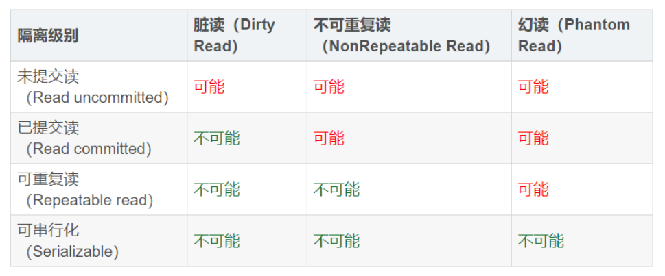
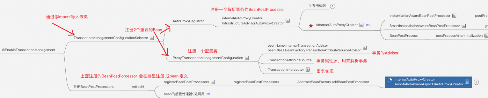
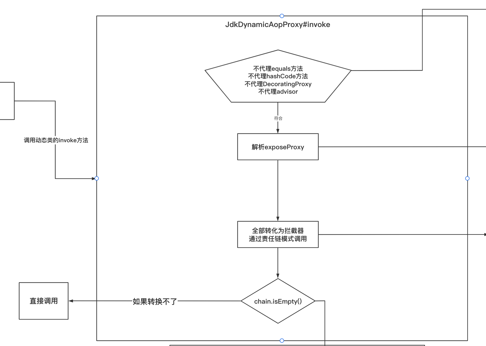
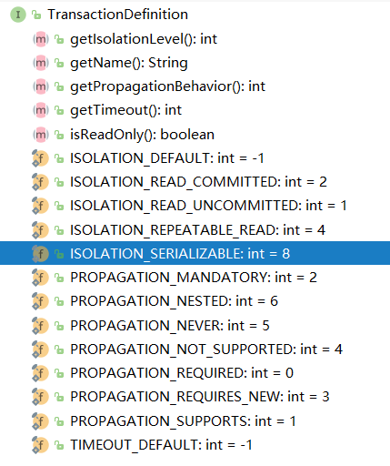
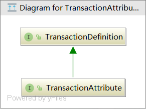
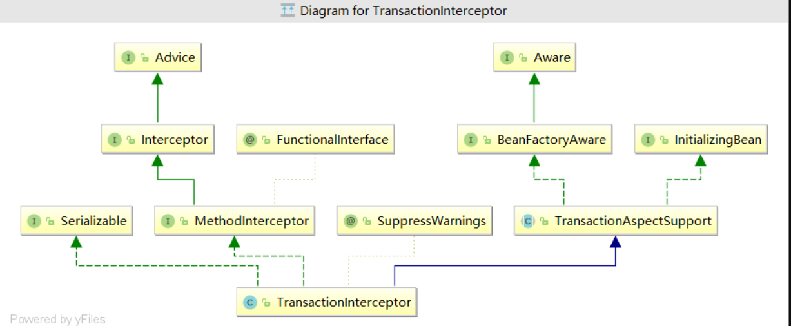
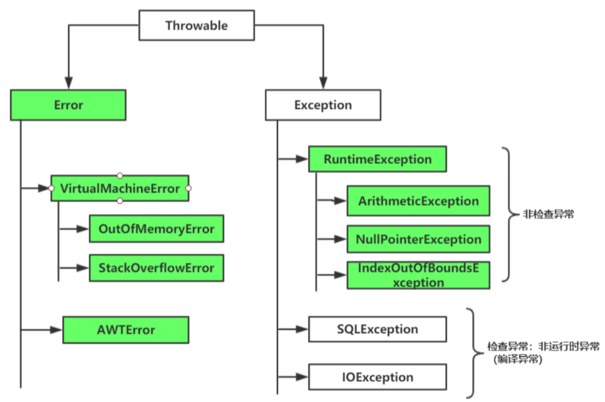
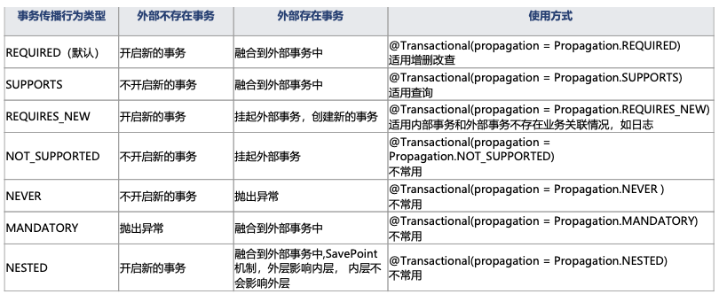

### 1. 数据库事务特性

#### 1.1 ACID特性

事务（Transaction）是数据库系统中一系列操作的一个逻辑单元，==所有操作要么全部成功要么全部失败==。

事务是区分文件存储系统与Nosql数据库重要特性之一，其存在的意义是为了保证即使在并发情况下也能正确的执行crud操作。怎样才算是正确的呢？这时提出了事务需要保证的四个特性即ACID：

- **A: 原子性(atomicity)**

  ​	一个事务（transaction）中的所有操作，要么全部完成，要么全部不完成，不会结束在中间某个环节。事务在执行过程中发生错误，会被回滚（Rollback）到事务开始前的状态，就像这个事务从来没有执行过一样。

  原子性表现为==操作不能被分割==。

  

- **C: 一致性(consistency)**

  ​	在事务开始之前和事务结束以后，数据库的完整性没有被破坏。数据库要一直处于一致的状态，事务开始前是一个一致状态，事务结束后是另一个一致状态，==事务将数据库从一个一致状态转移到另一个一致状态==

  

- **I:  隔离性(isolation)**

  ​	数据库允许多个并发事务同时对其数据进行读写和修改的能力，==隔离性可以防止多个事务并发执行时由于交叉执行而导致数据的不一致==。事务隔离分为不同级别，包括读未提交（Read uncommitted）、读已提交（read committed）、可重复读（repeatable read）和串行化（Serializable）。

  

- **D: 持久性(durability)**

  ​	事务处理结束后，==对数据的修改就是永久的==，即便系统故障也不会丢失。

##### 1.1.1 扩展
  
WAL原则
  ==InnoDB的ARIES三原则Write Ahead Logging（WAL）==：
  
  - 日志成功写入后事务就不会丢失，后续由checkpoint机制来保证磁盘物理文件与redo log达到一致性;
  - 利用redo log来记录变更后的数据，即redo里记录事务数据变更后的值;
  - 利用undo log来记录变更前的数据，即undo里记录事务数据变更前的值，用于回滚和其他事务多版本读。

并发事务控制

- 单版本控制-锁

  锁用独占的方式来保证在只有一个版本的情况下事务之间相互隔离。

  在 MySQL 事务中，锁的实现与隔离级别有关系，在 RR（Repeatable Read）隔离级别下，MySQL 为了解决幻读的问题，以牺牲并行度为代价，通过 Gap 锁来防止数据的写入，而这种锁，因为其并行度不够，冲突很多，经常会引起死锁。现在流行的 Row 模式可以避免很多冲突甚至死锁问题，所以推荐默认使用 Row + RC（Read Committed）模式的隔离级别，可以很大程度上提高数据库的读写并行度。

- 多版本控制-MVCC

  在数据库中，为了实现高并发的数据访问，对数据进行多版本处理，并通过事务的可见性来保证事务能看到自己应该看到的数据版本。==MVCC 最大的好处是读不加锁，读写不冲突。==

  每一次对数据库的修改，都会在 Undo 日志中记录当前修改记录的事务号及修改前数据状态的存储地址（即 ROLL_PTR），以便在必要的时候可以回滚到老的数据版本。例如，一个读事务查询到当前记录，而最新的事务还未提交，根据原子性，读事务看不到最新数据。  

#### 1.2 事务隔离级别

在高并发的情况下，要完全保证其ACID特性是非常困难的，除非把所有的事务串行化执行，但带来的负面的影响将是性能大打折扣。很多时候我们有些业务对事务的要求是不一样的，所以数据库中设计了四种隔离级别，供用户基于业务进行选择。

**数据库默认隔离级别：**

Oracle中默认级别是 Read committed

mysql 中默认级别 Repeatable read

```sql
#查看mysql 的默认隔离级别
SELECT @@tx_isolation

#设置为读未提交
set tx_isolation='read-uncommitted';  

#设置为读已提交
set tx_isolation='read-committed';  

#设置为可重复读
set tx_isolation='REPEATABLE-READ';   

#设置为串行化
set tx_isolation='SERIALIZABLE';
```



- **脏读**

一个事务读取到另一事务未提交的更新数据

session_1

```sql
#设置为读未提交
set tx_isolation='read-uncommitted';  

BEGIN;

insert INTO `account` (accountName,user,money) VALUES ('222','cat',1000);

rollback;

commit;
```

session_2

```sql
#设置为读未提交
set tx_isolation='read-uncommitted';  

SELECT * from account;
```


- **不可重复读** 

 在同一事务中,多次读取同一数据返回的结果有所不同, 换句话说, 后续读取可以读到另一事务已提交的更新数据. 相反, “可重复读”在同一事务中多次读取数据时, 能够保证所读数据一样, 也就是后续读取不能读到另一事务已提交的更新数据。

事务B修改数据导致当前事务A前后读取数据不一致 ，侧重点在于事务B的修改

当前事务读到了其他事务修改的数据

session_1

```sql
#设置为读已提交
set tx_isolation='read-committed';  

BEGIN;

SELECT * from `account`;

# 其他操作

SELECT * from `account`;

commit;
```

session_2

```sql
#设置为读已提交
set tx_isolation='read-committed';  

UPDATE account SET money= money+1 where user='cat';
```


- **幻读**  

查询表中一条数据如果不存在就插入一条，并发的时候却发现，里面居然有两条相同的数据。

事务A修改表中数据，此时事务B插入一条新数据，事务A查询发现表中还有没修改的数据，像是出现幻觉

事务A读到了事务B新增的数据，导致结果不一致， 侧重点在于事务B新增数据


session_1

```sql
#设置为可重复读
set tx_isolation='REPEATABLE-READ'; 

BEGIN;

SELECT * FROM `account` WHERE `user` = 'cat';

#此时，另一个事务插入了数据

SELECT * FROM `account` WHERE `user` = 'cat';

insert INTO `account` (accountName,user,money) VALUES ('222','cat',1000);

SELECT * FROM `account` WHERE `user` = 'cat';

update `account` set money=money+10 where `user` = 'cat' ;

SELECT * FROM `account` WHERE `user` = 'cat';

commit;
```

session_2

```sql
#设置为可重复读
set tx_isolation='REPEATABLE-READ';

insert INTO `account` (accountName,user,money) VALUES ('222','cat',1000);

```

### 2. 事务的使用 

#### 2.1. spring中声明式事务的使用 

##### 2.1.1 基于java 配置 

###### 2.1.1.1 开启并配置事务 

    1. 使用注解开启事务 @EnableTransactionManagement
  
    2. 配置数据库连接 

    3. 配置 jdbcTemplate  

    4. 配置 事务管理器 PlatformTransactionManager

```java
@Configuration
@EnableTransactionManagement  // 开启事务 
@EnableAspectJAutoProxy(exposeProxy = true) // 解决 内部方法间调用导致事务失效  AopContext.currentProxy()
@ComponentScan(basePackages = "com.wlz")
public class AppConfig {

	/**
	 *  配置数据库连接池
	 * @return
	 */
	@Bean
	public DataSource dataSource() {
		DruidDataSource dataSource = new DruidDataSource();
		dataSource.setUsername("root");
		dataSource.setPassword("123456");
		dataSource.setUrl("jdbc:mysql://localhost:3306/test?useSSL=false");
		dataSource.setDriverClassName("com.mysql.jdbc.Driver");
		return dataSource;
	}

	/**
	 *  配置 jdbcTemplate
	 * @param dataSource
	 * @return
	 */
	@Bean
	public JdbcTemplate jdbcTemplate(DataSource dataSource) {
		return new JdbcTemplate(dataSource);
	}

	/**
	 *  配置 事务管理器
	 * @param dataSource
	 * @return
	 */
	@Bean
	public PlatformTransactionManager transactionManager(DataSource dataSource) {
		return new DataSourceTransactionManager(dataSource);
	}
}
```

###### 2.1.1.2 使用事务  

  添加 @Transactional 注解 即可 

```java
@Service
public class PayServiceImpl implements PayService {

  @Autowired
  private AccountInfoDao accountInfoDao;

  @Autowired
  private ProductInfoDao productInfoDao;

  @SuppressWarnings("divzero")
  @Transactional(rollbackFor = Exception.class, propagation = Propagation.REQUIRED)
  @Override
  public void pay(String accountId, double money) {

    // 查询 余额
    double blance = accountInfoDao.qryBlanceByUserId(accountId);

    // 余额不足
    if (new BigDecimal(blance).compareTo(new BigDecimal(money)) < 0) {
      throw new RuntimeException("余额不足");
    }

    // 更新余额
    int retVal = accountInfoDao.updateAccountBlance(accountId, money);
    System.out.println("retVal: " + retVal);

    // 这样调用 是事务 在 内部方法调用 进行传播
    ((PayService) AopContext.currentProxy()).updateProductStore(1);

    int i = 1 / 0;

  }

  @Transactional(rollbackFor = Exception.class)
  @Override
  public void updateProductStore(Integer productId) {

    try {
      productInfoDao.updateProductInfo(productId);
    } catch (Exception e) {
      throw new RuntimeException("内部异常");
    }

  }
}
```

###### 2.1.1.3 测试事务

```java
public class MainStarter {

  public static void main(String[] args) {
    AnnotationConfigApplicationContext context = new AnnotationConfigApplicationContext(AppConfig.class);

    for (String beanDefinitionName : context.getBeanDefinitionNames()) {
      System.out.println(beanDefinitionName);
    }

    PayService payService = context.getBean("payServiceImpl", PayService.class);
    payService.pay("123456789", 1);

  }
}
```

##### 2.1.2 基于 xml 配置 

###### 2.1.2.1 开启并配置事务 

```xml
<?xml version="1.0" encoding="UTF-8"?>
<beans xmlns="http://www.springframework.org/schema/beans"
       xmlns:xsi="http://www.w3.org/2001/XMLSchema-instance"
       xmlns:context="http://www.springframework.org/schema/context"
       xmlns:aop="http://www.springframework.org/schema/aop"
       xmlns:tx="http://www.springframework.org/schema/tx"
       xsi:schemaLocation="http://www.springframework.org/schema/beans
        https://www.springframework.org/schema/beans/spring-beans.xsd
		http://www.springframework.org/schema/context
		http://www.springframework.org/schema/context/spring-context.xsd
		http://www.springframework.org/schema/aop
 		https://www.springframework.org/schema/aop/spring-aop.xsd
		http://www.springframework.org/schema/tx
 		https://www.springframework.org/schema/tx/spring-tx.xsd">


  <context:component-scan base-package="com.wlz"/>

  <!--  配置数据源	-->
  <bean id="dataSource" class="com.alibaba.druid.pool.DruidDataSource">
    <property name="url" value="jdbc:mysql://localhost:3306/test?useSSL=false"/>
    <property name="username" value="root"/>
    <property name="password" value="123456"/>
    <property name="driverClassName" value="com.mysql.jdbc.Driver"/>
  </bean>

  <!--  配置 jdbcTemplate	-->
  <bean id="jdbcTemplate" class="org.springframework.jdbc.core.JdbcTemplate">
    <constructor-arg name="dataSource" ref="dataSource"></constructor-arg>
  </bean>


  <!--  配置 事务管理器	-->
  <bean id="txManager" class="org.springframework.jdbc.datasource.DataSourceTransactionManager">
    <property name="dataSource" ref="dataSource"/>
  </bean>

  <!--  事物切面配置	-->
  <tx:advice id="advice" transaction-manager="txManager">
    <tx:attributes>
      <tx:method name="pay*" propagation="REQUIRED" read-only="false" rollback-for="java.lang.Exception"/>
      <tx:method name="update*" propagation="REQUIRED" read-only="false"/>
      <tx:method name="update" propagation="REQUIRED" read-only="false"/>
    </tx:attributes>
  </tx:advice>

  <!-- 事物切入点 -->
  <aop:config>
    <aop:pointcut expression="execution(* com.wlz.service.*.*(..))" id="txPointCut"/>
    <aop:advisor advice-ref="advice" pointcut-ref="txPointCut"/>
  </aop:config>
</beans>


```

###### 2.1.2.2 使用事务 

```xml
 <!--  事物切面配置	-->
  <tx:advice id="advice" transaction-manager="txManager">
    <tx:attributes>
      <tx:method name="pay*" propagation="REQUIRED" read-only="false" rollback-for="java.lang.Exception"/>
      <tx:method name="update*" propagation="REQUIRED" read-only="false"/>
      <tx:method name="update" propagation="REQUIRED" read-only="false"/>
    </tx:attributes>
  </tx:advice>

  <!-- 事物切入点 -->
  <aop:config>
    <aop:pointcut expression="execution(* com.wlz.service.*.*(..))" id="txPointCut"/>
    <aop:advisor advice-ref="advice" pointcut-ref="txPointCut"/>
  </aop:config>
```

  
  上面的 advice 会拦截方法，相当于 @Transactional

```java
@Service
public class PayXmlServiceImpl implements PayXmlService {

	@Autowired
	private AccountInfoDao accountInfoDao;

	@Autowired
	private ProductInfoDao productInfoDao;

	@SuppressWarnings("divzero")
	@Override
	public void pay(String accountId, double money) {

		// 查询 余额
		double blance = accountInfoDao.qryBlanceByUserId(accountId);

		// 余额不足
		if (new BigDecimal(blance).compareTo(new BigDecimal(money)) < 0) {
			throw new RuntimeException("余额不足");
		}

		// 更新余额
		int retVal = accountInfoDao.updateAccountBlance(accountId,money);
		System.out.println( "retVal: " + retVal);

		// 这样调用 是事务 在 内部方法调用 进行传播
		((PayXmlService) AopContext.currentProxy()).updateProductStore(1);

		int i = 1/0;

	}

	@SuppressWarnings("divzero")
	@Override
	public void updateProductStore(Integer productId) {

		try {
			productInfoDao.updateProductInfo(productId);
		}catch (Exception e) {
			throw new RuntimeException("内部异常");
		}

	}

}
```

###### 2.1.2.3 测试事务

```java
public class MainXmlStarter {

	public static void main(String[] args) {
		ClassPathXmlApplicationContext context = new ClassPathXmlApplicationContext("spring.xml");

		for (String beanDefinitionName : context.getBeanDefinitionNames()) {
			System.out.println(beanDefinitionName);
		}

		PayXmlService payXmlService = context.getBean("payXmlServiceImpl",PayXmlService.class);
		payXmlService.pay("123456789", 1);

	}
}
```

#### 2.2 spring 中 编程式事务的使用 

```java
public class MainProgramStarter {

	private static String url = "jdbc:mysql://localhost:3306/test?useSSL=false";
	private static String user = "root";
	private static String password = "123456";


	public static void main(String[] args) {

		// 获取数据源
		final DataSource ds = new DriverManagerDataSource(url, user, password);
		// 编程式事务
		final TransactionTemplate template = new TransactionTemplate();
		// 设置事务管理器
		template.setTransactionManager(new DataSourceTransactionManager(ds));

		template.execute(new TransactionCallback<Object>() {
			@Override
			public Object doInTransaction(TransactionStatus status) {
				Connection conn = DataSourceUtils.getConnection(ds);
				Object savePoint = null;
				try {
					{
						// 插入
						PreparedStatement prepare = conn.
								prepareStatement(
										"insert INTO account_info (accountId,blance) VALUES (?,?,)");
						prepare.setString(1, "111");
						prepare.setDouble(2, 100);
						prepare.executeUpdate();
					}
					// 设置保存点
					savePoint = status.createSavepoint();
					{
						// 插入
						PreparedStatement prepare = conn.
								prepareStatement(
										"insert INTO account_info (accountId,blance) VALUES (?,?)");
						prepare.setString(1, "222");
						prepare.setDouble(2, 200);
						prepare.executeUpdate();
					}
					{
						// 更新
						PreparedStatement prepare = conn.prepareStatement(
								"UPDATE account_info SET blance= blance+100 where accountId=?");
						prepare.setString(1, "111");
						prepare.executeUpdate();
						//int i=1/0;

					}
				} catch (SQLException e) {
					e.printStackTrace();
				} catch (Exception e) {
					System.out.println("更新失败");
					if (savePoint != null) {
						status.rollbackToSavepoint(savePoint);
					} else {
						status.setRollbackOnly();
					}
				}
				return null;
			}
		});
	}

}
```

### 3. Spring 事务应用及源码分析

#### 3.1 事务的集成过程 



###### 3.1.1  @EnableTransactionManagement

```java
@Target(ElementType.TYPE)
@Retention(RetentionPolicy.RUNTIME)
@Documented
@Import(TransactionManagementConfigurationSelector.class)
public @interface EnableTransactionManagement {
	boolean proxyTargetClass() default false;
	
	AdviceMode mode() default AdviceMode.PROXY;

	int order() default Ordered.LOWEST_PRECEDENCE;

}
``` 

   属性和 @EnableAspectJAutoProxy 注解一样。 不同之处在于@Import 导入器导入的这个类 ，它导入的是个 ImportSelector

###### 3.1.2  TransactionManagementConfigurationSelector

  它所在的包为 org.springframework.transaction.annotation ，jar 属于 spring-tx （如果引入了spring-jdbc ,这个jar 会自动导入）

```java
public class TransactionManagementConfigurationSelector extends AdviceModeImportSelector<EnableTransactionManagement> {
    
	@Override
	protected String[] selectImports(AdviceMode adviceMode) {
      // 大部分情况下 使用的是 PROXY ，很少会使用 ASPECTJ 的静态代理
      switch (adviceMode) {
			case PROXY:
			    // 这里会导入两个类
				return new String[] {AutoProxyRegistrar.class.getName(),
						ProxyTransactionManagementConfiguration.class.getName()};
			case ASPECTJ:
				return new String[] {determineTransactionAspectClass()};
			default:
				return null;
		}
	}

	private String determineTransactionAspectClass() {
		return (ClassUtils.isPresent("javax.transaction.Transactional", getClass().getClassLoader()) ?
				TransactionManagementConfigUtils.JTA_TRANSACTION_ASPECT_CONFIGURATION_CLASS_NAME :
				TransactionManagementConfigUtils.TRANSACTION_ASPECT_CONFIGURATION_CLASS_NAME);
	}
}
```

###### 3.1.3  AutoProxyRegistrar

  它是一个ImportBeanDefinitionRegistrar ，可以实现自己向容器中注册Beand 定义 

```java
public class AutoProxyRegistrar implements ImportBeanDefinitionRegistrar {

	private final Log logger = LogFactory.getLog(getClass());
	@Override
	public void registerBeanDefinitions(AnnotationMetadata importingClassMetadata, BeanDefinitionRegistry registry) {
		boolean candidateFound = false;
		// 这里需要注意的是： 这里是能拿到所有的注解类型，而不是只拿@EnableAspectJAutoProxy 这个类型的
		// 原因是 mode、proxyTargetClass 等属性会直接影响到代理的方式，而拥有这些属性的注解至少有:
		// @EnableTransactionManagement、 @EnableAsync、@EnableCaching 等
		// 甚至还有启用AOP的注解：@EnableAspectJAutoProxy 它也能设置 proxyTargetClass 这个属性的值，因此也会产生关联影响
		Set<String> annTypes = importingClassMetadata.getAnnotationTypes();
		for (String annType : annTypes) {
			AnnotationAttributes candidate = AnnotationConfigUtils.attributesFor(importingClassMetadata, annType);
			if (candidate == null) {
				continue;
			}
			// 拿到注解里的这两个属性
			// 说明: 如果如果是 @Configuration 或者别的注解的话，它们就是null
			Object mode = candidate.get("mode");
			Object proxyTargetClass = candidate.get("proxyTargetClass");
			// 如果存在mode 并且 存在 proxyTargetClass 属性
			// 并且这两个属性的class 类型 也是对的，才会进去
			if (mode != null && proxyTargetClass != null && AdviceMode.class == mode.getClass() &&
					Boolean.class == proxyTargetClass.getClass()) {
				// 标注：找到了候选的注解
				candidateFound = true;
				if (mode == AdviceMode.PROXY) {
					// 主要是注册一个 internalAutoProxyCreator ，但是若出现多次的话，这里不是覆盖形式，而是已第一次的为主
					AopConfigUtils.registerAutoProxyCreatorIfNecessary(registry);
					// 看看要不要使用GCLIB 的方式 
					if ((Boolean) proxyTargetClass) {
						AopConfigUtils.forceAutoProxyCreatorToUseClassProxying(registry);
						return;
					}
				}
			}
		}
		if (!candidateFound && logger.isInfoEnabled()) {
			String name = getClass().getSimpleName();
			logger.info(String.format("%s was imported but no annotations were found " +
					"having both 'mode' and 'proxyTargetClass' attributes of type " +
					"AdviceMode and boolean respectively. This means that auto proxy " +
					"creator registration and configuration may not have occurred as " +
					"intended, and components may not be proxied as expected. Check to " +
					"ensure that %s has been @Import'ed on the same class where these " +
					"annotations are declared; otherwise remove the import of %s " +
					"altogether.", name, name, name));
		}
	}

}
```

  这一步最重要的就是向Spring 容器中注入一个自动代理创建器: org.springframework.aop.config.internalAutoProxyCreator , 
  由于AOP 和事务注册的都是名字为 org.springframework.aop.config.internalAutoProxyCreator 的BeanPostProcessor,
  但是只会保留一个，AOP 的会覆盖事务的 因为AOP 的优先级高。

  如果 @EnableTransactionManagement 和 @EnableAspectJAutoProxy 同时存在，那么AOPAutoProxyCreator 会进行覆盖


###### 3.1.4 ProxyTransactionManagementConfiguration 

  它是一个 @Configuration ，所以主要注册了一些bean 

```java
@Configuration
public class ProxyTransactionManagementConfiguration extends AbstractTransactionManagementConfiguration {

	// 这个Bean 是事务的核心
	@Bean(name = TransactionManagementConfigUtils.TRANSACTION_ADVISOR_BEAN_NAME)
	@Role(BeanDefinition.ROLE_INFRASTRUCTURE)
	public BeanFactoryTransactionAttributeSourceAdvisor transactionAdvisor() {
		BeanFactoryTransactionAttributeSourceAdvisor advisor = new BeanFactoryTransactionAttributeSourceAdvisor();
		advisor.setTransactionAttributeSource(transactionAttributeSource());
		advisor.setAdvice(transactionInterceptor());
		// 顺序由@EnableTransactionManagement 注解的Order 属性来指定，默认值为: Ordered.LOWEST_PRECEDENCE
		if (this.enableTx != null) {
			advisor.setOrder(this.enableTx.<Integer>getNumber("order"));
		}
		return advisor;
	}

	// TransactionAttributeSource 类 类似 TargetSource 这种类的设计模式
	// 这里直接使用 AnnotationTransactionAttributeSource 基于注解的事务源
	@Bean
	@Role(BeanDefinition.ROLE_INFRASTRUCTURE)
	public TransactionAttributeSource transactionAttributeSource() {
		return new AnnotationTransactionAttributeSource();
	}

	// 事务拦截器， 它是一个 MethodIntercepter , 也是Spring 处理事务最为核心的部分
	// 注意: 可以自己定义一个 TransactionInterceptor（同名的）， 来覆盖Bean
	// 自定义的BeanName 必须同名，也就是必须为 transactionInterceptor 否则两个都会注册进容器里面去
	@Bean
	@Role(BeanDefinition.ROLE_INFRASTRUCTURE)
	public TransactionInterceptor transactionInterceptor() {
		TransactionInterceptor interceptor = new TransactionInterceptor();
		// 事务的属性
		interceptor.setTransactionAttributeSource(transactionAttributeSource());
		// 事务管理器 （也就是注解最终需要使用的事务管理器，父类已经处理好了）
		// 注意: 可以不用特殊指定，最终也会自己去 容器匹配一个核酸的
		if (this.txManager != null) {
			interceptor.setTransactionManager(this.txManager);
		}
		return interceptor;
	}

}
```

```java
// 父类（抽象类） 它实现了ImportAware 接口，所以拿到了 @Import 所在类的所有注解信息
@Configuration
public abstract class AbstractTransactionManagementConfiguration implements ImportAware {

	@Nullable
	protected AnnotationAttributes enableTx;
	
	// 注解的默认事务处理器 （可以通过实现接口 TransactionManagementConfigurer 来自定义配置）
	// 因为事务管理器， 一般来说全局一个就行， 但是spring 也提供了定制化的能力
	@Nullable
	protected PlatformTransactionManager txManager;


	@Override
	public void setImportMetadata(AnnotationMetadata importMetadata) {
		this.enableTx = AnnotationAttributes.fromMap(
				importMetadata.getAnnotationAttributes(EnableTransactionManagement.class.getName(), false));
		if (this.enableTx == null) {
			throw new IllegalArgumentException(
					"@EnableTransactionManagement is not present on importing class " + importMetadata.getClassName());
		}
	}

	// 可以配置一个Bean 实现这个接口。然后给注解驱动的给一个默认的事务管理器
	@Autowired(required = false)
	void setConfigurers(Collection<TransactionManagementConfigurer> configurers) {
		if (CollectionUtils.isEmpty(configurers)) {
			return;
		}
		// 最多允许配置一个
		if (configurers.size() > 1) {
			throw new IllegalStateException("Only one TransactionManagementConfigurer may exist");
		}
		TransactionManagementConfigurer configurer = configurers.iterator().next();
		this.txManager = configurer.annotationDrivenTransactionManager();
	}

	// 注册一个监听器工厂，用来支持 @TransactionalEventListener 注解标注的方法，来监听事务的相关事件
	// 通过监听器模式来实现事务的监听
	@Bean(name = TransactionManagementConfigUtils.TRANSACTIONAL_EVENT_LISTENER_FACTORY_BEAN_NAME)
	@Role(BeanDefinition.ROLE_INFRASTRUCTURE)
	public static TransactionalEventListenerFactory transactionalEventListenerFactory() {
		return new TransactionalEventListenerFactory();
	}

}

```

###### 3.1.5 BeanFactoryTransactionAttributeSourceAdvisor

  它的父类 AbstractBeanFactoryPointcutAdvisor 它是一个和Bean 工厂和事务都有关系的Advisor 从上面的配置类可以看出，它是new 
  出来一个。

  使用的Advice 为 advisor.setAdvice(transactionInterceptor()); ,即容器内的事务拦截器 

  使用的事务属性源为: 	advisor.setTransactionAttributeSource(transactionAttributeSource()); 即new AnnotationTransactionAttributeSource() 
  支持三种事务注解来标注 

```java
public class BeanFactoryTransactionAttributeSourceAdvisor extends AbstractBeanFactoryPointcutAdvisor {

	@Nullable
	private TransactionAttributeSource transactionAttributeSource;

	// 这个类 很重要，它决定了哪些类会被切入，从而生成代理对象
	private final TransactionAttributeSourcePointcut pointcut = new TransactionAttributeSourcePointcut() {
		@Override
		@Nullable
		protected TransactionAttributeSource getTransactionAttributeSource() {
			return transactionAttributeSource;
		}
	};
	
	// 可以手动设置事务属性源
	public void setTransactionAttributeSource(TransactionAttributeSource transactionAttributeSource) {
		this.transactionAttributeSource = transactionAttributeSource;
	}

	// 可以指定ClassFilter 默认情况下 ClassFilter classFilter = ClassFilter.TRUE 匹配所有的类的
	public void setClassFilter(ClassFilter classFilter) {
		this.pointcut.setClassFilter(classFilter);
	}

	// 此处 pointcut 就是使用自己的这个pointcut 去切入
	@Override
	public Pointcut getPointcut() {
		return this.pointcut;
	}

}
```

###### 3.1.6 TransactionAttributeSourcePointcut

  这个就是事务的匹配PointCut 切面， 决定了哪些类需要生成代理对象从而应用事务。 

```java
// 首先访问权限是default 显示是给内部使用
// 继承自 StaticMethodMatcherPointcut 所以 ClassFilter classFilter = ClassFilter.TRUE; 匹配所有的类
// 并且 isRuntime=false 表示只需要对方法进行静态匹配即可
abstract class TransactionAttributeSourcePointcut extends StaticMethodMatcherPointcut implements Serializable {

	// 方法的匹配 静态匹配集合 （因为事务无需动态匹配这么细粒度）
	@Override
	public boolean matches(Method method, Class<?> targetClass) {
		// 实现了下面三个接口的子类，就不需要被代理，直接放行
		// TransactionalProxy 是 SpringPorxy 的子类，如果是被 TransationProxyFactoryBean 生产出来的Bean,就会字段实现此接口
		// 那么就不会被这里再次代理
		// PlatformTransactionManager :spring 抽象的事务管理器
		// PersistenceExceptionTranslator：对RuntimeException 转换成DataAccessException 的转换接口
		if (TransactionalProxy.class.isAssignableFrom(targetClass) ||
				PlatformTransactionManager.class.isAssignableFrom(targetClass) ||
				PersistenceExceptionTranslator.class.isAssignableFrom(targetClass)) {
			return false;
		}
		// 拿到事务属性源
		// 如果 tas == null 表示没有配置事务属性源，那是全部匹配，也就是所有方法都匹配
		//  或者是 标注了 @Transactional 注解的方法才会给予匹配 
		TransactionAttributeSource tas = getTransactionAttributeSource();
		return (tas == null || tas.getTransactionAttribute(method, targetClass) != null);
	}
	
	// 由子类提供， 告诉事务属性源  
	@Nullable
	protected abstract TransactionAttributeSource getTransactionAttributeSource();

}
```

  matches 方法的调用时机： 只要容器内的每个Bean， 都会经过 AbstractAutoProxyCreator#postProcessorAfterInitialization 
  从而会调用 wraplfNecessary 方法，因此容器内所有的Bean 的所有方法 在容器启动的时候都会执行此 matches 方法，主要使用缓存。

#### 3.2 解析 Advisor 

  在Spring AOP中有过过介绍 (在第一次调用bean 的后置处理器时)，解析事务advisor详细代码:
  org.springframework.aop.framework.autoproxy.BeanFactoryAdvisorRetrievalHelper#findAdvisorBeans

```java
public class BeanFactoryAdvisorRetrievalHelper {
  public List<Advisor> findAdvisorBeans() {
    // Determine list of advisor bean names, if not cached already.
    // 探测器字段缓存中 cachedAdvisorBeanNames 是用来保存我们的Advisor 全类名
    // 会在第一个单实例bean 的中回去把这个advisor 名称解析出来
    String[] advisorNames = this.cachedAdvisorBeanNames;
    if (advisorNames == null) {
      // Do not initialize FactoryBeans here: We need to leave all regular beans
      // uninitialized to let the auto-proxy creator apply to them!
      // 去容器中获取到实现了Advisor 接口的实现类
      // 而我们的事务注解@EnableTransactionManagement 导入了一个叫 ProxyTransactionManageMengementConfiguration 配置类
      // 而在这个 配置类中 配置了
      // BeanFactoryTransactionAttributeSourceAdvisor
      // 然后把它的名字取出来保存到 cachedAdvisorBeanNames 中
      advisorNames = BeanFactoryUtils.beanNamesForTypeIncludingAncestors(
              this.beanFactory, Advisor.class, true, false);
      this.cachedAdvisorBeanNames = advisorNames;
    }
    // 没有找到直接返回 new ArrayList<>()
    if (advisorNames.length == 0) {
      return new ArrayList<>();
    }

    List<Advisor> advisors = new ArrayList<>();
    // ioc 容器中找到我们配置的 BeanFactoryTransactionAttributeSourceAdvisor
    for (String name : advisorNames) {
      // 判断是不是 一个合适的
      if (isEligibleBean(name)) {
        // BeanFactoryTransactionAttributeSourceAdvisor 是不是正在创建的bean
        if (this.beanFactory.isCurrentlyInCreation(name)) {
          if (logger.isTraceEnabled()) {
            logger.trace("Skipping currently created advisor '" + name + "'");
          }
        } else {
          try {
            // 找到实现了 Advisor 接口的 bean ,适用于 实现了接口的方法
            // 显式的调用getBean 方法创建 BeanFactoryTransactionAttributeSourceAdvisor 然后返回去
            advisors.add(this.beanFactory.getBean(name, Advisor.class));
          } catch (BeanCreationException ex) {
            Throwable rootCause = ex.getMostSpecificCause();
            if (rootCause instanceof BeanCurrentlyInCreationException) {
              BeanCreationException bce = (BeanCreationException) rootCause;
              String bceBeanName = bce.getBeanName();
              if (bceBeanName != null && this.beanFactory.isCurrentlyInCreation(bceBeanName)) {
                if (logger.isTraceEnabled()) {
                  logger.trace("Skipping advisor '" + name +
                          "' with dependency on currently created bean: " + ex.getMessage());
                }
                // Ignore: indicates a reference back to the bean we're trying to advise.
                // We want to find advisors other than the currently created bean itself.
                continue;
              }
            }
            throw ex;
          }
        }
      }
    }
    return advisors;
  }
}
```

##### 3.2.1 去容器中获取 到实现了Advisor 接口的实现类 


##### 3.2.2 显式的调用 getBean 方法创建 BeanFactoryTransactionAttributeSourceAdvisor 返回去 

#### 3.3 创建动态代理

  在Spring AOP  中有过介绍， 区别在于匹配方式不同: 

    1. AOP 是按照AspectJ 提供的api 结合切点表达式进行匹配 

    2. 事务是根据方法或类或者接口上面的@Transactional 进行匹配 

  由于 创建代理大部分流程都和 AOP 创建代理流程相同， 故只分析不同点: 

org.springframework.aop.support.AopUtils#canApply(org.springframework.aop.Pointcut, java.lang.Class<?>, boolean)

```java
public abstract class AopUtils {
  public static boolean canApply(Pointcut pc, Class<?> targetClass, boolean hasIntroductions) {
    Assert.notNull(pc, "Pointcut must not be null");
    // 进行类级别过滤 通过AspectJ  初筛 , 事务这里会返回
    if (!pc.getClassFilter().matches(targetClass)) {
      return false;
    }
    // 进行 方法级别的过滤  精筛
    // 如果 pc.getMethodMatcher() 返回TrueMethodMatcher 则匹配所有方法
    MethodMatcher methodMatcher = pc.getMethodMatcher();
    if (methodMatcher == MethodMatcher.TRUE) {
      // No need to iterate the methods if we're matching any method anyway...
      return true;
    }
    // 判断匹配器是不是 IntroductionAwareMethodMatcher 只有 AspectJExpressionPointCut 才会实现这个 IntroductionAwareMethodMatcher 类
    IntroductionAwareMethodMatcher introductionAwareMethodMatcher = null;
    if (methodMatcher instanceof IntroductionAwareMethodMatcher) {
      introductionAwareMethodMatcher = (IntroductionAwareMethodMatcher) methodMatcher;
    }
    // 创建一个集合用于保存targetClass 的class 对象
    Set<Class<?>> classes = new LinkedHashSet<>();
    // 判断 当前 class 是不是 代理的class 对象
    if (!Proxy.isProxyClass(targetClass)) {
      // 加入到集合中 去
      classes.add(ClassUtils.getUserClass(targetClass));
    }
    // 找到 targetClass 所实现的接口的class 对象 ，然后加入到集合中去 (这里为了事务)
    classes.addAll(ClassUtils.getAllInterfacesForClassAsSet(targetClass));

    // 循环所有的class 对象
    for (Class<?> clazz : classes) {
      // 通过 class 获取所有的方法
      Method[] methods = ReflectionUtils.getAllDeclaredMethods(clazz);
      // 循环方法
      for (Method method : methods) {
        // 通过 methodMatcher.matches 来匹配方法
        if (introductionAwareMethodMatcher != null ?
                // 通过切点表达式进行匹配AspectJ 方式
                introductionAwareMethodMatcher.matches(method, targetClass, hasIntroductions) :
                // 通过方法匹配进行匹配，内置aop 接口方式
                methodMatcher.matches(method, targetClass)) {
          // 只要有一个方法匹配上就创建代理
          return true;
        }
      }
    }
    return false;
  }
}
```

     if (!pc.getClassFilter().matches(targetClass)) {
       // 初筛时事务不像aop, 上面介绍的 TransactionAttributeSourcePointcut 的 getClassFilter 是 TrueClassFilter 。 
       // 所以所有的类都能匹配

    if (methodMatcher instanceof IntroductionAwareMethodMatcher) {
      // 事务的methodMatcher 没有实现该接口，只有AOP 的实现了该接口，所以导致下面: 
    
    methodMatcher.matches(method, targetClass)) {
      // 所以事务时直接调用 methodMatcher.matches 进行匹配 


##### 3.3.1 匹配方式 

###### 3.3.1.1 org.springframework.transaction.interceptor.TransactionAttributeSourcePointcut#matches 

```java
abstract class TransactionAttributeSourcePointcut extends StaticMethodMatcherPointcut implements Serializable {
  public boolean matches(Method method, Class<?> targetClass) {
    // 实现了下面三个接口的子类，就不需要被代理，直接放行
    // TransactionalProxy 是 SpringPorxy 的子类，如果是被 TransationProxyFactoryBean 生产出来的Bean,就会字段实现此接口
    // 那么就不会被这里再次代理
    // PlatformTransactionManager :spring 抽象的事务管理器
    // PersistenceExceptionTranslator：对RuntimeException 转换成DataAccessException 的转换接口
    if (TransactionalProxy.class.isAssignableFrom(targetClass) ||
            PlatformTransactionManager.class.isAssignableFrom(targetClass) ||
            PersistenceExceptionTranslator.class.isAssignableFrom(targetClass)) {
      return false;
    }
    // 拿到事务属性源
    // 如果 tas == null 表示没有配置事务属性源，那是全部匹配，也就是所有方法都匹配
    //  或者是 标注了 @Transactional 注解的方法才会给予匹配
    TransactionAttributeSource tas = getTransactionAttributeSource();
    return (tas == null || tas.getTransactionAttribute(method, targetClass) != null);
  }
}
```

    TransactionAttributeSource tas = getTransactionAttributeSource();
    // 这里获取到的时候 通过@Import 的ImportSelect 注册的配置类 ProxyTransactionManagementConfiguration 中设置的 AnnotationTransactionAttributeSource:它是基于注解驱动的事务管理的事务属性源， 和 相关，也是现在使用得最最多的方式。
    //@Transaction
    //它的基本作用为:它遇上比如 TransactionAttribute供随后的调用。 当然还有其他的类型 ，稍微举几个例:
    // 标注的方法时，此类会分析此事务注解，最终组织形成一个 TransactionAttribute 供随后调用 


###### 3.3.1.2 org.springframework.transaction.interceptor.AbstractFallbackTransactionAttributeSource#getTransactionAttribute

```java
public abstract class AbstractFallbackTransactionAttributeSource implements TransactionAttributeSource {
  public TransactionAttribute getTransactionAttribute(Method method, @Nullable Class<?> targetClass) {
    // 判断method 所在的class 是不是 Object 类型
    if (method.getDeclaringClass() == Object.class) {
      return null;
    }

    // First, see if we have a cached value.
    // 构建缓存
    Object cacheKey = getCacheKey(method, targetClass);
    // 先去缓存获取 
    TransactionAttribute cached = this.attributeCache.get(cacheKey);
    // 缓存中不为空 
    if (cached != null) {
      // Value will either be canonical value indicating there is no transaction attribute,
      // or an actual transaction attribute.
      // 判断缓存中的对象是不是 空事务属性对象 
      if (cached == NULL_TRANSACTION_ATTRIBUTE) {
        return null;
      } else {
        // 不是就进行返回 
        return cached;
      }
    } else {
      // We need to work it out.
      // 需要查找我们事务注解，匹配主要体现在这儿 
      TransactionAttribute txAttr = computeTransactionAttribute(method, targetClass);
      // Put it in the cache.
      // 如果解析出来为空
      if (txAttr == null) {
        // 往缓存中存放空事务注解属性 
        this.attributeCache.put(cacheKey, NULL_TRANSACTION_ATTRIBUTE);
      } else {
        // 执行方法的描述符，全类名+方法名 
        String methodIdentification = ClassUtils.getQualifiedMethodName(method, targetClass);
        // 把方法描述设置到事务属性上去 
        if (txAttr instanceof DefaultTransactionAttribute) {
          ((DefaultTransactionAttribute) txAttr).setDescriptor(methodIdentification);
        }
        if (logger.isTraceEnabled()) {
          logger.trace("Adding transactional method '" + methodIdentification + "' with attribute: " + txAttr);
        }
        // 加入缓存 
        this.attributeCache.put(cacheKey, txAttr);
      }
      return txAttr;
    }
  }
}
```
    // 先从缓存中取，因为这个过程比较耗资源，会使用缓存存储已经解析过的，后续调用时获取
    if (cached != null) { 

    // 该方法 具体执行匹配过程 大致是: 实现类方法 --》 接口的方法 --》 实现类 --》 接口类 
    TransactionAttribute txAttr = computeTransactionAttribute(method, targetClass);

    // 记录当前需要执行事务的方法名，记录到 Dsecriptor 方便后续调用时判断 
    ((DefaultTransactionAttribute) txAttr).setDescriptor(methodIdentification);

    // 加入缓存中 
    this.attributeCache.put(cacheKey, txAttr);


###### 3.3.1.3 org.springframework.transaction.interceptor.AbstractFallbackTransactionAttributeSource#computeTransactionAttribute

````java
public abstract class AbstractFallbackTransactionAttributeSource implements TransactionAttributeSource {
	protected TransactionAttribute computeTransactionAttribute(Method method, @Nullable Class<?> targetClass) {
		// Don't allow no-public methods as required.
		// 判断事务方法上修饰符是不是public
		if (allowPublicMethodsOnly() && !Modifier.isPublic(method.getModifiers())) {
			return null;
		}

		// The method may be on an interface, but we need attributes from the target class.
		// If the target class is null, the method will be unchanged.
		Method specificMethod = AopUtils.getMostSpecificMethod(method, targetClass);

		// First try is the method in the target class.
		// 第一步： 先去 目标class 的方法上找到事务注解
		TransactionAttribute txAttr = findTransactionAttribute(specificMethod);
		if (txAttr != null) {
			return txAttr;
		}

		// Second try is the transaction attribute on the target class.
		// 第二步： 去我们 targetClass 类[实现类] 上找事务注解
		txAttr = findTransactionAttribute(specificMethod.getDeclaringClass());
		if (txAttr != null && ClassUtils.isUserLevelMethod(method)) {
			return txAttr;
		}

		// 具体方法不是当前方法说明，当前方法是接口方法
		if (specificMethod != method) {
			// Fallback is to look at the original method.
			// 去我们的实现类的接口上的方法去找事务注解
			txAttr = findTransactionAttribute(method);
			if (txAttr != null) {
				return txAttr;
			}
			// Last fallback is the class of the original method.
			// 去实现类的接口上去找事务注解 
			txAttr = findTransactionAttribute(method.getDeclaringClass());
			if (txAttr != null && ClassUtils.isUserLevelMethod(method)) {
				return txAttr;
			}
		}
		return null;
	}
}
````

    这个方法乍一看，觉得是先从实现类方法-->实现类--->接口方法--->接口类 但是!!!! 
    他在第一 个实现方法查找就已经找了接口方法父类方法。在实现类里面就找了接口类和父类， 所以接口方法--->接口类 基本走了也没啥用
  
    // 得到具体方法，如果method 是接口方法那将从 targetClass 得到实现类的方法，所以无论传的是接口还是实现，都会先解析实现类，
    // 所以接口传进来基本没啥用，因为 findTransactionAttribute 方法本身就会去接口中解析 
    Method specificMethod = AopUtils.getMostSpecificMethod(method, targetClass);
    
    // 根据具体方法解析 
    TransactionAttribute txAttr = findTransactionAttribute(specificMethod);
    
    // 根据实现类解析 
    txAttr = findTransactionAttribute(specificMethod.getDeclaringClass());


###### 3.3.1.4 @Transactional 

  这个事务注解可以用在类上，也可以用在方法上。
  
  将事务注解标记到服务组件类级别,相当于为该服务组件的每个服务方法都应用了这个注解 事务注解应用在方法级别，是更细粒度的一种事务注解方式

  注意: 如果某个方法和该方法所属类上都有事务注解属性，优先使用方法上的事务注解属性。 

  另外Spring 支持三种不同的事务注解： 

    1. Spring 事务注解 org.springframework.transaction.annotation.Transactional(纯正血统，官方推荐)
    2. JTA事务注解 javax.transaction.Transactional
    3. EJB 3 事务注解 javax.ejb.TransactionAttribute

  上面三个注解虽然语义上一样，但是使用方式上不完全一样，若真要使其它的时请注意各自的使用方式~

###### 3.3.1.5 SpringTransactionAnnotationParser 解析: 

    org.springframework.transaction.annotation.AnnotationTransactionAttributeSource#findTransactionAttribute(java.lang.reflect.Method)
      org.springframework.transaction.annotation.AnnotationTransactionAttributeSource#determineTransactionAttribute
        org.springframework.transaction.annotation.SpringTransactionAnnotationParser#parseTransactionAnnotation(java.lang.reflect.AnnotatedElement)
          org.springframework.core.annotation.AnnotatedElementUtils#findMergedAnnotationAttributes(java.lang.reflect.AnnotatedElement, java.lang.Class<? extends java.lang.annotation.Annotation>, boolean, boolean)
            org.springframework.core.annotation.AnnotatedElementUtils#searchWithFindSemantics(java.lang.reflect.AnnotatedElement, java.lang.Class<? extends java.lang.annotation.Annotation>, java.lang.String, org.springframework.core.annotation.AnnotatedElementUtils.Processor<T>)
              org.springframework.core.annotation.AnnotatedElementUtils#searchWithFindSemantics(java.lang.reflect.AnnotatedElement, java.util.Set<java.lang.Class<? extends java.lang.annotation.Annotation>>, java.lang.String, java.lang.Class<? extends java.lang.annotation.Annotation>, org.springframework.core.annotation.AnnotatedElementUtils.Processor<T>, java.util.Set<java.lang.reflect.AnnotatedElement>, int)


````java
public abstract class AnnotatedElementUtils {
  private static <T> T searchWithFindSemantics(AnnotatedElement element,
                                               Set<Class<? extends Annotation>> annotationTypes, @Nullable String annotationName,
                                               @Nullable Class<? extends Annotation> containerType, Processor<T> processor,
                                               Set<AnnotatedElement> visited, int metaDepth) {

    if (visited.add(element)) {
      try {
        // Locally declared annotations (ignoring @Inherited)
        // 先从 元素上(类或方法) 获取注解
        Annotation[] annotations = AnnotationUtils.getDeclaredAnnotations(element);
        if (annotations.length > 0) {
          List<T> aggregatedResults = (processor.aggregates() ? new ArrayList<>() : null);

          // Search in local annotations
          for (Annotation annotation : annotations) {
            Class<? extends Annotation> currentAnnotationType = annotation.annotationType();
            if (!AnnotationUtils.isInJavaLangAnnotationPackage(currentAnnotationType)) {
              if (annotationTypes.contains(currentAnnotationType) ||
                      currentAnnotationType.getName().equals(annotationName) ||
                      processor.alwaysProcesses()) {
                T result = processor.process(element, annotation, metaDepth);
                if (result != null) {
                  if (aggregatedResults != null && metaDepth == 0) {
                    aggregatedResults.add(result);
                  } else {
                    return result;
                  }
                }
              }
              // Repeatable annotations in container?
              else if (currentAnnotationType == containerType) {
                for (Annotation contained : getRawAnnotationsFromContainer(element, annotation)) {
                  T result = processor.process(element, contained, metaDepth);
                  if (aggregatedResults != null && result != null) {
                    // No need to post-process since repeatable annotations within a
                    // container cannot be composed annotations.
                    aggregatedResults.add(result);
                  }
                }
              }
            }
          }

          // Recursively search in meta-annotations
          for (Annotation annotation : annotations) {
            Class<? extends Annotation> currentAnnotationType = annotation.annotationType();
            if (!AnnotationUtils.hasPlainJavaAnnotationsOnly(currentAnnotationType)) {
              T result = searchWithFindSemantics(currentAnnotationType, annotationTypes, annotationName,
                      containerType, processor, visited, metaDepth + 1);
              if (result != null) {
                processor.postProcess(currentAnnotationType, annotation, result);
                if (aggregatedResults != null && metaDepth == 0) {
                  aggregatedResults.add(result);
                } else {
                  return result;
                }
              }
            }
          }

          if (!CollectionUtils.isEmpty(aggregatedResults)) {
            // Prepend to support top-down ordering within class hierarchies
            processor.getAggregatedResults().addAll(0, aggregatedResults);
          }
        }
        // 元素是 方法方式 的注解
        if (element instanceof Method) {
          Method method = (Method) element;
          T result;

          // Search on possibly bridged method
          // 从桥接方法上找
          Method resolvedMethod = BridgeMethodResolver.findBridgedMethod(method);
          if (resolvedMethod != method) {
            result = searchWithFindSemantics(resolvedMethod, annotationTypes, annotationName,
                    containerType, processor, visited, metaDepth);
            if (result != null) {
              return result;
            }
          }

          // Search on methods in interfaces declared locally
          // 去接口对应的方法上找
          Class<?>[] ifcs = method.getDeclaringClass().getInterfaces();
          if (ifcs.length > 0) {
            result = searchOnInterfaces(method, annotationTypes, annotationName,
                    containerType, processor, visited, metaDepth, ifcs);
            if (result != null) {
              return result;
            }
          }

          // Search on methods in class hierarchy and interface hierarchy
          // 去父类上找
          Class<?> clazz = method.getDeclaringClass();
          while (true) {
            clazz = clazz.getSuperclass();
            if (clazz == null || clazz == Object.class) {
              break;
            }
            Set<Method> annotatedMethods = AnnotationUtils.getAnnotatedMethodsInBaseType(clazz);
            if (!annotatedMethods.isEmpty()) {
              for (Method annotatedMethod : annotatedMethods) {
                if (AnnotationUtils.isOverride(method, annotatedMethod)) {
                  Method resolvedSuperMethod = BridgeMethodResolver.findBridgedMethod(annotatedMethod);
                  result = searchWithFindSemantics(resolvedSuperMethod, annotationTypes,
                          annotationName, containerType, processor, visited, metaDepth);
                  if (result != null) {
                    return result;
                  }
                }
              }
            }
            // Search on interfaces declared on superclass
            result = searchOnInterfaces(method, annotationTypes, annotationName,
                    containerType, processor, visited, metaDepth, clazz.getInterfaces());
            if (result != null) {
              return result;
            }
          }
        }
        // 元素是类方式的解析
        else if (element instanceof Class) {
          Class<?> clazz = (Class<?>) element;
          if (!Annotation.class.isAssignableFrom(clazz)) {
            // Search on interfaces
            // 去接口上找
            for (Class<?> ifc : clazz.getInterfaces()) {
              T result = searchWithFindSemantics(ifc, annotationTypes, annotationName,
                      containerType, processor, visited, metaDepth);
              if (result != null) {
                return result;
              }
            }
            // Search on superclass
            // 类的父类上找
            Class<?> superclass = clazz.getSuperclass();
            if (superclass != null && superclass != Object.class) {
              T result = searchWithFindSemantics(superclass, annotationTypes, annotationName,
                      containerType, processor, visited, metaDepth);
              if (result != null) {
                return result;
              }
            }
          }
        }
      } catch (Throwable ex) {
        AnnotationUtils.handleIntrospectionFailure(element, ex);
      }
    }
    return null;
  }
}
````

    最终会解析成 TransactionAttribute

    解析完成后 加入缓存 

      this.attributeCache.put(cacheKey, txAttr);

    解析成功后 return true 匹配成功

    接着创建动态代理，逻辑和aop 创建动态代理一样。


#### 3.4 调用代理对象 

  调用开始和AOP是一样的，这里省略之前的代码:




##### 3.4.1 org.springframework.transaction.interceptor.TransactionAspectSupport#invokeWithinTransaction

    org.springframework.transaction.interceptor.TransactionInterceptor#invoke
      org.springframework.transaction.interceptor.TransactionAspectSupport#invokeWithinTransaction

````java
public abstract class TransactionAspectSupport implements BeanFactoryAware, InitializingBean {
  protected Object invokeWithinTransaction(Method method, @Nullable Class<?> targetClass,
                                           final InvocationCallback invocation) throws Throwable {

    // If the transaction attribute is null, the method is non-transactional.
    TransactionAttributeSource tas = getTransactionAttributeSource();
    // 获取对应事务属性
    final TransactionAttribute txAttr = (tas != null ? tas.getTransactionAttribute(method, targetClass) : null);
    // 获取事务管理器
    final PlatformTransactionManager tm = determineTransactionManager(txAttr);
    // 构造方法的唯一识别（类.方法）
    final String joinpointIdentification = methodIdentification(method, targetClass, txAttr);

    // 声明式事务处理
    if (txAttr == null || !(tm instanceof CallbackPreferringPlatformTransactionManager)) {
      // Standard transaction demarcation with getTransaction and commit/rollback calls.
      // 在业务方法执行前获取事务并收集事务信息
      TransactionInfo txInfo = createTransactionIfNecessary(tm, txAttr, joinpointIdentification);

      Object retVal;
      try {
        // This is an around advice: Invoke the next interceptor in the chain.
        // This will normally result in a target object being invoked.
        // 执行被增强的方法
        retVal = invocation.proceedWithInvocation();
      } catch (Throwable ex) {
        // target invocation exception
        // 异常方法的回滚
        completeTransactionAfterThrowing(txInfo, ex);
        throw ex;
      } finally {
        // 清除信息
        cleanupTransactionInfo(txInfo);
      }

      // 提交事务
      commitTransactionAfterReturning(txInfo);
      return retVal;
    }
    // 编程式事务处理
    else {
      final ThrowableHolder throwableHolder = new ThrowableHolder();

      // It's a CallbackPreferringPlatformTransactionManager: pass a TransactionCallback in.
      try {
        Object result = ((CallbackPreferringPlatformTransactionManager) tm).execute(txAttr, status -> {
          TransactionInfo txInfo = prepareTransactionInfo(tm, txAttr, joinpointIdentification, status);
          try {
            return invocation.proceedWithInvocation();
          } catch (Throwable ex) {
            if (txAttr.rollbackOn(ex)) {
              // A RuntimeException: will lead to a rollback.
              if (ex instanceof RuntimeException) {
                throw (RuntimeException) ex;
              } else {
                throw new ThrowableHolderException(ex);
              }
            } else {
              // A normal return value: will lead to a commit.
              throwableHolder.throwable = ex;
              return null;
            }
          } finally {
            cleanupTransactionInfo(txInfo);
          }
        });

        // Check result state: It might indicate a Throwable to rethrow.
        if (throwableHolder.throwable != null) {
          throw throwableHolder.throwable;
        }
        return result;
      } catch (ThrowableHolderException ex) {
        throw ex.getCause();
      } catch (TransactionSystemException ex2) {
        if (throwableHolder.throwable != null) {
          logger.error("Application exception overridden by commit exception", throwableHolder.throwable);
          ex2.initApplicationException(throwableHolder.throwable);
        }
        throw ex2;
      } catch (Throwable ex2) {
        if (throwableHolder.throwable != null) {
          logger.error("Application exception overridden by commit exception", throwableHolder.throwable);
        }
        throw ex2;
      }
    }
  }
}
````

##### 3.4.2 org.springframework.transaction.interceptor.TransactionAspectSupport#createTransactionIfNecessary

```java
public abstract class TransactionAspectSupport implements BeanFactoryAware, InitializingBean {
  protected TransactionInfo createTransactionIfNecessary(@Nullable PlatformTransactionManager tm,
                                                         @Nullable TransactionAttribute txAttr, final String joinpointIdentification) {

    // If no name specified, apply method identification as transaction name.
    // 如果还没定义名字， 把连接点的ID  定义成事务的名称
    if (txAttr != null && txAttr.getName() == null) {
      txAttr = new DelegatingTransactionAttribute(txAttr) {
        @Override
        public String getName() {
          return joinpointIdentification;
        }
      };
    }

    TransactionStatus status = null;
    if (txAttr != null) {
      if (tm != null) {
        // 获取一个事务的状态
        status = tm.getTransaction(txAttr);
      } else {
        if (logger.isDebugEnabled()) {
          logger.debug("Skipping transactional joinpoint [" + joinpointIdentification +
                  "] because no transaction manager has been configured");
        }
      }
    }
    // 把事务状态和事务属性等信息封装成一个 TransactionInfo
    return prepareTransactionInfo(tm, txAttr, joinpointIdentification, status);
  }
}
```

##### 3.4.3 org.springframework.transaction.interceptor.TransactionAspectSupport#createTransactionIfNecessary

```java
public abstract class TransactionAspectSupport implements BeanFactoryAware, InitializingBean {
  protected TransactionInfo createTransactionIfNecessary(@Nullable PlatformTransactionManager tm,
                                                         @Nullable TransactionAttribute txAttr, final String joinpointIdentification) {

    // If no name specified, apply method identification as transaction name.
    // 如果还没定义名字， 把连接点的ID  定义成事务的名称
    if (txAttr != null && txAttr.getName() == null) {
      txAttr = new DelegatingTransactionAttribute(txAttr) {
        @Override
        public String getName() {
          return joinpointIdentification;
        }
      };
    }

    TransactionStatus status = null;
    if (txAttr != null) {
      if (tm != null) {
        // 获取一个事务的状态
        status = tm.getTransaction(txAttr);
      } else {
        if (logger.isDebugEnabled()) {
          logger.debug("Skipping transactional joinpoint [" + joinpointIdentification +
                  "] because no transaction manager has been configured");
        }
      }
    }
    // 把事务状态和事务属性等信息封装成一个 TransactionInfo
    return prepareTransactionInfo(tm, txAttr, joinpointIdentification, status);
  }
}
```

##### 3.4.4  org.springframework.transaction.support.AbstractPlatformTransactionManager#getTransaction

```java
public abstract class AbstractPlatformTransactionManager implements PlatformTransactionManager, Serializable {
  public final TransactionStatus getTransaction(@Nullable TransactionDefinition definition) throws TransactionException {
    // 根据数据源获取ConnectionHolder
    Object transaction = doGetTransaction();

    // Cache debug flag to avoid repeated checks.
    boolean debugEnabled = logger.isDebugEnabled();
    // 判断从上一个方法传递进来的事务属性是不是为空
    if (definition == null) {
      // Use defaults if no transaction definition given.
      definition = new DefaultTransactionDefinition();
    }
    // 判断是不是已经存在了事务对象 （嵌套事务）
    if (isExistingTransaction(transaction)) {
      // Existing transaction found -> check propagation behavior to find out how to behave.
      // 处理存在的事务
      return handleExistingTransaction(definition, transaction, debugEnabled);
    }

    // Check definition settings for new transaction.
    // 处理事务设置的超时时间
    if (definition.getTimeout() < TransactionDefinition.TIMEOUT_DEFAULT) {
      throw new InvalidTimeoutException("Invalid transaction timeout", definition.getTimeout());
    }

    // No existing transaction found -> check propagation behavior to find out how to proceed.
    // 若当前的事务属性是 PROPAGATION_MANDATORY 表示必须运行在事务中，若当前没有事务就抛异常
    if (definition.getPropagationBehavior() == TransactionDefinition.PROPAGATION_MANDATORY) {
      throw new IllegalTransactionStateException(
              "No existing transaction found for transaction marked with propagation 'mandatory'");
    }
    /**
     * PROPAGATION_REQUIRED 当前存在事务就加入到当前的事务,没有就新开一个
     * PROPAGATION_REQUIRES_NEW:新开一个事务,若当前存在事务就挂起当前事务
     * PROPAGATION_NESTED: PROPAGATION_NESTED
     * 表示如果当前正有一个事务在运行中，则该方法应该运行在 一个嵌套的事务中，
     * 被嵌套的事务可以独立于封装事务进行提交或者回滚(保存点)，
     * 如果封装事务不存在,行为就像 PROPAGATION_REQUIRES NEW
     */
    else if (definition.getPropagationBehavior() == TransactionDefinition.PROPAGATION_REQUIRED ||
            definition.getPropagationBehavior() == TransactionDefinition.PROPAGATION_REQUIRES_NEW ||
            definition.getPropagationBehavior() == TransactionDefinition.PROPAGATION_NESTED) {
      // 挂起当前事务， 这里为什么传入null
      // 因为逻辑到了这里，经过了上面的 isExistingTransaction 判断当前是不存在事务的
      // 所以在这里是挂起当前事务传递一个null
      SuspendedResourcesHolder suspendedResources = suspend(null);
      if (debugEnabled) {
        logger.debug("Creating new transaction with name [" + definition.getName() + "]: " + definition);
      }
      try {
        // 可以进行同步
        boolean newSynchronization = (getTransactionSynchronization() != SYNCHRONIZATION_NEVER);
        // 构建事务状态对象，newTransactionStatus = true 代表是一个新事务
        DefaultTransactionStatus status = newTransactionStatus(
                definition, transaction, true, newSynchronization, debugEnabled, suspendedResources);
        // 开启事务
        doBegin(transaction, definition);
        // 把当前事务的信息绑定到线程变量中去
        prepareSynchronization(status, definition);
        return status;
      } catch (RuntimeException | Error ex) {
        resume(null, suspendedResources);
        throw ex;
      }
    } else { // 创建一个空的事务 
      // Create "empty" transaction: no actual transaction, but potentially synchronization.
      if (definition.getIsolationLevel() != TransactionDefinition.ISOLATION_DEFAULT && logger.isWarnEnabled()) {
        logger.warn("Custom isolation level specified but no actual transaction initiated; " +
                "isolation level will effectively be ignored: " + definition);
      }
      boolean newSynchronization = (getTransactionSynchronization() == SYNCHRONIZATION_ALWAYS);
      return prepareTransactionStatus(definition, null, true, newSynchronization, debugEnabled, null);
    }
  }
}
```

### 4. Spring 事务相关API

Spring 事务是在数据库事务的基础上进行封装扩展 其主要特性如下：

- 支持原有的数据库事务的隔离级别，加入了==事务传播==的概念 
- 提供多个事务的合并或隔离的功能
- 提供声明式事务，让业务代码与事务分离，事务变得更易用  （AOP） 

Spring 提供了事务相关接口：

- **TransactionDefinition** 

  事务定义 ：  事务的隔离级别  事务的传播行为

  

- **TransactionAttribute**

  事务属性，实现了对回滚规则的扩展(处理异常)

  ```java
  boolean rollbackOn(Throwable ex);
  ```

  

- **PlatformTransactionManager**

  事务管理器

  ```java
  public interface PlatformTransactionManager {
  
      TransactionStatus getTransaction(TransactionDefinition definition) throws TransactionException;
  
      void commit(TransactionStatus status) throws TransactionException;
  
      void rollback(TransactionStatus status) throws TransactionException;
  }
  ```

  

- **TransactionStatus**

  事务运行时状态

  ```java
  public interface TransactionStatus extends SavepointManager {
  
      boolean isNewTransaction();
  
      boolean hasSavepoint();
  
      void setRollbackOnly();
  
      boolean isRollbackOnly();
  
      void flush();
  
      boolean isCompleted();
  
  }
  ```

  

相关的实现类： 

- **TransactionInterceptor**

  事务拦截器，实现了MethodInterceptor

  


- **TransactionAspectSupport**

  事务切面支持, 内部类TransactionInfo封装了事务相关属性

  **TransactionAspectSupport.TransactionInfo**

  ```java
  protected final class TransactionInfo {
      @Nullable
      private final PlatformTransactionManager transactionManager;
  
      @Nullable
      private final TransactionAttribute transactionAttribute;
  
      private final String joinpointIdentification;
  
      @Nullable
      private TransactionStatus transactionStatus;
  
      @Nullable
      private TransactionInfo oldTransactionInfo;
  ```

#### 4.1 @Transactional

事务注解配置，作用于类，方法上

| 属性名           | 说明                                                         |
| :--------------- | :----------------------------------------------------------- |
| name             | 当在配置文件中有多个 TransactionManager , 可以用该属性指定选择哪个事务管理器。 |
| propagation      | 事务的传播行为，默认值为 REQUIRED。                          |
| isolation        | 事务的隔离度，默认值采用 DEFAULT。                           |
| timeout          | 事务的超时时间，默认值为-1。如果超过该时间限制但事务还没有完成，则自动回滚事务。 |
| read-only        | 指定事务是否为只读事务，默认值为 false；为了忽略那些不需要事务的方法，比如读取数据，可以设置 read-only 为 true。 |
| rollback-for     | 用于指定能够触发事务回滚的异常类型，如果有多个异常类型需要指定，各类型之间可以通过逗号分隔。 |
| no-rollback- for | 抛出 no-rollback-for 指定的异常类型，不回滚事务。            |


#### 4.2 事务失效问题

- Bean是否是代理对象

- 入口函数是否是public的

- 数据库是否支持事务(Mysql的MyIsam不支持事务) ，行锁才支持事务

- 切点是否配置正确

- 内部方法间调用导致事务失效

  因为this不是代理对象，可以配置 expose-proxy="true" ，就可以通过AopContext.currentProxy()获取

  到当前类的代理对象。

  ```xml
  <!-- expose-proxy="true" 类内部可以获取到当前类的代理对象 -->
  <aop:aspectj-autoproxy expose-proxy="true"/>
  ```

  ```java
  @EnableAspectJAutoProxy(exposeProxy = true)
  ```

  也可以注入当前bean

- 异常类型是否配置正确

  默认只支持 RuntimeException和Error ，不支持检查异常

  想要支持检查异常需配置rollbackFor

  ```java
  @Transactional(rollbackFor = Exception.class)
  ```
  
  
  
  异常体系：



源码分析

```java
#找事务拦截器
TransactionInterceptor#invoke
# 事务相关的调用
TransactionAspectSupport#invokeWithinTransaction
#异常回滚的逻辑
TransactionAspectSupport#completeTransactionAfterThrowing

#异常回滚
txInfo.transactionAttribute.rollbackOn(ex)

#可以设置异常回滚规则  
RuleBasedTransactionAttribute#rollbackOn

# 默认的异常回滚规则
DefaultTransactionAttribute#rollbackOn
public boolean rollbackOn(Throwable ex) {
	return (ex instanceof RuntimeException || ex instanceof Error);
}
```


### 5. 事务传播机制

#### 5.1  传播属性



**常用事务传播机制：**

- **PROPAGATION_REQUIRED**

  这个也是默认的传播机制；

  

- **PROPAGATION_REQUIRES_NEW**

  总是新启一个事务，这个传播机制适用于不受父方法事务影响的操作，比如某些业务场景下需要记录业务日志，用于异步反查，那么不管主体业务逻辑是否完成，日志都需要记录下来，不能因为主体业务逻辑报错而丢失日志；

  

- **PROPAGATION_NOT_SUPPORTED**

  可以用于发送提示消息，站内信、短信、邮件提示等。不属于并且不应当影响主体业务逻辑，即使发送失败也不应该对主体业务逻辑回滚。


#### 5.2 源码分析

```java
#找事务拦截器
TransactionInterceptor#invoke
# 事务相关的调用
>TransactionAspectSupport#invokeWithinTransaction

#返回事务信息 TransactionInfo
>TransactionAspectSupport#createTransactionIfNecessary

# 返回 TransactionStatus  包含事务传播属性的逻辑
>AbstractPlatformTransactionManager#getTransaction

```

