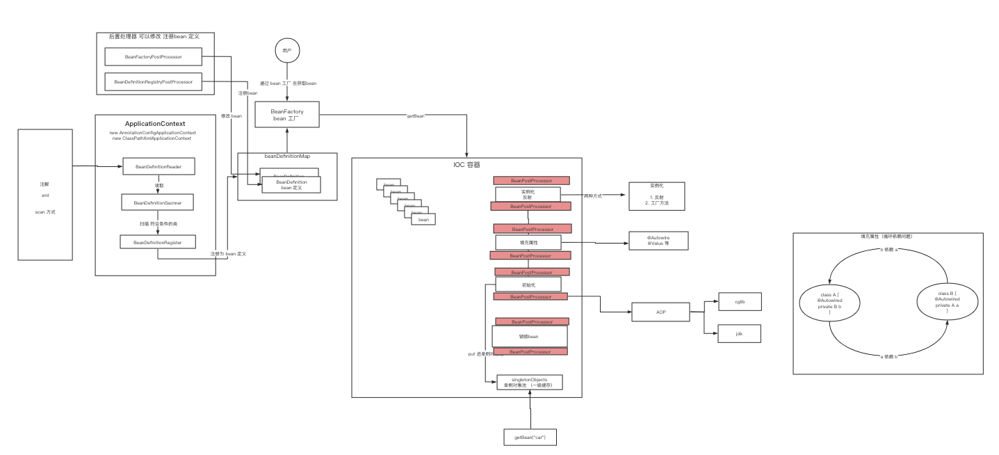
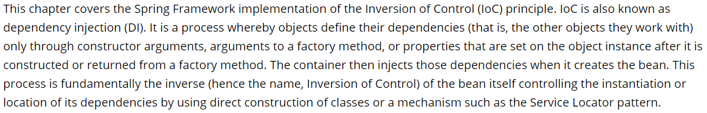

### 1. Spring整体架构
   
   

#### 1. Core Container (核心容器)
 
  该模块主要包含Core、Beans、Context和SpEL模块, 其中Core和Beans是整个框架最基础的部分，提供IOC和依赖注入特性。这里最主要的
   概念就是BeanFactory,提供了以Factory模式的实现来消除对程序性单例模型。 

        core: 模块主要包含Spring框架最基本的核心工具类，Core是其他组件的基础核心
        
        Beans: 模块主要包含访问配置文件，创建/管理Bean以及IOC/DI相关的类
        
        Context: 继承了Beans得特性，主要为Spring提供大量的扩展，如果国际化、事件机制、资源加载等，ApplicationContext接口
        是Context模块的关键。
        
        SpEL: 模块提供了一个强大的语言表达式。

#### 2. AOP and Instrumentation 
    
  提供符合AOP Alliance 标准的面向切面编程的实现，可以让你定义如方法拦截器和切点，从而降低程序之间的耦合性。

        AspectJ模块: 提供了与AspectJ 的集成

        Instrumentation模块: 提供用于某些应用程序服务器的类工具支持和类加载器实现。

#### 3. Messaging 
        
   该模块具有来自Spring Integration 项目的关键抽象，如Message,MessageChannel，MessageHandler 等，它们构成基于消息的应用程序的
    基础。该模块还包括一组注释，用于将消息映射到方法，类似于基于Spring MVC 注释的编程模型。 

#### 4. Data Access/Integration 

  数据访问/集成层由JDBC,ORM,OXM,JMS 和事务模块组成。 

    JDBC模块: 提供了JDBC抽象层，从而无需进行繁琐的JDBC编码和数据库特定错误代码的解析。
    
    事务模块: 支持对实现特殊接口的类以及所有POJO(普通java对象) 进行编程和声明式事务管理。

    ORM模块: 该模块为当前流行的ORM(包括JPA,JDO和Hibernate) 提供了集成层。使用ORM模块，可以将所有这些O/R映射框架与spring提供
        的所有功能结合使用，如前面提到的事务管理功能。 

    OXM模块: 提供了一个抽象层，该抽象层支持object/XML 映射实现，例如: JAXB、Castor、XMLBeans、JiBX 和 XStream.

    JMX模块: 包含用于生成和使用消息的功能，从 spring Framework 4.1 开始，提供了与Spring-Messaging 模块集成。

#### 5. Web 

   Web 上下文模块建立在应用程序上下文模块之上，为基于Web的应用程序提供上限支持。该模块包含Web、WebMVC、Web Socket 和 Web-Porlet 模块。

    Web模块: 提供了基本的面向对象Web的集成功能，如文件上传功能以及使用Servlet 监听器和面向Web的应用程序上下文对IOC容器的初始化。

    WebMVC模块: 包含基于Spring的Model-View-Controller 支持和针对Web应用程序的Rest Web 服务实现。

    Web-Portlet模块: 提供Portlet 环境中的MVC 实现。

#### 6. Test 

  该模块支持使用JUnit 或TetsNG 对Spring 组件进行单元测试和集成测试。

### 2. spring 控制反转 和依赖注入

  什么是控制反转？ 基于软件设计的一个重要思想： 依赖倒置原则(Dependency Inversion Principle) 

  什么是依赖倒置原则: 假设 设计一辆汽车： 先设计轮子，然后根据轮子大小设计低盘，接着根据底盘设计车身，最后根据车身设计好整个车子。 
    这里就出现了一个 依赖 关系， 汽车依赖 车身，车身依赖底盘，底盘依赖轮子。

  反过来，汽车公司决定修改轮胎，那么只需要该轮子的设计，其他的就不需要动。轮胎依赖底盘，底盘依赖车身，车身依赖车子

#### 2.1 IOC  最核心的思想

   ioc 的思想最核心的地方在于，资源不由使用资源的双方管理，而由不使用资源的第三方(IOC容器)管理，这就可以带来很多好处。第一，资源集中管理，
  实现资源的可配置和易管理。第二，降低了使用资源双方的依赖程度，也就是耦合度。


### 3. Spring 整体脉络流程图



### IoC容器的设计理念
   
   
   
   **IoC**(Inversion of Control) 也称为**依赖注入**(dependency injection, DI)。它是一个==对象定义依赖关系的过程==，也就是说，对象只通过构造函数参数、工厂方法的参数或对象实例构造或从工厂方法返回后在对象实例上设置的属性来定义它们所使用的其他对象。然后==容器在创建bean时注入这些依赖项==。这个过程基本上是bean的逆过程，因此称为**控制反转**(IoC)
   
   在Spring中，构成应用程序主干并由Spring IoC容器管理的对象称为**bean**。bean是由Spring IoC容器实例化、组装和管理的对象。
   
   IoC容器设计理念：通过容器统一对象的构建方式，并且自动维护对象的依赖关系。
   
   
   
   https://www.processon.com/view/link/5cd10507e4b085d010929d02
   
### IoC的应用
   
   

#### bean 的装配方式

   1.xml
   
   2.@ImportResource
   
   3.@Component +@ComponentScan
   
   4.@Bean+ @Configuration
   
   5.@Import
   
   6.@Conditional
   
##### xml
```
<?xml version="1.0" encoding="UTF-8"?>
<beans xmlns="http://www.springframework.org/schema/beans"
       xmlns:xsi="http://www.w3.org/2001/XMLSchema-instance"
       xsi:schemaLocation="http://www.springframework.org/schema/beans
        https://www.springframework.org/schema/beans/spring-beans.xsd">

    <bean id="user"  class="com.wlz.bean.User"/>
</beans>
```
 容器加载xml
```
ApplicationContext context = new ClassPathXmlApplicationContext("spring.xml");
for(String beanName:context.getBeanDefinitionNames()){
			System.out.println(beanName+":  "+context.getBean(beanName));
}
```

#####  @ImportResource
```
@ImportResource("spring.xml")
public class AppConfig {

}
```
 容器加载@ImportResource
```
ApplicationContext context = new AnnotationConfigApplicationContext(AppConfig.class);
for(String beanName:context.getBeanDefinitionNames()){
			System.out.println(beanName+":  "+context.getBean(beanName));
}
```

##### @Component +@ComponentScan
  @ComponentScan默认扫描: @Component, @Repository，@Service, @Controller
```
@Configuration
@ComponentScan("com.wlz")
public class AppConfig {
}
```
 容器加载
```
ApplicationContext context = new AnnotationConfigApplicationContext(AppConfig.class);
for(String beanName:context.getBeanDefinitionNames()){
			System.out.println(beanName+":  "+context.getBean(beanName));
}
```
###### @CompentScan  注解扩展用法：
 
  1.排除用法 excludeFilters
```
@ComponentScan(basePackages = "com.wlz",excludeFilters = {
    @ComponentScan.Filter(type = FilterType.ANNOTATION,value = {Service.class}),
    @ComponentScan.Filter(type = FilterType.ASSIGNABLE_TYPE,value = {User.class})
})
```  
  2.包含用法 includeFilters  
```
@ComponentScan(basePackages = "com.wlz",includeFilters = {
    @ComponentScan.Filter(type = FilterType.CUSTOM,value = {CustomTypeFilter.class})
},useDefaultFilters = false)
```
  ==FilterType.CUSTOM实现自定义过滤规则==
```
public class CustomTypeFilter implements TypeFilter {
    @Override
    public boolean match(MetadataReader metadataReader, MetadataReaderFactory metadataReaderFactory) throws IOException {
        
        ClassMetadata classMetadata = metadataReader.getClassMetadata();
        if (classMetadata.getClassName().contains("Service")) {
            return true;
        }
        return false;
    }
}
```

##### @Bean+ @Configuration
```
@Configuration
public class AppConfig {

    @Bean
    public User user(){
        return new User();
    }

    @Bean
    public UserService userService(){
        // 调用其他@Bean方法
        return new UserService(user());
    }
}
```

###### 配置bean 的作用域对象 

    1. singleton 单实例的（默认）

    2. prototype 多实例的

    3. request 同一次请求 

    4. session 同一个回话级别

###### @Lazy 

```
@Bean
@Lazy
public Persion persion() {
    return new Persion();
}
```

   主要针对单实例的bean 容器启动的时候，不创建对象，在第一次使用的时候才会创建对象。

##### @Import
```
@Import(value = MyImportBeanDefinitionRegistrar.class)
public class AppConfig {
}
```
**Configuration**
 导入一个或多个配置类
```
@Configuration
public class ConfigA {

    @Bean
    public A a() {
        return new A();
    }
}
```
```
@Configuration
@Import(ConfigA.class)
public class ConfigB {

    @Bean
    public B b() {
        return new B();
    }
}
```
**ImportSelector**
```
public class MyImportSelector implements ImportSelector {
   @Override
   public String[] selectImports(AnnotationMetadata importingClassMetadata) {
      return new String[]{User.class.getName()}; 
   }
}
```
**ImportBeanDefinitionRegistrar**
```
public class MyImportBeanDefinitionRegistrar implements ImportBeanDefinitionRegistrar {
   @Override
   public void registerBeanDefinitions(AnnotationMetadata importingClassMetadata,BeanDefinitionRegistry registry) {
      //创建BeanDefinition
      RootBeanDefinition rootBeanDefinition = new RootBeanDefinition(User.class);
      // 注册到容器
      registry.registerBeanDefinition("user",rootBeanDefinition);
   }
}
```

##### @Conditional
 
  @Conditional是Spring4新提供的注解，它的作用是按照一定的条件进行判断，满足条件给容器注册bean。
```
@Configuration
public class AppConfig {
  @Bean
  public Cat cat(){
     return new Cat();
  }
    
  @Bean
  @Conditional(value = MyConditional.class)
  public User user(){
     return new User();
  }
}

public class MyConditional implements Condition {
   @Override
   public boolean matches(ConditionContext context, AnnotatedTypeMetadata metadata) {
      if(context.getBeanFactory().containsBean("cat"))
         return true;
      return false;
   }
}
```
  应用场景：
  
  Spring boot 自动配置实现核心技术之一： 条件装配 ，Spring Boot进行了扩展
  
  - @ConditionalOnWebApplication：当前项目是 Web项目的条件下
  
  - @ConditionalOnBean：当容器里有指定 Bean 的条件下
  
  - @ConditionalOnMissingBean：当容器里没有指定 Bean 的情况下
  
  - @ConditionalOnClass：当类路径下有指定类的条件下
  
  - @ConditionalOnMissingClass：当类路径下没有指定类的条件下
  
  - @ConditionalOnProperty：指定的属性是否有指定的值


##### 向容器中添加组件的方式 

###### 1. 通过 @ComponentScan + @Controller @Service @Respository @Componet 

    实用场景: 针对自己写的组件可以通过该方式来进行加载到容器 

###### 2. 通过@Bean 的方式来导入组件 

    适用于导入第三方组件 

###### 3. 通过 @Import 来导入组件 （导入组件的id 为全类名路径）

```

@Configuration
@Import(value = {A.class, B.class})
public class AppConfig3 {
	
	
}
```

###### 4. 通过 @Import 的 ImportSeletor 类实现组件的导入 (导入的组件为全类名)

```
@Configuration
@Import(value = {A.class, B.class, MyImportSeletor.class})
public class AppConfig3 {
}

public class MyImportSeletor implements ImportSelector {
	@Override
	public String[] selectImports(AnnotationMetadata importingClassMetadata) {
		return new String[]{"com.wlz.bean.A"};
	}
}
```

###### 5. 通过@Improt 的 ImportBeanDefinitionRegister 导入组件 (可以指定bean 名称)


```
@Configuration
@Import(value = {A.class, B.class, MyImportSeletor.class, MyImportBeanDefinitionRegistrar.class})
public class AppConfig3 {

}

public class MyImportBeanDefinitionRegistrar implements ImportBeanDefinitionRegistrar {
	@Override
	public void registerBeanDefinitions(AnnotationMetadata importingClassMetadata, BeanDefinitionRegistry registry) {
        // 创建bean 定义
		BeanDefinition beanDefinition = new RootBeanDefinition(A.class);
		// 将bean 定义注册到容器中
		registry.registerBeanDefinition("a",beanDefinition);

	}
}
```

###### 6. 通过 FactoryBean 接口实现组件注册

```java
public class MyFactoryBean implements FactoryBean<A> {

	/**
	 *  返回 bean 的对象
	 * @return
	 * @throws Exception
	 */
	@Override
	public A getObject() throws Exception {
		return new A();
	}

	/**
	 *  返回bean 的类型
	 * @return
	 */
	@Override
	public Class<?> getObjectType() {
		return A.class;
	}

	/**
	 *  是否为单例
	 * @return
	 */
	@Override
	public boolean isSingleton() {
		return true;
	}
}
```

##### bean 的初始化和销毁 

   什么是 bean 的生命周期: 创建-》初始化-》 销毁 
   
   由容器管理Bean 的生命周期，可以通过自己指定bean 的初始化和销毁方法

    针对单实例的bean, 容器启动的时候，bean 的对象就创建了，而且容器销毁的时候，也会调用bean 的销毁方法

    针对多实例bean, 容器启动的时候，bean 是不会被创建，而是在获取bean 的时候被创建，bean的销毁不受ioc 容器的管理

###### 1. 通过 initMethod 和 destroyMethod 方法 

```java
@Configuration
public class AppConfig4 {

    @Bean(initMethod = "init",destroyMethod = "destroy")
    public MyBeanBeanInitDestroy myBeanBeanInitDestroy() {
        return new MyBeanBeanInitDestroy();
    }
}

public class MyBeanBeanInitDestroy {

    public MyBeanBeanInitDestroy() {
        System.out.println("MyBeanBeanInitDestroy Constructor.....");
    }

    public void init() {
        System.out.println("MyBeanBeanInitDestroy init  .....");
    }


    public void destroy() {
        System.out.println("MyBeanBeanInitDestroy destroy .......");
    }
}
```

###### 2. 通过 InitializingBean 和 DisposableBean 接口

```java
@Component
public class MyBeanInitAndDestroy implements InitializingBean, DisposableBean {
	@Override
	public void destroy() throws Exception {
		System.out.println("DisposableBean 的 destroy 方法。。。。。");
	}

	@Override
	public void afterPropertiesSet() throws Exception {
		System.out.println("InitializingBean 的 afterPropertiesSet 方法。。。。");
	}
}
```

###### 3. 通过 JSR250 规范 提供的注解@PostConstruct 和  @ProDestroy 标注的方法

```java
@Component
public class MyJSR250BeanInitAndDestroy {


	public MyJSR250BeanInitAndDestroy() {
		System.out.println("MyJSR250BeanInitAndDestroy Construct .......");
	}


	@PostConstruct
	public void init() {
		System.out.println("MyJSR250BeanInitAndDestroy @PostConstruct init....");
	}

	@PreDestroy
	public void destory() {
		System.out.println("MyJSR250BeanInitAndDestroy @PreDestroy destory .... ");
	}
}
```

###### 4. 通过 Spring 的 BeanPostProcessor 的 bean 的后置处理器 会拦截所有的bean 创建过程

```java
@Component
public class MyBeanPostProcessor implements BeanPostProcessor {

	@Override
	public Object postProcessBeforeInitialization(Object bean, String beanName) throws BeansException {
		System.out.println("postProcessBeforeInitialization: "+ beanName);
		return bean;
	}

	@Override
	public Object postProcessAfterInitialization(Object bean, String beanName) throws BeansException {
		System.out.println("postProcessAfterInitialization: "+ beanName);
		return bean;
	}
}
```

###### 5. 通过@Value + @PropertySource 来赋值 

```java
@Configuration
@PropertySource(value = {"classpath:person.properties"}) // 指定外部文件位置
public class AppConfig5 {

    @Bean
    public Person person() {
        return new Person();
    }

}

public class Person {

	/**
	 *   普通的方式
	 */
	@Value("wlz")
	private String name;

	/**
	 *  spel 方式
	 */
	@Value("#{28-8}")
	private Integer age;

	/**
	 *  读取外部配置文件的方式
	 */
	@Value("${person.lastName}")
	private String lastName;


	@Override
	public String toString() {
		return "Person{" +
				"name='" + name + '\'' +
				", age=" + age +
				", lastName='" + lastName + '\'' +
				'}';
	}
}
```

#### bean的依赖注入

##### 查找方式：
  - byType User.class
  - byName beanName

##### 自动装配注解：
   
   1.@Autowired
        
        - @Autowired是spring自带的注解，通过`AutowiredAnnotationBeanPostProcessor`类实现的依赖注入；
        
        - ==@Autowired是根据类型进行自动装配的==，如果需要按名称进行装配，则需要配合@Qualifier；
        - @Autowired有个属性为required，可以配置为false，如果配置为false之后，当没有找到相应bean的时候，系统不会抛错；
        
        - @Autowired可以作用在变量、setter方法、构造函数上。
   
   2.@Resource
        
        - @Resource是JSR250规范的实现，需要导入javax.annotation实现注入；
        
        - @Resource是根据名称进行自动装配的，一般会指定一个name属性，==当找不到与名称匹配的bean时才按照类型进行装配==；
        
        - @Resource可以作用在变量、setter方法上。
   
   3.@Inject
       
       - @Inject是JSR330 (Dependency Injection for Java)中的规范，需要导入javax.inject.Inject;实现注入。
       
       - ==@Inject是根据类型进行自动装配的==，如果需要按名称进行装配，则需要配合@Named；
       
       - @Inject可以作用在变量、setter方法、构造函数上。
```
<dependency>
    <groupId>javax.inject</groupId>
    <artifactId>javax.inject</artifactId>
    <version>1</version>
</dependency>
```

##### 注入方式及原理：
   
   1.field(属性注入):
    注入原理： 属性反射
```
AbstractAutowireCapableBeanFactory#populateBean
AutowiredAnnotationBeanPostProcessor.AutowiredFieldElement#inject
>value = beanFactory.resolveDependency(desc, beanName, autowiredBeanNames, typeConverter)
>field.set(bean, value)
```
   
   2.constructor(构造方法注入):
     
     不配置@Autowired情况下
     
     * 当只有一个构造器时，如果构造器入参都是bean,则会执行此构造器（参数会自动注入），如果出现非bean的入参，则会抛出NoSuchBeanDefinitionException      
     
     * 当显示定义多个构造器时，会默认调用无参构造器，如果没有无参构造器，则会抛出 No default constructor found
     
     * 当该bean的beanDefinition设置了AutowireMode为3后，则会选择构造器贪婪模式，选择合适的构造器列表(前提：构造器入参都是bean) 构造bean对象
```
@Component
public class MyBeanFactoryProcessor implements BeanFactoryPostProcessor {
   @Override
   public void postProcessBeanFactory(ConfigurableListableBeanFactory beanFactory) throws BeansException {
      AbstractBeanDefinition beanDefinition = (AbstractBeanDefinition) beanFactory.getBeanDefinition("userService");
       //构造器贪婪模式
      beanDefinition.setAutowireMode(3);
   }
}
```
  多构造器筛选时会先排序，构造器排序会先比较方法修饰符（Modifier），然后比较方法参数。同为public情况下，会选择参数多的构造器构造bean对象。
```
AbstractAutowireCapableBeanFactory#createBeanInstance
ConstructorResolver#autowireConstructor
> AutowireUtils.sortConstructors(candidates)
>> ConstructorResolver#createArgumentArray    
> bw.setBeanInstance(instantiate(beanName, mbd, constructorToUse, argsToUse))
```

   3.setter

      不配置*@Autowired情况下*
      
      通过设置AutowireMode为1或者2，会调用setter方法，通过setter方法注入bean
```
// AutowireCapableBeanFactory
int AUTOWIRE_NO = 0;
int AUTOWIRE_BY_NAME = 1;
int AUTOWIRE_BY_TYPE = 2;
int AUTOWIRE_CONSTRUCTOR = 3;
```
   注入原理：  方法反射
```
AbstractAutowireCapableBeanFactory#populateBean
AutowiredAnnotationBeanPostProcessor.AutowiredMethodElement#inject
>arg = beanFactory.resolveDependency(currDesc, beanName, autowiredBeans, typeConverter)
>method.invoke(bean, arguments)
```

### 思考：FactoryBean和BeanFactory的区别？
   
  BeanFactory和FactoryBean的区别
    
    BeanFactory是接口，提供了OC容器最基本的形式，给具体的IOC容器的实现提供了规范，
    
    FactoryBean也是接口，为IOC容器中Bean的实现提供了更加灵活的方式，FactoryBean在IOC容器的基础上给Bean的实现加上了一个简单工厂模式和装饰模式
    我们可以在getObject()方法中灵活配置。其实在Spring源码中有很多FactoryBean的实现类.
    
    区别：BeanFactory是个Factory，也就是IOC容器或对象工厂，FactoryBean是个Bean。在Spring中，所有的Bean都是由BeanFactory(也就是IOC容器)来进行管理的。
    
    但对FactoryBean而言，这个Bean不是简单的Bean，而是一个能生产或者修饰对象生成的工厂Bean,它的实现与设计模式中的工厂模式和修饰器模式类似 
   
  FactoryBean：
    
    一般情况下，Spring通过反射机制利用<bean>的class属性指定实现类实例化Bean，在某些情况下，实例化Bean过程比较复杂，如果按照传统的方式，则需要在<bean>中提供大量的配置信息。
    配置方式的灵活性是受限的，这时采用编码的方式可能会得到一个简单的方案。Spring为此提供了一个org.springframework.bean.factory.FactoryBean的工厂类接口，
    用户可以通过实现该接口定制实例化Bean的逻辑。FactoryBean接口对于Spring框架来说占用重要的地位，Spring自身就提供了70多个FactoryBean的实现。
    它们隐藏了实例化一些复杂Bean的细节，给上层应用带来了便利。从Spring3.0开始，FactoryBean开始支持泛型，即接口声明改为FactoryBean<T>的形式
    
    以Bean结尾，表示它是一个Bean，不同于普通Bean的是：它是实现了FactoryBean<T>接口的Bean，根据该Bean的ID从BeanFactory中获取的实际上是FactoryBean的getObject()返回的对象，
    而不是FactoryBean本身，如果要获取FactoryBean对象，请在id前面加一个&符号来获取。
  
  
```
AbstractBeanFactory#getObjectForBeanInstance
!(beanInstance instanceof FactoryBean) || BeanFactoryUtils.isFactoryDereference(name)
```    
  factoryBeanObjectCache ：  缓存getObject()获取的单例
```
FactoryBeanRegistrySupport#getCachedObjectForFactoryBean
```
  allBeanNamesByType：  缓存  getObjectType ：FactoryBean
  

```
DefaultListableBeanFactory#getBeanNamesForType(java.lang.Class<?>, boolean, boolean)

FactoryBeanRegistrySupport#getTypeForFactoryBean
```

  
  
  应用场景：
  
  如何将接口交给Spring管理？
  
  实现：  

  - mybatis-spring.jar   MapperFactoryBean
  
  - feign      FeignClientFactorybean
  
### 2. 手动装配和自动装配的区别，自动装配模型Autowiring Modes 详解
   
   1.xml (spring 早期是使用xml方式) 
     手动装配：  ref
     自动装配： autowire modes 自动配置模型:  no  byType  byName  constructor
```
    <bean id="user"  class="com.wlz.bean.User"  />

    <bean name="user2"  class="com.wlz.bean.User"  />

    <bean id="userService" class="com.wlz.service.UserService" >
        <!-- 手动装配-->
        <!--setter-->
        <property name="user" ref="user"/>
        <!--constructor-->
        <constructor-arg ref="user"/>
    </bean>

    <!-- 自动装配  autowire = no  byType  byName  constructor-->
    <bean id="userService2" class="com.wlz.service.UserService" autowire="byName">
    </bean>
```

   2.annotation / java configuration 
   
        @Autowired     autowireMode =0   1 2 3 (默认为0) 
    
     注解是借助于 AutowiredAnnotationBeanPostProcessor 后置处理器实现的
     
     InjectedElement#inject
         
         AutowiredFieldElement extends InjectionMetadata.InjectedElement
         
         AutowiredMethodElement extends InjectionMetadata.InjectedElement
   
    


