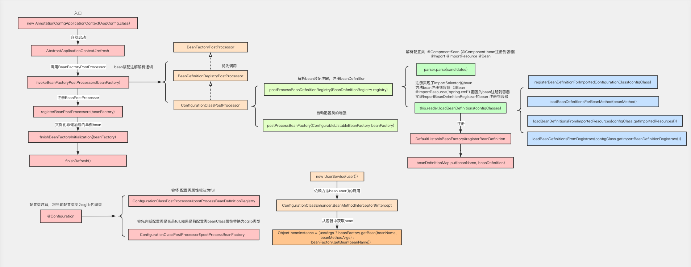
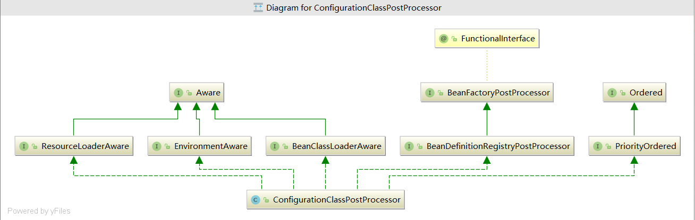

### BeanFactoryPostProcessor
   BeanFactoryPostProcessor是实现spring容器功能扩展的重要接口，例如修改bean属性值，实现bean动态代理等。
   
   - BeanFactoryPostProcessor
   
   - BeanDefinitionRegistryPostProcessor
   
   - ConfigurationClassPostProcessor
   
   
   
   
   
### @Configuration原理剖析

#### @Configuration使用

官方文档描述：

用@Configuration注释类表明其主要目的是作为bean定义的源

@Configuration类允许通过调用同一类中的其他@Bean方法来定义bean之间的依赖关系。

##### 代码示例
```
@Test
public void test(){
   AnnotationConfigApplicationContext context =
         new AnnotationConfigApplicationContext(AppConfig.class);
   System.out.println(context.getBean("myService"));
}
```
```
@Configuration
public class AppConfig {

    @Bean  
    public MyService myService() {
        return new MyService();
    }
    
    @Bean
    public UserService userService(){
		return new UserService(myService()); // 调用其他@Bean方法
	}
}
```
```
public class MyService {
	public void query(){
		System.out.println("====query=");
	}
}

public class UserService {

   public UserService(MyService myService) {
      System.out.println("=====UserService Constructor======"+myService);
   }
}
```

#### 配置 @Configuration和不配置的区别？
 
 不配置@Configuration： 当内部method bean发生彼此依赖的时候会导致多例
 
 @Configuration的作用：
 
     1.表明当前类是一个配置类，是方法bean的源
     
     2.将@Configuration配置的AppConfig的BeanDefinitioin属性赋值为full类型，保证AppConfig类型可以转变为cglib类型
     
     3.将@Configuration配置的AppConfig由普通类型转变为cglib代理类型，最后会生成cglib代理对象，通过代理对象的方法拦截器，可以解决AppConfig内部方法bean之间发生依赖调用的时候
     从容器中去获取，避免了多例的出现。
     
     4.被@Configuration修饰的类，spring容器中会通过cglib给这个类创建一个代理，代理会拦截所有被@Bean修饰的方法，默认情况（bean为单例）下确保这些方法只被调用一次，
     从而确保这些bean是同一个bean，即单例的。
 
 配置了@Configuration ,打印结果显示  UserService 依赖的对象myService和从容器中获取的对象myService
 
 是同一个对象。表明：UserService 依赖的对象myService是从容器中获取的，是一个bean
```
=====UserService Constructor======com.wlz.service.MyService@9225652
com.wlz.service.MyService@9225652  
```
  
  没有配置@Configuration，打印结果显示 UserService 依赖的对象myService和从容器中获取的对象myService
  
  不是同一个对象。表明：UserService依赖的对象myService 不是从容器中获取的，只是一个普通的对象
```
=====UserService Constructor======com.wlz.service.MyService@501edcf1
com.wlz.service.MyService@7d3a22a9
```
#### 思考：为什么@Configuration配置和不配置会有这么大的区别？
   原因分析
   
   @Configuration修饰的AppConfig是一个cglib的代理对象
```
//com.wlz.config.AppConfig$$EnhancerBySpringCGLIB$$c983ca26@50a638b5
System.out.println(context.getBean("appConfig")); 
```
  可以看出appConfig是一个代理对象，此时调用myService()方法，会去执行BeanMethodInterceptor#intercept,
  
  最终会从容器中获取bean
```
new UserService(myService())
>ConfigurationClassEnhancer.BeanMethodInterceptor#intercept
>ConfigurationClassEnhancer.BeanMethodInterceptor#resolveBeanReference

Object beanInstance = (useArgs ? beanFactory.getBean(beanName, beanMethodArgs) :
						beanFactory.getBean(beanName)); //从容器中获取bean
```
  所以@Configuration 保证了配置类的内部方法之间依赖调用时都从容器中获取bean。

####  @Configuration源码分析
   AppConfig变为AppConfig$EnhancerBySpringCGLIB
   
   AppConfig 在容器启动前注册到容器
```
AnnotationConfigApplicationContext context =
      new AnnotationConfigApplicationContext(AppConfig.class);
> 
//  注册AppConfig, ApplicationContext传入的配置类
register(annotatedClasses);
refresh();// 启动容器
```
  此时，AppConfig的beanDefinition的属性beanClassName还是普通类型bat.ke.qq.com.config.AppConfig
  
  当容器启动过程中，调用invokeBeanFactoryPostProcessors(beanFactory)方法后，beanClassName已经变为
  
  了AppConfig$$EnhancerBySpringCGLIB 类型
```
AbstractApplicationContext#refresh
>invokeBeanFactoryPostProcessors(beanFactory); // AppConfig---AppConfig$$EnhancerBySpringCGLIB
```
##### 类型改变原因跟踪  
```
invokeBeanFactoryPostProcessors(beanFactory); 
>PostProcessorRegistrationDelegate#invokeBeanFactoryPostProcessors(ConfigurableListableBeanFactory, java.util.List<BeanFactoryPostProcessor>)
>    
//此方法会拿到ConfigurationClassPostProcessor
beanFactory.getBean(ppName, BeanDefinitionRegistryPostProcessor.class)    
    
// 会调用 ConfigurationClassPostProcessor#postProcessBeanDefinitionRegistry 解析注解，注册bean
invokeBeanDefinitionRegistryPostProcessors(currentRegistryProcessors, registry);

//会调用 ConfigurationClassPostProcessor#postProcessBeanFactory  
invokeBeanFactoryPostProcessors(registryProcessors, beanFactory);
```
   调用 ConfigurationClassPostProcessor#postProcessBeanDefinitionRegistry  会将 AppConfig 的配置类属性标注为full
```
ConfigurationClassPostProcessor#processConfigBeanDefinitions
>ConfigurationClassUtils#checkConfigurationClassCandidate

// 判断是否有配置@Configuration
if (isFullConfigurationCandidate(metadata)) {
	// 设置org.springframework.context.annotation.ConfigurationClassPostProcessor.configurationClass为full
beanDef.setAttribute(CONFIGURATION_CLASS_ATTRIBUTE, CONFIGURATION_CLASS_FULL);
}
// 判断是否配置 @Component,@ComponentScan,@Import,@ImportResource 和方法配置了@Bean
else if (isLiteConfigurationCandidate(metadata)) {
	// 设置org.springframework.context.annotation.ConfigurationClassPostProcessor.configurationClass为lite
    beanDef.setAttribute(CONFIGURATION_CLASS_ATTRIBUTE, CONFIGURATION_CLASS_LITE);
}
```
   调用ConfigurationClassPostProcessor#postProcessBeanFactory  会先判断AppConfig是否是full,如果是将AppConfig的属性
   
   beanClassName替换为cglib类型
```
ConfigurationClassPostProcessor#postProcessBeanFactory
>
// 增强@Configuration修饰的配置类    AppConfig--->AppConfig$$EnhancerBySpringCGLIB
enhanceConfigurationClasses(beanFactory);
>ConfigurationClassPostProcessor#enhanceConfigurationClasses
// 判断配置类是否是full
if (ConfigurationClassUtils.isFullConfigurationClass(beanDef)) 
    
// 转换为cglib类型
Class<?> enhancedClass = enhancer.enhance(configClass, this.beanClassLoader);
> ConfigurationClassEnhancer#enhance
//  使用一个CGLIB增强器创建配置类configClass的子类enhancedClass
Class<?> enhancedClass = createClass(newEnhancer(configClass, classLoader));
```

#### @Configuration总结
@Configuration的作用：

    1.表明当前类是一个配置类，是方法bean的源
    
    2.将@Configuration配置的AppConfig的BeanDefinitioin属性赋值为full类型，==保证AppConfig类型可以转变为cglib类型==
    
    3.将@Configuration配置的AppConfig由普通类型转变为cglib代理类型，最后会生成cglib代理对象，通过代理对象的方法拦截器，
    可以解决AppConfig内部方法bean之间发生依赖调用的时候从容器中去获取==，避免了多例的出现。==
