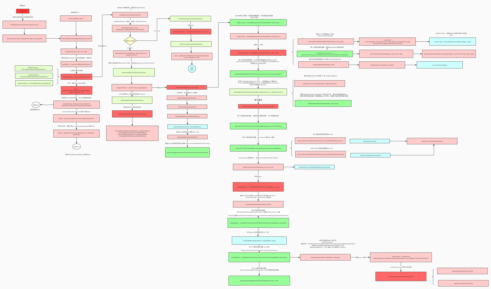

### BeanFactoryPostProcessor
   BeanFactoryPostProcessor是实现spring容器功能扩展的重要接口，例如修改bean属性值，实现bean动态代理等。
   
   - BeanFactoryPostProcessor
   
   - BeanDefinitionRegistryPostProcessor
   
   - ConfigurationClassPostProcessor
   
   
   
   
   
### @Configuration原理剖析

#### @Configuration使用

官方文档描述：

用@Configuration注释类表明其主要目的是作为bean定义的源

@Configuration类允许通过调用同一类中的其他@Bean方法来定义bean之间的依赖关系。

##### 代码示例
```
@Test
public void test(){
   AnnotationConfigApplicationContext context =
         new AnnotationConfigApplicationContext(AppConfig.class);
   System.out.println(context.getBean("myService"));
}
```
```
@Configuration
public class AppConfig {

    @Bean  
    public MyService myService() {
        return new MyService();
    }
    
    @Bean
    public UserService userService(){
		return new UserService(myService()); // 调用其他@Bean方法
	}
}
```
```
public class MyService {
	public void query(){
		System.out.println("====query=");
	}
}

public class UserService {

   public UserService(MyService myService) {
      System.out.println("=====UserService Constructor======"+myService);
   }
}
```

#### 配置 @Configuration和不配置的区别？
 
 不配置@Configuration： 当内部method bean发生彼此依赖的时候会导致多例
 
 @Configuration的作用：
 
     1.表明当前类是一个配置类，是方法bean的源
     
     2.将@Configuration配置的AppConfig的BeanDefinitioin属性赋值为full类型，保证AppConfig类型可以转变为cglib类型
     
     3.将@Configuration配置的AppConfig由普通类型转变为cglib代理类型，最后会生成cglib代理对象，通过代理对象的方法拦截器，可以解决AppConfig内部方法bean之间发生依赖调用的时候
     从容器中去获取，避免了多例的出现。
     
     4.被@Configuration修饰的类，spring容器中会通过cglib给这个类创建一个代理，代理会拦截所有被@Bean修饰的方法，默认情况（bean为单例）下确保这些方法只被调用一次，
     从而确保这些bean是同一个bean，即单例的。
 
 配置了@Configuration ,打印结果显示  UserService 依赖的对象myService和从容器中获取的对象myService
 
 是同一个对象。表明：UserService 依赖的对象myService是从容器中获取的，是一个bean
```
=====UserService Constructor======com.wlz.service.MyService@9225652
com.wlz.service.MyService@9225652  
```
  
  没有配置@Configuration，打印结果显示 UserService 依赖的对象myService和从容器中获取的对象myService
  
  不是同一个对象。表明：UserService依赖的对象myService 不是从容器中获取的，只是一个普通的对象
```
=====UserService Constructor======com.wlz.service.MyService@501edcf1
com.wlz.service.MyService@7d3a22a9
```
#### 思考：为什么@Configuration配置和不配置会有这么大的区别？
   原因分析
   
   @Configuration修饰的AppConfig是一个cglib的代理对象
```
//com.wlz.config.AppConfig$$EnhancerBySpringCGLIB$$c983ca26@50a638b5
System.out.println(context.getBean("appConfig")); 
```
  可以看出appConfig是一个代理对象，此时调用myService()方法，会去执行BeanMethodInterceptor#intercept,
  
  最终会从容器中获取bean
```
new UserService(myService())
>ConfigurationClassEnhancer.BeanMethodInterceptor#intercept
>ConfigurationClassEnhancer.BeanMethodInterceptor#resolveBeanReference

Object beanInstance = (useArgs ? beanFactory.getBean(beanName, beanMethodArgs) :
						beanFactory.getBean(beanName)); //从容器中获取bean
```
  所以@Configuration 保证了配置类的内部方法之间依赖调用时都从容器中获取bean。

####  @Configuration源码分析
   AppConfig变为AppConfig$EnhancerBySpringCGLIB
   
   AppConfig 在容器启动前注册到容器
```
AnnotationConfigApplicationContext context =
      new AnnotationConfigApplicationContext(AppConfig.class);
> 
//  注册AppConfig, ApplicationContext传入的配置类
register(annotatedClasses);
refresh();// 启动容器
```
  此时，AppConfig的beanDefinition的属性beanClassName还是普通类型bat.ke.qq.com.config.AppConfig
  
  当容器启动过程中，调用invokeBeanFactoryPostProcessors(beanFactory)方法后，beanClassName已经变为
  
  了AppConfig$$EnhancerBySpringCGLIB 类型
```
AbstractApplicationContext#refresh
>invokeBeanFactoryPostProcessors(beanFactory); // AppConfig---AppConfig$$EnhancerBySpringCGLIB
```
##### 类型改变原因跟踪  
```
invokeBeanFactoryPostProcessors(beanFactory); 
>PostProcessorRegistrationDelegate#invokeBeanFactoryPostProcessors(ConfigurableListableBeanFactory, java.util.List<BeanFactoryPostProcessor>)
>    
//此方法会拿到ConfigurationClassPostProcessor
beanFactory.getBean(ppName, BeanDefinitionRegistryPostProcessor.class)    
    
// 会调用 ConfigurationClassPostProcessor#postProcessBeanDefinitionRegistry 解析注解，注册bean
invokeBeanDefinitionRegistryPostProcessors(currentRegistryProcessors, registry);

//会调用 ConfigurationClassPostProcessor#postProcessBeanFactory  
invokeBeanFactoryPostProcessors(registryProcessors, beanFactory);
```
   调用 ConfigurationClassPostProcessor#postProcessBeanDefinitionRegistry  会将 AppConfig 的配置类属性标注为full
```
ConfigurationClassPostProcessor#processConfigBeanDefinitions
>ConfigurationClassUtils#checkConfigurationClassCandidate

// 判断是否有配置@Configuration
if (isFullConfigurationCandidate(metadata)) {
	// 设置org.springframework.context.annotation.ConfigurationClassPostProcessor.configurationClass为full
beanDef.setAttribute(CONFIGURATION_CLASS_ATTRIBUTE, CONFIGURATION_CLASS_FULL);
}
// 判断是否配置 @Component,@ComponentScan,@Import,@ImportResource 和方法配置了@Bean
else if (isLiteConfigurationCandidate(metadata)) {
	// 设置org.springframework.context.annotation.ConfigurationClassPostProcessor.configurationClass为lite
    beanDef.setAttribute(CONFIGURATION_CLASS_ATTRIBUTE, CONFIGURATION_CLASS_LITE);
}
```
   调用ConfigurationClassPostProcessor#postProcessBeanFactory  会先判断AppConfig是否是full,如果是将AppConfig的属性
   
   beanClassName替换为cglib类型
```
ConfigurationClassPostProcessor#postProcessBeanFactory
>
// 增强@Configuration修饰的配置类    AppConfig--->AppConfig$$EnhancerBySpringCGLIB
enhanceConfigurationClasses(beanFactory);
>ConfigurationClassPostProcessor#enhanceConfigurationClasses
// 判断配置类是否是full
if (ConfigurationClassUtils.isFullConfigurationClass(beanDef)) 
    
// 转换为cglib类型
Class<?> enhancedClass = enhancer.enhance(configClass, this.beanClassLoader);
> ConfigurationClassEnhancer#enhance
//  使用一个CGLIB增强器创建配置类configClass的子类enhancedClass
Class<?> enhancedClass = createClass(newEnhancer(configClass, classLoader));
```

#### @Configuration总结
@Configuration的作用：

    1.表明当前类是一个配置类，是方法bean的源
    
    2.将@Configuration配置的AppConfig的BeanDefinitioin属性赋值为full类型，==保证AppConfig类型可以转变为cglib类型==
    
    3.将@Configuration配置的AppConfig由普通类型转变为cglib代理类型，最后会生成cglib代理对象，通过代理对象的方法拦截器，
    可以解决AppConfig内部方法bean之间发生依赖调用的时候从容器中去获取==，避免了多例的出现。==

### bean 的生命周期
    
   
   
#### Bean的构建流程
   
   - createBeanInstance
```
if (instanceWrapper == null) {
    //用来创建实例
    /**
     * 第2次调用后置处理器
     * 创建bean实例，并将实例放在包装类BeanWrapper中返回
     * 1.通过工厂方法创建bean实例     method.invoke(obj,args)   @Bean
     * 2.通过构造方法自动注入创建bean实例    clazz.newInstance(constructors)
     * 3.通过无参构造器创建bean实例   clazz.newInstance()
     */
    instanceWrapper = createBeanInstance(beanName, mbd, args);
}
```
   - populateBean
```
// Initialize the bean instance.
    // 初始化bean实例
    Object exposedObject = bean;
    try {
        //填充Bean，该方法就是发生依赖注入的地方
        // 填充bean 设置属性  InstantiationAwareBeanPostProcessor
        // 第5次，第6次调用后置处理器     注入依赖
        populateBean(beanName, mbd, instanceWrapper);
    }
```
   - InitializeBean
```
 //填充Bean，该方法就是发生依赖注入的地方
        // 填充bean 设置属性  InstantiationAwareBeanPostProcessor
        // 第5次，第6次调用后置处理器     注入依赖
 populateBean(beanName, mbd, instanceWrapper);
// 初始化bean 第7次调用后置处理器
        exposedObject = initializeBean(beanName, exposedObject, mbd);
```

#### 初始化以及销毁
  
  Spring 允许 Bean 在**初始化完成后**以及**销毁前**执行特定的操作。
  
  - 通过实现 InitializingBean / DisposableBean 接口；
  
  - 通过<bean> 的 init-method / destroy-method属性；
```
@Bean(initMethod="init", destroyMethod="destory")
等同于xml中配置 init-method   destroy-method
```
  - 通过@PostConstruct或@PreDestroy注解。
  
  Bean在实例化的过程中：**Constructor > @PostConstruct >InitializingBean > init-method**
  
  Bean在销毁的过程中：**@PreDestroy > DisposableBean > destroy-method**

### 循环依赖
```
singletonObjects    单例对象池    （一级缓存）
singletonsCurrentlyInCreation    缓存bean创建状态 
singletonFactories     单例工厂对象池   （二级缓存）
earlySingletonObjects    早期暴露的单例对象池（没有填充属性）  （三级缓存）
```
   field和setter如何借助三级缓存解决循环依赖的
```
1. 从缓存中获取A  singletonObjects，没有
2. 设置A的创建状态  singletonsCurrentlyInCreation  
beforeSingletonCreation(beanName);
3. 通过反射创建A对象
判断 当前是单例，且允许循环依赖而且当前bean处于创建状态
4. 缓存单例工厂 singletonFactories  

5. 填充A的属性    注入依赖
填充A的属性b, 会去singletonObjects中获取b,反向b没有

6. 设置B的创建状态 singletonsCurrentlyInCreation
7. 通过反射创建B对象
判断 当前是单例，且允许循环依赖而且当前bean处于创建状态
8. 缓存单例工厂 singletonFactories 
9. 填充B的属性    注入依赖
B的属性a,会去singletonObjects中获取a, 没有

核心：
10.从 singletonsCurrentlyInCreation中判断有没有a正在被创建，如果有
11.会earlySingletonObjects 提前暴露的单例对象池中找a，没有
12.会singletonFactories中获取单例工厂，可以拿到A
13.获取到未注入属性b的A对象，然后放入earlySingletonObjects中，
移除singletonFactories中a
14.B填充属性a,因为拿到A对象（早期bean earlySingletonObjects）
15.B初始化，然后移除创建状态，从singletonsCurrentlyInCreation移除b,
放入singletonObjects中
16. A填充属性b, b已经在singletonObjects中
17. A初始化，然后移除创建状态，从singletonsCurrentlyInCreation移除a,
放入singletonObjects中

# 业务getBean()调用
18. 从singletonObjects中拿到b,类型判断（beanFactory FactoryBean）
19. 从singletonObjects中拿到a，类型判断（beanFactory FactoryBean）
```
#### 核心代码
```
protected Object getSingleton(String beanName, boolean allowEarlyReference) {
		// 先从单例缓存中找，没有找到会先判断是否是正在创建的bean
		// isSingletonCurrentlyInCreation 判断对应的单例对象是否在创建中
		Object singletonObject = this.singletonObjects.get(beanName);
		if (singletonObject == null && isSingletonCurrentlyInCreation(beanName)) {
			synchronized (this.singletonObjects) {
				// earlySingletonObjects中保存所有提前曝光的单例，尝试从earlySingletonObjects中找
				singletonObject = this.earlySingletonObjects.get(beanName);
				if (singletonObject == null && allowEarlyReference) {
					// 如果允许早期依赖，可以尝试从singletonFactories中找到对应的单例工厂
					ObjectFactory<?> singletonFactory = this.singletonFactories.get(beanName);
					if (singletonFactory != null) {
						//创建bean，并缓存提前曝光的bean，就是还未进行属性注入的bean，用于解决循环依赖
						singletonObject = singletonFactory.getObject();
						this.earlySingletonObjects.put(beanName, singletonObject);
						this.singletonFactories.remove(beanName);
					}
				}
			}
		}
		return singletonObject;
	}
```
```
boolean earlySingletonExposure = (mbd.isSingleton() && this.allowCircularReferences &&
				isSingletonCurrentlyInCreation(beanName));
		if (earlySingletonExposure) {
			// 添加到singletonFactories SmartInstantiationAwareBeanPostProcessor#getEarlyBeanReference
			//第4次调用后置处理器
			// earlySingletonExposure为true，将早期的bean暴露出去
			addSingletonFactory(beanName, () -> getEarlyBeanReference(beanName, mbd, bean));
		}
```
####  构造器注入如何解决循环依赖？
  
  利用@Lazy，会获取到代理对象完成注入
```
DefaultListableBeanFactory#resolveDependency
>ContextAnnotationAutowireCandidateResolver#buildLazyResolutionProxy
```

###  BeanPostProcessor 
  
   Spring后置处理器贯穿整个bean的生命周期： 创建   初始化  销毁
   
   生产bean实例过程中涉及9次调用
   
   销毁bean实例过程中调用bean的销毁后置处理器
   
   - InstantiationAwareBeanPostProcessor
   - SmartInstantiationAwareBeanPostProcessor
   - MergedBeanDefinitionPostProcessor
   - BeanPostProcessor   
   - DestructionAwareBeanPostProcessor
   
   自动注入@Autowired：
   
   - AutowiredAnnotationBeanPostProcessor

#### 作用
  
   BeanPostProcessor是Spring容器的一个扩展点，可以进行自定义的实例化、初始化、依赖装配、依赖检查等流程，即可以覆盖默认的实例化，也可以增强初始化、依赖注入、依赖检查等流程。
   
   Spring 提供了很多BeanPostProcessor的扩展接口及其实现，用于完成除实例化之外的其他功能
```
public interface BeanPostProcessor {

	@Nullable
	default Object postProcessBeforeInitialization(Object bean, String beanName) throws BeansException {
		return bean;
	}

	@Nullable
	default Object postProcessAfterInitialization(Object bean, String beanName) throws 	BeansException {
		return bean;
	}
}
```
#### bean的创建和初始化
##### 第1次调用
```
InstantiationAwareBeanPostProcessor#postProcessBeforeInstantiation
```
  在目标对象实例化之前调用，可以返回任意类型的值，如果不为空， 此时可以代替原本应该生成的目标对象实例（一般是代理对象），并且会调用 postProcessAfterInitialization 方法，否则 走正常实例化流程
  
###### 源码跟踪
  
  调用 AbstractAutowireCapableBeanFactory的createBean方法创建bean实例
```
AbstractAutowireCapableBeanFactory#createBean(String, RootBeanDefinition, Object[]) 
>
// Give BeanPostProcessors a chance to return a proxy instead of the target bean instance.
// 实例化前的后置处理器调用 InstantiationAwareBeanPostProcessor
// 第1次调用后置处理器
Object bean = resolveBeforeInstantiation(beanName, mbdToUse);
if (bean != null) {
	// 直接返回替代的对象实例，不再实例化目标对象
	return bean;
}
```
  AbstractAutowireCapableBeanFactory#resolveBeforeInstantiation 代码如下：
```
protected Object resolveBeforeInstantiation(String beanName, RootBeanDefinition mbd) {
		Object bean = null;
		if (!Boolean.FALSE.equals(mbd.beforeInstantiationResolved)) {
			// Make sure bean class is actually resolved at this point.
			//确保此时bean类已经被解析
			if (!mbd.isSynthetic() && hasInstantiationAwareBeanPostProcessors()) {
				Class<?> targetType = determineTargetType(beanName, mbd);
				if (targetType != null) {
					// 在目标对象实例化之前调用，可以返回任意类型的值，如果不为空，
					// 此时可以代替原本应该生成的目标对象实例（一般是代理对象）
					// InstantiationAwareBeanPostProcessor#postProcessBeforeInstantiation
					bean = applyBeanPostProcessorsBeforeInstantiation(targetType, beanName);
					if (bean != null) {
						// 如果bean不为空，调用 postProcessAfterInitialization 方法，否则走正常实例化流程
						bean = applyBeanPostProcessorsAfterInitialization(bean, beanName);
					}
				}
			}
			mbd.beforeInstantiationResolved = (bean != null);
		}
		return bean;
	}
```
  通过如上代码可以进行实例化的预处理（自定义实例化bean，如创建相应的代理对象）和后处理（如进行自定义实例化的bean的依赖装配）。

##### 第2次调用
```
SmartInstantiationAwareBeanPostProcessor#determineCandidateConstructors
```
  确定要为给定bean使用的候选构造器，检查所有已注册的构造器，实现类 AutowiredAnnotationBeanPostProcessor，扫描@Autowired修饰的构造器,判断创建对象所用的构造器（deafult，primary）
  
###### 源码跟踪
  AbstractAutowireCapableBeanFactory的doCreateBean方法代码如下：
```
AbstractAutowireCapableBeanFactory#doCreateBean
>
if (instanceWrapper == null) {
/**
* 第2次调用后置处理器
* 创建bean实例，并将实例放在包装类BeanWrapper中返回
* 1.通过工厂方法创建bean实例
* 2.通过构造方法自动注入创建bean实例
* 3.通过无参构造器创建bean实例
*/			
	instanceWrapper = createBeanInstance(beanName, mbd, args);
}
```
  通过构造器创建的bean会调SmartInstantiationAwareBeanPostProcessor#determineCandidateConstructors
```
AbstractAutowireCapableBeanFactory#createBeanInstance
>
// Candidate constructors for autowiring?
// 自动装配的候选构造器   SmartInstantiationAwareBeanPostProcessor#determineCandidateConstructors
// 第2次调用后置处理器
Constructor<?>[] ctors = determineConstructorsFromBeanPostProcessors(beanClass, beanName);
```
##### 第3次调用

```
MergedBeanDefinitionPostProcessor#postProcessMergedBeanDefinition
```

允许后置处理器修改合并的bean定义  ，实现类 AutowiredAnnotationBeanPostProcessor，用于扫描@Autowired和@Value修饰的属性和方法，封装到InjectionMetadata

###### 源码跟踪

```
AbstractAutowireCapableBeanFactory#createBeanInstance
>
//允许后置处理器修改合并的bean定义   
// 第3次调用后置处理器
applyMergedBeanDefinitionPostProcessors(mbd, beanType, beanName);
```

```
protected void applyMergedBeanDefinitionPostProcessors(RootBeanDefinition mbd, Class<?> beanType, String beanName) {   
    for (BeanPostProcessor bp : getBeanPostProcessors()) {     
        if (bp instanceof MergedBeanDefinitionPostProcessor) { 
            MergedBeanDefinitionPostProcessor bdp = 
                (MergedBeanDefinitionPostProcessor) bp;  
            // 对指定bean的给定合并bean定义进行后处理。    
             bdp.postProcessMergedBeanDefinition(mbd, beanType, beanName);  
        }   
    }
}
```


##### 第4次调用

```
SmartInstantiationAwareBeanPostProcessor#getEarlyBeanReference
```

获得提前暴露的bean引用。主要用于解决循环引用的问题，只有单例对象才会调用此方法


###### 源码跟踪

AbstractAutowireCapableBeanFactory#getEarlyBeanReference

```
protected Object getEarlyBeanReference(String beanName, RootBeanDefinition mbd, Object bean) {
		Object exposedObject = bean;
		//第4次调用后置处理器 
		if (!mbd.isSynthetic() && hasInstantiationAwareBeanPostProcessors()) {
			for (BeanPostProcessor bp : getBeanPostProcessors()) {
				if (bp instanceof SmartInstantiationAwareBeanPostProcessor) {
					SmartInstantiationAwareBeanPostProcessor ibp = (SmartInstantiationAwareBeanPostProcessor) bp;
					exposedObject = ibp.getEarlyBeanReference(exposedObject, beanName);
				}
			}
		}
		return exposedObject;
	}
```


##### 第5次调用

```
InstantiationAwareBeanPostProcessor#postProcessAfterInstantiation
```

在目标对象实例化之后调用，此时对象被实例化，但是对象的属性还未设置。如果该方法返回fasle,则会忽略之后的属性设置。返回true，按正常流程设置属性值

###### 源码跟踪

```
// 填充bean 设置属性  InstantiationAwareBeanPostProcessors
// 第5次，第6次调用后置处理器     注入依赖
populateBean(beanName, mbd, instanceWrapper);
```

调用AbstractAutowireCapableBeanFactory#populateBean 

```
//  在属性设置之前修改bean的状态  InstantiationAwareBeanPostProcessor#postProcessAfterInstantiation
		// 第5次调用后置处理器
		if (!mbd.isSynthetic() && hasInstantiationAwareBeanPostProcessors()) {
			for (BeanPostProcessor bp : getBeanPostProcessors()) {
				if (bp instanceof InstantiationAwareBeanPostProcessor) {
					InstantiationAwareBeanPostProcessor ibp = (InstantiationAwareBeanPostProcessor) bp;
					//在目标对象实例化之后调用，此时对象被实例化，但是对象的属性还未设置。如果该方法返回
					//fasle,则会忽略之后的属性设置。返回true，按正常流程设置属性值
					if (!ibp.postProcessAfterInstantiation(bw.getWrappedInstance(), beanName)) {
						continueWithPropertyPopulation = false;
						break;
					}
				}
			}
		}

		if (!continueWithPropertyPopulation) {
			// InstantiationAwareBeanPostProcessor#postProcessAfterInstantiation方法返回false,
			// 直接返回，将忽略实例的属性设置
			return;
		}
```


##### 第6次调用

```
InstantiationAwareBeanPostProcessor#postProcessProperties
```

可以在该方法内对属性值进行修改（此时属性值还未设置，但可以修改原本会设置的进去的属性值）。如果postProcessAfterInstantiation方法返回false，该方法不会调用

依赖注入的逻辑就在此方法中

###### 源码跟踪

```
InstantiationAwareBeanPostProcessor ibp = (InstantiationAwareBeanPostProcessor) bp;
PropertyValues pvsToUse = ibp.postProcessProperties(pvs, bw.getWrappedInstance(), beanName);
```

bean注入逻辑

```
//@Autowired 属性注入逻辑
> AutowiredAnnotationBeanPostProcessor.postProcessProperties
>InjectionMetadata#inject
>AutowiredAnnotationBeanPostProcessor.AutowiredFieldElement#inject
>DefaultListableBeanFactory#resolveDependency
>DefaultListableBeanFactory#doResolveDependency
>DependencyDescriptor#resolveCandidate 
// 此方法直接返回 
>beanFactory.getBean(beanName);
```

AutowiredAnnotationBeanPostProcessor.AutowiredFieldElement#inject  中通过

field.set(bean, value) 设置属性值


##### 第7次调用

```
BeanPostProcessor#postProcessBeforeInitialization
```

当bean new出来并完成属性填充后（自动装配） ，回调init方法前调用

其他扩展：

Aware方法调用 , 比如 实现了ApplicationContextAware或EnvironmentAware 接口

```
ApplicationContextAwareProcessor#postProcessBeforeInitialization
```

如果配置了@PostConstruct 会调用

```
InitDestroyAnnotationBeanPostProcessor#postProcessBeforeInitialization
```


###### 源码跟踪

```
AbstractAutowireCapableBeanFactory#initializeBean(String, Object, RootBeanDefinition)
>
wrappedBean = applyBeanPostProcessorsBeforeInitialization(wrappedBean, beanName);
```


##### 第8次调用

```
BeanPostProcessor#postProcessAfterInitialization
```

当bean new出来并完成属性填充后（自动装配） ，回调init方法后调用

其他扩展：

aop实现

```
AbstractAutoProxyCreator#postProcessAfterInitialization
```

通过BeanNameAutoProxyCreator指定beanName 实现代理逻辑

```
//使用BeanNameAutoProxyCreator来创建代理
@Bean
public BeanNameAutoProxyCreator beanNameAutoProxyCreator(){
    BeanNameAutoProxyCreator beanNameAutoProxyCreator=new BeanNameAutoProxyCreator();
    //设置要创建代理的 beanNames
    beanNameAutoProxyCreator.setBeanNames("*Service");
    //设置拦截链名字(有先后顺序)   通知
    beanNameAutoProxyCreator.setInterceptorNames("aopMethodInterceptor");
    return beanNameAutoProxyCreator;
}
```

通过NameMatchMethodPointcutAdvisor指定method实现代理逻辑

```
@Bean
public NameMatchMethodPointcutAdvisor nameMatchMethodPointcutAdvisor(){
    NameMatchMethodPointcutAdvisor nameMatchMethodPointcutAdvisor=
        new NameMatchMethodPointcutAdvisor();
    // 方法级别
    nameMatchMethodPointcutAdvisor.setMappedNames("query*","find*");
    nameMatchMethodPointcutAdvisor.setAdvice(aopMethodInterceptor());
    return nameMatchMethodPointcutAdvisor;
}

@Bean
public DefaultAdvisorAutoProxyCreator defaultAdvisorAutoProxyCreator(){
    return new DefaultAdvisorAutoProxyCreator();
}
```


###### 源码跟踪

```
AbstractAutowireCapableBeanFactory#initializeBean(String, Object, RootBeanDefinition)
>

wrappedBean = applyBeanPostProcessorsAfterInitialization(wrappedBean, beanName);
 
```


##### 第9次调用

```
DestructionAwareBeanPostProcessor#requiresDestruction
```

确定给定的bean实例是否需要销毁后处理器， 将单例bean缓存到disposableBeans  

###### 源码跟踪

```
AbstractAutowireCapableBeanFactory#doCreateBean
>
// 将bean注册为可以销毁   DestructionAwareBeanPostProcessor bean的销毁后置处理器
// 第九次调用后置处理器
registerDisposableBeanIfNecessary(beanName, bean, mbd);
>AbstractBeanFactory#requiresDestruction
>
DisposableBeanAdapter.hasApplicableProcessors(bean, getBeanPostProcessors())
```

```
public static boolean hasApplicableProcessors(Object bean, List<BeanPostProcessor> postProcessors) {
		if (!CollectionUtils.isEmpty(postProcessors)) {
			for (BeanPostProcessor processor : postProcessors) {
				if (processor instanceof DestructionAwareBeanPostProcessor) {
					DestructionAwareBeanPostProcessor dabpp = (DestructionAwareBeanPostProcessor) processor;
					// 调用DestructionAwareBeanPostProcessor#requiresDestruction
					//确定给定的bean实例是否需要销毁后处理器
					if (dabpp.requiresDestruction(bean)) {
						return true;
					}
				}
			}
		}
		return false;
	}
```

#### 单例bean销毁
```
DestructionAwareBeanPostProcessor#postProcessBeforeDestruction
```
  配置 @PreDestroy ，容器关闭，销毁bean时调用


