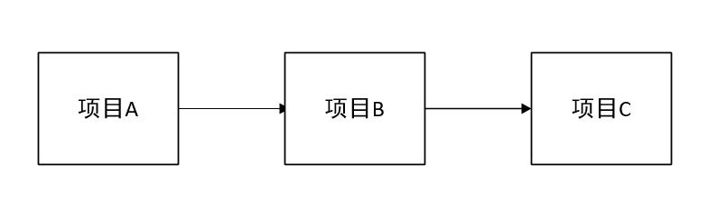

### Eureka
  
  Eureka是Netflix开源的一款提供服务注册和发现的产品，它提供了完整的Service Registry和Service Discovery实现。也是springcloud体系中最重要最核心的组件之一。
  
### 背景介绍
   
#### 服务中心
     
  服务中心又称注册中心，管理各种服务功能包括服务的注册、发现、熔断、负载、降级等，比如dubbo admin后台的各种功能。
     
  有了服务中心调用关系会有什么变化，画几个简图来帮忙理解
     
  项目A调用项目B
     
  正常调用项目A请求项目B
  
  
  
  有了服务中心之后，任何一个服务都不能直接去掉用，都需要通过服务中心来调用
  
  
  
  项目A调用项目B，项目B在调用项目C
  
  
  
  这时候调用的步骤就会为两步：第一步，项目A首先从服务中心请求项目B服务器，然后项目B在从服务中心请求项目C服务。
  
  

### Eureka
   
   pring Cloud 封装了 Netflix 公司开发的 Eureka 模块来实现服务注册和发现。Eureka 采用了 C-S 的设计架构。Eureka Server 作为服务注册功能的服务器，它是服务注册中心。而系统中的其他微服务，使用 Eureka 的客户端连接到 Eureka Server，并维持心跳连接。这样系统的维护人员就可以通过 Eureka Server 来监控系统中各个微服务是否正常运行。Spring Cloud 的一些其他模块（比如Zuul）就可以通过 Eureka Server 来发现系统中的其他微服务，并执行相关的逻辑。
   
   Eureka由两个组件组成：Eureka服务器和Eureka客户端。Eureka服务器用作服务注册服务器。Eureka客户端是一个java客户端，用来简化与服务器的交互、作为轮询负载均衡器，并提供服务的故障切换支持。Netflix在其生产环境中使用的是另外的客户端，它提供基于流量、资源利用率以及出错状态的加权负载均衡。
   
   用一张图来认识以下：
   
    
   
   上图简要描述了Eureka的基本架构，由3个角色组成：
   
   1、Eureka Server
    
    提供服务注册和发现
   
   2、Service Provider
   
    服务提供方
    将自身服务注册到Eureka，从而使服务消费方能够找到
   
   3、Service Consumer
   
    服务消费方
    从Eureka获取注册服务列表，从而能够消费服务
   
### 案例实践

#### Eureka Server
   
   spring cloud已经帮我实现了服务注册中心，我们只需要很简单的几个步骤就可以完成。
   
   1、pom中添加依赖
   
```
<dependencies>
	<dependency>
		<groupId>org.springframework.cloud</groupId>
		<artifactId>spring-cloud-starter</artifactId>
	</dependency>
	<dependency>
		<groupId>org.springframework.cloud</groupId>
		<artifactId>spring-cloud-starter-eureka-server</artifactId>
	</dependency>
	<dependency>
		<groupId>org.springframework.boot</groupId>
		<artifactId>spring-boot-starter-test</artifactId>
		<scope>test</scope>
	</dependency>
</dependencies>
```
   
   2、添加启动代码中添加@EnableEurekaServer注解

```
@SpringBootApplication
@EnableEurekaServer
public class SpringCloudEurekaApplication {

	public static void main(String[] args) {
		SpringApplication.run(SpringCloudEurekaApplication.class, args);
	}
}
```
  
   3、配置文件
    
   在默认设置下，该服务注册中心也会将自己作为客户端来尝试注册它自己，所以我们需要禁用它的客户端注册行为，在application.properties添加以下配置：
   
```
spring.application.name=spring-cloud-eureka

server.port=8000
# 表示是否将自己注册到Eureka Server，默认为true。

eureka.client.register-with-eureka=false

# 表示是否从Eureka Server获取注册信息，默认为true。
eureka.client.fetch-registry=false

# 设置与Eureka Server交互的地址，查询服务和注册服务都需要依赖这个地址。默认是http://localhost:8761/eureka ；多个地址可使用 , 分隔。
eureka.client.serviceUrl.defaultZone=http://localhost:8000/eureka/

``` 

   4.启动工程后，访问：http://localhost:8000/，可以看到下面的页面，其中还没有发现任何服务
     
#### 集群
   
   注册中心这么关键的服务，如果是单点话，遇到故障就是毁灭性的。在一个分布式系统中，服务注册中心是最重要的基础部分，理应随时处于可以提供服务的状态。为了维持其可用性，使用集群是很好的解决方案。Eureka通过互相注册的方式来实现高可用的部署，所以我们只需要将Eureke Server配置其他可用的serviceUrl就能实现高可用部署。
   
##### 双节点注册中心
   
   首次我们尝试一下双节点的注册中心的搭建。
   
   1、创建application-peer1.properties，作为peer1服务中心的配置，并将serviceUrl指向peer2

```
spring.application.name=spring-cloud-eureka
server.port=8000
eureka.instance.hostname=peer1

eureka.client.serviceUrl.defaultZone=http://peer2:8001/eureka/

```

   2、创建application-peer2.properties，作为peer2服务中心的配置，并将serviceUrl指向peer1

```
spring.application.name=spring-cloud-eureka
server.port=8001
eureka.instance.hostname=peer2

eureka.client.serviceUrl.defaultZone=http://peer1:8000/eureka/
```
   
   3、host转换
   
   在hosts文件中加入如下配置
```
127.0.0.1 peer1  
127.0.0.1 peer2  
```
  
  4、打包启动
  
  依次执行下面命令
  
```
打包
mvn clean package
# 分别以peer1和peeer2 配置信息启动eureka
java -jar spring-cloud-eureka-0.0.1-SNAPSHOT.jar --spring.profiles.active=peer1
java -jar spring-cloud-eureka-0.0.1-SNAPSHOT.jar --spring.profiles.active=peer2
```
  
##### eureka集群使用
   
   在生产中我们可能需要三台或者大于三台的注册中心来保证服务的稳定性，配置的原理其实都一样，将注册中心分别指向其它的注册中心。这里只介绍三台集群的配置情况，其实和双节点的注册中心类似，每台注册中心分别又指向其它两个节点即可，使用application.yml来配置。
   
   application.yml配置详情如下：
   
```
---
spring:
  application:
    name: spring-cloud-eureka
  profiles: peer1
server:
  port: 8000
eureka:
  instance:
    hostname: peer1
  client:
    serviceUrl:
      defaultZone: http://peer2:8001/eureka/,http://peer3:8002/eureka/
---
spring:
  application:
    name: spring-cloud-eureka
  profiles: peer2
server:
  port: 8001
eureka:
  instance:
    hostname: peer2
  client:
    serviceUrl:
      defaultZone: http://peer1:8000/eureka/,http://peer3:8002/eureka/
---
spring:
  application:
    name: spring-cloud-eureka
  profiles: peer3
server:
  port: 8002
eureka:
  instance:
    hostname: peer3
  client:
    serviceUrl:
      defaultZone: http://peer1:8000/eureka/,http://peer2:8001/eureka/
```

### 服务提供与调用 

#### 服务提供

   1、pom包配置
   
   创建一个springboot项目，pom.xml中添加如下配置：
   
```
<dependencies>
	<dependency>
		<groupId>org.springframework.cloud</groupId>
		<artifactId>spring-cloud-starter-eureka</artifactId>
	</dependency>
	<dependency>
		<groupId>org.springframework.boot</groupId>
		<artifactId>spring-boot-starter-test</artifactId>
		<scope>test</scope>
	</dependency>
</dependencies>
``` 
   
   2、配置文件
   
   application.properties配置如下：

```
spring.application.name=spring-cloud-producer
server.port=9000
eureka.client.serviceUrl.defaultZone=http://localhost:8000/eureka/
```
   
   3、启动类
   启动类中添加@EnableDiscoveryClient注解
   
```
@SpringBootApplication
@EnableDiscoveryClient
public class ProducerApplication {

	public static void main(String[] args) {
		SpringApplication.run(ProducerApplication.class, args);
	}
}
```

   4、controller
   
   提供hello服务

```
@RestController
public class HelloController {
	
    @RequestMapping("/hello")
    public String index(@RequestParam String name) {
        return "hello "+name+"，this is first messge";
    }
}
```

   添加@EnableDiscoveryClient注解后，项目就具有了服务注册的功能。启动工程后，就可以在注册中心的页面看到SPRING-CLOUD-PRODUCER服务。
   
#### 服务调用
   
   1、pom包配置
   
   和服务提供者一致
   
```
<dependencies>
	  <dependency>
                <groupId>org.springframework.cloud</groupId>
                <artifactId>spring-cloud-starter-feign</artifactId>
            </dependency>
            <dependency>
                <groupId>org.springframework.cloud</groupId>
                <artifactId>spring-cloud-starter-eureka</artifactId>
            </dependency>
</dependencies>
```
   
   2、配置文件
   
   application.properties配置如下：

```
spring.application.name=spring-cloud-consumer
server.port=9001
eureka.client.serviceUrl.defaultZone=http://localhost:8000/eureka/
```
   
   3、启动类
   启动类添加@EnableDiscoveryClient和@EnableFeignClients注解。

```
/**
 * @author： wlz
 * @Date 2020/11/5 15:25
 * @description： TODO
 * @version: 1.0
 *
 *  @EnableDiscoveryClient :启用服务注册与发现
 * @EnableFeignClients：启用feign进行远程调用
 */
@SpringBootApplication // 启用服务注册与发现
@EnableDiscoveryClient  //  启用feign进行远程调用
@EnableFeignClients
public class ConsumerApplication {

	public static void main(String[] args) {
		SpringApplication.run(ConsumerApplication.class, args);
	}

}
```
   
   4、feign调用实现

```
@FeignClient(name= "spring-cloud-producer") // name:远程服务名，及spring.application.name配置的名称
public interface HelloRemote {

    // 此类中的方法和远程服务中contoller中的方法名和参数需保持一致。
    @RequestMapping(value = "/hello") 
    public String hello(@RequestParam(value = "name") String name);
}
```
   
   5、web层调用远程服务
   将HelloRemote注入到controller层，像普通方法一样去调用即可。
    
```
@RestController
public class ConsumerController {

    @Autowired
    HelloRemote HelloRemote;
	
    @RequestMapping("/hello/{name}")
    public String index(@PathVariable("name") String name) {
        return HelloRemote.hello(name);
    }

}
```

#### 测试
   
   简单调用
   依次启动spring-cloud-eureka、spring-cloud-producer、spring-cloud-consumer三个项目
   
   先输入：http://localhost:9000/hello?name=neo 检查spring-cloud-producer服务是否正常
   
   返回：hello neo，this is first messge
   
   说明spring-cloud-producer正常启动，提供的服务也正常。
   
   浏览器中输入：http://localhost:9001/hello/neo
   
   返回：hello neo，this is first messge
   
   说明客户端已经成功的通过feign调用了远程服务hello，并且将结果返回到了浏览器。

#### 负载均衡
   
   以上面spring-cloud-producer为例子修改，将其中的controller改动如下：
   
```
@RestController
public class HelloController {
	
    @RequestMapping("/hello")
    public String index(@RequestParam String name) {
        return "hello "+name+"，this is producer 2  send first messge";
    }
}
```
   
  在配置文件中改动端口：

```
spring.application.name=spring-cloud-producer
server.port=9003
eureka.client.serviceUrl.defaultZone=http://localhost:8000/eureka/
```
   
   打包启动后，在eureka就会发现两个服务提供者.
   
   然后在浏览器再次输入：http://localhost:9001/hello/neo 进行测试：
   
   第一次返回结果：hello neo，this is first messge
   
   第二次返回结果：hello neo，this is producer 2 send first messge
   
   不断的进行测试下去会发现两种结果交替出现，说明两个服务中心自动提供了服务均衡负载的功能。如果我们将服务提供者的数量在提高为N个，测试结果一样，请求会自动轮询到每个服务端来处理。

### 熔断器Hystrix
   
#### 雪崩效应
   
   在微服务架构中通常会有多个服务层调用，基础服务的故障可能会导致级联故障，进而造成整个系统不可用的情况，这种现象被称为服务雪崩效应。服务雪崩效应是一种因“服务提供者”的不可用导致“服务消费者”的不可用,并将不可用逐渐放大的过程。
   
   如果下图所示：A作为服务提供者，B为A的服务消费者，C和D是B的服务消费者。A不可用引起了B的不可用，并将不可用像滚雪球一样放大到C和D时，雪崩效应就形成了。
   
   
   
#### 熔断器（CircuitBreaker）
      
  熔断器的原理很简单，如同电力过载保护器。它可以实现快速失败，如果它在一段时间内侦测到许多类似的错误，会强迫其以后的多个调用快速失败，不再访问远程服务器，从而防止应用程序不断地尝试执行可能会失败的操作，使得应用程序继续执行而不用等待修正错误，或者浪费CPU时间去等到长时间的超时产生。熔断器也可以使应用程序能够诊断错误是否已经修正，如果已经修正，应用程序会再次尝试调用操作。
     
  熔断器模式就像是那些容易导致错误的操作的一种代理。这种代理能够记录最近调用发生错误的次数，然后决定使用允许操作继续，或者立即返回错误。 熔断器开关相互转换的逻辑如下图：
  
  

#### Hystrix特性
   
   1.断路器机制
   
   断路器很好理解, 当Hystrix Command请求后端服务失败数量超过一定比例(默认50%), 断路器会切换到开路状态(Open). 这时所有请求会直接失败而不会发送到后端服务. 断路器保持在开路状态一段时间后(默认5秒), 自动切换到半开路状态(HALF-OPEN). 这时会判断下一次请求的返回情况, 如果请求成功, 断路器切回闭路状态(CLOSED), 否则重新切换到开路状态(OPEN). Hystrix的断路器就像我们家庭电路中的保险丝, 一旦后端服务不可用, 断路器会直接切断请求链, 避免发送大量无效请求影响系统吞吐量, 并且断路器有自我检测并恢复的能力.
   
   2.Fallback
   
   Fallback相当于是降级操作. 对于查询操作, 我们可以实现一个fallback方法, 当请求后端服务出现异常的时候, 可以使用fallback方法返回的值. fallback方法的返回值一般是设置的默认值或者来自缓存.
   
   3.资源隔离
   
   在Hystrix中, 主要通过线程池来实现资源隔离. 通常在使用的时候我们会根据调用的远程服务划分出多个线程池. 例如调用产品服务的Command放入A线程池, 调用账户服务的Command放入B线程池. 这样做的主要优点是运行环境被隔离开了. 这样就算调用服务的代码存在bug或者由于其他原因导致自己所在线程池被耗尽时, 不会对系统的其他服务造成影响. 但是带来的代价就是维护多个线程池会对系统带来额外的性能开销. 如果是对性能有严格要求而且确信自己调用服务的客户端代码不会出问题的话, 可以使用Hystrix的信号模式(Semaphores)来隔离资源.
   
#### Feign Hystrix
   
   因为熔断只是作用在服务调用这一端，因此我们根据上一篇的示例代码只需要改动spring-cloud-consumer项目相关代码就可以。因为，Feign中已经依赖了Hystrix所以在maven配置上不用做任何改动。
   
   1、配置文件
   
   application.properties添加这一条：
   
```
feign.hystrix.enabled=true
```
   
   2、创建回调类
   
   创建HelloRemoteHystrix类继承与HelloRemote实现回调的方法

```
@Component
public class HelloRemoteHystrix implements HelloRemote{

    @Override
    public String hello(@RequestParam(value = "name") String name) {
        return "hello" +name+", this messge send failed ";
    }
}
```
   
   3、添加fallback属性
   
   在HelloRemote类添加指定fallback类，在服务熔断的时候返回fallback类中的内容。

```
@FeignClient(name= "spring-cloud-producer",fallback = HelloRemoteHystrix.class)
public interface HelloRemote {

    @RequestMapping(value = "/hello")
    public String hello(@RequestParam(value = "name") String name);

}
```
   
   4、测试
   
    那我们就来测试一下看看效果吧。
   
    依次启动spring-cloud-eureka、spring-cloud-producer、spring-cloud-consumer三个项目。
   
    浏览器中输入：http://localhost:9001/hello/neo
   
    返回：hello neo，this is first messge
   
    说明加入熔断相关信息后，不影响正常的访问。接下来我们手动停止spring-cloud-producer项目再次测试：
   
    浏览器中输入：http://localhost:9001/hello/neo
   
    返回：hello neo, this messge send failed
   
    根据返回结果说明熔断成功。
    
### eureka对比Zookeeper
    
   Zookeeper在设计的时候遵循的是CP原则，即一致性,Zookeeper会出现这样一种情况，当master节点因为网络故
   障与其他节点失去联系时剩余节点会重新进行leader选举，问题在于，选举leader的时间太长：30~120s，且选举
   期间整个Zookeeper集群是不可用的，这就导致在选举期间注册服务处于瘫痪状态，在云部署的环境下，因网络环
   境使Zookeeper集群失去master节点是较大概率发生的事情，虽然服务能够最终恢复，但是漫长的选举时间导致
   长期的服务注册不可用是不能容忍的。
    
   Eureka在设计的时候遵循的是AP原则，即可用性。Eureka各个节点（服务)是平等的， 没有主从之分，几个节点
   down掉不会影响正常工作，剩余的节点（服务） 依然可以提供注册与查询服务，而Eureka的客户端在向某个
   Eureka注册或发现连接失败，则会自动切换到其他节点，也就是说，只要有一台Eureka还在，就能注册可用（保
   证可用性）， 只不过查询到的信息不是最新的（不保证强一致），除此之外，Eureka还有自我保护机制，如果在
   15分钟内超过85%节点都没有正常心跳，那么eureka就认为客户端与注册中心出现了网络故障，此时会出现一下
   情况:
    
    1: Eureka 不再从注册列表中移除因为长时间没有收到心跳而过期的服务。
    2：Eureka 仍然能够接收新服务的注册和查询请求，但是不会被同步到其它节点上（即保证当前节点可用）
    3： 当网络稳定后，当前实例新的注册信息会被同步到其它节点中