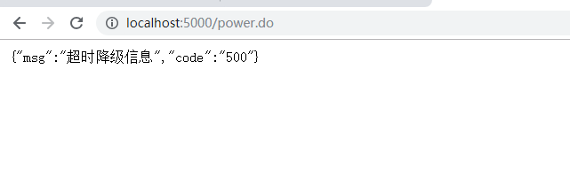
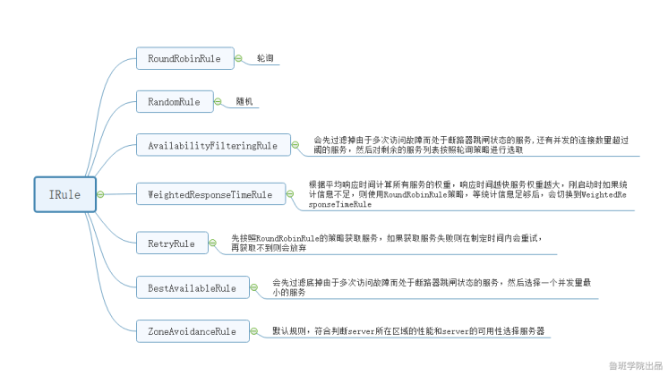

### zuul 
   
#### zuul是什么？
   
   Zuul包含了对请求的路由和过滤两个最主要的功能：
   
   其中路由功能负责将外部请求转发到具体的微服务实例上，是实现外部访问统一入口的基础而过滤器功能则负责对请求的处理过程进行干预，是实现请求校验、服务聚合等功能的基础.
   
   Zuul和Eureka进行整合，将Zuul自身注册为Eureka服务治理下的应用，同时从Eureka中获得其他微服务的消息，也即以后的访问微服务都是通过Zuul跳转后获得。
   
      注意：Zuul服务最终还是会注册进Eureka

#### 路由：
   
   项目加入依赖:

```
<dependency>
    <groupId>org.springframework.cloud</groupId>
    <artifactId>spring-cloud-starter-netflix-eureka-client</artifactId>
</dependency>
<dependency>
    <groupId>org.springframework.cloud</groupId>
    <artifactId>spring-cloud-starter-netflix-zuul</artifactId>
</dependency>
```
   
   yml文件:
   
```
server:
  port: 9000

eureka:

  client:
    serviceUrl:
        defaultZone: http://localhost:3000/eureka/
  instance:
    instance-id: zuul-1
    prefer-ip-address: true

spring:
  application:
    name: zuul
```
   
   启动类：

```
@SpringBootApplication
@EnableZuulProxy
public class AppZuul {

    public static void main(String[] args) {
        SpringApplication.run(AppZuul.class);
    }
}
```
   
   这样 简单的zuul就搭建好了， 启动项目 我们就可以通过zuul然后加上对应的微服务名字访问微服务:
   
  在实际开发当中我们肯定不会是这样通过微服务调用，比如我要调用power  可能只要一个/power就好了 而不是/server-power
  
  在yml加入以下配置即可:
  
```
zuul:
  routes:
    mypower:
      serviceId: server-power
      path: /power/**
    myorder:
      serviceId: server-order
      path: /order/**
```
   
   讲道理看意思都看得出来把，my***是自己制定的名字 这个就不解释了
   
   注意/ **代表是所有层级 /  是代表一层。 如果是/  的话 /power/admin/getUser.do 就不会被路由  。
   
   这时候我们能通过我们自定义的规则来访问了，但是还有一个问题，就是我们现在依然能用之前的微服务名调用，这样子是不合理的，第一是有多重地址了， 第二，一般微服务名这种最好不要暴露在外。所以我们一般会禁用微服务名方式调用。
   
   加入配置:
   
```
ignored-services: server-power
ignored-services: "*" // 禁用所有
```
    
   可能有时候我们的接口调用需要一定的规范，譬如调用微服务的API URL前缀需要加上/api  对于这种情况， zuul也考虑到了并给出了解决方案：
   
```
zuul:
  prefix: /api
  ignored-services: "*"
  routes:
    mypower:
      serviceId: server-power
      path: /power/**
    myorder:
      serviceId: server-order
      path: /order/**
``` 
   
   加上一个prefix 即定义好了一个前缀， 那么我们每次需要路由的时候需要加上一个/api的前缀
   
   但是  这样有一个问题，就是这个/api前缀 会不会出现在我们路由后的IP地址中呢？因为有可能我们微服务提供的接口也是含有/api前缀的
   
   答案是不会的。  但是可以进行配置

```
zuul:
  prefix: /api
  strip-prefix: false
  ignored-services: "*"
  routes:
    mypower:
      serviceId: server-power
      path: /power/**
    myorder:
      serviceId: server-order
      path: /order/**
```

### HystrixDashbord
   
   Hystrix（注意 是单纯的Hystrix） 提供了对于微服务调用状态的监控（信息）， 但是，需要结合
   	
   spring-boot-actuator 模块一起使用.
   	
   在包含了 hystrix的项目中， 引入依赖：
   
```
<dependency>
    <groupId>org.springframework.boot</groupId>
    <artifactId>spring-boot-starter-actuator</artifactId>
</dependency>
```
   
   这时候访问/actuator/hystrix.stream 便可以看见微服务调用的状态信息
   
   （需要注意的是， 在Spring Finchley 版本以前访问路径是/hystrix.stream，如果是Finchley 的话 还得在yml里面加入配置：
   
```
management:
  endpoints:
    web:
      exposure:
        include: '*'
```
   
  因为spring Boot 2.0.x以后的Actuator 只暴露了info 和health 2个端点,这里我们把所有端点开放。
  
  这里会发现没有任何信息， 因为我刚启动项目， 我们来调用几个接口看看:
  
  这些密密麻麻的，就是我们的微服务监控的信息， 但是， 这种json格式的字符串， 难免会让人不太好阅读， 所以， 这时候需要我们的主角登场了：
  
#### 什么是HystrixDashbord/如何使用？
   
   Dashbord 翻译一下的意思是 仪表盘， 顾名思义， hystrix监控信息的仪表盘，  那这个仪表盘到底是什么样子呢? 以及 怎么来使用呢？
   
   我们新建一个项目 加入依赖:
   
```
<dependency>
    <groupId>org.springframework.cloud</groupId>
    <artifactId>spring-cloud-starter-netflix-hystrix-dashboard</artifactId>
</dependency>
```
   
   在spring boot启动类上面加入注解EnableHystrixDashboard
   
```
@SpringBootApplication
@EnableHystrixDashboard
public class AppHystrixDashbord {

    public static void main(String[] args) {
        SpringApplication.run(AppHystrixDashbord.class);
    }

}
```
   
   启动项目后访问/hystrix能看见一个类似tomcat的首页:
   
   在中间这个输入框中，填入需要监控的微服务的监控地址 也就是/actuator/hystrix.stream点击按钮，就会跳转到仪表盘页面：
   
   
### Hystrix

#### hystrix是什么？

   Hystrix是一个用于处理分布式系统的延迟和容错的开源库，在分布式系统里，许多依赖不可避免的会调用失败，比如超时、异常等，Hystrix能够保证在一个依赖出问题的情况下，不会导致整体服务失败，避免级联故障，以提高分布式系统的弹性。
   
   “断路器”本身是一种开关装置，当某个服务单元发生故障之后，通过断路器的故障监控（类似熔断保险丝），向调用方返回一个符合预期的、可处理的备选响应（FallBack），而不是长时间的等待或者抛出调用方无法处理的异常，这样就保证了服务调用方的线程不会被长时间、不必要地占用，从而避免了故障在分布式系统中的蔓延，乃至雪崩。
   
#### 大型项目中会出现的一些问题:
   
   典型的一个案例就是服务血崩效应  我们来看一张图:
   
   
   
   上图是一条微服务调用链， 正常的情况我们就不必在讨论了， 我们来说一下非正常情况， 假设现在 微服务H 响应时间过长,或者微服务H直接down机了如图:
   
   
   
   来看下上图， 我们联想一下上图， 如果发生这种情况，  也就是说所有发给微服务D的请求 都会被卡在微服务H那， 就会导致线程一直累计在这里， 那么其他的微服务（比如A，B，C...） 就没有可用线程了， 导致整个服务器崩溃，这就是服务血崩。
   
   导致服务雪崩的情况我们来总结一下，再看看怎么解决：
   
   程序BUG，数据不匹配，响应时间过长，服务不可用等等.....
   
   针对上面的问题，我们来看看有哪些解决方案 :
   
   服务限流
   
   超时监控
   
   服务熔断
   
   服务降级
   
#### 降级，超时 :
   
   我们先来解释一下降级,降级是当我们的某个微服务响应时间过长，或者不可用了，讲白了也就是那个微服务调用不了了，我们不能吧错误信息返回出来，或者让他一直卡在那里，所以要在准备一个对应的策略（一个方法）当发生这种问题的时候我们直接调用这个方法来快速返回这个请求，不让他一直卡在那 。
   
   讲了这么多,我们来看看具体怎么操作:
   
   我们刚刚说了某个微服务调用不了了要做降级，也就是说，要在调用方做降级（不然那个微服务都down掉了再做降级也没什么意义了）  比如说我们 user 调用power  那么就在user 做降级
   
   先把hystrix的依赖加入:
   
```
<dependency>
    <groupId>org.springframework.cloud</groupId>
    <artifactId>spring-cloud-starter-netflix-hystrix</artifactId>
</dependency>
```
   
   启动类加入注解@EnableHystrix  或者@EnableCircuitBreaker(他们之间是一个继承关系，2个注解所描述的内容是完全一样的，可能看大家之前都是EnableXXX（比如eureka）这里专门再写一个EnableHystrix方便大家记吧)
   
   然后在我们的controller上面加入注解@HystrixCommand(fallbackMethod就是我们刚刚说的方法的名字)
   
```
@RequestMapping("/feignPower.do")
@HystrixCommand(fallbackMethod = "fallbackMethod")
public Object feignPower(String name){
    return powerServiceClient.power();
}
```
   
   fallbackMethod：
   
   这个R不重要，你看做一个Map就好了， 是我封装的一个返回值的类。
   
```
public Object fallbackMethod(String name){
    System.out.println(name);
    return R.error("降级信息");
    }
```
   这里的这个降级信息具体内容得根据业务需求来， 比如说返回一个默认的查询信息，亦或是系统维护（因为有可能要暂时关闭某个微服务而吧资源让给其他服务）等等...
   
   我们在power代码里面模拟一个异常
   
```
@RequestMapping("/power.do")
public Object power(String name) throws Exception{
    Map<String,Object> map = new HashMap<String, Object>();
    map.put("power1","value");
    if (name==null)
        throw new Exception();

    return map;
}
```
   
   然后启动服务调用一下看看结果：
   
   
   
   可能有些同学有疑问， 我这里什么都没干， 就让他休眠了一下 ， 怎么就知道我这里超时了呢？
   
   因为hystrix他有默认的超时监听，当你这个请求默认超过了1秒钟就会超时 当然，这个可以配置的，至于怎么配置，待会儿我会把一些配置统一列出来
   
   讲了这么多， 这个降级到底有什么用呢？
   
   第一， 他可以监听你的请求有没有超时，第二，报错了他这里直接截断了没有让请求一直卡在这里
   
   其实降级还有一个好处， 就是当你的系统马上迎来大量的并发(双十一秒杀这种 或者促销活动)
   
   这时候如果发现系统马上承载不了这么大的并发时， 可以考虑先关闭一些不重要的微服务(在降级方法里面返回一个比较友好的信息)，吧资源让给主微服务,总结一下就是
   
   整体资源快不够了，忍痛将某些服务先关掉，待渡过难关，再开启回来。
   
#### 熔断,限流:
   
   讲完降级，我们来讲讲熔断，其实熔断，就好像我们生活中的跳闸一样， 比如说你的电路出故障了，为了防止出现大型事故 这里直接切断了你的电源以免意外继续发生, 把这个概念放在我们程序上也是如此， 当一个微服务调用多次出现问题时（默认是10秒内20次当然 这个也能配置），hystrix就会采取熔断机制，不再继续调用你的方法（会在默认5秒钟内和电器短路一样，5秒钟后会试探性的先关闭熔断机制，但是如果这时候再失败一次{之前是20次} 那么又会重新进行熔断） 而是直接调用降级方法，这样就一定程度上避免了服务雪崩的问题
   
   限流
   
   限流， 顾名思义， 就是限制你某个微服务的使用量（可用线程）
   
   hystrix通过线程池的方式来管理你的微服务调用，他默认是一个线程池（10大小） 管理你的所有微服务，你可以给某个微服务开辟新的线程池：
   
```
@RequestMapping("/feignOrder.do")
@HystrixCommand(fallbackMethod = "fallbackOrderMethod"  ,
        threadPoolKey = "order",
        threadPoolProperties ={@HystrixProperty(name = "coreSize",value = "2")
                              ,@HystrixProperty(name = "maxQueueSize",value = "1"})
public Object feignOrder(String name){
    System.out.println(1);
    return restTemplate.getForObject(ORDERURL+"/order.do",Object.class);
}
```
   
   threadPoolKey 就是在线程池唯一标识， hystrix 会拿你这个标识去计数，看线程占用是否超过了， 超过了就会直接降级该次调用
   
   比如， 这里coreSize给他值为2  那么假设你这个方法调用时间是3s执行完， 那么在3s内如果有超过2个请求进来的话， 剩下的请求则全部降级
      
#### feign整合hystrix:

   feign 默认是支持hystrix的， 但是在Spring - cloud Dalston 版本之后就默认关闭了， 因为不一定业务需求要用的到，
   
   所以现在要使用首先得打开他，在yml文件加上如下配置:
   
```
feign:
  hystrix:
    enabled: true
```
   
   加上配置之后降级方法怎么写呢？
   
```
@FeignClient(value = "SERVER-POWER",fallback = PowerServiceFallBack.class)
public interface PowerServiceClient {

    @RequestMapping("/power.do")
    public Object power(@RequestParam("name") String name);

}
```
   
   在feign客户端的注解上 有个属性叫fallback 然后指向一个类
   
   PowerServiceFallBack 类：
   
```
@Component
public class PowerServiceFallBack implements PowerServiceClient {
    @Override
    public Object power(String name) {
        return R.error("测试降级");
    }
}
```

   这样子，方法降级就写好了
   
   当然 可能你有这种需求， 需要拿到具体的错误信息， 那么可以这样写:

```
@Component
public class PowerServiceClientFallBackFactory implements FallbackFactory<PowerServiceClient> {
    @Override
    public PowerServiceClient create(Throwable throwable) {
        return new PowerServiceClient() {
            @Override
            public Object power(String name) {
                String message = throwable.getMessage();
                return R.error("feign降级");
            }
        };
    }
}
```
   
   客户端指定一个fallbackFactory就好了
   
```
@FeignClient(value = "SERVER-POWER",fallbackFactory = PowerServiceClientFallBackFactory.class)
public interface PowerServiceClient {

    @RequestMapping("/power.do")
    public Object power(@RequestParam("name") String name);

}
```
   
   这个message 就是拿到的错误信息
   
   至此， 就完成了feign与hystrix的整合
   
#### hystrix相关配置:
   
```
Execution相关的属性的配置
hystrix.command.default.execution.isolation.strategy 隔离策略，默认是Thread, 可选Thread｜ Semaphor

hystrix.command.default.execution.isolation.thread.timeoutInMilliseconds 命令执行超时时 间，默认1000ms

hystrix.command.default.execution.timeout.enabled 执行是否启用超时，默认启用true

hystrix.command.default.execution.isolation.thread.interruptOnTimeout 发生超时是是否中断， 默认true

hystrix.command.default.execution.isolation.semaphore.maxConcurrentRequests 最大并发请求 数，默认10，该参数当使用ExecutionIsolationStrategy.SEMAPHORE策略时才有效。如果达到最大并发请求 数，请求会被拒绝。理论上选择semaphore size的原则和选择thread size一致，但选用semaphore时每次执行 的单元要比较小且执行速度快（ms级别），否则的话应该用thread。 semaphore应该占整个容器（tomcat）的线程池的一小部分。 Fallback相关的属性 这些参数可以应用于Hystrix的THREAD和SEMAPHORE策略

hystrix.command.default.fallback.isolation.semaphore.maxConcurrentRequests 如果并发数达到 该设置值，请求会被拒绝和抛出异常并且fallback不会被调用。默认10

hystrix.command.default.fallback.enabled 当执行失败或者请求被拒绝，是否会尝试调用

hystrixCommand.getFallback() 。默认true

Circuit Breaker相关的属性 
hystrix.command.default.circuitBreaker.enabled 用来跟踪circuit的健康性，如果未达标则让request短路。默认true

hystrix.command.default.circuitBreaker.requestVolumeThreshold 一个rolling window内最小的请 求数。如果设为20，那么当一个rolling window的时间内（比如说1个rolling window是10秒）收到19个请求， 即使19个请求都失败，也不会触发circuit break。默认20

hystrix.command.default.circuitBreaker.sleepWindowInMilliseconds 触发短路的时间值，当该值设 为5000时，则当触发circuit break后的5000毫秒内都会拒绝request，也就是5000毫秒后才会关闭circuit。 默认5000

hystrix.command.default.circuitBreaker.errorThresholdPercentage错误比率阀值，如果错误率>=该 值，circuit会被打开，并短路所有请求触发fallback。默认50

hystrix.command.default.circuitBreaker.forceOpen 强制打开熔断器，如果打开这个开关，那么拒绝所 有request，默认false

hystrix.command.default.circuitBreaker.forceClosed 强制关闭熔断器 如果这个开关打开，circuit将 一直关闭且忽略circuitBreaker.errorThresholdPercentage

Metrics相关参数

hystrix.command.default.metrics.rollingStats.timeInMilliseconds 设置统计的时间窗口值的，毫秒 值，circuit break 的打开会根据1个rolling window的统计来计算。若rolling window被设为10000毫秒， 则rolling window会被分成n个buckets，每个bucket包含success，failure，timeout，rejection的次数 的统计信息。默认10000

hystrix.command.default.metrics.rollingStats.numBuckets 设置一个rolling window被划分的数 量，若numBuckets＝10，rolling window＝10000，那么一个bucket的时间即1秒。必须符合rolling window  % numberBuckets == 0。默认10

hystrix.command.default.metrics.rollingPercentile.enabled 执行时是否enable指标的计算和跟踪， 默认true

hystrix.command.default.metrics.rollingPercentile.timeInMilliseconds 设置rolling  percentile window的时间，默认60000

hystrix.command.default.metrics.rollingPercentile.numBuckets 设置rolling percentile  window的numberBuckets。逻辑同上。默认6

hystrix.command.default.metrics.rollingPercentile.bucketSize 如果bucket size＝100，window ＝10s，若这10s里有500次执行，只有最后100次执行会被统计到bucket里去。增加该值会增加内存开销以及排序 的开销。默认100

hystrix.command.default.metrics.healthSnapshot.intervalInMilliseconds 记录health 快照（用 来统计成功和错误绿）的间隔，默认500ms


Request Context 相关参数

hystrix.command.default.requestCache.enabled 默认true，需要重载getCacheKey()，返回null时不 缓存

 hystrix.command.default.requestLog.enabled 记录日志到HystrixRequestLog，默认true
 
 Collapser Properties 相关参数
 
 hystrix.collapser.default.maxRequestsInBatch 单次批处理的最大请求数，达到该数量触发批处理，默认 Integer.MAX_VALU
 
 hystrix.collapser.default.timerDelayInMilliseconds 触发批处理的延迟，也可以为创建批处理的时间 ＋该值，默认10
 
 hystrix.collapser.default.requestCache.enabled 是否对HystrixCollapser.execute() and  HystrixCollapser.queue()的cache，默认true
 
 ThreadPool 相关参数
 
 线程数默认值10适用于大部分情况（有时可以设置得更小），如果需要设置得更大，那有个基本得公式可以 follow： requests per second at peak when healthy × 99th percentile latency in seconds + some  breathing room 每秒最大支撑的请求数 (99%平均响应时间 + 缓存值) 比如：每秒能处理1000个请求，99%的请求响应时间是60ms，那么公式是： 1000 （0.060+0.012）
 
 基本得原则时保持线程池尽可能小，他主要是为了释放压力，防止资源被阻塞。 当一切都是正常的时候，线程池一般仅会有1到2个线程激活来提供服务
 
 hystrix.threadpool.default.coreSize 并发执行的最大线程数，默认10
 
 hystrix.threadpool.default.maxQueueSize BlockingQueue的最大队列数，当设为－1，会使用
 
 SynchronousQueue，值为正时使用LinkedBlcokingQueue。该设置只会在初始化时有效，之后不能修改threadpool的queue size，除非reinitialising thread executor。默认－1。
 
 hystrix.threadpool.default.queueSizeRejectionThreshold 即使maxQueueSize没有达到，达到 queueSizeRejectionThreshold该值后，请求也会被拒绝。因为maxQueueSize不能被动态修改，这个参数将允 许我们动态设置该值。if maxQueueSize == ­1，该字段将不起作用 hystrix.threadpool.default.keepAliveTimeMinutes 如果corePoolSize和maxPoolSize设成一样（默认 实现）该设置无效。如果通过plugin（https://github.com/Netflix/Hystrix/wiki/Plugins）使用自定义 实现，该设置才有用，默认1.
 hystrix.threadpool.default.metrics.rollingStats.timeInMilliseconds 线程池统计指标的时间，默 认10000
 
 hystrix.threadpool.default.metrics.rollingStats.numBuckets 将rolling window划分为n个 buckets，默认10
```

#### Fegin  
   
##### feign是什么  :
   
   Feign是一个声明式WebService客户端。使用Feign能让编写Web Service客户端更加简单, 它的使用方法是定义一个接口，然后在上面添加注解，同时也支持JAX-RS标准的注解。Feign也支持可拔插式的编码器和解码器。Spring Cloud对Feign进行了封装，使其支持了Spring MVC标准注解和HttpMessageConverters。Feign可以与Eureka和Ribbon组合使用以支持负载均衡。

##### feign 能干什么：
   
   Feign旨在使编写Java Http客户端变得更容易。                                                                                                                  前面在使用Ribbon+RestTemplate时，利用RestTemplate对http请求的封装处理，形成了一套模版化的调用方法。但是在实际开发中，由于对服务依赖的调用可能不止一处，往往一个接口会被多处调用，所以通常都会针对每个微服务自行封装一些客户端类来包装这些依赖服务的调用。所以，Feign在此基础上做了进一步封装，由他来帮助我们定义和实现依赖服务接口的定义。在Feign的实现下，我们只需创建一个接口并使用注解的方式来配置它(以前是Dao接口上面标注Mapper注解,现在是一个微服务接口上面标注一个Feign注解即可)，即可完成对服务提供方的接口绑定，简化了使用Spring cloud Ribbon时，自动封装服务调用客户端的开发量。
   
##### 如何使用？
   
   在客户端(User)引入依赖：
   
```
<dependency>
    <groupId>org.springframework.cloud</groupId>
    <artifactId>spring-cloud-starter-openfeign</artifactId>
</dependency>
```
   
   在启动类上面加上注解:@EnableFeignClients
   
   然后编写一个service类加上@FeignClient()注解 参数就是你的微服务名字
   
```
@FeignClient("SERVER-POWER")
public interface PowerServiceClient {
    @RequestMapping("/power.do")
    public Object power();
}
```
   
   下面是调用代码：
   
```
package com.luban.controller;
import com.luban.service.OrderServiceClient;
import com.luban.service.PowerServiceClient;
import org.springframework.beans.factory.annotation.Autowired;
import org.springframework.web.bind.annotation.RequestMapping;
import org.springframework.web.bind.annotation.RestController;
import org.springframework.web.client.RestTemplate;
@RestController
public class UserController {
    private static final String URL="http://SERVER-POWER";
    @Autowired
    private RestTemplate restTemplate;
    @Autowired
    PowerServiceClient powerServiceClient;
    @RequestMapping("/power.do")
    public Object power(){
        return  restTemplate.getForObject(URL+"/power.do",Object.class);
    }
    @RequestMapping("/feignPower.do")
    public Object feignPower(){
        return powerServiceClient.power();
    }
    }
```
   
   这里拿了RestTemplate做对比  可以看看2者区别
   
   Feign集成了Ribbon
   
   利用Ribbon维护了服务列表信息，并且融合了Ribbon的负载均衡配置，也就是说之前自定义的负载均衡也有效，这里需要你们自己跑一遍理解一下。而与Ribbon不同的是，通过feign只需要定义服务绑定接口且以声明式的方法，优雅而简单的实现了服务调用
   
#### Ribbon
   
##### ribbon是什么?
   
   Spring Cloud Ribbon是基于Netflix Ribbon实现的一套客户端       负载均衡的工具。
   
   简单的说，Ribbon是Netflix发布的开源项目，主要功能是提供客户端的软件负载均衡算法，将Netflix的中间层服务连接在一起。Ribbon客户端组件提供一系列完善的配置项如连接超时，重试等。简单的说，就是在配置文件中列出Load Balancer（简称LB）后面所有的机器，Ribbon会自动的帮助你基于某种规则（如简单轮询，随机连接等）去连接这些机器。我们也很容易使用Ribbon实现自定义的负载均衡算法。

##### 客户端负载均衡？？ 服务端负载均衡??
   
   我们用一张图来描述一下这两者的区别
   
   
   
   服务端的负载均衡是一个url先经过一个代理服务器（这里是nginx），然后通过这个代理服务器通过算法（轮询，随机，权重等等..）反向代理你的服务，l来完成负载均衡
   
   而客户端的负载均衡则是一个请求在客户端的时候已经声明了要调用哪个服务，然后通过具体的负载均衡算法来完成负载均衡
   
##### 核心组件：IRule
   
   IRule是什么?  它是Ribbon对于负载均衡策略实现的接口， 怎么理解这句话？ 说白了就是你实现这个接口，就能自定义负载均衡策略， 自定义我们待会儿来讲， 我们先来看看他有哪些默认的实现
   
   
   
   这里是ribbon负载均衡默认的实现， 由于是笔记的关系，这里不好测试，只能你们自己去测试一下了， 具体怎么使用呢？
   
   看代码:
   
```
@Bean
public IRule iRule(){
    return  new RoundRobinRule();
}
```
   
   在Spring 的配置类里面把对应的实现作为一个Bean返回出去就行了。
