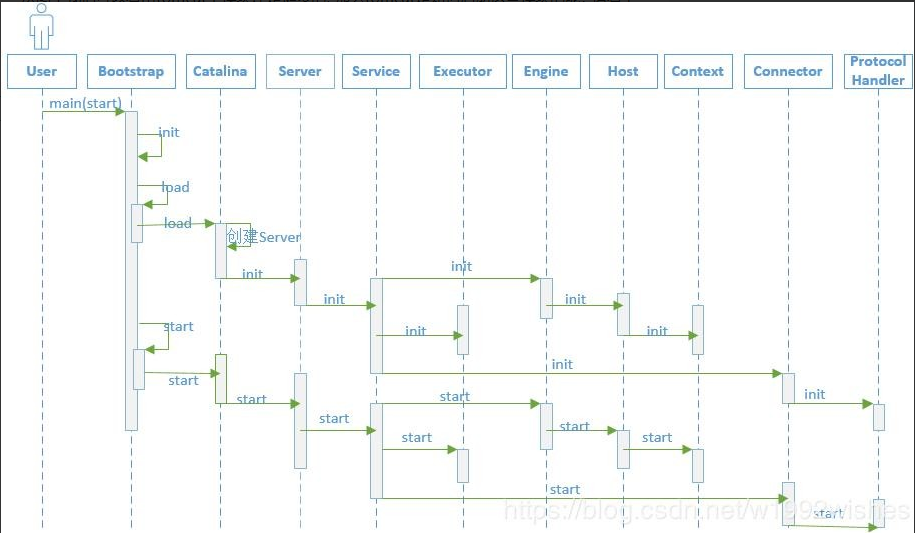

### 搭建Tomcat 源码环境
   

### startup.sh(startup.bat) & catalina.sh (catalina.bat)
   当我们初学tomcat的时候, 肯定先要学习怎样启动tomcat. 在tomcat的bin目录下有两个启动tomcat的文件, 一个是startup.bat, 它用于windows环境下启动tomcat; 另一个是startup.sh, 
   它用于linux环境下tomcat的启动. 两个文件中的逻辑是一样的.
   
   1.startup.bat(startup.sh) 文件主要做了一件事就是启动 catalina.bat 或 catalina.sh
   
   2.catalina.bat(catalina.sh)  最终执行了org.apache.catalina.startup.Bootstrap 类中的main方法.


### Bootstrap 
    
   每个应用程序都有一个唯一的入口(即main函数), tomcat启动相关的类位于catalina.startup包路径下，入口是类Bootstrap中的main()函数。Bootstrap启动类主要完成了三方面的内容，分别如下：
    
       ①在静态代码块中设置 catalinaHome 和 catalinaBase 两个路径；
            (1)catalinaHome:tomcat的安装目录
            
            (2)catalinaBase:tomcat的工作目录
       
       ②common、server、shared三个类加载器的初始化；
       
       ③利用反射机制实例化org.apache.catalina.startup.Catalina类。

### Tomcat 的启动流程分析

   
   
   
   从图中我们可知从Bootstrap类的main方法开始, tomcat会以链的方式逐级调用各个模块的init()方法进行初始化, 待各个模块都初始化后, 又会逐级调用各个模块的start()方法启动各个模块
   
   下面只分析Bootstrap 怎么创建 Catalina对象，并调用load() 方法：
```
 public static void main(String args[]) {

        if (daemon == null) {
            // Don't set daemon until init() has completed
            // 创建本类对象
            Bootstrap bootstrap = new Bootstrap();
            try {
                // 调用init() 初始化方法进行初始化
                bootstrap.init(); // catalinaaemon
            } catch (Throwable t) {
                handleThrowable(t);
                t.printStackTrace();
                return;
            }
            daemon = bootstrap;
        } else {
            // When running as a service the call to stop will be on a new
            // thread so make sure the correct class loader is used to prevent
            // a range of class not found exceptions.
            Thread.currentThread().setContextClassLoader(daemon.catalinaLoader);
        }

        try {
            
            // 判断启动参数，一般是默认启动方式 start
            String command = "start";
            if (args.length > 0) {
                command = args[args.length - 1];
            }

            if (command.equals("startd")) {
                args[args.length - 1] = "start";
                daemon.load(args);
                daemon.start();
            } else if (command.equals("stopd")) {
                args[args.length - 1] = "stop";
                daemon.stop();
            } else if (command.equals("start")) {
                daemon.setAwait(true);  // 设置阻塞标志
                daemon.load(args);      // 解析server.xml,初始化Catalina
                daemon.start();
                if (null == daemon.getServer()) {
                    System.exit(1);
                }
            } else if (command.equals("stop")) {
                daemon.stopServer(args);
            } else if (command.equals("configtest")) {
                daemon.load(args);
                if (null == daemon.getServer()) {
                    System.exit(1);
                }
                System.exit(0);
            } else {
                log.warn("Bootstrap: command \"" + command + "\" does not exist.");
            }
        } catch (Throwable t) {
            // Unwrap the Exception for clearer error reporting
            if (t instanceof InvocationTargetException &&
                    t.getCause() != null) {
                t = t.getCause();
            }
            handleThrowable(t);
            t.printStackTrace();
            System.exit(1);
        }
    }
```
  调用 Bootstrap中 load 方法
```
    /**
     * Load daemon.
     * 调用Catalina实例的load方法
     */
    private void load(String[] arguments)
        throws Exception {

        // Call the load() method
        String methodName = "load";
        Object param[];
        Class<?> paramTypes[];
        if (arguments==null || arguments.length==0) {
            paramTypes = null;
            param = null;
        } else {
            paramTypes = new Class[1];
            paramTypes[0] = arguments.getClass();
            param = new Object[1];
            param[0] = arguments;
        }
        //最终通过反射调用私有成员变量 catalinaDaemon 的load() 方法。
        // catalinaDaemon 私有成员变量 在Bootstrap 的init() 初始化方法中通过反射完成初始化，实际就是 Catalina 对象
        Method method =
            catalinaDaemon.getClass().getMethod(methodName, paramTypes);
        if (log.isDebugEnabled())
            log.debug("Calling startup class " + method);
        method.invoke(catalinaDaemon, param);
    }
```
 


   