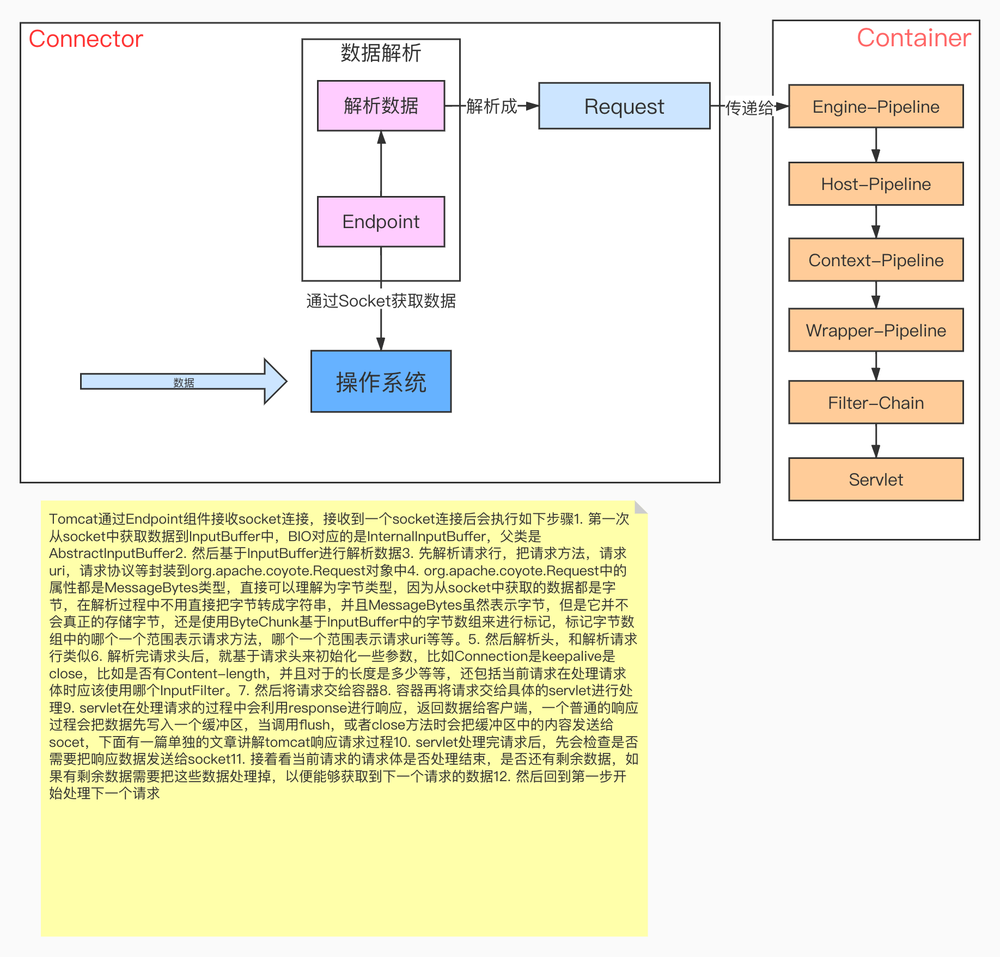

### 搭建Tomcat 源码环境
   

### startup.sh(startup.bat) & catalina.sh (catalina.bat)
   当我们初学tomcat的时候, 肯定先要学习怎样启动tomcat. 在tomcat的bin目录下有两个启动tomcat的文件, 一个是startup.bat, 它用于windows环境下启动tomcat; 另一个是startup.sh, 
   它用于linux环境下tomcat的启动. 两个文件中的逻辑是一样的.
   
   1.startup.bat(startup.sh) 文件主要做了一件事就是启动 catalina.bat 或 catalina.sh
   
   2.catalina.bat(catalina.sh)  最终执行了org.apache.catalina.startup.Bootstrap 类中的main方法.


### Bootstrap 
    
   每个应用程序都有一个唯一的入口(即main函数), tomcat启动相关的类位于catalina.startup包路径下，入口是类Bootstrap中的main()函数。Bootstrap启动类主要完成了三方面的内容，分别如下：
    
       ①在静态代码块中设置 catalinaHome 和 catalinaBase 两个路径；
            (1)catalinaHome:tomcat的安装目录
            
            (2)catalinaBase:tomcat的工作目录
       
       ②common、server、shared三个类加载器的初始化；
       
       ③利用反射机制实例化org.apache.catalina.startup.Catalina类。

### Tomcat 的启动流程分析

   
   
   
   从图中我们可知从Bootstrap类的main方法开始, tomcat会以链的方式逐级调用各个模块的init()方法进行初始化, 待各个模块都初始化后, 又会逐级调用各个模块的start()方法启动各个模块
   
   下面只分析Bootstrap 怎么创建 Catalina对象，并调用load() 方法：
```
 public static void main(String args[]) {

        if (daemon == null) {
            // Don't set daemon until init() has completed
            // 创建本类对象
            Bootstrap bootstrap = new Bootstrap();
            try {
                // 调用init() 初始化方法进行初始化
                bootstrap.init(); // catalinaaemon
            } catch (Throwable t) {
                handleThrowable(t);
                t.printStackTrace();
                return;
            }
            daemon = bootstrap;
        } else {
            // When running as a service the call to stop will be on a new
            // thread so make sure the correct class loader is used to prevent
            // a range of class not found exceptions.
            Thread.currentThread().setContextClassLoader(daemon.catalinaLoader);
        }

        try {
            
            // 判断启动参数，一般是默认启动方式 start
            String command = "start";
            if (args.length > 0) {
                command = args[args.length - 1];
            }

            if (command.equals("startd")) {
                args[args.length - 1] = "start";
                daemon.load(args);
                daemon.start();
            } else if (command.equals("stopd")) {
                args[args.length - 1] = "stop";
                daemon.stop();
            } else if (command.equals("start")) {
                daemon.setAwait(true);  // 设置阻塞标志
                daemon.load(args);      // 解析server.xml,初始化Catalina
                daemon.start();
                if (null == daemon.getServer()) {
                    System.exit(1);
                }
            } else if (command.equals("stop")) {
                daemon.stopServer(args);
            } else if (command.equals("configtest")) {
                daemon.load(args);
                if (null == daemon.getServer()) {
                    System.exit(1);
                }
                System.exit(0);
            } else {
                log.warn("Bootstrap: command \"" + command + "\" does not exist.");
            }
        } catch (Throwable t) {
            // Unwrap the Exception for clearer error reporting
            if (t instanceof InvocationTargetException &&
                    t.getCause() != null) {
                t = t.getCause();
            }
            handleThrowable(t);
            t.printStackTrace();
            System.exit(1);
        }
    }
```
  调用 Bootstrap中 load 方法
```
    /**
     * Load daemon.
     * 调用Catalina实例的load方法
     */
    private void load(String[] arguments)
        throws Exception {

        // Call the load() method
        String methodName = "load";
        Object param[];
        Class<?> paramTypes[];
        if (arguments==null || arguments.length==0) {
            paramTypes = null;
            param = null;
        } else {
            paramTypes = new Class[1];
            paramTypes[0] = arguments.getClass();
            param = new Object[1];
            param[0] = arguments;
        }
        //最终通过反射调用私有成员变量 catalinaDaemon 的load() 方法。
        // catalinaDaemon 私有成员变量 在Bootstrap 的init() 初始化方法中通过反射完成初始化，实际就是 Catalina 对象
        Method method =
            catalinaDaemon.getClass().getMethod(methodName, paramTypes);
        if (log.isDebugEnabled())
            log.debug("Calling startup class " + method);
        method.invoke(catalinaDaemon, param);
    }
```

####  解析server.xml
```
1. Catalina catalina = new Catalina(); // 没做其他事情
2. catalina.setAwait(true); 
3. 以下步骤是解析servler.xml
4. StandardServer server = new StandardServer();  // 没做其他事情
5. catalina.setServer(server);
6. server.addLifecycleListener(...);
7. StandardService service = new StandardService(); // 没做其他事情
8. server.addService(service);
9. Connector connector = new Connector();  // 会根据配置初始化protocolHandler
    a. endpoint = new JIoEndpoint();    // 初始化Endpoint， JioEndpoint中会setMaxConnections(0);
    b. cHandler = new Http11ConnectionHandler(this);  // 
    c. ((JIoEndpoint) endpoint).setHandler(cHandler);    // endpoint对应的连接处理器
10. service.addConnector(connector);   
11. Engine engine = new StandardEngine();  // pipeline.setBasic(new StandardEngineValve());
12. service.setContainer(engine);
13. Host host = new StandardHost();    // pipeline.setBasic(new StandardHostValve());
14. engine.addChild(host);
15. Context context = new StandardContext();  // pipeline.setBasic(new StandardContextValve());
16. host.addChild(context);
17. engine.setParentClassLoader(Catalina.class.getClassLoader()); // 实际调用的是ContainerBase.setParentClassLoader方法，设置属性parentClassLoader为shareClassLoader
18. server.setCatalina(catalina);
19. server.init();   // 开始初始化
20. catalina.start();  // 开始启动
```
   
   解析server.xml最主要的作用就是
    
    1. 把server.xml中定义的节点都生成对应的java对象，比如在解析某一个Host节点时就会对应生成一个StandardHost对象
    
    2. 把server.xml中定义的节点的层级关系解析出来，比如StandardContext对象.addChild(StandardHost对象)
    
    3. 设置每个容器的pipeline的基础Valve

#### 初始化
```
Tomcat初始化主要做了以下事情：
    1. 将StandardServer实例注册到JMX
    2. 将StringCache实例注册到JMX
    3. 将StandardService实例注册到JMX
    4. container.init(); // 对StandardEngine进行初始化
        a. 初始化startStopExecutor线程池，用来启动子容器的
    5. connector.init(); // 对Connector进行初始化
        a. adapter = new CoyoteAdapter(this);
        b. protocolHandler.setAdapter(adapter);
        c. protocolHandler.init(); // 初始化协议处理器
            ⅰ. endpoint.init();    // 初始化协议处理器对应的endpoint，默认在初始化的时候就会bind
                1. endpoint.bind()
                    a. serverSocketFactory = new DefaultServerSocketFactory(this);
                    b. serverSocket = serverSocketFactory.createSocket(getPort(), getBacklog(), getAddress());
        d. mapperListener.init(); // 没做什么其他的
```

   补充点：MBeanRegistration这个类是完成JMX的功能，就是我们俗称的监控管理功能，之前我们讲的使用jconsole查看Tomcat也就是通过JMX玩的。

#### 启动

   1.启动容器
    
 启动容器主要是部署应用，部署应用分为两部分：
 
   1. 部署server.xml中定义的Context
     
   2. 部署webapp文件夹下的Context
   
 部署一个应用主要分为以下步骤:
    
    1.生成Context对象，server.xml中定义的Context在解析server.xml时就已经生成了，webapp文件夹下的是在部署之前生成的
    
    2.为每个应用生成一个WebappClassLoader
    
    3.解析web.xml
    
    4.设置Context对象中的属性，比如有哪些Wrapper
   
   2.启动Connector
   
      1.启动Endpoint开始接收请求
      
      2.构造Mapper对象，用来处理请求时，快速解析出当前请求对应哪个Context，哪个Wrapper
```
1. catalina.start()
2. getServer().start();
    a. fireLifecycleEvent(CONFIGURE_START_EVENT, null);
    b. services[i].start();
        ⅰ. container.start(); // 启动StandardEngine
            1. results.add(startStopExecutor.submit(new StartChild(children[i]))); // 每个Childrean容器（StandardHost）用单独的线程启动
                a. results.add(startStopExecutor.submit(new StartChild(children[i]))); // 每个Childrean容器（StandardContext）用单独的线程启动
                    ⅰ. 以下为一个应用的启动过程
                    ⅱ. 生成一个WebappLoader
                    ⅲ. 启动WebappLoader
                        1. 生成WebappClassLoader
                        2. 将/WEB-INF/classes和/WEB-INF/lib目录作为loaderRepositories，后面应用如果加载类就从这两个目录加载
                    ⅳ. fireLifecycleEvent(Lifecycle.CONFIGURE_START_EVENT, null);
                        1. 解析web.xml文件
                            a. 创建WebXml对象
                            b. 解析web.xml文件内容设置WebXml对象属性
                                ⅰ. WebXML对象有以下几个主要属性
                                ⅱ. Map<String,ServletDef> servlets
                                ⅲ. Map<String,String> servletMappings
                                ⅳ. Map<String,FilterDef> filters
                                ⅴ. Set<FilterMap> filterMaps
                            c. 收集ServletContainerInitializers
                            d. 将WebXML对象中的信息配置到Context对象中
                                ⅰ. context.addFilterDef(filter);
                                ⅱ. context.addFilterMap(filterMap);
                                ⅲ. context.addApplicationListener(listener);
                                ⅳ. 遍历每个ServletDef，生成一个Wrapper，context.addChild(wrapper);
                    ⅴ. 调用ServletContainerInitializers
                b. 上面会启动在server.xml中定义的Context，接下来会启动webapp文件夹下面的Context，是通过HostConfig触发的，调用HostConfig的start()
                    ⅰ. deployApps();
                        1. deployDescriptors(configBase, configBase.list()); // 描述符部署
                        2. deployWARs(appBase, filteredAppPaths); // war包部署
                        3. deployDirectories(appBase, filteredAppPaths); // 文件夹部署
                            a. 生成Context对象
                            b. context.setName(cn.getName());
                            c. context.setPath(cn.getPath());
                            d. host.addChild(context);  // 这里会启动context，启动Context就会执行和上面类似的步骤
            2. threadStart(); // 启动一个background线程
        ⅱ. executor.start();  // 启动线程池, 如果用的默认连接池，这里不会启动
        ⅲ. connector.start(); // 启动请求连接器
            1. protocolHandler.start(); // 启动接收连接
                a. endpoint.start(); // 启动Endpoint
                    ⅰ. 如果没有配置Executor，就创建一个默认的Executor
                    ⅱ. 初始化connectionLimitLatch
                    ⅲ. 如果是NIO，则运行Poller线程
                    ⅳ. 运行Acceptor线程
            2. mapperListener.start();
                a. 主要初始化Mapper对象，Mapper对象的结构层级如下
                    ⅰ. Mapper中有属性Host[] hosts
                    ⅱ. Host中有属性ContextList contextList
                    ⅲ. ContextList中有属性Context[] contexts
                    ⅳ. Context中有属性ContextVersion[] versions
                    ⅴ. ContextVersion中有如下属性
                        1. Wrapper[] exactWrappers，保存需要根据Servlet名字精确匹配的Wrapper
                        2. Wrapper[] wildcardWrappers，保存需要根据Servlet名字匹配以("/*")结尾的Wrapper
                        3. Wrapper[] extensionWrappers，保存需要根据Servlet名字匹配以("*.")开始的Wrapper
                        4. Wrapper中有如下两个属性
                            a. name，Wrapper的名字
                            b. object，真实的Wrapper的对象
3. catalina.await();  // 使用ServerSocket来监听shutdown命令来阻塞
4. catalina.stop();  // 如果阻塞被解开，那么开始停止流程
```
 
 
### Tomcat7 BIO处理请求过程
   
   

#### 使用协议 

   tomcat 启动会将 server.xml 的 Connector 标签解析成 Connector 类 ，Connector 类中有一个 setProtocol(String protocol) 方法，
   根据 Connector标签中的 protocol 属性 判断是使用哪种协议，然后会根据协议，设置不同的协议处理器 
```
// package org.apache.catalina.connector.Connector

 public void setProtocol(String protocol) {

        if (AprLifecycleListener.isAprAvailable()) { // 默认false
            if ("HTTP/1.1".equals(protocol)) {
                setProtocolHandlerClassName
                ("org.apache.coyote.http11.Http11AprProtocol");
            } else if ("AJP/1.3".equals(protocol)) {
                setProtocolHandlerClassName
                ("org.apache.coyote.ajp.AjpAprProtocol");
            } else if (protocol != null) {
                setProtocolHandlerClassName(protocol);
            } else {
                setProtocolHandlerClassName
                ("org.apache.coyote.http11.Http11AprProtocol");
            }
        } else {
            if ("HTTP/1.1".equals(protocol)) {  // tomcat7 默认bio
                setProtocolHandlerClassName
                ("org.apache.coyote.http11.Http11Protocol");  // BIO
            } else if ("AJP/1.3".equals(protocol)) {  // 跟apache 交互的协议，一般都不会用到
                setProtocolHandlerClassName
                ("org.apache.coyote.ajp.AjpProtocol");
            } else if (protocol != null) {  // 根据 类名设置 协议处理器
                setProtocolHandlerClassName(protocol); // org.apache.coyote.http11NIOProxot
            }
        }

    }
```

####  协议处理器（BIO 为例）
   
   根据 Connector 类设置的协议处理器，最终会在对应的协议处理器的构造方法中new 一个 Endpoint，这里 使用的 JIoEndpoint。
    
```
// package org.apache.coyote.http11.Http11Protocol

    public Http11Protocol() {
        endpoint = new JIoEndpoint();  // 这个其实就是bio Endpoint
        cHandler = new Http11ConnectionHandler(this);
        ((JIoEndpoint) endpoint).setHandler(cHandler);
        setSoLinger(Constants.DEFAULT_CONNECTION_LINGER);
        setSoTimeout(Constants.DEFAULT_CONNECTION_TIMEOUT);
        setTcpNoDelay(Constants.DEFAULT_TCP_NO_DELAY);
    }
```

#### Endpoint
   
   Endpoint 根据io 模型拿到数据，在根据不同协议去解析数据
   Endpoint 就是接收处理 socket 连接的，然后根据不同的协议 实现不同的 Endpoint。
   
   Endpoint 的抽象类 是 AbstractEndpoint ，具体有三个实现类
       
       1.AprEndpoint 
       2.JIoEndpoint  实际就是 bio
       3.NioEndpoint  实际就是nio
   
  以  JIoEndpoint 为例
```
// package org.apache.tomcat.util.net.JIoEndpoint

    protected class Acceptor extends AbstractEndpoint.Acceptor {

        @Override
        public void run() {

            int errorDelay = 0;

            // Loop until we receive a shutdown command
            while (running) {

                // Loop if endpoint is paused
                // 如果Endpoint仍然在运行，但是被暂停了，那么就无限循环，从而不能接受请求
                while (paused && running) {
                    state = AcceptorState.PAUSED;
                    try {
                        Thread.sleep(50);
                    } catch (InterruptedException e) {
                        // Ignore
                    }
                }

                if (!running) {
                    break;
                }
                state = AcceptorState.RUNNING;

                try {
                    //if we have reached max connections, wait
                    //达到了最大连接数限制则等待
                    countUpOrAwaitConnection();

                    Socket socket = null;  // bio，nio
                    try {
                        // Accept the next incoming connection from the server
                        // bio socket 接收数据
                        // 此处是阻塞的，那么running属性就算已经被改成false，那么怎么进入到下一次循环呢？
                        socket = serverSocketFactory.acceptSocket(serverSocket);//
                        System.out.println("接收到了一个socket连接");

                    } catch (IOException ioe) {
                        countDownConnection();
                        // Introduce delay if necessary
                        errorDelay = handleExceptionWithDelay(errorDelay);
                        // re-throw
                        throw ioe;
                    }
                    // Successful accept, reset the error delay
                    errorDelay = 0;

                    // Configure the socket
                    // 如果Endpoint正在运行并且没有被暂停，那么就处理该socket
                    if (running && !paused && setSocketOptions(socket)) {
                        // Hand this socket off to an appropriate processor
                        // socket被正常的交给了线程池，processSocket就会返回true
                        // 如果没有被交给线程池或者中途Endpoint被停止了，则返回false
                        // 返回false则关闭该socket
                        // 处理数据
                        if (!processSocket(socket)) {
                            countDownConnection();
                            // Close socket right away
                            closeSocket(socket);
                        }
                    } else {
                        countDownConnection();
                        // Close socket right away
                        closeSocket(socket);
                    }
                } catch (IOException x) {
                    if (running) {
                        log.error(sm.getString("endpoint.accept.fail"), x);
                    }
                } catch (NullPointerException npe) {
                    if (running) {
                        log.error(sm.getString("endpoint.accept.fail"), npe);
                    }
                } catch (Throwable t) {
                    ExceptionUtils.handleThrowable(t);
                    log.error(sm.getString("endpoint.accept.fail"), t);
                }
            }
            state = AcceptorState.ENDED;
        }
    }
```
#### 处理socket 数据 

   调用  SocketProcessor 线程类处理socket 数据
  
```
// package org.apache.tomcat.util.net.JIoEndpoint

  protected boolean processSocket(Socket socket) {
        // Process the request from this socket
        try {
            SocketWrapper<Socket> wrapper = new SocketWrapper<Socket>(socket);
            wrapper.setKeepAliveLeft(getMaxKeepAliveRequests());
            wrapper.setSecure(isSSLEnabled());
            // During shutdown, executor may be null - avoid NPE
            if (!running) {
                return false;
            }
            // bio， 一个socket连接对应一个线程
            // 一个http请求对应一个线程？
            getExecutor().execute(new SocketProcessor(wrapper));
        } catch (RejectedExecutionException x) {
            log.warn("Socket processing request was rejected for:"+socket,x);
            return false;
        } catch (Throwable t) {
            ExceptionUtils.handleThrowable(t);
            // This means we got an OOM or similar creating a thread, or that
            // the pool and its queue are full
            log.error(sm.getString("endpoint.process.fail"), t);
            return false;
        }
        return true;
    }
```

####  SocketProcessor 线程类 

  调用  handler.process(SocketWrapper<Socket> socket,SocketStatus status) 方法
```
// package org.apache.tomcat.util.net.JIoEndpoint.SocketProcessor  JIoEndpoint 的内部类

        @Override
        public void run() {
            boolean launch = false;
            synchronized (socket) {
                // 开始处理socket
                // Socket默认状态为OPEN
                try {
                    SocketState state = SocketState.OPEN;

                    try {
                        // SSL handshake
                        serverSocketFactory.handshake(socket.getSocket());
                    } catch (Throwable t) {
                        ExceptionUtils.handleThrowable(t);
                        if (log.isDebugEnabled()) {
                            log.debug(sm.getString("endpoint.err.handshake"), t);
                        }
                        // Tell to close the socket
                        state = SocketState.CLOSED;
                    }

                    // 当前socket没有关闭则处理socket
                    if ((state != SocketState.CLOSED)) {
                        // SocketState是Tomcat定义的一个状态,这个状态需要处理一下socket才能确定，因为跟客户端，跟具体的请求信息有关系
                        if (status == null) {
                            state = handler.process(socket, SocketStatus.OPEN_READ);
                        } else {
                            // status表示应该读数据还是应该写数据
                            // state表示处理完socket后socket的状态
                            state = handler.process(socket,status);
                        }
                    }
                    // 省略其他代码........

                } finally {
                    // 省略其他代码........
            }
            socket = null;
            // Finish up this request
        }
```

#### AbstractProtocol
   
   1.创建处理器 processor = createProcessor(); // HTTP11NIOProce
   
   2.调用 处理器的 process 方法  state = processor.process(wrapper);
   
   
```
// package org.apache.coyote.AbstractProtocol<S>

public SocketState process(SocketWrapper<S> wrapper,
        SocketStatus status) {
    if (wrapper == null) {
        // Nothing to do. Socket has been closed.
        return SocketState.CLOSED;
    }

    S socket = wrapper.getSocket();
    if (socket == null) {
        // Nothing to do. Socket has been closed.
        return SocketState.CLOSED;
    }

    Processor<S> processor = connections.get(socket);
    if (status == SocketStatus.DISCONNECT && processor == null) {
        // Nothing to do. Endpoint requested a close and there is no
        // longer a processor associated with this socket.
        return SocketState.CLOSED;
    }
    // 设置为非异步，就是同步
    wrapper.setAsync(false);
    ContainerThreadMarker.markAsContainerThread();

    try {
        if (processor == null) {
            // 从被回收的processor中获取processor
            processor = recycledProcessors.poll();
        }
        if (processor == null) {
            //1.创建处理器
            processor = createProcessor(); // HTTP11NIOProce
        }

        initSsl(wrapper, processor);

        SocketState state = SocketState.CLOSED;
        do {
            if (status == SocketStatus.DISCONNECT &&
                    !processor.isComet()) {
                // Do nothing here, just wait for it to get recycled
                // Don't do this for Comet we need to generate an end
                // event (see BZ 54022)
            } else if (processor.isAsync() || state == SocketState.ASYNC_END) {
                // 要么Tomcat线程还没结束，业务线程就已经调用过complete方法了，然后利用while走到这个分支
                // 要么Tomcat线程结束后，在超时时间内业务线程调用complete方法，然后构造一个新的SocketProcessor对象扔到线程池里走到这个分支
                // 要么Tomcat线程结束后，超过超时时间了，由AsyncTimeout线程来构造一个SocketProcessor对象扔到线程池里走到这个分支
                // 不管怎么样，在整个调用异步servlet的流程中，此分支只经历一次，用来将output缓冲区中的内容发送出去

                state = processor.asyncDispatch(status);
                if (state == SocketState.OPEN) {
                    state = processor.process(wrapper);
                }
            } else if (processor.isComet()) {
                state = processor.event(status);
            } else if (processor.getUpgradeInbound() != null) {
                state = processor.upgradeDispatch();
            } else if (processor.isUpgrade()) {
                state = processor.upgradeDispatch(status);
            } else {
                // 2.大多数情况下走这个分支
                state = processor.process(wrapper);
            }

            //  省略其他代码........
  
        } while (state == SocketState.ASYNC_END ||
                state == SocketState.UPGRADING ||
                state == SocketState.UPGRADING_TOMCAT);


        //  省略其他代码........
        return state;

    } catch(java.net.SocketException e) {
      
    } catch (java.io.IOException e) {
    
    } catch (Throwable e) {
       
    }
    //  省略其他代码........
    return SocketState.CLOSED;
}
```

####  调用 处理器 的抽象类 以 AbstractHttp11Processor<S> 为例
 
   1.解析请求行
   
   2.解析请求头
   
   3.交给容器处理请求  adapter.service(request, response);  调用容器进行处理, 直接调用的 StandardEngineValve,然后根据管道依次调用四大容器
   
```
// package org.apache.coyote.http11.AbstractHttp11Processor<S>

@Override
public SocketState process(SocketWrapper<S> socketWrapper)
    throws IOException {

    RequestInfo rp = request.getRequestProcessor();
    rp.setStage(org.apache.coyote.Constants.STAGE_PARSE);   // 设置请求状态为解析状态

    // Setting up the I/O
    setSocketWrapper(socketWrapper);
    getInputBuffer().init(socketWrapper, endpoint);     // 将socket的InputStream与InternalInputBuffer进行绑定
    getOutputBuffer().init(socketWrapper, endpoint);    // 将socket的OutputStream与InternalOutputBuffer进行绑定

    // Flags
    keepAlive = true;
    comet = false;
    openSocket = false;
    sendfileInProgress = false;
    readComplete = true;
    // NioEndpoint返回true, Bio返回false
    if (endpoint.getUsePolling()) {
        keptAlive = false;
    } else {
        keptAlive = socketWrapper.isKeptAlive();
    }

    // 如果当前活跃的线程数占线程池最大线程数的比例大于75%，那么则关闭KeepAlive，不再支持长连接
    if (disableKeepAlive()) {
        socketWrapper.setKeepAliveLeft(0);
    }

    // keepAlive默认为true,它的值会从请求中读取
    while (!getErrorState().isError() && keepAlive && !comet && !isAsync() &&
            upgradeInbound == null &&
            httpUpgradeHandler == null && !endpoint.isPaused()) {
        // keepAlive如果为true,接下来需要从socket中不停的获取http请求

        // Parsing the request header
        try {
            // 第一次从socket中读取数据，并设置socket的读取数据的超时时间
            // 对于BIO，一个socket连接建立好后，不一定马上就被Tomcat处理了，其中需要线程池的调度，所以这段等待的时间要算在socket读取数据的时间内
            // 而对于NIO而言，没有阻塞
            setRequestLineReadTimeout();

            // 解析请求行
            if (!getInputBuffer().parseRequestLine(keptAlive)) {
                // 下面这个方法在NIO时有用，比如在解析请求行时，如果没有从操作系统读到数据，则上面的方法会返回false
                // 而下面这个方法会返回true，从而退出while，表示此处read事件处理结束
                // 到下一次read事件发生了，就会从小进入到while中
                if (handleIncompleteRequestLineRead()) {
                    break;
                }
            }

            if (endpoint.isPaused()) {
                // 503 - Service unavailable
                // 如果Endpoint被暂停了，则返回503
                response.setStatus(503);
                setErrorState(ErrorState.CLOSE_CLEAN, null);
            } else {
                keptAlive = true;
                // Set this every time in case limit has been changed via JMX
                // 每次处理一个请求就重新获取一下请求头和cookies的最大限制
                request.getMimeHeaders().setLimit(endpoint.getMaxHeaderCount());
                request.getCookies().setLimit(getMaxCookieCount());
                // Currently only NIO will ever return false here
                // 解析请求头
                if (!getInputBuffer().parseHeaders()) {
                    // We've read part of the request, don't recycle it
                    // instead associate it with the socket
                    openSocket = true;
                    readComplete = false;
                    break;
                }
                if (!disableUploadTimeout) {
                    setSocketTimeout(connectionUploadTimeout);
                }
            }
        } catch (IOException e) {
           //  省略其他代码........
        } catch (Throwable t) {
           //  省略其他代码........
        }

        if (!getErrorState().isError()) {
            // Setting up filters, and parse some request headers
            rp.setStage(org.apache.coyote.Constants.STAGE_PREPARE);  // 设置请求状态为预处理状态
            try {
                prepareRequest();   // 预处理, 主要从请求中处理处keepAlive属性，以及进行一些验证，以及根据请求分析得到ActiveInputFilter
            } catch (Throwable t) {
                ExceptionUtils.handleThrowable(t);
                if (getLog().isDebugEnabled()) {
                    getLog().debug(sm.getString(
                            "http11processor.request.prepare"), t);
                }
                // 500 - Internal Server Error
                response.setStatus(500);
                setErrorState(ErrorState.CLOSE_CLEAN, t);
                getAdapter().log(request, response, 0);
            }
        }

        if (maxKeepAliveRequests == 1) {
            // 如果最大的活跃http请求数量仅仅只能为1的话，那么设置keepAlive为false，则不会继续从socket中获取Http请求了
            keepAlive = false;
        } else if (maxKeepAliveRequests > 0 &&
                socketWrapper.decrementKeepAlive() <= 0) {
            // 如果已经达到了keepAlive的最大限制，也设置为false，则不会继续从socket中获取Http请求了
            keepAlive = false;
        }

        // Process the request in the adapter
        if (!getErrorState().isError()) {
            try {
                rp.setStage(org.apache.coyote.Constants.STAGE_SERVICE); // 设置请求的状态为服务状态，表示正在处理请求
                
                // 交给容器处理请求
                adapter.service(request, response); // 交给容器处理请求
              
                if(keepAlive && !getErrorState().isError() && (
                        response.getErrorException() != null ||
                                (!isAsync() &&
                                statusDropsConnection(response.getStatus())))) {
                    setErrorState(ErrorState.CLOSE_CLEAN, null);
                }
                setCometTimeouts(socketWrapper);
            } catch (InterruptedIOException e) {
                setErrorState(ErrorState.CLOSE_NOW, e);
            } catch (HeadersTooLargeException e) {
               //  省略其他代码........
            } catch (Throwable t) {
               //  省略其他代码........
            }
        }

        // Finish the handling of the request
        rp.setStage(org.apache.coyote.Constants.STAGE_ENDINPUT);  // 设置请求的状态为处理请求结束

        if (!isAsync() && !comet) {
            if (getErrorState().isError()) {
             
                getInputBuffer().setSwallowInput(false);
            } else {
               
                checkExpectationAndResponseStatus();
            }
            // 当前http请求已经处理完了，做一些收尾工作
            endRequest();
        }

        rp.setStage(org.apache.coyote.Constants.STAGE_ENDOUTPUT); // 请求状态为输出结束

      
        if (getErrorState().isError()) {
            response.setStatus(500);
        }
        request.updateCounters();

        if (!isAsync() && !comet || getErrorState().isError()) {
            if (getErrorState().isIoAllowed()) {
                // 准备处理下一个请求
                getInputBuffer().nextRequest();
                getOutputBuffer().nextRequest();
            }
        }

        if (!disableUploadTimeout) {
            if(endpoint.getSoTimeout() > 0) {
                setSocketTimeout(endpoint.getSoTimeout());
            } else {
                setSocketTimeout(0);
            }
        }

        rp.setStage(org.apache.coyote.Constants.STAGE_KEEPALIVE);

        // 如果处理完当前这个Http请求之后，发现socket里没有下一个请求了,那么就退出当前循环
        // 如果是keepalive，就不会关闭socket, 如果是close就会关闭socket
        // 对于keepalive的情况，因为是一个线程处理一个socket,当退出这个while后，当前线程就会介绍，
        // 当时对于socket来说，它仍然要继续介绍连接，所以又会新开一个线程继续来处理这个socket
        if (breakKeepAliveLoop(socketWrapper)) {
            break;
        }
    }

    //  省略其他代码........
}

```

#### 调用容器进行处理, 直接调用的 StandardEngineValve,然后根据管道依次调用四大容器
  
   // 调用 StandardHostValve 的 invoke 方法
   host.getPipeline().getFirst().invoke(request, response);
     》// 调用 StandardContextValve 的 invoke 方法
      context.getPipeline().getFirst().invoke(request, response);
        》// 调用 StandardWrapperValve 的 invoke 方法
          wrapper.getPipeline().getFirst().invoke(request, response);
  
  最后调用StandardWrapperValve 的invoke 方法
   
   filterChain.doFilter(request.getRequest(),response.getResponse());

```
@Override
public final void invoke(Request request, Response response)
    throws IOException, ServletException {

    // Initialize local variables we may need
    boolean unavailable = false;
    Throwable throwable = null;
    // This should be a Request attribute...
    long t1=System.currentTimeMillis();
    requestCount.incrementAndGet();
    StandardWrapper wrapper = (StandardWrapper) getContainer(); // // 属于哪个Wrapper
    Servlet servlet = null;
    Context context = (Context) wrapper.getParent();  // 属于哪个Context

    // Check for the application being marked unavailable
    if (!context.getState().isAvailable()) {
        response.sendError(HttpServletResponse.SC_SERVICE_UNAVAILABLE,
                       sm.getString("standardContext.isUnavailable"));
        unavailable = true;
    }

    // Check for the servlet being marked unavailable
    // 如果Context可用，但是Wrapper不可用, 在定义servlet时，可以设置enabled
    if (!unavailable && wrapper.isUnavailable()) {
        container.getLogger().info(sm.getString("standardWrapper.isUnavailable",
                wrapper.getName()));
        long available = wrapper.getAvailable();
        if ((available > 0L) && (available < Long.MAX_VALUE)) {
            response.setDateHeader("Retry-After", available);
            response.sendError(HttpServletResponse.SC_SERVICE_UNAVAILABLE,
                    sm.getString("standardWrapper.isUnavailable",
                            wrapper.getName()));
        } else if (available == Long.MAX_VALUE) {
            response.sendError(HttpServletResponse.SC_NOT_FOUND,
                    sm.getString("standardWrapper.notFound",
                            wrapper.getName()));
        }
        unavailable = true;
    }

    // Allocate a servlet instance to process this request
    try {
        if (!unavailable) {
            servlet = wrapper.allocate();
        }
    } catch (UnavailableException e) {
        container.getLogger().error(
                sm.getString("standardWrapper.allocateException",
                        wrapper.getName()), e);
        long available = wrapper.getAvailable();
        if ((available > 0L) && (available < Long.MAX_VALUE)) {
            response.setDateHeader("Retry-After", available);
            response.sendError(HttpServletResponse.SC_SERVICE_UNAVAILABLE,
                       sm.getString("standardWrapper.isUnavailable",
                                    wrapper.getName()));
        } else if (available == Long.MAX_VALUE) {
            response.sendError(HttpServletResponse.SC_NOT_FOUND,
                       sm.getString("standardWrapper.notFound",
                                    wrapper.getName()));
        }
    } catch (ServletException e) {
        container.getLogger().error(sm.getString("standardWrapper.allocateException",
                         wrapper.getName()), StandardWrapper.getRootCause(e));
        throwable = e;
        exception(request, response, e);
    } catch (Throwable e) {
        ExceptionUtils.handleThrowable(e);
        container.getLogger().error(sm.getString("standardWrapper.allocateException",
                         wrapper.getName()), e);
        throwable = e;
        exception(request, response, e);
        servlet = null;
    }

    // Identify if the request is Comet related now that the servlet has been allocated
    boolean comet = false;
    if (servlet instanceof CometProcessor && Boolean.TRUE.equals(request.getAttribute(
            Globals.COMET_SUPPORTED_ATTR))) {
        comet = true;
        request.setComet(true);
    }

    MessageBytes requestPathMB = request.getRequestPathMB();
    DispatcherType dispatcherType = DispatcherType.REQUEST;
    if (request.getDispatcherType()==DispatcherType.ASYNC) dispatcherType = DispatcherType.ASYNC;
    request.setAttribute(Globals.DISPATCHER_TYPE_ATTR,dispatcherType);
    request.setAttribute(Globals.DISPATCHER_REQUEST_PATH_ATTR,
            requestPathMB);
    // Create the filter chain for this request
    ApplicationFilterFactory factory =
        ApplicationFilterFactory.getInstance();

    ApplicationFilterChain filterChain =
        factory.createFilterChain(request, wrapper, servlet);

    // Reset comet flag value after creating the filter chain
    request.setComet(false);

    // Call the filter chain for this request
    // NOTE: This also calls the servlet's service() method
    try {
        if ((servlet != null) && (filterChain != null)) {
            // Swallow output if needed
            if (context.getSwallowOutput()) {
                try {
                    SystemLogHandler.startCapture();
                    if (request.isAsyncDispatching()) {
                        request.getAsyncContextInternal().doInternalDispatch();
                    } else if (comet) {
                        filterChain.doFilterEvent(request.getEvent());
                        request.setComet(true);
                    } else {
                        // 实际传递的不是  Request，Response 类 ，而是  RequestFacade，ResponseFacade
                        //  Request -> RequestFacade ，Response->ResponseFacade
                        filterChain.doFilter(request.getRequest(),
                                response.getResponse());
                    }
                } finally {
                    String log = SystemLogHandler.stopCapture();
                    if (log != null && log.length() > 0) {
                        context.getLogger().info(log);
                    }
                }
            } else {
                if (request.isAsyncDispatching()) {
                    request.getAsyncContextInternal().doInternalDispatch();
                } else if (comet) {
                    request.setComet(true);
                    filterChain.doFilterEvent(request.getEvent());
                } else {
                    filterChain.doFilter
                        (request.getRequest(), response.getResponse());
                }
            }

        }
    } catch (ClientAbortException e) {
        throwable = e;
        exception(request, response, e);
    } catch (IOException e) {
      //  省略其他代码........
    } catch (UnavailableException e) {
       //  省略其他代码........
    } catch (ServletException e) {
       //  省略其他代码........
    } catch (Throwable e) {
       //  省略其他代码........
    }

   //  省略其他代码........
}
```

###  调用 doFilter 
   
   1.执行filter的逻辑
   2.执行servlet
    
```
// package org.apache.catalina.core.ApplicationFilterChain

@Override
    public void doFilter(ServletRequest request, ServletResponse response)
        throws IOException, ServletException {

        if( Globals.IS_SECURITY_ENABLED ) {
           // //  省略其他代码........
        } else {
            internalDoFilter(request,response);
        }
    }
```
```
// package org.apache.catalina.core.ApplicationFilterChain

private void internalDoFilter(ServletRequest request,
                              ServletResponse response)
    throws IOException, ServletException {

    // Call the next filter if there is one
    if (pos < n) {
        ApplicationFilterConfig filterConfig = filters[pos++];
        Filter filter = null;
        try {
            filter = filterConfig.getFilter();
            support.fireInstanceEvent(InstanceEvent.BEFORE_FILTER_EVENT,
                                      filter, request, response);

            if (request.isAsyncSupported() && "false".equalsIgnoreCase(
                    filterConfig.getFilterDef().getAsyncSupported())) {
                request.setAttribute(Globals.ASYNC_SUPPORTED_ATTR,
                        Boolean.FALSE);
            }
            if( Globals.IS_SECURITY_ENABLED ) {
              //  省略其他代码........

            } else {
                // 执行filter的逻辑
                filter.doFilter(request, response, this);
            }

            support.fireInstanceEvent(InstanceEvent.AFTER_FILTER_EVENT,
                                      filter, request, response);
        } catch (IOException e) {
         //  省略其他代码........
        } catch (ServletException e) {
          //  省略其他代码........
        } catch (RuntimeException e) {
          //  省略其他代码........
        } catch (Throwable e) {
          //  省略其他代码........
        }
        return;
    }

    // We fell off the end of the chain -- call the servlet instance
    try {
        if (ApplicationDispatcher.WRAP_SAME_OBJECT) {
            lastServicedRequest.set(request);
            lastServicedResponse.set(response);
        }

        support.fireInstanceEvent(InstanceEvent.BEFORE_SERVICE_EVENT,
                                  servlet, request, response);
        if (request.isAsyncSupported()
                && !support.getWrapper().isAsyncSupported()) {
            request.setAttribute(Globals.ASYNC_SUPPORTED_ATTR,
                    Boolean.FALSE);
        }
        // Use potentially wrapped request from this point
        if ((request instanceof HttpServletRequest) &&
            (response instanceof HttpServletResponse)) {

            if( Globals.IS_SECURITY_ENABLED ) {
               //  省略其他代码........
            } else {
                // 执行servlet  
                servlet.service(request, response);
            }
        } else {
            servlet.service(request, response);
        }
        support.fireInstanceEvent(InstanceEvent.AFTER_SERVICE_EVENT,
                                  servlet, request, response);
    } catch (IOException e) {
      //  省略其他代码........
    } catch (ServletException e) {
      //  省略其他代码........
    } catch (RuntimeException e) {
       //  省略其他代码........
    } catch (Throwable e) {
      //  省略其他代码........
    } finally {
       //  省略其他代码........
    }
}
```


 
 
 


   