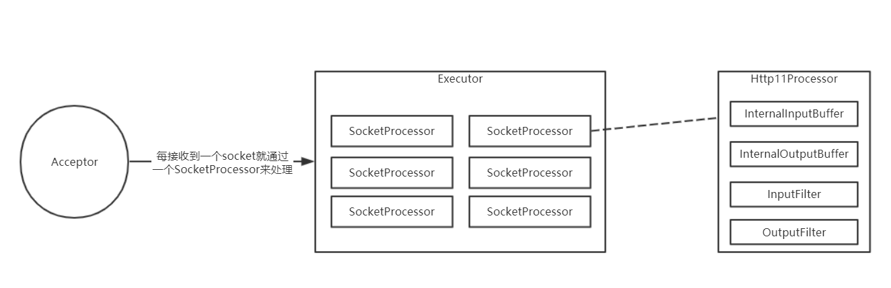
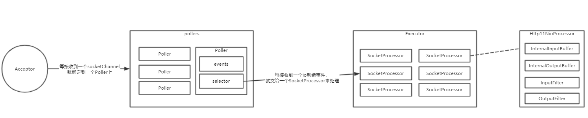
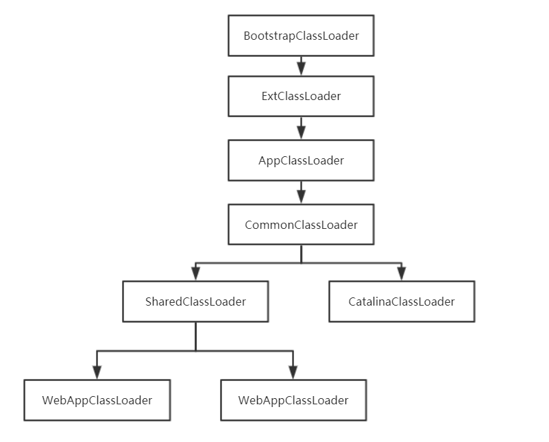
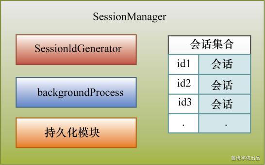

### Tomcat中BIO和NIO底层原理实现对比
 
   在Tomcat7中，默认为BIO，但可以通过如下配置改为NIO
```
// conf/server.xml
    <Connector port="8080" protocol="org.apache.coyote.http11.Http11NioProtocol"
    connectionTimeout="20000" redirectPort="8443" />
```

#### BIO
   
   1.JioEndpoint中的Acceptor线程负责循环阻塞接收socket连接
   
   2.每接收到一个socket连接就包装成SocketProcessor扔进线程池Executor中，SocketProcessor是一个Runnable
   
   3.SocketProcessor负责从socket中阻塞读取数据，并且向socket中阻塞写入数据
   
  Acceptor线程的数量默认为1个，可以通过acceptorThreadCount参数进行配置
  线程池Executor是可以配置的，比如：
```
<Executor name="tomcatThreadPool" namePrefix="catalina-exec-"
       maxThreads="150" minSpareThreads="4"/>

<Connector port="8080" protocol="org.apache.coyote.http11.Http11NioProtocol"
       connectionTimeout="20000"
       redirectPort="8443" executor="tomcatThreadPool"/>
```
  
   从上面的配置可以看到，每个Connector可以对应一个线程池，默认情况下，Tomcat中每个Connector都会创建一个自己的线程池，并且该线程池的默认值为：
       
       1. 最小线程数量为10
       
       2. 最大线程数量为200
   
   如果两个Connector配置的executor是一样的话，就表示这两个Connector公用一个线程池。
   
   使用BIO来处理请求时，我们可以总结一下：
   
    1. 当请求数量比较大时，可以提高Acceptor线程的数量，提高接收请求的速率
   
    2. 当请求比较耗时是，可以提高线程池Executor的最大线程数量
   
   当然，增加线程的目的都是为了提高Tomcat的性能，但是一台机器的线程数量并不是越多越好，需要利用压测来最终确定一个更加符合当前业务场景的线程数量。
   
   

#### NIO
   
   NIO最大的特性就是非阻塞，非阻塞接收socket连接，非阻塞从socket中读取数据，非阻塞从将数据写到socket中。
   
   但是在Tomcat7中，只有在从socket中读取请求行，请求头数据时是非阻塞的，在读取请求体是阻塞的，响应数据时也是阻塞的。
   
   为什么不全是非阻塞的呢？因为Tomcat7对应Servlet3.0，Servlet3.0规范中没有考虑NIO，比如我们读取请求体的代码得这么写：
```
ServletInputStream inputStream = req.getInputStream();
byte[] bytes = new byte[1024];
int n;
while ((n = inputStream.read(bytes)) > 0) {
    System.out.println(new String(bytes, 0, n));
}
```
   
   inputStream.read()方法的含义就是阻塞读取数据，当读取请求体时，如果操作系统中还没有准备好，那么read方法就得阻塞。
   
   而NIO则不一样，NIO中是一旦操作系统中的数据准备好了，那么则会通知Java程序可以读取数据了，这里的通知很重要，这决定了我们的Java代码到底如何实现，如果在Servlet中想利用NIO去读取数据，
   那么在Servlet中肯定就要去监听是否有通知过来，比如在Servlet3.1中则增加了NIO相关的定义，如下面代码：
```
ServletInputStream inputStream = req.getInputStream();
inputStream.setReadListener(new ReadListener() {
  // 有数据可用时触发
  @Override
  public void onDataAvailable() throws IOException {

  }
  // 数据全部读完了
  @Override
  public void onAllDataRead() throws IOException {

  }
  // 出现异常了  
  @Override
  public void onError(Throwable throwable) {

  }
});
``` 
   很明显可以看出来，这里有Listener，用来监听数据可读的通知，这才是真正的利用了NIO。
   
   首先我们来看一下Tomcat7中使用NIO处理请求的基本流程：
   1. 利用Acceptor来阻塞获取socket连接，NIO中叫socketChannel
   
   2. 接收到socketChannel后，需要将socketChannel绑定到一个Selector中，并注册读事件，另外，基于NIO还需要一个线程来轮询Selector中是否存在就绪事件，如果存在就将就绪事件查出来，并处理该事件，
   在Tomcat中支持多个线程同时查询是否存在就绪事件，该线程对象为Poller，每个Poller中都包含一个Selector，这样每个Poller线程就负责轮询自己的Selector上就绪的事件，然后处理事件。
   
   3. 当Acceptro接收到一个socketChannel后，就会将socketChannel注册到某一个Poller上，确定Polloer的逻辑非常简单，假设现在有3个Poller，编号为1,2,3，
   那么Tomcat接收到的第一个socketChannel注册到1号Poller上，第二个socketChannel注册到2号Poller上，第三个socketChannel注册到3号Poller上，第四个socketChannel注册到1号Poller上，依次循环。
   
   4. 在某一个Poller中，除开有selector外，还有一个ConcurrentLinkedQueue队列events，events表示待执行事件，比如Tomcat要socketChannel注册到selector上，但是Tomcat并没有直接这么做，
   而是先自己生成一个PollerEvent，然后把PollerEvent加入到队列events中，然后这个队列中的事件会在Poller线程的循环过程中真正执行
   
   5. 上面说了，Poller线程中需要循环查询selector中是否存在就绪事件，而Tomcat在真正查询之前会先看一下events队列中是否存在待执行事件，如果存在就会先执行，这些事件表示需要向selector上注册事件，
   比如注册socketChannel的读事件和写事件，所以在真正执行events队列中的事件时就会真正的向selector上注册事件。所以只有先执行events队列中的PollerEvent，Poller线程才能有机会从selector中查询到就绪事件
   
   6. 每个Poller线程一旦查询到就绪事件，就会去处理这些事件，事件无非就是读事件和写事件
   
   7. 处理的第一步就是获取当前就绪事件对应的socketChannel，因为我们要向socketChannel中读数据或写数据
   
   8. 处理的第二步就是把socketChannel和当前要做的事情（读或写）封装为SocketProcessor对象
   
   9. 处理的第三步就是把SocketProcessor扔进线程池进行处理
   
   10. 在SocketProcessor线程运行时，就会从socketChannel读取数据（假设当前处理的是读事件），并且是非阻塞读
   
   11. 既然是非阻塞读，大概的一个流程就是，某一个Poller中的selector查询到了一个读就绪事件，然后交给一个SocketProcessor线程进行处理，SocketProcessor线程读取数据之后，
   如果发现请求行和请求头的数据都已经读完了，并解析完了，那么该SocketProcessor线程就会继续把解析后的请求交给Servlet进行处理，Servlet中可能会读取请求体，可能会响应数据，
   而不管是读请求体还是响应数据都是阻塞的，直到Servlet中的逻辑都执行完后，SocketProcessor线程才会运行结束。假如SocketProcessor读到了数据之后，发现请求行或请求头的数据还没有读完，那么本次读事件处理完毕，
   需要Poller线程再次查询到就绪读事件才能继续读数据，以及解析数据
   
   12. 实际上Tomcat7中的非阻塞读就只是在读取请求行和请求体数据时才是非阻塞的，至于请求体的数据，是在Servlet中通过inputstream.read()方法获取时才会真正的去获取请求体的数据，并且是阻塞的。
   
   
   
   接下来我们来看下Tomcat7中是怎么阻塞的利用NIO来读取数据的。
   当Servlet中通过inputstream.read()来读取请求体数据时，最终执行的是InternalNioInputBuffer.SocketInputBuffer.doRead()方法。
   
   在这个方法中会调用fill(true,true)，第一个参数是timeout，第二个参数是block，block等于true，表示阻塞，fill方法中就会从操作系统读取数据填充到Tomcat的buf中。
   
   在接下来的阻塞读取数据流程中，主要利用的还是Selector，为什么阻塞的时候还要利用Selector呢？这是因为，socketChannel一开始是非阻塞的，我们现在如果想把它改成阻塞的，在NIO里是有一个限制的，
   如果一个socketChannel被设置成了非阻塞的，然后注册了事件，然后又想把socketChannel设置成阻塞的，这时是会抛异常的。所以在Tomcat中是使用的另外的方式来达到阻塞效果的。
   
   所以现在的目的是，仍然基于Selector的情况下达到阻塞效果，为了达到这个效果，原理也不难。
   
   在我们需要读取请求体数据时，不能直接利用之前的主Selector了（主Selector就是用来注册新socketChannel的），所以我们需要一个辅助Selector，在读取请求体数据时，
   新生成一个辅助Selector，这个辅助Selector用来监听当前请求的读事件，当有数据就绪时，辅助Selector就会查询到此次就绪事件（注意：这个时候主Selector是监听不到的，
   因为在这之前主Selector已经取消了对当前socketChannel的事件）。

   这是辅助Selector的主要作用，具体流程如下：
      
    1. inputstream.read()
    2. 向辅助Selector注册读事件
    3. 加锁（目的是达到阻塞）
    4. 与辅助Selector对应的有另外一个辅助Poller，辅助Poller负责轮询辅助Selector上发生的就绪事件，一旦轮询到就绪事件就会解锁，从而解阻塞
    5. 从socketChannel中读数据
    6. 返回，本次read结束
   
   默认情况下，辅助Selector是NioBlockingSelector对象，每次read都使用同一个NioBlockingSelector对象，在NioBlockingSelector对象中存在一个BlockPoller线程，BlockPoller就是辅助Poller。
   
   对于响应也是类似的思路，也是先注册写事件，阻塞，都有写就绪事件时就解阻塞，开始写入数据。

#### BIO/NIO 总结 
   
   在Tomcat7，虽然有NIO，但是不够彻底，相比如BIO，优点仅限于能利用较少的线程同时接收更多的请求，但是在真正处理请求时，想比如BIO并没有太多的优势，如果在处理一个请求时既不用读取请求，
   也不需要响应很多的数据那么NIO模式还是会拥有更大的吞吐量，所以如果要优化的话，将BIO改成NIO也是可以的。
   
### Tomcat中的类加载器与安全机制

#### 类加载器
   Java中的类遵循按需加载。
   
   所谓类加载器，就是用于加载 Java 类到 Java 虚拟机中的组件，它负责读取 Java 字节码，并转换成 java.lang.Class 类的一个实例，使字节码.class 文件得以运行。
   一般类加载器负责根据一个指定的类找到对应的字节码，然后根据这些字节码定义一个 Java 类。另外，它还可以加载资源，包括图像文件和配置文件。
   
   类加载器在实际使用中给我们带来的好处是，它可以使 Java 类动态地加载到 JVM 中并运行，即可在程序运行时再加载类，提供了很灵活的动态加载方式。
   
       启动类加载器（Bootstrap ClassLoader）：加载对象是 Java 核心库，把一些核心的 Java 类加载进 JVM 中，这个加载器使用原生代码（C/C++）实现，并不是继承 java.lang.ClassLoader，
       它是所有其他类加载器的最终父加载器，负责加载 <JAVA_HOME>/jre/lib 目录下 JVM 指定的类库。其实它属于 JVM 整体的一部分，JVM 一启动就将这些指定的类加载到内存中，避免以后过多的 I/O 操作，
       提高系统的运行效率。启动类加载器无法被 Java 程序直接使用。
       
       扩展类加载器（Extension ClassLoader）：加载的对象为 Java 的扩展库，即加载 <JAVA_HOME>/jre/lib/ext 目录里面的类。这个类由启动类加载器加载，但因为启动类加载器并非用 Java 实现，
       已经脱离了 Java 体系，所以如果尝试调用扩展类加载器的 getParent()方法获取父加载器会得到 null。然而，它的父类加载器是启动类加载器。
       
       应用程序类加载器（Application ClassLoader）：亦叫系统类加载器（System ClassLoader），它负责加载用户类路径（CLASSPATH）指定的类库，如果程序没有自己定义类加载器，就默认使用应用程序类加载器。
       它也由启动类加载器加载，但它的父加载类被设置成了扩展类加载器。如果要使用这个加载器，可通过 ClassLoader.getSystemClassLoader()获取。
   
#### 双亲委派
   
   双亲委派模型会在类加载器加载类时首先委托给父类加载器加载，除非父类加载器不能加载才自己加载。
   
   这种模型要求，除了顶层的启动类加载器外，其他的类加载器都要有自己的父类加载器。假如有一个类要加载进来，一个类加载器并不会马上尝试自己将其加载，而是委派给父类加载器，父类加载器收到后又尝试委派给其父类加载器，
   以此类推，直到委派给启动类加载器，这样一层一层往上委派。只有当父类加载器反馈自己没法完成这个加载时，子加载器才会尝试自己加载。通过这个机制，保证了 Java 应用所使用的都是同一个版本的 Java 核心库的类，
   同时这个机制也保证了安全性。设想如果应用程序类加载器想要加载一个有破坏性的 java.lang.System 类，双亲委派模型会一层层向上委派，最终委派给启动类加载器，而启动类加载器检查到缓存中已经有了这个类，
   并不会再加载这个有破坏性的 System 类。
   
   另外，类加载器还拥有全盘负责机制，即当一个类加载器加载一个类时，这个类所依赖的、引用的其他所有类都由这个类加载器加载，除非在程序中显式地指定另外一个类加载器加载。
   
   在 Java 中，我们用完全匹配类名来标识一个类，即用包名和类名。而在 JVM 中，一个类由完全匹配类名和一个类加载器的实例 ID 作为唯一标识。也就是说，同一个虚拟机可以有两个包名、类名都相同的类，
   只要它们由两个不同的类加载器加载。当我们在 Java 中说两个类是否相等时，必须在针对同一个类加载器加载的前提下才有意义，否则，就算是同样的字节码，由不同的类加载器加载，这两个类也不是相等的。
   这种特征为我们提供了隔离机制，在 Tomcat 服务器中它是十分有用的。

#### URLClassLoader
   
   我们在使用自定义类加载去加载类时，我们需要指明该去哪些资源中进行加载，所以JDK提供了URLClassLoader来方便我们使用，我们在创建URLClassLoader时需要传入一些URLs，
   然后在使用这个URLClassLoader加载类时就会从这些资源中去加载。

#### Tomcat中自定义的类加载器
   Tomcat 拥有不同的自定义类加载器，以实现对各种资源库的控制。一般来说，Tomcat 主要用类加载器解决以下 4 个问题。
   • 同一个Tomcat中，各个Web应用之间各自使用的Java类库要互相隔离。
   • 同一个Tomcat中，各个Web应用之间可以提供共享的Java类库。
   • 为了使Tomcat不受Web应用的影响，应该使服务器的类库与应用程序的类库互相独立。
   • Tomcat支持热部署。
   
   在 Tomcat中，最重要的一个类加载器是 Common 类加载器，它的父类加载器是应用程序类加载器，负责加载 $CATALINA_ BASE/lib、$CATALINA_HOME/lib 两个目录下所有的.class 文件与.jar 文件。
   
   Tomcat中一般会有多个WebApp类加载器-WebAppClassLoader ，每个类加载器负责加载一个 Web 程序。它的父类加载器是Common类加载器。
   
   由于每个 Web 应用都有自己的 WebApp 类加载器，很好地使多个 Web 应用程序之间互相隔离且能通过创建新的 WebApp类加载器达到热部署。这种类加载器结构能有效使 Tomcat 不受 Web 应用程序影响，
   而 Common 类加载器的存在使多个 Web 应用程序能够互相共享类库。
   
#### Tomcat中类加载器架构
   
   

#### 安全机制

  Tomcat中设置了了一些安全策略，默认的策略文件为conf/catalina.policy
  
  Tomcat中设置了安全策略，规定了Tomcat在运行过程中拥有的权限，Tomcat管理者可以修改该权限，但是Tomcat中有一些类是必须能够被访问到的，所有Tomcat中在启动过程中会提前去加载这些类，如果发现没有对应的权限，
  那么将会启动失败。

### Tomcat的生命周期、事件监听

#### Tomcat生命周期
   
   Tomcat架构是一种树状的层级管理结构，组件会有自己的父节点，也可能会有自己的孩子节点，每个节点都是组件，每个组件都有生命周期，为了管理方便，子节点的生命周期都是交由父节点来管理的。
   
   每个组件生命周期的管理主要由一个接口org.apache.catalina.Lifecycle和一个枚举org.apache.catalina.LifecycleState来表示。

##### Lifecycle
   
   org.apache.catalina.Lifecycle接口定义了组件所有执行的动作，核心的有三个：
   
       1. init()，组件进行初始化
       
       2. start()，启动组件
       
       3. stop()，停止组件
       
       4. destroy()，销毁组件
       
       5. getState()，获取组件当前状态

##### LifecycleState
   
   org.apache.catalina.LifecycleState是一个枚举，表示组件的所有生命周期。
    
    枚举值表示状态
    第一个参数表示当前状态下组件可不可用
    第二个参数表示当变为当前状态时出发相应事件
```
NEW(false, null),
INITIALIZING(false, Lifecycle.BEFORE_INIT_EVENT),
INITIALIZED(false, Lifecycle.AFTER_INIT_EVENT),
STARTING_PREP(false, Lifecycle.BEFORE_START_EVENT),
STARTING(true, Lifecycle.START_EVENT),
STARTED(true, Lifecycle.AFTER_START_EVENT),
STOPPING_PREP(true, Lifecycle.BEFORE_STOP_EVENT),
STOPPING(false, Lifecycle.STOP_EVENT),
STOPPED(false, Lifecycle.AFTER_STOP_EVENT),
DESTROYING(false, Lifecycle.BEFORE_DESTROY_EVENT),
DESTROYED(false, Lifecycle.AFTER_DESTROY_EVENT),
FAILED(false, null);
```
##### 生命周期流转
   
   
   
   1.所有状态都能转变为FAILED
   
   2.一个组件在STARTING_PREP、STARTING、STARTED状态调用start()方法不会产生影响
   
   3.一个组件在NEW状态调用start()方法时，会先调用init()方法
   
   4.一个组件在STOPPING_PREP、STOPPING、STOPPED状态调用stop方法不会产生影响
   
   5.一个组件在NEW状态调用stop()方法是，会将状态直接改为STOPPED。当组件自己启动失败去停止时，需要将子组件也进行停止，尽管某些子组件还没有启动。
   
   6.其他状态相互转换都会抛异常
   
   7.合法的状态转换发生时都会触发相应的LifecycleEvent事件，非合法的转换不会触发事件。

#### Tomcat事件监听
   
##### 事件触发
   
   Tomcat中每个组件的状态会发送变化，变化的时候会抛出一些事件，Tomcat支持定义事件监听器来监听并消费这些事件。

##### 事件执行
   
   实现事件监听功能的类为org.apache.catalina.util.LifecycleBase。每个组件都会继承这个类。
   
   该类中有一个属性：List<LifecycleListener> lifecycleListeners; 该属性用来保存事件监听器，也就是说每个组件拥有一个事件监听器列表。
   该类中有一个方法：
```
 protected void fireLifecycleEvent(String type, Object data) {
	LifecycleEvent event = new LifecycleEvent(this, type, data);
	for (LifecycleListener listener : lifecycleListeners) {
		listener.lifecycleEvent(event);
	}
}
```
   
   当组件的状态发生变化时，会调用fireLifecycleEvent触发事件执行。比如当Server初始化时，会调用：
```
setStateInternal(LifecycleState.STARTING_PREP, null, false);
```
   
   该方法内部会执行：
```
String lifecycleEvent = state.getLifecycleEvent();
if (lifecycleEvent != null) {
	fireLifecycleEvent(lifecycleEvent, data);
}
```

##### 事件监听器
   程序员可以自定义事件监听器，只需实现LifecycleListener接口即可，比如：
```
class NamingContextListener implements LifecycleListene{...}
class FrameworkListener implements LifecycleListener{...}
```
  定义好事件监听器后，每个组件就可以调用父类LifecycleBase中的addLifecycleListener()方法添加事件监听器到该组件的监听器列表中。

##### 总结
   
   虽然说是事件监听，但实际上并不是异步触发，而是主动调用事件监听器。

### Tomcat热部署与热加载
   
   热部署和热加载是类似的，都是在不重启Tomcat的情况下，使得应用的最新代码生效。
   
   热部署表示重新部署应用，它的执行主体是Host，表示主机。
   
   热加载表示重新加载class，它的执行主体是Context，表示应用。

#### Tomcat中的后台线程

   热部署和热加载都需要监听相应的文件或文件夹是否发生了变化。它们都是由Tomcat的后台线程触发的。
   
   **BackgroundProcessor** 就表示后台线程。
   
   每个容器都可以拥有一个BackgroundProcessor，但是默认情况下只有Engine容器会在启动的时候启动一个BackgroundProcessor线程。
   
   该线程会每隔一段时间（可以设置，单位为秒），去执行后台任务，先执行本容器定义的后台任务，然后再执行子容器的定义的后台任务，子容器的任务执行完成后会继续执行其子容器的任务，直到没有子容器为止。
   从这里可以看出就算每个容器自己开启一个BackgroundProcessor，也只不过是多了一个执行相同任务的线程而已，执行任务的效率有所提升。
   
   对于后台任务，所有容器会有一些统一的任务需要执行：
   1. 集群服务器心跳
   
   2. 如果一个容器拥有自己的类加载器，那么查看是否需要进行热加载
   
   3. 检查Session是否过期
   
   4. 执行每个容器对于的Realm对应的后台任务
   
   5. 执行每个容器中pipeline中的每个valve的后台任务
   
   6. 发布PERIODIC_EVENT事件
   
   在这个过程中的第2步中会触发热加载，第6步中会触发热部署

#### 热加载
   
   我们可以在Context上配置reloadable属性为true，这样就表示该应用开启了热加载功能，默认是false。
   
   热加载触发的条件是：WEB-INF/classes目录下的文件发生了变化，WEB-INF/lib目录下的jar包添加、删除、修改都会触发热加载。
   
   热加载大致流程为：
   1. 设置当前Context不能接受以及处理请求标志为true
   
   2. 停止当前Context
   
   3. 启动当前Context
   
   4. 设置当前Context不能接受以及处理请求标志为false
   
   我们着重来分析一下第2、3步。
   
   我们不妨先来分析第3步-启动当前Context的过程中会发生什么事情：
   
   1. 创建一个每个应用都单独自定义的WebappClassLoader
   
   2. 解析web.xml文件，这一步会做很多事情，但是主要的目的是寻找定义的Servlet并把它添加到Context中去，而对于寻找Servlet需要进行两个方面的寻找，一是从web.xml中寻找定义的Servlet，
   二是从寻找class文件中添加了@WebServlet注解的类。大家很有可能认为，此时是不是会去加载我们定义的Servlet类，可以告诉大家的是，这个时候不会，Servlet类的加载是在后面步骤发生的，那么这里就有疑问了，
   我们要看一个类上是不是存在一个@WebServlet注解，应该要先加载这个类呀？Tomcat并没有这么做，它是直接先把class文件当做一个普通文件，然后看这个文件对应的地方是否存在一个WebServlet注解，
   如果存在，则认为这个class文件是一个Servlet，然后把这个class的全名封装到Servlet对象中去，然后将Servlet对象添加到Context对象中。
   在解析web.xml时也是类似了，对于我们定义的Servlet，最后都会生成一个Servlet对象，然后记录一个这个Servlet对象对应的class的全名，最后把Servlet对象添加到Context中去。
   
   3. 我们在使用Servlet的时候还会用其他的一些注解比如@ServletSecurity、@RunAs等等，对于这些注解是有特定功能的，Tomcat为了识别这个注解，此时就要去真正加载我们的Servlet类了。
   当然要不要识别这些注解是可以配置的，如果不识别，那么这一步就不会发生了，那么Servlet类的加载就会在有请求过来时才会进行类的加载。
   
   加载类过程：
   
   1. 调用WebappClassLoaderBase的loadClass方法进行类的加载，该方法传递一个类的全限定名。
   
   2. 要加载一个类，先得找到这个类在哪里，对应的是哪个classs文件，所以Tomcat中有一个缓存对象，该对象保存了一个类的全限定名对应的资源路径。当然，在第一次加载这个类时，这个缓存是空的，
   所以这个时候就要去寻找这个类对应的class文件地址，找到之后再缓存。接下来就来分析是怎么找到这个class文件地址的。
   
   3. 其实查找很容易，现在WEB-INF/classes/目录下是否存在这个类，如果不存在就看WEB-INF/lib/目录下的JAR包中是否存在这个类，最终如果找到就将进行缓存，保存一个类的全限定名对应的class文件地址或jar包地址。
   
   4. 当知道这个类在哪了之后，就可以defineClass了，最终得到一个class对象，并且也会将这个class对象设置到我们的缓存中，所以上文说的缓存中，其实是这么一个映射关系，
   一个类的全限定名对应这个类的文件地址以及这个类的class对象。
   
   5. 所以当下次再有情况需要加载class时，就可以直接取缓存中的对应的class对象了。
   
   这是第3步，我们在来看第2步：
   
   对于第2步-停止当前Context，其实所做的事情比较单一，就是清空和销毁，而其中跟类加载相关就是清空上文中的缓存对象。
   
   这样，我们的热加载就是先清空所有东西，然后重新启动我们应用，但是因为这个的触发条件基本上是class类发生了变化，所以热加载的过程中关于应用其他的一些属性是没有发生变化的，
   比如你现在想在Context中添加一个Vavle是不会触发热加载的，而如果要达到这个效果就要用到热部署。
   
    注意：虽然我们在热加载的过程发现它是先停止再启动，做法看似粗暴，但是这样是性价比比较高的，并且这种方式至少比重启Tomcat效率要高很多。
    
    注意：热加载不能用于war包
    
   关于类的加载，这里有一点是需要注意的，对于一个class文件所表示的类，同一个类加载器的不同实例，都可以加载这个类，并且得到的class对象是不同的，回到热加载，我们举一个例子，我们现在有一个A类，
   一个自定义的WebappClassloader类，一开始先用一个WebappClassloader实例加载A类，那么在jvm中就会存在一个A类的class对象，然后进行热加载，先停止，再启动，在停止的时候会杀掉当前应用的所有线程
   （除开真正执行代码的线程），再启动时又会生成一个WebappClassloader实例来加载A类，如果热加载之前的那个A类的class对象还没有被回收的话，那么此时jvm中其实会存在两个A类的class对象，这是不冲突，
   因为class对象的唯一标志是类加载器实例对象+类的全限定名。

#### 热部署
   
   BackgroundProcessor线程第六步会发出一个PERIODIC_EVENT事件，而HostConfig监听了此事件，当接收到此事件后就会执行热部署的检查与操作。
   
   对于一个文件夹部署的应用，通常会检查以下资源是否发生变动：
       
       • /tomcat-7/webapps/应用名.war
       
       • /tomcat-7/webapps/应用名
       
       • /tomcat-7/webapps/应用名/META-INF/context.xml
       
       • /tomcat-7/conf/Catalina/localhost/应用名.xml
       
       • /tomcat-7/conf/context.xml
   
   对于一个War部署的应用，会检查以下资源是否发生变动：
       
       • /tomcat-7/webapps/应用名.war
       
       • /tomcat-7/conf/Catalina/localhost/应用名.xml
       
       • /tomcat-7/conf/context.xml
   
   对于一个描述符部署的应用，会检查以下资源是否发生变动：
       
       • /tomcat-7/conf/Catalina/localhost/应用名.xml
       
       • 指定的DocBase目录
       
       • /tomcat-7/conf/context.xml
   
   一旦这些文件或目录发生了变化，就会触发热部署，当然热部署也是有开关的，在Host上，默认是开启的。这里需要注意的是，对于一个目录是否发生了变化，Tomcat只判断了这个目录的修改时间是否发生了变化，
   所以和热加载是不冲突的，因为热加载监听的是WEB-INF/classes和WEB-INF/lib目录，而热部署监听的是应用名那一层的目录。
   
   在讲热部署的过程之前，我们要先讲一下应用部署的优先级，对于一个应用，我们可以在四个地方进行定义：
    
        1.server.xml中的context节点
    
        2./tomcat-7/conf/Catalina/localhost/应用名.xml
    
        3./tomcat-7/webapps/应用名.war
    
        4./tomcat-7/webapps/应用名
   
   优先级就是上面所列的顺序，意思是同一个应用名，如果你在这个四个地方都配置了，那么优先级低的将不起作用。因为Tomcat在部署一个应用的时候，会先查一下这个应用名是否已经被部署过了。
   
   热部署的过程：
   
   如果发生改变的是文件夹，比如/tomcat-7/webapps/应用名，那么不会做什么事情，只是会更新一下记录的修改时间，这是因为这个/tomcat-7/webapps/应用名目录下的文件，要么是jsp文件，
   要么是其他文件，而Tomcat只会管jsp文件，而对于jsp文件如果发生了修改，jsp自带的机制会处理修改的。
   
   如果发生改变的是/tomcat-7/conf/Catalina/localhost/应用名.xml文件，那么就是先undeploy，然后再deploy，和热加载其实类似。对于undeploy就不多说了，就是讲当前应用从host从移除，
   这就包括了当前应用的停止和销毁，然后还会从已部署列表中移除当前应用，然后调用deployApps()就可以重新部署应用了。

### Tomcat中关于Session的实现
   
#### 标准会话对象——StandardSession
   
   • Session 接口定义了 Tomcat 内部用来操作会话的一些方法。
   
   • Serializable 则是序列化接口，实现它是为了方便传输及持久化。
   • HTTPSession 是 Servlet 规范中为会话操作而定义的一些方法，作为一个标准 Web 容器，实现它是必然的。
   
   一个最简单的标准会话应该包括 ID 和 Map<String，Object> 结构的属性。其中，ID 用于表示会话编号，它必须是全局唯一的，属性用于存储会话相关信息，以 KV 结构存储。
   另外，它还应该包括会话创建时间、事件监听器，并且提供 Web 层面访问的外观类等。

#### 标准会话管理器——StandardManager
   
   用于保存状态的会话对象已经有了，现在就需要一个管理器来管理所有会话。例如，会话 ID 生成，根据会话 ID 找出对应的会话，对于过期的会话进行销毁等操作。
   用一句话描述标准会话管理器：提供一个专门管理某个 Web 应用所有会话的容器，并且会在 Web 应用启动、停止时进行会话重加载和持久化。
   
   会话管理主要提供的功能包括会话 ID 生成器、后台处理（处理过期会话）、持久化模块及会话集的维护。如下图所示，标准会话管理器包含了 SessionIdGenerator 组件、backgroundProcess 模块、持久化模块以及会话集合。
   
   
   
   首先看 SessionIdGenerator，它负责为每个会话生成、分配一个唯一标识。例如，最终会生成类似「326257DA6DB76F8D2E38F2C4540D1DEA」字符串的会话标识。具体的默认生成算法主要依靠 JDK 提供的 SHA1PRNG 算法。
   在集群环境中，为了方便识别会话归属，它最终生成的会话标识类似于「326257DA6DB76F8D2E38F2C4540D1DEA.tomcat1」，后面会加上 Tomcat 的集群标识 jvmRoute 变量的值，
   这里假设其中一个集群标识配置为「tomcat1」。如果你想置换随机数生成算法，可以通过配置 server.xml 的 Manager 节点 secureRandomAlgorithm 及 secureRandomClass 属性达到修改算法的效果。
   
   然后看如何对过期会话进行处理。负责判断会话是否过期的逻辑主要在 backgroundProcess 模块中，在 Tomcat 容器中会有一条线程专门用于执行后台处理。当然，也包括标准会话管理器的 backgroundProcess，
   它不断循环判断所有的会话中是否有过期的，一旦过期，则从会话集中删除此会话。
   
   最后是关于持久化模块和会话集的维护。由于标准会话旨在提供一个简单便捷的管理器，因此持久化和重加载操作并不会太灵活且扩展性弱，Tomcat 会在每个 StandardContext（Web 应用）停止时调用管理器将属于此 Web 
   应用的所有会话持久化到磁盘中。文件名为 SESSIONS.ser，而目录路径则由 server.xml 的 Manager 节点 pathname 指定或 Javax.servlet. context.tempdir 变量指定，
   默认存放路径为%CATALINA_HOME%/work/Catalina/localhost/ WebName/SESSIONS.ser。当 Web 应用启动时，又会加载这些持久化的会话，加载完成后，SESSIONS.ser 文件将会被删除，
   所以每次启动成功后就不会看到此文件的存在。另外，会话集的维护是指提供创建新会话对象、删除指定会话对象及更新会话对象的功能。

### Spring Boot启动扫描Servlet
   
   1.@ServletComponentScan负责扫描@WebServlet，每个Servlet对应一个ServletContextInitializer(接口)，对应的实现类是ServletRegistrationBean
   
   2.SpringApplication.run(Application.class)里面会去创建一个ServletWebServerApplicationContext，最终会调用该类的onRefresh方法
   
   3.调用createWebServer方法创建并启动Tomcat
   
   4.在创建的Tomcat的过程中会创建一个TomcatStarter，并且在创建TomcatStarter时将ServletContextInitializer传进去，TomcatStarter实现了ServletContainerInitializer接口，该接口是Servlet规范中的接口
   
   5.启动Tomcat
   
   6.启动Tomcat后，Tomcat会负责调用TomcatStarter中的onStartup方法
   
   7.循环调用每个ServletContextInitializer的onStartup方法，并且把servletContext传给ServletContextInitializer
   
   8.最终在ServletRegistrationBean中将ServletRegistrationBean对应的Servlet添加到servletContext中