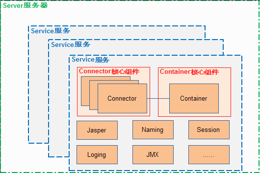
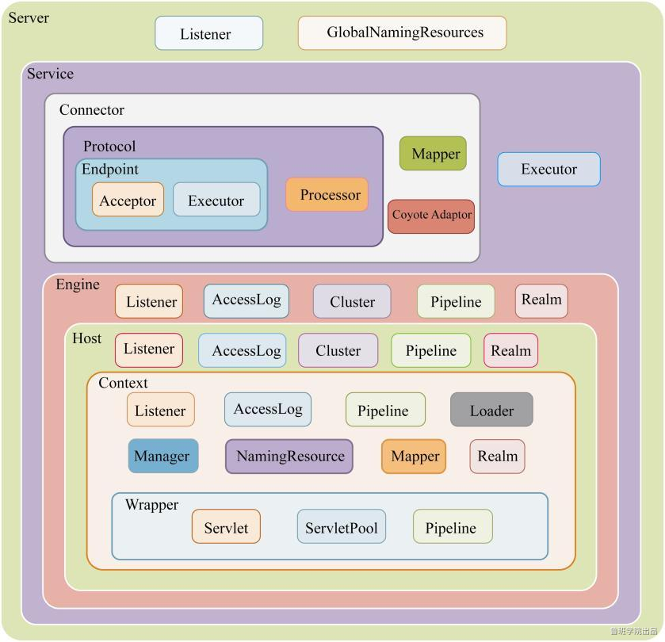
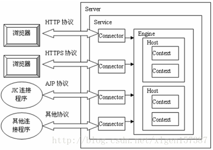
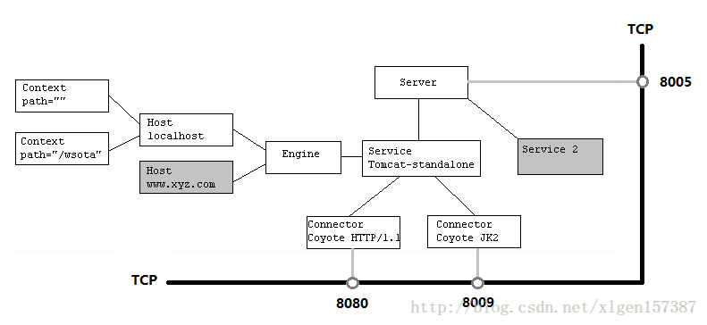
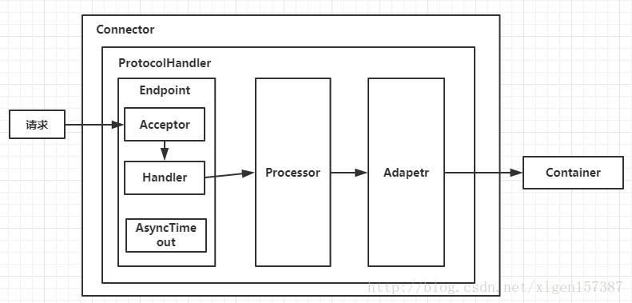
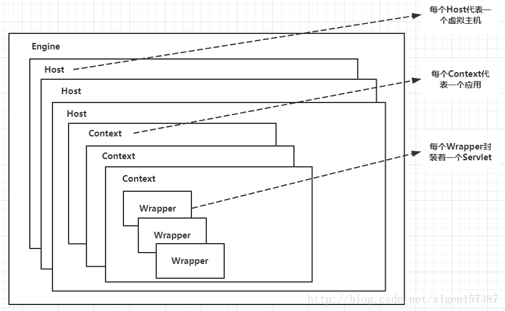
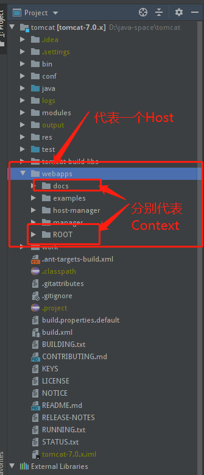
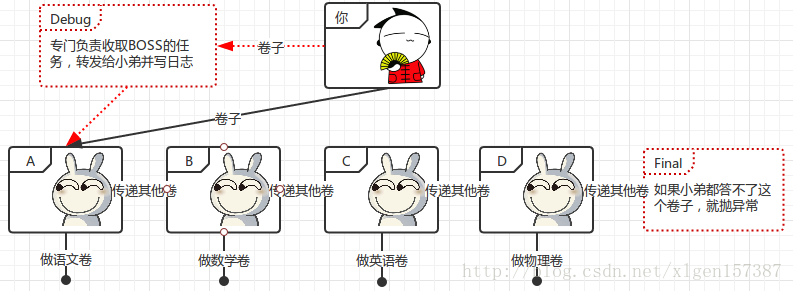
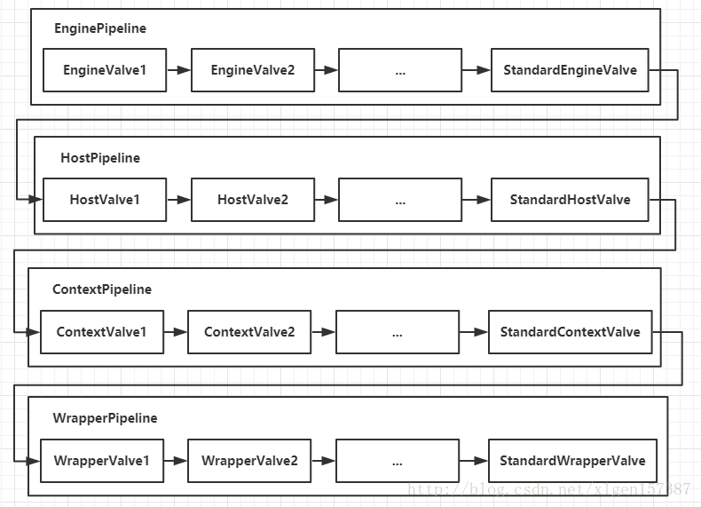

###  tomcat 介绍
   1.一款开源的轻量级的jsp服务器软件，
   
   2.tomcat是使用最广泛的web应用服务器之一。
   
   3.tomcat源码大部分是用Java编写

### tomcat 总体架构
   
 宏观角度来看:
 
   1.tomcat可以分为两大块，Connector和Container。
    
   2.Connector主要负责接收请求、解析请求后生成request和response (用于处理连接相关的事情，并提供Socket与Request和Response相关的转化)。
   
   3.Container作为服务器的的处理容器，其主要职责是将请求映射到具体的servlet，在servlet处理完请求后生成response，交给Connector写入到Socket，返回给客户端。
   
   4.一个Web应用中可以有多个Connector连接器(默认情况下，在server.xml中设置了两个Connector，分别对应处理不同的请求，普通HTTP请求8080端口和AJP协议的8009端口)，但只有一个根Container容器(即Engine)。
   
   5.Connector和Container构成了一个Service服务，最后Server作为Service的父结构，负责整个service的生命周期。Serve、Service、Connector、Connector之间的关系可以从server.xml文件中表现出来（见代码清单1）。
   
   6.Tomcat中只有一个Server，一个Server可以有多个Service，一个Service可以有多个Connector和一个Container；
   
   tomcat的整体架构如下图所示。
     
   
   
   
   
   
```
<Server port="8005" shutdown="SHUTDOWN" 
  <Listener className="org.apache.catalina.startup.VersionLoggerListener" />
  <Listener className="org.apache.catalina.core.AprLifecycleListener" SSLEngine="on" />
  <Listener className="org.apache.catalina.core.JreMemoryLeakPreventionListener" />
  <Listener className="org.apache.catalina.mbeans.GlobalResourcesLifecycleListener" />
  <Listener className="org.apache.catalina.core.ThreadLocalLeakPreventionListener" />
  <GlobalNamingResources>
    <Resource name="UserDatabase" auth="Container"
              type="org.apache.catalina.UserDatabase"
              description="User database that can be updated and saved"
              factory="org.apache.catalina.users.MemoryUserDatabaseFactory"
              pathname="conf/tomcat-users.xml" />
  </GlobalNamingResources>
  <Service name="Catalina">
    <!--处理HTTP请求连接的Connector，端口号为8080-->
    <Connector port="8080" protocol="HTTP/1.1"
               connectionTimeout="20000"
               redirectPort="8443" />
    <!--处理AJP请求连接的Connector，端口号为8443-->
    <Connector port="8009" protocol="AJP/1.3" redirectPort="8443" /> 
    <Engine name="Catalina" defaultHost="localhost">
      <Realm className="org.apache.catalina.realm.LockOutRealm">
        <Realm className="org.apache.catalina.realm.UserDatabaseRealm"
               resourceName="UserDatabase"/>
      </Realm>

      <Host name="localhost"  appBase="webapps"
            unpackWARs="true" autoDeploy="true">
        <Valve className="org.apache.catalina.valves.AccessLogValve" directory="logs"
               prefix="localhost_access_log" suffix=".txt"
               pattern="%h %l %u %t &quot;%r&quot; %s %b" />
      </Host>
    </Engine>
  </Service>
</Server>
```

#### 配置文件 server.xml
   
   Server标签设置的端口号为8005，shutdown=”SHUTDOWN” ，表示在8005端口监听“SHUTDOWN”命令，如果接收到了就会关闭Tomcat。
   
   一个Server有一个Service，当然还可以进行配置，一个Server有多个Service，Service左边的内容都属于Container的，Service下边是Connector。
   
   

### Connector和Container的微妙关系

   1.一个请求发送到Tomcat之后，首先经过Service然后会交给我们的Connector，
   
   2.Connector用于接收请求并将接收的请求封装为Request和Response来具体处理，Request和Response封装完之后再交由Container进行处理，
   
   3.Container处理完请求之后再返回给Connector，
   
   4.最后在由Connector通过Socket将处理的结果返回给客户端，这样整个请求的就处理完了！
   
   Connector最底层使用的是Socket来进行连接的，Request和Response是按照HTTP协议来封装的，所以Connector同时需要实现TCP/IP协议和HTTP协议

### Connector 分析
    
   Connector用于接受请求并将请求封装成Request和Response，然后交给Container进行处理，Container处理完之后在交给Connector返回给客户端。
    
   
   
   
   Connector就是使用ProtocolHandler来处理请求的，不同的ProtocolHandler代表不同的连接类型，比如：Http11Protocol使用的是普通Socket来连接的，Http11NioProtocol使用的是NioSocket来连接的。
   
   其中ProtocolHandler由包含了三个部件：Endpoint、Processor、Adapter。
   
   （1）Endpoint用来处理底层Socket的网络连接，Processor用于将Endpoint接收到的Socket封装成Request，Adapter用于将Request交给Container进行具体的处理。
   
   （2）Endpoint 由于是处理底层的Socket网络连接，因此Endpoint是用来实现TCP/IP协议的，而Processor用来实现HTTP协议的，Adapter将请求适配到Servlet容器进行具体的处理。
   
   （3）Endpoint的抽象实现AbstractEndpoint里面定义的Acceptor和AsyncTimeout两个内部类和一个Handler接口。
    Acceptor用于监听请求，AsyncTimeout用于检查异步Request的超时，Handler用于处理接收到的Socket，在内部调用Processor进行处理。
   
### Container 分析

   Container用于封装和管理Servlet，以及具体处理Request请求，在Container内部包含了4个子容器，结构图如下：
   
   
   
   4个子容器的作用分别是：
   
   （1）Engine：引擎，用来管理多个站点，一个Service最多只能有一个Engine；
   
   （2）Host：代表一个站点，也可以叫虚拟主机，通过配置Host就可以添加站点；
   
   （3）Context：代表一个应用程序，对应着平时开发的一套程序，或者一个WEB-INF目录以及下面的web.xml文件；
   
   （4）Wrapper：每一Wrapper封装着一个Servlet（准确的说是一类servlet）；
   
   Tomcat的文件目录对照，如下图:
   
   
   
   Context和Host的区别是Context表示一个应用,Host 表示站点，我们的Tomcat中默认的配置下webapps下的每一个文件夹目录都是一个Context，其中ROOT目录中存放着主应用，其他目录存放着子应用，
   而整个webapps就是一个Host站点。
   
   我们访问应用Context的时候，如果是ROOT下的则直接使用域名就可以访问，例如：www.wenliangzwl.com,如果是Host（webapps）下的其他应用，则可以使用www.ledouit.com/docs进行访问，
   当然默认指定的根应用（ROOT）是可以进行设定的，只不过Host站点下默认的主应用是ROOT目录下的。

### Container 是怎样处理请求的

   Container处理请求是使用Pipeline-Valve管道来处理的！（Valve是阀门之意）
   
   Pipeline-Valve是责任链模式，责任链模式是指在一个请求处理的过程中有很多处理者依次对请求进行处理，每个处理者负责做自己相应的处理，
   处理完之后将处理后的请求返回，再让下一个处理着继续处理。
   
   
   
   但Pipeline-Valve使用的责任链模式和普通的责任链模式有些不同！区别主要有以下两点：
      
      （1）每个Pipeline都有特定的Valve，而且是在管道的最后一个执行，这个Valve叫做BaseValve，BaseValve是不可删除的；
      
      （2）在上层容器的管道的BaseValve中会调用下层容器的管道。
      
      我们知道Container包含四个子容器，而这四个子容器对应的BaseValve分别在：StandardEngineValve、StandardHostValve、StandardContextValve、StandardWrapperValve。
   
   Pipeline 的处理流程图如下:
   
   
   
   （1）Connector在接收到请求后会首先调用最顶层容器的Pipeline来处理，这里的最顶层容器的Pipeline就是EnginePipeline（Engine的管道）；
   
   （2）在Engine的管道中依次会执行EngineValve1、EngineValve2等等，最后会执行StandardEngineValve，在StandardEngineValve中会调用Host管道，然后再依次执行Host的HostValve1、HostValve2等，最后在执行StandardHostValve，然后再依次调用Context的管道和Wrapper的管道，最后执行到StandardWrapperValve。
   
   （3）当执行到StandardWrapperValve的时候，会在StandardWrapperValve中创建FilterChain，并调用其doFilter方法来处理请求，这个FilterChain包含着我们配置的与请求相匹配的Filter和Servlet，其doFilter方法会依次调用所有的Filter的doFilter方法和Servlet的service方法，这样请求就得到了处理！
   
   （4）当所有的Pipeline-Valve都执行完之后，并且处理完了具体的请求，这个时候就可以将返回的结果交给Connector了，Connector在通过Socket的方式将结果返回给客户端。

### 部署应用的三种方式
   1. 描述符部署
   
   2. War包部署
   
   3. 文件夹部署
   
   另外Tomcat中是使用异步多线程的方式部署应用的
  
  源码体现
```
// package org.apache.catalina.startup.HostConfig

    protected void deployApps() {

        File appBase = appBase();
        File configBase = configBase();
        String[] filteredAppPaths = filterAppPaths(appBase.list());
        // Deploy XML descriptors from configBase
        // 描述符部署
        deployDescriptors(configBase, configBase.list());
        // Deploy WARs
        // war包部署
        deployWARs(appBase, filteredAppPaths);
        // Deploy expanded folders
        // 文件夹部署
        deployDirectories(appBase, filteredAppPaths);

    }
```

####  描述符部署
   
   描述符部署，在 host 里 配置Context ，path 为访问根路径， docBase 为 项目文件位置
   
```
  <Host name="localhost"  appBase="webapps"
            unpackWARs="true" autoDeploy="true">

        <!-- 描述符部署 -->
        <Context path="/HelloLuban" relaodable="false" docBase="/Users/renyong/IdeaProjects/HelloServlet/target/HelloServlet"/>

        <Valve className="org.apache.catalina.valves.AccessLogValve" directory="logs"
               prefix="localhost_access_log." suffix=".txt"
               pattern="%h %l %u %t &quot;%r&quot; %s %b" />

      </Host>
```

####  War包部署
   
   将war 包放至webapps 文件夹下即可，启动tomcat 会将 war 包 解压为文件夹，访问路径为解压文件夹名，类似文件夹部署。
   
   为什么启动tomcat 会自动将 war 包解压，因为 在 server.xml 中 host 标签内 有一个 unpackWARs="true" 属性 ，为true 会自动将 war 包解压

#### 文件夹部署
   
   将文件夹 放至webapps 文件夹下即可，访问根路径即为 文件夹名